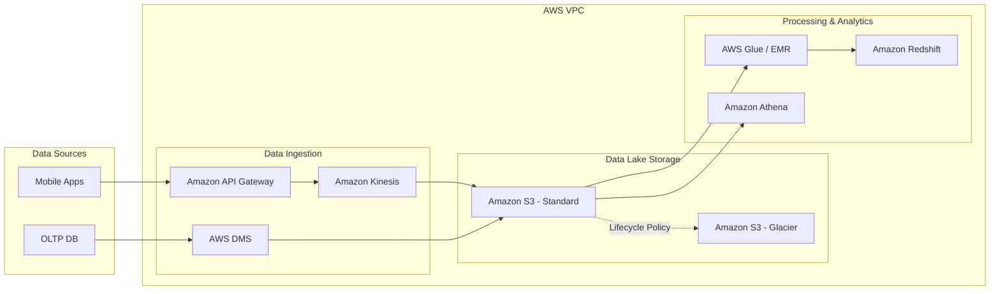

Công nghệ điện toán đám mây (Cloud Computing) đã trở thành tiêu chuẩn mặc định của hầu hết các hệ thống dữ liệu hiện đại. Tuy nhiên, sự tiện lợi và linh hoạt của Cloud luôn đi kèm với một cái giá rất đắt nếu chúng ta thiết kế sai lầm. Một câu truy vấn BigQuery viết cẩu thả có thể "đốt sạch" hàng ngàn USD trong vài giây; hay một cổng mạng VPC cấu hình sai có thể làm rò rỉ dữ liệu nhạy cảm của hàng triệu khách hàng ra ngoài Internet. 

Vòng phỏng vấn **Cloud Platform** ra đời không phải để kiểm tra xem bạn có thuộc lòng danh sách hàng trăm tên gọi dịch vụ của AWS, GCP hay Azure hay không. Người phỏng vấn thực sự muốn đánh giá tư duy thiết kế kiến trúc phân tán (Distributed Architecture) của bạn, cách bạn cân bằng giữa hiệu năng và chi phí (tư duy FinOps), cũng như khả năng xây dựng một hệ thống dữ liệu "Vững chắc, Bảo mật và Tối ưu hóa".

---

## Bản chất của các câu hỏi Cloud Platform

Trong vai trò là một Data Engineer, bạn cần có khả năng lắp ráp khéo léo các mảnh ghép dịch vụ đám mây (Lưu trữ, Tính toán, Mạng, Bảo mật) để tạo nên một đường ống dữ liệu (data pipeline) hoàn chỉnh. 

Bạn phải trả lời được một cách thuyết phục các câu hỏi kiểu như:
* Tại sao bạn lại chọn lưu trữ trên Amazon S3 thay vì EBS?
* Khi nào nên chạy các tác vụ Apache Spark trên dịch vụ Managed (như AWS EMR) và khi nào nên tự quản lý trên cụm Kubernetes (như AWS EKS)?
* Làm thế nào để thiết lập các chính sách phân quyền IAM để đảm bảo dữ liệu không bị rò rỉ?

---

## Ba trụ cột vàng cấu thành nên kiến trúc đám mây vững chắc

* **Lựa chọn dịch vụ phù hợp (Service Selection)**: Thể hiện sự hiểu biết sâu sắc về các mô hình dịch vụ IaaS (như EC2 máy ảo), PaaS (dịch vụ được quản lý một phần như EMR, Cloud SQL) và SaaS/Serverless (những kho dữ liệu được quản lý hoàn toàn như [Snowflake](/concepts/2-storage/cloud-data-platform/snowflake/), BigQuery). Luôn đặt lên bàn cân các điểm mạnh và điểm yếu của từng mô hình trước khi đưa ra quyết định.
* **Tối ưu hóa chi phí ([Cost Optimization](/concepts/2-storage/cloud-data-platform/cost-optimization/) / FinOps)**: Đây là một kỹ năng cực kỳ ăn điểm. Hãy chứng minh bạn biết cách tiết kiệm tài nguyên cho doanh nghiệp thông qua việc sử dụng các máy ảo giá rẻ (Spot Instances), tự động tắt/bật hoặc co giãn tài nguyên theo nhu cầu thực tế (Auto-scaling), và phân loại dữ liệu để chuyển các dữ liệu cũ sang tầng lưu trữ lạnh giá rẻ (Cold Storage).
* **Bảo mật và Tuân thủ (Security & Compliance)**: Hãy chứng tỏ bạn luôn đặt tính bảo mật lên hàng đầu bằng cách áp dụng nguyên tắc đặc quyền tối thiểu (Least Privilege) khi phân quyền IAM, mã hóa dữ liệu ở cả hai trạng thái — khi lưu trữ (Encryption at rest) và khi truyền tải (Encryption in transit), cũng như thiết lập các vùng mạng an toàn.

---

## Phương pháp tiếp cận bài toán thiết kế hạ tầng

1. **Làm rõ Quy mô và Ngân sách (Understand Scale & Budget)**: Đặt câu hỏi ngược lại cho người phỏng vấn để xác định lượng dữ liệu và ngân sách cho phép. Nếu là một startup nhỏ cần tối ưu chi phí vận hành, hãy hướng tới kiến trúc Serverless (dùng bao nhiêu trả bấy nhiêu). Nếu là một tập đoàn lớn với lượng truy cập lớn và ổn định 24/7, hãy cân nhắc giải pháp mua trước tài nguyên dài hạn (Provisioned instances) để có giá tốt hơn.
2. **Component Mapping**: Lựa chọn các dịch vụ Cloud tương ứng cho từng công đoạn của luồng dữ liệu (ví dụ trên AWS: nạp dữ liệu bằng Kinesis, lưu trữ thô trên S3, xử lý dữ liệu bằng AWS Glue/EMR và phân tích bằng Amazon Redshift).
3. **Thiết kế tính sẵn sàng cao (High Availability & Disaster Recovery)**: Đảm bảo hệ thống vẫn sống sót nếu một trung tâm dữ liệu gặp sự cố vật lý bằng cách thiết kế đa vùng (Multi-AZ) hoặc đa khu vực (Multi-Region).
4. **Giải trình chi phí (Justify Cost)**: Chủ động giải thích tại sao thiết kế bạn đề xuất lại giúp doanh nghiệp tối ưu chi phí hơn các phương án khác.

---

## Mô hình tham chiếu Modern Data Stack trên AWS

Sơ đồ dưới đây minh họa một kiến trúc [Modern Data Stack](/concepts/1-foundations/system-architecture/data-platform-architecture/) chuẩn mực được thiết kế an toàn trong mạng ảo VPC của AWS:

---

## Tình huống thực chiến: Giải cứu cụm Hadoop đắt đỏ

**Đề bài từ người phỏng vấn**: *"Công ty chúng tôi đang tốn khoảng 50,000 USD/tháng để tự vận hành một cụm Hadoop trên các máy ảo EC2. Hệ thống chạy rất chậm vào ban ngày do lượng truy cập cao, nhưng lại hoàn toàn rảnh rỗi vào ban đêm. Bạn sẽ tối ưu chi phí và hiệu năng cho hệ thống này như thế nào?"*

**Cách giải quyết thông minh (Tư duy FinOps)**:
* **Tách rời tầng tính toán và tầng lưu trữ**: Không tiếp tục sử dụng hệ thống tệp tin phân tán HDFS trên các máy ảo EC2 nữa. Hãy chuyển toàn bộ dữ liệu lịch sử xuống lưu trữ trên Amazon S3 (chi phí lưu trữ trên S3 rẻ hơn khoảng 10 lần so với đĩa EBS gắn liền máy ảo).
* **Chuyển sang cụm tính toán tạm thời (Ephemeral Clusters)**: Thay thế cụm EC2 chạy 24/7 bằng dịch vụ Amazon EMR. Vào ban ngày khi cần xử lý dữ liệu, hệ thống tự động kích hoạt cụm EMR để tính toán. Đến ban đêm khi rảnh rỗi, ta tắt cụm EMR này đi hoàn toàn. Dữ liệu lịch sử vẫn được bảo vệ an toàn tuyệt đối trên S3. Thao tác này có thể giúp công ty tiết kiệm ngay 50% chi phí.
* **Tận dụng Spot Instances**: Cấu hình cụm Spark/EMR sử dụng Spot Instances cho các node chuyên tính toán (Task Nodes) thay vì mua máy ảo trả phí theo giờ thông thường (On-Demand). Spot Instances có giá rẻ hơn từ 70% đến 90%. Nếu AWS có thu hồi máy ảo giữa chừng, cơ chế tự phục hồi của Spark sẽ tự động chạy lại các task đó trên các node khác mà không làm hỏng toàn bộ job.

---

## Điểm mạnh và điểm yếu

Khi xây dựng hạ tầng dữ liệu trên Cloud, sự đánh đổi lớn nhất là giữa việc sử dụng **Dịch vụ được quản lý hoàn toàn (Managed Services - PaaS/SaaS)** và việc tự cài đặt và vận hành trên máy ảo EC2/Compute Engine **(Self-hosted - IaaS)**:

### Giải pháp Dịch vụ được quản lý (Managed Services)
* **Điểm mạnh (Pros)**: Tiết kiệm tối đa thời gian vận hành. Nhà cung cấp Cloud tự động vá lỗi bảo mật, nâng cấp phiên bản và sao lưu dữ liệu. Thời gian triển khai (Time-to-market) cực kỳ nhanh.
* **Điểm yếu (Cons)**: Chi phí hóa đơn dịch vụ đắt hơn rất nhiều. Ít khả năng tự can thiệp cấu hình hệ thống sâu bên dưới, và có rủi ro bị phụ thuộc hoàn toàn vào một nhà cung cấp (Vendor Lock-in).

### Giải pháp Tự vận hành trên máy ảo (Self-hosted)
* **Điểm mạnh (Pros)**: Chủ động hoàn toàn về mặt công nghệ, dễ dàng di chuyển sang nhà cung cấp khác. Chi phí thuê phần cứng thô rất rẻ nếu chạy tải lớn và liên tục.
* **Điểm yếu (Cons)**: Chi phí con người cao. Doanh nghiệp bắt buộc phải duy trì một đội ngũ SRE/DevOps trực chiến 24/7 để cấu hình, bảo trì, vá lỗi hệ thống và xử lý sự cố đĩa đệm.

---

## Khi nào nên dùng

* **Nên dùng Managed/Serverless**: Thích hợp cho các startup hoặc dự án mới, nơi nguồn lực kỹ sư vận hành còn mỏng, cần tập trung tối đa vào việc viết logic nghiệp vụ để ra sản phẩm nhanh.
* **Nên dùng Self-hosted**: Phù hợp cho các doanh nghiệp công nghệ lớn đã có đội ngũ hạ tầng chuyên nghiệp, có lượng công việc tính toán đều đặn ổn định chạy 24/7 ở quy mô khổng lồ (giúp giảm đáng kể chi phí so với trả tiền theo giờ cho nhà cung cấp Cloud).
* **Nên dùng Spot Instances**: Chỉ dùng cho các node chuyên tính toán tạm thời của cụm (như Spark Task Nodes) trong các job batch không khẩn cấp, nơi job có thể chịu được việc AWS thu hồi tài nguyên mà không làm sập toàn bộ luồng.

---

## Trọng tâm ôn luyện phỏng vấn

Dưới đây là 3 tình huống phỏng vấn thực tế giả định kiểm tra tư duy thiết kế hạ tầng đám mây:

### Tình huống 1: Giải quyết lỗi HTTP 503 Slow Down khi ghi dữ liệu lên S3 Data Lake
**Câu hỏi**: *"Luồng ghi dữ liệu streaming thời gian thực của chúng tôi xuống Amazon S3 liên tục bị nghẽn mạng và nhận lỗi HTTP 503 Slow Down, ảnh hưởng nghiêm trọng đến SLA nạp dữ liệu. Bạn hãy chẩn đoán nguyên nhân và đưa ra giải pháp khắc phục."*

**Trả lời (Khung STAR)**:
* **Situation**: Luồng streaming ghi xuống S3 bị nghẽn do nhận hàng loạt lỗi HTTP 503 Slow Down.
* **Task**: Chẩn đoán nguyên nhân vật lý của S3 và refactor cấu trúc thư mục hoặc cơ chế ghi để loại bỏ lỗi nghẽn.
* **Action**:
  1. *Chẩn đoán*: Amazon S3 giới hạn thông lượng request ở mức 3,500 lệnh PUT/POST/DELETE và 5,500 lệnh GET mỗi giây trên mỗi prefix (thư mục con). Lỗi HTTP 503 xảy ra do luồng streaming ghi quá nhiều file nhỏ vào cùng một prefix dạng `s3://my-bucket/events/2026-06-12/10/...` trong cùng một giây.
  2. *Giải pháp*: Tôi sẽ áp dụng chiến lược phân tán prefix bằng cách thêm một chuỗi băm (hash string) hoặc ID ngẫu nhiên vào đầu đường dẫn lưu trữ để phân tán tải ghi sang các phân vùng vật lý khác nhau của S3:
     `s3://my-bucket/events/<random-hash>/year=2026/month=06/day=12/...`
  3. Tôi refactor code ghi dữ liệu streaming để gom cụm (batching/micro-batch) dữ liệu trong bộ nhớ RAM trước khi ghi xuống S3 để tăng kích thước file và giảm số lượng request PUT đồng thời.
* **Result**: Lỗi HTTP 503 biến mất hoàn toàn, thông lượng ghi tăng gấp 5 lần mà không phát sinh thêm bất kỳ chi phí hạ tầng nào.

### Tình huống 2: Tối ưu hóa hóa đơn BigQuery nhảy vọt từ $2k lên $15k
**Câu hỏi**: *"Tháng trước, hóa đơn sử dụng Google BigQuery của đội phân tích nhảy vọt từ 2,000 USD lên 15,000 USD. Người phỏng vấn phát hiện nguyên nhân do các dashboard ad-hoc quét qua toàn bộ bảng dữ liệu lịch sử sự kiện. Bạn sẽ thiết kế giải pháp FinOps nào để kiểm soát chi phí này?"*

**Trả lời (Khung STAR)**:
* **Situation**: Chi phí BigQuery tăng đột biến do các truy vấn ad-hoc thực hiện quét toàn bộ bảng dữ liệu thô (Full Table Scan).
* **Task**: Tái cấu trúc bảng và thiết lập cơ chế giới hạn tài nguyên để kiểm soát dung lượng dữ liệu quét qua.
* **Action**:
  1. *Phân cấu trúc (Partitioning)*: Tôi cấu hình phân vùng bảng lịch sử sự kiện theo ngày (`event_date`). Các câu truy vấn bắt buộc phải đi kèm điều kiện lọc ngày để BigQuery chỉ quét qua đúng phân vùng tương ứng (Partition Pruning).
  2. *Gom cụm (Clustering)*: Trong mỗi phân vùng, tôi cấu hình clustering theo các cột thường xuyên được dùng để lọc hoặc join như `customer_id` hay `event_type`.
  3. *Thiết lập Hạn mức (Quotas)*: Cấu hình hạn mức tối đa cho phép quét qua của mỗi query ad-hoc (ví dụ: giới hạn tối đa 50GB/query) và thiết lập cảnh báo hóa đơn tự động bằng Cloud Monitoring.
  4. Bật tính năng BigQuery BI Engine để cache các kết quả truy vấn thường xuyên xuất hiện trên các dashboard của ban giám đốc.
* **Result**: Dung lượng quét dữ liệu giảm đến 90%, đưa chi phí BigQuery hàng tháng trở về mức an toàn dưới 1,500 USD trong khi tốc độ hiển thị dashboard tăng lên đáng kể.

### Tình huống 3: Khắc phục lỗ hổng bảo mật rò rỉ mã khóa API Admin tối cao
**Câu hỏi**: *"Trong một đợt rà soát an ninh mạng, chúng tôi phát hiện ra các lập trình viên đang nhúng trực tiếp mã khóa AWS Access Key / Secret Key có quyền AdministratorAccess vào mã nguồn ứng dụng chạy trên EC2, đồng thời một số S3 bucket chứa dữ liệu cá nhân khách hàng (PII) đang để cấu hình công khai (public). Bạn sẽ xử lý thế cố này thế nào?"*

**Trả lời (Khung STAR)**:
* **Situation**: Rò rỉ thông tin an ninh mạng nghiêm trọng do nhúng cứng thông tin phân quyền và công khai các thư mục chứa dữ liệu nhạy cảm.
* **Task**: Thu hồi thông tin rò rỉ, thiết lập cơ chế ủy quyền ngắn hạn và thắt chặt bảo mật thư mục lưu trữ dữ liệu PII.
* **Action**:
  1. *Khẩn cấp*: Lập tức vô hiệu hóa (Deactivate) mã khóa Access Key bị rò rỉ trên IAM Console để chặn truy cập trái phép.
  2. *Ủy quyền qua IAM Roles*: Thay vì dùng Access Key cố định, tôi cấu hình một IAM Instance Profile gắn trực tiếp một **IAM Role** cho máy ảo EC2. Ứng dụng chạy trên EC2 sẽ tự động gọi AWS STS để lấy thông tin xác thực tạm thời có thời hạn hiệu lực ngắn (1 giờ).
  3. *Thắt chặt bảo mật S3*: Bật cấu hình "Block Public Access" trên toàn bộ S3 bucket. Cấu hình Bucket Policy chỉ cho phép truy cập từ dải mạng nội bộ (VPC Endpoint).
  4. Mã hóa toàn bộ dữ liệu trên S3 ở trạng thái nghỉ bằng khóa do khách hàng quản lý (KMS Customer Managed Keys) để kiểm soát quyền giải mã chi tiết.
* **Result**: Hệ thống đạt chứng chỉ bảo mật cao nhất, loại bỏ hoàn toàn rủi ro rò rỉ mã khóa an ninh trên git repository.

---

## English Summary

The Cloud Platform Interview focuses on evaluating a candidate's ability to architect distributed data systems using public cloud providers (AWS, GCP, Azure) while balancing performance, security, and cost. Candidates must demonstrate FinOps thinking (e.g., separating storage from compute, using spot instances, applying data lifecycle policies to cold storage) and choose the appropriate abstraction level (IaaS, PaaS, or Serverless/SaaS) for the use case. Familiarity with networking (VPC), Identity Access Management (IAM/Least Privilege), and mitigating data transfer costs are critical factors to succeed in this round.

---

## Xem thêm các khái niệm liên quan

* [Cost Optimization (Tối ưu chi phí)](../concepts/2-storage/cloud-data-platform/cost-optimization/) - Các chiến lược FinOps trong doanh nghiệp.
* [Cloud Data Storage](../concepts/2-storage/cloud-data-platform/cloud-storage/) - So sánh các dịch vụ lưu trữ AWS, GCP và Azure.
* [Snowflake Platform](../concepts/2-storage/cloud-data-platform/snowflake/) - Nền tảng SaaS Data Platform hiện đại.

---

## Tài liệu tham khảo

1. [AWS Well-Architected Framework Official Design Principles](https://docs.aws.amazon.com/wellarchitected/latest/reliability-pillar/welcome.html)
2. [Google Cloud Architecture Framework - Design Guide for Data Pipelines](https://cloud.google.com/architecture/framework)
3. [Microsoft Azure Well-Architected Framework Reference Architecture](https://learn.microsoft.com/en-us/azure/well-architected/)
4. [FinOps Foundation Official Framework and Standards Guidelines](https://www.finops.org/framework/)
5. [Snowflake Security Best Practices and Hardening Recommendations](https://docs.snowflake.com/en/user-guide/security-recommendations)
