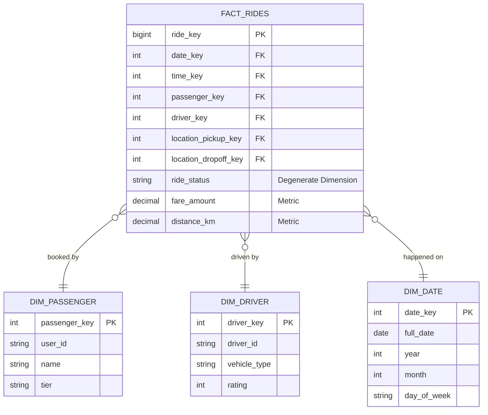

Vòng phỏng vấn Data Modeling có một đặc điểm khác hẳn vòng SQL: không có đáp án đúng tuyệt đối. Người phỏng vấn đưa ra một mô hình kinh doanh quen thuộc — ứng dụng gọi xe, sàn thương mại điện tử, nền tảng đặt phòng — rồi yêu cầu bạn thiết kế lược đồ [Data Warehouse](/concepts/1-distributed-systems-architecture/data-warehouse) phục vụ phân tích. Thứ được chấm không phải bản vẽ cuối cùng, mà là chuỗi quyết định của bạn: chọn grain nào, denormalize đến đâu, lưu lịch sử ra sao, và bạn có nói được *tại sao* cho từng lựa chọn hay không.

Vì vậy, cách ôn hiệu quả nhất không phải học thuộc vài sơ đồ mẫu, mà là nắm quy trình thiết kế và các trade-off đứng sau nó.

---

## Vì sao không dùng luôn lược đồ 3NF của hệ thống nguồn

Hệ thống vận hành (OLTP) tổ chức dữ liệu theo chuẩn hóa mức 3 (3NF) để tối ưu tốc độ ghi và tránh cập nhật trùng lặp. Cấu trúc đó hợp lý cho việc xử lý từng giao dịch, nhưng trở thành gánh nặng khi phân tích: một câu hỏi đơn giản như "doanh thu tháng 3 theo khu vực" có thể cần JOIN 10-15 bảng, chậm và dễ sai.

Dimensional modeling giải quyết đúng vấn đề này: tổ chức lại dữ liệu quanh các sự kiện đo lường được (fact) và ngữ cảnh của chúng (dimension), chấp nhận dư thừa để đổi lấy truy vấn đơn giản và nhanh trong môi trường [OLAP](/concepts/3-storage-engines-formats/olap). Nó không thay thế mô hình 3NF ở hệ thống nguồn — hai mô hình phục vụ hai loại workload khác nhau, và ứng viên nói rõ được điều này thường được đánh giá cao hơn ứng viên coi Star Schema là "chuẩn duy nhất".

---

## Quy trình 4 bước của Kimball — khung xương của mọi câu trả lời

Phương pháp [Dimensional Modeling](/concepts/6-data-modeling-transformation/dimensional-modeling) mà Ralph Kimball hệ thống hóa trong *The Data Warehouse Toolkit* đưa ra 4 bước thiết kế. Trong phỏng vấn, đi qua đủ 4 bước này một cách có chủ đích đã là một nửa điểm số:

1. **Chọn quy trình nghiệp vụ (business process)**: xác định bạn phân tích quy trình nào — giao dịch mua hàng, đăng ký tài khoản, giao vận. Mỗi quy trình thường sinh ra một bảng fact riêng.
2. **Tuyên bố grain**: một dòng trong bảng fact đại diện cho cái gì? Đây là bước quan trọng nhất và cũng là nơi ứng viên sai nhiều nhất. [Grain](/concepts/6-data-modeling-transformation/grain) phải được phát biểu thành câu hoàn chỉnh trước khi vẽ bất kỳ bảng nào — ví dụ "một dòng là một món hàng trong một đơn", không phải "bảng này lưu đơn hàng".
3. **Xác định dimension**: trả lời *ai, cái gì, ở đâu, khi nào* quanh sự kiện — người dùng, tài xế, địa điểm, thời gian.
4. **Xác định fact**: các số liệu đo được, cộng gộp được — số tiền, quãng đường, số lượng.

Thứ tự này không ngẫu nhiên. Chọn grain trước khi chọn dimension vì grain quyết định dimension nào hợp lệ; chọn dimension trước fact vì fact phải nhất quán với grain đã tuyên bố.

---

## Cách dẫn dắt một buổi whiteboard interview

Đừng vẽ bảng ngay khi nghe xong đề. Trình tự sau giúp câu trả lời có cấu trúc và tránh phải xóa đi vẽ lại giữa chừng:

* **Hỏi về metrics trước**: dashboard cuối cùng cần trả lời câu hỏi gì? Doanh thu theo tháng? Retention? Tỷ lệ hủy đơn? Mô hình dữ liệu tồn tại để phục vụ câu hỏi phân tích, nên phải biết câu hỏi trước.
* **Phát biểu grain thành lời** và xác nhận với người phỏng vấn trước khi thiết kế bảng.
* **Liệt kê dimension kèm thuộc tính chính**, dùng khóa nhân tạo ([Surrogate Key](/concepts/6-data-modeling-transformation/surrogate-key)) thay vì ID hệ thống nguồn.
* **Thiết kế bảng fact**: khóa ngoại trỏ tới dimension, các cột đo lường đúng grain.
* **Chủ động nêu phần nâng cao**: xử lý lịch sử thay đổi (SCD Type 2), degenerate dimension (mã đơn hàng nằm thẳng trong fact), junk dimension (gom các cờ trạng thái rời rạc). Đây là phần phân biệt ứng viên trung bình với ứng viên tốt.

---

## Ví dụ: Star Schema cho ứng dụng gọi xe

Sơ đồ [Star Schema](/concepts/6-data-modeling-transformation/star-schema) tối giản cho dịch vụ ride-hailing, grain = một chuyến xe hoàn thành:

Lưu ý cột `ride_status`: nó nằm trong bảng fact nhưng không phải số đo — đó là degenerate dimension, một thuộc tính không đáng tách thành bảng riêng. Nói được tên kỹ thuật này khi vẽ là một điểm cộng rẻ.

---

## Bài tập thực chiến: kho dữ liệu cho Airbnb

**Đề bài**: *"Thiết kế mô hình dữ liệu cho Airbnb để phân tích doanh thu của chủ nhà (host) và tỷ lệ lấp đầy phòng (occupancy rate) theo khu vực."*

**Lời giải theo 4 bước**:

* **Business process**: quá trình lưu trú thực tế của khách.
* **Grain**: một dòng = **một đêm lưu trú** (room-night) của một booking cụ thể.

> [!TIP]
> Grain là bẫy chính của đề này. Phản xạ tự nhiên là chọn "một dòng = một booking", nhưng một booking có thể vắt qua hai tháng (28/12 → 03/01). Với grain booking, tính doanh thu đúng theo tháng hoặc occupancy theo ngày buộc phải "bung" từng booking ra từng đêm ngay trong câu truy vấn — phức tạp và chậm. Chọn grain room-night, phép tính chỉ còn là `SUM` và `AVG` trên bảng fact. Đây là ví dụ điển hình cho nguyên tắc của Kimball: grain mịn nhất có thể thì linh hoạt nhất.

* **Dimensions**: `dim_date` (ngày lưu trú), `dim_listing` (loại phòng, số giường, giá niêm yết), `dim_host` (hạng superhost, thâm niên), `dim_guest`, `dim_location` (thành phố, quốc gia).
* **Facts**: bảng `fact_daily_stays` với các khóa ngoại trên và các cột đo: `amount_paid` (doanh thu phân bổ theo đêm), `service_fee`, `cleaning_fee`, và `is_occupied` (0/1 — occupancy rate trở thành một phép `AVG` đơn thuần).

---

## Ba nguyên tắc thiết kế đáng nói ra trong phỏng vấn

**Dùng surrogate key, không dùng ID hệ thống nguồn.** Khóa nhân tạo kiểu số nguyên tự tăng giúp JOIN nhanh hơn UUID dạng chuỗi, cách ly warehouse khỏi thay đổi của hệ thống nguồn, và là điều kiện bắt buộc nếu muốn lưu lịch sử bằng SCD Type 2 — vì một thực thể khi đó có nhiều dòng, natural key không còn là khóa duy nhất được nữa.

**Xây bảng `dim_date` riêng.** Thay vì rải hàm xử lý ngày tháng khắp các truy vấn, một bảng date dimension với các cờ tính sẵn (`is_holiday`, `is_weekend`, `fiscal_quarter`) chuẩn hóa logic thời gian về một chỗ. Lịch nghỉ lễ hay năm tài chính của công ty không suy ra được từ hàm `EXTRACT` — chúng phải là dữ liệu.

**Quy ước đặt tên nhất quán.** Hậu tố `_key` cho khóa của warehouse, `_id` cho mã định danh từ hệ thống nguồn. Nhỏ, nhưng thể hiện bạn đã làm việc trong codebase warehouse thật.

---

## Các lỗi thiết kế người phỏng vấn chờ bạn mắc phải

**Đưa thuộc tính biến động nhanh vào dimension.** Số dư tài khoản, điểm tích lũy — những giá trị thay đổi liên tục — không thuộc về `dim_user`. Nếu đang chạy SCD Type 2, mỗi lần thay đổi sinh một dòng mới và bảng dimension phình không kiểm soát. Các số đo dạng này thuộc về bảng fact (thường là periodic snapshot fact).

**Trộn hai grain trong một bảng fact.** Lưu cả dòng tổng đơn hàng (order header) lẫn dòng chi tiết mặt hàng (order line) chung một bảng nghĩa là mọi phép `SUM` đều có nguy cơ đếm trùng. Một bảng fact, một grain — không có ngoại lệ.

**Snowflake hóa không cần thiết.** Tách `dim_location` thành `dim_city` trỏ tới `dim_country` tiết kiệm được chút dung lượng nhưng đổi bằng thêm JOIN cho mọi truy vấn. Trên warehouse dạng cột hiện đại (BigQuery, Snowflake, Redshift), dung lượng rẻ còn JOIN thì không. Kimball khuyến nghị giữ dimension phẳng, chấp nhận dư thừa; snowflaking chỉ đáng cân nhắc khi dimension cực lớn và thuộc tính có tỷ lệ trùng lặp rất cao.

---

## Star Schema vs 3NF: trả lời sao khi bị hỏi "Kimball hay Inmon?"

Câu hỏi này kiểm tra xem bạn có hiểu đây là trade-off chứ không phải cuộc chiến tôn giáo:

* **Kimball (Star Schema)**: denormalize dimension, cấu trúc phẳng, tối ưu cho truy vấn đọc và các công cụ BI kéo thả. Xây theo từng business process, ra giá trị sớm. Đổi lại: dữ liệu dư thừa, cập nhật dimension tốn công hơn.
* **Inmon (3NF ở lớp warehouse trung tâm)**: nhất quán cao, một phiên bản sự thật, phù hợp tổ chức lớn nhiều nguồn dữ liệu. Đổi lại: triển khai lâu, người dùng cuối vẫn cần data mart dạng dimensional bên trên để truy vấn được.

Thực tế các stack hiện đại (kiểu dbt + cloud warehouse) thường lai: lớp staging/intermediate chuẩn hóa gần 3NF, lớp mart cuối cùng theo dimensional. Trả lời theo hướng "tùy giai đoạn và quy mô tổ chức, và hai cách thường sống chung" sát thực tế hơn là chọn phe.

---

## Ba câu hỏi kinh điển và cách trả lời

### 1. Giải thích các loại Slowly Changing Dimension (SCD)

SCD là kỹ thuật quản lý thay đổi của thuộc tính dimension theo thời gian. Ba loại cốt lõi theo phân loại của Kimball Group:

* **Type 1 — ghi đè**: mất lịch sử, dùng khi sửa lỗi dữ liệu hoặc lịch sử không có giá trị phân tích.
* **Type 2 — thêm dòng mới**: kèm các cột `start_date`, `end_date`, `is_current`. Đây là kỹ thuật chủ lực vì cho phép truy vấn đúng trạng thái của thực thể tại bất kỳ thời điểm nào trong quá khứ. Giá phải trả: bảng to dần và pipeline nạp dữ liệu phức tạp hơn.
* **Type 3 — thêm cột**: lưu đúng một giá trị liền trước (`current_city` / `previous_city`). Ít dùng, phù hợp khi chỉ cần so sánh "trước và sau" một lần tái tổ chức.

Nếu người phỏng vấn hỏi tiếp về Type 4/5/6/7 (mini-dimension, hybrid), thừa nhận chúng tồn tại và nói rõ chúng là biến thể tổ hợp của ba loại trên — trung thực hơn là diễn giải mơ hồ.

### 2. Factless fact table là gì?

Bảng fact không có cột số đo nào, chỉ gồm các khóa ngoại — dùng để ghi nhận *sự kiện đã xảy ra*: sinh viên điểm danh buổi học, khách hàng nhận email khuyến mãi. Phân tích thực hiện qua `COUNT(*)`. Điểm hay để nói thêm: factless fact table còn dùng ghi nhận *sự kiện không xảy ra* (coverage table) — ví dụ sản phẩm được khuyến mãi nhưng không bán được, thứ không thể tìm thấy trong bảng fact bán hàng.

### 3. Xử lý thế nào khi fact đến trước dimension (early-arriving fact)?

Không loại bỏ dòng fact — mất dữ liệu giao dịch là lỗi nặng hơn thiếu ngữ cảnh. Cách xử lý chuẩn: chèn một dòng placeholder vào dimension với surrogate key mới và natural key lấy từ fact, các thuộc tính còn lại để "Unknown"; gán khóa đó cho dòng fact. Khi dữ liệu dimension thật về đến, cập nhật đè lên dòng placeholder (theo kiểu Type 1). Câu trả lời này còn cho thấy bạn hiểu pipeline thật: dữ liệu không bao giờ về đúng thứ tự như trên giấy.

---

## Tài liệu tham khảo

* **The Data Warehouse Toolkit, 3rd Edition — Ralph Kimball & Margy Ross (Wiley)** — tài liệu gốc của dimensional modeling và quy trình 4 bước.
* [Kimball Group — Dimensional Modeling Techniques](https://www.kimballgroup.com/data-warehouse-business-intelligence-resources/kimball-techniques/dimensional-modeling-techniques/) — bản tóm tắt chính thức toàn bộ kỹ thuật, tra cứu nhanh trước phỏng vấn.
* [Kimball Group — Design Tip #152: Slowly Changing Dimension Types 0, 4, 5, 6, 7](https://www.kimballgroup.com/2013/02/design-tip-152-slowly-changing-dimension-types-0-4-5-6-7/) — các biến thể SCD nâng cao.
* [Holistics — Kimball's Dimensional Data Modeling (The Analytics Setup Guidebook)](https://www.holistics.io/books/setup-analytics/kimball-s-dimensional-data-modeling/) — diễn giải hiện đại, đặt Kimball trong bối cảnh cloud warehouse.
* **Agile Data Warehouse Design — Lawrence Corr (DecisionOne Press)** — framework BEAM để khai thác yêu cầu nghiệp vụ, hữu ích cho phần đặt câu hỏi đầu buổi phỏng vấn.