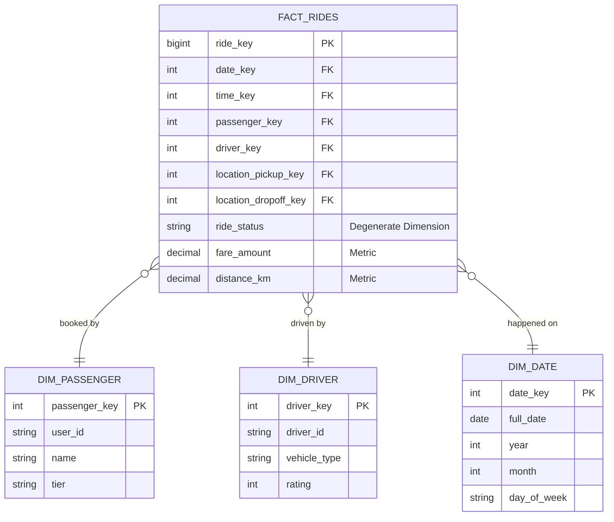

Khi bạn phỏng vấn cho vị trí Data Engineer chuyên về [Data Warehouse](/concepts/2-storage/data-warehouse/data-warehouse/) hoặc Analytics Engineering, vòng **Mô hình hóa dữ liệu** (Data Modeling) luôn là một thử thách bắt buộc và mang tính quyết định. 

Mục tiêu của vòng phỏng vấn này không phải là kiểm tra xem bạn viết SQL giỏi đến mức nào, mà là đánh giá khả năng tư duy logic và kỹ năng chuyển đổi các yêu cầu nghiệp vụ kinh doanh trừu tượng thành các cấu trúc bảng dữ liệu vật lý tối ưu. Người phỏng vấn thường sẽ đưa ra một mô hình kinh doanh quen thuộc (như ứng dụng gọi xe, sàn thương mại điện tử, ứng dụng đặt phòng) và yêu cầu bạn thiết kế kiến trúc kho dữ liệu để phục vụ cho các báo cáo phân tích sau này.

---

## Nghệ thuật biến đổi bài toán kinh doanh thành cấu trúc bảng

Trong các hệ thống vận hành (OLTP), dữ liệu thường được tổ chức theo chuẩn hóa mức 3 (3NF) để tối ưu hóa tốc độ ghi và tránh trùng lặp thông tin. Tuy nhiên, cấu trúc này vô cùng phức tạp với hàng chục bảng liên kết chằng chi phối, khiến việc viết một câu truy vấn báo cáo phân tích (ví dụ: *"Tổng doanh thu tháng 3 theo từng khu vực địa lý"*) trở thành một cực hình với tốc độ chạy rất chậm.

Mô hình hóa dữ liệu là quá trình chúng ta tổ chức lại mớ hỗn độn đó thành một kiến trúc kho dữ liệu gọn gàng (phổ biến nhất là mô hình Star Schema). Mục tiêu là giúp các Data Analyst và Business User có thể dễ dàng kéo thả và viết các câu lệnh truy vấn một cách trực quan, chính xác với hiệu năng tính toán cao nhất.

---

## Quy trình thiết kế 4 bước thần thánh của Kimball

Để xây dựng một mô hình dữ liệu chuẩn phân tích, phương pháp luận [Dimensional Modeling](/concepts/2-storage/data-warehouse/dimensional-modeling/) của Ralph Kimball là một "kim chỉ nam" kinh điển. Bạn cần thể hiện rõ ràng 4 bước tư duy này trước mặt người phỏng vấn:

1. **Chọn quy trình nghiệp vụ (Choose the Business Process)**: Xác định rõ bạn đang muốn phân tích quy trình nào của doanh nghiệp (ví dụ: Giao dịch mua hàng, Đăng ký tài khoản, Giao hàng...).
2. **Tuyên bố mức độ chi tiết (Declare the [Grain](/concepts/2-storage/data-warehouse/grain/))**: Đây là bước quan trọng nhất và dễ bị sai lệch nhất. Bạn cần phát biểu rõ một dòng dữ liệu trong bảng đo lường đại diện cho điều gì? (Ví dụ: Một dòng là một đơn đặt xe thành công, hay một dòng là một món hàng trong giỏ hàng).
3. **Xác định các chiều thông tin (Identify the Dimensions)**: Tìm câu trả lời cho các câu hỏi *Ai? Cái gì? Ở đâu? Khi nào?* để thiết lập các bảng Dimension (Ví dụ: Người dùng, Tài xế, Địa điểm, Thời gian).
4. **Xác định các chỉ số đo lường (Identify the Facts)**: Xác định những số liệu số nào có thể cộng gộp, tính trung bình hoặc thống kê được (Ví dụ: Số tiền thanh toán, Quãng đường di chuyển, Số lượng đơn hàng).

---

## Quy trình thiết kế Data Modeling trên bảng trắng

Trong một buổi phỏng vấn trực tiếp (Whiteboard Interview), hãy dẫn dắt người phỏng vấn qua các bước triển khai bài bản thay vì vẽ bảng ngay lập tức:
* **Lắng nghe và đặt câu hỏi làm rõ**: Hỏi người phỏng vấn xem ban giám đốc hoặc đội ngũ phân tích thực sự muốn theo dõi những chỉ số (metrics) nào trên dashboard.
* **Xác định rõ ràng hạt nhân dữ liệu (Grain)** trước khi thiết kế các bảng.
* **Liệt kê các bảng Dimension**: Liệt kê chi tiết các thuộc tính cho từng bảng, và đừng quên sử dụng khóa nhân tạo (**Surrogate Key**).
* **Thiết kế bảng Fact**: Đặt các khóa ngoại trỏ tới các bảng Dimension, đưa vào các thuộc tính đo lường phù hợp.
* **Đề xuất các kỹ thuật nâng cao**: Thảo luận về cách xử lý lịch sử biến động dữ liệu (SCD Type 2) hoặc cách thiết kế các chiều đặc biệt để ghi điểm.

---

## Thiết kế mô hình dữ liệu cho ứng dụng gọi xe (Ride-Hailing)

Dưới đây là một sơ đồ ERD mẫu thiết kế theo mô hình [Star Schema](/concepts/2-storage/data-warehouse/star-schema/) cho dịch vụ gọi xe công nghệ:

---

## Thực chiến: Thiết kế kho dữ liệu cho dịch vụ Airbnb

**Tình huống phỏng vấn**: *"Hãy thiết kế mô hình dữ liệu cho Airbnb để ban giám đốc phân tích doanh thu của các chủ nhà (Host), tỷ lệ lấp đầy phòng (Occupancy Rate) theo từng khu vực địa lý."*

**Phân tích & Hướng giải quyết**:
* **Bước 1 (Business Process)**: Quá trình lưu trú thực tế của khách thuê phòng.
* **Bước 2 (Grain)**: Mỗi dòng trong bảng Fact sẽ đại diện cho **một đêm lưu trú thực tế** (1 room-night) của một mã đặt phòng (booking) cụ thể.
  > [!TIP]
  > Nhiều ứng viên sẽ chọn Grain là "1 lượt đặt phòng (booking)". Tuy nhiên, một booking có thể kéo dài qua nhiều tháng (ví dụ từ 28/12 đến 03/01). Nếu chọn Grain là booking, việc phân tích doanh thu chính xác theo từng tháng hoặc tính tỷ lệ lấp đầy phòng hàng ngày sẽ trở nên vô cùng phức tạp.
* **Bước 3 (Dimensions)**:
  * `dim_date`: Ngày lưu trú thực tế.
  * `dim_listing`: Thông tin phòng cho thuê (loại phòng, số giường, giá niêm yết).
  * `dim_host`: Thông tin chủ nhà (cấp bậc superhost, số năm tham gia).
  * `dim_guest`: Thông tin người thuê phòng.
  * `dim_location`: Địa điểm phòng (thành phố, quốc gia, mã bưu điện).
* **Bước 4 (Facts)**: Thiết lập bảng `fact_daily_stays` gồm các khóa ngoại liên kết tới các Dimension trên và các chỉ số đo lường: `amount_paid` (doanh thu tính theo ngày), `service_fee`, `cleaning_fee`, và `is_occupied` (gán giá trị 1 hoặc 0 để tính tỷ lệ lấp đầy).

---

## Điểm mạnh và điểm yếu

Khi xây dựng kiến trúc dữ liệu phân tích, hai phương pháp luận Star Schema (Kimball) và lược đồ chuẩn hóa 3NF (Inmon) luôn được mang ra thảo luận:

### Lược đồ Star Schema (Kimball)
* **Điểm mạnh (Pros)**: Hiệu năng đọc truy vấn phân tích (Read Performance) cực kỳ nhanh do số lượng phép JOIN được tối thiểu hóa tối đa. Cấu trúc phẳng đơn giản, rất dễ hiểu đối với các nhà phân tích dữ liệu và thân thiện với các công cụ BI.
* **Điểm yếu (Cons)**: Dư thừa dữ liệu (Data Redundancy) cao ở các bảng Dimension (ví dụ lặp lại thông tin thành phố cho mỗi người dùng). Quá trình tải dữ liệu (Write/Load) phức tạp hơn vì cần duy trì các Surrogate Keys.

### Lược đồ chuẩn hóa 3NF (Inmon)
* **Điểm mạnh (Pros)**: Đảm bảo tính nhất quán dữ liệu tuyệt đối (Data Consistency), dữ liệu không bị trùng lặp, giúp tiết kiệm dung lượng lưu trữ thô.
* **Điểm yếu (Cons)**: Hiệu năng truy vấn phân tích rất chậm do phải JOIN hàng chục bảng với nhau để lấy đầy đủ thông tin báo cáo.

---

## Khi nào nên dùng

* **Nên dùng Star Schema**: Cho các hệ thống kho dữ liệu doanh nghiệp phân tích hiện đại (Cloud Data Warehouse) và các Data Mart phục vụ trực tiếp cho dashboard BI, nơi yêu cầu hiệu năng đọc và trải nghiệm người dùng ad-hoc được đặt lên hàng đầu.
* **Nên dùng 3NF**: Phù hợp cho cơ sở dữ liệu giao dịch vận hành (OLTP) của Backend microservices để duy trì tính nhất quán giao dịch ACID và tránh xung đột khi cập nhật dữ liệu.
* **Nên dùng Snowflake Schema**: Khi bảng Dimension có kích thước vô cùng khổng lồ và chứa thông tin phân cấp sâu (ví dụ bảng phân mục sản phẩm đa cấp của sàn thương mại điện tử lớn), nơi việc chuẩn hóa một phần giúp tiết kiệm đáng kể bộ nhớ đệm RAM khi tính toán.

---

## Trọng tâm ôn luyện phỏng vấn

Dưới đây là 3 tình huống phỏng vấn thực tế giả định kiểm tra tư duy thiết kế lược đồ dữ liệu nâng cao:

### Tình huống 1: Thiết kế phục hồi và đối soát dữ liệu lịch sử SCD Type 2
**Câu hỏi**: *"Một dịch vụ quản lý danh mục sản phẩm (Product Catalog) ở thượng nguồn đã cập nhật hồi tố (retroactively updated) danh mục của hàng loạt sản phẩm từ 6 tháng trước. Việc này làm sai lệch toàn bộ báo cáo doanh thu lịch sử theo ngành hàng của ban giám đốc. Bạn sẽ thiết kế giải pháp phục hồi dữ liệu lịch sử và backfill như thế nào sử dụng SCD Type 2?"*

**Trả lời (Khung STAR)**:
* **Situation**: Dữ liệu danh mục sản phẩm bị cập nhật hồi tố, phá hỏng tính nhất quán của báo cáo lịch sử 6 tháng qua.
* **Task**: Sử dụng kỹ thuật SCD Type 2 để tái tạo lịch sử chính xác tại từng thời điểm (Point-in-time) và chạy lại (Backfill) dữ liệu Fact liên quan.
* **Action**:
  1. *Thiết kế Dimension*: Trong bảng `dim_product`, tôi sử dụng SCD Type 2 với các cột hiệu lực: `start_date`, `end_date`, và `is_current`. Khi có thay đổi danh mục lịch sử, hệ thống sẽ chèn các bản ghi mới có khoảng hiệu lực tương ứng với quá khứ và cập nhật `end_date` của bản ghi cũ.
  2. *Refactor Phép JOIN*: Khi nạp dữ liệu vào bảng Fact, thay vì JOIN trực tiếp theo khóa tự nhiên `product_id`, tôi JOIN theo điều kiện thời gian xảy ra giao dịch nằm trong khoảng hiệu lực của sản phẩm:
     `ON fact.product_id = dim.product_id AND fact.order_date >= dim.start_date AND fact.order_date < dim.end_date`.
  3. *Backfill*: Tôi tiến hành chạy lại pipeline để tính toán lại khóa ngoại `product_key` (Surrogate Key) của các đơn hàng trong 6 tháng qua để ánh xạ chúng tới đúng trạng thái ngành hàng của sản phẩm tại thời điểm giao dịch diễn ra.
* **Result**: Báo cáo doanh thu lịch sử hiển thị chính xác danh mục sản phẩm tương ứng với từng thời kỳ thực tế xảy ra giao dịch, giải quyết triệt để lỗi sai lệch số liệu của đội BI.

### Tình huống 2: Giải quyết sự cố dữ liệu đến sớm (Early-Arriving Facts) trong Streaming
**Câu hỏi**: *"Trong luồng streaming dữ liệu thời gian thực, các sự kiện mua hàng (Facts) thường ghi nhận vào kho dữ liệu sớm hơn vài giây trước khi hệ thống kịp tạo thông tin người dùng tương ứng trong bảng Dimension. Bạn sẽ thiết kế cơ chế xử lý như thế nào để không làm mất dữ liệu giao dịch nhưng vẫn bảo toàn tính toàn vẹn khóa ngoại?"*

**Trả lời (Khung STAR)**:
* **Situation**: Sự kiện giao dịch ghi nhận sớm hơn thông tin đăng ký của khách hàng (Early-Arriving Fact / Late-Arriving Dimension) gây lỗi ràng buộc khóa ngoại.
* **Task**: Thiết kế cơ chế ghi nhận tạm thời để duy trì luồng ghi liên tục và cập nhật tự động sau đó.
* **Action**:
  1. *Bản ghi tạm (Dummy Record)*: Khi dòng Fact đến chứa `user_id` chưa tồn tại trong bảng `dim_user`, hệ thống nạp dữ liệu sẽ không loại bỏ dòng Fact. Thay vào đó, nó tự động chèn một bản ghi tạm vào bảng `dim_user` với Surrogate Key tự tăng mới, gán trường `user_id` tự nhiên lấy từ Fact, và để các trường thuộc tính khác (tên, email, tier) là 'Unknown'.
  2. Khóa ngoại của dòng Fact sẽ được gán tới khóa nhân tạo của bản ghi tạm này.
  3. *Đồng bộ*: Khi job nạp dữ liệu Dimension người dùng chạy đến ở chu kỳ sau, hệ thống sẽ phát hiện `user_id` này đã tồn tại dưới dạng bản ghi tạm. Nó sẽ thực hiện cập nhật đè (Update/SCD Type 1) thông tin thật (tên, email...) vào bản ghi đó.
* **Result**: Đảm bảo luồng ghi streaming không bị sập hay mất mát dữ liệu, đồng thời các báo cáo tài chính ngay lập tức có dữ liệu đối soát chính xác mà không có bản ghi nào bị mồ côi.

### Tình huống 3: Sử dụng Factless Fact Table phân tích hành vi và chiến dịch
**Câu hỏi**: *"Hãy thiết kế mô hình dữ liệu để theo dõi tỷ lệ đi học hàng ngày của học sinh, và xác định các chiến dịch marketing nào của công ty đã gửi đi nhưng không thu hút được bất kỳ khách hàng nào đăng ký. Bạn sẽ thiết kế lược đồ bảng như thế nào?"*

**Trả lời (Khung STAR)**:
* **Situation**: Cần theo dõi các sự kiện diễn ra (đi học) và các sự kiện KHÔNG diễn ra (chiến dịch không có đăng ký) — những bài toán không có chỉ số đo lường số lượng cụ thể để tính toán.
* **Task**: Thiết kế lược đồ kho dữ liệu sử dụng mô hình Factless Fact Table.
* **Action**:
  1. *Theo dõi đi học*: Thiết lập bảng `fact_attendance` chứa các khóa ngoại: `date_key`, `student_key`, `class_key`. Bảng này không chứa cột metric số tiền hay quãng đường nào (Factless). Chỉ số đi học sẽ được tính bằng phép `COUNT(*)` dòng sự kiện.
  2. *Đối soát chiến dịch (Event Coverage)*: Thiết lập bảng `fact_campaign_deliveries` chứa: `date_key`, `campaign_key`, `customer_key`. Khi khách hàng đăng ký mua, sự kiện được ghi vào bảng `fact_registrations`.
  3. Để tìm chiến dịch kém hiệu quả, tôi chạy phép LEFT JOIN giữa hai bảng này:
     `SELECT c.campaign_name FROM fact_campaign_deliveries fcd LEFT JOIN fact_registrations fr ON fcd.customer_key = fr.customer_key WHERE fr.registration_key IS NULL`.
* **Result**: Mô hình thiết kế tinh gọn, hiệu năng truy vấn cao hơn hẳn so với việc cố gắng nhét các cột cờ boolean hay giá trị dummy vào bảng Fact thông thường.

---

## English Summary

The Data Modeling Interview evaluates a candidate's proficiency in translating business requirements into optimal analytical schemas, primarily focusing on Ralph Kimball's Dimensional Modeling approach. Candidates are expected to master the four-step process: selecting the business process, declaring the grain, identifying dimensions, and identifying facts. Key discussion points often involve differentiating between Star and Snowflake schemas, effectively designing Fact and Dimension tables using surrogate keys, and applying Slowly Changing Dimensions (SCD) to track historical changes accurately without compromising query performance in an OLAP environment.

---

## Xem thêm các khái niệm liên quan

* [Surrogate Key (Khóa nhân tạo)](../concepts/2-storage/data-warehouse/surrogate-key/) - Tối ưu hóa khóa chính trong DWH.
* [Dimensional Modeling](../concepts/2-storage/data-warehouse/dimensional-modeling/) - Phương pháp luận Kimball toàn diện.
* [Lakehouse Architecture](../concepts/2-storage/data-lake-lakehouse/lakehouse/) - Xu hướng kiến trúc dữ liệu hiện đại.

---

## Tài liệu tham khảo

1. [Kimball Group - Official Dimensional Modeling Techniques](https://www.kimballgroup.com/data-warehouse-business-intelligence-resources/kimball-techniques/dimensional-modeling-techniques/)
2. [Snowflake Documentation - Best Practices for Dimensional Modeling](https://docs.snowflake.com/en/user-guide/data-share-consumers)
3. [AWS Redshift Database Developer Guide - Table Design Best Practices](https://docs.aws.amazon.com/redshift/latest/dg/c_designing-tables-best-practices.html)
4. [Google Cloud BigQuery Guide - Designing Database Schemas](https://cloud.google.com/bigquery/docs/schemas)
5. [Databricks Lakehouse Platform - Modelling Architecture References](https://docs.databricks.com/lakehouse/index.html)
