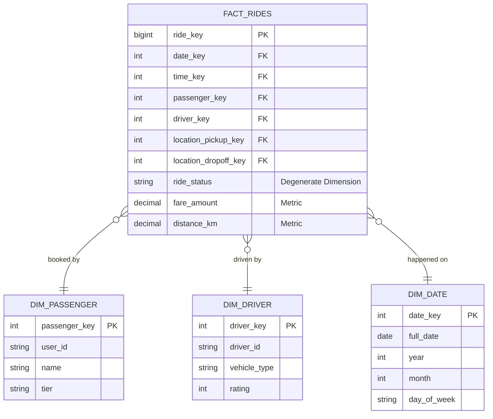

# Mô hình hóa dữ liệu (Phỏng vấn) - Data Modeling Interview

## Summary

**Data Modeling Interview** (Phỏng vấn mô hình hóa dữ liệu) là vòng thi bắt buộc nhằm kiểm tra khả năng tư duy logic và kỹ năng chuyển đổi yêu cầu nghiệp vụ kinh doanh thành các cấu trúc bảng dữ liệu vật lý. Người phỏng vấn sẽ đưa ra một mô hình kinh doanh cụ thể (ví dụ: ứng dụng gọi xe, sàn thương mại điện tử, ứng dụng giao đồ ăn) và yêu cầu bạn thiết kế kiến trúc kho dữ liệu (thường là Star Schema) để phục vụ cho các báo cáo phân tích.

---

## Definition

Trong ngữ cảnh Data Engineering, mô hình hóa dữ liệu là quá trình trừu tượng hóa các thực thể kinh doanh (Khách hàng, Sản phẩm, Đơn hàng) và mối quan hệ giữa chúng vào một cơ sở dữ liệu phân tích. Bài phỏng vấn thường tập trung vào phương pháp luận Dimensional Modeling của Ralph Kimball, trong đó phân định rạch ròi giữa bảng đo lường (Fact Table) và bảng ngữ cảnh (Dimension Table).

---

## Why it exists

Dữ liệu thô từ hệ thống vận hành (OLTP) rất phức tạp, chằng chịt các quan hệ (được chuẩn hóa mức 3NF) khiến cho việc viết một câu truy vấn báo cáo (ví dụ: "doanh thu tháng 3 theo từng tỉnh thành") trở nên vô cùng đau đầu và chậm chạp.
Vòng phỏng vấn này giúp nhà tuyển dụng xác định xem bạn có biết cách tổ chức lại dữ liệu sao cho các Data Analyst và Business User có thể kéo thả báo cáo một cách trực quan, chính xác và đạt hiệu năng tính toán cao nhất hay không.

---

## Core idea

4 bước cốt lõi trong Dimensional Modeling của Kimball mà bạn phải thể hiện trong buổi phỏng vấn:
1. **Choose the Business Process (Chọn quy trình nghiệp vụ)**: Xác định rõ báo cáo đang phục vụ cho khâu nào (Mua hàng, Giao hàng, Thanh toán...).
2. **Declare the Grain (Tuyên bố mức độ chi tiết)**: Đây là bước quan trọng nhất. Một dòng trong bảng Fact đại diện cho cái gì? (Ví dụ: 1 dòng = 1 lượt hoàn thành chuyến xe, hay 1 dòng = 1 sản phẩm trong giỏ hàng).
3. **Identify the Dimensions (Xác định các chiều)**: Ai, Cái gì, Ở đâu, Khi nào? Đây là các bảng Dimension (Ví dụ: Người dùng, Tài xế, Địa điểm, Thời gian).
4. **Identify the Facts (Xác định các số đo)**: Các con số nào có thể cộng gộp, tính trung bình được? (Ví dụ: Số tiền thanh toán, Tiền tip, Khoảng cách di chuyển).

---

## How it works

Quy trình giải quyết bài tập Data Modeling trên bảng trắng (Whiteboard Interview):
1. **Thu thập báo cáo đích**: Hỏi người phỏng vấn "Ban giám đốc muốn xem những chỉ số (metrics) gì trên Dashboard?".
2. **Định nghĩa Grain**: Phát biểu rõ ràng Grain của bài toán.
3. **Liệt kê Bảng Dimension**: Liệt kê các thuộc tính cho từng Dimension, nhớ thêm Surrogate Key (Khóa nhân tạo).
4. **Thiết kế Bảng Fact**: Đặt các khóa ngoại trỏ tới Dimension, định nghĩa các thuộc tính đo lường (Fact).
5. **Đề xuất kỹ thuật nâng cao**: Đề cập đến cách xử lý lịch sử (SCD Type 2) hoặc các chiều đặc biệt như Degenerate Dimension, Junk Dimension nếu cần thiết.

---

## Architecture / Flow

Sơ đồ ERD (Entity-Relationship Diagram) mẫu cho bài toán Ứng dụng gọi xe (Ride-Hailing):

---

## Practical example

**Tình huống phỏng vấn**: Thiết kế mô hình dữ liệu cho Airbnb. Yêu cầu: Phân tích doanh thu của chủ nhà (Host), tỷ lệ lấp đầy phòng (Occupancy Rate) theo từng khu vực địa lý.

**Giải quyết**:
* **Bước 1 (Business Process)**: Quá trình đặt phòng (Booking) và Thanh toán.
* **Bước 2 (Grain)**: Mỗi dòng trong Fact Table là một "Đêm lưu trú" (1 room-night) của một booking cụ thể. (Lưu ý: Không dùng Grain là "1 booking" vì 1 booking có thể kéo dài qua nhiều tháng, gây khó khăn cho báo cáo doanh thu theo tháng).
* **Bước 3 (Dimensions)**:
  * `dim_date`: Ngày lưu trú thực tế.
  * `dim_listing`: Thông tin căn hộ (Loại phòng, Số giường, Giá niêm yết).
  * `dim_host`: Thông tin chủ nhà (Cấp bậc superhost, Số năm kinh nghiệm).
  * `dim_guest`: Thông tin người thuê.
  * `dim_location`: Thông tin khu vực (Thành phố, Mã bưu điện).
* **Bước 4 (Facts)**: `fact_daily_stays`.
  * Khóa ngoại kết nối tới các Dim trên.
  * Metrics: `amount_paid`, `service_fee`, `cleaning_fee`, `is_occupied` (1 hoặc 0).

---

## Best practices

* **Luôn dùng Surrogate Key**: Đừng bao giờ dùng ID của hệ thống nguồn (như UUID dạng String) làm Primary Key cho bảng Dimension. Hãy dùng khóa tự tăng (Integer/BigInt) để tối ưu hiệu năng JOIN và chuẩn bị sẵn cho việc lưu lịch sử (SCD).
* **Sử dụng Date Dimension**: Dù các cơ sở dữ liệu hiện đại có sẵn hàm xử lý ngày tháng, việc có một `dim_date` (chứa các cờ như `is_holiday`, `is_weekend`, `fiscal_quarter`) sẽ làm câu truy vấn phân tích nhẹ nhàng và đúng quy chuẩn kinh doanh hơn rất nhiều.
* **Thống nhất Naming Convention**: Sử dụng `_key` cho khóa ngoại/khóa chính kho dữ liệu, và `_id` cho mã định danh từ hệ thống nguồn. 

---

## Common mistakes

* **Đưa các thuộc tính thay đổi liên tục vào Dimension**: Ví dụ lưu `account_balance` (số dư tài khoản) vào `dim_user`. Đây là thuộc tính có tính chất đo lường (Fact), nó sẽ làm bảng Dimension bị phình to liên tục và gây khó khăn khi quản lý lịch sử.
* **Lẫn lộn Grain trong cùng một Fact**: Lưu cả dữ liệu cấp độ Đơn hàng tổng (Order Header) và Chi tiết mặt hàng (Order Line) vào cùng một Fact Table sẽ gây lỗi tính toán nhân đôi (Double-counting) doanh thu.
* **Snowflaking không cần thiết**: Cố gắng chuẩn hóa `dim_location` thành `dim_city` -> `dim_country` để tối ưu dung lượng đĩa. Trong kho dữ liệu, hiệu năng truy vấn quan trọng hơn dung lượng, hãy gộp chúng vào 1 bảng `dim_location` để giảm số lượng phép JOIN.

---

## Trade-offs

### Star Schema vs 3NF (Inmon vs Kimball)
* Thiết kế Star Schema (Kimball) làm dư thừa dữ liệu (Data Redundancy) ở bảng Dimension, nhưng bù lại mang đến tốc độ báo cáo xuất sắc và cực kỳ thân thiện với các công cụ BI (Tableau, PowerBI).
* Lược đồ 3NF (Inmon) lưu trữ dữ liệu không trùng lặp, đảm bảo tính toàn vẹn cao nhưng yêu cầu người dùng phải JOIN hàng chục bảng để ra được một báo cáo.

---

## When to use

* Bài tập phỏng vấn bắt buộc đối với Data Engineer chuyên về Data Warehouse / Analytics Engineering.
* Khi thiết kế Data Marts cho các phòng ban kinh doanh cụ thể.

## When not to use

* Khi bài phỏng vấn hỏi về kiến trúc Streaming hoặc xử lý dữ liệu phi cấu trúc (NoSQL).
* Mô hình hóa cho cơ sở dữ liệu vận hành OLTP ứng dụng web (Lúc này phải dùng 3NF để tối ưu tốc độ ghi).

---

## Related concepts

* [Data Warehouse](/concepts/data-warehouse)
* [Slowly Changing Dimension (SCD)](/concepts/slowly-changing-dimension)
* [Fact Table vs Dimension Table](/concepts/fact-vs-dimension)

---

## Interview questions

### 1. Giải thích các loại Slowly Changing Dimension (SCD)?
* **Gợi ý trả lời**: 
  * **SCD Type 1**: Ghi đè trực tiếp lên dữ liệu cũ (Dùng khi sửa lỗi chính tả).
  * **SCD Type 2**: Thêm bản ghi mới, lưu lại lịch sử với các trường thời gian hiệu lực (`start_date`, `end_date`, `is_current`). Thường xuyên được sử dụng nhất để truy xuất chính xác trạng thái thực thể tại một thời điểm trong quá khứ.
  * **SCD Type 3**: Thêm một cột mới vào bảng để lưu trạng thái ngay trước đó (Ví dụ: `current_city`, `previous_city`). Chỉ lưu được 1 mức lịch sử.

### 2. Sự khác biệt giữa Factless Fact Table và Fact Table thông thường là gì?
* **Gợi ý trả lời**: Fact Table thông thường chứa các cột số liệu đo lường được (Metrics như số lượng, doanh thu). "Factless Fact Table" là bảng Fact không chứa bất kỳ cột metric nào, nó chỉ chứa các khóa ngoại (Foreign Keys) để ghi nhận sự xảy ra của một sự kiện (Ví dụ: Hành vi điểm danh của sinh viên, hoặc sự kiện gửi email quảng cáo tới khách hàng). Việc đo lường thực hiện bằng cách đếm số dòng (`COUNT(*)`).

### 3. Bạn sẽ xử lý thế nào nếu một Fact tới kho dữ liệu nhưng chưa có thông tin Dimension tương ứng (Early-arriving Fact)?
* **Gợi ý trả lời**: Đừng loại bỏ dòng Fact đó. Thay vào đó, hãy chèn một bản ghi giữ chỗ (Placeholder / Dummy record) vào bảng Dimension với một Surrogate Key mới và khóa tự nhiên (Natural ID) lấy từ dòng Fact, các thuộc tính khác để 'N/A' hoặc 'Unknown'. Gán Surrogate Key đó cho Fact. Khi dữ liệu Dimension thực sự đến vào hôm sau, thực hiện update đè lên bản ghi Dummy đó (SCD Type 1).

---

## References

1. **The Data Warehouse Toolkit: The Definitive Guide to Dimensional Modeling** - Ralph Kimball, Margy Ross (Kinh thánh về Data Modeling).
2. **Agile Data Warehouse Design** - Lawrence Corr (Khung làm việc BEAM để thu thập yêu cầu từ business users).

---

## English summary

The Data Modeling Interview evaluates a candidate's proficiency in translating business requirements into optimal analytical schemas, primarily focusing on Ralph Kimball's Dimensional Modeling approach. Candidates are expected to master the four-step process: selecting the business process, declaring the grain, identifying dimensions, and identifying facts. Key discussion points often involve differentiating between Star and Snowflake schemas, effectively designing Fact and Dimension tables using surrogate keys, and applying Slowly Changing Dimensions (SCD) to track historical changes accurately without compromising query performance in an OLAP environment.
