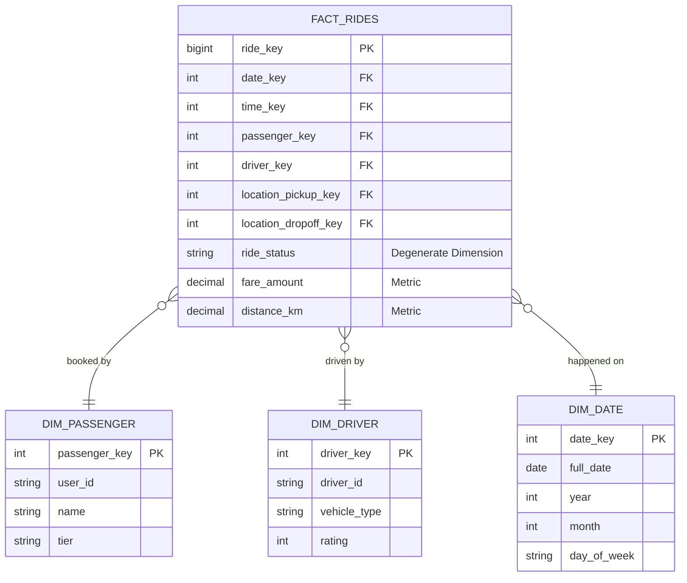

# Mô hình hóa dữ liệu (Phỏng vấn) - Data Modeling Interview

Khi bạn phỏng vấn cho vị trí Data Engineer chuyên về Data Warehouse hoặc Analytics Engineering, vòng **Mô hình hóa dữ liệu** (Data Modeling) luôn là một thử thách bắt buộc và mang tính quyết định. 

Mục tiêu của vòng phỏng vấn này không phải là kiểm tra xem bạn viết SQL giỏi đến mức nào, mà là đánh giá khả năng tư duy logic và kỹ năng chuyển đổi các yêu cầu nghiệp vụ kinh doanh trừu tượng thành các cấu trúc bảng dữ liệu vật lý tối ưu. Người phỏng vấn thường sẽ đưa ra một mô hình kinh doanh quen thuộc (như ứng dụng gọi xe, sàn thương mại điện tử, ứng dụng đặt phòng) và yêu cầu bạn thiết kế kiến trúc kho dữ liệu để phục vụ cho các báo cáo phân tích sau này.

---

## Nghệ thuật biến đổi bài toán kinh doanh thành cấu trúc bảng

Trong các hệ thống vận hành (OLTP), dữ liệu thường được tổ chức theo chuẩn hóa mức 3 (3NF) để tối ưu hóa tốc độ ghi và tránh trùng lặp thông tin. Tuy nhiên, cấu trúc này vô cùng phức tạp với hàng chục bảng liên kết chằng chịt, khiến việc viết một câu truy vấn báo cáo phân tích (ví dụ: *"Tổng doanh thu tháng 3 theo từng khu vực địa lý"*) trở thành một cực hình với tốc độ chạy rất chậm.

Mô hình hóa dữ liệu là quá trình chúng ta tổ chức lại mớ hỗn độn đó thành một kiến trúc kho dữ liệu gọn gàng (phổ biến nhất là mô hình Star Schema). Mục tiêu là giúp các Data Analyst và Business User có thể dễ dàng kéo thả và viết các câu lệnh truy vấn một cách trực quan, chính xác với hiệu năng tính toán cao nhất.

---

## Quy trình thiết kế 4 bước thần thánh của Kimball

Để xây dựng một mô hình dữ liệu chuẩn phân tích, phương pháp luận Dimensional Modeling của Ralph Kimball là một "kim chỉ nam" kinh điển. Bạn cần thể hiện rõ ràng 4 bước tư duy này trước mặt người phỏng vấn:

1. **Chọn quy trình nghiệp vụ (Choose the Business Process)**: Xác định rõ bạn đang muốn phân tích quy trình nào của doanh nghiệp (ví dụ: Giao dịch mua hàng, Đăng ký tài khoản, Giao hàng...).
2. **Tuyên bố mức độ chi tiết (Declare the Grain)**: Đây là bước quan trọng nhất và dễ bị sai lệch nhất. Bạn cần phát biểu rõ một dòng dữ liệu trong bảng đo lường đại diện cho điều gì? (Ví dụ: Một dòng là một đơn đặt xe thành công, hay một dòng là một món hàng trong giỏ hàng).
3. **Xác định các chiều thông tin (Identify the Dimensions)**: Tìm câu trả lời cho các câu hỏi *Ai? Cái gì? Ở đâu? Khi nào?* để thiết lập các bảng Dimension (Ví dụ: Người dùng, Tài xế, Địa điểm, Thời gian).
4. **Xác định các chỉ số đo lường (Identify the Facts)**: Xác định những số liệu số nào có thể cộng gộp, tính trung bình hoặc thống kê được (Ví dụ: Số tiền thanh toán, Quãng đường di chuyển, Số lượng đơn hàng).

---

## Quy trình thiết kế Data Modeling trên bảng trắng

Trong một buổi phỏng vấn trực tiếp (Whiteboard Interview), hãy dẫn dắt người phỏng vấn qua các bước triển khai bài bản thay vì cắm đầu vẽ bảng ngay lập tức:

* **Lắng nghe và đặt câu hỏi làm rõ**: Hỏi người phỏng vấn xem ban giám đốc hoặc đội ngũ phân tích thực sự muốn theo dõi những chỉ số (metrics) nào trên dashboard.
* **Xác định rõ ràng hạt nhân dữ liệu (Grain)** trước khi thiết kế các bảng.
* **Liệt kê các bảng Dimension**: Liệt kê chi tiết các thuộc tính cho từng bảng, và đừng quên sử dụng khóa nhân tạo (**Surrogate Key**).
* **Thiết kế bảng Fact**: Đặt các khóa ngoại trỏ tới các bảng Dimension, đưa vào các thuộc tính đo lường phù hợp.
* **Đề xuất các kỹ thuật nâng cao**: Thảo luận về cách xử lý lịch sử biến động dữ liệu (SCD Type 2) hoặc cách thiết kế các chiều đặc biệt (Degenerate Dimension, Junk Dimension) để ghi điểm tuyệt đối.

---

## Thiết kế mô hình dữ liệu cho ứng dụng gọi xe (Ride-Hailing)

Dưới đây là một sơ đồ ERD mẫu thiết kế theo mô hình Star Schema cho dịch vụ gọi xe công nghệ:

---

## Thực chiến: Thiết kế kho dữ liệu cho dịch vụ Airbnb

**Tình huống phỏng vấn**: *"Hãy thiết kế mô hình dữ liệu cho Airbnb để ban giám đốc phân tích doanh thu của các chủ nhà (Host), tỷ lệ lấp đầy phòng (Occupancy Rate) theo từng khu vực địa lý."*

**Phân tích & Hướng giải quyết**:

* **Bước 1 (Business Process)**: Quá trình lưu trú thực tế của khách thuê phòng.
* **Bước 2 (Grain)**: Mỗi dòng trong bảng Fact sẽ đại diện cho **một đêm lưu trú thực tế** (1 room-night) của một mã đặt phòng (booking) cụ thể.
  > [!TIP]
  > Nhiều ứng viên sẽ chọn Grain là "1 lượt đặt phòng (booking)". Tuy nhiên, một booking có thể kéo dài qua nhiều tháng (ví dụ từ 28/12 đến 03/01). Nếu chọn Grain là booking, việc phân tích doanh thu chính xác theo từng tháng hoặc tính tỷ lệ lấp đầy phòng hàng ngày sẽ trở nên vô cùng phức tạp.
* **Bước 3 (Dimensions)**:
  * `dim_date`: Ngày lưu trú thực tế.
  * `dim_listing`: Thông tin phòng cho thuê (loại phòng, số giường, giá niêm yết).
  * `dim_host`: Thông tin chủ nhà (cấp bậc superhost, số năm tham gia).
  * `dim_guest`: Thông tin người thuê phòng.
  * `dim_location`: Địa điểm phòng (thành phố, quốc gia, mã bưu điện).
* **Bước 4 (Facts)**: Thiết lập bảng `fact_daily_stays` gồm các khóa ngoại liên kết tới các Dimension trên và các chỉ số đo lường: `amount_paid` (doanh thu tính theo ngày), `service_fee`, `cleaning_fee`, và `is_occupied` (gán giá trị 1 hoặc 0 để tính tỷ lệ lấp đầy).

---

## Những nguyên tắc vàng và Best Practices

* **Luôn sử dụng Surrogate Key (Khóa nhân tạo)**: Tuyệt đối không dùng các ID của hệ thống nguồn (như UUID dạng string) làm khóa chính cho các bảng Dimension. Hãy tự tạo một khóa tự tăng kiểu số nguyên (Integer/BigInt). Khóa nhân tạo giúp tối ưu hiệu năng của các phép JOIN và là bắt buộc nếu bạn muốn lưu vết lịch sử thay đổi dữ liệu (SCD).
* **Xây dựng bảng Date Dimension riêng**: Đừng phụ thuộc vào các hàm xử lý ngày tháng của cơ sở dữ liệu. Thiết kế một bảng `dim_date` riêng với các cờ thông tin được tính toán sẵn (như `is_holiday`, `is_weekend`, `fiscal_quarter`) sẽ giúp các câu truy vấn phân tích nhẹ nhàng và chuẩn hóa hơn rất nhiều.
* **Quy chuẩn đặt tên (Naming Convention)**: Nên dùng hậu tố `_key` cho các khóa chính/khóa ngoại trong kho dữ liệu, và dùng hậu tố `_id` để chỉ mã định danh lấy từ hệ thống nguồn.

---

## Các sai lầm kinh điển cần tuyệt đối tránh

* **Lưu các thuộc tính biến động liên tục vào Dimension**: Sai lầm phổ biến là đưa các thông số thay đổi liên tục như số dư tài khoản (`account_balance`) vào bảng `dim_user`. Hãy chuyển các chỉ số có tính đo lường này vào bảng Fact hoặc tách thành bảng Fact tích lũy, để tránh làm bảng Dimension phình to quá mức.
* **Trộn lẫn các cấp độ chi tiết (Grain) trong cùng một bảng Fact**: Việc lưu trữ cả thông tin tổng quan của đơn hàng (Order Header) và thông tin chi tiết từng mặt hàng (Order Line) vào chung một bảng Fact sẽ làm hỏng logic tính toán và gây ra lỗi nhân đôi số liệu (double-counting).
* **Lạm dụng cấu trúc Snowflake**: Cố gắng chuẩn hóa bảng Dimension để tiết kiệm dung lượng đĩa (ví dụ tách `dim_location` thành `dim_city` rồi tiếp tục trỏ tới `dim_country`) là không cần thiết. Trong kho dữ liệu, hiệu năng truy vấn quan trọng hơn dung lượng lưu trữ. Hãy gộp tất cả thông tin địa lý vào một bảng phẳng `dim_location` duy nhất để hạn chế tối đa số lượng phép JOIN.

---

## Đặt lên bàn cân: Star Schema vs 3NF (Kimball vs Inmon)

* **Star Schema (Phương pháp Kimball)**: Chấp nhận dư thừa dữ liệu ở các bảng Dimension để có một cấu trúc phẳng, dễ hiểu. Điều này giúp tối ưu hóa tốc độ truy vấn đọc và rất thân thiện với các công cụ kéo thả báo cáo BI (Tableau, PowerBI).
* **Lược đồ 3NF (Phương pháp Inmon)**: Thiết kế chuẩn hóa chặt chẽ, dữ liệu không trùng lặp giúp đảm bảo tính nhất quán cao nhất. Tuy nhiên, nó lại đòi hỏi người viết báo cáo phải JOIN hàng chục bảng với nhau, gây ảnh hưởng lớn đến hiệu năng hệ thống khi chạy báo cáo lớn.

---

## Bộ câu hỏi phỏng vấn thực tế và Cách trả lời ghi điểm

### 1. Bạn hãy giải thích các loại Slowly Changing Dimension (SCD) phổ biến.
* **Gợi ý trả lời**: SCD là kỹ thuật dùng để quản lý lịch sử thay đổi của các thuộc tính trong bảng Dimension:
  * **SCD Type 1**: Ghi đè trực tiếp dữ liệu mới lên dữ liệu cũ. Cách này đơn giản nhưng làm mất hoàn toàn lịch sử (thường dùng khi sửa lỗi chính tả).
  * **SCD Type 2**: Thêm một dòng mới hoàn toàn để lưu trạng thái mới, đồng thời sử dụng các trường thời gian hiệu lực (`start_date`, `end_date`, `is_current`) để quản lý. Đây là cách phổ biến nhất vì nó giúp chúng ta truy vấn chính xác trạng thái của thực thể tại bất kỳ thời điểm nào trong quá khứ.
  * **SCD Type 3**: Thêm một cột mới vào bảng để lưu trạng thái cũ liền trước (Ví dụ: cột `current_city` và `previous_city`). Cách này chỉ lưu được một mức lịch sử gần nhất.

### 2. Sự khác biệt giữa Factless Fact Table và Fact Table thông thường là gì?
* **Gợi ý trả lời**: 
  Một Fact Table thông thường sẽ chứa các chỉ số đo lường tính toán được (như số lượng, doanh thu). 
  Ngược lại, **Factless Fact Table** không chứa bất kỳ cột chỉ số nào, mà chỉ bao gồm các khóa ngoại liên kết tới các Dimension. Nó được thiết kế để ghi nhận sự kiện thực tế đã xảy ra (ví dụ: điểm danh lớp học, sự kiện gửi email quảng cáo tới khách hàng). Việc phân tích và đo lường trên bảng này sẽ được thực hiện thông qua hàm đếm dòng `COUNT(*)`.

### 3. Bạn sẽ xử lý thế nào nếu dữ liệu Fact được gửi tới kho dữ liệu trước khi thông tin Dimension tương ứng được tạo ra (Early-arriving Fact)?
* **Gợi ý trả lời**: 
  Tôi sẽ không loại bỏ dòng Fact đó để tránh làm mất dữ liệu giao dịch. 
  Thay vào đó, tôi sẽ chèn một dòng ghi tạm (Placeholder/Dummy record) vào bảng Dimension tương ứng với một Surrogate Key tự sinh mới và lấy ID tự nhiên từ dòng Fact, các trường thông tin khác sẽ để giá trị tạm thời là "Unknown" hoặc "N/A". Tôi gán khóa tạm thời này cho dòng Fact đó. 
  Vào ngày hôm sau khi dữ liệu Dimension thực sự được nạp đến, tôi sẽ chạy một job cập nhật đè thông tin chi tiết lên dòng Dummy đó (áp dụng cơ chế SCD Type 1).

---

## Tài liệu tham khảo gối đầu giường

1. **The Data Warehouse Toolkit: The Definitive Guide to Dimensional Modeling** - Ralph Kimball, Margy Ross (Cuốn sách kinh điển nhất về Data Modeling).
2. **Agile Data Warehouse Design** - Lawrence Corr (Khung làm việc BEAM hữu ích để lấy yêu cầu nghiệp vụ từ khách hàng).

---

## English Summary

The Data Modeling Interview evaluates a candidate's proficiency in translating business requirements into optimal analytical schemas, primarily focusing on Ralph Kimball's Dimensional Modeling approach. Candidates are expected to master the four-step process: selecting the business process, declaring the grain, identifying dimensions, and identifying facts. Key discussion points often involve differentiating between Star and Snowflake schemas, effectively designing Fact and Dimension tables using surrogate keys, and applying Slowly Changing Dimensions (SCD) to track historical changes accurately without compromising query performance in an OLAP environment.
