Trong quy trình tuyển dụng Data Engineer ở các công ty công nghệ lớn, vòng **Phỏng vấn Hành vi (Behavioral Interview)** hay vòng đánh giá độ phù hợp văn hóa (Culture Fit) thường bị các ứng viên thuần kỹ thuật xem nhẹ. Nhiều người cho rằng chỉ cần giải được các bài toán thuật toán hóc búa hay thiết kế được hệ thống chịu tải triệu user là đủ để đỗ. 

Nhưng thực tế lại chứng minh điều ngược lại: một Kỹ sư Dữ liệu dù giỏi chuyên môn đến đâu nhưng nếu có thái độ kiêu ngạo, thiếu khả năng lắng nghe ý kiến phản hồi hoặc không thể giải thích nổi công việc của mình cho các phòng ban khác hiểu, sẽ dễ dàng phá hỏng tinh thần làm việc của cả một tập thể. Vòng phỏng vấn này ra đời để tìm ra những người không chỉ giỏi code mà còn biết cách làm việc cùng con người.

---

## Bản chất của phỏng vấn hành vi

Vòng phỏng vấn này dựa trên một triết lý tuyển dụng kinh điển: **"Hành vi trong quá khứ là tấm gương phản chiếu tốt nhất cho hành vi trong tương lai"**. 

Thay vì đặt ra những câu hỏi giả định mang tính lý thuyết kiểu như *"Bạn sẽ làm gì nếu dự án bị chậm tiến độ?"*, nhà tuyển dụng sẽ yêu cầu bạn kể lại những trải nghiệm thực tế mà bạn từng trải qua: *"Hãy kể về một lần bạn bị trễ deadline và cách bạn xử lý tình huống đó"*. Qua đó, họ sẽ đánh giá chỉ số thông minh cảm xúc (EQ), khả năng giao tiếp, tinh thần trách nhiệm và cách bạn xử lý xung đột trong môi trường làm việc thực tế.

---

## Vũ khí tối thượng: Công thức STAR

Để không bị rơi vào cái bẫy kể chuyện lan man, không đúng trọng tâm, bạn cần nằm lòng công thức **STAR** khi trả lời bất kỳ câu hỏi hành vi nào:

* **S (Situation - Tình huống)**: Thiết lập bối cảnh chung cho câu chuyện của bạn. Hãy nói ngắn gọn, súc tích (chỉ nên chiếm khoảng 10-15% thời lượng câu trả lời).
* **T (Task - Nhiệm vụ)**: Thử thách cốt lõi hoặc mục tiêu cụ thể bạn cần phải giải quyết trong bối cảnh đó là gì? Vai trò cá nhân của bạn trong tình huống này ra sao?
* **A (Action - Hành động)**: Đây là phần quan trọng nhất (chiếm 60% thời lượng). Hãy mô tả chi tiết từng bước mà bạn đã thực hiện để giải quyết vấn đề. Hãy nhớ dùng đại từ nhân xưng **"TÔI"** thay vì **"CHÚNG TÔI"** để nhà tuyển dụng thấy rõ đóng góp thực sự của riêng bạn chứ không phải của đồng nghiệp.
* **R (Result - Kết quả)**: Kết quả cuối cùng đạt được là gì? Bạn đã rút ra được bài học kinh nghiệm sâu sắc nào cho bản thân? Hãy ưu tiên đưa vào các con số định lượng (ví dụ: *"giúp tiết kiệm 20 giờ làm việc mỗi tuần"*, *"giảm 30% chi phí vận hành"*).

---

## Trực quan hóa quy trình cộng tác (Data Contracts Workflow)

Sơ đồ dưới đây minh họa sự khác biệt giữa hai quy trình cộng tác giữa đội Backend và đội Data: quy trình tự phát dễ gây đổ vỡ và quy trình có kiểm soát chặt chẽ thông qua cam kết giao tiếp rõ ràng:

```mermaid
graph TD
    subgraph Without_Data_Contracts["Without Data Contracts (Reactive/Chaos)"]
        A[Backend Team changes DB Schema] -->|Breaks| B[Data Pipeline saps]
        B -->|3 AM Alert| C[Data Engineer wakes up]
        C -->|Hotfix Code under pressure| D[Stakeholders see stale dashboard]
    end
    
    subgraph With_Data_Contracts["With Data Contracts (Proactive/Stable)"]
        E[Backend Team proposes schema change] -->|CI/CD Validation| F[Check Data Contract Registry]
        F -->|Notify automatically| G[Data Team review & approval]
        G -->|Controlled Deployment| H[Pipeline updated smoothly]
    end
```

---

## Xây dựng "Ngân hàng câu chuyện" của riêng bạn

Trước khi bước vào buổi phỏng vấn, hãy chuẩn bị sẵn cho mình một "story bank" gồm 4-5 câu chuyện thực tế từ quá khứ, được cấu trúc mạch lạc theo mô hình STAR. Các câu chuyện này nên bao gồm các chủ đề kinh điển sau:

1. Một lần bạn gặp thất bại trong dự án hoặc bị trễ hạn bàn giao (Missed Deadline).
2. Một lần xảy ra bất đồng ý kiến hoặc xung đột với đồng nghiệp hoặc quản lý trực tiếp.
3. Một lần bạn chủ động làm vượt quá mong đợi của sếp hoặc khách hàng (Go above and beyond).
4. Một lần bạn thuyết phục thành công người khác thay đổi quan điểm kỹ thuật dù bạn không có quyền lực hành chính đối với họ.
5. Một lần bạn phải hoàn thành công việc dưới áp lực thời gian cực kỳ khủng khiếp.

---

## STAR trong thực tế: Cách giải thích kỹ thuật cho người không chuyên

**Câu hỏi từ nhà tuyển dụng**: *"Hãy kể về một lần bạn phải giải thích một khái niệm kỹ thuật phức tạp cho một người dùng không có chuyên môn về công nghệ (non-tech stakeholders)."*

**Cách trả lời ghi điểm theo cấu trúc STAR**:

* **Situation**: Tại dự án cũ của tôi, Giám đốc Marketing phàn nàn rằng báo cáo dữ liệu hành vi người dùng hàng ngày bị trễ 24 giờ, gây ảnh hưởng đến hiệu quả tối ưu hóa các chiến dịch quảng cáo lớn. Ông ấy yêu cầu đội dữ liệu phải cung cấp dữ liệu tức thì (real-time data) ngay lập tức.
* **Task**: Nhiệm vụ của tôi là phải giải thích cho ông ấy hiểu rằng hệ thống hiện tại đang chạy theo cơ chế xử lý lô ([Batch processing](/concepts/3-integration/batch-processing/batch-processing/)) qua đêm. Việc chuyển đổi ngay lập tức sang cơ chế xử lý thời gian thực (Streaming) sẽ đẩy chi phí hạ tầng tăng vọt lên gấp 5 lần, vượt quá ngân sách được giao. Tôi cần thương lượng để tìm ra một giải pháp dung hòa giữa nhu cầu kinh doanh và bài toán chi phí.
* **Action**: Trong buổi họp, tôi tuyệt đối không sử dụng các thuật ngữ kỹ thuật phức tạp như "Kafka", "Batching" hay "Cron jobs". Thay vào đó, tôi dùng một phép ẩn dụ dễ hiểu: *"Cơ chế chạy batch hiện tại giống như một chiếc xe buýt, phải đợi đủ giờ mới xuất bến để tiết kiệm chi phí. Còn chạy real-time giống như việc chúng ta đi taxi riêng cho từng hành khách, rất nhanh nhưng chi phí cực kỳ đắt đỏ"*. 
  Sau khi lắng nghe kỹ nhu cầu, tôi nhận ra đội Marketing không thực sự cần dữ liệu chính xác đến từng giây. Họ chỉ cần số liệu cập nhật mới nhất trước hai mốc thời gian quan trọng: cuộc họp giao ban sáng lúc 8 giờ và cuộc họp đánh giá chiều lúc 14 giờ.
* **Result**: Tôi đề xuất phương án tăng tần suất chạy batch (tăng số chuyến xe buýt) lên 2 lần một ngày vào các khung giờ Marketing cần, thay vì chỉ chạy 1 lần vào ban đêm. Giải pháp này giải quyết triệt để bài toán kinh doanh của họ mà chi phí hạ tầng chỉ tăng thêm không đáng kể. Giám đốc Marketing hoàn toàn đồng ý và đánh giá cao sự thấu hiểu bài toán chi phí của đội dữ liệu.

---

## Điểm mạnh và điểm yếu

Khi kể về những sai lầm kỹ thuật của bản thân trong quá khứ trong phòng phỏng vấn, các ứng viên thường lựa chọn giữa sự thẳng thắn thừa nhận lỗi và sự bào chữa phòng thủ:

### Thẳng thắn thừa nhận lỗi kỹ thuật (Ownership & Vulnerability)
* **Điểm mạnh (Pros)**: Thể hiện tinh thần chịu trách nhiệm cao (Ownership), khả năng tự nhận thức (Self-awareness) tuyệt vời và tư duy không ngừng học hỏi rút kinh nghiệm (Growth Mindset). Đây là đặc trưng tính cách của các kỹ sư Senior trưởng thành.
* **Điểm yếu (Cons)**: Nếu không biết cách định khung câu chuyện, có thể vô tình làm người phỏng vấn lo ngại về năng lực kỹ thuật cơ bản nếu lỗi quá sơ đẳng và thiếu tính chuyên nghiệp.

### Bào chữa phòng thủ (Defensive Shielding)
* **Điểm mạnh (Pros)**: Giúp duy trì hình ảnh "hoàn hảo, không tì vết" trước nhà tuyển dụng trong ngắn hạn.
* **Điểm yếu (Cons)**: Tạo cảm giác thiếu trung thực, hiếu thắng, e ngại nhận lỗi và rất khó hợp tác trong môi trường agile năng động.

---

## Khi nào nên dùng

* **Nên dùng STAR**: Bắt buộc áp dụng cho mọi câu hỏi hành vi trong cuộc phỏng vấn. Nó giúp bạn cấu trúc thông tin mạch lạc, tránh kể chuyện lan man dài dòng.
* **Nên đưa số liệu định lượng vào phần Result**: Luôn luôn áp dụng khi câu chuyện của bạn đạt kết quả tốt (ví dụ: tăng 30% hiệu năng, giảm 15% chi phí cloud). Số liệu thực tế có sức thuyết phục cao gấp nhiều lần lời nói suông.
* **Nên đẩy lùi yêu cầu ad-hoc của Stakeholders**: Khi các yêu cầu chen ngang ad-hoc đe dọa trực tiếp đến độ ổn định của hệ thống chính và vi phạm cam kết SLA đang chạy, hãy chủ động giải thích bài toán đánh đổi tài nguyên và đàm phán đưa yêu cầu vào backlog tiếp theo.

---

## Trọng tâm ôn luyện phỏng vấn

Dưới đây là 3 câu hỏi tình huống thực tế giải quyết theo công thức STAR giúp bạn đạt điểm tối đa:

### 1. Bất đồng quan điểm kỹ thuật về lựa chọn công nghệ với Senior/Quản lý
**Câu hỏi**: *"Hãy kể về một lần bạn xảy ra bất đồng ý kiến sâu sắc với Senior Engineer hoặc Quản lý trực tiếp về giải pháp thiết kế hệ thống dữ liệu. Bạn đã xử lý thế nào để thuyết phục họ?"*

**Trả lời (STAR)**:
* **Situation**: Trong dự án chuyển đổi kho dữ liệu, tôi đề xuất sử dụng [dbt](/concepts/3-integration/transformation-analytics/dbt/) để quản lý mã nguồn SQL và tự động hóa kiểm tra chất lượng dữ liệu. Senior Lead của tôi phản đối vì lo ngại đội ngũ sẽ mất thời gian học công cụ mới và muốn tiếp tục viết stored procedures thủ công trên database.
* **Task**: Tôi phải chứng minh được giá trị thực tế của dbt để thuyết phục Senior Lead mà không tạo ra sự căng thẳng hay đối đầu cá nhân trong đội ngũ.
* **Action**: Tôi không cãi vã lý thuyết. Thay vào đó, tôi chủ động dành ngày cuối tuần để làm một bản thử nghiệm PoC nhỏ. Tôi chọn ra một module báo cáo đang bị chậm và thường xuyên lỗi. Tôi viết lại toàn bộ logic bằng dbt, thiết lập sẵn data lineage trực quan và chèn các bài kiểm tra tự động (`dbt test`). 
  Trong buổi họp đầu tuần, tôi trình bày bản PoC trực quan, chỉ ra rằng việc dùng dbt giúp giảm 60% thời gian viết code nhờ tính năng tái sử dụng mã nguồn và phát hiện lỗi tự động ngay trước khi chạy.
* **Result**: Senior Lead hoàn toàn bị thuyết phục bởi số liệu thực tế và hình ảnh lineage rõ ràng. Anh ấy đồng ý cho tôi dẫn dắt việc chuyển dịch toàn bộ dự án sang dbt, giúp cả đội giảm 40% số lượng sự cố dữ liệu trong các tháng tiếp theo.

### 2. Xử lý sự cố trễ Deadline làm ảnh hưởng đến đợt phát hành sản phẩm của công ty
**Câu hỏi**: *"Kể về một lần bạn bị trễ hạn bàn giao một Data Pipeline cốt lõi, làm chậm trễ đợt ra mắt tính năng mới của công ty. Bạn đã giao tiếp và xử lý hậu quả thế nào?"*

**Trả lời (STAR)**:
* **Situation**: Đội Data cam kết bàn giao pipeline tích hợp dữ liệu khách hàng vào ngày 15 để phục vụ tính năng gợi ý sản phẩm mới. Tuy nhiên, đến ngày 13, tôi phát hiện API của đối tác bên thứ ba liên tục trả về dữ liệu lỗi cấu trúc, khiến pipeline không thể chạy thành công.
* **Task**: Tôi nhận thấy việc bàn giao đúng ngày 15 là bất khả thi. Tôi cần nhanh chóng giảm nhẹ ảnh hưởng, thông báo chuyên nghiệp cho Product Manager (PM) và xử lý kỹ thuật triệt để.
* **Action**: 
  1. *Giao tiếp*: Tôi lập tức tổ chức cuộc họp nhanh với PM vào sáng ngày 13. Tôi giải thích rõ nguyên nhân khách quan từ API đối tác, đề xuất lùi hạn bàn giao sang ngày 18.
  2. *Giải pháp giảm nhẹ*: Để không làm đóng băng toàn bộ tiến độ kiểm thử của đội Frontend, tôi tự tay viết một bộ script giả lập dữ liệu (mock data client) trả về định dạng chuẩn để đội Frontend tiếp tục test giao diện.
  3. *Hành động kỹ thuật*: Tôi trực tiếp liên hệ với đội hỗ trợ của đối tác để yêu cầu họ fix API, đồng thời viết thêm một tầng filter bảo thủ trong code Python để tự động loại bỏ các bản ghi lỗi cấu trúc thay vì làm sập toàn bộ pipeline.
* **Result**: Tính năng gợi ý vẫn được kiểm thử đúng hạn nhờ mock data. Pipeline thật được deploy an toàn vào ngày 18, chạy ổn định tuyệt đối. PM đánh giá cao sự chủ động giao tiếp và giải pháp thay thế kịp thời của tôi.

### 3. Giải quyết mâu thuẫn schema drift với đội Backend thượng nguồn
**Câu hỏi**: *"Đội Backend liên tục thay đổi cấu trúc bảng cơ sở dữ liệu nguồn mà không thông báo, làm sập các data pipeline của bạn vào nửa đêm. Bạn sẽ làm gì để chấm dứt tình trạng mỏi mệt này từ gốc rễ?"*

**Trả lời (STAR & [Xử lý sự cố Production](../interview/production-incident-qa/))**:
* **Situation**: Các thay đổi schema đột ngột từ Backend liên tục làm gãy luồng nạp dữ liệu, buộc đội Data phải liên tục on-call sửa lỗi lúc nửa đêm.
* **Task**: Thiết lập một quy trình hợp tác và chốt chặn kỹ thuật bền vững giữa hai phòng ban để chấm dứt tình trạng thụ động xử lý sự cố.
* **Action**:
  1. *Khắc phục kỹ thuật*: Tôi viết cấu hình parser động trong pipeline nạp dữ liệu thô (Bronze Layer) để khi gặp trường mới hoặc khuyết trường, pipeline sẽ đẩy bản ghi đó vào thư mục rác (Dead Letter Queue) và tiếp tục chạy bình thường thay vì sập đỏ.
  2. *Thiết lập Quy trình*: Tôi tổ chức buổi họp liên phòng ban với đại diện đội Backend và PM. Tôi chia sẻ số liệu: *"Trong tháng qua, đội Data đã bị sập 12 lần do thay đổi schema, gây chậm trễ báo cáo tài chính 3 lần"*.
  3. Tôi đề xuất áp dụng **Data Contracts** (Cam kết cấu trúc dữ liệu). Chúng tôi thống nhất cấu trúc dữ liệu đầu ra thông qua file cấu hình JSON Schema được lưu chung trên Git. Quy trình CI/CD của đội Backend được tích hợp bước tự động kiểm tra: nếu commit code của họ làm thay đổi các trường đã cam kết trong Data Contract, bản build sẽ bị chặn và thông báo cho đội Data duyệt.
* **Result**: Sau khi áp dụng quy trình Data Contracts, số lượng sự cố sập pipeline do schema drift giảm từ 12 lần xuống còn 0 lần trong suốt quý, giải phóng hoàn toàn sức lao động cho đội ngũ trực gác.

---

## English Summary

The Data Engineering Behavioral Interview evaluates a candidate's communication skills, emotional intelligence, and ability to handle operational conflict in a team setting. Companies look for structured stories built on the STAR framework (Situation, Task, Action, Result) with quantified metrics. Key topics include managing technical disagreements with senior staff, communicating complex technical concepts using simple analogies to non-technical stakeholders, taking ownership of project delays, and designing cross-functional solutions (like Data Contracts) to resolve pipeline breakage caused by upstream backend database changes.

---

## Xem thêm các khái niệm liên quan

* [Xử lý sự cố Production](../interview/production-incident-qa/) - Quy trình ứng phó và viết hậu kiểm blameless.
* [Thiết kế Data Pipeline](../interview/pipeline-design-interview/) - Các nguyên tắc thiết kế luồng dữ liệu bền bỉ.
* [dbt (Data Build Tool)](/concepts/3-integration/transformation-analytics/dbt/) - Quản lý biến đổi dữ liệu chuẩn phần mềm.

---

## Tài liệu tham khảo

1. [AWS Well-Architected Framework - Operational Excellence Pillar](https://docs.aws.amazon.com/wellarchitected/latest/operational-excellence-pillar/welcome.html)
2. [Google Site Reliability Engineering Book - Collaborative Team Culture](https://sre.google/sre-book/organizational-culture-at-site-reliability-engineering/)
3. [Databricks Administration Guide - Collaboration & Governance Best Practices](https://docs.databricks.com/administration-guide/index.html)
4. [Confluent Developer Portal - Architectural Communication Patterns](https://developer.confluent.io/)
5. [Snowflake Cloud Data Platform - Security and Governance Framework](https://docs.snowflake.com/en/user-guide/governance-intro)
