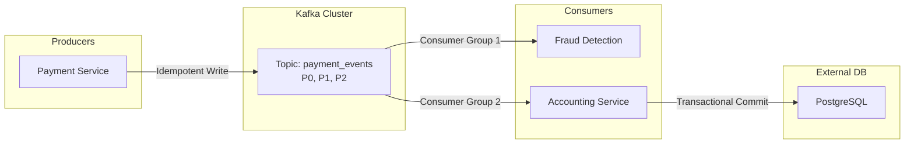

Trong các buổi phỏng vấn thiết kế hệ thống (System Design) dành cho vị trí Data Engineer hoặc Backend Engineer cấp độ Mid/Senior, các câu hỏi xoay quanh [Apache Kafka](/concepts/4-realtime/streaming-processing/apache-kafka/) luôn là một phần cực kỳ quan trọng và hóc búa. 

Tại sao lại như vậy? Bởi vì trong các hệ thống phân tán quy mô lớn, việc xử lý dữ liệu thời gian thực (real-time event streaming) chưa bao giờ là dễ dàng. Hệ thống thực tế luôn phải đối mặt với các sự cố bất khả kháng như mất kết nối mạng (network partitions), sập máy chủ đột ngột (node crashes) hay lưu lượng truy cập tăng vọt. Nhà tuyển dụng muốn xem cách bạn sử dụng Kafka để thiết kế một hệ thống có độ trễ thấp, thông lượng cao, không bao giờ bị mất mát dữ liệu và xử lý chính xác một lần (exactly-once processing). Nếu gặp sự cố dữ liệu, quy trình ứng phó chi tiết có thể tham khảo thêm tại [Xử lý sự cố Production](../interview/production-incident-qa/).

---

## Bản chất của việc thiết kế hệ thống với Kafka

Khi bước vào buổi phỏng vấn, việc đề xuất sử dụng Apache Kafka không đơn thuần là vẽ một chiếc hộp mang tên "Message Queue" vào sơ đồ kiến trúc. 

Người phỏng vấn sẽ ngay lập tức xoáy sâu vào các chi tiết kỹ thuật:
* Bạn sẽ chia bao nhiêu phân vùng (partitions)?
* Chiến lược chọn khóa phân vùng (partition key) của bạn là gì?
* Bạn cấu hình số lượng bản sao (replication factor) và cơ chế xác nhận (acks) của Producer ra sao để đảm bảo dữ liệu không bị thất lạc?
* Làm thế nào để giải quyết bài toán trùng lặp đơn hàng của người dùng khi hệ thống xảy ra sự cố mạng?

Việc trả lời tốt những câu hỏi này thể hiện tư duy thiết kế hệ thống sâu sắc, biết rõ điểm mạnh và điểm yếu (trade-offs) của từng tham số cấu hình.

---

## Bốn trụ cột kiến trúc cốt lõi bạn bắt buộc phải làm chủ

* **Topics & Partitions**: Dữ liệu trong Kafka được ghi vào các Topic, và mỗi Topic được chia thành nhiều Partition. Partition chính là đơn vị nhỏ nhất giúp Kafka mở rộng quy mô tính toán (scalability) và cũng là nơi duy nhất đảm bảo thứ tự của tin nhắn (message ordering). Hãy nhớ rằng: Kafka chỉ cam kết giữ đúng thứ tự tin nhắn *trong cùng một partition*, không đảm bảo trên toàn bộ Topic.
* **[Consumer Groups](/concepts/4-realtime/streaming-processing/consumer-groups/)**: Cơ chế giúp phân bổ công việc đọc dữ liệu từ một Topic cho nhiều Consumer mà không lo bị trùng lặp dữ liệu. Mỗi Partition chỉ được đọc bởi tối đa một Consumer tại một thời điểm trong cùng một Group.
* **Replication & ISR (In-Sync Replicas)**: Cơ chế sao chép dữ liệu sang các máy chủ khác (Broker) để phòng ngừa rủi ro phần cứng bị sập. Nếu Broker chứa Leader partition gặp sự cố, hệ thống sẽ tự động bầu một Broker khác trong danh sách ISR lên làm Leader mới để duy trì hoạt động.
* **Delivery Semantics (Ngữ nghĩa phân phối)**: 
  * **At-most-once**: Gửi đi và không quan tâm kết quả (nhanh nhất, nhưng có thể mất tin nhắn).
  * **At-least-once**: Đảm bảo tin nhắn sẽ đến đích, nhưng có thể bị gửi trùng (phổ biến nhất).
  * **Exactly-once**: Đảm bảo tin nhắn được xử lý chính xác một lần duy nhất (phức tạp nhất nhưng an toàn nhất cho dữ liệu tài chính).

---

## Quy trình từng bước khi thiết kế luồng dữ liệu thời gian thực

1. **Thu thập yêu cầu nghiệp vụ**: Làm rõ các con số như lượng tin nhắn phát sinh mỗi giây (Throughput), kích thước trung bình của mỗi tin nhắn, mức độ chấp nhận mất mát dữ liệu (Data loss tolerance) và độ trễ tối đa cho phép (Latency).
2. **Thiết kế Topic và Partition**: Tính toán số lượng partition tối ưu dựa trên thông lượng mong muốn. Lựa chọn Partition Key thích hợp để vừa đảm bảo thứ tự logic của nghiệp vụ (ví dụ: theo `order_id` hoặc `user_id`), vừa tránh được hiện tượng phân bổ lệch dữ liệu (Hot Partition).
3. **Cấu hình Producer**: Tùy chỉnh các tham số quan trọng như `acks=all`, `retries=max`, và kích hoạt `enable.idempotence=true` đối với các hệ thống yêu cầu độ tin cậy tuyệt đối.
4. **Cấu hình Consumer**: Lựa chọn chiến lược commit offset thủ công thay vì tự động để kiểm soát lỗi tốt hơn. Thiết lập các quy trình xử lý tin nhắn bị lỗi định dạng (Poison Pills) để tránh làm tắc nghẽn luồng xử lý chung.

---

## Trực quan hóa kiến trúc xử lý thanh toán Exactly-Once

Sơ đồ dưới đây minh họa luồng xử lý giao dịch thanh toán đảm bảo Exactly-Once từ khâu gửi tin đến lưu trữ vào cơ sở dữ liệu:

---

## Tình huống thực tế: Thiết kế hệ thống Video View Logs quy mô tỷ lượt xem

**Đề bài từ người phỏng vấn**: *"Hãy thiết kế một hệ thống thu thập log lượt xem video (Video View Logs) cho một nền tảng chia sẻ video lớn tương tự như YouTube."*

**Phân tích & Hướng thiết kế**:
* **Đặc tả nghiệp vụ**: Hệ thống có thông lượng cực kỳ khổng lồ (hàng tỷ lượt xem mỗi ngày). Đối với dạng dữ liệu log lượt xem, chúng ta có thể chấp nhận một tỷ lệ mất mát nhỏ (ví dụ 0.01%) và yêu cầu độ trễ ghi log phải cực kỳ thấp để không ảnh hưởng đến trải nghiệm xem video của người dùng.
* **Thiết kế Topic**: Tạo topic `video_view_logs` với số lượng partition lớn (ví dụ: 100 partitions hoặc nhiều hơn) nhằm tối đa hóa khả năng xử lý song song và ghi dữ liệu đồng thời.
* **Cấu hình Producer (Mobile/Web Client)**: Cấu hình `acks=1` (chỉ cần Leader Broker xác nhận) hoặc thậm chí `acks=0` (không cần chờ xác nhận) để tối ưu hóa tốc độ ghi. Tăng cấu hình `linger.ms` (ví dụ: 50-100ms) và `batch.size` lớn để ép dữ liệu gửi theo từng lô (batching), giúp giảm thiểu số lượng cuộc gọi mạng và tiết kiệm băng thông.
* **Cấu hình Cluster**: Đặt Replication Factor = 2 (thay vì 3) để giảm bớt chi phí lưu trữ hạ tầng, vì dữ liệu view log này không mang tính sống còn như các giao dịch chuyển tiền.

---

## Điểm mạnh và điểm yếu

Khi cấu hình thiết kế hệ thống phát sự kiện thời gian thực bằng Kafka, các kỹ sư thường phải cân nhắc sự đánh đổi lớn giữa **Thông lượng (Throughput)** và **Độ trễ (Latency)**, hoặc giữa **Độ an toàn (Durability)** và **Hiệu năng (Performance)**:

### Cấu hình Tối ưu hóa Thông lượng (Throughput)
* **Điểm mạnh (Pros)**: Tiết kiệm tối đa tài nguyên mạng và CPU của Broker nhờ cơ chế gửi dữ liệu theo lô lớn (`batch.size` và `linger.ms` lớn). Giảm thiểu số lượng cuộc gọi mạng phân tán.
* **Điểm yếu (Cons)**: Làm tăng độ trễ (Latency) của tin nhắn do tin nhắn phải nằm đợi trong bộ nhớ đệm của Producer để gom đủ lô trước khi gửi đi.

### Cấu hình Tối ưu hóa Độ an toàn (acks=all)
* **Điểm mạnh (Pros)**: Đảm bảo dữ liệu không bao giờ bị thất thoát kể cả khi Broker chứa Leader partition bị sập đột ngột (độ tin cậy tuyệt đối).
* **Điểm yếu (Cons)**: Hiệu năng ghi giảm sút rõ rệt do Producer phải chờ tất cả các bản sao trong danh sách ISR đồng bộ thành công và gửi xác nhận quay lại.

---

## Khi nào nên dùng

* **Nên dùng Kafka**: Phù hợp cho kiến trúc microservices hướng sự kiện (Event-Driven), thu thập logs tập trung từ hàng ngàn máy chủ, hoặc làm hệ thống đệm nạp dữ liệu CDC thời gian thực vào Data Lake.
* **Nên tránh Kafka**: Không dùng cho các giao tiếp yêu cầu phản hồi đồng bộ tức thì dạng Request-Reply (như các REST API client-server thông thường). Không dùng cho các dự án quy mô nhỏ, thông lượng thấp (nên thay thế bằng RabbitMQ hoặc Redis Pub/Sub để dễ vận hành hơn).
* **Nên commit offset thủ công**: Bắt buộc đối với các luồng xử lý giao dịch hoặc lưu trữ database quan trọng để tránh mất mát tin nhắn khi ứng dụng sập giữa chừng.

---

## Trọng tâm ôn luyện phỏng vấn

Dưới đây là 3 tình huống phỏng vấn thực tế giả định thiết kế và xử lý sự cố với Kafka:

### Tình huống 1: Thiết kế luồng xử lý thanh toán đảm bảo Exactly-Once tránh trùng lặp đơn hàng
**Câu hỏi**: *"Hệ thống checkout đơn hàng của chúng tôi thỉnh thoảng gặp sự cố mất kết nối mạng (Network Timeout) khi gửi tin nhắn thanh toán sang Kafka. Việc Producer tự động gửi lại (Retry) dẫn đến hiện tượng trùng lặp đơn hàng và trừ tiền khách hàng 2 lần. Bạn sẽ cấu hình hệ thống thế nào để đạt được Exactly-Once từ đầu đến cuối?"*

**Trả lời (Khung STAR)**:
* **Situation**: Lỗi retry mạng của Producer làm trùng lặp đơn hàng thanh toán trên Kafka, gây trừ tiền trùng lặp của khách.
* **Task**: Cấu hình và thiết kế hệ thống đảm bảo ngữ nghĩa xử lý chính xác một lần duy nhất (Exactly-Once Semantics).
* **Action**:
  1. *Tại Producer*: Tôi kích hoạt cấu hình `enable.idempotence=true`. Lúc này, Kafka Producer sẽ tự động đính kèm một ID duy nhất của Producer và một số thứ tự (Sequence Number) tăng dần cho mỗi tin nhắn. Nếu Broker nhận lại tin nhắn trùng số thứ tự do Producer gửi lại, nó sẽ tự động loại bỏ bản ghi trùng đó ở tầng lưu trữ.
  2. *Tại Consumer*: Nếu Consumer đọc tin từ Kafka rồi ghi kết quả vào cơ sở dữ liệu quan hệ PostgreSQL ở hạ lưu, tôi thiết kế cơ chế **Idempotent Consumer**. Tôi tạo một cột chỉ mục Unique Constraint trên bảng Postgres dựa trên trường `order_id` (hoặc `transaction_id` lấy từ tin nhắn) và sử dụng cú pháp ghi đè:
     `INSERT INTO payments (...) VALUES (...) ON CONFLICT (order_id) DO NOTHING;`
  3. Nếu Consumer vừa đọc từ topic A vừa ghi sang topic B, tôi kích hoạt Kafka Transactions API (`isolation.level=read_committed`) để đảm bảo việc commit offset và gửi tin đi là một giao dịch nguyên tử.
* **Result**: Hệ thống ngăn chặn hoàn toàn việc trừ tiền trùng lặp của khách hàng, đảm bảo tính nhất quán tài chính 100%.

### Tình huống 2: Lựa chọn công nghệ truyền tin Kafka vs RabbitMQ cho các nghiệp vụ khác nhau
**Câu hỏi**: *"Chúng tôi cần thiết kế hai hệ thống: Hệ thống 1 thu thập 100,000 metrics cảm biến IoT mỗi giây dưới dạng luồng liên tục. Hệ thống 2 tiếp nhận các lệnh yêu cầu xử lý từ khách hàng và phân phối tới các worker xử lý ở các khu vực địa lý cụ thể. Bạn chọn Kafka hay RabbitMQ cho từng hệ thống và tại sao?"*

**Trả lời (Khung STAR)**:
* **Situation**: Cần lựa chọn công nghệ truyền tin phù hợp cho hai bài toán có tính chất đối lập: nạp luồng metrics lớn và định tuyến công việc phức tạp.
* **Task**: Phân tích đặc tính kỹ thuật của Kafka và RabbitMQ để đưa ra quyết định kiến trúc tối ưu.
* **Action**:
  1. *Hệ thống 1 (Telemetry Metrics)*: Tôi chọn **Apache Kafka**. Với lượng tải 100,000 metrics/s, Kafka là giải pháp hoàn hảo nhờ cơ chế lưu trữ commit log ghi tuần tự xuống đĩa, cho phép nén lô lớn và hỗ trợ nhiều consumer độc lập đọc lại dữ liệu lịch sử bằng cách tua offset. RabbitMQ không thể chịu nổi thông lượng này và sẽ bị tràn bộ nhớ nếu consumer không xử lý kịp.
  2. *Hệ thống 2 (Task Routing)*: Tôi chọn **RabbitMQ**. Nghiệp vụ này đòi hỏi logic định tuyến tin nhắn linh hoạt (ví dụ: gửi lệnh tới worker miền Bắc hay miền Nam dựa trên routing key của lệnh). RabbitMQ hỗ trợ các bộ định tuyến Exchange (Direct, Topic, Headers) rất mạnh mẽ. Hơn nữa, sau khi worker hoàn thành tác vụ và gửi ACK, tin nhắn sẽ được xóa ngay để giải phóng bộ nhớ, phù hợp cho mô hình hàng đợi công việc.
* **Result**: Cả hai hệ thống đều hoạt động tối ưu hiệu năng: hệ thống metrics chạy mượt mà trên cụm Kafka nhỏ, hệ thống task routing linh hoạt và dễ vận hành trên RabbitMQ.

### Tình huống 3: Triage và Scale dung lượng xử lý khi bị nghẽn Consumer Lag
**Câu hỏi**: *"Topic giao dịch của chúng tôi có 3 partition, và consumer group hiện tại gồm 4 workers. Khi có chiến dịch khuyến mãi lớn, lượng tin nhắn tăng đột biến làm Consumer Lag (tin nhắn chưa xử lý) tăng vọt. Bạn sẽ chẩn đoán và scale hệ thống như thế nào để xử lý kịp tải?"*

**Trả lời (Khung STAR)**:
* **Situation**: Hệ thống bị nghẽn (Consumer Lag lớn) trên topic có 3 partition với 4 consumer workers.
* **Task**: Giải quyết điểm nghẽn và tăng khả năng xử lý song song cho Consumer Group.
* **Action**:
  1. *Chẩn đoán*: Tôi kiểm tra phân bổ worker. Trong một Consumer Group, mỗi partition chỉ được gán cho tối đa 1 worker. Vì topic chỉ có 3 partition nên thực tế chỉ có 3 worker đang chạy, worker thứ 4 đang ở trạng thái rảnh rỗi (Idle) làm nhiệm vụ dự phòng. Việc thêm worker thứ 4 vào group lúc này không giúp tăng hiệu năng xử lý.
  2. *Scale Up (Giải pháp dài hạn)*: Để tăng hiệu năng xử lý song song, bước đầu tiên tôi phải tăng số lượng partition của topic lên (ví dụ: nâng từ 3 lên 12 partitions). Lúc này, tôi có thể scale số lượng worker Pods trong Kubernetes lên tối đa 12 Pods để cùng tham gia đọc dữ liệu đồng thời.
  3. *Sơ cứu khẩn cấp (Nếu không thể đổi partition ngay)*: Tôi sửa code Consumer để chuyển đổi từ mô hình xử lý tuần tự (Single-threaded) sang mô hình sử dụng Thread Pool nội bộ: Consumer thread chỉ làm nhiệm vụ pull tin nhắn từ Kafka và đẩy nhanh vào một BlockingQueue trong RAM, các worker threads trong Thread Pool sẽ lấy tin từ queue ra để xử lý nghiệp vụ.
* **Result**: Khả năng xử lý song song tăng gấp 4 lần, giải quyết dứt điểm hiện tượng nghẽn Consumer Lag chỉ trong vòng 15 phút sau khi deploy.

---

## English Summary

The Kafka Design Interview tests a candidate's ability to architect distributed, real-time event streaming systems. Key evaluation points include partition strategy for high throughput, maintaining message ordering, and configuring durability and availability via replication (ISR) and acknowledgments (`acks=all`). Candidates must articulate the trade-offs between elegance and speed, and demonstrate mastery over advanced topics like Consumer Group rebalancing, manual offset management, handling Poison Pills via Dead Letter Queues (DLQ), and ensuring Exactly-Once semantics using idempotent producers and Kafka transactions.

---

## Xem thêm các khái niệm liên quan

* [Consumer Groups](../concepts/4-realtime/streaming-processing/consumer-groups/) - Cơ chế cân bằng tải đọc tin nhắn trong Kafka.
* [Change Data Capture (CDC)](../concepts/3-integration/etl-elt/change-data-capture/) - Nạp dữ liệu biến động từ database nguồn vào Kafka.
* [Xử lý sự cố Production](../interview/production-incident-qa/) - Quy trình on-call và khắc phục thảm họa dữ liệu.

---

## Tài liệu tham khảo

1. [Confluent Developer Portal - Official Apache Kafka Guides](https://developer.confluent.io/)
2. [Apache Kafka Documentation - Core Architecture and Design](https://kafka.apache.org/documentation/)
3. [AWS MSK (Managed Streaming for Apache Kafka) - Configuration Best Practices](https://docs.aws.amazon.com/msk/latest/developerguide/msk-best-practices.html)
4. [Google Cloud Platform Guide - Choosing between Pub/Sub and Kafka](https://cloud.google.com/pubsub/docs/choosing-pubsub-or-pubsub-lite)
5. [Microsoft Azure Event Hubs - Apache Kafka Integration Reference Guide](https://learn.microsoft.com/en-us/azure/event-hubs/event-hubs-for-kafka-ecosystem-overview)
