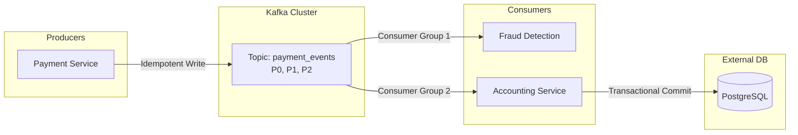

# Thiết kế Kafka (Phỏng vấn) - Kafka Design Interview

## Summary

**Kafka Design Interview** là một phần thiết yếu trong các vòng phỏng vấn System Design cho vị trí Data Engineer hoặc Backend Engineer. Chủ đề này đòi hỏi ứng viên phải thể hiện khả năng thiết kế các luồng xử lý dữ liệu thời gian thực (real-time event streaming) có độ trễ thấp, khả năng chịu lỗi cực tốt (fault-tolerant), và cách giải quyết các bài toán hóc búa về đảm bảo thứ tự bản ghi (message ordering) hay ngữ nghĩa xử lý chính xác một lần (exactly-once semantics).

---

## Definition

Trong phỏng vấn thiết kế hệ thống, việc sử dụng Apache Kafka không đơn thuần là "kéo thả" một message queue vào sơ đồ. Nó đòi hỏi bạn phải giải thích chi tiết cơ chế phân vùng (partitioning), cấu hình sao chép (replication), và cam kết gửi nhận (acks) để đáp ứng đúng yêu cầu của bài toán kinh doanh. Đó là bài toán cân bằng (trade-off) giữa độ trễ (latency), thông lượng (throughput) và độ tin cậy (durability).

---

## Why it exists

Nhà tuyển dụng đưa Kafka vào phỏng vấn vì hệ thống phân tán thực tế luôn gặp sự cố (network partition, node crash). Họ muốn biết:
1. Bạn có biết thiết kế hệ thống không bị mất dữ liệu khi máy chủ sập không?
2. Bạn có xử lý được tình huống hệ thống mua hàng xử lý trùng lặp một đơn hàng (duplicate processing) gây trừ tiền hai lần của người dùng không?
3. Bạn có hiểu cách scale (mở rộng) hệ thống theo chiều ngang khi lưu lượng truy cập tăng vọt từ 1 triệu lên 100 triệu tin nhắn/giây không?

---

## Core idea

Để thiết kế chuẩn với Kafka, bạn phải làm chủ 4 khái niệm kiến trúc lõi:
* **Topics & Partitions**: Dữ liệu được chia thành nhiều partition. Partition là đơn vị mở rộng quy mô (scalability) và cũng là đơn vị đảm bảo thứ tự (ordering). Tin nhắn chỉ đảm bảo thứ tự trong cùng một partition.
* **Consumer Groups**: Cơ chế giúp nhiều consumer chia sẻ khối lượng công việc đọc từ một topic mà không bị trùng lặp. Mỗi partition chỉ được cấp phát cho tối đa một consumer trong cùng một group.
* **Replication & ISR (In-Sync Replicas)**: Cơ chế sao chép dữ liệu ra nhiều broker. Nếu broker chứa Leader partition chết, một broker trong danh sách ISR sẽ được bầu lên làm Leader mới để duy trì tính sẵn sàng.
* **Delivery Semantics (Ngữ nghĩa phân phối)**: Gồm At-most-once (có thể mất mát nhưng nhanh), At-least-once (không mất mát nhưng có thể trùng lặp), và Exactly-once (chính xác một lần, xử lý phức tạp nhất).

---

## How it works

Khi thiết kế hệ thống với Kafka trong phỏng vấn, hãy đi theo quy trình:
1. **Thu thập Yêu cầu (Requirements)**: Số lượng message/giây? Kích thước trung bình mỗi message? Có cho phép mất dữ liệu không?
2. **Thiết kế Topic/Partition**: Dựa vào thông lượng cần thiết để tính toán số lượng partition. Chọn Partition Key phù hợp để đảm bảo thứ tự.
3. **Cấu hình Producer**: Tùy chỉnh `acks=all`, `retries`, và `idempotence` để đảm bảo độ tin cậy.
4. **Cấu hình Consumer**: Quản lý offset thủ công hay tự động? Làm sao để xử lý Poison Pill (tin nhắn rác làm treo hệ thống)?
5. **Vẽ sơ đồ luồng dữ liệu (Data Flow)**: Kết nối nguồn phát, Kafka Cluster, và hệ thống đích.

---

## Architecture / Flow

Sơ đồ kiến trúc xử lý thanh toán đảm bảo Exactly-Once với Kafka:

---

## Practical example

**Tình huống phỏng vấn**: "Thiết kế hệ thống thu thập log lượt xem video (Video View Logs) cho nền tảng như YouTube."

**Phân tích & Thiết kế**:
* **Đặc tả**: Thông lượng cực lớn (hàng tỷ views/ngày), có thể chấp nhận mất một phần trăm nhỏ dữ liệu, yêu cầu độ trễ cực thấp.
* **Thiết kế Topic**: `video_view_logs` với số lượng partition lớn (ví dụ: 100 partitions) để tối đa hóa khả năng xử lý song song.
* **Cấu hình Producer (Mobile/Web Client)**: Sử dụng `acks=0` hoặc `acks=1` để không làm chậm trải nghiệm xem video. Cấu hình `linger.ms` và `batch.size` lớn để gửi theo lô, tối ưu hóa I/O mạng.
* **Cấu hình Cluster**: Replication Factor = 2 (thay vì 3) để tiết kiệm chi phí lưu trữ, do dữ liệu view log không mang tính sống còn như dữ liệu tài chính.

---

## Best practices

* **Partition Key Design**: Luôn cẩn thận khi chọn khóa để phân vùng. Nếu chọn `user_id` làm khóa, tất cả hành động của một user sẽ vào cùng một partition và giữ đúng thứ tự. Nhưng nếu có một "super user" (ví dụ: tài khoản bot), partition đó sẽ bị quá tải (Hot Partition).
* **Quản lý Offsets**: Nên vô hiệu hóa tính năng tự động commit offset (`enable.auto.commit=false`). Hãy tự xử lý logic nghiệp vụ thành công rồi mới báo cho Kafka biết đã đọc xong (manual commit) để tránh mất mát tin nhắn khi app bị sập giữa chừng.
* **Retries & Dead Letter Queue (DLQ)**: Khi consumer gặp lỗi do định dạng tin nhắn sai, không nên retry vô hạn làm tắc nghẽn luồng. Hãy đẩy tin nhắn lỗi sang một topic riêng (DLQ) để điều tra sau.

---

## Common mistakes

* **Thêm Partition vô tội vạ**: Việc thay đổi số lượng partition sau khi hệ thống đang chạy sẽ làm phá vỡ logic định tuyến dựa trên khóa (hash key logic thay đổi), dẫn đến thứ tự tin nhắn bị đảo lộn.
* **Chỉ định cấu hình mặc định cho hệ thống tài chính**: Dùng `acks=1` (mặc định cũ) cho hệ thống thanh toán có thể dẫn đến mất dữ liệu nếu Leader broker sập ngay sau khi nhận tin báo thành công nhưng chưa kịp đồng bộ cho các Follower.
* **Consumer Group rỗng**: Cấu hình sai ID của Consumer Group khiến ứng dụng chạy lên tạo ra vô số group mới, tiêu tốn tài nguyên quản lý offset của Kafka.

---

## Trade-offs

### High Throughput vs Low Latency
* Gửi theo lô (`batch.size` lớn, `linger.ms` > 0) giúp thông lượng cực lớn nhưng độ trễ tăng.
* Gửi ngay lập tức (`linger.ms` = 0) giúp độ trễ thấp nhất nhưng lãng phí tài nguyên mạng và CPU.

### Durability vs Performance
* Yêu cầu tất cả node xác nhận (`acks=all`) đảm bảo không mất dữ liệu nhưng làm chậm quá trình ghi.
* Không cần xác nhận (`acks=0`) cho phép gửi với tốc độ bàn thờ nhưng rủi ro mất dữ liệu rất cao.

---

## When to use

* Kiến trúc Event-Driven, Microservices cần giao tiếp bất đồng bộ.
* Thu thập Log từ hàng nghìn máy chủ.
* Change Data Capture (CDC) từ cơ sở dữ liệu (kết hợp Debezium).
* Xử lý luồng (Stream Processing) với Flink hoặc Spark Streaming.

## When not to use

* Giao tiếp cần phản hồi ngay lập tức (Request-Reply / RPC / REST API).
* Lưu trữ dữ liệu cấu trúc phức tạp, cần truy vấn JOIN hoặc dùng WHERE (hãy dùng RDBMS hoặc DWH).
* Hệ thống rất nhỏ, thông lượng thấp (chỉ cần dùng RabbitMQ hoặc Redis Pub/Sub sẽ nhẹ nhàng hơn).

---

## Related concepts

* [Event Sourcing](/concepts/event-sourcing)
* [Change Data Capture (CDC)](/concepts/cdc)
* [Apache Flink](/concepts/apache-flink)
* [Message Queue](/concepts/message-queue)

---

## Interview questions

### 1. Làm thế nào để đảm bảo xử lý Exactly-Once trong Kafka?
* **Người phỏng vấn muốn kiểm tra**: Hiểu biết sâu về cơ chế giao dịch (transactions) và tính lũy đẳng (idempotence).
* **Gợi ý trả lời**: Để đạt Exactly-Once trên toàn bộ chu trình, cần 2 yếu tố:
  1. Ở tầng Producer: Bật `enable.idempotence=true` để Kafka tự loại bỏ tin nhắn gửi trùng do network retry bằng chuỗi PID và Sequence Number.
  2. Ở tầng Stream Processing / Consumer: Sử dụng Kafka Transactions API (bật `isolation.level=read_committed`) để đảm bảo quá trình đọc tin nhắn A, biến đổi, và ghi tin nhắn B sang topic khác thành một giao dịch nguyên tử (Atomic). Hoặc nếu lưu ra hệ thống bên ngoài (như database), hãy dùng Upsert dựa trên ID duy nhất để đảm bảo tính lũy đẳng (Idempotent Consumer).

### 2. Sự khác biệt giữa RabbitMQ và Kafka là gì?
* **Người phỏng vấn muốn kiểm tra**: Khả năng lựa chọn đúng công nghệ cho đúng bài toán.
* **Gợi ý trả lời**: RabbitMQ là một Message Broker theo cơ chế Smart-Broker / Dumb-Consumer. Nó định tuyến tin nhắn phức tạp, đẩy cho consumer và xóa tin nhắn ngay khi consumer báo thành công. Phù hợp cho task queue.
Trong khi đó, Kafka là Distributed Commit Log (Dumb-Broker / Smart-Consumer). Tin nhắn lưu trên đĩa tuần tự và không bị xóa sau khi đọc (chỉ xóa theo thời gian định trước). Consumer tự quản lý con trỏ (offset). Phù hợp cho xử lý luồng quy mô lớn, cho phép tua lại dữ liệu quá khứ.

### 3. Điều gì xảy ra khi số lượng Consumer lớn hơn số lượng Partition?
* **Người phỏng vấn muốn kiểm tra**: Hiểu biết cơ bản về cơ chế cân bằng tải của Consumer Group.
* **Gợi ý trả lời**: Nếu một topic có 3 partitions mà có 4 consumers cùng thuộc một Consumer Group, thì 3 consumers sẽ được gán mỗi người 1 partition để đọc. Consumer thứ 4 sẽ rơi vào trạng thái Idle (ngồi chơi) và không nhận được bất kỳ dữ liệu nào. Do đó, việc scale consumer chỉ có tác dụng khi số consumer nhỏ hơn hoặc bằng số partition.

---

## References

1. **Designing Data-Intensive Applications** - Martin Kleppmann (Chương 11: Stream Processing).
2. **Kafka: The Definitive Guide** - Neha Narkhede, Gwen Shapira, Todd Palino.
3. **Confluent Documentation** - Exactly-Once Semantics in Apache Kafka.

---

## English summary

The Kafka Design Interview tests a candidate's ability to architect distributed, real-time event streaming systems. Key evaluation points include partition strategy for high throughput, maintaining message ordering, and configuring durability and availability via replication (ISR) and acknowledgments (`acks=all`). Candidates must articulate the trade-offs between latency and throughput, and demonstrate mastery over advanced topics like Consumer Group rebalancing, manual offset management, handling Poison Pills via Dead Letter Queues (DLQ), and ensuring Exactly-Once semantics using idempotent producers and Kafka transactions.
