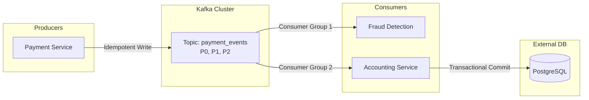

Trong các buổi phỏng vấn thiết kế hệ thống (System Design) dành cho vị trí Data Engineer hoặc Backend Engineer cấp độ Mid/Senior, các câu hỏi xoay quanh Apache Kafka luôn là một phần cực kỳ quan trọng và hóc búa. 

Tại sao lại như vậy? Bởi vì trong các hệ thống phân tán quy mô lớn, việc xử lý dữ liệu thời gian thực (real-time event streaming) chưa bao giờ là dễ dàng. Hệ thống thực tế luôn phải đối mặt với các sự cố bất khả kháng như mất kết nối mạng (network partitions), sập máy chủ đột ngột (node crashes) hay lưu lượng truy cập tăng vọt. Nhà tuyển dụng muốn xem cách bạn sử dụng Kafka để thiết kế một hệ thống có độ trễ thấp, thông lượng cao, không bao giờ bị mất mát dữ liệu và xử lý chính xác một lần (exactly-once processing).

---

## Bản chất của việc thiết kế hệ thống với Kafka

Khi bước vào buổi phỏng vấn, việc đề xuất sử dụng Apache Kafka không đơn thuần là vẽ một chiếc hộp mang tên "Message Queue" vào sơ đồ kiến trúc. 

Người phỏng vấn sẽ ngay lập tức xoáy sâu vào các chi tiết kỹ thuật:
* Bạn sẽ chia bao nhiêu phân vùng (partitions)?
* Chiến lược chọn khóa phân vùng (partition key) của bạn là gì?
* Bạn cấu hình số lượng bản sao (replication factor) và cơ chế xác nhận (acks) của Producer ra sao để đảm bảo dữ liệu không bị thất lạc?
* Làm thế nào để giải quyết bài toán trùng lặp đơn hàng của người dùng khi hệ thống xảy ra sự cố mạng?

Việc trả lời tốt những câu hỏi này thể hiện tư duy thiết kế hệ thống sâu sắc, biết rõ điểm mạnh và điểm yếu (trade-offs) của từng tham số cấu hình.

---

## Bốn trụ cột kiến trúc cốt lõi bạn bắt buộc phải làm chủ

Để tự tin giải quyết bất kỳ bài toán System Design nào với Kafka, bạn cần hiểu rõ 4 khái niệm nền tảng sau:

* **Topics & Partitions**: Dữ liệu trong Kafka được ghi vào các Topic, và mỗi Topic được chia thành nhiều Partition. Partition chính là đơn vị nhỏ nhất giúp Kafka mở rộng quy mô tính toán (scalability) và cũng là nơi duy nhất đảm bảo thứ tự của tin nhắn (message ordering). Hãy nhớ rằng: Kafka chỉ cam kết giữ đúng thứ tự tin nhắn *trong cùng một partition*, không đảm bảo trên toàn bộ Topic.
* **Consumer Groups**: Cơ chế giúp phân bổ công việc đọc dữ liệu từ một Topic cho nhiều Consumer mà không lo bị trùng lặp dữ liệu. Mỗi Partition chỉ được đọc bởi tối đa một Consumer tại một thời điểm trong cùng một Group.
* **Replication & ISR (In-Sync Replicas)**: Cơ chế sao chép dữ liệu sang các máy chủ khác (Broker) để phòng ngừa rủi ro phần cứng bị sập. Nếu Broker chứa Leader partition gặp sự cố, hệ thống sẽ tự động bầu một Broker khác trong danh sách ISR lên làm Leader mới để duy trì hoạt động.
* **Delivery Semantics (Ngữ nghĩa phân phối)**: 
  * **At-most-once**: Gửi đi và không quan tâm kết quả (nhanh nhất, nhưng có thể mất tin nhắn).
  * **At-least-once**: Đảm bảo tin nhắn sẽ đến đích, nhưng có thể bị gửi trùng (phổ biến nhất).
  * **Exactly-once**: Đảm bảo tin nhắn được xử lý chính xác một lần duy nhất (phức tạp nhất nhưng an toàn nhất cho dữ liệu tài chính).

---

## Quy trình từng bước khi thiết kế luồng dữ liệu thời gian thực

Khi nhận đề bài thiết kế hệ thống, hãy bình tĩnh dẫn dắt người phỏng vấn qua các bước tư duy mạch lạc:

1. **Thu thập yêu cầu nghiệp vụ**: Làm rõ các con số như lượng tin nhắn phát sinh mỗi giây (Throughput), kích thước trung bình của mỗi tin nhắn, mức độ chấp nhận mất mát dữ liệu (Data loss tolerance) và độ trễ tối đa cho phép (Latency).
2. **Thiết kế Topic và Partition**: Tính toán số lượng partition tối ưu dựa trên thông lượng mong muốn. Lựa chọn Partition Key thích hợp để vừa đảm bảo thứ tự logic của nghiệp vụ (ví dụ: theo `order_id` hoặc `user_id`), vừa tránh được hiện tượng phân bổ lệch dữ liệu (Hot Partition).
3. **Cấu hình Producer**: Tùy chỉnh các tham số quan trọng như `acks=all`, `retries=max`, và kích hoạt `enable.idempotence=true` đối với các hệ thống yêu cầu độ tin cậy tuyệt đối.
4. **Cấu hình Consumer**: Lựa chọn chiến lược commit offset thủ công thay vì tự động để kiểm soát lỗi tốt hơn. Thiết lập các quy trình xử lý tin nhắn bị lỗi định dạng (Poison Pills) để tránh làm tắc nghẽn luồng xử lý chung.

---

## Trực quan hóa kiến trúc xử lý thanh toán Exactly-Once

Sơ đồ dưới đây minh họa luồng xử lý giao dịch thanh toán đảm bảo Exactly-Once từ khâu gửi tin đến lưu trữ vào cơ sở dữ liệu:

---

## Tình huống thực tế: Thiết kế hệ thống Video View Logs quy mô tỷ lượt xem

**Đề bài từ người phỏng vấn**: *"Hãy thiết kế một hệ thống thu thập log lượt xem video (Video View Logs) cho một nền tảng chia sẻ video lớn tương tự như YouTube."*

**Phân tích & Hướng thiết kế**:

* **Đặc tả nghiệp vụ**: Hệ thống có thông lượng cực kỳ khổng lồ (hàng tỷ lượt xem mỗi ngày). Đối với dạng dữ liệu log lượt xem, chúng ta có thể chấp nhận một tỷ lệ mất mát nhỏ (ví dụ 0.01%) và yêu cầu độ trễ ghi log phải cực kỳ thấp để không ảnh hưởng đến trải nghiệm xem video của người dùng.
* **Thiết kế Topic**: Tạo topic `video_view_logs` với số lượng partition lớn (ví dụ: 100 partitions hoặc nhiều hơn) nhằm tối đa hóa khả năng xử lý song song và ghi dữ liệu đồng thời.
* **Cấu hình Producer (Mobile/Web Client)**: Cấu hình `acks=1` (chỉ cần Leader Broker xác nhận) hoặc thậm chí `acks=0` (không cần chờ xác nhận) để tối ưu hóa tốc độ ghi. Tăng cấu hình `linger.ms` (ví dụ: 50-100ms) và `batch.size` lớn để ép dữ liệu gửi theo từng lô (batching), giúp giảm thiểu số lượng cuộc gọi mạng và tiết kiệm băng thông.
* **Cấu hình Cluster**: Đặt Replication Factor = 2 (thay vì 3) để giảm bớt chi phí lưu trữ hạ tầng, vì dữ liệu view log này không mang tính sống còn như các giao dịch chuyển tiền.

---

## Những nguyên tắc vàng và Best Practices

* **Lưu ý lỗi "Hot Partition" khi chọn Partition Key**: Nếu bạn chọn `user_id` làm khóa phân vùng để đảm bảo toàn bộ hành động của một người dùng được xử lý đúng thứ tự, điều này rất tốt. Tuy nhiên, nếu hệ thống xuất hiện một vài tài khoản "super user" (ví dụ: các tài khoản bot tự động gửi hàng triệu yêu cầu mỗi giờ), partition chứa khóa đó sẽ bị quá tải, trong khi các partition khác lại rảnh rỗi. Hãy kết hợp thêm các yếu tố ngẫu nhiên (salt) hoặc chọn khóa có độ phân tán cao hơn.
* **Tự quản lý Commit Offset thủ công**: Luôn tắt tính năng tự động commit (`enable.auto.commit=false`). Hãy chỉ commit offset sau khi ứng dụng của bạn đã thực thi thành công toàn bộ logic nghiệp vụ (ví dụ: ghi dữ liệu vào database thành công). Việc này giúp ngăn ngừa mất mát tin nhắn trong trường hợp ứng dụng bị sập đột ngột khi đang xử lý dở dang.
* **Xây dựng luồng xử lý tin nhắn lỗi (Dead Letter Queue - DLQ)**: Khi Consumer gặp một tin nhắn bị hỏng cấu trúc (Poison Pill), việc cố gắng chạy lại (retry) vô hạn sẽ làm nghẽn toàn bộ partition đó. Giải pháp chuẩn mực là đẩy tin nhắn lỗi này sang một Topic riêng gọi là Dead Letter Queue để đội ngũ kỹ sư điều tra sau, và cho phép Consumer tiếp tục xử lý các tin nhắn tiếp theo.

---

## Các sai lầm kinh điển dễ làm sập hệ thống hoặc sai lệch số liệu

* **Thay đổi số lượng Partition khi đang chạy Production**: Việc tăng thêm số lượng partition của một Topic đang hoạt động sẽ làm thay đổi thuật toán băm (hash) để định tuyến tin nhắn. Kết quả là các tin nhắn mới có cùng một khóa sẽ bị đẩy sang partition khác, phá vỡ hoàn toàn cam kết về thứ tự xử lý dữ liệu trước đó.
* **Giữ nguyên cấu hình mặc định cho các giao dịch tài chính**: Nhiều kỹ sư giữ nguyên cấu hình `acks=1` của Kafka cho các hệ thống thanh toán. Nếu Leader Broker bị sập ngay sau khi báo ghi thành công cho Producer nhưng dữ liệu chưa kịp đồng bộ sang Follower Broker, tin nhắn đó sẽ bị biến mất vĩnh viễn khỏi hệ thống.
* **Khởi tạo bừa bãi các Consumer Group**: Đặt tên ID của Consumer Group một cách ngẫu nhiên mỗi lần chạy ứng dụng sẽ khiến Kafka phải liên tục tạo mới và duy trì lưu trữ lịch sử offset của các group rác này, dẫn đến suy giảm hiệu năng của Kafka Cluster.

---

## Đặt lên bàn cân các bài toán đánh đổi (Trade-offs)

### Thông lượng cao (Throughput) vs Độ trễ thấp (Latency)
* Nếu bạn muốn **Thông lượng cực cao**: Hãy cấu hình gửi dữ liệu theo lô lớn (`linger.ms` lớn, `batch.size` lớn). Việc này giúp giảm tải cho mạng và CPU, nhưng tin nhắn sẽ phải nằm đợi một thời gian ngắn trước khi được gửi đi (tăng độ trễ).
* Nếu bạn muốn **Độ trễ cực thấp**: Hãy thiết lập gửi tin nhắn ngay lập tức (`linger.ms=0`). Tin nhắn đi rất nhanh, nhưng sẽ tạo ra rất nhiều cuộc gọi mạng nhỏ lẻ, làm giảm băng thông tổng thể của hệ thống.

### Độ an toàn dữ liệu (Durability) vs Hiệu năng ghi (Performance)
* **An toàn tuyệt đối**: Sử dụng `acks=all` (tất cả các bản sao phải xác nhận đã ghi dữ liệu). Quá trình ghi sẽ chậm hơn do phải chờ đồng bộ mạng, nhưng đảm bảo dữ liệu không bao giờ bị mất.
* **Hiệu năng tối đa**: Sử dụng `acks=0`. Gửi tin nhắn đi mà không cần đợi xác nhận, tốc độ cực nhanh nhưng chấp nhận rủi ro mất mát dữ liệu nếu Broker gặp sự cố.

---

## Khi nào nên dùng và Khi nào nên tránh?

* **Nên dùng**: Cho các hệ thống kiến trúc hướng sự kiện (Event-Driven), truyền tin bất đồng bộ giữa các Microservices, thu thập log từ hàng ngàn máy chủ tập trung, hoặc làm cầu nối nạp dữ liệu thay đổi (CDC - Change Data Capture) từ cơ sở dữ liệu sang kho dữ liệu.
* **Nên tránh**: 
  * Khi bạn cần giao tiếp dạng yêu cầu - phản hồi đồng bộ tức thì (Request-Reply như REST API hay RPC).
  * Khi hệ thống có quy mô nhỏ, thông lượng thấp (chỉ cần dùng các công cụ đơn giản và dễ vận hành hơn như RabbitMQ hay Redis Pub/Sub).
  * Khi bạn cần truy vấn dữ liệu phức tạp dạng bảng (JOIN, WHERE). Kafka là một log ghi tuần tự, không phải là một cơ sở dữ liệu quan hệ.

---

## Bộ câu hỏi phỏng vấn thực tế và Gợi ý trả lời ghi điểm

### 1. Làm thế nào để cấu hình xử lý Exactly-Once từ đầu đến cuối (End-to-End) trong Kafka?
* **Gợi ý trả lời**: Để đạt được ngữ nghĩa Exactly-Once, chúng ta cần kết hợp chặt chẽ cấu hình ở cả Producer và Consumer:
  * **Tại Producer**: Kích hoạt `enable.idempotence=true`. Producer sẽ tự động đính kèm ID và số thứ tự (Sequence Number) cho từng tin nhắn. Kafka Broker sẽ dựa vào thông tin này để tự động loại bỏ các tin nhắn trùng lặp nếu Producer gửi lại do lỗi mạng.
  * **Tại Consumer**: Nếu Consumer làm nhiệm vụ đọc từ Topic A và ghi kết quả sang Topic B, ta sử dụng Kafka Transactions API (bật cấu hình `isolation.level=read_committed`). Việc này giúp đảm bảo quá trình đọc tin nhắn, commit offset và ghi tin nhắn mới được thực hiện như một giao dịch nguyên tử (Atomic transaction) — hoặc thành công cả hai, hoặc rollback nếu gặp lỗi. 
  * Nếu Consumer ghi dữ liệu ra một hệ thống lưu trữ ngoài (như MySQL hay Elasticsearch), tôi sẽ thiết kế Consumer có tính chất lũy đẳng (Idempotent Consumer) bằng cách dùng câu lệnh `UPSERT` dựa trên một khóa duy nhất (như `transaction_id`) được gửi kèm trong tin nhắn.

### 2. Sự khác biệt cốt lõi giữa Kafka và RabbitMQ là gì? Bạn sẽ chọn cái nào khi thiết kế hệ thống?
* **Gợi ý trả lời**: 
  * **RabbitMQ** hoạt động theo mô hình *Smart-Broker / Dumb-Consumer*. Broker làm nhiệm vụ định tuyến tin nhắn phức tạp và sẽ xóa ngay tin nhắn khỏi bộ nhớ sau khi Consumer xác nhận đã đọc thành công. Nó rất thích hợp cho các bài toán quản lý hàng đợi công việc (Task Queues) hoặc truyền thông điệp nội bộ giữa các dịch vụ có logic định tuyến phức tạp.
  * **Kafka** hoạt động theo mô hình *Dumb-Broker / Smart-Consumer*. Bản chất Kafka là một nhật ký ghi tuần tự phân tán (Distributed Commit Log). Dữ liệu ghi xuống đĩa cứng và được lưu giữ lâu dài (không bị xóa ngay sau khi đọc). Consumer tự quản lý con trỏ (offset) của mình để đọc dữ liệu. Kafka cực kỳ tối ưu cho các bài toán xử lý luồng (Stream Processing) với thông lượng khổng lồ, và cho phép các Consumer mới có thể tua lại thời gian để đọc lại toàn bộ dữ liệu lịch sử.

### 3. Điều gì sẽ xảy ra nếu số lượng Consumer trong một Consumer Group lớn hơn số lượng Partition của Topic?
* **Gợi ý trả lời**: 
  Theo nguyên tắc cân bằng tải của Kafka, mỗi Partition tại một thời điểm chỉ được gán cho duy nhất một Consumer trong cùng một Group. 
  Vì vậy, nếu Topic chỉ có 3 Partition nhưng Consumer Group lại có 4 Consumer, thì 3 Consumer đầu tiên sẽ được gán đọc từ 3 Partition đó. Consumer thứ 4 sẽ rơi vào trạng thái rảnh rỗi (Idle) để làm nhiệm vụ dự phòng. 
  Do đó, để tăng khả năng xử lý song song bằng cách thêm Consumer, bắt buộc chúng ta phải tăng số lượng Partition tương ứng trước.

---

## Sách hay và tài liệu tham khảo

1. **Designing Data-Intensive Applications** - Martin Kleppmann (Chương 11 phân tích cực kỳ sâu sắc về luồng xử lý dữ liệu và hệ thống thông điệp).
2. **Kafka: The Definitive Guide** - Cẩm cẩm nang gối đầu giường để hiểu cặn kẽ về Apache Kafka của các tác giả từ Confluent.
3. **Confluent Blog** - Các bài viết chuyên sâu về Exactly-Once Semantics và thiết kế hệ thống phân tán.

---

## English Summary

The Kafka Design Interview tests a candidate's ability to architect distributed, real-time event streaming systems. Key evaluation points include partition strategy for high throughput, maintaining message ordering, and configuring durability and availability via replication (ISR) and acknowledgments (`acks=all`). Candidates must articulate the trade-offs between elegance and speed, and demonstrate mastery over advanced topics like Consumer Group rebalancing, manual offset management, handling Poison Pills via Dead Letter Queues (DLQ), and ensuring Exactly-Once semantics using idempotent producers and Kafka transactions.
