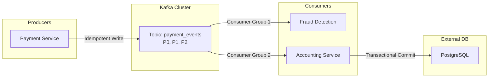

Trong vòng System Design cho Data Engineer hoặc Backend Engineer mức Mid/Senior, khoảnh khắc bạn vẽ một chiếc hộp ghi "Kafka" lên bảng là khoảnh khắc câu hỏi thật sự bắt đầu. Người phỏng vấn sẽ hỏi ngay: bao nhiêu partition? Partition key là gì? `acks` cấu hình ra sao? Nếu mạng chập chờn làm producer gửi lại, đơn hàng có bị ghi trùng không?

Nói cách khác, [Apache Kafka](/concepts/5-stream-processing-realtime/apache-kafka) trong phỏng vấn không phải một cái tên để nhắc đến, mà là một tập các quyết định cấu hình — và mỗi quyết định đều là một trade-off mà bạn phải giải thích được.

---

## Bốn khái niệm nền phải nắm trước khi vẽ bất kỳ kiến trúc nào

**Topics và Partitions.** Dữ liệu ghi vào topic, mỗi topic chia thành nhiều partition. Partition là đơn vị song song hóa của Kafka, đồng thời là ranh giới duy nhất của cam kết thứ tự: Kafka chỉ đảm bảo thứ tự tin nhắn *trong một partition*, không phải trên toàn topic. Gần như mọi câu hỏi xoáy về ordering đều quy về điểm này.

**[Consumer Groups](/concepts/5-stream-processing-realtime/consumer-groups).** Cơ chế chia việc đọc: trong một group, mỗi partition được gán cho tối đa một consumer tại một thời điểm. Nhiều group độc lập có thể cùng đọc một topic — đây là điểm khiến Kafka làm được mô hình pub-sub lẫn queue trong cùng một hệ thống.

**Replication và ISR.** Mỗi partition có một leader và các follower sao chép dữ liệu. Danh sách ISR (in-sync replicas) là các bản sao đang bám kịp leader; khi leader sập, một broker trong ISR được bầu lên thay. Độ an toàn dữ liệu của Kafka đứng trên hai chân: replication factor và cấu hình `acks` của producer — thiếu một trong hai đều có kịch bản mất dữ liệu.

**Delivery semantics.** Theo tài liệu Confluent về ngữ nghĩa phân phối, có ba mức: *at-most-once* (nhanh nhất, chấp nhận mất), *at-least-once* (không mất nhưng có thể trùng — mặc định thực tế của đa số hệ thống), và *exactly-once* (không mất, không trùng — phức tạp nhất, cần cho dữ liệu tài chính). Phần lớn câu hỏi khó của vòng này là biến thể của câu "làm sao đạt exactly-once".

---

## Trình tự trả lời một đề bài thiết kế

Nhận đề xong, đừng nhảy vào chọn số partition. Đi theo trình tự sau, nói to từng bước:

1. **Chốt các con số nghiệp vụ**: bao nhiêu message mỗi giây, kích thước trung bình mỗi message, chấp nhận mất dữ liệu ở mức nào, độ trễ tối đa bao nhiêu. Ba câu trả lời khác nhau cho ba câu hỏi này dẫn đến ba thiết kế khác nhau — đây là lý do bước này đứng đầu.
2. **Thiết kế topic và partition**: ước lượng số partition từ throughput mục tiêu; chọn partition key theo yêu cầu thứ tự của nghiệp vụ (`order_id`, `user_id`) đồng thời cân nhắc nguy cơ hot partition.
3. **Cấu hình producer**: hệ thống cần độ tin cậy cao thì `acks=all`, `enable.idempotence=true`, retries cao. Hệ thống ưu tiên tốc độ thì nới lỏng dần và nói rõ mình đang đánh đổi gì.
4. **Cấu hình consumer**: commit offset thủ công sau khi xử lý xong nghiệp vụ; có phương án cho message hỏng định dạng (poison pill) để không tắc cả partition.

---

## Ví dụ luồng thanh toán exactly-once

Hai consumer group độc lập (fraud detection và accounting) cùng đọc một topic mà không ảnh hưởng nhau — mỗi group giữ offset riêng. Điểm dễ bị hỏi xoáy nằm ở mũi tên cuối: ghi từ Kafka ra PostgreSQL nằm *ngoài* phạm vi transaction của Kafka, nên cần consumer lũy đẳng (phần câu hỏi 1 bên dưới).

---

## Tình huống ngược chiều: log lượt xem video quy mô tỷ sự kiện/ngày

**Đề bài**: *"Thiết kế hệ thống thu thập log lượt xem video cho một nền tảng cỡ YouTube."*

Đề này cố tình ngược với bài thanh toán: dữ liệu khổng lồ nhưng *không* sống còn. Ứng viên bê nguyên cấu hình an toàn tối đa (`acks=all`, RF=3, exactly-once) vào đây là chưa hiểu trade-off — hệ thống sẽ đắt và chậm một cách vô ích.

* **Đặc tả**: hàng tỷ view/ngày; mất 0.01% log không làm sai lệch phân tích xu hướng; độ trễ ghi phải thấp để không ảnh hưởng trải nghiệm xem.
* **Topic**: `video_view_logs` với số partition lớn (hàng trăm) để tối đa song song hóa.
* **Producer**: `acks=1` hoặc thậm chí `acks=0`; tăng `linger.ms` (50-100ms) và `batch.size` để gom lô, giảm số cuộc gọi mạng. Với log analytics, throughput ăn đứt độ chính xác từng bản ghi.
* **Cluster**: replication factor 2 thay vì 3 — giảm chi phí lưu trữ và băng thông replication, chấp nhận cửa sổ rủi ro rộng hơn cho loại dữ liệu chịu được mất mát.

So sánh được hai bài toán này (thanh toán vs. view log) trong cùng buổi phỏng vấn là cách thuyết phục nhất để chứng minh bạn thiết kế theo yêu cầu, không theo thói quen.

---

## Ba lỗi vận hành kinh điển người phỏng vấn hay gài

**Hot partition do chọn key thiếu cân nhắc.** Chọn `user_id` làm key đảm bảo mọi hành động của một người dùng đúng thứ tự — hợp lý. Nhưng nếu xuất hiện vài "super user" (bot, tài khoản doanh nghiệp) sinh hàng triệu sự kiện mỗi giờ, partition chứa key đó quá tải trong khi các partition khác rảnh. Hướng xử lý: thêm salt vào key cho nhóm key nóng, hoặc chọn key có độ phân tán cao hơn — và thừa nhận rằng salt sẽ hy sinh thứ tự toàn cục của key đó.

**Tăng số partition trên topic đang chạy production.** Số partition thay đổi thì phép băm `hash(key) % số_partition` đổi kết quả: message mới cùng key rơi vào partition khác message cũ, phá cam kết thứ tự. Vì vậy số partition cần được tính dư ngay từ đầu; nếu buộc phải tăng, phải có kế hoạch cho giai đoạn chuyển tiếp.

**Auto-commit offset và mất message âm thầm.** Với `enable.auto.commit=true`, offset có thể được commit *trước khi* logic nghiệp vụ chạy xong; app sập giữa chừng là message coi như đã xử lý dù thực tế chưa. Chuẩn thực hành: tắt auto-commit, chỉ commit sau khi ghi kết quả thành công. Kèm theo đó là Dead Letter Queue cho poison pill — retry vô hạn một message hỏng sẽ chặn cả partition phía sau nó.

---

## Hai trục trade-off phải nói được thành lời

**Throughput vs. latency.** Gom lô lớn (`linger.ms` cao, `batch.size` lớn) giúp giảm số cuộc gọi mạng và tăng thông lượng tổng, nhưng mỗi message phải nằm đợi trong buffer — độ trễ tăng. `linger.ms=0` cho độ trễ thấp nhất nhưng sinh nhiều request nhỏ, tốn CPU và băng thông. Không có giá trị "đúng"; chỉ có giá trị hợp với yêu cầu độ trễ đã chốt ở bước 1.

**Durability vs. tốc độ ghi.** `acks=all` bắt mọi replica trong ISR xác nhận — chậm hơn nhưng dữ liệu sống sót qua sự cố leader. `acks=1` nhanh hơn nhưng có cửa sổ mất dữ liệu: leader xác nhận xong rồi sập trước khi follower kịp đồng bộ. `acks=0` là fire-and-forget. Câu "acks=1 có mất dữ liệu không, mất trong tình huống nào?" là câu hỏi sàng lọc phổ biến — trả lời được kịch bản cụ thể trên là qua.

---

## Khi nào Kafka là lựa chọn sai

Đề xuất công cụ đúng chỗ quan trọng ngang hiểu công cụ. Kafka hợp với kiến trúc event-driven, truyền tin bất đồng bộ giữa microservices, thu thập log tập trung, và làm xương sống cho CDC (Change Data Capture) từ database vận hành sang warehouse.

Kafka là lựa chọn kém khi: cần giao tiếp request-reply đồng bộ (dùng REST/gRPC); hệ thống nhỏ, throughput thấp (RabbitMQ hay Redis Pub/Sub vận hành nhẹ hơn nhiều — chi phí vận hành một Kafka cluster không hề nhỏ); hoặc cần truy vấn dữ liệu dạng bảng với JOIN và filter — Kafka là commit log tuần tự, không phải database.

---

## Ba câu hỏi thực tế và cách trả lời

### 1. Cấu hình exactly-once end-to-end như thế nào?

Trả lời theo từng chặng của luồng dữ liệu:

* **Producer → Broker**: bật `enable.idempotence=true`. Producer đính kèm producer ID và sequence number vào mỗi message; broker dùng chúng để loại message trùng khi producer gửi lại do lỗi mạng. Cơ chế này được đưa vào Kafka từ phiên bản 0.11 qua KIP-98.
* **Consumer đọc topic A, ghi topic B** (điển hình là Kafka Streams): dùng Transactions API — việc đọc, commit offset và ghi kết quả gói trong một transaction nguyên tử; consumer phía sau đặt `isolation.level=read_committed`. Trong Kafka Streams chỉ cần `processing.guarantee=exactly_once_v2`.
* **Consumer ghi ra hệ thống ngoài** (MySQL, Elasticsearch): transaction của Kafka không với tới đây. Giải pháp là thiết kế consumer lũy đẳng — `UPSERT` theo một khóa duy nhất (như `transaction_id`) gửi kèm trong message, để ghi lại lần nữa cũng không sinh bản ghi trùng.

Chốt được ý "exactly-once của Kafka có phạm vi, ra khỏi Kafka thì phải tự xây bằng idempotency" là điểm ăn tiền của câu này.

### 2. Kafka khác RabbitMQ thế nào, chọn cái nào?

* **RabbitMQ**: mô hình smart-broker/dumb-consumer. Broker định tuyến phức tạp (exchange, routing key) và xóa message sau khi consumer xác nhận. Hợp với task queue và truyền thông điệp giữa các service cần routing linh hoạt.
* **Kafka**: mô hình dumb-broker/smart-consumer. Bản chất là distributed commit log — dữ liệu ghi xuống đĩa, giữ theo retention policy chứ không xóa sau khi đọc; consumer tự quản lý offset. Hợp với stream processing throughput lớn, và cho phép consumer mới "tua lại" đọc toàn bộ lịch sử — điều RabbitMQ không làm được.

Câu trả lời tốt kết thúc bằng tiêu chí chọn, không phải bằng phán quyết: cần replay và throughput lớn → Kafka; cần routing phức tạp và hàng đợi công việc đơn giản → RabbitMQ.

### 3. Consumer nhiều hơn partition thì sao?

Mỗi partition chỉ gán cho một consumer trong group, nên topic 3 partition với group 4 consumer sẽ có một consumer ngồi không (idle) — nó chỉ có giá trị dự phòng khi consumer khác chết. Muốn tăng mức song song bằng cách thêm consumer, phải tăng số partition trước. Đây cũng là lý do số partition thường được tính dư từ đầu (liên hệ ngược lại lỗi "tăng partition khi đang chạy" ở trên — người phỏng vấn thích ứng viên tự nối được hai ý này).

---

## Tài liệu tham khảo

* [Confluent Documentation — Message Delivery Guarantees for Apache Kafka](https://docs.confluent.io/kafka/design/delivery-semantics.html) — định nghĩa chính thức của at-most-once / at-least-once / exactly-once.
* [Confluent Blog — Exactly-once Semantics Are Possible: Here's How Kafka Does It](https://www.confluent.io/blog/exactly-once-semantics-are-possible-heres-how-apache-kafka-does-it/) — bài giải thích cơ chế idempotent producer và transactions từ chính đội thiết kế tính năng.
* [KIP-98 — Exactly Once Delivery and Transactional Messaging (Apache Kafka)](https://cwiki.apache.org/confluence/display/KAFKA/KIP-98+-+Exactly+Once+Delivery+and+Transactional+Messaging) — đặc tả gốc của cơ chế transaction.
* **Kafka: The Definitive Guide, 2nd Edition — Gwen Shapira và cộng sự (O'Reilly)** — tài liệu toàn diện nhất về vận hành Kafka, viết bởi các kỹ sư Confluent.
* **Designing Data-Intensive Applications — Martin Kleppmann (O'Reilly)** — chương 11 đặt Kafka trong bức nền rộng hơn của stream processing và log-based messaging.
