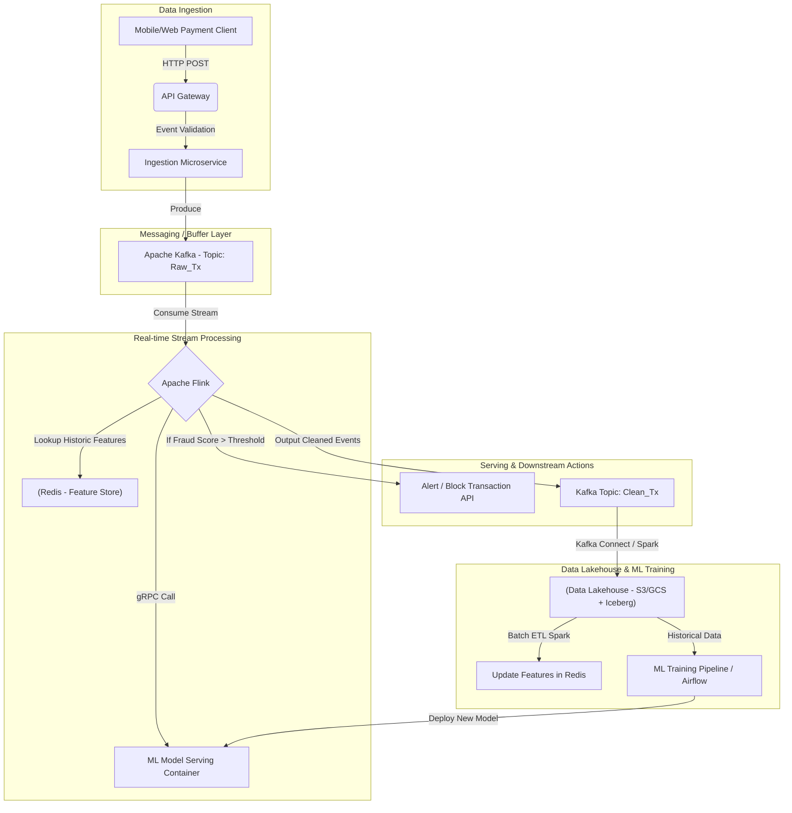
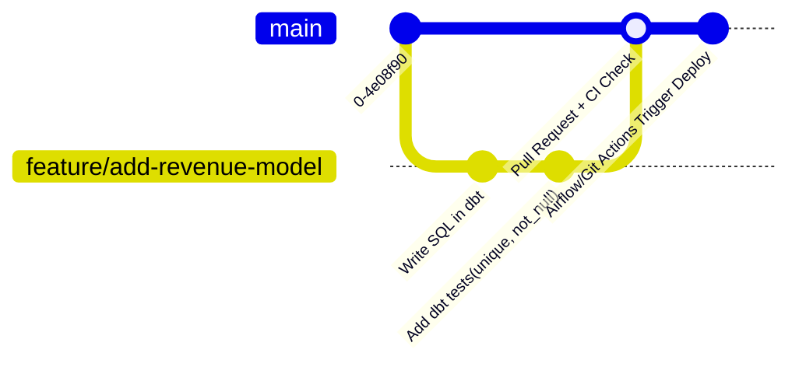

Quy trình phỏng vấn Data Engineer ở các công ty công nghệ (FAANG, Grab, Gojek, VNG...) đã hội tụ về một cấu trúc khá ổn định: một vòng SQL live coding, một vòng Python, một vòng system design cho dữ liệu, thường thêm một vòng chuyên sâu theo stack (Spark, Kafka) và một vòng behavioral. Điều đó có nghĩa là việc chuẩn bị có thể — và nên — được tổ chức theo đúng các vòng đó, thay vì học dàn trải.

Trang này là điểm xuất phát: phần đầu là lộ trình đọc theo từng vòng, phần sau đi sâu vào các chủ đề nền tảng xuất hiện xuyên suốt mọi vòng — kiến trúc, mô hình dữ liệu, Spark internals, Kafka internals và DataOps.

---

## Lộ trình đọc theo từng vòng phỏng vấn

Các bài trong mục Interview, xếp theo thứ tự vòng thi phổ biến:

**Vòng coding:**

* [SQL Interview Patterns](/interview/sql-interview-patterns) — window functions, CTE đệ quy, gaps and islands, các dạng bài lặp lại nhiều nhất.
* [Python DE Interview Patterns](/interview/python-de-interview) — xử lý file lớn hơn RAM, generator, flatten JSON, concurrency.

**Vòng thiết kế:**

* [Pipeline Design Interview](/interview/pipeline-design-interview) — idempotency, backfill, late-arriving data, CDC; vòng quan trọng nhất với DE.
* [Data Modeling Interview](/interview/data-modeling-interview) — quy trình 4 bước Kimball, chọn grain, SCD.
* [Kafka Design Interview](/interview/kafka-design-interview) — partition key, acks, exactly-once semantics.
* [Cloud Platform Interview](/interview/cloud-platform-interview) — chọn mức dịch vụ, FinOps, bảo mật IAM.

**Vòng vận hành và tối ưu:**

* [Spark Optimization Interview](/interview/spark-optimization-interview) — chẩn đoán OOM, data skew, AQE.
* [Performance Tuning QA](/interview/performance-tuning-qa) — EXPLAIN plan, partition pruning, indexing.
* [Production Incident QA](/interview/production-incident-qa) — quy trình ứng phó sự cố theo chuẩn SRE, RCA, postmortem.

**Vòng con người:**

* [DE Behavioral Interview](/interview/de-behavioral-interview) — phương pháp STAR, story bank, xử lý câu hỏi xung đột và thất bại.

Phần còn lại của trang này tổng hợp các chủ đề nền dùng chung cho nhiều vòng.

---

## 1. System Design: kiến trúc dữ liệu ở quy mô lớn

Vòng system design không có đáp án đúng duy nhất. Người phỏng vấn chấm cách bạn thu thập yêu cầu, và đặc biệt là khả năng bảo vệ quyết định kỹ thuật dựa trên trade-off giữa bốn đại lượng: latency, throughput, consistency và cost.

### 1.1. Lambda vs. Kappa Architecture

Đề bài quen thuộc: thiết kế hệ thống vừa phục vụ báo cáo realtime vừa xử lý dữ liệu lịch sử. Hai mẫu kiến trúc cần nắm:

**Lambda Architecture** chia luồng dữ liệu làm hai nhánh độc lập: *batch layer* (dữ liệu bất biến trên HDFS/S3, xử lý bằng Spark — chính xác tuyệt đối nhưng trễ hàng giờ) và *speed layer* (Kafka + Flink/Spark Streaming — bù độ trễ, chấp nhận sai số nhỏ). Kết quả hợp nhất tại *serving layer*. Nhược điểm lớn nhất, và là thứ phải nói ra: cùng một logic nghiệp vụ phải duy trì ở hai codebase song song — chi phí bảo trì tăng gấp đôi và hai nhánh dễ lệch nhau theo thời gian.

**Kappa Architecture**, do Jay Kreps (đồng sáng lập Confluent) đề xuất, loại bỏ batch layer: mọi thay đổi dữ liệu là một event stream, Kafka với retention dài làm nguồn sự thật duy nhất, và chỉ một framework stream processing (như Flink) xử lý tất cả. Cần backfill? Replay lại luồng lịch sử với throughput cao. Ưu điểm là codebase đồng nhất; cái giá là mọi bài toán — kể cả bài vốn dĩ là batch — phải diễn đạt được dưới dạng streaming, và chi phí lưu trữ log dài hạn trên Kafka không nhỏ (các hệ thống hiện đại thường dùng tiered storage để giảm bớt).

### 1.2. Bài mẫu: hệ thống phát hiện gian lận thời gian thực

Thiết kế kinh điển cho bài toán fraud detection với SLA xử lý dưới 100ms:



Ba trade-off cần chủ động phân tích khi trình bày:

* **Vì sao Flink thay vì Spark Streaming?** Spark Structured Streaming mặc định chạy micro-batch, độ trễ tối thiểu thường ở mức trăm mili-giây — sát nút hoặc vượt SLA. Flink xử lý từng sự kiện (true streaming), quản lý state tốt và xử lý event-time chuẩn qua cơ chế watermark, cho phép phản hồi trong vài mili-giây. (Nếu bị hỏi vặn: Spark có continuous processing mode nhưng còn giới hạn về tính năng.)
* **Vì sao Redis làm feature store, không phải PostgreSQL hay Cassandra?** Chấm điểm gian lận cần tra cứu đặc trưng lịch sử của user (số giao dịch thất bại trong 1 giờ qua...) ngay trên đường xử lý. Redis in-memory cho độ trễ dưới mili-giây; Cassandra đọc từ đĩa mất vài đến hàng chục mili-giây; PostgreSQL không được thiết kế cho hàng chục nghìn lượt đọc key-value đồng thời ở độ trễ đó.
* **Vì sao Iceberg/Delta cho lưu trữ dài hạn?** Table format hiện đại mang lại ACID transaction và time-travel trên object storage — thứ Hive table truyền thống không có, và là điều kiện để làm ML training pipeline có tính tái lập (reproducibility).

---

## 2. SQL & Data Modeling: nền không bao giờ cũ

Hệ sinh thái Big Data đổi công cụ liên tục, nhưng SQL và mô hình hóa dữ liệu vẫn là hai kỹ năng được kiểm tra ở mọi cấp độ. Chi tiết từng dạng bài đã có ở [bài SQL](/interview/sql-interview-patterns) và [bài Data Modeling](/interview/data-modeling-interview); phần này tổng hợp các câu hỏi so sánh cấp kiến trúc.

### 2.1. So sánh ba trường phái mô hình hóa

| Tiêu chí | Inmon (Enterprise Information Factory) | Kimball (Dimensional Modeling) | Data Vault 2.0 |
| :--- | :--- | :--- | :--- |
| **Cách tiếp cận** | Top-down: mô hình 3NF chuẩn hóa cho toàn công ty trước, data mart sau. | Bottom-up: bắt đầu từ data mart theo từng mảng nghiệp vụ với Star Schema. | Hybrid: tối ưu cho auditability và mở rộng linh hoạt, hợp với Agile. |
| **Cấu trúc lõi** | 3NF Entity-Relationship. | Star/Snowflake Schema (Fact & Dimension). | Hubs (khóa lõi), Links (quan hệ), Satellites (thuộc tính/lịch sử). |
| **Ưu điểm** | Nhất quán cao, không dư thừa, một phiên bản sự thật. | Dễ hiểu với người dùng BI, truy vấn nhanh, ra giá trị sớm. | Thêm nguồn mới không phá mô hình cũ; nạp song song tốt. |
| **Nhược điểm** | Triển khai lâu; truy vấn báo cáo phải JOIN nhiều. | Dễ sinh silo nếu không quản chặt conformed dimensions. | Quá nhiều bảng để truy vấn trực tiếp — cần lớp mart kiểu Kimball bên trên. |

Câu trả lời tốt cho "chọn cái nào" không phải chọn phe: các stack hiện đại thường lai — staging chuẩn hóa, mart cuối dạng dimensional — và Data Vault chỉ đáng giá khi yêu cầu audit/lịch sử đủ nặng để bù chi phí phức tạp của nó.

### 2.2. Slowly Changing Dimensions (SCD)

Ba loại lõi, gần như chắc chắn được hỏi kèm cách hiện thực SQL:

* **Type 1** — ghi đè: đơn giản, mất lịch sử; dùng khi sửa lỗi dữ liệu.
* **Type 2** — thêm dòng mới, quản lý bằng surrogate key + `effective_date`/`expiration_date`/`is_current`: phổ biến nhất, hiện thực bằng `MERGE` hoặc cặp UPDATE/INSERT. Đây là loại cần luyện viết SQL thành thạo.
* **Type 3** — thêm cột lưu giá trị liền trước: chỉ giữ được một mức lịch sử.

### 2.3. Hai anti-pattern SQL cấp hệ thống

**`COUNT(DISTINCT)` cho chỉ số vĩ mô.** Đếm DAU trên hàng chục tỷ event/ngày bằng `COUNT(DISTINCT user_id)` buộc engine duy trì bảng băm khổng lồ trong bộ nhớ — rủi ro OOM hoặc spill to disk. Chủ động nhắc đến `APPROX_COUNT_DISTINCT` (thuật toán HyperLogLog, được BigQuery, Snowflake, Trino hỗ trợ) với sai số quanh 1-2% đổi lấy tốc độ và bộ nhớ tốt hơn nhiều lần:

```sql
-- Kém tối ưu: chậm, ngốn bộ nhớ, dễ OOM trên dữ liệu lớn
SELECT
    date_trunc('day', event_timestamp) AS event_date,
    COUNT(DISTINCT user_id) AS exact_dau_count
FROM raw_events_log
GROUP BY 1;

-- Tối ưu: nhanh hơn nhiều lần, bộ nhớ cực thấp, sai số ~1-2%
SELECT
    date_trunc('day', event_timestamp) AS event_date,
    APPROX_COUNT_DISTINCT(user_id) AS approx_dau_count
FROM raw_events_log
GROUP BY 1;
```

**Self-join để tìm bản ghi đầu/cuối.** Subquery tìm `MIN()`/`MAX()` rồi JOIN ngược về bảng gốc quét bảng hai lần. Window function chỉ cần một lần quét:

```sql
WITH RankedTransactions AS (
    SELECT
        customer_id,
        transaction_id,
        amount,
        transaction_date,
        ROW_NUMBER() OVER(PARTITION BY customer_id ORDER BY transaction_date DESC) AS ranking
    FROM sales_transactions
)
SELECT customer_id, transaction_id, amount, transaction_date
FROM RankedTransactions
WHERE ranking = 1;
```

---

## 3. Spark Internals: nguyên lý phía sau API

Vòng chuyên sâu Big Data không hỏi cách gọi API — nó hỏi vì sao API hoạt động như vậy. (Phần xử lý sự cố thực chiến ở [bài Spark Optimization](/interview/spark-optimization-interview).)

### 3.1. Vì sao Spark nhanh hơn Hadoop MapReduce?

* **In-memory processing**: MapReduce ghi kết quả trung gian xuống HDFS sau mỗi bước; Spark giữ dữ liệu trong RAM giữa các phép biến đổi, chỉ tràn xuống đĩa khi thiếu bộ nhớ. Với các job nhiều bước (điển hình là ML lặp), khác biệt là nhiều lần độ lớn.
* **Lazy evaluation**: transformation (`map`, `filter`) không chạy ngay mà chỉ dựng DAG; tính toán chỉ kích hoạt khi gặp action (`collect`, `count`, `write`). Nhờ nhìn thấy toàn bộ đồ thị trước khi chạy, Spark tối ưu được cả chuỗi thay vì từng bước.
* **Catalyst và Tungsten**: Catalyst tối ưu logical/physical plan (predicate pushdown, column pruning, cost-based optimization); Tungsten quản lý bộ nhớ off-heap dạng nhị phân, né Garbage Collector của JVM — nguồn gây khựng (GC pause) kinh điển khi xử lý dữ liệu lớn.

### 3.2. Data skew và kỹ thuật salting

Câu hỏi phân loại Senior. Dữ liệu phân bố lệch làm một partition chứa phần lớn dữ liệu: một "straggler task" chạy hàng giờ trong khi cả cluster ngồi chờ — stage chỉ xong khi task cuối cùng xong. Cách chữa bằng salting:

```python
from pyspark.sql import functions as F
from pyspark.sql.types import IntegerType

# Bối cảnh: đếm event theo customer_id.
# Vấn đề: một customer lớn chiếm 85% lưu lượng, dồn hết vào 1 executor.

# Bước 1: thêm cột salt ngẫu nhiên (0-19)
df_salted = df_large.withColumn("salt", (F.rand() * 20).cast(IntegerType()))

# Bước 2: gom nhóm theo (customer_id, salt)
# Khối dữ liệu của customer lớn bị chia thành 20 phần chạy song song
df_partial = df_salted.groupBy("customer_id", "salt").agg(
    F.count("event_id").alias("partial_count")
)

# Bước 3: tổng hợp lại theo customer_id, bỏ salt
df_final = df_partial.groupBy("customer_id").agg(
    F.sum("partial_count").alias("total_events")
)
```

Từ Spark 3.x, nên nêu AQE (`spark.sql.adaptive.skewJoin.enabled`) làm phương án đầu tiên cho skew join — salting là phương án thủ công khi AQE không đủ hoặc skew nằm ở aggregation.

### 3.3. Hai chiến lược JOIN chính

* **Broadcast Hash Join**: phát nguyên bảng nhỏ (dưới ngưỡng `spark.sql.autoBroadcastJoinThreshold`, mặc định 10MB) tới mọi worker; bảng lớn hash-lookup tại chỗ — không có shuffle. Rủi ro cần nhớ: bảng broadcast lớn dần theo thời gian là nguyên nhân OOM âm thầm phổ biến.
* **Sort Merge Join**: mặc định cho hai bảng lớn, ba pha — shuffle (dồn cùng key về cùng executor qua mạng), sort, merge. Ổn định nhưng tốn network và disk I/O; đây chính là chỗ mọi kỹ thuật giảm shuffle nhắm vào.

---

## 4. Kafka Internals: vì sao nhanh, và vì sao đúng

Kafka hay bị gọi nhầm là message queue truyền thống; bản chất nó là **distributed commit log**. (Bài thiết kế hệ thống với Kafka ở [đây](/interview/kafka-design-interview).)

### 4.1. Ba lý do Kafka đạt throughput hàng triệu message/giây

1. **Sequential disk I/O**: đĩa chậm ở truy cập ngẫu nhiên nhưng rất nhanh ở đọc/ghi tuần tự. Kafka chỉ append vào log liên tục, nên tốc độ I/O đĩa tiệm cận tốc độ mạng.
2. **Zero-copy**: đường truyền dữ liệu thông thường từ đĩa ra mạng phải copy qua lại giữa kernel space và user space nhiều lần. Kafka dùng syscall `sendfile()` để OS chuyển thẳng dữ liệu từ page cache vào network socket — bớt context switch, bớt copy, tiết kiệm CPU đáng kể.
3. **Batching + nén**: producer gom hàng nghìn message thành lô và nén (LZ4, Zstd) từ phía client trước khi gửi, giảm mạnh số round-trip mạng.

### 4.2. Consumer group và rebalance

Quy tắc lõi: một partition chỉ được đọc bởi đúng một consumer trong một group tại một thời điểm — nên mức song song tối đa của group bằng số partition. Khi consumer chết (mất heartbeat) hoặc consumer mới gia nhập, coordinator chia lại partition (rebalance); với giao thức eager cổ điển, toàn bộ group ngừng tiêu thụ trong lúc chia lại — lý do các cải tiến như cooperative/incremental rebalancing ra đời.

### 4.3. Exactly-once semantics

Câu hỏi phổ biến nhất về Kafka: *"mạng sập giữa chừng, làm sao không cộng tiền hai lần và không mất bản tin?"* Ba mức đảm bảo: at-most-once (có thể mất — hợp với telemetry), at-least-once (không mất nhưng có thể trùng — mặc định thực tế), exactly-once. Kafka đạt mức cuối bằng hai cơ chế:

* **Idempotent producer** (`enable.idempotence=true`): mỗi producer có PID, mỗi message có sequence number; broker phát hiện và loại bản ghi trùng khi producer retry do timeout.
* **Transactions API**: cho ứng dụng đọc-xử lý-ghi (Kafka Streams, Flink) — đọc, xử lý, ghi kết quả và commit offset diễn ra nguyên tử; crash giữa chừng thì toàn bộ rollback, consumer với `isolation.level=read_committed` không nhìn thấy dữ liệu chưa commit.

Giới hạn cần nói kèm: phạm vi exactly-once dừng ở ranh giới Kafka — ghi ra hệ thống ngoài đòi hỏi consumer lũy đẳng tự xây (UPSERT theo khóa).

---

## 5. Orchestration, CI/CD & DataOps

Pipeline chạy được một lần không phải là xong việc — nó phải chạy đúng mỗi ngày, và chạy lại được khi có lỗi.

### 5.1. Airflow và idempotency

Idempotency là tính chất bắt buộc của mọi DAG tốt: chạy lại 1 hay 100 lần cho cùng một chu kỳ logic (logical date), kết quả ở đích y hệt nhau, không nhân đôi dữ liệu. Cách đạt: không `INSERT` trần — dùng delete-then-insert theo partition, `MERGE INTO` theo khóa chính, hoặc ghi đè path chứa ngày chạy (`s3://bucket/data/date={{ ds }}/...`). Điều kiện nền: task lấy ngày xử lý từ ngữ cảnh lần chạy (`data_interval_start`), không bao giờ từ `datetime.now()`.

### 5.2. CI/CD cho dữ liệu với dbt và Git



dbt đưa chuẩn mực software engineering vào SQL: mọi thay đổi qua pull request, CI tự chạy `dbt test` (unique, not_null, toàn vẹn tham chiếu) trước khi merge — dữ liệu rác bị chặn ở cổng thay vì được phát hiện trên dashboard của sếp.

---

## 6. Rubric đánh giá theo cấp bậc

Ma trận các công ty lớn dùng để định level ứng viên — hữu ích để tự định vị mình đang ở đâu và câu trả lời cần nhắm tới tầng nào:

| Khía cạnh | Mid-Level DE (triển khai) | Senior DE (tối ưu & giải pháp) | Staff/Principal DE (chiến lược & nền tảng) |
| :--- | :--- | :--- | :--- |
| **System Design** | Dùng framework có sẵn, thiết kế được pipeline hoàn chỉnh; quan tâm "chạy được". | Chủ động định hình kiến trúc, phân tích trade-off, thiết kế xử lý lỗi (DLQ, fallback, HA). | Dẫn dắt tầm nhìn kiến trúc toàn hệ thống; thiết kế data platform/data mesh cho nhiều team. |
| **Distributed Systems** | Viết Spark/Flink API ổn; hiểu map, filter, join cơ bản. | Đọc execution plan, xử lý skew và OOM, tuning memory; hiểu rào cản network I/O. | Đóng góp mã nguồn mở; tìm ra giới hạn của framework và khắc phục ở tầng nền. |
| **SQL & Modeling** | SQL trôi chảy (CTE, window function); Star Schema cơ bản. | Tối ưu truy vấn nặng; SCD quy mô lớn; thiết kế warehouse chịu tải cao. | Định hình data governance toàn công ty; tối ưu tầng storage format. |
| **DataOps & Mindset** | Viết DAG và CI/CD cơ bản. | CI/CD nghiêm ngặt; data quality SLO bài bản; mentor junior. | Data catalog và lineage tự động diện rộng; văn hóa self-serve data. |

---

## Tài liệu tham khảo

* **Designing Data-Intensive Applications — Martin Kleppmann (O'Reilly)** — tài liệu quan trọng nhất cho vòng system design; trọng tâm là các chương về replication, partitioning, transactions và stream processing.
* **Fundamentals of Data Engineering — Joe Reis & Matt Housley (O'Reilly)** — bức nền đầy đủ về vòng đời dữ liệu hiện đại và các "undercurrent" (security, DataOps, quản trị).
* **Spark: The Definitive Guide — Bill Chambers & Matei Zaharia (O'Reilly)** — đồng tác giả là người tạo ra Spark; nguồn chuẩn cho RDD, memory tuning và Catalyst.
* **Kafka: The Definitive Guide, 2nd Edition — Gwen Shapira, Todd Palino, Rajini Sivaram, Krit Petty (O'Reilly)** — mổ xẻ Kafka internals: log compaction, leader election, consumer groups.
* [Netflix Tech Blog](https://netflixtechblog.com/), [Uber Engineering](https://www.uber.com/blog/engineering/), [Airbnb Engineering](https://medium.com/airbnb-engineering) — use case thực tế ở quy mô lớn, nguồn ví dụ tốt để dẫn trong câu trả lời phỏng vấn.
* [The Pragmatic Engineer — Gergely Orosz](https://blog.pragmaticengineer.com/) — góc nhìn về quy trình phỏng vấn và cách các công ty lớn vận hành đội kỹ sư.
