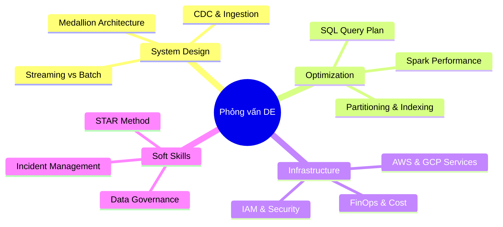

Vòng phỏng vấn Data Engineer luôn là một thử thách đa chiều và cam go đối với mọi ứng viên, từ cấp độ Junior cho đến Senior hay Staff. Sự phức tạp của nó nằm ở chỗ bạn không chỉ cần giỏi các thuật toán lập trình cơ bản hay cú pháp câu lệnh SQL thông thường, mà còn phải chứng minh sự am hiểu sâu sắc về kiến trúc hệ thống phân tán, cơ chế vận hành của cơ sở dữ liệu ở quy mô lớn, khả năng tối ưu hóa tài nguyên đám mây và kỹ năng ứng phó sự cố linh hoạt trên Production.

Để chuẩn bị tốt nhất cho chặng đường này, bạn cần có một lộ trình ôn tập khoa học và chiến lược tiếp cận thông minh, thay vì chỉ học vẹt các định nghĩa lý thuyết suông. Cẩm nang ôn tập này được xây dựng nhằm cung cấp cho bạn một cái nhìn toàn cảnh về các vòng phỏng vấn cốt lõi cùng các bộ câu hỏi tình huống thực chiến.

---

## Bản đồ chủ đề phỏng vấn Data Engineering

Sơ đồ dưới đây khái quát các trụ cột kiến trúc và kỹ thuật mà một kỹ sư dữ liệu cần nắm vững để vượt qua các vòng phỏng vấn kỹ thuật:

---

## Điểm mạnh và điểm yếu

Khi chuẩn bị cho kỳ thi tuyển dụng Data Engineer, các ứng viên thường lựa chọn giữa hai chiến lược ôn tập đối lập: tập trung vào LeetCode thuật toán hoặc tập trung vào System Design & Thực tế on-call. Dưới đây là phân tích chi tiết:

### Tập trung vào thuật toán lập trình (LeetCode)
* **Điểm mạnh (Pros)**: Giúp rèn luyện tư duy logic lập trình cực kỳ nhanh, vượt qua vòng sàng lọc hồ sơ ban đầu dễ dàng ở các công ty lớn.
* **Điểm yếu (Cons)**: Thiếu tính ứng dụng thực tế. Trong công việc hàng ngày, Data Engineer hiếm khi phải tự viết các thuật toán đảo cây nhị phân hay quy hoạch động. Nếu chỉ biết thuật toán mà không có tư duy thiết kế hệ thống, bạn sẽ dễ dàng bị đánh trượt ở các vòng sau.

### Tập trung vào System Design & Thực tế on-call
* **Điểm mạnh (Pros)**: Thể hiện sự chín chắn, kinh nghiệm thực chiến và khả năng giải quyết các vấn đề thực tiễn của doanh nghiệp như tối ưu hóa hóa đơn đám mây hay cứu hệ thống lúc sập nửa đêm.
* **Điểm yếu (Cons)**: Cần nhiều thời gian tích lũy kinh nghiệm thực tế. Khó có thể "học vẹt" nếu chưa từng thực sự đối mặt với các lỗi OOM hay lệch dữ liệu trên Production.

---

## Khi nào nên dùng

Chiến lược phân bổ trọng tâm ôn tập phụ thuộc rất lớn vào cấp độ ứng tuyển của bạn và loại hình doanh nghiệp mục tiêu:

* **Đối với các Startup công nghệ**: Hãy tập trung tối đa vào **Thiết kế Data Pipeline** và **Tối ưu hóa hiệu năng SQL**. Các công ty này thường ưu tiên các kỹ sư đa năng có khả năng "lắp ráp" nhanh hệ thống thô sơ hoạt động được ngay với chi phí rẻ.
* **Đối với các Tập đoàn lớn hoặc Big Tech**: **System Design hệ thống phân tán** (Spark, Kafka) và **Phỏng vấn Hành vi (Behavioral)** là mấu chốt để bạn được định mức lương và cấp bậc (level) mong muốn. Họ cần các kỹ sư có khả năng thiết kế hệ thống quy mô lớn, có tính chịu lỗi cao và có kỹ năng làm việc liên phòng ban tốt.

---

## Trọng tâm ôn luyện phỏng vấn

Dưới đây là 3 tình huống phỏng vấn thực tế giả định giúp bạn làm quen với cách tiếp cận giải quyết bài toán theo các khung tư duy chuyên nghiệp:

### Tình huống 1: Thiết kế hệ thống dữ liệu cho ngày hội mua sắm Black Friday
**Câu hỏi**: *"Hệ thống thương mại điện tử của chúng tôi sắp diễn ra sự kiện Black Friday với lưu lượng truy cập dự kiến tăng gấp 10 lần ngày thường, đe dọa làm sập cơ sở dữ liệu và mất mát thông tin đơn hàng. Bạn sẽ thiết kế luồng nạp và xử lý giao dịch dữ liệu như thế nào để đảm bảo hệ thống không bị quá tải và dữ liệu không bị thất lạc?"*

**Trả lời (Khung STAR & Thiết kế hệ thống)**:
* **Situation**: Hệ thống bán hàng có lượng tải ghi tăng đột biến (peak write throughput) trong sự kiện mua sắm, có nguy cơ làm nghẽn hoặc sập database OLTP nguồn nếu ta truy vấn trực tiếp để làm báo cáo thời gian thực.
* **Task**: Thiết kế một kiến trúc nạp dữ liệu phi trạng thái, có khả năng đệm dữ liệu (buffering), chống chịu lỗi cao và xử lý song song để chuyển tải trọng ghi từ database nguồn sang kho dữ liệu một cách an toàn.
* **Action**:
  1. *Lớp Đệm (Buffering)*: Tôi sẽ sử dụng Apache Kafka làm hệ thống truyền thông điệp ở giữa. Database Oracle/Postgres nguồn sẽ không bị quét trực tiếp, thay vào đó tôi cấu hình Debezium để bắt sự kiện thay đổi dữ liệu (CDC) từ Transaction Log và đẩy bất đồng bộ vào Kafka topic `orders`. Cấu hình topic này với `Replication Factor = 3` và `min.insync.replicas = 2` cùng `acks=all` để cam kết không mất mát tin nhắn.
  2. *Lớp Xử lý (Processing)*: Sử dụng Spark Streaming để tiêu thụ dữ liệu từ Kafka. Tôi cấu hình cơ chế Backpressure để Spark tự động điều chỉnh tốc độ đọc tin nhắn tương ứng với khả năng xử lý của cụm, tránh bị sập do tràn bộ nhớ (OOM).
  3. *Lớp Lưu trữ (Storage)*: Ghi dữ liệu trực tiếp xuống Object Storage (AWS S3 hoặc Google Cloud Storage) dạng Delta Lake để hỗ trợ các giao dịch ACID và ghi đè an toàn.
* **Result**: Hệ thống hấp thụ hoàn toàn lượng tải đột biến nhờ cơ chế đệm của Kafka và tự động co giãn (auto-scaling) của Spark. Báo cáo kinh doanh có độ trễ dưới 10 giây mà không tạo ra bất kỳ ảnh hưởng vật lý nào lên cơ sở dữ liệu giao dịch của khách hàng.

### Tình huống 2: Đánh giá bài toán di chuyển kho dữ liệu để giảm chi phí
**Câu hỏi**: *"Hóa đơn lưu trữ và truy vấn trên AWS Redshift của chúng tôi đột ngột tăng vọt lên 50,000 USD/tháng trong khi hiệu năng của các truy vấn báo cáo ngày càng chậm đi. Ban giám đốc đang cân nhắc chuyển dịch sang Snowflake hoặc Google BigQuery. Bạn sẽ thiết kế quy trình đánh giá và thực hiện việc di chuyển này như thế nào để giảm thiểu rủi ro gián đoạn?"*

**Trả lời (Quy trình Triage-Mitigate-Communicate-RCA)**:
* **Triage (Phân loại & Đánh giá)**: Xác định điểm nghẽn chính trên Redshift. Hầu hết các chi phí cao phát sinh từ việc các node tính toán phải chạy liên tục 24/7 (do Redshift truyền thống gộp chung Compute và Storage). Các truy vấn phân tích chậm do không tận dụng được cơ chế phân vùng hoặc do các câu lệnh JOIN quá cồng kềnh.
* **Mitigate (Giảm nhẹ tạm thời)**: Bật tính năng Concurrency Scaling trên Redshift để tự động phân phối tải truy vấn đỉnh điểm và chuyển các dữ liệu cũ không sử dụng xuống S3 Glacier thông qua Redshift Spectrum để giải phóng bộ nhớ đĩa đắt đỏ.
* **Communicate (Giao tiếp)**: Tổ chức buổi họp với đội BI và các phòng ban liên quan để thông báo kế hoạch đánh giá công nghệ (PoC) kéo dài 2 tuần trên Snowflake/BigQuery và cam kết giữ nguyên SLA hoạt động của các dashboard hiện tại.
* **RCA & Action (Giải pháp lâu dài)**:
  1. Tiến hành chạy thử nghiệm một số query nặng nhất trên Snowflake và BigQuery. Lựa chọn **Snowflake** nếu muốn tận dụng tính năng tự động tắt cụm tính toán khi rảnh rỗi (auto-suspend) giúp tối ưu hóa FinOps tối đa cho mô hình chạy batch không liên tục.
  2. Xây dựng kế hoạch di chuyển dữ liệu (Data Migration Path): Giai đoạn 1 sẽ sao chép toàn bộ dữ liệu lịch sử từ S3 sang Snowflake. Giai đoạn 2 cấu hình ghi song song (dual-write) cả Redshift và Snowflake để đối soát tính nhất quán của số liệu. Giai đoạn 3 chuyển đổi toàn bộ kết nối của BI tool sang Snowflake và tắt cụm Redshift.
* **Result**: Chi phí kho dữ liệu giảm từ 50,000 USD xuống còn 18,000 USD/tháng (giảm gần 64%) nhờ khả năng tách biệt tính toán và lưu trữ của Snowflake, đồng thời tốc độ tải dashboard tăng 3 lần.

### Tình huống 3: Khắc phục xung đột số liệu doanh thu giữa các phòng ban
**Câu hỏi**: *"Đội ngũ Marketing và Tài chính liên tục báo cáo số liệu doanh thu tháng trước bị lệch nhau khoảng 5% trên các dashboard tương ứng, gây tranh cãi lớn trong cuộc họp ban giám đốc. Bạn sẽ xử lý sự cố này thế nào?"*

**Trả lời (Quy trình ứng phó & Hậu kiểm)**:
* **Triage**: Xác nhận tính đúng đắn của phản ánh. Thu thập hai câu lệnh SQL mà hai đội đang dùng để tính toán doanh thu trên Tableau. Phát hiện đội Marketing đang đếm số tiền từ bảng `orders` (bao gồm cả các đơn hàng chưa thanh toán), còn đội Tài chính tính từ bảng `invoices` (chỉ gồm các hóa đơn đã thanh toán thành công).
* **Mitigate**: Đăng thông báo khẩn cấp lên Slack chung của các đội phân tích và gắn nhãn cảnh báo "Đang hiệu chỉnh dữ liệu" trên các dashboard liên quan để người dùng tránh sử dụng số liệu sai lệch đưa ra quyết định kinh doanh.
* **Action (RCA & Khắc phục)**:
  1. *Thiết lập Nguồn sự thật duy nhất (Single Source of Truth)*: Định nghĩa lại logic doanh thu chuẩn cùng với Product Manager và đại diện các bên. Doanh thu chính thức phải dựa trên giao dịch đã thanh toán thành công.
  2. *Refactor Pipeline*: Tạo một bảng Gold Data Mart chung mang tên `mart_financial_revenue` được quản lý bởi công cụ dbt. Bảng này sẽ thực hiện lọc và đối soát chặt chẽ giữa bảng `orders` và `invoices`.
  3. *Data Quality Check*: Thêm bài kiểm tra tự động (`dbt test` hoặc Great Expectations) để đảm bảo không có giá trị doanh thu nào bị âm hoặc null, và chạy đối soát hàng ngày.
* **Result**: Số liệu doanh thu trên tất cả các dashboard BI đồng nhất hoàn toàn 100%. Quy trình phát triển sau này bắt buộc phải đi qua thư mục dbt dùng chung để tránh việc mỗi đội tự viết logic SQL riêng.

---

## English Summary

The Data Engineering Interview Prep Guide provides a structured roadmap to master the core pillars of technical interviews: Distributed System Design (Spark, Kafka), Performance Tuning (SQL query plans, indexing, partitioning), Cloud Infrastructure (FinOps, security/IAM), and Behavioral/Communication challenges. To stand out, candidates must move away from generic definitions and demonstrate operational maturity by analyzing engineering trade-offs (e.g., LeetCode vs. System Design) and structuring technical answers using the STAR or Triage-Mitigate-Communicate-RCA incident response frameworks.

---

## Xem thêm các khái niệm liên quan

Để trang bị đầy đủ kiến thức cho các vòng phỏng vấn chuyên sâu, hãy nghiên cứu kỹ các cẩm nang chi tiết sau:

* [Xử lý sự cố Production](../interview/production-incident-qa/) - Quy trình ứng phó và viết Post-mortem không đổ lỗi.
* [Tối ưu hóa Spark](../interview/spark-optimization-interview/) - Chẩn đoán lỗi OOM, Data Skew và kỹ thuật Salting.
* [Phỏng vấn Python DE](../interview/python-de-interview/) - Xử lý tệp tin khổng lồ và tối ưu bộ nhớ với Generator.
* [Tối ưu hóa hiệu năng](../interview/performance-tuning-qa/) - Phân tích Query Plan và tối ưu cấu trúc lưu trữ vật lý.
* [Các dạng bài SQL](../interview/sql-interview-patterns/) - Làm chủ các hàm cửa sổ, đệ quy CTE và Gaps & Islands.
* [Mô hình hóa dữ liệu](../interview/data-modeling-interview/) - Thiết kế Star Schema, khóa nhân tạo và SCD Type 2.
* [Nền tảng Cloud](../interview/cloud-platform-interview/) - Thiết kế hạ tầng phân tán và tư duy tối ưu chi phí FinOps.
* [Phỏng vấn hành vi](../interview/de-behavioral-interview/) - Cách trả lời phỏng vấn hành vi và giao tiếp với Stakeholders.
* [Thiết kế Data Pipeline](../interview/pipeline-design-interview/) - Đảm bảo tính lũy đẳng (Idempotency) và kiến trúc Medallion.
* [Thiết kế Kafka](../interview/kafka-design-interview/) - Xử lý tin nhắn Exactly-Once và cấu hình Consumer Group.

---

## Tài liệu tham khảo

1. [AWS Architecture Center - Best Practices](https://aws.amazon.com/architecture/)
2. [Google Cloud Architecture Center - Data Engineering Roadmap](https://cloud.google.com/architecture)
3. [Azure Architecture Center - Data Platform Designs](https://learn.microsoft.com/en-us/azure/architecture/)
4. [Databricks Lakehouse Architecture Guide](https://docs.databricks.com/lakehouse/index.html)
5. [Apache Software Foundation - Distributed Compute Tuning](https://www.apache.org/projects/)
