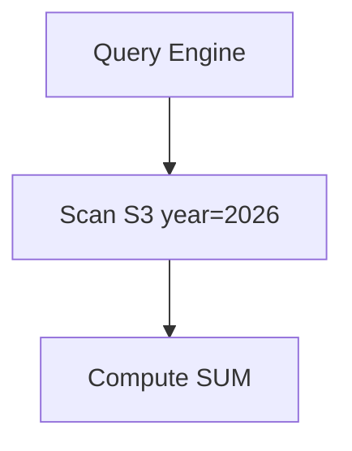

Có một sự thật hiển nhiên trong ngành dữ liệu: viết một câu truy vấn SQL chạy ra kết quả đúng trên máy tính cá nhân với vài ngàn dòng dữ liệu thử nghiệm thì ai cũng làm được. Nhưng khi mang câu lệnh đó chạy trên môi trường Production với hàng chục tỷ dòng dữ liệu (Terabytes hay Petabytes), nó có thể khiến hệ thống bị treo hàng giờ, làm nghẽn toàn bộ đường ống dẫn dữ liệu và "đốt" hàng ngàn USD của doanh nghiệp.

Vòng phỏng vấn **Tối ưu hóa hiệu năng (Performance Tuning)** chính là ranh giới phân định rõ ràng nhất giữa một kỹ sư dữ liệu Junior và một Senior thực thụ. Nhà tuyển dụng muốn kiểm tra khả năng chẩn đoán lỗi, tư duy tối ưu phần cứng và kỹ năng viết code SQL hiệu quả của bạn dưới áp lực dữ liệu quy mô lớn.

---

## Bản chất của Performance Tuning trong phỏng vấn

Về mặt kỹ thuật, tối ưu hóa hiệu năng là quá trình giảm thiểu tối đa tài nguyên I/O (đọc ghi ổ đĩa, truyền tải qua mạng) và CPU mà một công cụ tính toán (Database Engine hoặc các framework tính toán phân tán) phải tiêu tốn để trả về một tập kết quả. 

Khi phỏng vấn, bạn cần chứng minh mình biết cách đọc và hiểu bản kế hoạch thực thi câu lệnh (**Query Execution Plan**), từ đó tái cấu trúc lại câu lệnh SQL hoặc đề xuất các giải pháp tổ chức lưu trữ vật lý như đánh chỉ mục (Indexing), phân vùng (Partitioning) hay lưu trữ đệm (Caching).

---

## Bốn nguyên tắc vàng để tối ưu hóa mọi hệ thống lưu trữ

* **Cắt tỉa dữ liệu từ sớm (Pushdown / Pruning)**: Quy tắc vàng của ngành dữ liệu là *"Hãy đọc từ đĩa cứng càng ít dữ liệu càng tốt"*. Hãy luôn cố gắng đẩy các bộ lọc điều kiện (`WHERE`, chỉ định rõ các cột cần lấy trong `SELECT`) xuống sâu nhất có thể, trước khi thực hiện các phép toán nặng nề như gom nhóm (`GROUP BY`) hay kết hợp bảng (`JOIN`).
* **Tổ chức dữ liệu vật lý thông minh (Data Organization)**: Phân chia dữ liệu trên ổ đĩa thông qua cơ chế Phân vùng ([Partitioning](/concepts/2-storage/database-storage/partitioning/) - chia thành các thư mục nhỏ) và gom cụm ([Clustering](/concepts/2-storage/database-storage/clustering/) / Z-Ordering - xếp các dòng có giá trị tương tự nằm gần nhau). Việc này giúp công cụ truy vấn có thể bỏ qua (skip) hàng loạt tệp tin không liên quan khi tìm kiếm.
* **Đánh chỉ mục hợp lý ([Indexing](/concepts/2-storage/database-storage/indexing/))**: Sử dụng các cấu trúc dữ liệu bổ trợ như B-Tree Index (phù hợp cho các hệ thống giao dịch [OLTP](/concepts/2-storage/database-storage/oltp/)) hoặc Bitmap Index (phù hợp cho các hệ thống phân tích [OLAP](/concepts/2-storage/database-storage/olap/)) để thay thế phép quét toàn bộ bảng (Full Table Scan) bằng các phép tìm kiếm nhị phân có độ phức tạp thấp $O(\log n)$.
* **Tính toán trước (Pre-computation)**: Thay vì bắt hệ thống phải quét qua dữ liệu của 5 năm để tính tổng doanh thu mỗi khi người dùng mở Dashboard, hãy tính toán sẵn số liệu này vào ban đêm và lưu kết quả ra một bảng trung gian (Materialized Views).

---

## Quy trình từng bước khi giải quyết một câu SQL chậm

1. **Chẩn đoán bằng bản kế hoạch thực thi (EXPLAIN)**: Yêu cầu xem Query Plan để tìm ra điểm nghẽn (bottleneck). Hãy kiểm tra xem hệ thống có đang phải quét toàn bộ bảng (Full Table Scan) hay không, có phép Join Cartesian nào đang diễn ra hay không, hay hệ thống có bị tràn dữ liệu ra đĩa cứng do thiếu RAM (Disk Spill) hay không.
2. **Tối ưu hóa logic mã nguồn (Review Code)**: Loại bỏ các cột thừa trong lệnh `SELECT *`, chuyển các hàm điều kiện lọc lên trước, hoặc thay thế các truy vấn con lồng nhau (Subqueries) bằng phép `JOIN` nếu thấy tối ưu hơn.
3. **Tối ưu hóa cấu trúc lưu trữ vật lý (Review Data Structures)**: Đề xuất các giải pháp như thêm Index phù hợp, thiết lập khóa Partition (ví dụ theo ngày tháng), hoặc chuyển đổi định dạng tệp tin lưu trữ sang dạng hướng cột (chuyển từ CSV sang Parquet/ORC).
4. **Áp dụng chiến lược Caching**: Nếu dữ liệu được truy vấn rất nhiều lần nhưng tần suất thay đổi lại cực kỳ thấp, hãy đề xuất sử dụng Redis hoặc cơ chế lưu đệm truy vấn (Query Cache).

---

## Trực quan hóa cơ chế Cắt tỉa Phân vùng (Partition Pruning)

Sơ đồ dưới đây minh họa cách một Query Engine thông minh chỉ quét qua đúng phân vùng dữ liệu của năm 2026 trên Amazon S3 và bỏ qua toàn bộ các thư mục của các năm khác, giúp tiết kiệm tối đa tài nguyên:



---

## Tình huống thực tế: Tối ưu câu SQL "đếm người dùng duy nhất" cồng kềnh

**Đề bài từ người phỏng vấn**: *"Câu truy vấn dưới đây đang mất tới 5 phút để hoàn thành trên kho dữ liệu của chúng tôi. Bạn hãy chỉ ra các điểm chưa tối ưu và cách khắc phục."*
```sql
SELECT product_id, COUNT(DISTINCT user_id)
FROM events
WHERE EXTRACT(YEAR FROM event_date) = 2026
GROUP BY product_id;
```

**Phân tích & Hướng tối ưu**:
* **Lỗi 1: Sử dụng hàm bao bọc cột lọc (Filter by Function)**:
  Việc viết `EXTRACT(YEAR FROM event_date) = 2026` bắt buộc Database Engine phải đọc từng dòng dữ liệu trong bảng và gọi hàm trích xuất năm để so sánh (Full Table Scan), phá vỡ hoàn toàn khả năng tận dụng Index hoặc Cắt tỉa phân vùng (Partition Pruning).
  * **Cách sửa**: Viết lại điều kiện lọc dưới dạng khoảng thời gian thuần túy để cột dữ liệu đứng độc lập: 
    `WHERE event_date >= '2026-01-01' AND event_date < '2027-01-01'`.
* **Lỗi 2: Sử dụng phép đếm duy nhất (`COUNT DISTINCT`) trên tập dữ liệu lớn**:
  Phép toán này cực kỳ tốn kém trong các hệ thống phân tán vì nó đòi hỏi hệ thống phải xáo trộn dữ liệu qua mạng (shuffle) và lưu toàn bộ danh sách `user_id` vào bộ nhớ RAM của một node để loại bỏ trùng lặp.
  * **Cách sửa**: Nếu nghiệp vụ chỉ yêu cầu hiển thị các chỉ số xu hướng trên Dashboard phân tích mà không cần con số chính xác tuyệt đối 100%, hãy đề xuất sử dụng hàm đếm xấp xỉ: 
    `APPROX_COUNT_DISTINCT(user_id)`. Hàm này sử dụng thuật toán HyperLogLog, chỉ chấp nhận mức sai số nhỏ khoảng 1-2% nhưng giúp tốc độ xử lý tăng vọt gấp 10 đến 50 lần mà lại tốn cực kỳ ít bộ nhớ.

---

## Điểm mạnh và điểm yếu

Hầu hết các kỹ thuật tối ưu hóa hiệu năng hệ thống (như Indexing, Materialized Views, Caching) đều đi theo một nguyên lý đánh đổi kinh điển trong khoa học máy tính: **Sử dụng dung lượng lưu trữ (Storage) để tiết kiệm thời gian xử lý của CPU (Compute)**. 

### Tạo Index hoặc Materialized Views phụ trợ
* **Điểm mạnh (Pros)**: Tăng tốc độ truy vấn đọc dữ liệu (Query Read Performance) lên gấp hàng trăm lần, giảm tải tính toán lặp đi lặp lại cho CPU.
* **Điểm yếu (Cons)**: Tốn thêm không gian lưu trữ vật lý trên đĩa cứng, và làm chậm đáng kể hiệu năng ghi dữ liệu (Write/Update Performance) do hệ thống phải cập nhật lại cấu trúc chỉ mục hoặc đồng bộ lại Materialized View mỗi khi có dữ liệu mới nạp vào.

### Caching kết quả truy vấn (ví dụ dùng Redis)
* **Điểm mạnh (Pros)**: Trả về kết quả tức thì (độ trễ tính bằng mili-giây) mà không cần truy cập vào ổ đĩa dữ liệu của DB.
* **Điểm yếu (Cons)**: Nguy cơ dữ liệu bị cũ/lỗi thời (Stale data) nếu cơ chế xóa cache (cache invalidation) cấu hình sai, làm tăng độ phức tạp trong việc duy trì tính nhất quán của dữ liệu.

---

## Khi nào nên dùng

* **Nên đánh B-Tree Index**: Phù hợp cho các bảng giao dịch OLTP có kích thước vừa và nhỏ, nơi các truy vấn thường tìm kiếm một vài dòng cụ thể theo ID hoặc khóa chính.
* **Nên dùng Partitioning**: Bắt buộc đối với các bảng phân tích OLAP khổng lồ (kích thước > 100GB hoặc hàng tỷ dòng), nơi dữ liệu thường được lọc theo các chiều phân đoạn rõ ràng như thời gian (`event_date`) hoặc khu vực địa lý.
* **Nên dùng APPROX_COUNT_DISTINCT**: Dành riêng cho các dashboard phân tích xu hướng quy mô lớn (ví dụ: đếm số lượng người dùng truy cập trang web hàng tháng từ hàng tỷ log clickstream), nơi sự chênh lệch nhỏ (1%) không ảnh hưởng đến quyết định kinh doanh.

---

## Trọng tâm ôn luyện phỏng vấn

Dưới đây là 3 tình huống phỏng vấn thực tế giả định kiểm tra khả năng chẩn đoán và khắc phục sự cố tối ưu hóa truy vấn SQL:

### Tình huống 1: Giải cứu truy vấn PostgreSQL bị Timeout 30 giây
**Câu hỏi**: *"Một truy vấn báo cáo trên PostgreSQL thực hiện kết hợp giữa bảng sales (200 triệu dòng) và bảng users (10 triệu dòng) liên tục bị quá hạn thời gian chạy (Timeout 30 giây). Khi chạy EXPLAIN ANALYZE, bạn phát hiện dòng chữ 'Seq Scan' trên bảng sales và cơ chế join là 'Nested Loop'. Bạn sẽ làm gì để khắc phục?"*

**Trả lời (Khung STAR)**:
* **Situation**: Truy vấn kết hợp bảng trên Postgres bị timeout do sử dụng quét tuần tự toàn bảng (Seq Scan) và cơ chế join kém hiệu quả (Nested Loop).
* **Task**: Thay đổi cơ chế quét dữ liệu và thuật toán join của Query Engine sang hướng tối ưu hơn.
* **Action**:
  1. *Phân tích*: nested loop join cực kỳ tệ cho hai bảng lớn vì độ phức tạp là $O(N \times M)$. Việc quét tuần tự 200 triệu dòng mà không có index lọc điều kiện làm nghẽn I/O.
  2. *Giải pháp*: Tôi sẽ tạo chỉ mục (Index) trên khóa ngoại `users.id` và `sales.user_id` nếu chưa có.
  3. Tôi rà soát lại xem câu lệnh có điều kiện lọc nào ở bảng users không (ví dụ: lọc theo `users.created_date`). Nếu có, tôi tạo một Composite Index `(user_id, created_date)` để kích hoạt Index Scan.
  4. Tôi cập nhật thống kê siêu dữ liệu của PostgreSQL thông qua lệnh `ANALYZE sales; ANALYZE users;` để giúp Database Optimizer nhận biết đúng kích thước thực tế của hai bảng và tự động chuyển cơ chế join từ Nested Loop sang **Hash Join** (hiệu quả hơn nhiều cho hai bảng lớn).
* **Result**: Truy vấn chuyển sang cơ chế Hash Join và sử dụng Index Scan, thời gian chạy hoàn thành trong vòng chưa đầy 1.5 giây.

### Tình huống 2: Khắc phục lỗi tràn đĩa (Disk Spill) khi đếm trùng lặp trên Snowflake
**Câu hỏi**: *"Một câu lệnh SQL đếm số lượng người dùng duy nhất hàng ngày `COUNT(DISTINCT user_id)` chạy trên bảng clickstream 5TB liên tục bị sập và Snowflake Query Profile hiển thị lỗi tràn bộ nhớ ra đĩa cứng (Spilled to Local/Remote Storage). Bạn sẽ xử lý thế nào?"*

**Trả lời (Khung STAR)**:
* **Situation**: Phép toán đếm duy nhất trên tập dữ liệu 5TB gây tràn đĩa cứng (Disk Spill) do thiếu bộ nhớ RAM trên các node tính toán của Snowflake.
* **Task**: Giảm lượng dữ liệu xáo trộn (shuffle) và tối ưu hóa bộ nhớ cần duy trì để tính toán độ duy nhất.
* **Action**:
  1. *Phân tích*: `COUNT(DISTINCT)` bắt buộc hệ thống phải giữ toàn bộ danh sách các `user_id` duy nhất trong bộ nhớ để so sánh loại trùng. Với 5TB dữ liệu, số lượng ID duy nhất vượt quá dung lượng RAM của cụm Virtual Warehouse hiện tại, buộc Snowflake phải ghi dữ liệu tạm thời ra đĩa cứng (Spill), làm giảm hiệu năng nghiêm trọng.
  2. *Giải pháp*: Tôi sẽ trao đổi với bên kinh doanh. Nếu họ chỉ cần theo dõi xu hướng biến động của chỉ số hoạt động hàng ngày (DAU) trên Dashboard, tôi sẽ thay thế `COUNT(DISTINCT user_id)` bằng `APPROX_COUNT_DISTINCT(user_id)`. Hàm này sử dụng thuật toán HyperLogLog, giảm bộ nhớ RAM yêu cầu xuống mức tối thiểu (chỉ vài Kilobytes) và loại bỏ hoàn toàn Disk Spill.
  3. Nếu bắt buộc phải lấy số liệu chính xác tuyệt đối phục vụ đối soát tài chính, tôi sẽ nâng kích thước cụm Virtual Warehouse (ví dụ từ M lên L) để có thêm bộ nhớ RAM, đồng thời thực hiện gom cụm (Cluster Key) bảng clickstream theo ngày (`event_date`).
* **Result**: Lỗi Disk Spill biến mất hoàn toàn. Tốc độ chạy truy vấn tăng gấp 15 lần đối với hàm xấp xỉ HyperLogLog.

### Tình huống 3: Tối ưu hóa truy vấn tìm kiếm chuỗi Wildcard LIKE gây CPU 100%
**Câu hỏi**: *"Hệ thống tìm kiếm sản phẩm của chúng tôi ad-hoc chạy câu lệnh `SELECT * FROM products WHERE product_name LIKE '%keyword%'` trên bảng 50 triệu dòng, khiến CPU của cơ sở dữ liệu luôn bị đẩy lên 100%. Bạn có những giải pháp nào để giải quyết triệt để vấn đề này?"*

**Trả lời (Khung STAR)**:
* **Situation**: Tìm kiếm chuỗi wildcard có ký tự `%` ở đầu dòng phá vỡ khả năng dùng chỉ mục B-Tree truyền thống, ép database quét toàn bộ bảng và gây quá tải CPU 100%.
* **Task**: Thiết lập cơ cấu chỉ mục phù hợp hoặc chuyển đổi kiến trúc tìm kiếm để giảm tải cho database chính.
* **Action**:
  1. *Giải pháp ngắn hạn (PostgreSQL)*: Tôi sẽ tạo chỉ mục **Trigram Index** bằng cách cài đặt extension `pg_trgm`:
     `CREATE EXTENSION pg_trgm; CREATE INDEX idx_products_name_trgm ON products USING gin (product_name gin_trgm_ops);`
     Chỉ mục GIN kết hợp Trigram cho phép tìm kiếm các chuỗi con hiệu quả mà không cần quét tuần tự toàn bảng.
  2. *Giải pháp dài hạn (Kiến trúc hệ thống)*: Đối với các tác vụ tìm kiếm văn bản phức tạp (Full-text Search), việc dùng RDBMS là không phù hợp. Tôi đề xuất thiết lập một đường ống đồng bộ dữ liệu (CDC) từ bảng products sang **Elasticsearch** (hoặc OpenSearch). Ứng dụng client sẽ thực hiện truy vấn tìm kiếm trực tiếp trên Elasticsearch thông qua cấu hình Inverted Index chuyên dụng.
* **Result**: Cơ sở dữ liệu chính được giải phóng hoàn toàn khỏi tải truy vấn tìm kiếm, CPU hạ xuống dưới 20%, thời gian phản hồi tìm kiếm của khách hàng giảm xuống dưới 100ms.

---

## English Summary

The Performance Tuning QA interview round challenges candidates to analyze and resolve slow-running SQL queries and structural bottlenecks in large-scale data systems. Success requires a profound understanding of how databases execute queries (using the `EXPLAIN` plan) and the application of physical data organization techniques. Candidates are expected to advocate for pushing down filters (Predicate/Partition Pruning), leveraging Columnar Storage (Parquet/ORC) over Row Storage, and substituting expensive operations (like `COUNT DISTINCT`) with approximate algorithms (HyperLogLog) when exact precision isn't necessary. Mastering the trade-offs between compute time and storage space—via Indexing, Caching, and Materialized Views—is the ultimate indicator of a senior-level data professional.

---

## Xem thêm các khái niệm liên quan

* [Indexing (Đánh chỉ mục)](../concepts/2-storage/database-storage/indexing/) - Các cấu trúc chỉ mục phổ biến trong DB.
* [Partitioning & Clustering](../concepts/2-storage/database-storage/partitioning/) - Phân chia vật lý dữ liệu trên ổ đĩa.
* [OLAP vs OLTP Systems](../concepts/2-storage/database-storage/olap/) - Thiết kế cơ sở dữ liệu giao dịch và phân tích.

---

## Tài liệu tham khảo

1. [PostgreSQL Official Query Performance Tuning Guidelines](https://www.postgresql.org/docs/current/performance-tips.html)
2. [Snowflake Documentation - Tuning Query Performance](https://docs.snowflake.com/en/user-guide/performance-query)
3. [AWS Redshift Database Developer Guide - Tuning Query Performance](https://docs.aws.amazon.com/redshift/latest/dg/c_challenges_tuning_query_performance.html)
4. [Google Cloud BigQuery Best Practices - Optimizing Query Performance](https://cloud.google.com/bigquery/docs/best-practices-performance-overview)
5. [Databricks Lakehouse Architecture and Optimization Reference](https://docs.databricks.com/lakehouse/index.html)
