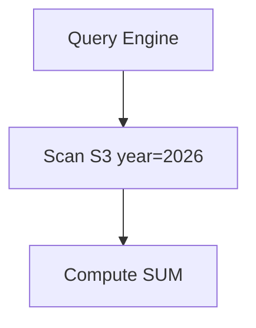

Có một sự thật hiển nhiên trong ngành dữ liệu: viết một câu truy vấn SQL chạy ra kết quả đúng trên máy tính cá nhân với vài ngàn dòng dữ liệu thử nghiệm thì ai cũng làm được. Nhưng khi mang câu lệnh đó chạy trên môi trường Production với hàng chục tỷ dòng dữ liệu (Terabytes hay Petabytes), nó có thể khiến hệ thống bị treo hàng giờ, làm nghẽn toàn bộ đường ống dẫn dữ liệu và "đốt" hàng ngàn USD của doanh nghiệp.

Vòng phỏng vấn **Tối ưu hóa hiệu năng (Performance Tuning)** chính là ranh giới phân định rõ ràng nhất giữa một kỹ sư dữ liệu Junior và một Senior thực thụ. Nhà tuyển dụng muốn kiểm tra khả năng chẩn đoán lỗi, tư duy tối ưu phần cứng và kỹ năng viết code SQL hiệu quả của bạn dưới áp lực dữ liệu quy mô lớn.

---

## Bản chất của Performance Tuning trong phỏng vấn

Về mặt kỹ thuật, tối ưu hóa hiệu năng là quá trình giảm thiểu tối đa tài nguyên I/O (đọc ghi ổ đĩa, truyền tải qua mạng) và CPU mà một công cụ tính toán (Database Engine hoặc các framework tính toán phân tán) phải tiêu tốn để trả về một tập kết quả. 

Khi phỏng vấn, bạn cần chứng minh mình biết cách đọc và hiểu bản kế hoạch thực thi câu lệnh (**Query Execution Plan**), từ đó tái cấu trúc lại câu lệnh SQL hoặc đề xuất các giải pháp tổ chức lưu trữ vật lý như đánh chỉ mục (Indexing), phân vùng (Partitioning) hay lưu trữ đệm (Caching).

---

## Bốn nguyên tắc vàng để tối ưu hóa mọi hệ thống lưu trữ

Bất kể bạn đang làm việc trên cơ sở dữ liệu truyền thống (PostgreSQL, MySQL) hay các kho dữ liệu đám mây hiện đại (BigQuery, [Snowflake](/concepts/cloud-data-platform/snowflake/)), việc tối ưu hiệu năng luôn xoay quanh 4 nguyên tắc cốt lõi sau:

* **Cắt tỉa dữ liệu từ sớm (Pushdown / Pruning)**: Quy tắc vàng của ngành dữ liệu là *"Hãy đọc từ đĩa cứng càng ít dữ liệu càng tốt"*. Hãy luôn cố gắng đẩy các bộ lọc điều kiện (`WHERE`, chỉ định rõ các cột cần lấy trong `SELECT`) xuống sâu nhất có thể, trước khi thực hiện các phép toán nặng nề như gom nhóm (`GROUP BY`) hay kết hợp bảng (`JOIN`).
* **Tổ chức dữ liệu vật lý thông minh (Data Organization)**: Phân chia dữ liệu trên ổ đĩa thông qua cơ chế Phân vùng ([Partitioning](/concepts/database-storage/partitioning/) - chia thành các thư mục nhỏ) và gom cụm ([Clustering](/concepts/database-storage/clustering/) / Z-Ordering - xếp các dòng có giá trị tương tự nằm gần nhau). Việc này giúp công cụ truy vấn có thể bỏ qua (skip) hàng loạt tệp tin không liên quan khi tìm kiếm.
* **Đánh chỉ mục hợp lý ([Indexing](/concepts/database-storage/indexing/))**: Sử dụng các cấu trúc dữ liệu bổ trợ như B-Tree Index (phù hợp cho các hệ thống giao dịch [OLTP](/concepts/database-storage/oltp/)) hoặc Bitmap Index (phù hợp cho các hệ thống phân tích [OLAP](/concepts/database-storage/olap/)) để thay thế phép quét toàn bộ bảng (Full Table Scan) bằng các phép tìm kiếm nhị phân có độ phức tạp thấp $O(\log n)$.
* **Tính toán trước (Pre-computation)**: Thay vì bắt hệ thống phải quét qua dữ liệu của 5 năm để tính tổng doanh thu mỗi khi người dùng mở Dashboard, hãy tính toán sẵn số liệu này vào ban đêm và lưu kết quả ra một bảng trung gian (Materialized Views).

---

## Quy trình từng bước khi giải quyết một câu SQL chậm

Khi người phỏng vấn đưa ra một câu SQL đang chạy rất chậm và yêu cầu bạn tối ưu, đừng vội vàng chỉnh sửa code ngay lập tức. Hãy tiếp cận bài bản theo quy trình sau:

1. **Chẩn đoán bằng bản kế hoạch thực thi (EXPLAIN)**: Yêu cầu xem Query Plan để tìm ra điểm nghẽn (bottleneck). Hãy kiểm tra xem hệ thống có đang phải quét toàn bộ bảng (Full Table Scan) hay không, có phép Join Cartesian nào đang diễn ra hay không, hay hệ thống có bị tràn dữ liệu ra đĩa cứng do thiếu RAM (Disk Spill) hay không.
2. **Tối ưu hóa logic mã nguồn (Review Code)**: Loại bỏ các cột thừa trong lệnh `SELECT *`, chuyển các hàm điều kiện lọc lên trước, hoặc thay thế các truy vấn con lồng nhau (Subqueries) bằng phép `JOIN` nếu thấy tối ưu hơn.
3. **Tối ưu hóa cấu trúc lưu trữ vật lý (Review Data Structures)**: Đề xuất các giải pháp như thêm Index phù hợp, thiết lập khóa Partition (ví dụ theo ngày tháng), hoặc chuyển đổi định dạng tệp tin lưu trữ sang dạng hướng cột (chuyển từ CSV sang Parquet/ORC).
4. **Áp dụng chiến lược Caching**: Nếu dữ liệu được truy vấn rất nhiều lần nhưng tần suất thay đổi lại cực kỳ thấp, hãy đề xuất sử dụng Redis hoặc cơ chế lưu đệm truy vấn (Query Cache).

---

## Trực quan hóa cơ chế Cắt tỉa Phân vùng (Partition Pruning)

Sơ đồ dưới đây minh họa cách một Query Engine thông minh chỉ quét qua đúng phân vùng dữ liệu của năm 2026 trên Amazon S3 và bỏ qua toàn bộ các thư mục của các năm khác, giúp tiết kiệm tối đa tài nguyên:


---

## Tình huống thực tế: Tối ưu câu SQL "đếm người dùng duy nhất" cồng kềnh

**Đề bài từ người phỏng vấn**: *"Câu truy vấn dưới đây đang mất tới 5 phút để hoàn thành trên kho dữ liệu của chúng tôi. Bạn hãy chỉ ra các điểm chưa tối ưu và cách khắc phục."*
```sql
SELECT product_id, COUNT(DISTINCT user_id)
FROM events
WHERE EXTRACT(YEAR FROM event_date) = 2026
GROUP BY product_id;
```

**Phân tích & Hướng tối ưu**:

* **Lỗi 1: Sử dụng hàm bao bọc cột lọc (Filter by Function)**:
  Việc viết `EXTRACT(YEAR FROM event_date) = 2026` bắt buộc Database Engine phải đọc từng dòng dữ liệu trong bảng và gọi hàm trích xuất năm để so sánh (Full Table Scan), phá vỡ hoàn toàn khả năng tận dụng Index hoặc Cắt tỉa phân vùng (Partition Pruning).
  * **Cách sửa**: Viết lại điều kiện lọc dưới dạng khoảng thời gian thuần túy để cột dữ liệu đứng độc lập: 
    `WHERE event_date >= '2026-01-01' AND event_date < '2027-01-01'`.
* **Lỗi 2: Sử dụng phép đếm duy nhất (`COUNT DISTINCT`) trên tập dữ liệu lớn**:
  Phép toán này cực kỳ tốn kém trong các hệ thống phân tán vì nó đòi hỏi hệ thống phải xáo trộn dữ liệu qua mạng (shuffle) và lưu toàn bộ danh sách `user_id` vào bộ nhớ RAM của một node để loại bỏ trùng lặp.
  * **Cách sửa**: Nếu nghiệp vụ chỉ yêu cầu hiển thị các chỉ số xu hướng trên Dashboard phân tích mà không cần con số chính xác tuyệt đối 100%, hãy đề xuất sử dụng hàm đếm xấp xỉ: 
    `APPROX_COUNT_DISTINCT(user_id)`. Hàm này sử dụng thuật toán HyperLogLog, chỉ chấp nhận mức sai số nhỏ khoảng 1-2% nhưng giúp tốc độ xử lý tăng vọt gấp 10 đến 50 lần mà lại tốn cực kỳ ít bộ nhớ.

---

## Những nguyên tắc thiết kế và Best Practices bạn cần biết

* **Tận dụng Materialized Views**: Đối với các kho dữ liệu đám mây hiện đại (BigQuery, Snowflake), hãy sử dụng Materialized Views để lưu trước kết quả của các phép tính tổng hợp phức tạp. Hệ thống sẽ tự động đồng bộ (refresh) các dữ liệu thay đổi dưới nền mà bạn không cần viết code đồng bộ thủ công.
* **Lựa chọn đúng thuật toán JOIN phù hợp với kích thước bảng**:
  * Khi JOIN một bảng lớn với một bảng cấu hình siêu nhỏ: Hãy dùng cơ chế `Broadcast Join` (hoặc Hash Join) để sao chép bảng nhỏ sang tất cả các worker nodes, tránh việc phải xáo trộn bảng lớn qua mạng.
  * Khi JOIN hai bảng khổng lồ với nhau: Hãy đảm bảo cả hai bảng đều được phân phối (Distributed/Bucketed) dựa trên cùng một khóa JOIN để dữ liệu liên quan nằm sẵn trên cùng một node.
* **Ưu tiên định dạng lưu trữ hướng cột ([Columnar Storage](/concepts/database-storage/columnar-storage/))**: Trong các hệ thống phân tích OLAP, việc lưu trữ dữ liệu dưới định dạng Parquet hoặc ORC là một Best Practice bắt buộc. Nếu câu truy vấn của bạn chỉ cần đọc 3 cột trong một bảng có 100 cột, hệ thống hướng cột sẽ chỉ phải đọc các file vật lý của đúng 3 cột đó, giúp tiết kiệm đến 97% tài nguyên đọc đĩa.

---

## Những sai lầm kinh điển dễ khiến hệ thống "quá tải"

* **Thói quen viết `SELECT *` vô tội vạ**: Trong các kho dữ liệu phân tích hướng cột, lệnh `SELECT *` là một hành động gây lãng phí ngân sách nghiêm trọng. Nó buộc hệ thống phải quét qua toàn bộ các cột dữ liệu, bao gồm cả những cột văn bản dài không cần thiết, làm nghẽn băng thông I/O.
* **Đánh chỉ mục (Index) quá nhiều bảng**: Index giúp đọc nhanh nhưng lại làm chậm tốc độ ghi dữ liệu (vì hệ thống phải cập nhật lại cấu trúc cây chỉ mục cho mỗi lần chèn mới). Trong các hệ thống kho dữ liệu lớn vốn ưu tiên ghi dữ liệu theo lô lớn (bulk insert), người ta thường hạn chế dùng Index B-Tree truyền thống mà thay bằng chiến lược Sort Keys hoặc Partitioning.
* **Lỗi phân mảnh dữ liệu (The Small Files Problem)**: Việc chia phân vùng quá chi tiết (ví dụ phân vùng tới tận mức phút: `year/month/day/hour/minute`) sẽ tạo ra hàng triệu file nhỏ dung lượng vài Kilobytes trên S3 hoặc HDFS. Các công cụ tính toán như Spark cực kỳ ghét các file nhỏ vì chi phí quản lý siêu dữ liệu (metadata overhead) khi mở/đóng file còn lớn hơn cả thời gian đọc dữ liệu thực tế. Hãy cố gắng duy trì kích thước file lý tưởng từ 128MB đến 512MB.

---

## Cân nhắc bài toán đánh đổi: Thời gian hay Dung lượng?

Hầu hết các kỹ thuật tối ưu hóa hiệu năng hệ thống (như Indexing, Materialized Views, Caching) đều đi theo một nguyên lý đánh đổi kinh điển trong khoa học máy tính: **Sử dụng dung lượng lưu trữ (Storage) để tiết kiệm thời gian xử lý của CPU (Compute)**. 

Trong thời đại ngày nay, giá thành của ổ đĩa lưu trữ đã trở nên rất rẻ, trong khi tài nguyên CPU và thời gian chờ đợi của con người là vô cùng đắt đỏ. Vì vậy, sự đánh đổi này là hoàn toàn hợp lý và mang lại giá trị kinh tế lớn cho doanh nghiệp.

---

## Bộ câu hỏi phỏng vấn thực tế và Cách trả lời ghi điểm

### 1. Hàm `EXPLAIN` trong SQL dùng để làm gì? Bạn thường tìm kiếm những thông tin quan trọng nào từ kết quả của nó?
* **Gợi ý trả lời**: 
  Lệnh `EXPLAIN` (hoặc `EXPLAIN ANALYZE` để chạy thực tế) giúp chúng ta xem được bản kế hoạch thực thi vật lý của câu lệnh do Database Optimizer tự động tính toán. Khi phân tích kết quả, tôi thường tập trung tìm kiếm các thông tin sau:
  * **Cơ chế quét bảng**: Hệ thống đang dùng `Seq Scan` (Quét tuần tự toàn bảng - cần tránh trên bảng lớn) hay `Index Scan` (Quét qua chỉ mục - tốt).
  * **Chi phí (Cost)** và số lượng dòng dự kiến trả về (**Rows**).
  * **Cơ chế JOIN**: Hệ thống đang sử dụng `Nested Loop` (tệ nếu cả hai bảng cùng lớn), `Hash Join` (hiệu quả cho bảng kích thước vừa phải), hay `Merge Join` (rất nhanh nếu dữ liệu của cả hai bảng đã được sắp xếp sẵn theo khóa).

### 2. Sự khác biệt giữa mệnh đề `WHERE` và `HAVING` là gì dưới góc nhìn tối ưu hóa hiệu năng?
* **Gợi ý trả lời**: 
  * Mệnh đề `WHERE` dùng để lọc dữ liệu *trước khi* quá trình gom nhóm (`GROUP BY`) diễn ra. 
  * Mệnh đề `HAVING` dùng để lọc kết quả *sau khi* quá trình gom nhóm và tính toán các hàm tổng hợp (SUM, AVG, COUNT) đã hoàn thành. 
  Về mặt tối ưu hóa, tôi luôn ưu tiên đưa các điều kiện lọc vào mệnh đề `WHERE` để giảm thiểu tối đa lượng dữ liệu đầu vào trước khi thực hiện bước gom nhóm (áp dụng cơ chế Filter Pushdown). Tôi sẽ tuyệt đối không dùng `HAVING` cho các cột thuộc tính có thể lọc được bằng `WHERE`.

### 3. Bạn sẽ tối ưu hóa như thế nào đối với một câu lệnh truy vấn tìm kiếm chuỗi sử dụng cú pháp `LIKE '%abc%'` đang chạy rất chậm?
* **Gợi ý trả lời**: 
  Phép tìm kiếm wildcard có ký tự `%` nằm ở đầu dòng sẽ khiến Database Engine không thể sử dụng cấu trúc chỉ mục B-Tree thông thường để tìm kiếm nhị phân, buộc hệ thống phải quét toàn bộ bảng. 
  Để tối ưu hóa, tôi có hai hướng giải quyết:
  * Nếu tiếp tục dùng cơ sở dữ liệu quan hệ (như PostgreSQL), tôi sẽ tạo chỉ mục **Trigram Index** (`pg_trgm`) để hỗ trợ tìm kiếm chuỗi con.
  * Nếu hệ thống đòi hỏi tính năng tìm kiếm văn bản chuyên sâu (Full-text Search) với tần suất cao, tôi sẽ đề xuất chuyển luồng dữ liệu đó sang một công cụ tìm kiếm chuyên dụng như Elasticsearch để tận dụng sức mạnh của cấu trúc chỉ mục đảo ngược (**Inverted Index**).

---

## Sách hay và tài liệu tham khảo gối đầu giường

1. **High Performance MySQL** - Baron Schwartz (Cuốn sách gối đầu giường về tối ưu hóa cơ sở dữ liệu).
2. **Designing Data-Intensive Applications** - Martin Kleppmann (Chương 3 giải thích rất chi tiết cơ chế hoạt động của B-Tree, LSM-Trees và Columnar Storage).
3. **Google Cloud BigQuery Documentation** - Cẩm nang hướng dẫn các Best Practices tối ưu hóa chi phí và hiệu năng truy vấn dữ liệu đám mây.

---

## English Summary

The Performance Tuning QA interview round challenges candidates to analyze and resolve slow-running SQL queries and structural bottlenecks in large-scale data systems. Success requires a profound understanding of how databases execute queries (using the `EXPLAIN` plan) and the application of physical data organization techniques. Candidates are expected to advocate for pushing down filters (Predicate/Partition Pruning), leveraging Columnar Storage (Parquet/ORC) over Row Storage, and substituting expensive operations (like `COUNT DISTINCT`) with approximate algorithms (HyperLogLog) when exact precision isn't necessary. Mastering the trade-offs between compute time and storage space—via Indexing, Caching, and Materialized Views—is the ultimate indicator of a senior-level data professional.