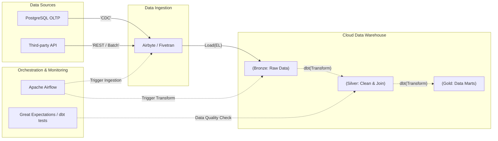

Vòng thiết kế [Data Pipeline](/concepts/1-distributed-systems-architecture/data-pipeline) — system design dành riêng cho dữ liệu — thường là vòng có trọng số cao nhất khi tuyển Data Engineer từ Mid trở lên. Lý do: nó là vòng duy nhất mô phỏng được công việc thật. Viết SQL hay tinh chỉnh Spark là kỹ năng; thiết kế một pipeline sống sót qua sự cố mới là nghề.

Và sự cố là chuyện chắc chắn xảy ra: đối tác đổi cấu trúc API không báo trước, Spark tràn bộ nhớ giữa chừng, mạng gián đoạn, dữ liệu rác trôi vào báo cáo doanh thu. Người phỏng vấn không hỏi "pipeline của bạn chạy thế nào khi mọi thứ ổn" — họ hỏi nó gãy ở đâu, và bạn đã thiết kế sẵn gì cho lúc đó.

---

## Thiết kế pipeline không phải là vẽ mũi tên nối các tool

Sơ đồ *Airbyte → S3 → Spark → [Snowflake](/concepts/3-storage-engines-formats/snowflake)* chưa phải là một thiết kế — nó mới là danh sách công cụ. Thiết kế thật sự nằm ở các quyết định phía sau mỗi mũi tên:

* **Trích xuất**: kéo (pull) theo lịch hay nhận đẩy (push) theo sự kiện?
* **Tần suất**: batch hay streaming — và nghiệp vụ có thật sự cần độ trễ tính bằng giây không?
* **Mô hình biến đổi**: [ETL](/concepts/2-data-ingestion-integration/etl) hay [ELT](/concepts/2-data-ingestion-integration/elt)?
* **Khả năng phục hồi**: dữ liệu đến muộn xử lý ra sao, lỗi báo cho ai, nạp lại lịch sử (backfill) có an toàn không?

Nhóm câu hỏi cuối là nơi phân định đẳng cấp ứng viên, vì nó chỉ trả lời được bằng kinh nghiệm vận hành.

---

## Bốn nguyên tắc thiết kế phải nói được thành lời

**Idempotency — nguyên tắc số một.** Pipeline chạy 1 lần hay 100 lần với cùng tham số đầu vào (ví dụ cùng chạy cho ngày hôm qua) phải cho cùng một kết quả trong warehouse, không nhân đôi dữ liệu. Đây không phải yêu cầu thẩm mỹ: pipeline *sẽ* lỗi và *sẽ* được chạy lại — retry của Airflow, backfill thủ công, sự cố giữa chừng. Pipeline append-only không lũy đẳng biến mỗi lần retry thành một lần nhân bản dữ liệu.

**Tách compute khỏi storage.** Tài nguyên tính toán (Spark, dbt) và lưu trữ (S3, BigQuery) co giãn độc lập: cluster tắt đi khi không chạy job mà dữ liệu vẫn còn nguyên. Đây là lý do kiến trúc data lake/warehouse hiện đại rẻ hơn hẳn các cụm Hadoop gắn chặt đĩa với máy tính toán thế hệ trước.

**Chốt chặn chất lượng dữ liệu.** Kiểm tra tự động ở đầu vào và giữa các tầng: schema đúng không, volume có bất thường không, các cột khóa có NULL không. Dữ liệu rác lọt qua sẽ lan xuống mọi báo cáo phía sau, và chi phí sửa tăng theo mỗi tầng nó đi qua.

**Backfill là tính năng, không phải tai nạn.** Logic nghiệp vụ đổi, bug được phát hiện sau ba tháng — nạp lại lịch sử là việc định kỳ. Pipeline tốt nhận tham số ngày và xử lý đúng ngày đó (trong Airflow là dùng `data_interval` của lần chạy thay vì `datetime.now()`), để chạy lại một khoảng quá khứ không đụng đến dữ liệu các ngày khác.

---

## Khung 5 bước dẫn dắt buổi phỏng vấn

1. **Chốt quy mô**: bao nhiêu GB/TB mỗi ngày, nguồn dạng gì (JSON, CSV, DB log), độ trễ chấp nhận được là bao nhiêu. Thiết kế cho 10GB/ngày và 10TB/ngày là hai bài toán khác nhau.
2. **Kiến trúc tổng thể**: chọn ETL hay ELT, chọn nơi lưu (object storage, cloud [Data Warehouse](/concepts/1-distributed-systems-architecture/data-warehouse)) — kèm lý do gắn với quy mô vừa chốt.
3. **[Data Ingestion](/concepts/2-data-ingestion-integration/data-ingestion)**: kéo định kỳ hay CDC; full load hay [Incremental Load](/concepts/2-data-ingestion-integration/incremental-load). Mặc định nên là incremental — full load hàng ngày chỉ hợp lý với bảng nhỏ.
4. **Biến đổi và lưu trữ**: luồng dữ liệu qua các tầng Medallion — Bronze (thô, giữ nguyên trạng để còn đường quay lại), Silver (làm sạch, khử trùng lặp), Gold (tổng hợp theo nghiệp vụ).
5. **[Orchestration](/concepts/7-dataops-orchestration-quality/orchestration) và observability**: công cụ điều phối ([Apache Airflow](/concepts/7-dataops-orchestration-quality/apache-airflow), Dagster), cơ chế retry cho lỗi tạm thời, cảnh báo, và [Data Lineage](/concepts/8-security-governance-finops/data-lineage) để truy nguồn khi số liệu sai.

---

## Kiến trúc Medallion trong mô hình ELT

Điểm đáng chỉ vào khi vẽ sơ đồ này: transform chạy *bên trong* warehouse (ELT), nên tầng Bronze giữ dữ liệu thô nguyên trạng. Khi logic biến đổi có bug, chỉ cần sửa SQL và chạy lại từ Bronze — không phải gọi lại API nguồn hay xin trích xuất lại từ hệ thống vận hành.

---

## Bài toán thực chiến: pipeline đối soát giao dịch ngân hàng

**Đề bài**: *"Thiết kế pipeline thu thập giao dịch hàng ngày phục vụ báo cáo đối soát tài chính (reconciliation). Nguồn là một hệ Oracle cũ của ngân hàng."*

Đề này có hai ràng buộc ngầm mà ứng viên tốt phải tự nhận ra: nguồn Oracle cũ *không chịu nổi* truy vấn quét lớn, và dữ liệu đối soát tài chính *không được phép sai*.

* **Ingestion**: không full load. Dùng CDC ([Change Data Capture](/concepts/2-data-ingestion-integration/change-data-capture)) — Debezium đọc transaction log của Oracle, đẩy các sự kiện INSERT/UPDATE/DELETE vào Kafka. Đọc log gần như không tạo tải lên database nguồn, khác hẳn với việc query trực tiếp.
* **Lưu trữ thô**: consumer ghi từ Kafka xuống S3 (Bronze) dạng Parquet, phân vùng theo ngày giao dịch.
* **Biến đổi**: [Apache Spark](/concepts/4-compute-engines-batch/apache-spark) hoặc [dbt](/concepts/6-data-modeling-transformation/dbt) đọc Bronze, khử bản ghi trùng — bước bắt buộc, vì Kafka mặc định giao hàng at-least-once nên trùng lặp là hành vi bình thường chứ không phải lỗi — rồi chuẩn hóa schema vào Silver.
* **Điều phối**: Airflow chạy 00:30 hàng ngày, tổng hợp Silver → Gold cho báo cáo.
* **[Data Quality](/concepts/7-dataops-orchestration-quality/data-quality)**: giữa Silver và Gold, so tổng số tiền tính được với checksum từ hệ thống nguồn. Lệch quá 0.01% → dừng pipeline, cảnh báo khẩn qua Slack. Với dữ liệu đối soát, dừng-và-báo tốt hơn xuất-báo-cáo-sai; với dữ liệu ít nhạy cảm hơn, cảnh báo nhưng vẫn chạy tiếp có thể hợp lý hơn — nêu được sự phân biệt này là điểm cộng.

---

## Ba kỹ thuật nâng tầm câu trả lời

**Phân vùng theo event time.** Phân vùng data lake bằng thời điểm sự kiện *xảy ra* (`event_time`), không phải thời điểm hệ thống *xử lý* (`processing_time`). Truy vấn phân tích hỏi "chuyện gì xảy ra ngày X" — phân vùng đúng câu hỏi thì chỉ quét đúng thư mục, tiết kiệm cả thời gian lẫn tiền.

**Write-Audit-Publish (WAP).** Ghi dữ liệu biến đổi vào bảng/nhánh tạm (Write), chạy các bài kiểm tra chất lượng trên đó (Audit), chỉ khi tất cả pass mới hoán đổi metadata để đưa vào bảng chính (Publish). Người dùng cuối không bao giờ nhìn thấy dữ liệu chưa qua kiểm — kể cả trong lúc pipeline đang chạy dở. Netflix là nơi phổ biến pattern này, và các table format như Apache Iceberg hỗ trợ nó trực tiếp qua branch.

**ELT với dbt cho phần biến đổi.** Đưa dữ liệu thô vào warehouse trước rồi biến đổi bằng SQL tận dụng sức tính toán của Snowflake/BigQuery, cho phép Analyst cùng tham gia viết logic, và mọi biến đổi được version control. Trade-off thật của ELT đáng nói kèm: chi phí compute của warehouse có thể phình nhanh nếu model dbt viết ẩu — ELT chuyển gánh nặng từ hạ tầng sang kỷ luật viết SQL.

---

## Ba lỗi thiết kế người phỏng vấn sẽ gài

**Bỏ quên late-arriving data.** Pipeline chốt số ngày hôm qua lúc 00:00, nhưng giao dịch phát sinh 23:59 có thể đến hệ thống lúc 00:05 hôm sau vì thiết bị người dùng mất sóng. Không có cơ chế merge/upsert cho dữ liệu đến muộn thì báo cáo thiếu số một cách hệ thống — và thiếu đúng vào những ngày mạng có vấn đề, tức những ngày khó truy nhất.

**UPDATE/DELETE trực tiếp trên [Data Lake](/concepts/3-storage-engines-formats/data-lake).** Object storage như S3 hay [Cloud Storage](/concepts/3-storage-engines-formats/cloud-storage) lưu file bất biến — sửa một dòng nghĩa là đọc và ghi lại cả file. Nếu nghiệp vụ cần update/delete thường xuyên (CDC là ví dụ điển hình), đó là tín hiệu cần table format của kiến trúc [Lakehouse](/concepts/3-storage-engines-formats/lakehouse) — [Apache Iceberg](/concepts/3-storage-engines-formats/apache-iceberg) hoặc [Delta Lake](/concepts/3-storage-engines-formats/delta-lake) — với transaction ACID và `MERGE INTO`.

**Chuỗi phụ thuộc quá sâu trong [DAG](/concepts/7-dataops-orchestration-quality/dag).** DAG hàng chục task nối đuôi A → B → ... → Z: một task giữa chuỗi lỗi là cả đoạn sau đứng chờ, và người vận hành phải lần ngược cả chuỗi để chạy lại. Thiết kế tốt chia thành các đoạn độc lập có điểm checkpoint, để lỗi ở đâu chạy lại từ gần đó.

---

## Batch hay Streaming: câu trả lời đúng là một câu hỏi ngược

Batch: thiết kế đơn giản, dễ debug, idempotency dễ đạt (xóa partition của ngày đó, chạy lại), chi phí thấp — đổi bằng độ trễ hàng giờ đến một ngày. Streaming: độ trễ giây — đổi bằng hạ tầng chạy liên tục, code phức tạp hơn hẳn (quản lý state, windowing, dữ liệu lệch giờ), và vận hành khó hơn.

Câu trả lời ăn điểm không phải chọn phe, mà là hỏi ngược: *"Ai dùng dữ liệu này, và quyết định gì thay đổi nếu độ trễ giảm từ 1 giờ xuống 1 giây?"* Dashboard ban giám đốc xem mỗi sáng không cần streaming. Hệ thống chống gian lận thì có. Streaming không tự làm dữ liệu đúng hơn — nó chỉ làm dữ liệu đến sớm hơn, với giá đắt hơn.

---

## Ba câu hỏi thực tế và cách trả lời

### 1. Thiết kế pipeline lũy đẳng (idempotent) như thế nào?

Chọn chiến lược ghi mà chạy lại không sinh trùng lặp: **delete-then-insert** theo phân vùng (job chạy cho ngày `2026-07-09` thì bước đầu là `DELETE FROM table WHERE date = '2026-07-09'` hoặc ghi đè nguyên partition, rồi mới insert), hoặc **`MERGE INTO`/upsert** theo khóa duy nhất trên lakehouse. Kèm điều kiện tiên quyết: job phải nhận ngày xử lý làm *tham số* thay vì tự lấy "hôm nay" — không tham số hóa thì không backfill được, và mọi lần chạy lại đều lệch ngữ nghĩa.

### 2. Event time khác processing time thế nào, vì sao quan trọng?

**Event time** là lúc sự kiện thực sự xảy ra phía người dùng (giao dịch lúc 10:00); **processing time** là lúc pipeline nhận và xử lý nó (11:00, vì thiết bị mất sóng đồng bộ muộn). Tổng hợp doanh thu theo processing time nghĩa là số liệu của một ngày phụ thuộc vào... sức khỏe hạ tầng của chính pipeline ngày hôm đó — pipeline chậm là doanh thu "dịch chuyển" sang ngày khác. Báo cáo nghiệp vụ phải phân vùng và tổng hợp theo event time; phân biệt này cũng là nền của mọi cơ chế windowing trong streaming (Flink, Beam đều xây quanh nó).

### 3. Load dữ liệu từ một OLTP database khổng lồ vào warehouse ra sao?

Không `SELECT *` quét bảng hàng ngày — nghẽn database vận hành là tự tạo sự cố cho hệ thống đang phục vụ khách hàng. Cách chuẩn: chụp **snapshot lịch sử một lần** làm nền, rồi dùng **CDC** (Debezium đọc transaction log) bắt các thay đổi Insert/Update/Delete gần thời gian thực, và định kỳ áp các thay đổi lên nền bằng `MERGE INTO`. Điểm cộng nếu nêu thêm mặt khó của CDC: schema nguồn thay đổi cần được truyền tải xuống (schema evolution), và thứ tự áp sự kiện phải đúng để trạng thái cuối chính xác.

---

## Tài liệu tham khảo

* **Fundamentals of Data Engineering — Joe Reis & Matt Housley (O'Reilly)** — chương về kiến trúc pipeline và vòng đời dữ liệu, sát nhất với nội dung vòng phỏng vấn này.
* [Apache Airflow Documentation — Best Practices](https://airflow.apache.org/docs/apache-airflow/stable/best-practices.html) — hướng dẫn chính thức về idempotent task, catchup và backfill.
* [Start Data Engineering — How to Make Data Pipelines Idempotent](https://www.startdataengineering.com/post/why-how-idempotent-data-pipeline/) — ví dụ code cụ thể cho các pattern delete-then-insert và merge.
* **Designing Data-Intensive Applications — Martin Kleppmann (O'Reilly)** — chương 10-11 về batch/stream processing và nền tảng của event time vs. processing time.
* **Data Pipelines Pocket Reference — James Densmore (O'Reilly)** — tóm tắt thực dụng các pattern ingestion và transform.
