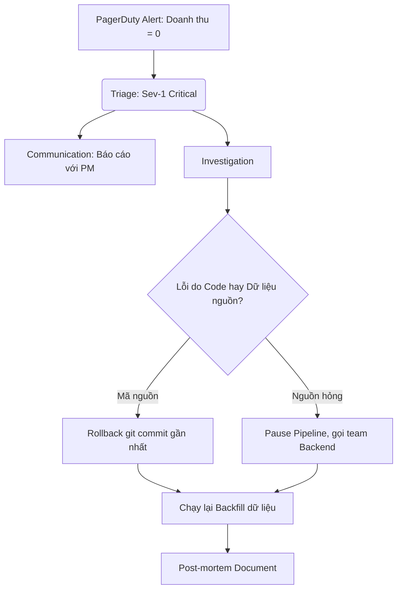

Vòng phỏng vấn xử lý sự cố kiểm tra một thứ mà không vòng nào khác chạm tới: bạn hành xử thế nào khi hệ thống đang cháy và mọi người đang chờ câu trả lời của bạn. Đề bài luôn là một tình huống: pipeline sập lúc nửa đêm, báo cáo doanh thu sai gấp đôi, Kafka ùn ứ. Thứ được chấm không phải kiến thức về công cụ — mà là trình tự hành động, cách giao tiếp, và việc bạn có phân biệt được "dập lửa" với "tìm nguyên nhân" hay không.

Ứng viên yếu lao vào sửa code. Ứng viên tốt khôi phục dịch vụ trước, thông báo cho người bị ảnh hưởng, rồi mới điều tra. Khác biệt đó là toàn bộ nội dung của vòng này.

---

## Sự cố dữ liệu có gì khác sự cố phần mềm thường

Sự cố trong hệ thống dữ liệu đến dưới bốn dạng chính, xếp theo độ khó phát hiện tăng dần: [Data Pipeline](/concepts/1-distributed-systems-architecture/data-pipeline) sập hẳn (job failure — dễ thấy nhất, có alert đỏ); pipeline chạy xong nhưng trễ giờ cam kết (SLA violation); hạ tầng truyền tin nghẽn khiến dữ liệu ùn ứ (consumer lag); và nguy hiểm nhất — **pipeline chạy xanh nhưng dữ liệu sai**: bản ghi trùng, số liệu lệch, không alert nào kêu, và người phát hiện là giám đốc tài chính khi mở báo cáo.

Dạng cuối là đặc sản của ngành dữ liệu. Hệ thống web sập thì user thấy ngay; dữ liệu sai có thể sống âm thầm hàng tháng. Vì vậy câu chuyện xử lý sự cố dữ liệu luôn dính chặt với data quality check và [Idempotency](/concepts/2-data-ingestion-integration/idempotency) — những thứ quyết định lỗi có được phát hiện sớm và sửa được sạch hay không.

---

## Quy trình 5 bước theo chuẩn SRE

Khung này lấy từ thực hành incident management mà Google hệ thống hóa trong sách SRE — dùng nó làm xương sống cho mọi câu trả lời tình huống:

1. **Triage**: nhận cảnh báo (PagerDuty, Datadog...), xác định mức nghiêm trọng (Sev-1 đến Sev-4). Mức Sev quyết định nhịp độ mọi bước sau — báo cáo nội bộ trễ 30 phút và dữ liệu khách hàng đang sai là hai thế giới khác nhau.
2. **Mitigation — dập lửa trước, tìm nguyên nhân sau.** Mục tiêu duy nhất là đưa hệ thống về trạng thái hoạt động: rollback về phiên bản ổn định, restart, tạm tăng tài nguyên. Nguyên nhân sâu xa để sau — hệ thống đang chảy máu thì băng bó trước, chưa phải lúc hỏi vì sao đứt tay.
3. **Communication**: thông báo cho các bên bị ảnh hưởng (kinh doanh, PM) rằng có sự cố và báo cáo sẽ trễ. Chủ động báo tin xấu luôn tốt hơn để người khác tự phát hiện.
4. **Root Cause Analysis**: khi hệ thống đã tạm ổn, dùng kỹ thuật như *5 Whys* bóc dần từ triệu chứng xuống nguyên nhân gốc.
5. **Postmortem**: tài liệu hóa diễn biến, bài học, và action item có người phụ trách — để cùng một lỗi không xảy ra lần hai.

---

## Áp khung vào câu hỏi mẫu: "Pipeline báo OOM lúc nửa đêm, bạn làm gì?"

Trình bày theo hành động có thứ tự, không theo kiến thức:

* *"Đầu tiên tôi xem log trên Airflow và Spark UI để xác định task nào sập và những bảng hạ lưu nào bị ảnh hưởng"* — khoanh vùng trước khi làm gì khác.
* *"Tôi nhắn kênh Slack chung: hệ thống dữ liệu đang gặp sự cố, báo cáo sáng nay có thể trễ"* — giao tiếp sớm, trước cả khi biết nguyên nhân.
* *"Để khôi phục nhanh, tôi tăng tạm bộ nhớ cấp phát và retry. Những ngày dữ liệu đột biến như Flash Sale, OOM tạm thời là khả nghi số một"* — mitigation, kèm giả thuyết.
* *"Sáng hôm sau, khi pipeline đã xanh, tôi xem lại metrics CPU/RAM trên Grafana và rà code tìm nguyên nhân thật — tăng RAM chỉ là băng vết thương, chưa phải chữa"* — tự phân biệt mitigation với fix là điểm cộng lớn.

---

## Bài toán thực chiến: doanh thu trên báo cáo tăng gấp đôi

**Đề bài**: *"Sáng nay báo cáo hiển thị doanh thu gấp đôi thực tế. CFO đang rất tức giận. Bạn điều tra thế nào?"*

Đây là dạng "pipeline xanh, dữ liệu sai" — không có alert nào để lần theo, phải tự truy vết:

1. **Khoanh vùng**: đọc câu SQL của báo cáo, xác định bảng nguồn — `fact_sales`.
2. **Truy vết bằng [Data Lineage](/concepts/8-security-governance-finops/data-lineage)**: `fact_sales` được nạp bởi Airflow job `sales_ingestion`. (Nếu công ty chưa có lineage tool, nói thật: "tôi sẽ lần theo code dbt/Airflow" — trung thực về công cụ sẵn có tốt hơn giả định hạ tầng hoàn hảo.)
3. **Đọc log**: đêm qua job mất kết nối giữa chừng khi đang nạp, Airflow tự động retry.
4. **Root cause**: job thiết kế append-only, không lũy đẳng. Lần chạy đầu nạp được 50% rồi sập; lần retry nạp lại 100% chồng lên — dữ liệu ngày đó bị trùng một nửa. Lỗi không nằm ở retry (retry là hành vi đúng), mà ở chỗ pipeline *không chịu được* retry.
5. **Khắc phục**: xóa bản ghi trùng của ngày đó, sửa job sang delete-then-insert hoặc UPSERT để lũy đẳng, rồi [Backfill](/concepts/2-data-ingestion-integration/backfill) lại. Action item cho postmortem: rà các job append-only còn lại — cùng một lỗi thiết kế hiếm khi chỉ ở một chỗ.

Kịch bản này gần như là "bài tủ" của vòng incident cho DE, vì nó xâu chuỗi đủ: lineage, log, idempotency, backfill.

---

## Ba nguyên tắc vận hành đáng nói ra

**Phát hiện lỗi trước người dùng.** Sự cố tệ nhất là sự cố do khách hàng báo. Data quality check tự động giữa các tầng và SLA timeout alert giúp hệ thống tự khai bệnh trước khi ai đó mở dashboard.

**Postmortem không đổ lỗi (blameless).** Sách SRE của Google đặt đây làm nguyên tắc nền: postmortem tập trung vào *quy trình nào đã để lỗi lọt qua*, không truy cá nhân nào viết dòng code đó — vì văn hóa đổ lỗi khiến kỹ sư giấu sự cố, và sự cố bị giấu thì không ai học được gì. Nếu được hỏi "đồng nghiệp gây ra lỗi thì sao", đây chính là câu trả lời.

**Ưu tiên rollback hơn fix-forward.** Deploy mới có lỗi → `git revert` về trạng thái ổn định gần nhất. Viết hotfix lúc 3 giờ sáng trong trạng thái căng thẳng là cách hiệu quả nhất để biến một sự cố thành hai. Fix-forward chỉ hợp lý khi rollback bất khả thi — ví dụ migration đã chạy không đảo được — và khi đó phải nói rõ rủi ro.

---

## Ba cách làm trầm trọng thêm sự cố

**Âm thầm tự sửa một mình.** Không ai biết tiến độ, PM không có gì để nói với khách hàng, và nếu bạn sửa sai thì không ai kịp cản. Cập nhật trạng thái định kỳ kể cả khi chưa có tiến triển — "vẫn đang điều tra, cập nhật sau 30 phút" cũng là thông tin.

**Alert fatigue.** Ngưỡng cảnh báo quá nhạy làm chuông kêu suốt ngày vì chuyện vặt; kỹ sư chai lì và bỏ qua đúng cái alert nghiêm trọng. Mỗi alert phải actionable — nếu nhận alert mà hành động đúng là "kệ nó", thì alert đó cần bị xóa.

**Xóa dữ liệu lỗi không backup.** `DELETE` thẳng trên production trong lúc vội, gõ nhầm điều kiện WHERE, và bây giờ bạn có hai sự cố. Luôn snapshot/backup bảng trước khi sửa dữ liệu bằng tay — 5 phút backup rẻ hơn vô hạn lần so với mất dữ liệu thật.

---

## Ba câu hỏi thực tế và cách trả lời

### 1. Phân biệt SLA, SLO, SLI trong bối cảnh data pipeline

* **SLI** (indicator): số đo thực tế — *"pipeline hôm nay chạy hết 40 phút"*.
* **SLO** (objective): mục tiêu nội bộ đội tự đặt — *"99% ngày trong tháng, báo cáo xong trước 8:00 sáng"*.
* **SLA** (agreement): cam kết với khách hàng, có ràng buộc tài chính/pháp lý — *"dữ liệu trễ hơn 9:00 sáng thì hoàn 10% phí tháng"*.

Quan hệ đáng nêu: SLO phải chặt hơn SLA để tạo vùng đệm — vi phạm SLO là chuông báo nội bộ, còn kịp xử lý trước khi chạm tới SLA và mất tiền.

### 2. Mô tả phương pháp 5 Whys

Hỏi "tại sao" liên tiếp để đi từ triệu chứng xuống nguyên nhân gốc. Ví dụ: doanh thu sai → *vì sao?* dữ liệu nạp trùng → *vì sao?* job chạy 2 lần → *vì sao?* Airflow mất kết nối database nguồn nên auto-retry → *vì sao?* database nguồn quá tải → *vì sao?* lịch backup tự động của database trùng khung giờ chạy pipeline. Root cause: xung đột lịch giữa hai hệ thống hạ tầng — thứ không bao giờ lộ ra nếu dừng ở "tại sao" thứ nhất và chỉ đi khử trùng dữ liệu. Lưu ý trung thực nếu bị hỏi sâu: sự cố thật thường có nhiều nguyên nhân góp phần chứ không phải một chuỗi tuyến tính đẹp — 5 Whys là công cụ dẫn đường, không phải nghi thức.

### 3. Phát hiện lỗi data quality đã âm thầm tồn tại 3 tháng — xử lý sao?

1. **Freeze**: khóa ghi bảng lỗi, đặt cảnh báo trên dashboard BI để người dùng ngừng lấy số sai đi phân tích — chặn thiệt hại lan thêm trước tiên.
2. **Xác định thời điểm lỗi bắt đầu** qua log và đối chiếu dữ liệu nguồn.
3. **Chuẩn bị xóa/sửa**: xóa các partition lỗi hoặc soạn script `MERGE INTO` — sau khi backup.
4. **Sửa code, test trên staging** với chính dữ liệu của khoảng thời gian lỗi.
5. **Backfill** 3 tháng từ dữ liệu thô (Kafka retention, S3 raw layer). Điểm nối quan trọng: bước này chỉ khả thi nếu tầng Bronze còn giữ dữ liệu thô và pipeline lũy đẳng — một lý do nữa cho hai nguyên tắc thiết kế đó. Kết bằng ý postmortem: thêm chính cái data quality check đã thiếu, để lần sau lỗi sống 3 giờ chứ không phải 3 tháng.

---

## Tài liệu tham khảo

* [Google SRE Book — Postmortem Culture: Learning from Failure](https://sre.google/sre-book/postmortem-culture/) — nguồn gốc của blameless postmortem.
* [Google SRE — Incident Management Guide](https://sre.google/resources/practices-and-processes/incident-management-guide/) — quy trình ứng phó sự cố chính thức của Google.
* [Google SRE Book — Example Postmortem](https://sre.google/sre-book/example-postmortem/) — mẫu postmortem thực tế để tham khảo cấu trúc.
* **Site Reliability Engineering — Google (O'Reilly, đọc miễn phí tại sre.google)** — các chương về on-call, alerting và SLO là nền của toàn bộ vòng phỏng vấn này.
* **Fundamentals of Data Engineering — Joe Reis & Matt Housley (O'Reilly)** — góc nhìn DataOps: áp dụng thực hành vận hành phần mềm vào hệ thống dữ liệu.
