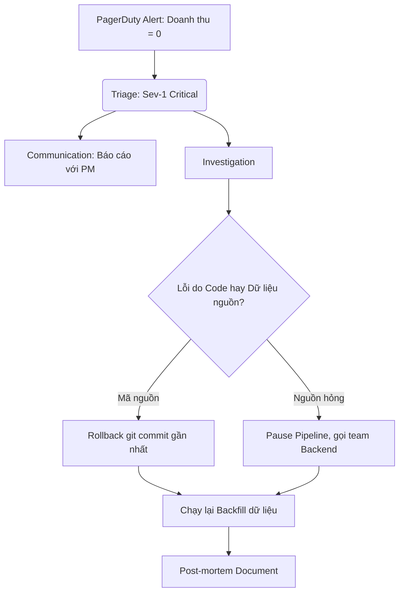

Trong các buổi phỏng vấn Data Engineer (đặc biệt là các vị trí từ Senior trở lên), vòng phỏng vấn **Xử lý sự cố Production** (Production Incident QA) là một thử thách vô cùng thực tế. Vòng này được thiết kế để đánh giá khả năng chẩn đoán lỗi, tư duy giải quyết vấn đề dưới áp lực cao (troubleshooting under pressure), kỹ năng giao tiếp liên phòng ban và tinh thần trách nhiệm của ứng viên khi đóng vai trò là một kỹ sư trực gác (On-call Engineer).

---

## Khi chuông điện thoại réo vang lúc 2 giờ sáng

Mọi hệ thống phần mềm dù có được thiết kế hoàn hảo đến đâu thì sớm muộn gì cũng sẽ xảy ra lỗi. Khi hệ thống gặp sự cố lúc nửa đêm, nhà tuyển dụng muốn biết bạn sẽ phản ứng như thế nào:
* Bạn hoảng loạn chạy lệnh sửa code trực tiếp trên Production?
* Bạn phớt lờ cảnh báo để chờ đến sáng mai lên văn phòng xử lý?
* Hay bạn có một quy trình ứng phó bài bản: nhanh chóng khôi phục hệ thống tạm thời để giảm thiểu thiệt hại, thông báo cho các bên liên quan, rồi bình tĩnh truy tìm nguyên nhân gốc rễ (Root Cause) để đảm bảo lỗi đó không bao giờ lặp lại?

---

## Bản chất của các câu hỏi xử lý sự cố

Trong thế giới dữ liệu, một sự cố Production thường diễn ra dưới nhiều hình thức đa dạng:
* Đường ống dẫn dữ liệu ([Data Pipeline](/concepts/foundation/data-pipeline/)) đột ngột bị sập (Job Failure).
* Pipeline chạy thành công nhưng mất quá nhiều thời gian, vi phạm cam kết thời gian hoàn thành (SLA Violation).
* Hệ thống truyền tin Kafka bị mất kết nối mạng, gây ùn ứ dữ liệu.
* Nghiêm trọng nhất: dữ liệu rác hoặc dữ liệu trùng lặp trôi vào kho dữ liệu ([Data Warehouse](/concepts/data-warehouse/data-warehouse/)) khiến các báo cáo doanh thu tài chính bị sai lệch mà không có Job nào báo đỏ.

---

## Quy trình 5 bước ứng phó sự cố chuẩn SRE

Để thể hiện sự chuyên nghiệp của một kỹ sư giàu kinh nghiệm, bạn hãy bám sát quy trình ứng phó sự cố 5 bước chuẩn mực sau:

1. **Xác nhận và Phân loại (Triage & Acknowledge)**: Tiếp nhận cảnh báo từ các hệ thống giám sát (Datadog, PagerDuty...), nhanh chóng xác định mức độ nghiêm trọng của sự cố (Severity - từ Sev-1 cực kỳ nghiêm trọng đến Sev-4 ít ảnh hưởng).
2. **Giảm nhẹ thiệt hại (Mitigation)**: Mục tiêu hàng đầu là làm sao cho hệ thống hoạt động bình thường trở lại nhanh nhất có thể để "ngừng chảy máu", chưa cần thiết phải tìm ra nguyên nhân sâu xa ngay lập tức (ví dụ: thực hiện rollback mã nguồn về phiên bản cũ ổn định, khởi động lại server hoặc tạm tăng tài nguyên RAM).
3. **Giao tiếp chủ động (Communication)**: Thông báo tình hình sự cố cho các bên liên quan (đội ngũ kinh doanh, Product Managers...) để họ nắm được thông tin báo cáo sẽ bị chậm trễ, tránh rơi vào thế bị động.
4. **Phân tích nguyên nhân gốc rễ (RCA - Root Cause Analysis)**: Sau khi hệ thống đã tạm thời ổn định, tiến hành phân tích sâu (sử dụng phương pháp *5 Whys*) để tìm ra nguyên nhân cốt lõi gây lỗi.
5. **Viết Post-mortem (Hậu kiểm)**: Soạn thảo tài liệu phân tích chi tiết sự cố, rút ra bài học kinh nghiệm và đưa ra các đầu việc cần làm (Action Items) để cải tiến hệ thống, ngăn chặn sự cố tương tự tái diễn trong tương lai.

---

## Hướng dẫn từng bước trả lời phỏng vấn khi hệ thống gặp sự cố

Khi người phỏng vấn đưa ra tình huống: *"Pipeline của bạn báo lỗi tràn bộ nhớ (OOM) lúc nửa đêm. Bạn sẽ làm gì?"*, hãy trình bày câu trả lời của mình theo các bước hành động cụ thể thay vì chỉ tập trung vào kỹ thuật sửa lỗi:

* **Bước 1**: *"Trước tiên, tôi sẽ kiểm tra Logs trên Airflow hoặc Spark UI để xác nhận chính xác task nào đang sập và tầm ảnh hưởng của nó tới các bảng dữ liệu hạ lưu."*
* **Bước 2**: *"Tiếp theo, tôi sẽ gửi thông báo lên kênh Slack chung để báo cho các bên kinh doanh biết rằng hệ thống dữ liệu đang gặp sự cố và báo cáo doanh thu sáng nay có thể bị trễ."*
* **Bước 3**: *"Để khôi phục hệ thống nhanh nhất, tôi sẽ tạm thời cấu hình tăng bộ nhớ RAM cấp phát lên gấp đôi và chạy lại (Retry) pipeline. Vì trong các ngày đặc biệt như Flash Sale, lượng dữ liệu tăng đột biến rất dễ gây ra lỗi OOM tạm thời."*
* **Bước 4**: *"Sau khi pipeline đã chạy xanh trở lại, tôi sẽ mở Grafana để phân tích chi tiết các chỉ số sử dụng CPU/RAM của job đó, rà soát lại code để tìm ra đoạn logic gây rò rỉ bộ nhớ nhằm tối ưu hóa triệt để vào ngày hôm sau."*

---

## Sơ đồ quy trình ứng phó và khắc phục sự cố hệ thống

Dưới đây là sơ đồ mô tả luồng xử lý chuẩn khi hệ thống phát đi cảnh báo sự cố nghiêm trọng:

---

## Tình huống thực tế: Doanh thu trên báo cáo đột ngột tăng gấp đôi

**Đề bài từ người phỏng vấn**: *"Sáng nay, báo cáo hiển thị doanh thu của công ty đột ngột tăng vọt lên gấp đôi so với thực tế. Giám đốc tài chính đang rất tức giận. Bạn là Data Engineer chịu trách nhiệm hệ thống này, bạn sẽ điều tra lỗi như thế nào?"*

**Cách phân tích và giải quyết bài bản**:

1. **Khoanh vùng phạm vi ảnh hưởng**: Tôi sẽ kiểm tra câu lệnh SQL tính toán báo cáo đó để xác định bảng dữ liệu nguồn. Phát hiện số liệu được lấy trực tiếp từ bảng `fact_sales`.
2. **Truy vết nguồn gốc dữ liệu ([Data Lineage](/concepts/governance-metadata/data-lineage/))**: Sử dụng bản đồ Lineage để truy tìm nguồn gốc nạp dữ liệu. Bảng `fact_sales` được cập nhật bởi một Airflow Job mang tên `sales_ingestion`.
3. **Kiểm tra nhật ký hệ thống (Logs)**: Rà soát log của Job `sales_ingestion` đêm qua. Phát hiện job đã bị mất kết nối mạng giữa chừng khi đang nạp dữ liệu từ database nguồn. Hệ thống Airflow sau đó đã tự động kích hoạt cơ chế chạy lại (Retry).
4. **Xác định nguyên nhân gốc rễ (Root Cause)**: Do Job `sales_ingestion` được thiết kế theo dạng chỉ ghi thêm dữ liệu (Append-only) mà không có tính lũy đẳng ([Idempotency](/concepts/etl-elt/idempotency/)). Ở lần chạy đầu tiên, job đã nạp thành công 50% dữ liệu rồi sập. Ở lần chạy lại sau đó, job lại tiếp tục tải toàn bộ 100% dữ liệu đè lên, dẫn đến việc trùng lặp dữ liệu giao dịch của ngày hôm đó.
5. **Khắc phục sự cố**: Xóa toàn bộ các bản ghi bị lỗi của ngày hôm đó trong bảng `fact_sales`. Chỉnh sửa lại thiết kế của Job sang cơ chế ghi đè (Delete-then-Insert hoặc UPSERT) để đảm bảo tính lũy đẳng, sau đó thực hiện chạy lại ([Backfill](/concepts/etl-elt/backfill/)) dữ liệu ngày hôm đó.

---

## Những nguyên tắc vàng và Best Practices

* **Chủ động phát hiện lỗi bằng hệ thống cảnh báo (Alerting)**: Một sự cố tồi tệ nhất là khi chỉ được phát hiện sau khi khách hàng hoặc người dùng kinh doanh gọi điện phàn nàn. Hãy thiết lập các chốt chặn chất lượng dữ liệu tự động (Data Quality Checks) và cảnh báo trễ hạn hoàn thành (SLA Timeout Alerts) để phát hiện lỗi trước khi người dùng kịp mở báo cáo.
* **Văn hóa Post-mortem không đổ lỗi (Blameless)**: Khi viết tài liệu phân tích sự cố, hãy tập trung vào câu hỏi: *"Quy trình kiểm soát nào đã bị bỏ sót khiến lỗi này lọt qua được môi trường Production?"* chứ tuyệt đối không tập trung chỉ trích cá nhân kỹ sư nào đã viết đoạn code đó.
* **Ưu tiên Rollback hơn là cố gắng sửa đè (Fix-forward)**: Khi deploy code mới lên Production và phát hiện lỗi, phương án an toàn nhất luôn là thực hiện `git revert` và rollback hạ tầng về trạng thái ổn định gần nhất, thay vì cố gắng vội vã viết code sửa lỗi trực tiếp trên Production trong tình trạng căng thẳng.

---

## Những sai lầm kinh điển dễ làm trầm trọng thêm sự cố

* **Mất bình tĩnh và âm thầm tự sửa lỗi**: Nhiều kỹ sư khi gặp sự cố thường âm thầm tìm cách tự sửa lỗi một mình mà không cập nhật trạng thái cho mọi người. Việc này khiến quản lý dự án (PM) hoang mang không biết tiến độ khắc phục ra sao để thông báo cho khách hàng. Hãy luôn cập nhật thông tin thường xuyên.
* **Hội chứng mệt mỏi vì cảnh báo (Alert Fatigue)**: Việc cấu hình ngưỡng cảnh báo quá nhạy (ví dụ: hệ thống rung chuông liên tục cho các lỗi cảnh báo nhỏ) sẽ khiến các kỹ sư dần trở nên chai lì và dễ bỏ qua cả những cảnh báo đỏ cực kỳ nghiêm trọng.
* **Tự ý xóa dữ liệu lỗi mà không sao lưu (Backup)**: Trong lúc vội vã khắc phục sự cố, nhiều kỹ sư gõ trực tiếp lệnh xóa (`DELETE`) dữ liệu lỗi trên Production mà quên tạo bản sao lưu dự phòng. Nếu chẳng may gõ nhầm điều kiện lọc, bạn có thể xóa mất dữ liệu thật và khiến thảm họa nhân lên gấp nhiều lần.

---

## Bài toán đánh đổi: Rollback (Quay lui) hay Roll-forward (Sửa đè)?

* **Rollback**: Giúp đưa hệ thống trở lại trạng thái an toàn trước đó gần như ngay lập tức, giảm thiểu tối đa rủi ro phát sinh thêm lỗi mới. Tuy nhiên, nó sẽ tốn thời gian để hoàn tác (revert) các thay đổi cấu trúc bảng (DDL) nếu bạn đã lỡ chạy deploy trước đó.
* **Roll-forward**: Cố gắng viết mã vá lỗi (hotfix) trực tiếp đè lên hệ thống hiện tại. Cách này sẽ nhanh chóng nếu lỗi cực kỳ đơn giản, nhưng lại tiềm ẩn rủi ro rất cao vì dễ viết sai code trong lúc đang hoảng loạn hoặc thiếu ngủ.

---

## Bộ câu hỏi phỏng vấn thực tế và Cách trả lời ghi điểm

### 1. Hãy phân biệt các khái niệm SLA, SLO và SLI trong bối cảnh quản lý Data Pipeline.
* **Gợi ý trả lời**: 
  * **SLI (Service Level Indicator)**: Chỉ số đo lường hiệu suất thực tế của hệ thống tại một thời điểm (Ví dụ: *"Thời gian chạy của pipeline hôm nay là 40 phút"*).
  * **SLO (Service Level Objective)**: Mục tiêu hiệu suất nội bộ do đội ngũ kỹ thuật tự đặt ra để phấn đấu (Ví dụ: *"99% số báo cáo trong tháng phải chạy xong trước 8:00 sáng hàng ngày"*).
  * **SLA (Service Level Agreement)**: Cam kết mức độ dịch vụ giữa công ty và khách hàng có ràng buộc về mặt pháp lý hoặc tài chính (Ví dụ: *"Nếu dữ liệu báo cáo gửi chậm hơn 9:00 sáng, công ty sẽ phải hoàn trả 10% phí dịch vụ của tháng đó"*).

### 2. Hãy mô tả phương pháp phân tích "5 Whys" (5 câu hỏi Tại sao) để tìm nguyên nhân gốc rễ (RCA).
* **Gợi ý trả lời**: Đây là phương pháp đặt câu hỏi "Tại sao" liên tiếp để bóc tách dần các hiện tượng bề mặt nhằm tìm ra nguyên nhân sâu xa nhất của lỗi hệ thống.
  * *Ví dụ thực tế*: Số liệu doanh thu hiển thị sai. 
    1. *Tại sao?* Vì Job Spark nạp dữ liệu bị trùng lặp. 
    2. *Tại sao?* Vì Job đó bị kích hoạt chạy lại 2 lần liên tiếp. 
    3. *Tại sao?* Vì Airflow bị mất kết nối mạng với database nguồn nên tự động kích hoạt chạy lại (Auto-retry). 
    4. *Tại sao?* Vì database nguồn đang chạy tác vụ sao lưu (backup) tự động định kỳ gây quá tải cổng kết nối. 
    5. *Tại sao?* Vì lịch chạy backup tự động của database nguồn đang được cấu hình trùng khít với khung giờ chạy pipeline dữ liệu.
    $\rightarrow$ *Root Cause*: Cấu hình sai lịch hoạt động của các hệ thống hạ tầng.

### 3. Bạn sẽ xử lý thế nào nếu phát hiện một lỗi chất lượng dữ liệu (Data Quality) đã âm thầm xảy ra trong kho dữ liệu suốt 3 tháng qua?
* **Gợi ý trả lời**: Tôi sẽ tiến hành quy trình chạy lại dữ liệu lịch sử (Backfill) theo các bước:
  1. **Đóng băng (Freeze)** bảng dữ liệu bị lỗi, tạm thời vô hiệu hóa quyền ghi mới và đặt thông báo cảnh báo trên các dashboard BI để người dùng biết số liệu đang được sửa đổi, tránh lấy số liệu sai để phân tích.
  2. **Xác định thời điểm bắt đầu lỗi** bằng cách rà soát log hệ thống và đối chiếu dữ liệu gốc.
  3. **Xóa các phân vùng dữ liệu** (partitions) bị lỗi trong 3 tháng qua (hoặc chuẩn bị sẵn các script `MERGE INTO` để cập nhật đè).
  4. **Viết mã sửa lỗi**, kiểm thử kỹ lưỡng trên môi trường Staging/Dev để đảm bảo code hoạt động hoàn hảo.
  5. **Kích hoạt pipeline nạp lại (Backfill)** dữ liệu thô từ nguồn (như Kafka hoặc S3 raw storage) cho khoảng thời gian 3 tháng bị ảnh hưởng.

---

## Sách hay và tài liệu tham khảo

1. **Site Reliability Engineering (SRE)** - Google (Cuốn sách kinh điển nhất thế giới về văn hóa trực gác, ứng phó sự cố và viết tài liệu hậu kiểm).
2. **Fundamentals of Data Engineering** - Chương 10 chia sẻ sâu sắc về Data Operations (DataOps) và cách thức quản lý sự cố dữ liệu.

---

## English Summary

The Production Incident QA interview assesses a candidate's operational maturity, ability to troubleshoot complex issues under pressure, and adherence to Incident Response protocols. Employers look for structured thinking: starting with Triage and Acknowledge, prioritizing immediate Mitigation (e.g., rolling back instead of hotfixing) to stop the bleeding, ensuring proactive Communication with stakeholders, and ultimately performing [Root Cause Analysis](/concepts/observability-reliability/root-cause-analysis/) (RCA) using frameworks like the '5 Whys'. Strong candidates emphasize Idempotency to enable easy backfills, implement blameless post-mortems, and establish robust observability mechanisms rather than relying on manual checks or user complaints.