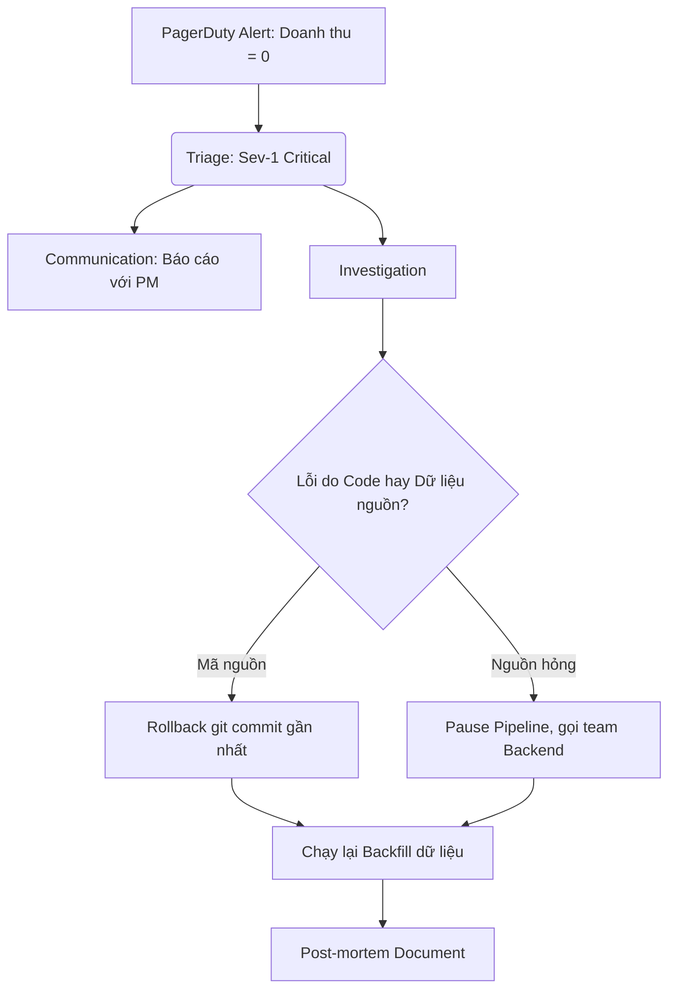

Trong các buổi phỏng vấn Data Engineer (đặc biệt là các vị trí từ Senior trở lên), vòng phỏng vấn **Xử lý sự cố Production** (Production Incident QA) là một thử thách vô cùng thực tế. Vòng này được thiết kế để đánh giá khả năng chẩn đoán lỗi, tư duy giải quyết vấn đề dưới áp lực cao (troubleshooting under pressure), kỹ năng giao tiếp liên phòng ban và tinh thần trách nhiệm của ứng viên khi đóng vai trò là một kỹ sư trực gác (On-call Engineer).

---

## Khi chuông điện thoại réo vang lúc 2 giờ sáng

Mọi hệ thống phần mềm dù có được thiết kế hoàn hảo đến đâu thì sớm muộn gì cũng sẽ xảy ra lỗi. Khi hệ thống gặp sự cố lúc nửa đêm, nhà tuyển dụng muốn biết bạn sẽ phản ứng như thế nào:
* Bạn hoảng loạn chạy lệnh sửa code trực tiếp trên Production?
* Bạn phớt lờ cảnh báo để chờ đến sáng mai lên văn phòng xử lý?
* Hay bạn có một quy trình ứng phó bài bản: nhanh chóng khôi phục hệ thống tạm thời để giảm thiểu thiệt hại, thông báo cho các bên liên quan, rồi bình tĩnh truy tìm nguyên nhân gốc rễ (Root Cause) để đảm bảo lỗi đó không bao giờ lặp lại?

---

## Bản chất của các câu hỏi xử lý sự cố

Trong thế giới dữ liệu, một sự cố Production thường diễn ra dưới nhiều hình thức đa dạng:
* Đường ống dẫn dữ liệu ([Data Pipeline](/concepts/1-foundations/foundation/data-pipeline/)) đột ngột bị sập (Job Failure).
* Pipeline chạy thành công nhưng mất quá nhiều thời gian, vi phạm cam kết thời gian hoàn thành (SLA Violation).
* Hệ thống truyền tin Kafka bị mất kết nối mạng, gây ùn ứ dữ liệu.
* Nghiêm trọng nhất: dữ liệu rác hoặc dữ liệu trùng lặp trôi vào kho dữ liệu ([Data Warehouse](/concepts/2-storage/data-warehouse/data-warehouse/)) khiến các báo cáo doanh thu tài chính bị sai lệch mà không có Job nào báo đỏ.

---

## Quy trình 5 bước ứng phó sự cố chuẩn SRE

Để thể hiện sự chuyên nghiệp của một kỹ sư giàu kinh nghiệm, bạn hãy bám sát quy trình ứng phó sự cố 5 bước chuẩn mực sau:

1. **Xác nhận và Phân loại (Triage & Acknowledge)**: Tiếp nhận cảnh báo từ các hệ thống giám sát (Datadog, PagerDuty...), nhanh chóng xác định mức độ nghiêm trọng của sự cố (Severity - từ Sev-1 cực kỳ nghiêm trọng đến Sev-4 ít ảnh hưởng).
2. **Giảm nhẹ thiệt hại (Mitigation)**: Mục tiêu hàng đầu là làm sao cho hệ thống hoạt động bình thường trở lại nhanh nhất có thể để "ngừng chảy máu", chưa cần thiết phải tìm ra nguyên nhân sâu xa ngay lập tức (ví dụ: thực hiện rollback mã nguồn về phiên bản cũ ổn định, khởi động lại server hoặc tạm tăng tài nguyên RAM).
3. **Giao tiếp chủ động (Communication)**: Thông báo tình hình sự cố cho các bên liên quan (đội ngũ kinh doanh, Product Managers...) để họ nắm được thông tin báo cáo sẽ bị chậm trễ, tránh rơi vào thế bị động.
4. **Phân tích nguyên nhân gốc rễ (RCA - Root Cause Analysis)**: Sau khi hệ thống đã tạm thời ổn định, tiến hành phân tích sâu (sử dụng phương pháp *5 Whys*) để tìm ra nguyên nhân cốt lõi gây lỗi.
5. **Viết Post-mortem (Hậu kiểm)**: Soạn thảo tài liệu phân tích chi tiết sự cố, rút ra bài học kinh nghiệm và đưa ra các đầu việc cần làm (Action Items) để cải tiến hệ thống, ngăn chặn sự cố tương tự tái diễn trong tương lai.

---

## Sơ đồ quy trình ứng phó và khắc phục sự cố hệ thống

Dưới đây là sơ đồ mô tả luồng xử lý chuẩn khi hệ thống phát đi cảnh báo sự cố nghiêm trọng:

---

## Điểm mạnh và điểm yếu

Khi đối phó sự cố Production, hai chiến lược khôi phục phổ biến là **Quay lui mã nguồn (Rollback)** và **Sửa đè nóng (Roll-forward)**. Mỗi phương pháp đều có ưu và nhược điểm riêng:

### Chiến lược Quay lui (Rollback)
* **Điểm mạnh (Pros)**: Cực kỳ an toàn, giúp khôi phục hệ thống về trạng thái ổn định gần nhất một cách nhanh chóng mà không cần tốn thời gian suy nghĩ logic sửa lỗi dưới áp lực thời gian.
* **Điểm yếu (Cons)**: Có thể gặp khó khăn nếu bản cập nhật đi kèm với các thay đổi cấu trúc bảng dữ liệu (DDL) phức tạp khó hoàn tác ngay lập tức, hoặc làm mất một số tính năng mới đã chạy thành công trước đó.

### Chiến lược Sửa đè (Roll-forward / Hotfix)
* **Điểm mạnh (Pros)**: Giải quyết trực tiếp vấn đề mà không cần hoàn tác toàn bộ gói triển khai, giữ lại được các tính năng mới khác.
* **Điểm yếu (Cons)**: Rất nguy hiểm vì kỹ sư viết code vá lỗi trong trạng thái hoảng loạn, thiếu ngủ dễ dẫn đến sai sót và làm thảm họa nhân lên gấp nhiều lần.

---

## Khi nào nên dùng

* **Nên dùng Rollback**: Là lựa chọn mặc định cho hầu hết các sự cố cấp độ Sev-1 (nghiêm trọng ảnh hưởng đến người dùng cuối). Khi hệ thống đang "chảy máu", ưu tiên hàng đầu là khôi phục hoạt động bình thường càng nhanh càng tốt.
* **Nên dùng Roll-forward**: Chỉ áp dụng khi lỗi cực kỳ đơn giản (như sai lỗi chính tả biến môi trường, thiếu một tham số cấu hình nhỏ) và việc rollback cấu trúc bảng dữ liệu (DDL) sẽ gây ra rủi ro mất mát dữ liệu lớn hơn.

---

## Trọng tâm ôn luyện phỏng vấn

Dưới đây là 3 tình huống phỏng vấn thực tế giả định được giải quyết theo quy trình phản ứng và khắc phục sự cố chuyên nghiệp:

### Tình huống 1: Triage và Mitigate lỗi sập luồng dữ liệu do vi phạm SLA
**Câu hỏi**: *"Vào lúc 3 giờ sáng, hệ thống cảnh báo PagerDuty đổ chuông báo hiệu Job Spark nạp dữ liệu ngày bị sập và có nguy cơ vi phạm cam kết SLA hoàn thành lúc 6 giờ sáng của doanh nghiệp. Bạn sẽ xử lý sự cố này thế nào theo quy trình chuẩn?"*

**Trả lời (Quy trình Triage-Mitigate-Communicate-RCA)**:
* **Triage (Xác nhận & Phân loại)**: Tôi truy cập vào Airflow Dashboard để xác định task bị lỗi. Phát hiện job `spark_daily_ingest` đã chạy được 2 tiếng rồi sập do lỗi `java.lang.OutOfMemoryError: Java heap space` ở các Executor node. Mức độ ảnh hưởng là Sev-2 vì nó trực tiếp đe dọa SLA báo cáo của ban giám đốc.
* **Mitigate (Giảm nhẹ)**: Vì lượng dữ liệu ngày hôm qua tăng đột biến do chiến dịch khuyến mãi (Flash Sale), tôi sẽ tạm thời tăng tài nguyên RAM cho các Executor trong cấu hình Spark của Airflow task lên gấp rưỡi (từ 8GB lên 12GB) và kích hoạt chạy lại (Retry) ngay lập tức để tận dụng thời gian.
* **Communicate (Giao tiếp)**: Tôi gửi một tin nhắn lên kênh Slack `#data-ops-incidents` báo cáo: *"Sự cố Sev-2 phát sinh lúc 3:00 sáng tại job spark_daily_ingest do tràn bộ nhớ dữ liệu Flash Sale. Đã thực hiện tăng RAM cấu hình và chạy lại. Dự kiến hoàn thành lúc 5:45 sáng, sát giờ SLA 6:00. Chúng tôi đang tiếp tục giám sát."*
* **RCA (Root Cause Analysis)**: Sau khi job chạy thành công lúc 5:40 sáng, tôi mở Spark UI ra phân tích. Nguyên nhân gốc rễ là do dữ liệu đầu vào bị lệch (Data Skew) ở khóa `merchant_id = 999` (tài khoản đối tác chính chạy khuyến mãi), khiến 1 Executor phải xử lý 80% lượng tải và bị sập RAM.
* **Action Items**: Lên kế hoạch refactor code để áp dụng kỹ thuật Salting khóa join hoặc kích hoạt Adaptive Query Execution (AQE) của Spark để tự động chia nhỏ các phân vùng bị lệch.

### Tình huống 2: Sử dụng phương pháp 5 Whys tìm nguyên nhân số liệu báo cáo tăng gấp đôi
**Câu hỏi**: *"Sáng nay, báo cáo hiển thị doanh thu của công ty đột ngột tăng vọt lên gấp đôi so với thực tế. Giám đốc tài chính đang rất tức giận. Bạn sẽ điều tra và giải trình nguyên nhân gốc rễ bằng phương pháp 5 Whys thế nào?"*

**Trả lời (STAR & 5 Whys)**:
* **Situation**: Bảng dữ liệu doanh thu `fact_sales` bị trùng lặp bản ghi, khiến dashboard BI hiển thị sai lệch nghiêm trọng.
* **Task**: Thực hiện truy vết nguồn gốc dữ liệu (Data Lineage) và áp dụng phương pháp 5 Whys để tìm ra lỗi hệ thống.
* **Action (Thực hiện phân tích 5 Whys)**:
  1. *Tại sao doanh thu tăng gấp đôi?* Vì bảng `fact_sales` chứa 2 bản ghi trùng lặp cho mỗi giao dịch xảy ra ngày hôm qua.
  2. *Tại sao bảng chứa bản ghi trùng lặp?* Vì Job Airflow nạp dữ liệu từ database nguồn đã chạy lại (Retry) thành công ở lần thứ 2 nhưng không xóa dữ liệu ghi dở dang của lần thứ 1.
  3. *Tại sao Job Airflow chạy lại?* Vì ở lần chạy thứ 1, kết nối mạng giữa cụm Spark và database nguồn bị ngắt quãng giữa chừng khi đang tải được 50% dữ liệu.
  4. *Tại sao Job không tự dọn dẹp dữ liệu cũ khi sập?* Vì luồng dữ liệu được viết bằng lệnh `INSERT INTO` (Append-only) thay vì sử dụng cơ chế ghi đè phân vùng (Overwrite) hoặc câu lệnh `MERGE INTO` (Upsert). Pipeline thiếu tính lũy đẳng (Idempotency).
  5. *Tại sao pipeline thiếu tính lũy đẳng?* Vì tiêu chuẩn phát triển code (Data Quality Framework) chưa bắt buộc kiểm tra và áp dụng thiết kế Idempotent cho các luồng nạp dữ liệu.
* **Result**: Tôi xác định được Root Cause là lỗi thiết kế hệ thống thiếu tính lũy đẳng. Tôi đã tiến hành dọn dẹp dữ liệu trùng lặp bằng script xóa phân vùng, chạy lại backfill dữ liệu đúng, và refactor code sang cơ chế `MERGE INTO` để ngăn chặn lỗi tái diễn.

### Tình huống 3: Khắc phục lỗi chất lượng dữ liệu âm thầm trôi qua 3 tháng
**Câu hỏi**: *"Chúng ta phát hiện ra một lỗi chất lượng dữ liệu (Data Quality) do một API nguồn gửi dữ liệu bị khuyết trường thông tin địa lý suốt 3 tháng qua mà không có Job nào báo đỏ. Dashboard hiển thị 30% khách hàng có vị trí 'Unknown'. Bạn sẽ xử lý sự cố này thế nào?"*

**Trả lời (STAR & Phục hồi dữ liệu)**:
* **Situation**: Dữ liệu lịch sử 3 tháng bị khuyết thông tin địa lý, ảnh hưởng nghiêm trọng đến các báo cáo phân bổ ngân sách marketing theo vùng.
* **Task**: Thực hiện vá lỗi code, thiết lập chốt chặn chất lượng dữ liệu mới và chạy lại (Backfill) 3 tháng dữ liệu một cách an toàn mà không làm gián đoạn dashboard hiện tại.
* **Action**:
  1. *Đóng băng và Cảnh báo*: Tạo một bản ghi tạm trên Dashboard ghi rõ: *"Dữ liệu địa lý từ ngày A đến ngày B đang được hiệu chỉnh. Vui lòng không sử dụng cho báo cáo chính thức."*
  2. *Hotfix Code*: Sửa đổi API Client để tự động điền thông tin địa lý mặc định dựa trên địa chỉ IP của người dùng nếu trường địa lý bị rỗng, viết unit test kiểm tra và deploy lên production.
  3. *Chạy Backfill*: Viết một kịch bản Airflow chạy lùi thời gian (Backfill DAG) chia nhỏ theo từng ngày. Thay vì chạy 1 lần cho 3 tháng (gây quá tải DB), tôi chia nhỏ tải để chạy cuốn chiếu ngược từ ngày gần nhất về quá khứ, chạy vào khung giờ thấp điểm từ 1:00 đến 4:00 sáng.
  4. *Data Quality Check*: Thêm bài kiểm tra tự động bằng Great Expectations để cảnh báo ngay lập tức nếu tỷ lệ giá trị 'Unknown' vượt quá 2% trong ngày.
* **Result**: Sau 5 ngày chạy cuốn chiếu, toàn bộ dữ liệu 3 tháng đã được khôi phục chính xác hoàn toàn. Hệ thống giám sát mới sẽ tự động bắn cảnh báo Slack nếu gặp lỗi tương tự trong vòng 24 giờ.

---

## English Summary

The Production Incident QA interview assesses a candidate's operational maturity, ability to troubleshoot complex issues under pressure, and adherence to Incident Response protocols. Employers look for structured thinking: starting with Triage and Acknowledge, prioritizing immediate Mitigation (e.g., rolling back instead of hotfixing) to stop the bleeding, ensuring proactive Communication with stakeholders, and ultimately performing [Root Cause Analysis](/concepts/5-quality-governance/observability-reliability/root-cause-analysis/) (RCA) using frameworks like the '5 Whys'. Strong candidates emphasize Idempotency to enable easy backfills, implement blameless post-mortems, and establish robust observability mechanisms rather than relying on manual checks or user complaints.

---

## Xem thêm các khái niệm liên quan

* [Tính lũy đẳng (Idempotency)](../concepts/3-integration/etl-elt/idempotency/) - Nguyên tắc vàng để đảm bảo tính nhất quán dữ liệu.
* [Orchestration & Airflow](../concepts/3-integration/orchestration/orchestration/) - Quản lý và điều phối các job dữ liệu phân tán.
* [Data Quality](../concepts/5-quality-governance/data-quality/data-quality/) - Thiết lập các chốt chặn kiểm soát chất lượng dữ liệu.

---

## Tài liệu tham khảo

1. [AWS Well-Architected Framework - Reliability Pillar](https://docs.aws.amazon.com/wellarchitected/latest/reliability-pillar/welcome.html)
2. [Google Site Reliability Engineering (SRE) Book](https://sre.google/sre-book/table-of-contents/)
3. [Databricks Lakehouse Reliability Guidelines](https://docs.databricks.com/lakehouse/data-reliability.html)
4. [Apache Spark Performance Tuning and Troubleshooting](https://spark.apache.org/docs/latest/tuning.html)
5. [Confluent Kafka Operations and Monitoring Guide](https://docs.confluent.io/platform/current/kafka/operations-monitoring.html)
