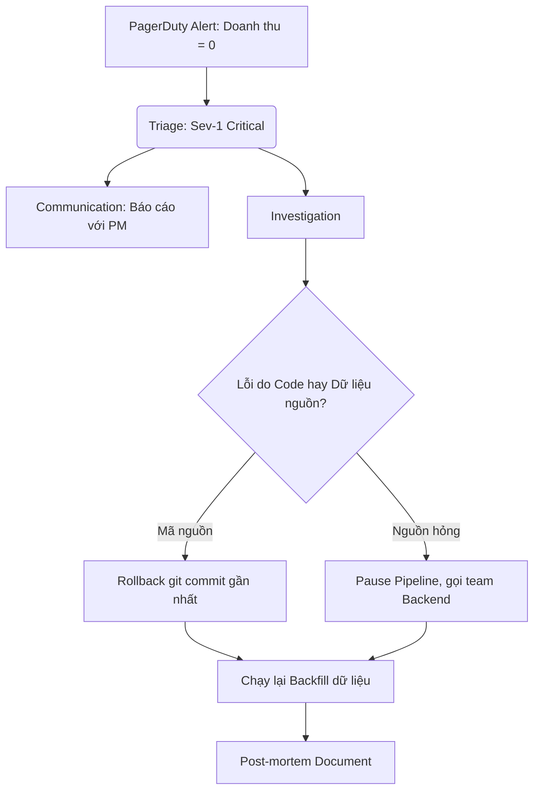

# Xử lý sự cố Production (Phỏng vấn) - Production Incident QA

## Summary

**Production Incident QA** (Hỏi đáp xử lý sự cố thực tế) là vòng phỏng vấn đặc biệt đánh giá kinh nghiệm "thực chiến", tư duy giải quyết vấn đề dưới áp lực cao (troubleshooting under pressure) và kỹ năng giao tiếp khi hệ thống dữ liệu bị sập hoặc trả về dữ liệu sai lệch trên môi trường production. Nó đánh giá xem ứng viên có phải là một On-call Engineer đáng tin cậy hay không.

---

## Definition

Trong Data Engineering, một "Production Incident" có thể là: Data Pipeline ngừng chạy (Failure), Pipeline chạy nhưng quá lâu (SLA Violation), hệ thống Kafka bị mất kết nối mạng, hoặc nghiêm trọng nhất là dữ liệu rác/dữ liệu trùng lặp chảy vào các báo cáo doanh thu tài chính (Data Quality Issue). Vòng phỏng vấn này yêu cầu ứng viên đóng vai người trực gác (On-call) để điều tra và xử lý sự cố mô phỏng theo thời gian thực.

---

## Why it exists

Mọi hệ thống phần mềm dù hoàn hảo đến đâu cũng sẽ có lúc sập. Công ty muốn biết bạn phản ứng thế nào khi điện thoại réo lên lúc 2h sáng: Bạn hoảng loạn chạy code sửa trực tiếp trên production? Bạn phớt lờ để sáng mai giải quyết? Hay bạn có một quy trình khôi phục nhanh chóng, thông báo cho các bên liên quan và tìm ra được Root Cause (Nguyên nhân gốc rễ)?

---

## Core idea

Một quy trình xử lý sự cố chuẩn mực (Incident Response Lifecycle) gồm 5 bước cốt lõi:
1. **Triage & Acknowledge (Xác nhận & Phân loại)**: Tiếp nhận cảnh báo (Alert) từ hệ thống giám sát (Datadog, PagerDuty), xác định mức độ nghiêm trọng (Severity - từ Sev 1 đến Sev 4).
2. **Mitigation (Giảm nhẹ rủi ro)**: Mục tiêu số 1 là khôi phục hệ thống (ngừng chảy máu) càng nhanh càng tốt, chưa cần tìm nguyên nhân triệt để. (Ví dụ: Rollback về phiên bản code cũ, khởi động lại server).
3. **Communication (Giao tiếp)**: Thông báo trạng thái sự cố cho các bên liên quan (Business stakeholders, Product Managers) để họ không bị bất ngờ.
4. **Resolution & Root Cause Analysis (RCA)**: Đào sâu tìm nguyên nhân gốc rễ (5 Whys) khiến hệ thống bị lỗi.
5. **Post-mortem (Hậu kiểm)**: Viết tài liệu rút kinh nghiệm và tạo các Action Items (Tạo thêm Alert, sửa lại code) để sự cố này vĩnh viễn không lặp lại.

---

## How it works

Khi người phỏng vấn đưa ra tình huống (Ví dụ: "Pipeline của bạn báo lỗi OOM lúc nửa đêm. Bạn làm gì?"), hãy trả lời theo cấu trúc quy trình thay vì chỉ tập trung vào kỹ thuật:
* **Bước 1**: "Đầu tiên, tôi sẽ kiểm tra Logs trên Airflow/Spark UI để xác nhận tác vụ nào đang sập và ảnh hưởng đến Data Mart nào."
* **Bước 2**: "Tiếp theo, tôi thông báo trên kênh Slack chung rằng 'Hệ thống đang gặp sự cố, báo cáo doanh thu sáng nay sẽ bị trễ', để team kinh doanh nắm thông tin."
* **Bước 3**: "Để khôi phục ngay (Mitigate), tôi thử tăng bộ nhớ cấp phát (Memory) lên gấp đôi và chạy lại Pipeline (Retry) vì có thể hôm nay là ngày Sale nên lượng dữ liệu tăng đột biến."
* **Bước 4**: "Sau khi hệ thống đã xanh trở lại, tôi bắt đầu mở Grafana để soi metrics CPU/Memory, phân tích DAG và tìm ra dòng code gây OOM để sửa triệt để vào hôm sau (RCA)."

---

## Architecture / Flow

Sơ đồ quá trình phản ứng khi có Alert (Cảnh báo Data Quality) từ hệ thống:

---

## Practical example

**Tình huống phỏng vấn**: "Báo cáo doanh thu sáng nay bị đội lên gấp đôi so với thực tế. Giám đốc đang rất tức giận. Bạn là Data Engineer phụ trách, hãy tìm nguyên nhân."

**Giải quyết (Tư duy điều tra)**:
1. **Khoanh vùng**: Kiểm tra câu lệnh SQL truy vấn báo cáo. Phát hiện doanh thu được tính từ `fact_sales`.
2. **Kiểm tra Metadata (Lineage)**: Xem Data Lineage để truy ngược quá trình nạp. `fact_sales` được nạp từ Airflow job A.
3. **Truy vết Logs**: Phát hiện Airflow job A đêm qua bị lỗi mạng giữa chừng, mất kết nối với DB. Airflow tự động Retry job A.
4. **Xác định Root Cause**: Job A được thiết kế theo dạng *Append-only* (chỉ chèn thêm) mà không có tính Lũy Đẳng (Idempotency). Do đó, lần chạy đầu thành công 50% dữ liệu, lần Retry tiếp theo nó lại copy toàn bộ 100% dữ liệu thêm vào DB một lần nữa, tạo ra bản ghi trùng lặp (Duplicates).
5. **Khắc phục (Fix)**: Xóa các bản ghi của ngày hôm đó, sửa lại Job A thành cơ chế *Delete-then-Insert* (hoặc UPSERT) và chạy lại (Backfill).

---

## Best practices

* **Mọi thứ phải được tự động cảnh báo (Alerting)**: Một sự cố chỉ được phát hiện khi Business User gọi điện mắng chửi là một sự cố tồi tệ. Kỹ sư giỏi phải thiết lập hệ thống phát hiện lỗi trước người dùng thông qua các Data Quality Checks hoặc SLA Timeout Alerts.
* **Blameless Post-mortem (Hậu kiểm không đổ lỗi)**: Trong văn hóa kỹ thuật tốt, tài liệu hậu kiểm tập trung vào câu hỏi "Quy trình nào đã thất bại khiến lỗi này lọt qua hệ thống?" thay vì "Tại sao anh A lại code ngu như vậy?".
* **Rollback over Fix-forward**: Khi deploy code mới gây lỗi, ưu tiên việc `git revert` và rollback hạ tầng về bản ổn định gần nhất thay vì cố gắng vội vã fix bug trực tiếp trên production (Hotfix).

---

## Common mistakes

* **Mất bình tĩnh và lặn mất tăm**: Gặp sự cố nhưng im lặng điều tra một mình. Sau 3 tiếng, PM không biết tiến độ thế nào dẫn đến hoảng loạn toàn công ty. Hãy liên tục cập nhật trạng thái (Update Status).
* **Tự tin thái quá vào Alert**: Đặt ngưỡng cảnh báo (Threshold) quá nhạy khiến điện thoại rung mỗi 5 phút. Hậu quả là hội chứng *Alert Fatigue* (Mệt mỏi vì cảnh báo) và kỹ sư sẽ bắt đầu làm ngơ (ignore) ngay cả các cảnh báo thực sự nghiêm trọng.
* **Xóa luôn dữ liệu lỗi mà không backup**: Trong nỗ lực cứu vãn tình thế, tự tay gõ lệnh `DELETE` các dòng dữ liệu bị lỗi trên production mà quên backup lại. Nếu bạn xóa nhầm dữ liệu thật, thảm họa sẽ nhân lên gấp 10.

---

## Trade-offs

### Rollback (Quay lui) vs Roll-forward (Tiến lên)
* **Rollback**: Trả hệ thống về trạng thái cũ an toàn ngay lập tức, nhưng phải tốn thời gian hoàn tác các thao tác DDL (thay đổi bảng) nếu đã lỡ áp dụng.
* **Roll-forward**: Cố gắng viết đoạn code vá lỗi (patch) đè lên hệ thống hiện tại. Nhanh nếu bug dễ, nhưng cực kỳ rủi ro nếu viết sai thêm trong lúc đang buồn ngủ hoặc hoảng loạn.

---

## When to use

* Kỹ năng xử lý sự cố được đánh giá cực kỳ khắt khe cho mọi vị trí từ Senior trở lên (những người được giao trọng trách nắm giữ "chìa khóa" hệ thống).

---

## Related concepts

* [Idempotency](/concepts/idempotency)
* [Data Lineage](/concepts/data-lineage)
* [Data Quality & Observability](/concepts/data-observability)

---

## Interview questions

### 1. SLA, SLO và SLI khác nhau thế nào trong bối cảnh Data Pipeline?
* **Gợi ý trả lời**: 
  * **SLI (Service Level Indicator)**: Thước đo thực tế tại một thời điểm (Ví dụ: "Hôm nay báo cáo chạy xong trong 45 phút").
  * **SLO (Service Level Objective)**: Mục tiêu nội bộ đội Kỹ thuật đặt ra (Ví dụ: "99% số báo cáo trong tháng phải chạy xong trước 8:00 AM"). Nếu vi phạm SLO, team dev sẽ phải ưu tiên fix bug thay vì làm tính năng mới.
  * **SLA (Service Level Agreement)**: Hợp đồng cam kết với khách hàng có ràng buộc pháp lý/tài chính (Ví dụ: "Nếu báo cáo trễ quá 9:00 AM, công ty sẽ hoàn tiền dịch vụ tháng này").

### 2. Mô tả phương pháp "5 Whys" (5 câu hỏi Tại sao) trong quá trình RCA?
* **Gợi ý trả lời**: Đây là kỹ thuật hỏi "Tại sao" liên tục để bóc tách hiện tượng bề mặt nhằm tìm ra nguyên nhân gốc rễ hệ thống.
  Ví dụ: Doanh thu tính sai (Tại sao?) -> Vì job Spark sinh ra dữ liệu trùng (Tại sao?) -> Vì job bị chạy lại 2 lần (Tại sao?) -> Vì Airflow mất kết nối DB nên kích hoạt Auto-retry (Tại sao?) -> Vì DB đang trong khung giờ backup tự động (Tại sao?) -> Vì lịch backup DB trùng với lịch chạy pipeline lớn nhất (Root Cause: Sai lầm trong cấu hình lập lịch hạ tầng).

### 3. Bạn sẽ làm gì nếu một lỗi Data Quality bị rò rỉ vào Data Warehouse và ảnh hưởng đến dữ liệu của 3 tháng qua?
* **Gợi ý trả lời**: Trình bày chiến lược "Backfill" (Nạp lại dữ liệu quá khứ).
  1. Freeze (Đóng băng) bảng dữ liệu, đặt banner cảnh báo trên công cụ BI để người dùng không lấy dữ liệu sai.
  2. Xác định mốc thời gian bắt đầu xảy ra lỗi bằng cách đối chiếu log.
  3. Xóa các phân vùng dữ liệu (partitions) lỗi (hoặc chuẩn bị script UPSERT).
  4. Viết code sửa lỗi, review cẩn thận, chạy trên môi trường Staging/Dev.
  5. Chạy pipeline nạp lại (Backfill) dữ liệu từ source (Kafka, S3 raw) cho 3 tháng vừa qua.

---

## References

1. **Site Reliability Engineering (SRE)** - Google (Cuốn sách kinh điển về văn hóa Incident Response và Post-mortem).
2. **Fundamentals of Data Engineering** - Chương 10: Data Operations (DataOps) & Incident Management.

---

## English summary

The Production Incident QA interview assesses a candidate's operational maturity, ability to troubleshoot complex issues under pressure, and adherence to Incident Response protocols. Employers look for structured thinking: starting with Triage and Acknowledge, prioritizing immediate Mitigation (e.g., rolling back instead of hotfixing) to stop the bleeding, ensuring proactive Communication with stakeholders, and ultimately performing Root Cause Analysis (RCA) using frameworks like the '5 Whys'. Strong candidates emphasize Idempotency to enable easy backfills, implement blameless post-mortems, and establish robust observability mechanisms rather than relying on manual checks or user complaints.
