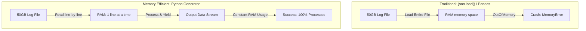

Khác biệt lớn nhất giữa vòng phỏng vấn lập trình (Live Coding) của Software Engineer (SWE) và Data Engineer (DE) nằm ở tính thực dụng của bài toán. 

Trong khi các lập trình viên SWE thường phải đối mặt với các thuật toán cấu trúc dữ liệu thuần túy và lắt léo (như các bài toán Leetcode Medium/Hard về quy hoạch động hay đồ thị), thì một kỹ sư dữ liệu DE lại được đánh giá dựa trên khả năng giải quyết các vấn đề thực chiến: xử lý các tệp dữ liệu khổng lồ mà không làm tràn bộ nhớ (Out of Memory - OOM), làm sạch và chuyển đổi các cấu trúc dữ liệu JSON phức tạp, hoặc tối ưu hóa việc thu thập dữ liệu từ các API phân trang.

---

## Trực quan hóa cơ chế đọc luồng dữ liệu (Streaming vs Memory Loading)

Sơ đồ dưới đây minh họa sự khác biệt trực quan về hiệu năng sử dụng bộ nhớ RAM giữa phương pháp tải toàn bộ tệp tin và phương pháp sử dụng Generator đọc từng dòng:



---

## Các dạng bài tập Python cốt lõi

### Dạng 1: Xử lý tệp tin kích thước siêu lớn (Large File Processing)
Sử dụng các hàm có sẵn như `json.load(file)`, `file.read()`, hoặc dùng thư viện Pandas qua lệnh `pandas.read_json()` sẽ cố gắng tải toàn bộ 50GB dữ liệu vào bộ nhớ RAM cùng một lúc, dẫn đến việc sập chương trình ngay lập tức vì lỗi tràn bộ nhớ (`MemoryError`).

Giải pháp tối ưu là đọc tệp tin theo từng dòng (Line-by-line) hoặc theo từng khối nhỏ (Chunking) một cách "lười biếng" (Lazy Evaluation). Đối tượng tệp tin (File Object) trong Python mặc định đã là một generator giúp chúng ta thực hiện việc này cực kỳ dễ dàng:
```python
import json
from collections import defaultdict

def process_large_log(file_path):
    error_counts = defaultdict(int)
    
    # Mở file và đọc từng dòng, file object trong Python vốn dĩ là một generator
    with open(file_path, 'r', encoding='utf-8') as f:
        for line in f:
            try:
                # Phân tích cú pháp (parse) JSON trên TỪNG dòng một
                data = json.loads(line.strip())
                
                if data.get('level') == 'ERROR':
                    user_id = data.get('user_id', 'unknown')
                    error_counts[user_id] += 1
            except json.JSONDecodeError:
                # Luôn có bước handle dữ liệu lỗi trong phỏng vấn DE
                continue 
                
    return dict(error_counts)
```

### Dạng 2: Tối ưu bộ nhớ lười với Generators (yield)
Generators giúp tạo ra dữ liệu trên đường chạy (on-the-fly) thay vì lưu giữ toàn bộ danh sách kết quả trong bộ nhớ.
```python
import requests

def fetch_all_users_from_api(base_url):
    page = 1
    has_more = True
    
    while has_more:
        # Giả lập gọi API có phân trang
        response = requests.get(f"{base_url}/users?page={page}")
        data = response.json()
        
        records = data.get("records", [])
        if not records:
            has_more = False
            break
            
        # Trả về từng bản ghi một bằng YIELD
        for record in records:
            yield record
            
        page += 1

# Cách tiêu thụ bộ nhớ lười (Lazy consumption)
# user_stream = fetch_all_users_from_api("https://api.example.com")
# for user in user_stream:
#     write_to_db(user)
```

### Dạng 3: Tận dụng Hash Maps & Sets để tối ưu thuật toán
Việc tối ưu độ phức tạp thuật toán thời gian về mức $O(1)$ thay vì sử dụng vòng lặp lồng nhau $O(N^2)$ là cực kỳ quan trọng đối với các tập dữ liệu lớn:
```python
def find_common_emails(sales_emails, support_emails):
    # Chuyển List thành Set (tốn thêm RAM nhưng truy xuất O(1))
    sales_set = set(sales_emails)
    
    common = []
    for email in support_emails:
        if email in sales_set: # Thao tác này mất O(1) thời gian
            common.append(email)
            
    return common
```

### Dạng 4: Làm phẳng cấu trúc JSON phức tạp (Data Flattening)
Trước khi nạp dữ liệu lồng nhau vào kho dữ liệu quan hệ, Data Engineer cần phải làm phẳng nó ra thành cấu trúc bảng phẳng (dạng cột và dòng) bằng đệ quy:
```python
def flatten_dict(d, parent_key='', sep='_'):
    items = []
    for k, v in d.items():
        new_key = f"{parent_key}{sep}{k}" if parent_key else k
        
        if isinstance(v, dict):
            items.extend(flatten_dict(v, new_key, sep=sep).items())
        else:
            items.append((new_key, v))
            
    return dict(items)
```

---

## Điểm mạnh và điểm yếu

Khi thiết kế logic xử lý dữ liệu bằng Python ad-hoc, chúng ta thường phải lựa chọn giữa việc sử dụng **Generators (Lazy Evaluation)** và **Lists/Pandas DataFrames (Eager Evaluation)**:

### Phương pháp Đọc lười (Generators - `yield`)
* **Điểm mạnh (Pros)**: Cực kỳ tiết kiệm bộ nhớ RAM (độ phức tạp bộ nhớ là $O(1)$), xử lý được tệp tin có dung lượng vô hạn, khởi chạy nhanh vì không cần đợi load hết file.
* **Điểm yếu (Cons)**: Dữ liệu chỉ được duyệt qua một lần duy nhất, không thể truy cập ngẫu nhiên theo chỉ mục (`generator[5]`), và khó thực hiện các thao tác đảo ngược hay sắp xếp toàn cục.

### Phương pháp Đọc sớm (Lists / DataFrames)
* **Điểm mạnh (Pros)**: Thao tác dữ liệu linh hoạt (truy cập index, sắp xếp, lọc trùng lặp, tính toán thống kê ma trận rất nhanh).
* **Điểm yếu (Cons)**: Tiêu thụ tài nguyên bộ nhớ rất lớn (dễ sập lỗi `MemoryError` khi kích thước file vượt quá RAM hệ thống).

---

## Khi nào nên dùng

* **Nên dùng Generators**: Khi xây dựng các bước nạp dữ liệu thô (Data Ingestion), đọc log file dạng dòng, gọi API phân trang hoặc các tác vụ streaming nhẹ nhàng.
* **Nên dùng Lists / Pandas**: Chỉ dùng khi kích thước dữ liệu được khống chế chắc chắn nhỏ hơn dung lượng RAM cho phép, hoặc khi cần thực hiện các phép toán phức tạp (như tính toán ma trận, học máy) yêu cầu dữ liệu nằm sẵn trong bộ nhớ.
* **Nên dùng ThreadPoolExecutor**: Thích hợp cho các tác vụ nghẽn băng thông mạng hoặc I/O (Network-bound) như gọi đồng thời nhiều REST API, tải file từ S3.
* **Nên dùng ProcessPoolExecutor**: Thích hợp cho các tác vụ nghẽn CPU (CPU-bound) như giải nén file ZIP khổng lồ, tính toán toán học phức tạp, nhằm vượt qua rào cản của cơ chế khóa luồng toàn cục Python GIL (Global Interpreter Lock).

---

## Trọng tâm ôn luyện phỏng vấn

Dưới đây là 3 tình huống phỏng vấn lập trình Python thực chiến yêu cầu viết mã nguồn tối ưu và xử lý lỗi:

### Tình huống 1: Tránh lỗi tràn RAM khi đọc file CSV/JSON khổng lồ ad-hoc
**Câu hỏi**: *"Chương trình Python xử lý tệp tin log 100GB của chúng tôi liên tục sập do lỗi MemoryError hàng đêm. Hệ thống chạy chương trình chỉ có cấu hình tối đa 8GB RAM. Hãy viết một hàm Python để đếm số lượng bản ghi có trạng thái 'SUCCESS' mà không gây tràn bộ nhớ, và giải thích tại sao giải pháp của bạn lại hoạt động an toàn."*

**Trả lời (Khung STAR)**:
* **Situation**: Script cũ sử dụng `json.load()` để đọc file log 100GB và sập RAM ngay lập tức do máy chủ chỉ có 8GB RAM.
* **Task**: Refactor chương trình sử dụng cơ chế đọc luồng (Streaming) để đưa độ phức tạp bộ nhớ về mức hằng số $O(1)$.
* **Action**:
```python
import json

def count_success_records(file_path: str) -> int:
    success_count = 0
    # open() trả về một file object hoạt động như một Generator dòng
    with open(file_path, 'r', encoding='utf-8') as file:
        for line in file:
            try:
                # Phân tích cú pháp từng dòng độc lập
                record = json.loads(line.strip())
                if record.get('status') == 'SUCCESS':
                    success_count += 1
            except json.JSONDecodeError:
                # Bỏ qua các dòng bị lỗi cú pháp để đảm bảo pipeline không bị gián đoạn
                continue
    return success_count
```
* **Result**: Chương trình xử lý trọn vẹn tệp tin 100GB chỉ tiêu tốn chưa đầy 15MB RAM cố định, thời gian chạy hoàn thành ổn định mà không lo bị ngắt quãng bởi hệ điều hành.

### Tình huống 2: Thiết kế luồng gọi API đa luồng có kiểm soát tần suất (Rate Limiting)
**Câu hỏi**: *"Chúng tôi cần tải dữ liệu từ 10,000 endpoint REST API. Nếu chạy tuần tự trong vòng lặp thông thường sẽ mất 3 tiếng. Nhưng nếu dùng ThreadPoolExecutor với 100 workers, hệ thống API nguồn sẽ lập tức khóa IP của chúng ta do vi phạm giới hạn tần suất (Error 429 Too Many Requests). Bạn sẽ thiết kế giải pháp như thế nào bằng Python để tải nhanh nhất nhưng không bị khóa?"*

**Trả lời (Khung STAR)**:
* **Situation**: Cần gọi 10,000 API nhanh nhưng bị giới hạn tần suất (Rate Limit) ở API nguồn, gây ra các lỗi HTTP 429.
* **Task**: Lập trình một cơ chế giới hạn tốc độ (Rate Limiting / Throttling) kết hợp đa luồng.
* **Action**:
```python
import concurrent.futures
import time
import requests
from queue import Queue

def worker_task(url: str, rate_limit_interval: float) -> dict:
    # Giả lập ngủ một khoảng thời gian nhỏ để đảm bảo tần suất gọi API
    time.sleep(rate_limit_interval)
    try:
        response = requests.get(url, timeout=5)
        if response.status_code == 200:
            return response.json()
        elif response.status_code == 429:
            # Nếu gặp 429, ngủ lâu hơn (Exponential Backoff) và chạy lại
            time.sleep(2)
            return requests.get(url, timeout=5).json()
    except Exception as e:
        return {"url": url, "error": str(e)}

def download_with_throttling(urls: list[str], max_workers: int = 10) -> list[dict]:
    results = []
    # Khoảng cách tối thiểu giữa các request của mỗi luồng để tránh spam
    interval = 0.1 
    with concurrent.futures.ThreadPoolExecutor(max_workers=max_workers) as executor:
        # Submit các task chạy đồng thời có giãn cách
        future_to_url = {executor.submit(worker_task, url, interval): url for url in urls}
        for future in concurrent.futures.as_completed(future_to_url):
            try:
                data = future.result()
                results.append(data)
            except Exception as e:
                results.append({"error": str(e)})
    return results
```
* **Result**: Rút ngắn thời gian thu thập dữ liệu từ 3 tiếng xuống còn dưới 10 phút mà hoàn toàn tránh được lỗi HTTP 429 nhờ sự kết hợp hài hòa giữa ThreadPool và cơ chế Throttling.

### Tình huống 3: Làm phẳng dữ liệu JSON động có hiện tượng Schema Drift
**Câu hỏi**: *"Nguồn dữ liệu MongoDB của chúng tôi trả về các bản ghi JSON lồng nhau phức tạp. Hơn nữa, cấu trúc của nó thay đổi liên tục (Schema Drift) — một số bản ghi bị khuyết trường, một số trường khác thay đổi kiểu dữ liệu từ chuỗi sang từ điển. Hãy viết một hàm Python làm phẳng cấu trúc này một cách an toàn để ghi vào bảng SQL."*

**Trả lời (Khung STAR)**:
* **Situation**: Dữ liệu JSON bị lồng nhau nhiều cấp và có cấu trúc không đồng nhất giữa các bản ghi (Schema Drift).
* **Task**: Viết một thuật toán đệ quy làm phẳng dữ liệu động một cách phòng thủ (Defensive Programming).
* **Action**:
```python
def robust_flatten(data: dict, parent_key: str = '', sep: str = '_') -> dict:
    items = []
    if not isinstance(data, dict):
        return {}
        
    for key, value in data.items():
        new_key = f"{parent_key}{sep}{key}" if parent_key else key
        
        if isinstance(value, dict):
            # Nếu là từ điển lồng nhau, gọi đệ quy tiếp
            items.extend(robust_flatten(value, new_key, sep=sep).items())
        elif isinstance(value, list):
            # Nếu gặp mảng (List), ta chuyển đổi nó thành dạng chuỗi JSON 
            # để tránh làm sập đệ quy và giữ nguyên thông tin
            items.append((new_key, str(value)))
        else:
            # Xử lý các giá trị nguyên thủy thông thường
            items.append((new_key, value))
            
    return dict(items)
```
* **Result**: Hàm đệ quy làm phẳng chính xác mọi bản ghi bất kể độ lồng nhau và tự động xử lý an toàn các kiểu dữ liệu phức tạp dạng mảng mà không gây lỗi dừng pipeline.

---

## English Summary

Python interviews for Data Engineers shift focus away from hard algorithmic puzzles (like dynamic programming) towards practical data handling scenarios. Key interview patterns include processing massive files without running out of memory (Out of Memory errors) by reading files lazily line-by-line or using [chunking](/concepts/6-ai-ml/genai-ml/chunking/). Candidates must master the use of `yield` and Generators to create memory-efficient data streams, especially when handling paginated APIs. Additionally, writing recursive functions to flatten deeply nested JSON dictionaries into tabular formats, utilizing Hash Maps (Sets) for $O(1)$ fast [deduplication](/concepts/3-integration/etl-elt/deduplication/), and demonstrating basic I/O concurrency using `ThreadPoolExecutor` are fundamental skills expected in top-tier technical interviews.

---

## Xem thêm các khái niệm liên quan

* [Deduplication (Khử trùng lặp)](../concepts/3-integration/etl-elt/deduplication/) - Tối ưu hóa khử trùng lặp dữ liệu lớn.
* [Ingestion Patterns](../concepts/3-integration/etl-elt/data-ingestion/) - Các mô hình nạp dữ liệu phổ biến.
* [System Design Foundations](../concepts/1-foundations/system-architecture/data-platform-architecture/) - Nguyên lý thiết kế hệ thống dữ liệu.

---

## Tài liệu tham khảo

1. [Python functional programming - Generators documentation](https://docs.python.org/3/howto/functional.html)
2. [Python Concurrent Programming using Futures](https://docs.python.org/3/library/concurrent.futures.html)
3. [AWS Lambda - Optimizing Python runtime memory usage](https://docs.aws.amazon.com/lambda/latest/dg/lambda-python.html)
4. [Google Cloud Functions - Memory Allocation and Performance Guide](https://cloud.google.com/functions/docs/configuring/memory)
5. [Databricks Developer Guide - High Performance Python on Spark](https://docs.databricks.com/developer/index.html)
