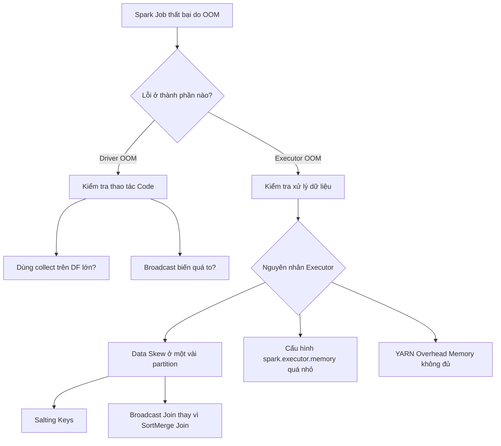

[Apache Spark](/concepts/3-integration/batch-processing/apache-spark/) từ lâu đã là công cụ xử lý dữ liệu lớn (Big Data) tiêu chuẩn của ngành dữ liệu. Tuy nhiên, việc vận hành Spark trên các cụm máy chủ phân tán chưa bao giờ là dễ dàng. Phân tán dữ liệu mang lại sức mạnh tính toán khổng lồ nhưng cũng đi kèm với vô vàn lỗi phát sinh phức tạp (như lệch dữ liệu, nghẽn mạng I/O) mà việc chạy code trên một máy chủ đơn lẻ không bao giờ gặp phải.

Vòng phỏng vấn **Tối ưu hóa Spark (Spark Optimization)** là nơi nhà tuyển dụng lọc ra những kỹ sư thực thụ — những người không chỉ biết viết code Spark chạy được mà còn biết cách làm cho hệ thống chạy hiệu quả, tiết kiệm chi phí đám mây và luôn hoàn thành đúng thời hạn cam kết (SLA).

---

## Bản chất của vòng phỏng vấn tối ưu hóa Spark

Trong buổi phỏng vấn, bạn sẽ không được hỏi những câu lý thuyết suông kiểu học thuộc lòng. Người phỏng vấn sẽ đặt bạn vào các tình huống thực tế đầy thử thách:
* Job Spark đang chạy bỗng dưng bị sập do lỗi tràn bộ nhớ (OOM - Out of Memory).
* Job chạy quá chậm và hóa đơn tiền điện toán đám mây (AWS/GCP) tăng vọt một cách bất thường.
* Bạn sẽ sử dụng công cụ Spark UI như thế nào để phát hiện ra điểm nghẽn (bottleneck) của hệ thống?

Bạn cần chứng minh kỹ năng chẩn đoán nguyên nhân gốc rễ (Root Cause Analysis) và đưa ra các đề xuất tinh chỉnh cấu hình phân cụm hoặc cấu trúc lại mã nguồn một cách thuyết phục.

---

## Bốn trụ cột tối ưu hóa Spark

Để hoàn thành tốt vòng phỏng vấn này, bạn cần hiểu rõ kiến trúc bên dưới của Spark và nắm vững 4 trụ cột tối ưu hóa sau:

* **Quản lý bộ nhớ (Memory Management)**: Hiểu rõ cơ chế phân bổ tài nguyên bộ nhớ đệm giữa Execution Memory (cho tính toán JOIN, Aggregate) và Storage Memory (cho Caching dữ liệu), từ đó cấu hình bộ nhớ cho các Executor một cách tối ưu.
* **Tối ưu hóa quá trình xáo trộn dữ liệu ([Shuffle](/concepts/3-integration/batch-processing/shuffle/) Optimization)**: Hạn chế tối đa việc di chuyển dữ liệu qua mạng giữa các máy chủ (Network I/O) khi thực hiện các phép toán nặng như `JOIN` hay `groupBy`. Đây là thao tác ngốn tài nguyên nhất trong tính toán phân tán.
* **Xử lý lệch dữ liệu ([Data Skew](/concepts/3-integration/batch-processing/data-skew/))**: Phát hiện và phân phối lại khối lượng dữ liệu khi một vài task phải gánh lượng dữ liệu quá lớn và mất nhiều thời gian xử lý, trong khi các task khác đã hoàn thành và ngồi chơi.
* **Định dạng file và Tuần tự hóa (Serialization)**: Lựa chọn định dạng lưu trữ hướng cột hiệu quả (như Parquet, ORC) kết hợp với các bộ tuần tự hóa tốc độ cao (như Kryo serializer) để tối ưu hóa tốc độ đọc ghi đĩa.

---

## Sơ đồ chẩn đoán và khắc phục lỗi tràn bộ nhớ (OOM) trong Spark

Dưới đây là sơ đồ tư duy giúp bạn chẩn đoán nhanh nguyên nhân gây lỗi OOM và cách xử lý tương ứng:

---

## Tình huống thực tế: 99% task chạy cực nhanh, 1% task bị treo hàng giờ

**Đề bài từ người phỏng vấn**: *"Hệ thống của bạn có một phép JOIN giữa hai bảng dữ liệu cực kỳ lớn. Khi chạy thực tế, 99% số lượng Task hoàn thành rất nhanh trong vòng 1 phút, nhưng 1% số Task còn lại bị treo chạy mất 2 giờ rồi báo lỗi sập hệ thống. Bạn sẽ giải quyết thế nào?"*

**Phân tích & Hướng xử lý**:
* **Chẩn đoán**: Triệu chứng *"99% chạy nhanh, 1% bị treo"* là biểu hiện kinh điển của hiện tượng **Data Skew** (Lệch dữ liệu). Nguyên nhân là do khóa kết hợp (Join Key) phân bố không đều trong thực tế (ví dụ: giá trị NULL quá nhiều hoặc một vài ID có lượng giao dịch vượt trội), dẫn đến một số ít Executor phải xử lý lượng dữ liệu khổng lồ trong khi các máy khác hoàn thành sớm và rảnh rỗi.
* **Giải pháp 1: Kỹ thuật Salting (Thêm muối)**:
  * Tôi sẽ thêm một số ngẫu nhiên (gọi là salt) vào khóa Join của bảng bị lệch dữ liệu để phân tán các bản ghi trùng khóa ra các phân vùng (partition) khác nhau.
  * Nhân bản dữ liệu tương ứng của bảng nhỏ hơn với tất cả các giá trị salt để đảm bảo phép JOIN vẫn khớp.
  * Thực hiện phép JOIN dựa trên khóa đã được thêm salt này.
* **Giải pháp 2: Kích hoạt Adaptive Query Execution (AQE)**:
  Từ phiên bản Spark 3.0 trở đi, tôi sẽ kích hoạt cấu hình `spark.sql.adaptive.skewJoin.enabled = true`. Cơ chế AQE của Spark sẽ tự động phát hiện các partition bị lệch kích thước trong quá trình chạy (runtime) và tự động chia nhỏ chúng ra để phân bổ cho nhiều Executor xử lý song song.

---

## Điểm mạnh và điểm yếu

Khi tối ưu hóa Spark, việc lựa chọn cấu hình hệ thống so với việc refactor logic code luôn có những sự đánh đổi về tài nguyên và công sức:

### Tinh chỉnh cấu hình hệ thống (Tuning Parameters)
* **Điểm mạnh (Pros)**: Rất dễ thực hiện, chỉ cần thay đổi cấu hình khởi tạo (ví dụ: tăng RAM, số core, hoặc kích hoạt AQE) mà không cần chạm vào mã nguồn cũ.
* **Điểm yếu (Cons)**: Chỉ giải quyết được vấn đề tạm thời. Nếu dữ liệu tiếp tục tăng trưởng gấp 10 lần, hệ thống sẽ tiếp tục quá tải nếu bản chất thuật toán và phân phối khóa vẫn bị lỗi.

### Tái cấu trúc mã nguồn (Refactoring Spark Code)
* **Điểm mạnh (Pros)**: Giải quyết triệt để điểm nghẽn hiệu năng từ gốc rễ (như loại bỏ UDF, thay thế phép Join nặng bằng Broadcast).
* **Điểm yếu (Cons)**: Tốn thời gian phát triển, đòi hỏi quy trình kiểm thử kỹ lưỡng để tránh làm phát sinh lỗi logic mới, làm tăng độ phức tạp và bảo trì của dự án.

---

## Khi nào nên dùng

* **Nên dùng Tinh chỉnh cấu hình**: Là bước sơ cứu đầu tiên khi hệ thống gặp sự cố gấp trên Production (Sev-1) cần khôi phục ngay để kịp SLA doanh nghiệp.
* **Nên dùng Tái cấu trúc code**: Cần thực hiện định kỳ trong các sprint cải tiến kỹ thuật (Tech Debt refactoring) cho các pipeline cốt lõi, hoặc khi việc tăng tài nguyên phần cứng không còn giúp cải thiện hiệu năng (đạt ngưỡng nghẽn I/O).

---

## Trọng tâm ôn luyện phỏng vấn

Dưới đây là 3 tình huống phỏng vấn thực tế giả định kiểm tra khả năng chẩn đoán và xử lý sự cố tối ưu hóa Spark:

### Tình huống 1: Khắc phục lỗi sập Driver khi triển khai Spark trên Kubernetes
**Câu hỏi**: *"Hệ thống Spark streaming chạy trên cụm Kubernetes của chúng tôi hoạt động ổn định trong môi trường Dev, nhưng khi lên Production, cứ mỗi khi đường truyền mạng giữa edge node (máy nộp job) và cụm Kubernetes bị gián đoạn là job lập tức bị sập. Giải thích nguyên nhân và đề xuất phương án khắc phục."*

**Trả lời (Khung STAR)**:
* **Situation**: Job Spark streaming bị sập liên tục khi mạng kết nối chập chờn giữa máy Client và cụm K8s.
* **Task**: Xác định sự ảnh hưởng của chế độ chạy Spark (`client` vs `cluster` mode) và tái cấu hình hệ thống để đạt tính sẵn sàng cao.
* **Action**:
  1. *Chẩn đoán*: Qua phân tích cấu hình nộp job (`spark-submit`), tôi thấy dự án đang sử dụng `--deploy-mode client`. Ở chế độ này, Driver program chạy trực tiếp trên máy nộp job (edge node). Do đó, nếu kết nối mạng giữa edge node và Kubernetes broker bị đứt, Driver sẽ mất liên lạc với các Executor phân tán và làm sập toàn bộ job.
  2. *Giải pháp*: Tôi refactor lệnh deploy sang `--deploy-mode cluster`. Lúc này, Driver sẽ được đóng gói và khởi chạy như một Pod nằm bên trong cụm Kubernetes. Mạng kết nối từ máy client bên ngoài có thể đứt, nhưng Driver vẫn chạy an toàn bên trong cụm và giao tiếp ổn định với các Executor.
* **Result**: Job Spark streaming duy trì hoạt động liên tục 24/7 kể cả khi máy trạm của kỹ sư bị tắt hoặc mất mạng, tăng độ ổn định của hệ thống lên 99.9%.

### Tình huống 2: Tối ưu hóa phép JOIN cồng kềnh gây nghẽn băng thông mạng
**Câu hỏi**: *"Một job chạy đêm thực hiện JOIN một bảng log giao dịch kích thước 1TB với bảng thông tin đối tác kinh doanh kích thước 5GB. Job này đang mất tới 4 tiếng để hoàn thành và Spark UI báo lượng Shuffle Read/Write cực lớn. Bạn sẽ tối ưu hóa thế nào?"*

**Trả lời (Khung STAR)**:
* **Situation**: Phép JOIN hai bảng 1TB và 5GB chạy rất chậm do nghẽn mạng I/O trong bước Shuffle của Sort-Merge Join mặc định.
* **Task**: Loại bỏ quá trình Shuffle và tăng tốc độ xử lý câu lệnh SQL.
* **Action**:
  1. *Phân tích*: Mặc định Spark sử dụng Sort-Merge Join. Cả hai bảng đều phải chịu quá trình xáo trộn dữ liệu qua mạng (Shuffle) để đưa các bản ghi có cùng khóa về chung một executor. Việc di chuyển 1TB dữ liệu qua mạng cực kỳ đắt đỏ.
  2. *Tối ưu hóa*: Bảng đối tác (5GB) tuy lớn hơn giới hạn mặc định của Broadcast Join (`spark.sql.autoBroadcastJoinThreshold = 10MB`), nhưng vẫn đủ nhỏ để chứa trong bộ nhớ RAM của một Executor node (hạ tầng của chúng tôi cấu hình 32GB RAM/Executor). Tôi sẽ nâng tham số cấu hình tự động broadcast hoặc gọi trực tiếp hàm gợi ý: `large_df.join(broadcast(partner_df), "partner_id")`.
  3. Kích hoạt bộ tuần tự hóa Kryo (`spark.serializer = org.apache.spark.serializer.KryoSerializer`) để nén dữ liệu truyền đi nhanh hơn.
* **Result**: Quá trình Shuffle bị loại bỏ hoàn toàn. Bảng 5GB được sao chép sẵn xuống RAM của tất cả Executor, thời gian chạy job giảm từ 4 tiếng xuống còn 25 phút.

### Tình huống 3: Cứu cụm Spark chung bị sập do lỗi Driver OOM
**Câu hỏi**: *"Một lập trình viên phân tích dữ liệu chạy câu lệnh `.collect()` trên một DataFrame chứa 500GB dữ liệu để tính toán thống kê, làm sập hoàn toàn Driver và gây ảnh hưởng đến tất cả các job khác đang chạy chung cụm. Bạn phản ứng và thiết lập cơ chế phòng ngừa thế nào?"*

**Trả lời (Quy trình Triage-Mitigate-Communicate-RCA)**:
* **Triage**: Nhận cảnh báo cụm chung (Shared Cluster) không phản hồi. Xác nhận Pod chứa Driver bị kill bởi hệ thống do hết bộ nhớ (OOM). Xác định nguyên nhân trực tiếp từ file log: câu lệnh `DataFrame.collect()` được gọi trên biến `large_user_events`.
* **Mitigate**: Tạm thời cô lập và khởi động lại cụm quản trị (Cluster Manager), thiết lập hàng đợi tài nguyên riêng (Resource Queue / YARN queues) để cô lập tài nguyên cho các job phân tích ad-hoc, tránh để một job sập làm ảnh hưởng đến các job production cốt lõi.
* **Communicate**: Thông báo cho đội phân tích dữ liệu về sự cố, nhắc nhở không chạy lệnh collect dữ liệu lớn trực tiếp trên Driver, và hướng dẫn họ sử dụng các lệnh ghi file hoặc lấy mẫu dữ liệu.
* **RCA & Prevention**:
  1. *Nguyên nhân*: Hàm `.collect()` kéo toàn bộ dữ liệu phân tán từ các Executor về một Driver node duy nhất. Driver chỉ cấu hình 8GB RAM nên bị tràn bộ nhớ ngay lập tức khi phải chứa 500GB dữ liệu.
  2. *Phòng ngừa kỹ thuật*: Tôi cấu hình tham số `spark.sql.driver.maxResultSize = 2g` để giới hạn kích thước tối đa mà Driver được phép nhận từ các Executor. Nếu vượt quá 2GB, job sẽ tự động bị ngắt và báo lỗi an toàn thay vì làm sập Driver.
  3. Hướng dẫn đội phân tích thay thế `.collect()` bằng `.take(100)` hoặc ghi kết quả xuống S3 dạng Parquet rồi đọc bằng Athena.
* **Result**: Cụm máy chủ chung hoạt động ổn định, không còn hiện tượng một job phân tích phá hỏng toàn bộ cụm của công ty.

---

## English Summary

The Spark Optimization Interview focuses on assessing a Data Engineer's ability to troubleshoot and tune Apache Spark applications. Key areas include diagnosing Out of Memory (OOM) errors on both the Driver and Executors, resolving Data Skew through techniques like Salting or Adaptive Query Execution (AQE), and minimizing network I/O by optimizing Shuffles (e.g., preferring Broadcast Hash Joins over Sort-Merge Joins). Mastery of Spark's internal architecture—such as Catalyst Optimizer, memory management, and physical planning—is required to pass these technical rounds and write scalable, cost-effective data pipelines in production.

---

## Xem thêm các khái niệm liên quan

* [Apache Spark Distributed Compute](../concepts/3-integration/batch-processing/apache-spark/) - Kiến trúc cốt lõi của Spark.
* [Shuffle Optimization](../concepts/3-integration/batch-processing/shuffle/) - Cơ chế truyền dữ liệu qua mạng trong Spark.
* [Data Skew (Lệch dữ liệu)](../concepts/3-integration/batch-processing/data-skew/) - Phát hiện và xử lý lệch dữ liệu phân tán.

---

## Tài liệu tham khảo

1. [Apache Spark Official Performance Tuning Guide](https://spark.apache.org/docs/latest/tuning.html)
2. [Databricks Blog - Adaptive Query Execution in Action](https://www.databricks.com/blog/2020/05/29/adaptive-query-execution-speeding-up-spark-sql-at-runtime.html)
3. [AWS EMR Spark Cluster Optimization Best Practices](https://docs.aws.amazon.com/emr/latest/ReleaseGuide/emr-spark-performance.html)
4. [Google Cloud Dataproc - Spark Performance Tuning Guidelines](https://cloud.google.com/dataproc/docs/concepts/configuring-clusters/spark-tuning)
5. [Microsoft Azure HDInsight Apache Spark Optimization](https://azure.microsoft.com/en-us/blog/)
