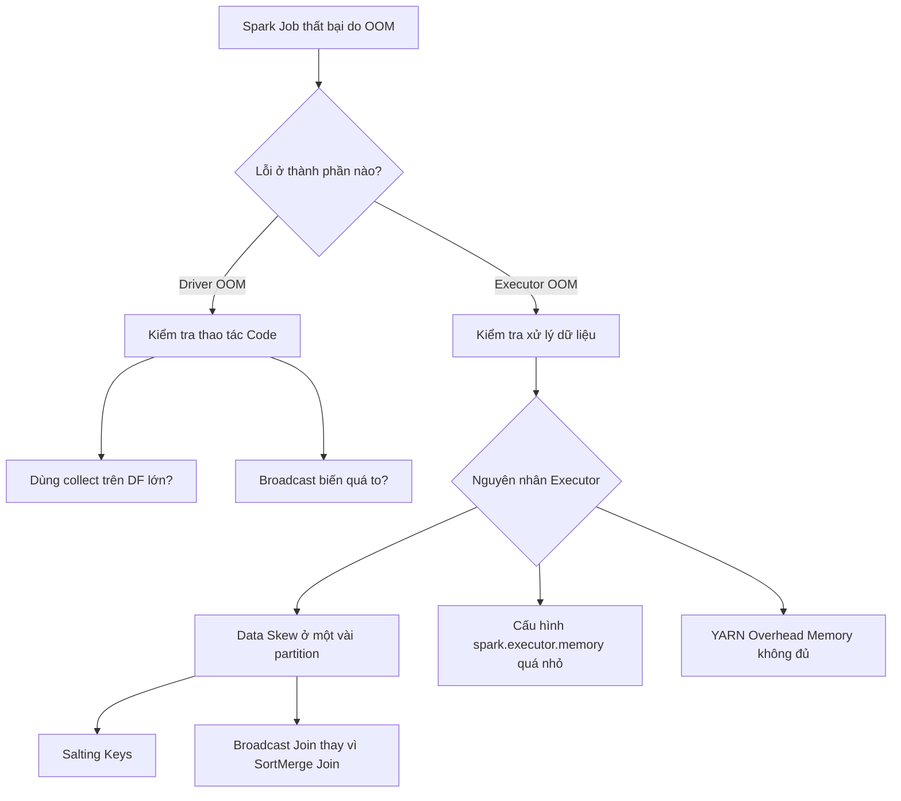

[Apache Spark](/concepts/4-compute-engines-batch/apache-spark) từ lâu đã là công cụ xử lý dữ liệu lớn (Big Data) tiêu chuẩn của ngành dữ liệu. Tuy nhiên, việc vận hành Spark trên các cụm máy chủ phân tán chưa bao giờ là dễ dàng. Phân tán dữ liệu mang lại sức mạnh tính toán khổng lồ nhưng cũng đi kèm với vô vàn lỗi phát sinh phức tạp (như lệch dữ liệu, nghẽn mạng I/O) mà việc chạy code trên một máy chủ đơn lẻ không bao giờ gặp phải.

Vòng phỏng vấn **Tối ưu hóa Spark (Spark Optimization)** là nơi nhà tuyển dụng lọc ra những kỹ sư thực thụ — những người không chỉ biết viết code Spark chạy được mà còn biết cách làm cho hệ thống chạy hiệu quả, tiết kiệm chi phí đám mây và luôn hoàn thành đúng thời hạn cam kết (SLA).

---

## Bản chất của vòng phỏng vấn tối ưu hóa Spark

Trong buổi phỏng vấn, bạn sẽ không được hỏi những câu lý thuyết suông kiểu học thuộc lòng. Người phỏng vấn sẽ đặt bạn vào các tình huống thực tế đầy thử thách:
* Job Spark đang chạy bỗng dưng bị sập do lỗi tràn bộ nhớ (OOM - Out of Memory).
* Job chạy quá chậm và hóa đơn tiền điện toán đám mây (AWS/GCP) tăng vọt một cách bất thường.
* Bạn sẽ sử dụng công cụ Spark UI như thế nào để phát hiện ra điểm nghẽn (bottleneck) của hệ thống?

Bạn cần chứng minh kỹ năng chẩn đoán nguyên nhân gốc rễ (Root Cause Analysis) và đưa ra các đề xuất tinh chỉnh cấu hình phân cụm hoặc cấu trúc lại mã nguồn một cách thuyết phục.

---

## Bốn trụ cột tối ưu hóa Spark

Để hoàn thành tốt vòng phỏng vấn này, bạn cần hiểu rõ kiến trúc bên dưới của Spark và nắm vững 4 trụ cột tối ưu hóa sau:

* **Quản lý bộ nhớ (Memory Management)**: Hiểu rõ cơ chế phân bổ tài nguyên bộ nhớ đệm giữa Execution Memory (cho tính toán JOIN, Aggregate) và Storage Memory (cho Caching dữ liệu), từ đó cấu hình bộ nhớ cho các Executor một cách tối ưu.
* **Tối ưu hóa quá trình xáo trộn dữ liệu ([Shuffle](/concepts/4-compute-engines-batch/shuffle) Optimization)**: Hạn chế tối đa việc di chuyển dữ liệu qua mạng giữa các máy chủ (Network I/O) khi thực hiện các phép toán nặng như `JOIN` hay `groupBy`. Đây là thao tác ngốn tài nguyên nhất trong tính toán phân tán.
* **Xử lý lệch dữ liệu ([Data Skew](/concepts/4-compute-engines-batch/data-skew))**: Phát hiện và phân phối lại khối lượng dữ liệu khi một vài task phải gánh lượng dữ liệu quá lớn và mất nhiều thời gian xử lý, trong khi các task khác đã hoàn thành và ngồi chơi.
* **Định dạng file và Tuần tự hóa (Serialization)**: Lựa chọn định dạng lưu trữ hướng cột hiệu quả (như Parquet, ORC) kết hợp với các bộ tuần tự hóa tốc độ cao (như Kryo serializer) để tối ưu hóa tốc độ đọc ghi đĩa.

---

## Bộ khung 4 bước giải quyết sự cố hiệu năng Spark

Khi đối mặt với một câu hỏi tối ưu hóa hiệu năng, hãy áp dụng quy trình trả lời mạch lạc theo các bước sau để ghi điểm tuyệt đối:

1. **Làm rõ vấn đề (Clarify)**: Đặt câu hỏi ngược lại để xác định quy mô dữ liệu, cấu hình chi tiết của cụm máy chủ hiện tại và định dạng file đầu vào.
2. **Xác định điểm nghẽn (Identify Bottleneck)**: Đưa ra các giả thuyết chẩn đoán lỗi (do nghẽn mạng I/O, do CPU quá tải hay do bộ nhớ). Nhấn mạnh việc sử dụng Spark UI để kiểm tra cấu trúc đồ thị DAG, thời gian chạy của từng Stage và Task.
3. **Đề xuất giải pháp (Propose Solutions)**: Đi từ các giải pháp dễ thực hiện trước (thay đổi tham số cấu hình hệ thống) cho đến các giải pháp phức tạp hơn (sửa lại logic code, thiết kế lại cấu trúc bảng dữ liệu).
4. **Đánh giá và Đánh đổi (Evaluate & Trade-offs)**: Thẳng thắn chỉ ra những điểm hạn chế của giải pháp đề xuất (ví dụ: áp dụng Broadcast Join giúp chạy rất nhanh nhưng có nguy cơ gây lỗi OOM trên Driver node).

---

## Sơ đồ chẩn đoán và khắc phục lỗi tràn bộ nhớ (OOM) trong Spark

Dưới đây là sơ đồ tư duy giúp bạn chẩn đoán nhanh nguyên nhân gây lỗi OOM và cách xử lý tương ứng:

---

## Tình huống thực tế: 99% task chạy cực nhanh, 1% task bị treo hàng giờ

**Đề bài từ người phỏng vấn**: *"Hệ thống của bạn có một phép JOIN giữa hai bảng dữ liệu cực kỳ lớn. Khi chạy thực tế, 99% số lượng Task hoàn thành rất nhanh trong vòng 1 phút, nhưng 1% số Task còn lại bị treo chạy mất 2 giờ rồi báo lỗi sập hệ thống. Bạn sẽ giải quyết thế nào?"*

**Phân tích & Hướng xử lý**:

* **Chẩn đoán**: Triệu chứng *"99% chạy nhanh, 1% bị treo"* là biểu hiện kinh điển của hiện tượng **Data Skew** (Lệch dữ liệu). Nguyên nhân là do khóa kết hợp (Join Key) phân bố không đều trong thực tế (ví dụ: giá trị NULL quá nhiều hoặc một vài ID có lượng giao dịch vượt trội), dẫn đến một số ít Executor phải xử lý lượng dữ liệu khổng lồ trong khi các máy khác hoàn thành sớm và rảnh rỗi.
* **Giải pháp 1: Kỹ thuật Salting (Thêm muối)**:
  * Tôi sẽ thêm một số ngẫu nhiên (gọi là salt) vào khóa Join của bảng bị lệch dữ liệu để phân tán các bản ghi trùng khóa ra các phân vùng (partition) khác nhau.
  * Nhân bản dữ liệu tương ứng của bảng nhỏ hơn với tất cả các giá trị salt để đảm bảo phép JOIN vẫn khớp.
  * Thực hiện phép JOIN dựa trên khóa đã được thêm salt này.
* **Giải pháp 2: Kích hoạt Adaptive Query Execution (AQE)**:
  Từ phiên bản Spark 3.0 trở đi, tôi sẽ kích hoạt cấu hình `spark.sql.adaptive.skewJoin.enabled = true`. Cơ chế AQE của Spark sẽ tự động phát hiện các partition bị lệch kích thước trong quá trình chạy (runtime) và tự động chia nhỏ chúng ra để phân bổ cho nhiều Executor xử lý song song.

---

## Những nguyên tắc vàng và Best Practices

* **Lọc dữ liệu càng sớm càng tốt (Filter Early, Filter Often)**: Luôn gọi các hàm `where()` hoặc `filter()` ngay khi có thể (áp dụng Predicate Pushdown) trước khi thực hiện các phép toán tốn kém như JOIN hay Window Functions để giảm lượng dữ liệu cần xử lý.
* **Ưu tiên Broadcast Hash Join**: Nếu một trong hai bảng có kích thước đủ nhỏ (thường cấu hình dưới 10MB đến vài GB tùy cấu hình RAM), hãy sử dụng hàm `broadcast()` để gửi bảng nhỏ đó tới toàn bộ các Executor. Việc này giúp loại bỏ hoàn toàn quá trình Shuffle (xáo trộn dữ liệu qua mạng) cực kỳ đắt đỏ của phép Sort-Merge Join mặc định.
* **Sử dụng định dạng file lưu trữ hướng cột**: Luôn ưu tiên ghi dữ liệu xuống các định dạng Parquet hoặc ORC kết hợp nén Snappy. Chúng giúp giảm đáng kể tài nguyên đọc đĩa nhờ các tính năng Partition Discovery và Column Pruning (chỉ đọc những cột cần thiết).
* **Phân biệt Repartition và Coalesce**: 
  * Sử dụng `coalesce()` khi bạn muốn giảm số lượng partition (vì nó chỉ gộp các partition nằm gần nhau, không gây ra Shuffle dữ liệu qua mạng).
  * Chỉ sử dụng `repartition()` khi bạn muốn tăng số lượng partition hoặc muốn phân bổ lại dữ liệu thật đều giữa các node (thao tác này bắt buộc phải Shuffle dữ liệu).

---

## Các sai lầm kinh điển dễ làm sập cụm Spark

* **Lạm dụng và quên giải phóng cache (`unpersist`)**: Việc lạm dụng cache dữ liệu rác không cần thiết sẽ chiếm dụng bộ nhớ Storage Memory, ép hệ thống phải ghi dữ liệu tạm thời ra đĩa cứng (Disk Spill) khi cần thêm Execution Memory, làm chậm hệ thống đáng kể.
* **Sử dụng các hàm tự định nghĩa (UDFs - User Defined Functions) bừa bãi**: Viết các hàm UDF bằng Python hoặc Scala khiến Spark không thể tối ưu hóa câu lệnh thông qua Catalyst Optimizer, đồng thời gây ra chi phí rất lớn cho việc tuần tự hóa dữ liệu (đặc biệt là đối với PySpark khi phải chuyển dữ liệu qua lại giữa JVM và Python process). Hãy ưu tiên sử dụng các hàm có sẵn (built-in functions) của Spark SQL.
* **Gọi hàm đếm `.count()` vô tội vạ**: Việc gọi hàm `.count()` nhiều lần trong code sẽ kích hoạt các Action thực tế, bắt Spark phải chạy lại từ đầu toàn bộ đồ thị DAG để tính toán nếu dữ liệu trước đó chưa được cache lại.

---

## Những sự đánh đổi (Trade-offs) cần cân nhắc

### Giảm chi phí vs Độ phức tạp của mã nguồn
* Việc tối ưu hóa sâu (như áp dụng kỹ thuật Salting) giúp bạn tiết kiệm từ 40% đến 70% chi phí hóa đơn Cloud hàng tháng và đảm bảo pipeline chạy ổn định.
* Tuy nhiên, nó lại khiến mã nguồn trở nên phức tạp, khó đọc và khó bảo trì hơn cho những lập trình viên tiếp quản sau này.

### Thời gian nghiên cứu tối ưu hóa
* Việc tìm ra cấu hình tài nguyên tối ưu cho cụm máy chủ (số lượng core, lượng RAM cho mỗi Executor, số lượng partition) thường đòi hỏi rất nhiều thời gian thử nghiệm và chạy thử (trial-and-error). Vì vậy, hãy tránh việc tối ưu hóa quá sớm (premature optimization) khi hệ thống chưa thực sự gặp vấn đề về hiệu năng.

---

## Bộ câu hỏi phỏng vấn thực tế và Cách trả lời ghi điểm

### 1. Sự khác biệt giữa `client` mode và `cluster` mode trong Spark là gì?
* **Gợi ý trả lời**: 
  Sự khác biệt cốt lõi nằm ở vị trí khởi chạy chương trình Driver (Driver Program):
  * Trong **Client mode**: Driver sẽ chạy trực tiếp trên máy nộp job (ví dụ: máy tính cá nhân của bạn hoặc edge node của công ty). Nếu bạn tắt terminal hoặc máy tính bị mất mạng, job sẽ lập tức bị sập. Chế độ này phù hợp cho việc debug lỗi hoặc chạy tương tác.
  * Trong **Cluster mode**: Driver sẽ được quản lý và khởi chạy trên một node ngẫu nhiên nằm bên trong cụm máy chủ do các Cluster Manager (như YARN, Kubernetes) chỉ định. Chế độ này là bắt buộc cho môi trường Production vì nó có khả năng chịu lỗi cao (nếu node chứa Driver bị sập, hệ thống sẽ tự động khởi động lại Driver trên node khác).

### 2. Hãy giải thích cơ chế hoạt động của Catalyst Optimizer trong Spark SQL.
* **Gợi ý trả lời**: Catalyst Optimizer là bộ tối ưu hóa truy vấn lõi của Spark, giúp chuyển đổi các câu lệnh SQL hoặc DataFrame thành các tác vụ RDD tối ưu vật lý qua 4 giai đoạn chính:
  1. **Phân tích cú pháp (Analysis)**: Đối chiếu cấu trúc bảng và kiểu dữ liệu với Catalog để chuyển đổi cây truy vấn chưa được phân tích (Unresolved Logical Plan) thành Logical Plan hợp lệ.
  2. **Tối ưu hóa logic (Logical Optimization)**: Áp dụng các quy tắc tối ưu hóa logic như dịch chuyển bộ lọc lên trước (Predicate Pushdown) hay tính toán sẵn các hằng số (Constant Folding).
  3. **Lập kế hoạch vật lý (Physical Planning)**: Tạo ra nhiều kế hoạch thực thi vật lý (Physical Plans) khác nhau và sử dụng mô hình chi phí (Cost-Based Optimizer) để lựa chọn kế hoạch tối ưu nhất.
  4. **Sinh mã nguồn (Code Generation)**: Sử dụng dự án Project Tungsten để biên dịch kế hoạch vật lý thành mã bytecode chạy trực tiếp trên máy ảo Java (JVM) để tối đa hóa tốc độ CPU.

### 3. Điều gì sẽ xảy ra nếu bạn gọi câu lệnh `.collect()` trên một DataFrame có kích thước dữ liệu lên tới 100GB?
* **Gợi ý trả lời**: 
  Hàm `.collect()` sẽ bắt buộc toàn bộ dữ liệu 100GB từ tất cả các Executor phân tán phải truyền qua mạng và gom về node Driver. 
  Vì Driver node thường được cấu hình bộ nhớ RAM nhỏ (ví dụ 4GB - 8GB), việc phải chứa 100GB dữ liệu sẽ lập tức gây ra lỗi tràn bộ nhớ (Out of Memory - OOM) và làm sập toàn bộ ứng dụng Spark ngay lập tức. 
  Để tránh lỗi này, tôi sẽ thay thế bằng các hàm ghi dữ liệu trực tiếp xuống đĩa (như `.write.save()`) hoặc chỉ lấy một tập dữ liệu nhỏ làm mẫu bằng hàm `.take(n)` hoặc `.limit(n).collect()`.

---

## Sách hay và tài liệu tham khảo chuyên sâu

1. **Spark: The Definitive Guide** - Bill Chambers, Matei Zaharia (Cuốn sách toàn diện nhất về Spark do chính cha đẻ của Spark đồng tác giả).
2. **Learning Spark, 2nd Edition** - Jules S. Damji, Brooke Wenig.
3. **Databricks Blog** - Nguồn tài nguyên tuyệt vời để cập nhật các tính năng tối ưu hóa mới nhất của Spark (như Adaptive Query Execution).

---

## English Summary

The Spark Optimization Interview focuses on assessing a Data Engineer's ability to troubleshoot and tune Apache Spark applications. Key areas include diagnosing Out of Memory (OOM) errors on both the Driver and Executors, resolving Data Skew through techniques like Salting or Adaptive Query Execution (AQE), and minimizing network I/O by optimizing Shuffles (e.g., preferring Broadcast Hash Joins over Sort-Merge Joins). Mastery of Spark's internal architecture—such as Catalyst Optimizer, memory management, and physical planning—is required to pass these technical rounds and write scalable, cost-effective data pipelines in production.

## Tài Liệu Tham Khảo
* **Fundamentals of Data Engineering - Joe Reis & Matt Housley**
* [Designing Data-Intensive Applications - Martin Kleppmann](https://dataintensive.net/)
* [The Pragmatic Engineer - Gergely Orosz](https://blog.pragmaticengineer.com/)
* **Data Engineering at Scale: Netflix Tech Blog**
* **Building Data Infrastructure at Airbnb**
