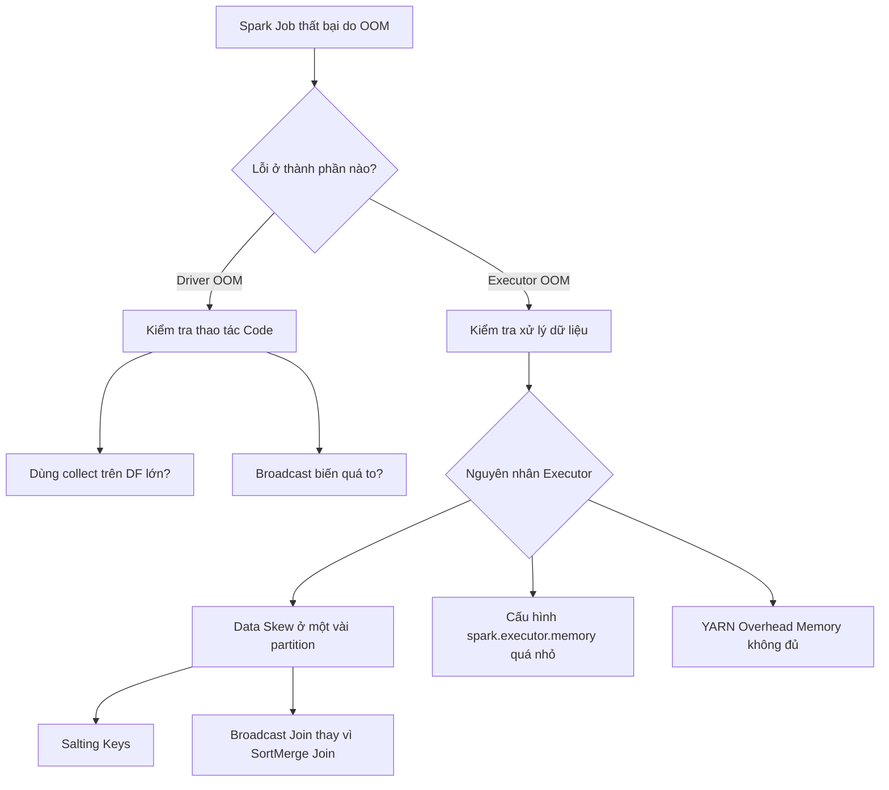

# Tối ưu hóa Spark (Phỏng vấn) - Spark Optimization Interview

## Summary

**Spark Optimization Interview** là một vòng phỏng vấn kỹ thuật cốt lõi dành cho các vị trí Data Engineer (đặc biệt từ cấp độ Mid đến Senior). Vòng này tập trung đánh giá tư duy chẩn đoán lỗi (troubleshooting), khả năng tinh chỉnh cấu hình phân cụm (cluster tuning) và kỹ năng giải quyết các nút thắt hiệu năng (bottlenecks) thực tế như lệch dữ liệu (Data Skew), cạn kiệt bộ nhớ (OOM - Out of Memory) và quá tải quá trình xáo trộn dữ liệu (Shuffle) trong Apache Spark.

---

## Definition

Trong ngữ cảnh phỏng vấn, **Spark Optimization** không chỉ là việc thuộc lòng các cấu hình, mà là khả năng hệ thống hóa quy trình tìm và diệt lỗi của một Spark Application. Người phỏng vấn sẽ đưa ra các kịch bản (scenarios) hệ thống bị chậm, sập (crash) hoặc tốn quá nhiều chi phí hạ tầng, yêu cầu ứng viên phải đưa ra các chẩn đoán nguyên nhân gốc rễ (Root Cause Analysis - RCA) và đề xuất các kỹ thuật tối ưu hóa mã nguồn (code-level) hoặc tối hình hạ tầng (infrastructure-level).

---

## Why it exists

Vòng phỏng vấn này tồn tại để lọc các ứng viên "chỉ biết viết code chạy được" với các ứng viên "biết viết code chạy hiệu quả trên quy mô lớn". 
1. **Chi phí đám mây (Cloud Cost)**: Một Spark Job không được tối ưu có thể tốn hàng ngàn USD tiền tài nguyên tính toán lãng phí.
2. **SLA (Service Level Agreement)**: Các data pipeline chậm trễ sẽ làm ảnh hưởng đến báo cáo kinh doanh của toàn bộ công ty.
3. **Sự phức tạp của tính toán phân tán**: Phân tán dữ liệu mang lại sức mạnh nhưng cũng tạo ra các vấn đề phức tạp (như Data Skew, Network I/O) mà dữ liệu trên một máy đơn (single-node) không gặp phải.

---

## Core idea

Nguyên lý cốt lõi để vượt qua vòng phỏng vấn này dựa trên việc nắm vững kiến trúc bên trong của Spark và 4 trụ cột tối ưu hóa:
* **Memory Management (Quản lý bộ nhớ)**: Phân bổ tài nguyên giữa Execution Memory và Storage Memory một cách hợp lý. Xử lý rò rỉ bộ nhớ hoặc cấu hình Executor sai.
* **Shuffle Optimization (Tối ưu xáo trộn dữ liệu)**: Hạn chế tối đa việc di chuyển dữ liệu qua mạng giữa các node (network I/O) trong các phép toán `join` hoặc `groupBy`.
* **Data Skew Handling (Xử lý lệch dữ liệu)**: Nhận biết và phân phối lại khối lượng công việc khi một số lượng nhỏ Task mất quá nhiều thời gian để hoàn thành so với phần còn lại.
* **Serialization & File Formats (Định dạng và tuần tự hóa)**: Lựa chọn đúng định dạng file (Parquet, ORC) và công cụ tuần tự hóa (Kryo) để tối ưu I/O đọc/ghi.

---

## How it works

Khi đối mặt với một câu hỏi tối ưu Spark, quy trình trả lời chuẩn MECE (Mutually Exclusive, Collectively Exhaustive) gồm 4 bước:
1. **Clarify (Làm rõ vấn đề)**: Đặt câu hỏi ngược lại cho người phỏng vấn về lượng dữ liệu, cấu hình cluster hiện tại, và định dạng dữ liệu đầu vào.
2. **Identify Bottleneck (Xác định nút thắt)**: Đưa ra các giả thuyết về nguyên nhân gây chậm (do I/O, do CPU, hay do Memory). Nhấn mạnh việc sử dụng Spark UI để kiểm tra DAG, Stage, và Task duration.
3. **Propose Solutions (Đề xuất giải pháp)**: Bắt đầu từ giải pháp dễ triển khai nhất (thay đổi cấu hình) đến giải pháp phức tạp (viết lại code, thiết kế lại dữ liệu).
4. **Evaluate (Đánh giá)**: Trình bày các điểm trade-offs của giải pháp (ví dụ: dùng Broadcast Join thì nhanh nhưng rủi ro OOM trên Driver).

---

## Architecture / Flow

Sơ đồ tư duy tiếp cận giải quyết sự cố Spark Job bị sập do OOM (Out of Memory):

---

## Practical example

**Tình huống phỏng vấn**: "Job của bạn có một phép `JOIN` giữa hai bảng cực lớn. 99% các Task hoàn thành trong 1 phút, nhưng 1% Task còn lại chạy mất 2 giờ rồi văng lỗi. Bạn giải quyết thế nào?"

**Phân tích & Xử lý**:
1. **Chẩn đoán**: Triệu chứng "99% chạy nhanh, 1% treo" là dấu hiệu kinh điển của **Data Skew** (Lệch dữ liệu). Các khóa (key) dùng để JOIN phân bố không đồng đều, dẫn đến một vài Executor phải gánh lượng dữ liệu khổng lồ.
2. **Giải pháp 1 (Salting Kỹ thuật)**:
   * Thêm một số ngẫu nhiên (salt) vào các key bị lệch ở bảng lớn để phân tán chúng ra nhiều partition.
   * Nhân bản (replicate) dữ liệu ở bảng nhỏ với tất cả các giá trị salt.
   * JOIN lại dựa trên key đã được salt.
3. **Giải pháp 2 (Adaptive Query Execution - AQE)**: Kể từ Spark 3.0, bật cấu hình `spark.sql.adaptive.skewJoin.enabled = true` để Spark tự động phát hiện và chia nhỏ các partition bị lệch trong quá trình runtime.

---

## Best practices

* **Filter Early, Filter Often**: Luôn áp dụng `where()` hoặc `filter()` càng sớm càng tốt (Predicate Pushdown) trước khi thực hiện các phép biến đổi nặng như JOIN hoặc Window Functions.
* **Ưu tiên Broadcast Hash Join**: Nếu một bảng đủ nhỏ (dưới 10MB - 8GB tùy cấu hình), hãy dùng `broadcast()` để gửi nó tới tất cả Executors, tránh hoàn toàn quá trình Shuffle tốn kém của Sort-Merge Join.
* **Sử dụng Parquet/ORC**: Các định dạng Columnar kết hợp với Snappy compression giúp giảm thiểu I/O đọc ổ đĩa nhờ cơ chế Partition Discovery và Column Pruning.
* **Repartition vs Coalesce**: Sử dụng `coalesce()` khi muốn giảm số lượng partitions (không gây shuffle), và chỉ dùng `repartition()` khi muốn tăng partition hoặc phân bổ lại dữ liệu đồng đều (chấp nhận shuffle).

---

## Common mistakes

* **Quên unpersist()**: Lưu đệm (cache) dữ liệu rác không cần thiết dẫn đến chiếm dụng Storage Memory, đẩy Execution Memory xuống ổ cứng (Disk Spill).
* **Lạm dụng UDFs (User Defined Functions)**: Viết UDF bằng Python/Scala thay vì dùng built-in functions, làm Spark không thể tối ưu hóa qua Catalyst Optimizer và gây ra chi phí tuần tự hóa lớn (đặc biệt với PySpark).
* **Đếm số lượng records vô tội vạ**: Gọi `.count()` nhiều lần trong mã nguồn thực chất là đang kích hoạt một loạt các Action, bắt Spark tính toán lại từ đầu DAG nếu dữ liệu chưa được cache.

---

## Trade-offs

### Ưu điểm của việc tối ưu sâu
* Giảm chi phí hạ tầng rõ rệt (có thể từ 40% - 70%).
* Đảm bảo hệ thống chạy ổn định 24/7 không bị OOM ngay cả khi dữ liệu tăng đột biến.

### Nhược điểm / Đánh đổi
* **Độ phức tạp của Code**: Sử dụng các kỹ thuật như Salting làm code trở nên khó đọc và khó bảo trì hơn.
* **Thời gian R&D**: Tìm ra cấu hình cluster tối ưu (số lượng cores, memory, partitions) đôi khi đòi hỏi nhiều ngày thử nghiệm (trial-and-error).

---

## When to use

* Các kiến thức tối ưu này là bắt buộc trong mọi buổi phỏng vấn Data Engineer cấp độ Mid/Senior.
* Trong công việc hàng ngày khi một Spark job bắt đầu vi phạm SLA hoặc bị phàn nàn về chi phí tài nguyên AWS/GCP.

## When not to use

* Không nên áp dụng tối ưu hóa vội vàng (Premature optimization) trên các hệ thống hoặc luồng dữ liệu nhỏ giọt mà hiệu năng chưa phải là vấn đề cấp bách.

---

## Related concepts

* [Data Skew](/concepts/data-skew)
* Distributed Computing
* Adaptive Query Execution (AQE)
* Broadcast Join

---

## Interview questions

### 1. Sự khác biệt giữa `client` mode và `cluster` mode trong Spark là gì?
* **Người phỏng vấn muốn kiểm tra**: Kiến thức nền tảng về kiến trúc phân tán của Spark.
* **Gợi ý trả lời**: Trong `client` mode, Driver program chạy trên máy tính nộp job (thường là máy cá nhân hoặc edge node). Nếu tắt máy, job sẽ sập. Phù hợp cho debug/interactive. Trong `cluster` mode, Driver được quản lý bởi Cluster Manager (YARN, K8s) trên một node trong cụm. Phù hợp cho production vì có khả năng chịu lỗi (tự khởi động lại khi node chết).

### 2. Giải thích cơ chế Catalyst Optimizer trong Spark SQL.
* **Người phỏng vấn muốn kiểm tra**: Hiểu biết sâu bên dưới tầng vật lý của Spark.
* **Gợi ý trả lời**: Catalyst Optimizer chuyển đổi truy vấn SQL/DataFrame thành các tác vụ RDD tối ưu thông qua 4 pha: 
  1. Phân tích ngữ nghĩa (Unresolved Logical Plan -> Logical Plan).
  2. Tối ưu hóa logic (Logical Plan -> Optimized Logical Plan) thông qua Predicate Pushdown, Constant Folding.
  3. Lập kế hoạch vật lý (Tạo ra nhiều Physical Plans và chọn plan có chi phí thấp nhất - CBO).
  4. Sinh mã (Code Generation - Project Tungsten) để chạy trực tiếp trên JVM.

### 3. Điều gì xảy ra khi bạn gọi action `collect()` trên một DataFrame có 100GB dữ liệu?
* **Người phỏng vấn muốn kiểm tra**: Ý thức phòng tránh các lỗi cơ bản gây sập hệ thống (OOM).
* **Gợi ý trả lời**: Lệnh `collect()` sẽ kéo toàn bộ 100GB dữ liệu từ tất cả các Executors về node đang chạy Driver. Vì Driver memory thường được cấu hình nhỏ (ví dụ 4GB - 8GB), nó sẽ lập tức bị Out of Memory (OOM) và crash toàn bộ ứng dụng. 

---

## References

1. **Spark: The Definitive Guide** - Bill Chambers, Matei Zaharia.
2. **Learning Spark, 2nd Edition** - Jules S. Damji, Brooke Wenig.
3. **Databricks Blog** - "Adaptive Query Execution in Spark 3.0".

---

## English summary

The Spark Optimization Interview focuses on assessing a Data Engineer's ability to troubleshoot and tune Apache Spark applications. Key areas include diagnosing Out of Memory (OOM) errors on both the Driver and Executors, resolving Data Skew through techniques like Salting or Adaptive Query Execution (AQE), and minimizing network I/O by optimizing Shuffles (e.g., preferring Broadcast Hash Joins over Sort-Merge Joins). Mastery of Spark's internal architecture—such as Catalyst Optimizer, memory management, and physical planning—is required to pass these technical rounds and write scalable, cost-effective data pipelines in production.
