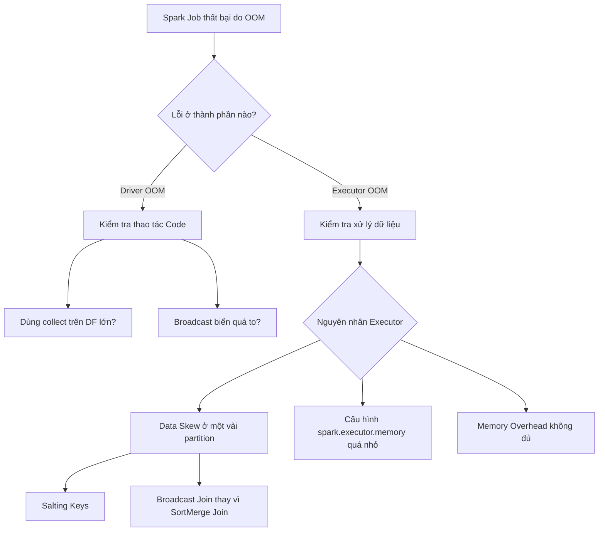

Vòng phỏng vấn tối ưu [Apache Spark](/concepts/4-compute-engines-batch/apache-spark) hiếm khi hỏi lý thuyết trực diện. Đề bài thường là một sự cố: job đang chạy ổn bỗng sập vì tràn bộ nhớ (OOM), job chậm dần và hóa đơn cloud tăng theo, hoặc kịch bản kinh điển "99% task xong trong một phút, 1% treo hai tiếng". Người phỏng vấn muốn xem bạn chẩn đoán thế nào, mở Spark UI nhìn vào đâu, và đề xuất sửa với đầy đủ ý thức về cái giá của từng phương án.

Điều đó có nghĩa là học thuộc danh sách config không đủ. Bạn cần hiểu tại sao mỗi vấn đề xảy ra ở tầng kiến trúc — vì lời giải thích "tại sao" mới là thứ được chấm điểm.

---

## Bốn khu vực kiến thức mà mọi câu hỏi đều quy về

**Quản lý bộ nhớ.** Bộ nhớ executor trong Spark chia sẻ giữa execution memory (cho JOIN, aggregation, sort) và storage memory (cho cache) theo mô hình unified memory. Cache quá tay thì execution thiếu chỗ, dữ liệu tràn ra đĩa (spill) và job chậm hẳn — hiểu mối quan hệ này giải thích được phần lớn câu hỏi về OOM và spill.

**[Shuffle](/concepts/4-compute-engines-batch/shuffle).** Mọi phép toán "wide" (`join`, `groupBy`, `repartition`) buộc dữ liệu di chuyển qua mạng giữa các node — thao tác đắt nhất trong tính toán phân tán vì nó ghi đĩa, truyền mạng, rồi đọc đĩa lần nữa. Tối ưu Spark, ở mức khái quát nhất, là nghệ thuật né hoặc thu nhỏ shuffle.

**[Data Skew](/concepts/4-compute-engines-batch/data-skew).** Dữ liệu thật không phân bố đều: một vài key (khách hàng lớn, giá trị NULL) chiếm phần áp đảo. Task xử lý key đó gánh gần hết dữ liệu trong khi các task khác ngồi chơi — thời gian chạy của cả stage bằng thời gian của task chậm nhất.

**Định dạng file và serialization.** Định dạng cột (Parquet, ORC) cho phép chỉ đọc cột cần thiết (column pruning) và bỏ qua khối dữ liệu không liên quan (predicate pushdown). Kryo serializer nhanh và gọn hơn Java serialization mặc định khi làm việc với RDD.

---

## Khung 4 bước trả lời một câu hỏi hiệu năng

1. **Làm rõ bối cảnh**: dữ liệu bao lớn, cluster cấu hình gì, định dạng file đầu vào là gì. Câu trả lời tối ưu cho bảng 10GB khác hẳn bảng 10TB.
2. **Định vị điểm nghẽn bằng chứng cứ**: nói rõ bạn sẽ mở Spark UI, nhìn DAG, so thời gian và kích thước dữ liệu giữa các task trong cùng stage. "Tôi đoán là skew" yếu hơn nhiều so với "tôi mở tab Stages, nếu max task duration lệch xa median thì là skew".
3. **Đề xuất theo thứ tự chi phí**: config trước (rẻ, đảo ngược được), sửa code sau, thiết kế lại bảng cuối cùng (đắt, ảnh hưởng downstream).
4. **Nêu trade-off của chính giải pháp mình vừa đề xuất**: broadcast join nhanh nhưng bảng broadcast phình to theo thời gian sẽ gây OOM; salting chữa skew nhưng làm code khó bảo trì. Tự nói ra nhược điểm trước khi bị hỏi là dấu hiệu của kỹ sư đã vận hành hệ thống thật.

---

## Sơ đồ chẩn đoán OOM

Câu hỏi đầu tiên luôn là: OOM ở driver hay executor? Hai hướng này có nguyên nhân và cách chữa hoàn toàn khác nhau, và stack trace sẽ cho biết ngay. Driver OOM gần như luôn do code kéo dữ liệu về một điểm (`collect()`, broadcast biến quá to). Executor OOM thường do skew, cấu hình bộ nhớ thiếu, hoặc memory overhead (phần bộ nhớ ngoài heap cho Python worker, buffer mạng) không đủ.

---

## Bài toán kinh điển: 99% task chạy nhanh, 1% treo hàng giờ

**Đề bài**: *"Một phép JOIN giữa hai bảng lớn: 99% task xong trong một phút, 1% còn lại chạy 2 giờ rồi sập. Bạn xử lý thế nào?"*

**Chẩn đoán.** Triệu chứng này gần như chắc chắn là data skew: join key phân bố không đều — hay gặp nhất là cột join có nhiều NULL, hoặc một vài ID (khách hàng lớn, sản phẩm hot) chiếm tỷ trọng áp đảo. Xác nhận bằng Spark UI: trong stage bị treo, so sánh shuffle read size của task chậm nhất với median. Hoặc nhanh hơn, `GROUP BY` join key đếm số dòng để tìm key nóng.

**Giải pháp 1 — bật AQE skew join.** Từ Spark 3.x, Adaptive Query Execution tự phát hiện partition lệch tại runtime và chẻ nhỏ chúng cho nhiều task xử lý song song — tài liệu chính thức của Spark mô tả đây là một trong ba tính năng chính của AQE, bật qua `spark.sql.adaptive.skewJoin.enabled` (AQE được bật mặc định từ Spark 3.2). Đây nên là phương án nêu trước vì gần như miễn phí.

**Giải pháp 2 — salting, khi AQE không đủ.** Thêm một số ngẫu nhiên (salt) vào join key của bảng bị lệch để rải các bản ghi cùng key ra nhiều partition; nhân bản dữ liệu tương ứng của bảng còn lại với đủ các giá trị salt để phép JOIN vẫn khớp; join trên key đã salt. Hiệu quả, nhưng code phức tạp lên rõ rệt và bảng nhỏ bị nhân bản N lần — nói rõ cái giá này.

**Giải pháp 3 — xử lý riêng NULL.** Nếu skew do NULL, tách nhánh: dòng có key NULL không cần join (kết quả là NULL), lọc ra xử lý riêng rồi union lại. Rẻ và sạch hơn salting khi nguyên nhân đúng là NULL.

Trình bày theo thứ tự này — chẩn đoán có chứng cứ, giải pháp rẻ trước, mỗi giải pháp kèm giá — là khung ăn điểm của toàn vòng phỏng vấn.

---

## Các nguyên tắc tối ưu đáng nói ra

**Lọc sớm.** Đặt `filter()`/`where()` trước các phép toán đắt để giảm dữ liệu vào shuffle. Với nguồn Parquet, Catalyst tự đẩy điều kiện lọc xuống tầng đọc file (predicate pushdown) — nhưng chỉ khi điều kiện đủ đơn giản; bọc cột trong UDF là mất pushdown.

**Broadcast join khi một bảng đủ nhỏ.** Gửi nguyên bảng nhỏ tới mọi executor để né toàn bộ shuffle của sort-merge join. Spark tự làm dưới ngưỡng `spark.sql.autoBroadcastJoinThreshold` (mặc định 10MB), hoặc ép bằng hint `broadcast()`. Rủi ro cần nêu kèm: bảng "nhỏ" hôm nay có thể lớn dần theo thời gian và một ngày đẹp trời gây OOM — broadcast ép tay cần được giám sát.

**Ưu tiên định dạng cột.** Parquet/ORC nén tốt và cho phép column pruning. Đi kèm là vấn đề small files: hàng nghìn file vài KB làm scheduler quá tải — hay được hỏi nối tiếp, và câu trả lời là gộp file bằng `coalesce`/`repartition` khi ghi, hoặc dùng tính năng compaction của table format (Delta, Iceberg).

**`repartition` vs `coalesce`.** `coalesce(n)` giảm số partition bằng cách gộp partition trên cùng executor, không shuffle — rẻ nhưng có thể tạo partition lệch kích thước. `repartition(n)` shuffle toàn bộ để phân bố lại đều — đắt nhưng cân. Tăng số partition thì chỉ có `repartition` làm được.

---

## Ba thói quen code làm chậm hoặc sập job

**Cache tràn lan, quên `unpersist`.** Cache thứ không dùng lại chiếm storage memory, ép execution memory tràn ra đĩa. Cache chỉ có lãi khi một DataFrame được dùng từ hai action trở lên.

**UDF khi built-in function làm được.** UDF là hộp đen với Catalyst Optimizer — không pushdown, không tối ưu được. Riêng PySpark UDF còn cộng thêm chi phí serialize dữ liệu qua lại giữa JVM và Python process cho từng dòng. Thứ tự ưu tiên: built-in function → pandas UDF (vectorized, dùng Arrow) → Python UDF thường là lựa chọn cuối.

**Gọi `.count()` để "kiểm tra" giữa chừng.** Mỗi action kích hoạt tính lại cả nhánh DAG phía trước nếu chưa cache. Vài dòng `.count()` debug bỏ quên trong code production có thể nhân đôi, nhân ba thời gian chạy của job.

---

## Trade-off tổng: tối ưu đến đâu thì dừng

Tối ưu sâu (salting, tinh chỉnh cấu hình từng job) có thể giảm đáng kể chi phí cloud và giữ SLA, nhưng đổi bằng mã nguồn khó đọc và chi phí bảo trì cho người tiếp quản. Ngược lại, quá trình dò cấu hình tối ưu (core/RAM mỗi executor, số partition) tốn nhiều vòng thử-sai. Nguyên tắc thực dụng đáng nói trong phỏng vấn: để AQE và giá trị mặc định làm việc của chúng, chỉ can thiệp thủ công khi có số liệu cho thấy vấn đề thật — tối ưu sớm khi chưa đo lường là tự mua độ phức tạp về không.

---

## Ba câu hỏi thực tế và cách trả lời

### 1. Khác biệt giữa client mode và cluster mode?

Khác biệt nằm ở nơi chạy driver. **Client mode**: driver chạy trên máy nộp job (laptop, edge node) — tắt terminal hay rớt mạng là job chết; phù hợp debug và chạy tương tác. **Cluster mode**: driver chạy trên một node trong cluster do YARN/Kubernetes chỉ định — là lựa chọn cho production vì driver được cluster manager giám sát và khởi động lại khi node chứa nó gặp sự cố.

### 2. Catalyst Optimizer hoạt động thế nào?

Catalyst biến câu SQL/DataFrame thành kế hoạch thực thi qua bốn giai đoạn: **analysis** (đối chiếu catalog, resolve tên bảng và kiểu dữ liệu thành logical plan hợp lệ), **logical optimization** (áp dụng rule như predicate pushdown, constant folding), **physical planning** (sinh nhiều physical plan, chọn theo mô hình chi phí — ví dụ chọn broadcast join thay sort-merge khi có thống kê kích thước), và **code generation** (Tungsten biên dịch plan thành JVM bytecode, gộp nhiều phép toán vào một hàm — whole-stage codegen). Điểm đáng nói thêm: từ Spark 3, AQE bổ sung khả năng *tối ưu lại tại runtime* dựa trên thống kê thực tế của shuffle — thứ Catalyst thuần rule/cost lúc compile-time không có.

### 3. Gọi `.collect()` trên DataFrame 100GB thì chuyện gì xảy ra?

Toàn bộ 100GB từ các executor truyền qua mạng dồn về driver. Driver thường chỉ có vài GB RAM nên OOM và ứng dụng sập gần như ngay lập tức. Thay thế: ghi thẳng xuống storage bằng `.write.save()` nếu cần kết quả đầy đủ, hoặc `.take(n)` / `.limit(n).collect()` nếu chỉ cần xem mẫu. Câu hỏi này kiểm tra bạn có hiểu ranh giới driver/executor không — mọi thứ đi qua `collect()` đều phải nằm vừa bộ nhớ driver.

---

## Tài liệu tham khảo

* [Apache Spark Documentation — Performance Tuning](https://spark.apache.org/docs/latest/sql-performance-tuning.html) — tài liệu chính thức về AQE, broadcast threshold, và các config hiệu năng.
* [Databricks Blog — Adaptive Query Execution: Speeding Up Spark SQL at Runtime](https://www.databricks.com/blog/2020/05/29/adaptive-query-execution-speeding-up-spark-sql-at-runtime.html) — giải thích ba cơ chế của AQE từ đội phát triển tính năng.
* [Apache Spark Documentation — Tuning Guide](https://spark.apache.org/docs/latest/tuning.html) — quản lý bộ nhớ, serialization và data locality.
* **Spark: The Definitive Guide — Bill Chambers & Matei Zaharia (O'Reilly)** — đồng tác giả là người tạo ra Spark; nền tảng kiến trúc đầy đủ nhất.
* **Learning Spark, 2nd Edition — Jules Damji và cộng sự (O'Reilly)** — cập nhật cho Spark 3.x, chương về tối ưu và Spark UI sát với nội dung phỏng vấn.
