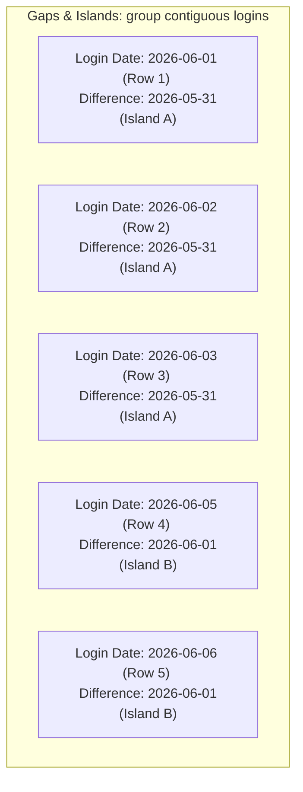

Trong các buổi phỏng vấn cho vị trí Data Engineer, Data Analyst hay Analytics Engineer, bài kiểm tra Live Coding SQL là một cửa ải bắt buộc và vô cùng quan trọng. 

Khi phỏng vấn các vị trí đòi hỏi chuyên môn cao, nhà tuyển dụng sẽ không đưa ra các câu hỏi truy vấn `SELECT` hay `JOIN` cơ bản. Họ sẽ tập trung vào các dạng bài toán (SQL Patterns) có độ phức tạp cao nhằm kiểm tra khả năng tư duy logic, kỹ năng phân tích chuỗi thời gian và tư duy tối ưu hóa hiệu năng câu lệnh của bạn. Để hiểu sâu hơn về cách thiết lập mô hình dữ liệu trước khi truy vấn, bạn có thể tham khảo thêm về [Mô hình hóa dữ liệu](../interview/data-modeling-interview/).

---

## Trực quan hóa cơ chế Gaps and Islands (Khoảng trống và Hòn đảo)

Sơ đồ dưới đây minh họa cách sử dụng phép toán hiệu số (`date - row_number`) để nhóm các ngày đăng nhập liên tiếp vào cùng một nhóm phân đoạn duy nhất (Island ID):



---

## Các dạng bài SQL cốt lõi

### Dạng 1: Hàm cửa sổ (Window Functions) - Vũ khí tối thượng
Hàm cửa sổ cho phép thực hiện các phép toán tổng hợp trên một nhóm các dòng liên quan đến dòng hiện tại, nhưng **không làm gộp dòng** lại như mệnh đề `GROUP BY`.

#### 1.1 Bài toán Tìm Top N phần tử đứng đầu mỗi nhóm (Top N per Group)
* **Yêu cầu**: Tìm 3 nhân viên có mức lương cao nhất trong *mỗi* phòng ban.
* **Tư duy**: Sử dụng hàm xếp hạng `DENSE_RANK()` (hoặc `ROW_NUMBER()`) kết hợp chia nhóm (`PARTITION BY`) theo phòng ban.
```sql
WITH RankedSalaries AS (
    SELECT 
        department_id,
        employee_name,
        salary,
        DENSE_RANK() OVER (PARTITION BY department_id ORDER BY salary DESC) as rank_salary
    FROM employees
)
SELECT department_id, employee_name, salary
FROM RankedSalaries
WHERE rank_salary <= 3;
```

#### 1.2 Bài toán So sánh với ngày hôm trước (Lag / Lead)
* **Yêu cầu**: Tìm những ngày có nhiệt độ (hoặc doanh thu) cao hơn ngày hôm trước.
```sql
WITH PrevDayData AS (
    SELECT 
        record_date,
        temperature,
        LAG(temperature, 1) OVER (ORDER BY record_date) as prev_temperature
    FROM weather
)
SELECT record_date
FROM PrevDayData
WHERE temperature > prev_temperature;
```

### Dạng 2: Biểu thức bảng tạm (CTEs) và Truy vấn đệ quy
Việc sử dụng biểu thức bảng tạm (Common Table Expressions - CTE) với từ khóa `WITH` giúp phân tách một bài toán SQL phức tạp thành các khối logic nhỏ gọn, rõ ràng.

#### 2.1 Truy vấn đệ quy (Recursive CTE) - Phân tích cấu trúc dạng cây
* **Yêu cầu**: Cho bảng nhân sự gồm hai cột `id` và `manager_id`. In ra sơ đồ tổ chức của toàn công ty.
```sql
WITH RECURSIVE OrgChart AS (
    -- Base case: Tìm CEO
    SELECT id, name, manager_id, 1 as level
    FROM employees
    WHERE manager_id IS NULL
    
    UNION ALL
    
    -- Recursive step: Tìm cấp dưới nối vào sếp
    SELECT e.id, e.name, e.manager_id, o.level + 1
    FROM employees e
    JOIN OrgChart o ON e.manager_id = o.id
)
SELECT * FROM OrgChart ORDER BY level;
```

### Dạng 3: Tự liên kết bảng (Self-Joins) cho bài toán tương tác
Thực hiện phép `JOIN` một bảng với chính nó để giải quyết các bài toán phân tích hành vi tương tác liên tiếp.

#### 3.1 Bài toán Phân tích tỷ lệ giữ chân khách hàng (Retention Rate)
* **Yêu cầu**: Cho bảng `user_logins(user_id, login_date)`. Tính tỷ lệ người dùng quay trở lại hệ thống vào ngày hôm sau (Day 1 Retention).
```sql
SELECT 
    L1.login_date,
    COUNT(DISTINCT L1.user_id) as total_users,
    COUNT(DISTINCT L2.user_id) as retained_users,
    ROUND(COUNT(DISTINCT L2.user_id) * 100.0 / COUNT(DISTINCT L1.user_id), 2) as retention_rate
FROM user_logins L1
LEFT JOIN user_logins L2 
    ON L1.user_id = L2.user_id 
    AND L2.login_date = L1.login_date + INTERVAL '1 day'
GROUP BY L1.login_date;
```

### Dạng 4: Khoảng trống và Hòn đảo (Gaps and Islands)
* **Yêu cầu**: Tìm chuỗi ngày đăng nhập liên tiếp dài nhất của từng người dùng.
```sql
WITH RankedLogins AS (
    SELECT DISTINCT user_id, login_date,
           ROW_NUMBER() OVER (PARTITION BY user_id ORDER BY login_date) as rn
    FROM user_logins
),
GroupedIslands AS (
    SELECT user_id, login_date,
           DATE_SUB(login_date, INTERVAL rn DAY) as island_id
    FROM RankedLogins
),
StreakLengths AS (
    SELECT user_id, island_id, COUNT(*) as streak_days
    FROM GroupedIslands
    GROUP BY user_id, island_id
)
SELECT user_id, MAX(streak_days) as max_streak
FROM StreakLengths
GROUP BY user_id;
```

### Dạng 5: Tổng lũy kế và Trung bình động (Rolling Aggregations)
#### 5.1 Tính toán Trung bình động 7 ngày (7-day Moving Average)
```sql
SELECT 
    date,
    daily_revenue,
    AVG(daily_revenue) OVER (
        ORDER BY date 
        ROWS BETWEEN 6 PRECEDING AND CURRENT ROW
    ) as moving_avg_7d
FROM daily_sales;
```

### Dạng 6: Kỹ thuật xoay bảng (Pivot / Unpivot)
#### 6.1 Xoay bảng (Pivot) thủ công không dùng hàm xây dựng sẵn
```sql
SELECT 
    month,
    SUM(CASE WHEN product_category = 'Electronics' THEN revenue ELSE 0 END) as electronics_rev,
    SUM(CASE WHEN product_category = 'Clothing' THEN revenue ELSE 0 END) as clothing_rev,
    SUM(CASE WHEN product_category = 'Books' THEN revenue ELSE 0 END) as books_rev
FROM sales
GROUP BY month;
```

---

## Điểm mạnh và điểm yếu

Khi xử lý các logic phức tạp trong SQL, việc so sánh hiệu năng và độ phức tạp giữa **Hàm cửa sổ (Window Functions)** và **Tự liên kết bảng truyền thống (Self-Joins)** là điều cần thiết:

### Sử dụng Hàm cửa sổ (Window Functions)
* **Điểm mạnh (Pros)**: Chạy rất nhanh do Query Engine tối ưu hóa việc quét dữ liệu qua một phân vùng (partition) mà không cần nhân đôi dữ liệu. Code rất gọn gàng và dễ đọc.
* **Điểm yếu (Cons)**: Cú pháp tương đối khó học đối với người mới bắt đầu, và một số cơ sở dữ liệu rất cũ không hỗ trợ đầy đủ các hàm phân tích cửa sổ.

### Sử dụng Tự liên kết (Self-Joins)
* **Điểm mạnh (Pros)**: Cú pháp SQL tiêu chuẩn tương thích với mọi phiên bản database cũ nhất. Trực quan về mặt logic kết hợp dòng dữ liệu.
* **Điểm yếu (Cons)**: Hiệu năng cực kỳ tệ trên bảng lớn vì database phải thực hiện phép so khớp chéo (Cross-join hoặc Nested Loop) giữa hai bảng có cùng kích thước, đẩy độ phức tạp thời gian lên $O(N^2)$ và gây tràn bộ nhớ.

---

## Khi nào nên dùng

* **Nên dùng Window Functions**: Cho mọi bài toán so sánh dòng trước dòng sau (`LAG/LEAD`), xếp thứ tự (`ROW_NUMBER/DENSE_RANK`) hoặc tính tổng lũy kế (`SUM OVER`) trên cơ sở dữ liệu dạng [Data Warehouse](/concepts/2-storage/data-warehouse/data-warehouse/) hiện đại để đảm bảo [Tối ưu hóa hiệu năng](../interview/performance-tuning-qa/).
* **Nên dùng Recursive CTE**: Chỉ dùng cho các bài toán duyệt dữ liệu có cấu trúc phân cấp cây không giới hạn cấp độ (như sơ đồ tổ chức sếp - nhân viên, cấu trúc danh mục sản phẩm lồng nhau).
* **Nên dùng Self-Joins**: Khi thực sự cần tìm kiếm các mối quan hệ tương tác chéo giữa các phần tử của cùng một bảng mà không thể biểu diễn bằng hàm cửa sổ (ví dụ: tìm các cặp nhân viên làm chung dự án).

---

## Trọng tâm ôn luyện phỏng vấn

Dưới đây là 3 tình huống phỏng vấn Live Coding SQL thực tế yêu cầu tư duy tối ưu hóa và logic phức tạp:

### Tình huống 1: Giải bài toán Gaps & Islands phát hiện gian lận giao dịch
**Câu hỏi**: *"Hệ thống đối soát của chúng tôi cần phát hiện các trường hợp khách hàng phát sinh chuỗi giao dịch liên tiếp trong 5 ngày trở lên để cảnh báo gian lận thẻ tín dụng. Viết câu lệnh SQL tìm danh sách các `user_id` vi phạm."*

**Trả lời (Khung STAR)**:
* **Situation**: Cần xác định chuỗi ngày giao dịch liên tiếp có độ dài lớn hơn hoặc bằng 5 từ bảng nhật ký giao dịch khổng lồ.
* **Task**: Áp dụng kỹ thuật Gaps and Islands để gom nhóm chuỗi ngày liên tiếp và lọc theo điều kiện độ dài.
* **Action**:
```sql
WITH UniqueUserLogins AS (
    -- Loại bỏ trường hợp phát sinh nhiều giao dịch trong cùng 1 ngày
    SELECT DISTINCT user_id, CAST(transaction_time AS DATE) as transaction_date
    FROM transactions
),
RankedLogins AS (
    -- Đánh số thứ tự tăng dần theo từng user
    SELECT user_id, transaction_date,
           ROW_NUMBER() OVER (PARTITION BY user_id ORDER BY transaction_date) as rn
    FROM UniqueUserLogins
),
GroupedIslands AS (
    -- Phép trừ ngày tạo ra ID hòn đảo (island_id) nhất quán cho chuỗi liên tục
    SELECT user_id, transaction_date,
           transaction_date - CAST(rn || ' day' AS INTERVAL) as island_id
    FROM RankedLogins
),
StreakCounts AS (
    -- Gom nhóm và đếm độ dài chuỗi ngày liên tiếp của từng hòn đảo
    SELECT user_id, island_id, COUNT(*) as consecutive_days
    FROM GroupedIslands
    GROUP BY user_id, island_id
)
SELECT DISTINCT user_id
FROM StreakCounts
WHERE consecutive_days >= 5;
```
* **Result**: Truy vấn chạy hiệu quả nhờ chỉ quét qua bảng giao dịch một lần duy nhất, trả về danh sách tài khoản cần khóa để kiểm tra chính xác.

### Tình huống 2: Duyệt đệ quy tính tổng ngân sách của toàn bộ sơ đồ phân cấp
**Câu hỏi**: *"Cho bảng `departments(id, parent_department_id, budget)`. Hãy viết một câu truy vấn SQL nhận vào ID của phòng ban gốc và tính tổng ngân sách của phòng ban đó cộng với ngân sách của toàn bộ các phòng ban con trực thuộc ở mọi cấp độ phía dưới."*

**Trả lời (Khung STAR)**:
* **Situation**: Ngân sách phòng ban được lưu trữ phân cấp cây, và cần tính tổng tích lũy từ gốc đến lá.
* **Task**: Lập trình đệ quy CTE để duyệt toàn bộ nhánh cây và tính tổng.
* **Action**:
```sql
WITH RECURSIVE SubDepartments AS (
    -- Điểm xuất phát (Base Case): Phòng ban gốc cần tính
    SELECT id, budget
    FROM departments
    WHERE id = :target_department_id
    
    UNION ALL
    
    -- Bước đệ quy (Recursive Step): Tìm phòng ban con có parent trỏ về danh sách hiện tại
    SELECT d.id, d.budget
    FROM departments d
    JOIN SubDepartments sd ON d.parent_department_id = sd.id
)
SELECT SUM(budget) as total_hierarchy_budget
FROM SubDepartments;
```
* **Result**: Phép đếm đệ quy hoàn thành chính xác ở mọi độ sâu của cây phòng ban mà không cần dùng đến các vòng lặp ngoài mã nguồn ứng dụng.

### Tình huống 3: Khử trùng lặp clickstream log bằng hàm cửa sổ
**Câu hỏi**: *"Hệ thống clickstream của chúng tôi ghi nhận trùng lặp dữ liệu do lỗi retry mạng từ phía điện thoại. Bảng log có cấu trúc `clicks(user_id, session_id, event_time, click_url)`. Hãy viết câu lệnh SQL lọc lấy bản ghi click đầu tiên của mỗi session. So sánh hiệu năng của giải pháp dùng Window Function với giải pháp dùng Self-Join."*

**Trả lời (Khung STAR)**:
* **Situation**: Cần loại bỏ bản ghi trùng lặp và giữ lại bản ghi có thời gian sớm nhất trong mỗi phiên của người dùng.
* **Task**: Viết câu lệnh tối ưu và phân tích Query Plan so sánh hai hướng tiếp cận.
* **Action (Viết truy vấn Window Function)**:
```sql
WITH OrderedClicks AS (
    SELECT user_id, session_id, event_time, click_url,
           ROW_NUMBER() OVER (PARTITION BY session_id ORDER BY event_time ASC) as rn
    FROM clicks
)
SELECT user_id, session_id, event_time, click_url
FROM OrderedClicks
WHERE rn = 1;
```
* *Phân tích hiệu năng*: 
  * Giải pháp **Window Function** chỉ cần 1 lần quét bảng (Table Scan) và thực hiện phân vùng trong bộ nhớ (Sort/Hash Partition), độ phức tạp thời gian là $O(N \log N)$.
  * Giải pháp **Self-Join** kết hợp `MIN(event_time)` yêu cầu 1 câu truy vấn con để group by tìm min time, sau đó JOIN lại với bảng gốc dựa trên `(session_id, event_time)`. Điều này bắt buộc hệ thống phải quét bảng 2 lần độc lập và join chéo, tốn gấp đôi tài nguyên I/O đọc đĩa và gây nguy cơ quá tải RAM khi bảng clickstream lên tới hàng tỷ dòng.
* **Result**: Giải pháp sử dụng Window Function được chọn và giúp tiết kiệm 50% thời gian xử lý của cụm Spark.

---

## English Summary

SQL interviews for Data roles heavily test a candidate's ability to manipulate data structures efficiently. Mastering specific patterns is crucial. The most important patterns include **Window Functions** (using `DENSE_RANK`, `LAG/LEAD` for Top-N and comparative analysis), **CTEs** (breaking down logic and using `RECURSIVE` for hierarchical data), **Self-Joins** (useful for retention and pairwise analytics), **Gaps and Islands** (solving consecutive sequence problems by subtracting row numbers from dates), and **Conditional Aggregation** (using `SUM(CASE WHEN...)` for pivoting). A strong candidate not only solves the logic but ensures the code is highly readable using CTEs and actively communicates edge-cases prior to coding.

---

## Xem thêm các khái niệm liên quan

* [Mô hình hóa dữ liệu](../interview/data-modeling-interview/) - Thiết kế lược đồ bảng tối ưu trong DWH.
* [Tối ưu hóa hiệu năng](../interview/performance-tuning-qa/) - Cách đọc Query Plan và tối ưu SQL.
* [System Design Foundations](../concepts/1-foundations/system-architecture/data-platform-architecture/) - Thiết kế hệ thống dữ liệu.

---

## Tài liệu tham khảo

1. [PostgreSQL Documentation - Tutorial on Window Functions](https://www.postgresql.org/docs/current/tutorial-window.html)
2. [Snowflake Construct Reference Guide - CTE and Hierarchical Queries](https://docs.snowflake.com/en/sql-reference/constructs)
3. [AWS Redshift SQL Command Syntax Reference](https://docs.aws.amazon.com/redshift/latest/dg/c_SQL_commands.html)
4. [Google Cloud BigQuery Standard SQL Standard Query Syntax](https://cloud.google.com/bigquery/docs/reference/standard-sql/query-syntax)
5. [Apache Spark SQL, DataFrames and Datasets Programming Guide](https://spark.apache.org/docs/latest/sql-programming-guide.html)
