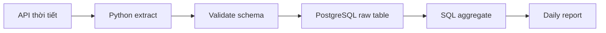

Mục tiêu của chặng Beginner không phải là học thật nhiều công cụ. Mục tiêu là tự xây được một pipeline nhỏ, hiểu dữ liệu đi qua những bước nào, và biết cách kiểm tra để lần chạy sau không làm hỏng kết quả lần chạy trước.

Nếu bạn đang là sinh viên, backend engineer, analyst hoặc người mới chuyển ngành, hãy bắt đầu ở đây. Spark, Kafka hay Kubernetes có thể chờ. SQL, Python, Git và cơ sở dữ liệu thì không.

## Sau chặng này bạn nên làm được gì?

- Viết SQL để lọc, join, tổng hợp và dùng window function ở mức cơ bản.
- Dùng Python đọc file CSV/JSON, gọi API, xử lý lỗi và ghi dữ liệu vào database.
- Hiểu bảng, khóa chính, khóa ngoại, index, transaction và khác biệt giữa OLTP với OLAP.
- Dùng Git để commit, tạo branch, mở pull request và đọc diff.
- Viết một pipeline có log, cấu hình, lịch chạy đơn giản và có thể chạy lại mà không tạo dữ liệu trùng.

## Thứ tự học đề xuất

### 1. Đọc dữ liệu dạng bảng và viết truy vấn đúng

SQL là ngôn ngữ làm việc hằng ngày của Data Engineer. Phần SQL tutorial của PostgreSQL là điểm bắt đầu tốt vì nó đi từ truy vấn cơ bản đến cách dữ liệu quan hệ được thao tác trong database thật: [PostgreSQL SQL Tutorial](https://www.postgresql.org/docs/current/tutorial-sql.html). Hãy học theo thứ tự này:

1. `SELECT`, `WHERE`, `JOIN`, `GROUP BY`, `HAVING`.
2. CTE và subquery để chia truy vấn dài thành bước dễ đọc.
3. Window function như `row_number`, `lag`, `sum over`.
4. `EXPLAIN` ở mức đọc được database đang scan nhiều hay ít.
5. Index: biết index giúp đọc nhanh hơn nhưng cũng làm ghi dữ liệu tốn chi phí hơn.

Một lỗi phổ biến của người mới là viết query “ra đúng số” nhưng không giải thích được vì sao đúng. Hãy tập tự hỏi: grain của bảng là gì, mỗi dòng đại diện cho sự kiện nào, join này có làm nhân bản dòng không.

Đọc trong site: [Relational Database](/concepts/1-distributed-systems-architecture/relational-database/), [OLTP vs OLAP Storage](/concepts/3-storage-engines-formats/oltp-vs-olap-storage/), [Indexing](/concepts/3-storage-engines-formats/indexing/), [SQL Transformation](/concepts/6-data-modeling-transformation/sql-transformation/).

### 2. Viết script xử lý dữ liệu có thể chạy lại

Bạn chưa cần học framework web. Tài liệu Python chính thức cũng tách phần ngôn ngữ, module, file I/O và exception khỏi các framework bên ngoài: [The Python Tutorial](https://docs.python.org/3/tutorial/). Hãy tập trung vào:

- Kiểu dữ liệu: list, dict, tuple, set.
- Đọc ghi file, xử lý JSON, CSV.
- Hàm, module, virtual environment, package.
- Logging, exception handling, retry đơn giản.
- Làm việc với `pandas` ở mức đọc, lọc, transform, export.

Python tốt cho Data Engineering không phải Python “ngắn nhất”, mà là Python dễ đọc, dễ chạy lại và dễ debug lúc 2 giờ sáng.

Đọc trong site: [Data Extraction](/concepts/2-data-ingestion-integration/data-extraction/), [Data Loading](/concepts/2-data-ingestion-integration/data-loading/), [Data Transformation](/concepts/2-data-ingestion-integration/data-transformation/), [Idempotency](/concepts/2-data-ingestion-integration/idempotency/).

### 3. Cơ sở dữ liệu quan hệ

PostgreSQL là lựa chọn tốt để học vì tài liệu rõ và đủ gần với hệ thống production. Bạn cần hiểu:

| Khái niệm | Vì sao quan trọng |
|---|---|
| Primary key / foreign key | Giữ quan hệ giữa bảng có ý nghĩa. |
| Transaction | Tránh ghi nửa chừng làm dữ liệu sai. |
| Index | Tăng tốc đọc nhưng có chi phí ghi và lưu trữ. |
| Normalization | Giảm trùng lặp trong hệ thống vận hành. |
| OLTP vs OLAP | Phân biệt hệ thống giao dịch với hệ thống phân tích. |

Đọc trong site: [Source Systems](/concepts/1-distributed-systems-architecture/source-systems/), [Data Warehouse](/concepts/1-distributed-systems-architecture/data-warehouse/), [OLTP](/concepts/3-storage-engines-formats/oltp/), [OLAP](/concepts/3-storage-engines-formats/olap/).

### 4. Git và thói quen làm việc

Git không chỉ để lưu code. Git là nơi team xem bạn nghĩ gì qua từng thay đổi. Tập commit nhỏ, message rõ, pull request có mô tả dữ liệu đầu vào/đầu ra và cách kiểm tra.

### 5. Pipeline đầu tiên

Pipeline đầu tiên nên nhỏ nhưng đầy đủ. Trước khi code, đọc [Data Engineering](/concepts/1-distributed-systems-architecture/data-engineering/) và [Data Pipeline](/concepts/1-distributed-systems-architecture/data-pipeline/) để hiểu pipeline là một hệ thống có input, output, lịch chạy, kiểm tra và người dùng downstream.



Yêu cầu tối thiểu:

- Có file cấu hình, không hardcode secret trong code.
- Có log cho số dòng đọc, số dòng ghi, lỗi nếu có.
- Có khóa tự nhiên hoặc checksum để tránh duplicate.
- Có câu SQL kiểm tra số dòng, null và giá trị bất thường.
- Có README ghi cách chạy lại từ đầu.

## Dự án thực hành

**Dự án: Weather ingestion mini-pipeline**

1. Gọi API thời tiết công khai theo danh sách thành phố.
2. Lưu JSON gốc vào thư mục `raw/` theo ngày.
3. Parse ra bảng PostgreSQL `weather_observations`.
4. Viết SQL tạo bảng `daily_city_weather`.
5. Đặt lịch bằng cron hoặc Task Scheduler.
6. Viết README: input, output, cách chạy, cách kiểm tra.

Đừng bỏ qua phần chạy lại. Hãy thử chạy cùng một ngày hai lần và đảm bảo kết quả không bị nhân đôi. Kỹ thuật đơn giản nhất là dùng `ON CONFLICT` (upsert) theo khóa tự nhiên:

```sql
INSERT INTO weather_observations (city, observed_at, temp_c, humidity)
VALUES (%(city)s, %(observed_at)s, %(temp_c)s, %(humidity)s)
ON CONFLICT (city, observed_at)     -- khóa tự nhiên: 1 thành phố, 1 thời điểm
DO UPDATE SET temp_c = EXCLUDED.temp_c, humidity = EXCLUDED.humidity;
```

Chạy 1 lần hay 10 lần, bảng vẫn đúng — đó là [idempotency](/concepts/2-data-ingestion-integration/idempotency/), khái niệm mà mọi vòng phỏng vấn Data Engineer đều hỏi theo cách nào đó.

## Checklist đọc concept

| Khi học | Concept nội bộ cần đọc |
|---|---|
| Dữ liệu dạng bảng | [Relational Database](/concepts/1-distributed-systems-architecture/relational-database/), [Indexing](/concepts/3-storage-engines-formats/indexing/) |
| Pipeline đầu tiên | [Data Pipeline](/concepts/1-distributed-systems-architecture/data-pipeline/), [ETL](/concepts/2-data-ingestion-integration/etl/), [ELT](/concepts/2-data-ingestion-integration/elt/) |
| Chạy lại an toàn | [Idempotency](/concepts/2-data-ingestion-integration/idempotency/), [Deduplication](/concepts/2-data-ingestion-integration/deduplication/) |
| Chuẩn bị lên chặng sau | [Backfill](/concepts/2-data-ingestion-integration/backfill/), [DAG](/concepts/7-dataops-orchestration-quality/dag/) |

## Góc phỏng vấn

- Giải thích sự khác nhau giữa `WHERE` và `HAVING`.
- Khi nào dùng `LEFT JOIN`, khi nào dùng `INNER JOIN`?
- Vì sao index không phải lúc nào cũng làm hệ thống nhanh hơn?
- Làm sao tránh insert trùng khi pipeline được chạy lại?
- Nếu API trả về thiếu một field, pipeline nên fail hay bỏ qua?

## Khi nào nên đi tiếp?

Bạn sẵn sàng sang chặng Junior to Middle khi có thể tự làm một pipeline nhỏ, đưa người khác chạy lại được, và giải thích rõ: dữ liệu lấy từ đâu, lưu ở đâu, kiểm tra thế nào, lỗi thì debug từ đâu.

## References

- [The Python Tutorial](https://docs.python.org/3/tutorial/) - Python Software Foundation.
- [PostgreSQL SQL Tutorial](https://www.postgresql.org/docs/current/tutorial-sql.html) - PostgreSQL Global Development Group.
- [PostgreSQL Indexes](https://www.postgresql.org/docs/current/indexes.html) - PostgreSQL Global Development Group.
- [Pro Git Book](https://git-scm.com/book/en/v2) - Scott Chacon and Ben Straub.
- [DAGs](https://airflow.apache.org/docs/apache-airflow/stable/core-concepts/dags.html) - Apache Airflow.
