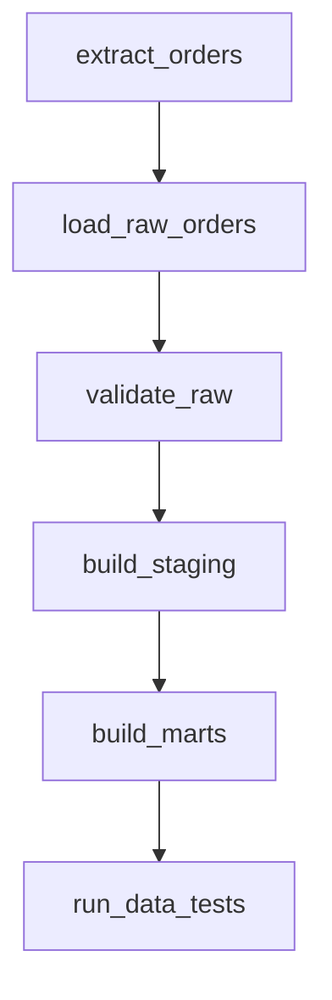

Ở cấp Junior, bạn chứng minh mình viết được pipeline. Ở cấp Middle, bạn chứng minh pipeline đó có thể sống trong production: chạy đúng lịch, chạy lại được, có test, có cảnh báo, có tài liệu, và không làm downstream mất niềm tin.

Chặng này nên học bằng cách xây một pipeline ELT hoàn chỉnh, không học từng công cụ rời rạc.

## Checkpoint cần đạt

- Thiết kế bảng fact/dimension ở mức cơ bản, biết khai báo grain.
- Dùng Airflow hoặc công cụ tương đương để điều phối DAG.
- Hiểu partitioning, clustering và incremental load.
- Biết xử lý dữ liệu đến muộn, backfill và retry an toàn.
- Viết data tests: uniqueness, not null, accepted values, freshness.
- Tạo dashboard hoặc bảng mart có người dùng thực sự đọc được.

## 1. Mô hình hóa dữ liệu

Trước khi viết pipeline, hãy trả lời: mỗi dòng trong bảng đại diện cho điều gì? Kimball Group gọi đây là grain của fact table; nếu grain mơ hồ, số liệu downstream rất dễ sai dù SQL vẫn chạy thành công: [Fact Tables and Dimension Tables](https://www.kimballgroup.com/2003/01/fact-tables-and-dimension-tables/).

Ví dụ bảng `fact_orders` có grain là “một dòng cho một order item”. Nếu sau đó bạn join với bảng payment ở grain “một dòng cho một payment attempt”, số tiền có thể bị nhân lên. Đây là lỗi rất phổ biến và rất khó phát hiện nếu chỉ nhìn tổng doanh thu.

Học theo thứ tự:

1. Grain, fact, dimension.
2. Star schema và slowly changing dimension.
3. Snapshot, incremental model, audit columns.
4. Data mart cho một nghiệp vụ cụ thể.

Đọc trong site: [Grain](/concepts/6-data-modeling-transformation/grain/), [Fact Table](/concepts/6-data-modeling-transformation/fact-table/), [Dimension Table](/concepts/6-data-modeling-transformation/dimension-table/), [Dimensional Modeling](/concepts/6-data-modeling-transformation/dimensional-modeling/), [Star Schema](/concepts/6-data-modeling-transformation/star-schema/), [Slowly Changing Dimension](/concepts/6-data-modeling-transformation/slowly-changing-dimension/).

## 2. Orchestration và DAG

Airflow/Dagster/Prefect không làm dữ liệu đúng thay bạn. Chúng giúp biểu diễn phụ thuộc, lịch chạy, retry và quan sát trạng thái. Airflow định nghĩa DAG là mô hình các task và dependency, nên phần thiết kế dependency phải rõ trước khi viết operator: [Airflow DAGs](https://airflow.apache.org/docs/apache-airflow/stable/core-concepts/dags.html).

Một DAG production tối thiểu cần:

- Task nhỏ, tên rõ, không nhồi toàn bộ logic vào một file.
- Retry có giới hạn và hiểu được task có idempotent không.
- Backfill chạy được theo khoảng ngày.
- Alert gửi đúng người, có link đến log và runbook.
- SLA hoặc freshness expectation cho bảng đầu ra.

Đọc trong site: [Orchestration](/concepts/7-dataops-orchestration-quality/orchestration/), [DAG](/concepts/7-dataops-orchestration-quality/dag/), [Task Dependency](/concepts/7-dataops-orchestration-quality/task-dependency/), [Retries SLA](/concepts/7-dataops-orchestration-quality/retries-sla/), [Apache Airflow](/concepts/7-dataops-orchestration-quality/apache-airflow/).

## 3. Warehouse và incremental processing

Cloud warehouse như BigQuery, Snowflake, Redshift hoặc Fabric Warehouse đều có cách tối ưu riêng, nhưng nguyên tắc chung giống nhau:

| Chủ đề | Cần nắm |
|---|---|
| Partition | Cắt dữ liệu theo ngày/tháng hoặc khóa lọc chính. |
| Clustering/sort key | Sắp xếp dữ liệu theo cột hay filter/join. |
| Incremental load | Chỉ xử lý phần thay đổi, nhưng phải có chiến lược late-arriving data. |
| Cost | Query ít cột, lọc partition sớm, tránh rebuild toàn bảng khi không cần. |

Đọc trong site: [Incremental Load](/concepts/2-data-ingestion-integration/incremental-load/), [Partitioning](/concepts/3-storage-engines-formats/partitioning/), [Clustering](/concepts/3-storage-engines-formats/clustering/), [Google BigQuery](/concepts/3-storage-engines-formats/google-bigquery/), [Snowflake](/concepts/3-storage-engines-formats/snowflake/).

## 4. CDC và dữ liệu thay đổi

Change Data Capture giúp lấy thay đổi từ hệ thống nguồn mà không phải scan toàn bộ. Nhưng CDC đi kèm nhiều tình huống khó: update nhiều lần, delete, event đến trễ, schema đổi, transaction bị chia nhỏ.

Khi làm CDC, hãy lưu raw event trước. Đừng vội overwrite bảng đích nếu chưa có audit trail.

Đọc trong site: [Change Data Capture](/concepts/2-data-ingestion-integration/change-data-capture/), [Log-based CDC Internals](/concepts/2-data-ingestion-integration/log-based-cdc-internals/), [Schema Evolution](/concepts/3-storage-engines-formats/schema-evolution/).

## 5. Testing và data quality

Test tốt không chỉ kiểm tra null. Test tốt phản ánh hợp đồng với người dùng dữ liệu:

- `order_id` không được trùng trong mart order-level.
- `paid_amount` không âm.
- `event_time` không được lớn hơn thời gian hiện tại quá xa.
- Bảng dashboard phải fresh trước 8 giờ sáng.
- Tổng doanh thu mart phải reconcile được với raw/payment source trong ngưỡng chấp nhận.

Đọc trong site: [Data Quality](/concepts/7-dataops-orchestration-quality/data-quality/), [Data Testing](/concepts/7-dataops-orchestration-quality/data-testing/), [dbt Testing](/concepts/7-dataops-orchestration-quality/dbt-testing/), [Freshness Monitoring](/concepts/7-dataops-orchestration-quality/freshness-monitoring/), [Data Reconciliation](/concepts/7-dataops-orchestration-quality/data-reconciliation/).

## Checklist đọc concept

| Mốc học | Concept nội bộ cần đọc |
|---|---|
| Thiết kế mart | [Grain](/concepts/6-data-modeling-transformation/grain/), [Fact Table](/concepts/6-data-modeling-transformation/fact-table/), [Dimension Table](/concepts/6-data-modeling-transformation/dimension-table/) |
| Điều phối pipeline | [DAG](/concepts/7-dataops-orchestration-quality/dag/), [Orchestration](/concepts/7-dataops-orchestration-quality/orchestration/), [Retries SLA](/concepts/7-dataops-orchestration-quality/retries-sla/) |
| Load tăng dần | [Incremental Load](/concepts/2-data-ingestion-integration/incremental-load/), [Backfill](/concepts/2-data-ingestion-integration/backfill/), [Idempotency](/concepts/2-data-ingestion-integration/idempotency/) |
| Kiểm tra dữ liệu | [Data Testing](/concepts/7-dataops-orchestration-quality/data-testing/), [Freshness Monitoring](/concepts/7-dataops-orchestration-quality/freshness-monitoring/), [Data Reconciliation](/concepts/7-dataops-orchestration-quality/data-reconciliation/) |

## Dự án thực hành

**Dự án: E-commerce ELT pipeline**

1. Tạo dữ liệu giả lập: customers, products, orders, payments, events.
2. Load raw vào PostgreSQL hoặc DuckDB/BigQuery.
3. Dùng dbt hoặc SQL thuần để tạo staging, dimension, fact.
4. Điều phối bằng Airflow.
5. Thêm data tests và freshness check.
6. Viết một runbook: pipeline fail ở task nào thì kiểm tra gì.

Kết quả tốt không phải là dashboard đẹp. Kết quả tốt là người khác có thể nhìn vào repo và hiểu pipeline đang đảm bảo điều gì.

## Góc phỏng vấn

- Grain là gì? Cho ví dụ lỗi do join khác grain.
- Retry khác backfill như thế nào?
- Pipeline chạy lại vì task fail thì làm sao tránh duplicate?
- Partition theo `created_at` hay `event_date`, chọn thế nào?
- CDC xử lý delete và late event ra sao?

## Khi nào nên đi tiếp?

Bạn sẵn sàng sang Middle to Senior khi có thể vận hành một pipeline production nhỏ trong vài tuần, xử lý được sự cố thường gặp, và biết diễn giải trade-off giữa độ đúng, độ trễ, chi phí và độ phức tạp.

## References

- [Fact Tables and Dimension Tables](https://www.kimballgroup.com/2003/01/fact-tables-and-dimension-tables/) - Kimball Group.
- [DAGs](https://airflow.apache.org/docs/apache-airflow/stable/core-concepts/dags.html) - Apache Airflow.
- [What is dbt?](https://docs.getdbt.com/docs/introduction) - dbt Labs.
- [Data contracts](https://docs.getdbt.com/docs/build/data-contracts) - dbt Labs.
- [PostgreSQL Indexes](https://www.postgresql.org/docs/current/indexes.html) - PostgreSQL Global Development Group.
