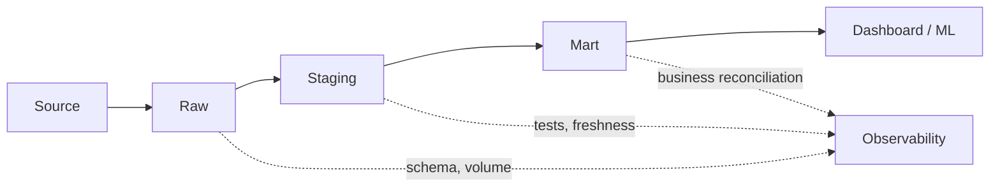

Senior Data Engineer không được đánh giá bằng số tool biết dùng. Điểm khác biệt nằm ở khả năng nhìn pipeline như một hệ thống: dữ liệu lớn lên, schema đổi, job chậm dần, chi phí tăng, sự cố xảy ra ngoài giờ, và nhiều đội phụ thuộc vào cùng một bảng.

Chặng này tập trung vào năng lực thiết kế, tối ưu và vận hành.

## Checkpoint cần đạt

- Đọc được execution plan và hiểu chi phí của shuffle, join, scan, spill.
- Tối ưu Spark hoặc warehouse bằng partitioning, join strategy, file layout và incremental design.
- Hiểu lakehouse/table format: schema evolution, snapshot, compaction, time travel.
- Thiết kế data observability: freshness, volume, schema, distribution, lineage.
- Viết design doc cho thay đổi lớn và bảo vệ trade-off trước team.
- Biết khi nào không nên thêm công nghệ mới.

## 1. Hệ thống phân tán thực tế

Ở cấp này, “dữ liệu lớn” không chỉ là nhiều GB/TB. Nó là tập hợp các vấn đề:

| Vấn đề | Dấu hiệu |
|---|---|
| Data skew | Một vài task chạy rất lâu trong khi task khác đã xong. |
| Shuffle lớn | Job tốn network và disk, dễ spill. |
| Small files | Metadata nhiều, query chậm, compaction cần thiết. |
| Late data | Dashboard hôm qua thay đổi sau khi đã công bố. |
| Schema drift | Source thêm/sửa/xóa field làm downstream fail hoặc sai âm thầm. |
| Retry không an toàn | Một lỗi tạm thời biến thành duplicate data. |

Senior cần biết phân biệt triệu chứng và nguyên nhân. Job chậm không nhất thiết do “thiếu cluster”; có thể do model sai grain, join key lệch, partition quá nhỏ hoặc query scan toàn bảng.

Đọc trong site: [Distributed Processing](/concepts/4-compute-engines-batch/distributed-processing/), [Shuffle](/concepts/4-compute-engines-batch/shuffle/), [Data Skew](/concepts/4-compute-engines-batch/data-skew/), [Spark Data Skew Salting](/concepts/4-compute-engines-batch/spark-data-skew-salting/), [Backpressure Handling](/concepts/2-data-ingestion-integration/backpressure-handling/).

## 2. Spark và compute engine

Spark đáng học vì nó buộc bạn hiểu cách distributed compute vận hành: driver, executor, task, stage, shuffle, broadcast, cache, spill. Tài liệu Spark chính thức mô tả Spark như một engine cho xử lý dữ liệu lớn, có Spark SQL, DataFrame/Dataset và Structured Streaming, nên nó là một nền tốt để học cơ chế hơn là học API rời rạc: [Apache Spark Documentation](https://spark.apache.org/docs/latest/).

Thứ tự học nên là:

1. DataFrame/Spark SQL trước RDD.
2. Lazy evaluation, stage và task.
3. Join strategy: broadcast, sort-merge, shuffle hash.
4. Partition sizing và file sizing.
5. Adaptive Query Execution, skew handling.
6. Monitoring qua Spark UI.

Một Senior không chỉ “tăng executor”. Senior hỏi: dữ liệu có đang được phân phối đều không, query có filter partition không, bảng dimension có đủ nhỏ để broadcast không, và output có tạo hàng nghìn file bé không.

Bài kiểm tra nhanh mức Senior — đọc đoạn code này và chỉ ra 3 vấn đề trước khi chạy:

```python
df = spark.read.parquet("s3://lake/events/")          # (1) không filter partition
result = df.join(dim_users, "user_id") \
           .groupBy("country").agg(F.sum("amount"))
result.repartition(1).write.parquet(out_path)          # (2) repartition(1) → 1 task ghi
# (3) dim_users 50MB nhưng không broadcast → sort-merge join + full shuffle
```

Lời giải: thêm `.where(F.col("dt") == ds)` để partition pruning (giảm scan từ TB xuống GB); thay `repartition(1)` bằng `coalesce` với số hợp lý hoặc để AQE tự gộp; và `F.broadcast(dim_users)` để né shuffle bảng events. Ba dòng sửa, thường nhanh gấp 10-50 lần — không thêm một executor nào. Chi tiết từng kỹ thuật: [Spark Partition](/concepts/4-compute-engines-batch/spark-partition/), [Spark Joins](/concepts/4-compute-engines-batch/spark-joins/), [Shuffle](/concepts/4-compute-engines-batch/shuffle/).

Đọc trong site: [Apache Spark](/concepts/4-compute-engines-batch/apache-spark/), [Spark Execution Model](/concepts/4-compute-engines-batch/spark-execution-model/), [Spark Jobs, Stages, Tasks](/concepts/4-compute-engines-batch/spark-jobs-stages-tasks/), [Spark Joins](/concepts/4-compute-engines-batch/spark-joins/), [Spark AQE](/concepts/4-compute-engines-batch/spark-aqe-adaptive-query/), [Troubleshooting Spark OOM](/concepts/4-compute-engines-batch/troubleshooting-spark-oom/).

## 3. Lakehouse và open table format

Parquet là file format, không phải hệ quản trị bảng. Khi dữ liệu cần update, delete, schema evolution, snapshot isolation hoặc time travel, bạn cần table format như Apache Iceberg, Delta Lake hoặc Hudi. Iceberg và Delta Lake đều tài liệu hóa các khái niệm bảng, snapshot và thao tác trên lakehouse ở mức table format, không chỉ ở mức file: [Apache Iceberg](https://iceberg.apache.org/docs/latest/) và [Delta Lake](https://docs.delta.io/).

| Năng lực | Cần hiểu |
|---|---|
| Snapshot | Query đọc một phiên bản nhất quán của bảng. |
| Schema evolution | Thêm/sửa field mà không phá reader cũ. |
| Partition evolution | Thay đổi chiến lược partition theo thời gian. |
| Compaction | Gom file nhỏ để giảm metadata và tăng tốc query. |
| Retention/VACUUM | Dọn dữ liệu cũ nhưng không phá rollback/time travel. |

Đọc trong site: [Lakehouse](/concepts/3-storage-engines-formats/lakehouse/), [Table Format](/concepts/3-storage-engines-formats/table-format/), [Apache Iceberg](/concepts/3-storage-engines-formats/apache-iceberg/), [Delta Lake](/concepts/3-storage-engines-formats/delta-lake/), [Schema Evolution](/concepts/3-storage-engines-formats/schema-evolution/), [Compaction](/concepts/3-storage-engines-formats/compaction/), [Time Travel](/concepts/3-storage-engines-formats/time-travel/).

## 4. Observability cho dữ liệu

Monitoring hạ tầng chưa đủ. Pipeline có thể “xanh” nhưng dữ liệu vẫn sai. Hãy đo:

- Freshness: bảng có cập nhật đúng kỳ vọng không?
- Volume: số dòng hôm nay có bất thường không?
- Schema: field có đổi kiểu hoặc biến mất không?
- Distribution: giá trị có drift không?
- Lineage: bảng nào bị ảnh hưởng nếu source đổi?
- Business checks: tổng doanh thu, số đơn, tỷ lệ hoàn tiền có hợp lý không?



Đọc trong site: [Data Observability](/concepts/7-dataops-orchestration-quality/data-observability/), [Freshness Monitoring](/concepts/7-dataops-orchestration-quality/freshness-monitoring/), [Volume Anomalies](/concepts/7-dataops-orchestration-quality/volume-anomalies/), [Schema Drift](/concepts/7-dataops-orchestration-quality/schema-drift/), [Data Lineage](/concepts/8-security-governance-finops/data-lineage/), [Root Cause Analysis](/concepts/7-dataops-orchestration-quality/root-cause-analysis/).

## 5. Thiết kế và giao tiếp

Senior thường chịu trách nhiệm cho quyết định khó đổi. Trước khi migration orchestration, đổi table format, tách platform hay thêm streaming, hãy viết design doc:

- Bối cảnh và vấn đề hiện tại.
- Mục tiêu và non-goals.
- Phương án đề xuất.
- Các phương án bị loại và lý do.
- Rủi ro vận hành, bảo mật, chi phí.
- Kế hoạch rollout, rollback, đo thành công.

Không có design doc thì review kiến trúc dễ biến thành tranh luận cảm tính.

## Checklist đọc concept

| Mốc học | Concept nội bộ cần đọc |
|---|---|
| Debug compute | [Shuffle](/concepts/4-compute-engines-batch/shuffle/), [Spark Execution Model](/concepts/4-compute-engines-batch/spark-execution-model/), [Data Skew](/concepts/4-compute-engines-batch/data-skew/) |
| Tối ưu Spark | [Spark Joins](/concepts/4-compute-engines-batch/spark-joins/), [Spark AQE](/concepts/4-compute-engines-batch/spark-aqe-adaptive-query/), [Spark Spill to Disk](/concepts/4-compute-engines-batch/spark-spill-to-disk/) |
| Lakehouse | [Lakehouse](/concepts/3-storage-engines-formats/lakehouse/), [Table Format](/concepts/3-storage-engines-formats/table-format/), [Apache Iceberg](/concepts/3-storage-engines-formats/apache-iceberg/) |
| Vận hành | [Data Observability](/concepts/7-dataops-orchestration-quality/data-observability/), [Alerting Incident Response](/concepts/7-dataops-orchestration-quality/alerting-incident-response/), [Cost Optimization](/concepts/8-security-governance-finops/cost-optimization/) |

## Dự án thực hành

**Dự án: Lakehouse performance and reliability lab**

1. Tạo dataset clickstream hoặc order lớn theo ngày.
2. Lưu dạng Parquet, sau đó chuyển sang Iceberg hoặc Delta.
3. Chạy các truy vấn có filter, join, aggregation.
4. Tạo tình huống small files và compaction.
5. Tạo schema evolution có kiểm soát.
6. Thêm freshness, volume và reconciliation checks.
7. Viết design doc giải thích lựa chọn kiến trúc.

## Góc phỏng vấn

- Vì sao shuffle đắt? Khi nào broadcast join có lợi?
- Data skew phát hiện và xử lý thế nào?
- Lakehouse khác data lake lưu Parquet thuần ở điểm nào?
- Observability khác data quality test ra sao?
- Nếu pipeline quan trọng bị trễ 2 giờ, bạn xử lý theo thứ tự nào?

## References

- [Apache Spark Documentation](https://spark.apache.org/docs/latest/) - Apache Software Foundation.
- [Apache Iceberg Documentation](https://iceberg.apache.org/docs/latest/) - Apache Software Foundation.
- [Delta Lake Documentation](https://docs.delta.io/) - Linux Foundation Delta Lake.
- [Monitoring Distributed Systems](https://sre.google/sre-book/monitoring-distributed-systems/) - Google SRE.
- [Architecture decision records](https://cloud.google.com/architecture/architecture-decision-records) - Google Cloud.
