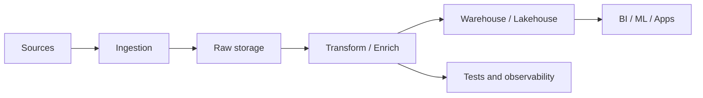

Phỏng vấn Data Engineer thường không kiểm tra bạn thuộc bao nhiêu công cụ. Họ muốn biết bạn có hiểu dữ liệu, code có chắc không, thiết kế pipeline có thực tế không, và khi production hỏng bạn có xử lý bình tĩnh không.

Hãy ôn theo năng lực, không ôn theo câu hỏi mẹo.

## Bốn mảng cần chuẩn bị

| Mảng | Mục tiêu | Cách luyện |
|---|---|---|
| SQL | Viết query đúng grain, đúng logic, tối ưu vừa đủ | Window function, dedup, sessionization, cohort |
| Coding | Python sạch, xử lý file/API, edge cases | Bài nhỏ về parsing, grouping, streaming file |
| Data system design | Thiết kế pipeline end-to-end | Batch, streaming, CDC, warehouse, observability |
| Production troubleshooting | Điều tra lỗi có thứ tự | Log, metrics, freshness, retry, rollback |

## 1. SQL: vòng giữ cửa

SQL là phần dễ bị đánh giá nhất vì kết quả đúng/sai rõ. Hãy luyện:

- Dedup theo `row_number()`.
- Running total, rolling window.
- Top-N per group.
- Funnel conversion.
- Slowly changing dimension.
- Reconciliation giữa hai nguồn.

Khi giải, nói rõ grain trước. Ví dụ: “Em sẽ tạo một dòng cho mỗi user mỗi ngày trước, sau đó mới aggregate theo tuần.” Câu đó cho thấy bạn hiểu dữ liệu, không chỉ biết cú pháp.

Hai pattern chiếm tỷ lệ ra đề cao nhất, nên viết được không cần nghĩ:

```sql
-- Pattern 1: Dedup giữ bản ghi mới nhất (xuất hiện ở ~50% vòng SQL)
SELECT * FROM (
  SELECT *, ROW_NUMBER() OVER (
    PARTITION BY user_id ORDER BY updated_at DESC) AS rn
  FROM user_events
) t WHERE rn = 1;

-- Pattern 2: Top-N per group
SELECT * FROM (
  SELECT *, DENSE_RANK() OVER (
    PARTITION BY category ORDER BY revenue DESC) AS rk
  FROM product_sales
) t WHERE rk <= 3;
```

Và chuẩn bị trả lời câu hỏi nối tiếp gần như chắc chắn sẽ đến: *"vì sao dùng `ROW_NUMBER` mà không phải `RANK`/`DENSE_RANK`?"* (ROW_NUMBER không bao giờ trùng số → dedup an toàn; RANK nhảy số khi hòa; DENSE_RANK không nhảy — chọn theo việc bạn muốn xử lý tie thế nào). Luyện đầy đủ theo bài [SQL Interview Patterns](/interview/sql-interview-patterns/).

Ôn trong site: [SQL Transformation](/concepts/6-data-modeling-transformation/sql-transformation/), [Grain](/concepts/6-data-modeling-transformation/grain/), [Fact Table](/concepts/6-data-modeling-transformation/fact-table/), [Slowly Changing Dimension](/concepts/6-data-modeling-transformation/slowly-changing-dimension/).

## 2. Python coding

Các bài coding Data Engineering thường gần với công việc hơn LeetCode thuần:

- Parse log thành record có schema.
- Đọc file lớn theo dòng, không load toàn bộ vào RAM.
- Gom nhóm sự kiện theo key.
- Retry API có backoff.
- Validate record và tách bad rows.

Tiêu chí chấm thường gồm: code rõ, xử lý edge case, test được, không dùng memory vô tội vạ.

Ôn trong site: [Data Extraction](/concepts/2-data-ingestion-integration/data-extraction/), [Deduplication](/concepts/2-data-ingestion-integration/deduplication/), [Idempotency](/concepts/2-data-ingestion-integration/idempotency/), [Data Quality](/concepts/7-dataops-orchestration-quality/data-quality/).

## 3. Data system design

Một đề phổ biến: “Thiết kế pipeline cho clickstream/e-commerce/payment/fraud detection.”

Khung trả lời:

1. Làm rõ yêu cầu: batch hay realtime, độ trễ, volume, độ chính xác, người dùng downstream.
2. Nguồn dữ liệu: API, database, event, file, CDC.
3. Ingestion: queue, object storage, raw zone, schema registry nếu cần.
4. Processing: batch/stream, transformation, data quality.
5. Storage: warehouse/lakehouse/OLAP serving.
6. Observability: freshness, volume, error rate, lineage, alert.
7. Failure mode: retry, backfill, late data, duplicate, rollback.
8. Security và cost: quyền truy cập, PII, retention, partitioning.

Ôn trong site: [Data Pipeline](/concepts/1-distributed-systems-architecture/data-pipeline/), [Lambda Architecture](/concepts/1-distributed-systems-architecture/lambda-architecture/), [Kappa Architecture](/concepts/1-distributed-systems-architecture/kappa-architecture/), [Change Data Capture](/concepts/2-data-ingestion-integration/change-data-capture/), [Data Warehouse](/concepts/1-distributed-systems-architecture/data-warehouse/), [Lakehouse](/concepts/3-storage-engines-formats/lakehouse/).



## 4. Production troubleshooting

Đừng trả lời sự cố bằng “em sẽ check log” rồi dừng lại. Hãy có thứ tự:

1. Xác định tác động: bảng nào sai, dashboard nào trễ, ai bị ảnh hưởng.
2. Khoanh vùng thời gian: bắt đầu từ run nào, source nào đổi.
3. Kiểm tra triệu chứng: freshness, volume, schema, error rate, cost spike.
4. Mitigate trước: tạm dừng downstream, rollback model, rerun partition nhỏ, dùng snapshot cũ nếu cần.
5. Tìm nguyên nhân: code change, source change, infra, credential, data skew.
6. Viết follow-up: test mới, alert mới, runbook mới.

Google SRE nhấn mạnh monitoring nên ưu tiên tín hiệu gắn với hành động và tác động người dùng, không chỉ gom thật nhiều metric: [Monitoring Distributed Systems](https://sre.google/sre-book/monitoring-distributed-systems/). Trong phỏng vấn, hãy thể hiện bạn biết bảo vệ thời gian của người trực on-call.

Ôn trong site: [Alerting Incident Response](/concepts/7-dataops-orchestration-quality/alerting-incident-response/), [Data Observability](/concepts/7-dataops-orchestration-quality/data-observability/), [Freshness Monitoring](/concepts/7-dataops-orchestration-quality/freshness-monitoring/), [Root Cause Analysis](/concepts/7-dataops-orchestration-quality/root-cause-analysis/), [Schema Drift](/concepts/7-dataops-orchestration-quality/schema-drift/).

## Checklist đọc concept

| Vòng phỏng vấn | Concept nội bộ cần đọc |
|---|---|
| SQL | [SQL Transformation](/concepts/6-data-modeling-transformation/sql-transformation/), [Grain](/concepts/6-data-modeling-transformation/grain/), [Slowly Changing Dimension](/concepts/6-data-modeling-transformation/slowly-changing-dimension/) |
| Coding dữ liệu | [Idempotency](/concepts/2-data-ingestion-integration/idempotency/), [Deduplication](/concepts/2-data-ingestion-integration/deduplication/), [Data Quality](/concepts/7-dataops-orchestration-quality/data-quality/) |
| System design | [Data Pipeline](/concepts/1-distributed-systems-architecture/data-pipeline/), [Data Warehouse](/concepts/1-distributed-systems-architecture/data-warehouse/), [Lakehouse](/concepts/3-storage-engines-formats/lakehouse/), [Apache Kafka](/concepts/5-stream-processing-realtime/apache-kafka/) |
| Troubleshooting | [Data Observability](/concepts/7-dataops-orchestration-quality/data-observability/), [Alerting Incident Response](/concepts/7-dataops-orchestration-quality/alerting-incident-response/), [Root Cause Analysis](/concepts/7-dataops-orchestration-quality/root-cause-analysis/) |

## Kế hoạch ôn 4 tuần

| Tuần | Trọng tâm | Sản phẩm |
|---|---|---|
| 1 | SQL | 25 bài SQL, ghi lại pattern hay sai |
| 2 | Python | 5 bài file/API/log processing có test |
| 3 | System design | 3 thiết kế pipeline dạng document 1-2 trang |
| 4 | Troubleshooting | 5 tình huống sự cố, luyện nói thành quy trình |

## Câu hỏi tự luyện

- Dữ liệu clickstream đến muộn 30 phút, dashboard realtime xử lý thế nào?
- Job Spark chạy chậm gấp 5 lần từ hôm qua, bạn điều tra gì trước?
- Làm sao thiết kế incremental model không mất dữ liệu update?
- Khi nào dùng Kafka, khi nào chỉ cần batch file?
- Nếu business nói số doanh thu sai, bạn reconcile từ đâu?

## References

- [PostgreSQL SQL Tutorial](https://www.postgresql.org/docs/current/tutorial-sql.html) - PostgreSQL Global Development Group.
- [The Python Tutorial](https://docs.python.org/3/tutorial/) - Python Software Foundation.
- [Apache Spark Documentation](https://spark.apache.org/docs/latest/) - Apache Software Foundation.
- [Apache Kafka Documentation](https://kafka.apache.org/documentation/) - Apache Software Foundation.
- [Monitoring Distributed Systems](https://sre.google/sre-book/monitoring-distributed-systems/) - Google SRE.
- [DORA metrics](https://dora.dev/guides/dora-metrics/) - DORA.
