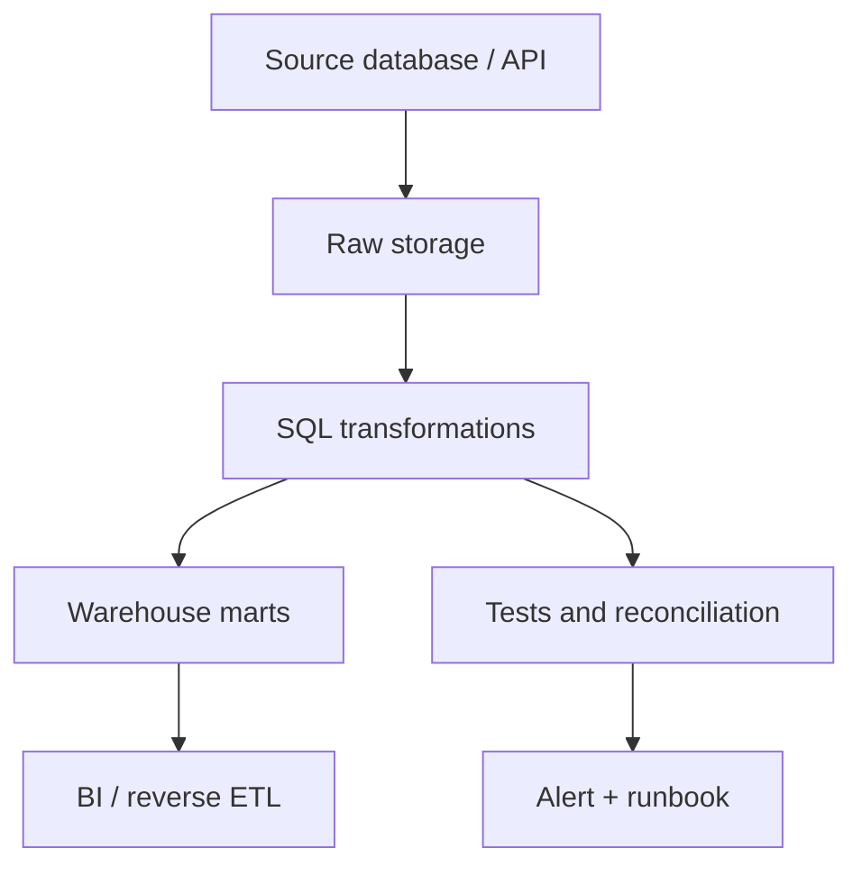

“Boring” trong Data Engineering không có nghĩa là cũ kỹ hay lười đổi mới. Nó nghĩa là ưu tiên những thứ dễ hiểu, dễ debug, dễ bàn giao và đã đủ tốt cho bài toán hiện tại. Chương “Simplicity” trong Google SRE Book cũng đặt simplicity như một yêu cầu vận hành, không phải sở thích thẩm mỹ: [Simplicity](https://sre.google/sre-book/simplicity/).

Đọc trong site trước khi áp dụng: [Data Pipeline](/concepts/1-distributed-systems-architecture/data-pipeline/), [ETL](/concepts/2-data-ingestion-integration/etl/), [ELT](/concepts/2-data-ingestion-integration/elt/), [Idempotency](/concepts/2-data-ingestion-integration/idempotency/).

Nhiều hệ thống dữ liệu thất bại không phải vì thiếu Kafka, Spark hay Kubernetes. Chúng thất bại vì không có owner, không có test, không có log, không có idempotency, không ai biết bảng nào là nguồn sự thật.

## Khi nào boring là đúng?

| Bối cảnh | Lựa chọn thường đủ tốt |
|---|---|
| Dữ liệu vài GB/ngày | SQL, warehouse, batch job |
| Báo cáo cập nhật hằng ngày | Cron/Airflow đơn giản |
| Nguồn là database quan hệ | ELT vào warehouse |
| Team nhỏ | Managed service, ít custom platform |
| SLA theo giờ | Batch đáng tin hơn streaming phức tạp |

Nếu business chỉ cần báo cáo trước 8 giờ sáng, hệ thống streaming realtime có thể là chi phí không cần thiết.

## SQL là nền tảng, không phải phương án tạm

SQL vẫn là ngôn ngữ chung giữa engineer, analyst và nhiều database engine. Với nhiều pipeline transformation, SQL trong warehouse dễ review và vận hành hơn Python tùy biến.

SQL tốt cần:

- Model rõ grain.
- CTE đặt tên theo bước logic.
- Test cho khóa và reconciliation.
- Query có filter partition.
- Không nhúng business logic khác nhau ở nhiều dashboard.

Liên quan trong site: [SQL Transformation](/concepts/6-data-modeling-transformation/sql-transformation/), [Materialization](/concepts/6-data-modeling-transformation/materialization/), [Metrics Layer](/concepts/6-data-modeling-transformation/metrics-layer/).

## Cron không xấu, cron thiếu guardrail mới xấu

Cron phù hợp cho job nhỏ, ít phụ thuộc, dễ chạy lại. Google SRE có hẳn chương về distributed cron, một dấu hiệu rằng scheduling đơn giản vẫn là vấn đề production thật chứ không phải chuyện “đồ cũ”: [Distributed Periodic Scheduling with Cron](https://sre.google/sre-book/distributed-periodic-scheduling/). Nhưng cron production cần guardrail:

- Log đầy đủ.
- Lock hoặc idempotency để tránh chạy trùng.
- Alert khi job không chạy hoặc chạy lỗi.
- Runbook khi phải rerun.
- Cấu hình được version control.

Nếu job bắt đầu có nhiều dependency, backfill phức tạp, retry nhiều bước hoặc cần lineage, hãy chuyển sang Airflow/Dagster/Prefect.

Liên quan trong site: [DAG](/concepts/7-dataops-orchestration-quality/dag/), [Orchestration](/concepts/7-dataops-orchestration-quality/orchestration/), [Backfill](/concepts/2-data-ingestion-integration/backfill/), [Data Lineage](/concepts/8-security-governance-finops/data-lineage/).

## Khi nào cần vượt khỏi boring stack?

| Tín hiệu | Có thể cần |
|---|---|
| Batch không còn kịp SLA | Spark, Dataflow, distributed compute |
| Cần phản ứng trong vài giây | Kafka, Flink, streaming engine |
| Dữ liệu update/delete lớn trên object storage | Iceberg, Delta, Hudi |
| Nhiều team tự phục vụ | Data platform, template, governance |
| Chi phí query tăng mạnh | Partition, materialization, workload optimization |

Đừng nâng cấp kiến trúc vì sợ bị lạc hậu. Nâng cấp khi bài toán đã vượt quá khả năng của kiến trúc hiện tại và bạn đo được lý do.

## Một boring stack đáng tin

Checklist tối thiểu:

- Mỗi bảng quan trọng có owner.
- Mỗi pipeline quan trọng có log, alert và runbook.
- Mỗi metric quan trọng có định nghĩa.
- Mỗi thay đổi schema có quy trình báo trước.
- Mỗi job có cách chạy lại an toàn.

## Cạm bẫy của “boring”

Boring không đồng nghĩa với bỏ mặc legacy. Nếu hệ thống cũ không có test, không có documentation, không có audit và ai nghỉ việc cũng làm team hoảng, đó không phải boring engineering. Đó là nợ vận hành.

Mục tiêu là đơn giản có kỷ luật, không phải đơn giản vì thiếu đầu tư.

## References

- [Simplicity](https://sre.google/sre-book/simplicity/) - Google SRE.
- [Distributed Periodic Scheduling with Cron](https://sre.google/sre-book/distributed-periodic-scheduling/) - Google SRE.
- [PostgreSQL SQL Tutorial](https://www.postgresql.org/docs/current/tutorial-sql.html) - PostgreSQL Global Development Group.
- [DAGs](https://airflow.apache.org/docs/apache-airflow/stable/core-concepts/dags.html) - Apache Airflow.
- [DORA metrics](https://dora.dev/guides/dora-metrics/) - DORA.
