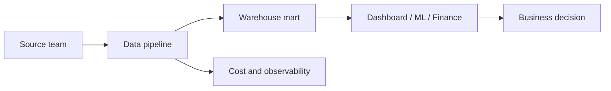

Data Engineering là nghề đứng giữa phần mềm, hạ tầng và nghiệp vụ. Bạn sẽ gặp dữ liệu bẩn, yêu cầu mơ hồ, hệ thống nguồn thay đổi không báo trước, dashboard sai vào sáng thứ Hai và chi phí cloud tăng mà không ai nhận.

Đọc trong site để có nền: [Data Engineer Role](/concepts/1-distributed-systems-architecture/data-engineer-role/), [Source Systems](/concepts/1-distributed-systems-architecture/source-systems/), [Data Quality](/concepts/7-dataops-orchestration-quality/data-quality/), [Cost Optimization](/concepts/8-security-governance-finops/cost-optimization/).

Vì vậy tố chất quan trọng nhất không phải là thuộc nhiều tool. Đó là khả năng suy nghĩ rõ, kiểm chứng kỹ và chịu trách nhiệm đến cùng với dữ liệu mình đưa ra.

## 1. Tò mò có kỷ luật

Tò mò giúp bạn hỏi “vì sao số này lạ?”. Kỷ luật giúp bạn không kết luận quá sớm.

Một Data Engineer tốt thường kiểm tra:

- Source có đổi schema không?
- Số dòng có lệch so với kỳ vọng không?
- Join có làm nhân bản dòng không?
- Timezone có bị xử lý sai không?
- Dữ liệu trễ hay thật sự thiếu?

Tò mò mà không có phương pháp dễ biến thành đoán mò. Hãy tập ghi lại giả thuyết, kiểm tra bằng query nhỏ, rồi mới sửa pipeline. Một khung điều tra 5 phút đáng luyện thành phản xạ:

```sql
-- Giả thuyết: "doanh thu hôm nay thấp bất thường vì join nhân bản/mất dòng"
-- Bước 1: kiểm số dòng theo ngày (phát hiện thiếu/trễ)
SELECT order_date, COUNT(*) FROM stg_orders
WHERE order_date >= CURRENT_DATE - 7 GROUP BY 1 ORDER BY 1;

-- Bước 2: kiểm grain trước và sau join (phát hiện fan-out)
SELECT COUNT(*), COUNT(DISTINCT order_id) FROM fct_revenue;
-- Hai số này lệch nhau → join 1-n đang nhân bản doanh thu
```

Hai query, chưa đầy một phút chạy, loại được ngay một nửa không gian giả thuyết — trước khi bạn động vào bất kỳ dòng code pipeline nào.

Liên quan trong site: [Data Profiling](/concepts/7-dataops-orchestration-quality/data-profiling/), [Data Reconciliation](/concepts/7-dataops-orchestration-quality/data-reconciliation/), [Root Cause Analysis](/concepts/7-dataops-orchestration-quality/root-cause-analysis/).

## 2. Tư duy hệ thống

Pipeline không đứng một mình. Nó có source upstream, consumer downstream, lịch chạy, quyền truy cập, chi phí, alert và người sở hữu.

Tư duy hệ thống là nhìn được các mối quan hệ đó:



Khi một bảng sai, tác động không dừng ở bảng đó. Nó có thể làm sai quyết định marketing, báo cáo tài chính hoặc mô hình ML.

Liên quan trong site: [Data Lineage](/concepts/8-security-governance-finops/data-lineage/), [Data Ownership](/concepts/8-security-governance-finops/data-ownership/), [Data Lifecycle](/concepts/1-distributed-systems-architecture/data-lifecycle/).

## 3. Ownership thực tế

Ownership không có nghĩa là ôm mọi việc. Nó nghĩa là không để vấn đề rơi vào khoảng trống.

Ví dụ:

- Nếu source đổi schema, bạn biết ai cần được báo.
- Nếu job fail, alert có owner rõ.
- Nếu metric gây tranh cãi, có người duyệt định nghĩa.
- Nếu pipeline bị nợ kỹ thuật, có plan giảm rủi ro chứ không chỉ than phiền.

## 4. Tôn trọng sự đơn giản

Kỹ sư non tay thường muốn chứng minh bằng tool phức tạp. Kỹ sư vững hơn thường hỏi: cách đơn giản nhất đáp ứng SLA là gì?

Đơn giản không phải làm sơ sài. Đơn giản là ít thành phần hơn, ít trạng thái hơn, ít đường lỗi hơn, tài liệu rõ hơn và dễ khôi phục hơn. Đây là lý do SRE coi simplicity là một chiến lược reliability, không chỉ là phong cách code: [Simplicity](https://sre.google/sre-book/simplicity/).

## 5. Giao tiếp bằng trade-off

Data Engineer thường phải nói chuyện với nhiều nhóm: backend, analyst, finance, security, product. Cách giao tiếp tốt là đưa trade-off cụ thể:

- Nếu cần dữ liệu realtime, chi phí vận hành sẽ tăng và cần on-call tốt hơn.
- Nếu chấp nhận batch hằng giờ, kiến trúc đơn giản hơn và dễ kiểm soát chất lượng.
- Nếu đổi schema không báo trước, downstream có thể fail hoặc sai âm thầm.
- Nếu muốn giảm chi phí, có thể phải tăng latency hoặc giảm lịch refresh.

Ví dụ với yêu cầu "chuyển dashboard này sang realtime", một câu trả lời tốt nên có đủ ba phần:

- Hiện trạng: bản batch 1 giờ có chi phí vận hành thấp và không cần on-call.
- Chi phí của phương án mới: realtime dưới 1 phút cần thêm streaming pipeline, chi phí hạ tầng tăng nhiều lần và cần người trực.
- Câu hỏi trả lại cho người yêu cầu: quyết định kinh doanh nào sẽ thay đổi nếu số liệu nhanh hơn 59 phút? Nếu không có, batch 15 phút là điểm cân bằng hợp lý hơn.

Trả lời theo cấu trúc này chuyển quyết định về đúng người ra quyết định, kèm đủ dữ kiện. Xem thêm: [Real-time Architecture](/concepts/1-distributed-systems-architecture/real-time-architecture/) và [FinOps](/concepts/8-security-governance-finops/finops-data-engineering/).

## 6. Viết để người khác vận hành được

Tài liệu tốt không cần dài. Nó cần trả lời:

- Pipeline này làm gì?
- Input và output là gì?
- Chạy khi nào?
- Fail thì xem log ở đâu?
- Chạy lại thế nào?
- Ai là owner?
- Metric hoặc bảng này có caveat gì?

## Tự đánh giá

Bạn đang trưởng thành trong nghề nếu:

- Ít nói “chắc do data source” trước khi kiểm chứng.
- Biết rollback hoặc mitigate trước khi tìm root cause dài.
- Review code không chỉ nhìn syntax mà nhìn data contract và failure mode.
- Có thói quen viết runbook cho việc đã từng làm bạn mất thời gian.
- Dám đề xuất bỏ bớt công nghệ nếu nó không tạo giá trị.

## References

- [Simplicity](https://sre.google/sre-book/simplicity/) - Google SRE.
- [Monitoring Distributed Systems](https://sre.google/sre-book/monitoring-distributed-systems/) - Google SRE.
- [DORA metrics](https://dora.dev/guides/dora-metrics/) - DORA.
- [Architecture decision records](https://cloud.google.com/architecture/architecture-decision-records) - Google Cloud.
