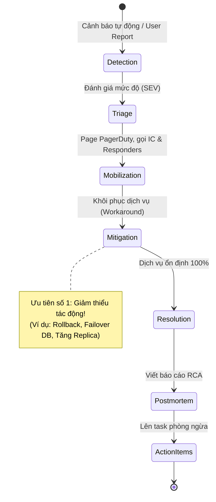

Trực hệ thống (on-call) không chỉ đơn thuần là việc "ôm máy tính chờ tin nhắn PagerDuty réo giữa đêm", mà là một năng lực cốt lõi của Software Engineering (SWE), Data Engineering (DE), và Site Reliability Engineering (SRE) hiện đại. Khi các hệ thống phát triển từ kiến trúc Monolithic truyền thống sang Microservices phân tán và các Data Platform phức tạp (với hàng ngàn DAGs Airflow, Kafka streams, và hồ dữ liệu khổng lồ), việc duy trì độ ổn định (reliability) trở nên thách thức hơn bao giờ hết.

Nếu không có một hệ thống Observability (Khả năng quan sát) tinh vi, quy trình quản lý sự cố (Incident Management) sắc bén và văn hóa không đổ lỗi (Blameless), on-call sẽ nhanh chóng bào mòn thể lực và tinh thần của kỹ sư, dẫn đến tình trạng kiệt sức (burnout) và tỷ lệ nghỉ việc (turnover) cao. 

Bài viết này đóng vai trò là một "Binh pháp Tôn Tử" cho các kỹ sư on-call, bao trùm từ các khía cạnh kiến trúc kỹ thuật sâu (Prometheus, OpenTelemetry, Terraform), xử lý các bài toán Data Quality trong Data Engineering, cho đến các chiến lược tổ chức đội ngũ.

---

## 1. Nền Tảng Kỹ Thuật: Architecting for Observability


Để trực on-call hiệu quả, hệ thống của bạn phải có khả năng tự kể câu chuyện của nó. Nếu kỹ sư nhận cảnh báo mà phải SSH vào từng server để đọc log thô bằng `grep`, hệ thống đó đang thiết kế sai. Khả năng quan sát (Observability) dựa trên 3 trụ cột (Three Pillars) đối với Software Engineering, và bổ sung thêm trụ cột thứ 4 đối với Data Engineering.

### 1.1. Ba Trụ Cột Truyền Thống (Metrics, Logs, Traces)
- **Metrics:** Dữ liệu time-series định lượng (ví dụ: CPU usage, HTTP 500 errors/sec). Công cụ phổ biến: Prometheus, Datadog.
- **Logs:** Sự kiện chi tiết được ghi lại tại một thời điểm. Cấu trúc log dưới dạng JSON là bắt buộc để dễ dàng truy vấn qua Elasticsearch hoặc Splunk.
- **Distributed Traces:** Theo dõi hành trình của một request đi qua nhiều microservices. Công cụ: Jaeger, OpenTelemetry.

*Ví dụ cấu hình OpenTelemetry trong một service Go hoặc Python giúp kỹ sư dễ dàng trace request từ API Gateway tới Database, cực kỳ hữu ích khi gỡ lỗi độ trễ (latency):*

```python
# Python OpenTelemetry Instrumentation Example
from opentelemetry import trace
from opentelemetry.exporter.otlp.proto.grpc.trace_exporter import OTLPSpanExporter
from opentelemetry.sdk.trace import TracerProvider
from opentelemetry.sdk.trace.export import BatchSpanProcessor

# Cấu hình Tracer
provider = TracerProvider()
processor = BatchSpanProcessor(OTLPSpanExporter(endpoint="http://otel-collector:4317"))
provider.add_span_processor(processor)
trace.set_tracer_provider(provider)

tracer = trace.get_tracer(__name__)

def process_data_pipeline(data_payload):
    with tracer.start_as_current_span("process_data_pipeline") as span:
        span.set_attribute("data.size", len(data_payload))
        try:
            # Logic xử lý dữ liệu phức tạp
            transform_data(data_payload)
        except Exception as e:
            span.record_exception(e)
            span.set_status(trace.Status(trace.StatusCode.ERROR, str(e)))
            raise
```

### 1.2. Data Observability (Cho Data Engineering)
Khác với API trả về lỗi 500, một Data Pipeline có thể vẫn báo chạy thành công (Status: Success trong Airflow) nhưng **dữ liệu sinh ra lại hoàn toàn sai lệch** (Data Drift, Null values, Schema thay đổi). Điều này gọi là "Silent Failure" - ác mộng của Data Engineers.
Để giải quyết, ta cần Data Observability (ví dụ: Monte Carlo, dbt tests, Great Expectations).

```yaml
# Ví dụ cấu hình dbt test để catch data anomalies tự động thay vì chờ business user báo lỗi
models:
  - name: fct_transactions
    columns:
      - name: transaction_id
        tests:
          - unique
          - not_null
      - name: transaction_amount
        tests:
          - dbt_expectations.expect_column_values_to_be_between:
              min_value: 0
              max_value: 1000000000 # Cảnh báo nếu có giao dịch lớn bất thường
```

---

## 2. Nghệ Thuật Thiết Kế Cảnh Báo (Taming Alert Fatigue)

"Alert fatigue" xảy ra khi kỹ sư nhận quá nhiều cảnh báo rác (noise) đến mức họ bắt đầu làm ngơ trước chúng. Theo Google SRE, một ca trực chỉ nên có tối đa **2-3 actionable alerts**.

### 2.1. Cảnh Báo Dựa Trên Triệu Chứng (Symptom-based) thay vì Nguyên Nhân (Cause-based)

- **Cảnh báo tồi (Cause-based):** `CPU of Database-Node-3 is at 95%`. Kỹ sư tỉnh dậy lúc 3h sáng, kiểm tra thấy DB đang tự động auto-scale hoặc dọn dẹp vacuum, không ảnh hưởng gì tới user. Kết quả: Mệt mỏi vô ích.
- **Cảnh báo tốt (Symptom-based):** `P99 Latency of Checkout API > 2 seconds for 5 minutes`. Cảnh báo này trực tiếp vi phạm trải nghiệm người dùng (SLO). Lúc này kỹ sư mới cần can thiệp.

### 2.2. Xây Dựng SLI, SLO, và Error Budgets
- **SLI (Service Level Indicator):** Chỉ số đo lường thực tế. VD: Tỷ lệ HTTP 200 OK trên tổng số request.
- **SLO (Service Level Objective):** Mục tiêu nội bộ. VD: 99.9% request phải thành công trong tháng.
- **Error Budget:** Ngân sách lỗi. Nếu SLO là 99.9%, bạn có 0.1% ngân sách cho phép lỗi. Nếu dùng hết ngân sách này, team phải đóng băng việc release tính năng mới (Feature Freeze) để tập trung vào Reliability.

*Đoạn mã PromQL (Prometheus Query Language) điển hình dùng cho Symptom-based Alerting dựa trên tỷ lệ lỗi (Error Rate):*

```yaml
groups:
- name: API_SLO_Alerts
  rules:
  - alert: HighErrorRate_Checkout
    expr: |
      sum(rate(http_requests_total{service="checkout-service", status=~"5.."}[5m])) 
      / 
      sum(rate(http_requests_total{service="checkout-service"}[5m])) > 0.05
    for: 5m
    labels:
      severity: critical
      team: e-commerce
    annotations:
      summary: "High error rate on Checkout API"
      description: "Tỷ lệ lỗi 5xx của dịch vụ thanh toán đang vượt mức 5% trong 5 phút qua. Action: Kiểm tra kết nối tới Payment Gateway."
      runbook_url: "https://wiki.company.com/runbooks/checkout-high-errors"
```

### 2.3. Ma Trận Phân Loại Mức Độ Nghiêm Trọng (Severity Levels)

| Cấp độ | Tác động (Impact) | Thời gian phản hồi (SLA) | Ví dụ thực tế |
|---|---|---|---|
| **SEV-0** | Toàn bộ hệ thống sập, tê liệt doanh thu kinh doanh cốt lõi. | < 5 phút | Database chính bị crash không thể failover. Core network down. |
| **SEV-1** | Tính năng quan trọng bị lỗi diện rộng, ảnh hưởng lượng lớn users. | < 15 phút | Cổng thanh toán không hoạt động cho 50% users, Kafka lag > 1 triệu messages làm delay toàn bộ real-time pipeline. |
| **SEV-2** | Hệ thống suy thoái (degraded), ảnh hưởng một phần tính năng không thiết yếu. | < 1 giờ | Batch job ETL lúc nửa đêm bị failed nhưng SLA báo cáo là 8h sáng hôm sau (có thể chờ đến sáng xử lý). |
| **SEV-3** | Lỗi nhỏ, không ảnh hưởng user, hệ thống tự động retry hoặc workaround. | Trong giờ làm việc | 1 pod trong cụm 100 pods bị CrashLoopBackOff (hệ thống vẫn tự cân bằng tải bình thường). |

---

## 3. Quy Trình Xử Lý Sự Cố (Incident Command System)

Khi một sự cố SEV-0 xảy ra, sự hỗn loạn là kẻ thù lớn nhất. Áp dụng mô hình **Incident Command System (ICS)**, bắt nguồn từ hệ thống cứu hỏa của Mỹ và được các công ty Tech áp dụng rộng rãi.

### 3.1. Các Vai Trò Cốt Lõi (Roles)

1. **Incident Commander (IC):** "Tướng quân" điều phối. IC không gõ code, không query DB. IC ra quyết định, phân bổ nguồn lực, theo dõi thời gian và đảm bảo quá trình đi đúng hướng. IC có quyền hạn tối cao trong lúc sự cố diễn ra.
2. **Operations/Responders (Ops):** Kỹ sư chuyên môn (SWE, DE, DBA, DevOps) trực tiếp debug, đọc log, ssh vào server, gõ lệnh mitigation.
3. **Communications Lead (Comms):** Giao tiếp với các bên liên quan (Stakeholders, Customer Support, Ban Giám đốc). Việc này giúp IC và Ops không bị làm phiền bởi những câu hỏi "Khi nào xong em ơi?".

### 3.2. Vòng Đời Của Một Sự Cố (Incident Lifecycle)

Sử dụng sơ đồ dưới đây để hình dung quy trình từ lúc phát sinh đến lúc xử lý triệt để:



---

## 4. Trong Tâm Bão: Mitigation > Root Cause (Giảm Thiểu Tác Động Ưu Tiên Hơn Tìm Nguyên Nhân)

Nguyên tắc bất di bất dịch của kỹ sư on-call: **Trong lúc hệ thống đang cháy, đừng cố gắng tìm hiểu xem ai đã ném tàn thuốc. Hãy dập lửa trước!**

Việc tìm kiếm nguyên nhân gốc rễ (Root Cause Analysis - RCA) trong khi DB đang downtime 100% là hành vi cực kỳ rủi ro và kéo dài thời gian mất doanh thu. Hành động cần thiết lúc này là **Mitigation** (Giảm thiểu thiệt hại):
- **Feature Flags:** Tắt tính năng mới vừa deploy bằng 1 cú click chuột thông qua LaunchDarkly hoặc AWS AppConfig.
- **Rollback:** Revert hệ thống về phiên bản stable gần nhất.
- **Scale Up/Out:** Tạm thời bơm thêm tiền (thêm RAM, thêm CPU, thêm Pods) để hệ thống vượt qua cơn bão traffic trước mắt.
- **Failover:** Chuyển traffic sang Data Center hoặc Region dự phòng.

*Ví dụ một script bash nhanh trong Runbook giúp kỹ sư on-call rollback lại Kubernetes deployment một cách chớp nhoáng thay vì phải lục lọi Git tags trong hoảng loạn:*

```bash
#!/bin/bash
# Emergency Rollback Script for Kubernetes
DEPLOYMENT=\$1
NAMESPACE=${2:-default}

echo "🚨 Bắt đầu rollback khẩn cấp cho deployment: $DEPLOYMENT trong namespace: $NAMESPACE"

# Lấy lịch sử revisions
kubectl rollout history deployment/$DEPLOYMENT -n $NAMESPACE

# Tự động rollback về bản liền trước (undo)
kubectl rollout undo deployment/$DEPLOYMENT -n $NAMESPACE

# Chờ đợi trạng thái ổn định
kubectl rollout status deployment/$DEPLOYMENT -n $NAMESPACE

echo "✅ Rollback hoàn tất. Vui lòng theo dõi Dashboard Prometheus xem Error rate đã giảm chưa!"
```

---

## 5. Postmortem: Văn Hóa "Không Đổ Lỗi" (Blameless Culture)

Sau khi hệ thống phục hồi, việc quan trọng nhất không phải là sa thải người gây ra lỗi, mà là **vá lỗ hổng quy trình**. Nếu một kỹ sư có thể gõ nhầm một lệnh làm sập toàn bộ production database, thì lỗi nằm ở kiến trúc hệ thống đã cho phép điều đó xảy ra, chứ không phải ở kỹ sư đó.

### 5.1. Định Nghĩa Blameless Postmortem
- Tập trung vào câu hỏi **Tại sao (Why)** và **Như thế nào (How)**, tuyệt đối không hỏi **Ai (Who)**.
- Khuyến khích sự minh bạch. Kỹ sư phải cảm thấy an toàn tâm lý (Psychological Safety) để tự thú nhận: "Tôi đã chạy script X mà không lường trước hậu quả Y".
- Kết quả của Postmortem phải sinh ra các **Action Items (AIs)** cụ thể, có người chịu trách nhiệm và deadline rõ ràng.

### 5.2. Công Cụ: 5 Whys (5 Câu Hỏi Tại Sao)
Một kỹ thuật nổi tiếng từ Toyota Production System để đào sâu từ triệu chứng đến nguyên nhân cốt lõi.

*Ví dụ một phân tích 5 Whys cho Data Pipeline:*
1. **Sự cố:** Báo cáo doanh thu BI cuối tháng hiển thị sai số liệu (hụt 2 tỷ VNĐ).
   - *Tại sao?* Vì bảng Fact `fct_sales` trong Data Warehouse thiếu dữ liệu của ngày 30.
2. *Tại sao thiếu dữ liệu?* Vì Spark ETL Job xử lý dữ liệu ngày 30 bị Out Of Memory (OOM) Crash.
3. *Tại sao lại OOM?* Vì có một file CSV rác khổng lồ dung lượng 50GB bất ngờ được upload vào S3 bucket nguồn bởi đối tác mà không bị cắt nhỏ.
4. *Tại sao hệ thống không cảnh báo khi file quá lớn?* Vì Data Pipeline không có cơ chế chặn file vượt quá kích thước an toàn (Payload Size Limit) tại tầng Ingestion.
5. *Tại sao không có cơ chế giới hạn kích thước?* Vì yêu cầu thiết kế ban đầu không đề cập đến giới hạn kích thước file từ đối tác bên thứ 3. (Đây chính là **Root Cause** - Thiếu hụt trong thiết kế hệ thống).

**Action Items rút ra:**
- [High] DE Team: Triển khai Lambda function check size trước khi trigger Spark Job (Deadline: Thứ 6 tuần này).
- [Med] SRE Team: Set up alert khi Spark driver memory > 90%.
- [Low] Product Team: Cập nhật tài liệu API specs cho đối tác về giới hạn file.

---

## 6. Xây Dựng Hệ Sinh Thái On-call Bền Vững (Sustainability)

Kiệt sức trong on-call là nguyên nhân hàng đầu khiến các kỹ sư SRE/DE nghỉ việc. Các công ty công nghệ lớn áp dụng nhiều cơ chế bảo vệ.

### 6.1. Follow-the-Sun Rotation
Mô hình "Theo chân Mặt trời" chia sẻ trách nhiệm on-call giữa các văn phòng ở các múi giờ khác nhau. Ví dụ:
- Team Hà Nội trực từ 8h sáng đến 4h chiều (giờ VN).
- Team London tiếp quản từ 4h chiều đến 12h đêm.
- Team San Francisco lo từ 12h đêm đến 8h sáng.
Như vậy, không ai bị đánh thức lúc 3h sáng do PagerDuty réo.

### 6.2. Phụ Cấp (Compensation) và Nghỉ Bù (Time-off in Lieu)
Nếu công ty chưa đủ nguồn lực cho Follow-the-Sun, phải đảm bảo quyền lợi:
- Trả lương phụ cấp (On-call stipend) cho những ngày cầm máy.
- Cấp quyền "Nghỉ bù": Nếu đêm qua thức trắng xử lý lỗi 4 tiếng, ngày hôm sau được phép nghỉ phép mà không trừ vào ngày phép năm.

### 6.3. Diễn Tập Sự Cố (Chaos Engineering & Game Days)
Đừng đợi đến thứ Sáu ngày 13 hệ thống mới sập. Hãy chủ động "phá" nó một cách có kiểm soát.
- **Game Days:** Tổ chức các buổi diễn tập sự cố giả lập. Một người lén tắt một con Redis, và quan sát xem team on-call mất bao lâu để phát hiện và xử lý.
- **Chaos Engineering:** Sử dụng công cụ như Chaos Mesh (cho Kubernetes) hoặc Gremlin để ngẫu nhiên tạo độ trễ mạng (Network Latency), ngắt ngẫu nhiên các Pods (Chaos Monkey) ngay trên môi trường Production (hoặc Staging) để kiểm chứng tính bền bỉ của hệ thống.

```yaml
# Ví dụ cấu hình NetworkChaos của Chaos Mesh để giả lập độ trễ 200ms vào database
apiVersion: chaos-mesh.org/v1alpha1
kind: NetworkChaos
metadata:
  name: db-network-delay
  namespace: chaos-testing
spec:
  action: delay
  mode: all
  selector:
    namespaces:
      - production
    labelSelectors:
      "app": "postgresql-cluster"
  delay:
    latency: "200ms"
    correlation: "100"
    jitter: "0ms"
  duration: "30s"
```

---

## 7. Các Lưu Ý Đặc Thù Cho Kỹ Sư Dữ Liệu (Data Engineering On-call)

Data Engineering có những đặc thù on-call khác biệt so với Software Backend:
1. **Lỗi tĩnh (Stale Data):** Hệ thống không sập, API vẫn trả 200, nhưng số liệu bị "đứng" từ 3 ngày trước do một job Airflow bị kẹt (Deadlock).
2. **Thay đổi Schema (Schema Evolution):** Đội SWE backend tự ý đổi tên cột `user_id` thành `customer_id` trong MySQL mà không báo trước, khiến các hệ thống CDC (Change Data Capture) như Debezium hỏng, làm sập toàn bộ Data Warehouse downstream. Việc quản lý Schema Registry (ví dụ Confluent Schema Registry) là tối quan trọng để ngăn chặn.
3. **Data Backfill (Chạy lại dữ liệu):** Khi sửa xong logic tính toán bị sai, DE phải đối mặt với bài toán chạy lại dữ liệu (backfilling) cho hàng Terabyte dữ liệu cũ mà không làm ảnh hưởng tới luồng xử lý Real-time hiện tại. Đây là lúc kiến trúc Idempotent (Tùy đẳng - chạy 1 lần hay nhiều lần đều cho kết quả y hệt) trong Data Pipeline phát huy sức mạnh sinh tồn.

---

## 8. Kết Luận

Trực On-call là một nghệ thuật cân bằng giữa con người, quy trình và kỹ thuật. Bằng việc áp dụng **Observability toàn diện**, thiết lập **Cảnh báo theo triệu chứng**, duy trì **Kỷ luật xử lý sự cố (ICS)**, và theo đuổi **Văn hóa Blameless**, tổ chức của bạn không chỉ cải thiện được SLA/SLO (độ tin cậy của dịch vụ) mà còn bảo vệ được tài sản quý giá nhất: Sự minh mẫn và sự gắn bó của đội ngũ Kỹ sư.

Hãy nhớ rằng: Một kỹ sư giỏi không phải là người không bao giờ gây ra lỗi làm sập hệ thống, mà là người biết cách khôi phục hệ thống nhanh nhất và để lại một bài học đắt giá cho toàn bộ tổ chức thông qua một bản Postmortem xuất sắc.

---

## Tài Liệu Tham Khảo Nâng Cao
* **Sách Kinh Điển SRE:** [Site Reliability Engineering - Google](https://sre.google/sre-book/table-of-contents/)
* **Văn hóa Kỹ thuật:** [Staff Engineer: Leadership beyond the management track - Will Larson](https://staffeng.com/)
* **Thực tiễn ngành Tech:** [The Pragmatic Engineer - Gergely Orosz](https://blog.pragmaticengineer.com/)
* **Nền tảng Dữ Liệu:** **Fundamentals of Data Engineering - Joe Reis & Matt Housley**
* **Hệ thống AirBnb:** **Building Data Infrastructure at Airbnb - Airbnb Tech Blog**
* **Thực tiễn Quản lý Sự cố:** [PagerDuty Incident Response](https://response.pagerduty.com/)
* **Chaos Engineering:** [Principles of Chaos Engineering](https://principlesofchaos.org/)
