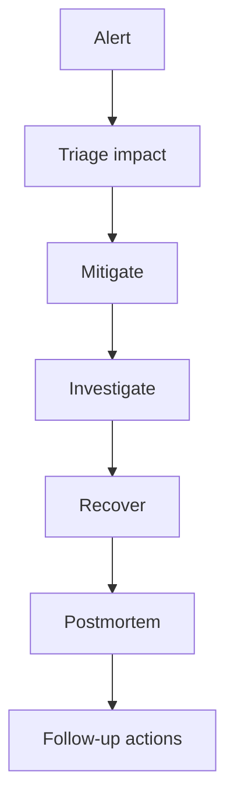

On-call trong Data Engineering có một điểm khó: pipeline có thể báo xanh nhưng dữ liệu vẫn sai. Job chạy xong không đồng nghĩa dashboard đúng. Vì vậy trực on-call cho dữ liệu cần kết hợp monitoring hạ tầng, data quality và hiểu biết nghiệp vụ. Phần monitoring của Google SRE nhấn mạnh tín hiệu phải dẫn đến hành động, còn dữ liệu thì cần thêm các tín hiệu riêng như freshness, completeness và reconciliation: [Monitoring Distributed Systems](https://sre.google/sre-book/monitoring-distributed-systems/).

Đọc trong site trước khi áp dụng: [Alerting Incident Response](/concepts/7-dataops-orchestration-quality/alerting-incident-response/), [Data Observability](/concepts/7-dataops-orchestration-quality/data-observability/), [Freshness Monitoring](/concepts/7-dataops-orchestration-quality/freshness-monitoring/), [Data Reconciliation](/concepts/7-dataops-orchestration-quality/data-reconciliation/).

Mục tiêu của on-call không phải là “không bao giờ có sự cố”. Mục tiêu là phát hiện sớm, giảm tác động nhanh, học được sau sự cố và làm hệ thống bớt mong manh.

## 1. Định nghĩa điều gì đáng gọi người dậy

Alert tốt phải gắn với tác động. Đừng page người trực chỉ vì một metric hơi lạ nếu không có hậu quả rõ.

Ví dụ alert đáng page:

- Bảng doanh thu ngày không cập nhật trước SLA.
- Pipeline payment reconciliation lệch vượt ngưỡng.
- Streaming fraud signal lag quá mức trong giờ giao dịch.
- Schema breaking change làm nhiều downstream fail.

Ví dụ chỉ nên tạo ticket:

- Một dashboard ít dùng trễ 10 phút.
- Warning về volume nhỏ nhưng không ảnh hưởng SLA.
- Test phụ fail ở môi trường dev.

## 2. SLI, SLO cho dữ liệu

| SLI | Ví dụ |
|---|---|
| Freshness | `fct_orders` cập nhật trong vòng 60 phút. |
| Completeness | Số order trong mart lệch raw không quá 0.1%. |
| Validity | `paid_amount >= 0`, `order_status` trong enum hợp lệ. |
| Availability | Dashboard/API dữ liệu trả lời thành công. |
| Latency | Event từ Kafka đến serving table dưới 2 phút p95. |

SLO giúp team thống nhất mức đủ tốt. Không có SLO, mọi sự cố đều dễ bị kéo thành khẩn cấp.

Liên quan trong site: [Retries SLA](/concepts/7-dataops-orchestration-quality/retries-sla/), [Volume Anomalies](/concepts/7-dataops-orchestration-quality/volume-anomalies/), [Distribution Drift](/concepts/7-dataops-orchestration-quality/distribution-drift/).

## 3. Runbook tối thiểu

Mỗi pipeline quan trọng nên có runbook trả lời:

- Dashboard hoặc bảng nào bị ảnh hưởng?
- Người dùng downstream là ai?
- Kiểm tra freshness ở đâu?
- Kiểm tra log task nào trước?
- Có thể rerun partition nào?
- Có snapshot hoặc bảng backup không?
- Khi nào cần escalation?

Runbook tốt viết cho người đang căng thẳng, không viết cho người có cả buổi chiều để đọc.

## 4. Quy trình xử lý sự cố

Thứ tự quan trọng:

1. Triage: xác định tác động và mức độ nghiêm trọng.
2. Mitigate: giảm tác động trước, ví dụ tạm dừng dashboard, rollback model, rerun partition.
3. Communicate: báo tình trạng ngắn, đúng người, đúng nhịp.
4. Investigate: tìm nguyên nhân sau khi tác động đã được kiểm soát.
5. Follow-up: thêm test, alert, guardrail hoặc thay đổi thiết kế.

## 5. Kịch bản luyện tập: bảng doanh thu chưa cập nhật trước SLA

Áp quy trình trên vào một ca trực điển hình. Alert lúc 07:00: `fct_revenue` quá hạn freshness (SLA 06:30), dashboard ban giám đốc được xem lúc 08:00.

| Thời điểm | Hành động | Ghi chú |
|---|---|---|
| 07:00 | Triage: xác định dashboard bị ảnh hưởng và deadline 08:00. | Nghiêm trọng, còn 60 phút. |
| 07:05 | Khoanh vùng trong Airflow: task `load_payments` retry lần 3 do timeout API cổng thanh toán. | Các nhánh khác đã chạy xong. |
| 07:10 | Mitigate: cho pipeline chạy tiếp, bỏ qua nhánh payment (khoảng 10% doanh thu), ghi chú rõ trên dashboard. | Giảm tác động trước, điều tra sau. |
| 07:25 | Báo vào kênh trạng thái: hiện tượng, tác động, thời gian dự kiến khắc phục. | Chủ động trước khi người dùng phát hiện. |
| 07:40 | API phục hồi, rerun đúng partition của nhánh payment, chạy reconciliation. | Khôi phục đầy đủ. |
| Sau sự cố | Ticket follow-up: thêm timeout và circuit breaker cho connector, alert sớm hơn 30 phút. | Chống tái diễn. |

Ba điểm đáng chú ý: người trực không sửa nguyên nhân gốc trong giờ cao điểm (API của vendor, không tự sửa được), ưu tiên giảm tác động (90% số liệu đúng giờ tốt hơn 100% số liệu trễ 3 tiếng), và giao tiếp chủ động. Đây là khác biệt giữa on-call có quy trình và on-call chữa cháy.

## 6. Lỗi đặc thù Data Engineering

| Lỗi | Cách nghĩ |
|---|---|
| Dữ liệu trễ | Kiểm tra source, lịch chạy, partition mới nhất, late event. |
| Dữ liệu trùng | Kiểm tra idempotency, retry, key, merge condition. |
| Số liệu lệch | Reconcile raw, staging, mart theo từng bước. |
| Job chậm | Kiểm tra data volume, skew, shuffle, warehouse queue, small files. |
| Schema drift | Kiểm tra source change, contract, parser, downstream tests. |
| Alert nhiễu | Xem alert có gắn với user impact không. |

Liên quan trong site: [Schema Drift](/concepts/7-dataops-orchestration-quality/schema-drift/), [Data Skew](/concepts/4-compute-engines-batch/data-skew/), [Kafka Consumer Lag Rebalance](/concepts/5-stream-processing-realtime/kafka-consumer-lag-rebalance/), [Root Cause Analysis](/concepts/7-dataops-orchestration-quality/root-cause-analysis/).

## 7. Giữ on-call bền vững

- Không để một người là “bộ nhớ sống” duy nhất của hệ thống.
- Sau mỗi sự cố, cải thiện runbook hoặc automation.
- Theo dõi alert noise và xóa alert không tạo hành động.
- Chia rotation công bằng, có backup rõ.
- Tách việc khẩn cấp khỏi ticket cải tiến dài hạn.

## References

- [Being On-Call](https://sre.google/sre-book/being-on-call/) - Google SRE.
- [Managing Incidents](https://sre.google/sre-book/managing-incidents/) - Google SRE.
- [Monitoring Distributed Systems](https://sre.google/sre-book/monitoring-distributed-systems/) - Google SRE.
- [Postmortem Culture](https://sre.google/sre-book/postmortem-culture/) - Google SRE.
- [DORA metrics](https://dora.dev/guides/dora-metrics/) - DORA.
