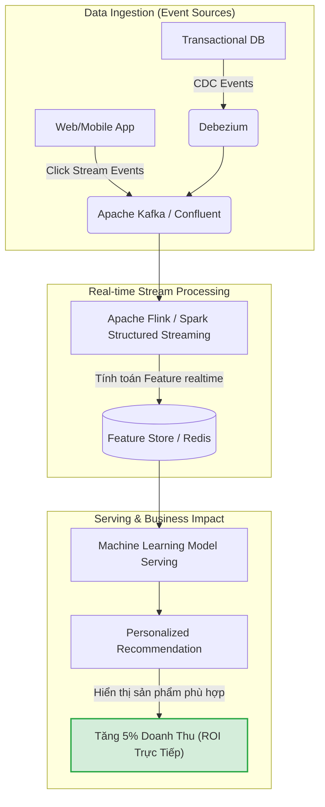

Một trong những thách thức lớn nhất và mang tính sống còn của các đội ngũ Data Engineering hiện đại là chứng minh được **Giá Trị Hoàn Lại (ROI - Return on Investment)** cho tổ chức. 

Khác với Software Engineering (tạo ra sản phẩm người dùng trực tiếp trải nghiệm và trả tiền) hay Sales (mang lại doanh thu trực tiếp), Data Engineering thường được xem là một "hậu phương" thầm lặng. Khi dữ liệu được cập nhật đúng giờ, báo cáo chính xác, hạ tầng hoạt động trơn tru—không ai để ý. Nhưng khi ngân sách cạn kiệt, khủng hoảng kinh tế nổ ra (như trong giai đoạn *Tech Winter*), Data Team thường là mục tiêu bị nhắm đến và cắt giảm đầu tiên vì thường bị lãnh đạo xem là một **"Cost Center"** (Trung tâm tiêu tiền) khổng lồ.

Làm thế nào để thay đổi góc nhìn này? Làm thế nào để một Data Engineer không chỉ là "thợ gõ code" mà trở thành một đối tác chiến lược của doanh nghiệp? Câu trả lời nằm ở khả năng chứng minh **Business Value**.

---

## 1. Dịch Chuyển Tư Duy Cốt Lõi: Từ "Cost Center" sang "Value Enabler"

> [!IMPORTANT]
> **Sự thật phũ phàng:** Ban giám đốc (C-Level) và các bên liên quan (Stakeholders) không quan tâm đến việc bạn dùng Apache Spark hay Pandas. Họ không quan tâm bạn dùng Lambda Architecture hay Kappa Architecture. Họ chỉ quan tâm đến ba thứ: **Tăng doanh thu, Giảm chi phí, và Tránh rủi ro.**

Để tồn tại và thăng tiến, đặc biệt ở cấp độ Senior/Staff Engineer hay Data Manager, bạn phải thành thạo việc ánh xạ (mapping) các nỗ lực kỹ thuật (Technical Outputs) thành các kết quả kinh doanh (Business Outcomes).

### Khung Ánh Xạ Giá Trị (Value Mapping Framework)

Hãy thay đổi cách bạn báo cáo và giao tiếp. Thay vì nói về công nghệ, hãy nói về tác động:

| Báo Cáo Kỹ Thuật (Nên Tránh) | Báo Cáo Kinh Doanh (Nên Dùng) | Tác Động (Business Impact) |
| :--- | :--- | :--- |
| "Em vừa chuyển Pipeline từ Pandas sang Spark, giảm thời gian chạy từ 4 tiếng xuống 15 phút." | "Dữ liệu báo cáo hiện đã sẵn sàng lúc 7h sáng thay vì 11h trưa. Team Marketing có thể điều chỉnh chiến dịch quảng cáo ngay lập tức." | **Tăng tỷ lệ chuyển đổi (Conversion), tối ưu hóa Ad Spend.** |
| "Chúng ta đã chuyển định dạng lưu trữ từ JSON sang Parquet trên S3." | "Hệ thống lưu trữ mới giúp nén dữ liệu tốt hơn, tiết kiệm trực tiếp $5,000 tiền AWS mỗi tháng." | **Cắt giảm chi phí (Cost Reduction).** |
| "Em vừa tích hợp Monte Carlo / Great Expectations vào Data Pipeline." | "Hệ thống cảnh báo mới đã phát hiện và chặn dữ liệu lỗi trước khi gửi lên báo cáo tài chính, tránh nguy cơ báo cáo sai lệch doanh thu." | **Giảm thiểu rủi ro (Risk Mitigation).** |

---

## 2. Ba Trụ Cột Đo Lường ROI Của Data Pipeline

Để định lượng được giá trị của một hệ thống dữ liệu, chúng ta dựa vào ba trụ cột chính yếu. Mọi pipeline dữ liệu bạn xây dựng đều phải phục vụ ít nhất một trong ba mục tiêu này.

### A. Tăng Trưởng Doanh Thu (Revenue Generation)

Dữ liệu của bạn có trực tiếp tạo ra tiền không? Trong các công ty công nghệ, Data Pipeline chính là huyết mạch nuôi dưỡng các mô hình học máy (Machine Learning) và AI.

**Ví dụ thực tế: Hệ thống Gợi ý Sản phẩm (Real-time Recommendation Engine)**
Một website thương mại điện tử cần hiển thị sản phẩm liên quan ngay khi người dùng đang lướt web. Việc hiển thị đúng sản phẩm có thể tăng tỷ lệ chuyển đổi (Click-Through Rate - CTR) thêm 2-5%, mang lại hàng triệu USD doanh thu.

Để làm được điều này, Data Engineer phải thiết kế một kiến trúc xử lý luồng dữ liệu (Stream Processing) cực kỳ tối ưu:



**Cách chứng minh ROI trong trường hợp này:**
Bạn kết hợp với Data Scientist để thực hiện A/B Testing. Tập người dùng A được phục vụ bởi hệ thống cũ (Batch - cập nhật mỗi 24h). Tập người dùng B được phục vụ bởi kiến trúc Real-time Kafka/Flink mới. Nếu doanh thu của tập B cao hơn tập A là $X/tháng, trong khi chi phí vận hành Kafka/Flink là $Y/tháng.
$\Rightarrow ROI = (X - Y) / Y \times 100\%$.

### B. Tối Ưu Hóa & Cắt Giảm Chi Phí (Cost Reduction & FinOps)

Đây là trụ cột mà Data Engineer có toàn quyền kiểm soát và dễ dàng chứng minh nhất. Data FinOps (Financial Operations cho dữ liệu) là một kỹ năng bắt buộc.

#### 1. Tối ưu hóa Data Warehouse (BigQuery / Snowflake)
Nhiều Data Analyst thường viết các câu query "quét toàn bộ bảng" (Full Table Scan), gây lãng phí hàng ngàn USD tiền tính toán (Compute) trên đám mây. Data Engineer giải quyết bài toán này bằng cách thiết kế lại Data Model, áp dụng **Partitioning** và **Clustering**.

```sql
-- [BAD PRACTICE] Truy vấn quét toàn bộ dữ liệu (Chi phí cực kỳ cao)
-- Nếu bảng `events` có dung lượng 10TB, truy vấn này sẽ bị tính tiền 10TB dù chỉ lọc 1 ngày.
SELECT user_id, count(event_name) 
FROM `project.dataset.events` 
WHERE event_date = '2023-10-01' AND country = 'VN'
GROUP BY 1;

-- [GOOD PRACTICE] Xây dựng bảng có Partitioning và Clustering
CREATE TABLE `project.dataset.events_optimized`
PARTITION BY event_date
CLUSTER BY country, user_id
AS SELECT * FROM `project.dataset.events`;

-- Khi truy vấn trên bảng `events_optimized`, hệ thống chỉ quét đúng partition của ngày '2023-10-01'
-- và dùng Clustering để lọc nhanh 'VN'. Lượng dữ liệu quét giảm từ 10TB xuống còn 10GB (Tiết kiệm 99.9% chi phí).
```

#### 2. Tối ưu hóa Data Lakehouse (Delta Lake / Apache Iceberg)
Một trong những nguyên nhân đốt tiền lớn nhất trên Data Lake (S3/GCS) là vấn đề **Small Files Problem** (Quá nhiều file kích thước nhỏ). Mỗi lần truy vấn, bộ máy tính toán (Spark/Trino) phải mở hàng triệu file, tốn chi phí I/O (PUT/GET requests trên S3) và làm chậm hệ thống đi hàng chục lần.

> [!TIP]
> Bằng cách áp dụng các lệnh dọn dẹp và gom cụm (Compaction & Z-Ordering), bạn có thể giảm kích thước lưu trữ và tăng tốc độ đọc lên đáng kể.

Thuật toán Z-Ordering ánh xạ dữ liệu đa chiều (multi-dimensional) vào không gian một chiều để tối đa hóa tính địa phương (data locality). Kết hợp với thống kê Min-Max lưu trong footer của file Parquet, hệ thống có thể bỏ qua hoàn toàn các file không chứa dữ liệu cần thiết (Data Skipping).

```python
# Đoạn code PySpark thực hiện tối ưu hóa bảng Delta Lake định kỳ
# Gom các file nhỏ thành file lớn (Compaction)
# Sắp xếp dữ liệu theo Z-order trên các cột thường được query nhiều nhất
spark.sql("""
    OPTIMIZE delta.`s3a://data-lake/production/events`
    ZORDER BY (country_code, event_type)
""")
```

**Chứng minh ROI:** "Việc chạy tác vụ Compaction và Z-Ordering tốn $50 chi phí compute mỗi tuần, nhưng nó đã làm giảm chi phí AWS S3 GET/PUT đi $1,500/tuần và giảm thời gian chạy các BI Dashboard từ 3 phút xuống còn 15 giây."

### C. Giảm Thiểu Rủi Ro (Risk Mitigation & Data Observability)

Dữ liệu sai lệch (Data Downtime / Bad Data) có giá rất đắt. Hãy tưởng tượng:
- Một lỗi pipeline nhân đôi dữ liệu doanh số, làm cho CEO ra quyết định mở rộng chi nhánh sai lầm.
- Dữ liệu khách hàng bị thiếu sót, dẫn đến việc gửi nhầm email quảng cáo vi phạm quyền riêng tư (GDPR), đối mặt với mức phạt hàng triệu USD.

Đầu tư vào **Data Quality** và **Data Contracts** chính là một khoản mua bảo hiểm.

```yaml
# Ví dụ về Data Contract sử dụng thư viện Soda Core
# Data Engineer định nghĩa các quy tắc kiểm tra tự động trong CI/CD pipeline
checks for fct_financial_transactions:
  # Doanh thu không bao giờ được phép âm
  - min(transaction_amount) >= 0:
      name: Doanh thu phải luôn là số dương
  # Không được phép có giao dịch trùng lặp (tránh tính tiền 2 lần)
  - duplicate_count(transaction_id) = 0:
      name: Đảm bảo tính duy nhất của ID giao dịch
  # Tỷ lệ giá trị null của cột quan trọng phải thấp
  - missing_percent(customer_id) < 1%:
      name: Tỷ lệ khách hàng không xác định dưới 1%
```

**Chứng minh ROI:** "Hệ thống Data Observability mới đã tự động chặn 14 pipeline mang dữ liệu lỗi lên production trong quý vừa qua. Dựa trên ước tính thiệt hại trung bình $5,000/sự cố do báo cáo sai lệch, hệ thống đã giúp công ty tránh được khoản rủi ro lên tới $70,000."

---

## 3. Data FinOps: Triển Khai Hệ Thống Giám Sát Chi Phí

Bạn không thể tối ưu hóa thứ mà bạn không thể đo lường. Để chứng minh ROI, bạn cần chỉ ra rõ ràng từng luồng dữ liệu (pipeline) đang tiêu tốn bao nhiêu tiền.

**Giải pháp:** Áp dụng chiến lược **Tagging / Attribution** thông qua các công cụ chuyển đổi như dbt (data build tool).

Bằng cách gắn thẻ (tags) vào mỗi mô hình dữ liệu (data model), bạn có thể xuất báo cáo chi phí đám mây (Billing Export) và nhóm chúng lại theo từng phòng ban.

```yaml
# Cấu hình dbt_project.yml
models:
  my_data_warehouse:
    marketing_marts:
      +query_tag: "pipeline:marketing_roi_dashboard"
      +labels:
        department: "marketing"
        criticality: "high"
        owner: "data_team_a"
        
    experimental_models:
      +query_tag: "pipeline:data_science_experiment"
      +labels:
        department: "data_science"
        criticality: "low"
```

Khi nhìn vào Dashboard FinOps, nếu bạn thấy bảng `marketing_roi_dashboard` tiêu tốn $2,000/tháng nhưng mang lại hiểu biết giúp tối ưu $50,000 ngân sách quảng cáo -> ROI dương. Nếu `data_science_experiment` tiêu tốn $3,000/tháng nhưng đã hơn 3 tháng chưa ra được mô hình nào -> Bạn có cơ sở dữ liệu thực tế để đề xuất cắt giảm tài nguyên.

---

## 4. Dữ Liệu Như Một Sản Phẩm (Data As A Product - DaaP)

Thay vì tư duy "tôi đang xây dựng một bảng trong database", hãy tư duy "tôi đang xây dựng một sản phẩm phần mềm và dữ liệu là tính năng cốt lõi". Áp dụng các chỉ số quản lý sản phẩm (Product Metrics) để đo lường ROI.

### Các Chỉ Số Thành Công Của Data Product
1. **Usage Metrics (Chỉ số sử dụng):** Bảng dữ liệu của bạn có bao nhiêu lượt truy vấn mỗi tuần (Weekly Query Volume)? Có bao nhiêu người dùng (MAU - Monthly Active Users) đang xem Dashboard được cấp nguồn từ pipeline của bạn? Nếu một Data Mart được xây dựng tốn kém nhưng không ai dùng trong 30 ngày -> Phế phẩm, cần deprecate (loại bỏ) để tiết kiệm chi phí.
2. **NPS (Net Promoter Score) Nội bộ:** Khảo sát định kỳ các Data Analyst và Business User: "Bạn đánh giá nền tảng dữ liệu hiện tại bao nhiêu điểm trên thang 1-10?".
3. **Time-to-Market (TTM):** Thời gian trung bình từ khi team Business yêu cầu một trường dữ liệu mới (new feature) cho đến khi nó sẵn sàng trên Data Warehouse là bao lâu? (Tính bằng ngày hay bằng tháng?).

### Xây Dựng SLAs, SLOs, và SLIs Cho Pipeline

> [!NOTE]
> Một sản phẩm tốt phải đáng tin cậy. Dữ liệu dù tốt đến đâu nhưng nếu bị trễ (late data) sẽ biến thành vô giá trị, làm mất uy tín (Trust) của Data Team, dẫn đến việc người dùng quay lại dùng Excel thủ công (Shadow IT).

| Khái niệm | Định nghĩa trong Data Engineering | Ví dụ thực tế |
| :--- | :--- | :--- |
| **SLA** (Service Level Agreement) | Cam kết kinh doanh với các bên liên quan. Trễ SLA thường đi kèm với hình phạt hoặc mất uy tín nghiêm trọng. | "Bảng dữ liệu doanh thu hàng ngày phải sẵn sàng 100% trước 8:00 AM mỗi sáng." |
| **SLO** (Service Level Objective) | Mục tiêu nội bộ khắt khe hơn SLA để đảm bảo an toàn (buffer). | "Mục tiêu: Bảng dữ liệu doanh thu sẵn sàng trước 7:30 AM cho 99% số ngày trong tháng." |
| **SLI** (Service Level Indicator) | Chỉ số thực tế đang được đo lường tự động bởi hệ thống theo dõi (Observability). | "Tháng này, bảng doanh thu đã cập nhật thành công lúc 7:25 AM với tỷ lệ thành công 98.5%." |

---

## 5. Công Thức Tính Toán ROI Cụ Thể (The Math of Data ROI)

Khi cần trình bày với C-Level, hãy chuẩn bị một bản nháp tính toán chi tiết dựa trên công thức tài chính tiêu chuẩn:

$$
\text{ROI (\%)} = \left( \frac{\text{Tổng Lợi Ích (Total Benefits)} - \text{Tổng Chi Phí (Total Cost of Ownership)}}{\text{Tổng Chi Phí (Total Cost of Ownership)}} \right) \times 100
$$

### Bước 1: Tính TCO (Total Cost of Ownership - Tổng chi phí sở hữu)
Tính tổng chi phí hàng năm (hoặc hàng tháng):
*   **Hạ tầng đám mây (Cloud Infrastructure):** Chi phí Compute (EC2, Databricks, Snowflake credits, BigQuery slots), Storage (S3, GCS), và Network Egress. Giả sử: $100,000/năm.
*   **Chi phí phần mềm & SaaS:** License của Fivetran, dbt Cloud, Airflow (Astronomer), Tableau/Looker, Monte Carlo. Giả sử: $50,000/năm.
*   **Chi phí nhân sự (People/Engineering Costs):** Lương của đội ngũ Data Engineer, Platform Engineer duy trì hệ thống. Giả sử: $150,000/năm.
*   **Tổng TCO:** $300,000/năm.

### Bước 2: Tính Lợi Ích (Total Benefits)
Lợi ích bao gồm cả những khoản trực tiếp và gián tiếp (phải ước lượng):
*   **Lợi nhuận tăng thêm (Revenue Uplift):** Hệ thống Data thúc đẩy các chiến dịch Marketing nhắm mục tiêu chuẩn xác hơn, tăng 2% doanh thu tổng $\approx$ $200,000/năm.
*   **Cắt giảm chi phí trực tiếp (Direct Cost Savings):** Pipeline tự động đóng các server rảnh rỗi, thiết kế lại kiến trúc Data Warehouse giúp giảm $\approx$ $60,000/năm.
*   **Năng suất nhân sự (Productivity Gain):** Tự động hóa quá trình làm báo cáo thủ công. Tiết kiệm 20 giờ/tuần cho 5 nhân viên Kế toán và Vận hành. (100 giờ x 52 tuần x $40/giờ) $\approx$ $208,000/năm.
*   **Tổng Lợi Ích:** $468,000/năm.

### Bước 3: Tính Toán
$$
\text{ROI} = \left( \frac{468,000 - 300,000}{300,000} \right) \times 100 = \textbf{56\%}
$$
Kết luận cho C-Level: *Với mỗi $1 công ty đầu tư vào Data Team và Data Platform, công ty thu về $1.56 giá trị trong cùng năm đó.* Đây là một con số thuyết phục không thể chối cãi.

---

## 6. Lời Kết

Chứng minh ROI không phải là công việc chỉ làm một lần vào cuối năm để xin ngân sách. Nó phải trở thành một phần cốt lõi trong tư duy kỹ thuật (Engineering Culture) hàng ngày. 

Trước khi bắt tay vào code, viết một DAG trên Airflow hay xây một bảng trên dbt, Data Engineer xuất sắc sẽ dừng lại và tự hỏi: *"Bảng dữ liệu này giải quyết bài toán gì? Làm sao tôi biết nó tạo ra giá trị? Và tôi sẽ đo lường giá trị đó như thế nào?"*.

Chính tư duy này là ranh giới mỏng manh phân định giữa một "Thợ gõ code SQL/Python" dễ dàng bị thay thế bởi AI, và một **Senior/Staff Data Engineer** - đối tác chiến lược không thể thiếu của doanh nghiệp.

---

## Tài Liệu Tham Khảo Nâng Cao

Để tiếp tục đi sâu vào các khái niệm được đề cập trong bài viết, bạn có thể tham khảo các nguồn tài liệu và tác phẩm kinh điển sau:

1. **[Staff Engineer: Leadership beyond the management track](https://staffeng.com/) - Will Larson:** Sách gối đầu giường để hiểu cách các Staff Engineer tạo ra tầm ảnh hưởng và chứng minh giá trị kỹ thuật cho toàn bộ tổ chức.
2. ****Fundamentals of Data Engineering** - Joe Reis & Matt Housley:** Bao quát vòng đời dữ liệu và nhấn mạnh vào việc kiến trúc hệ thống phục vụ mục tiêu kinh doanh.
3. ****Data Mesh: Delivering Data-Driven Value at Scale** - Zhamak Dehghani:** Định hình rõ ràng khái niệm *Data As A Product*.
4. ****Cloud FinOps: Collaborative, Real-Time Cloud Financial Management** - J.R. Storment & Mike Fuller:** Chuyên sâu về cách kiểm soát chi phí đám mây, Tagging và Tối ưu hóa hạ tầng.
5. **[The Pragmatic Engineer](https://blog.pragmaticengineer.com/) - Gergely Orosz:** Blog kỹ thuật uy tín cung cấp góc nhìn về cách các công ty Big Tech đo lường hiệu suất và tác động của kỹ sư.
6. ****Building Data Infrastructure at Airbnb** - Airbnb Tech Blog:** Case study kinh điển về sự tiến hóa của nền tảng dữ liệu tại một trong những công ty hàng đầu.
