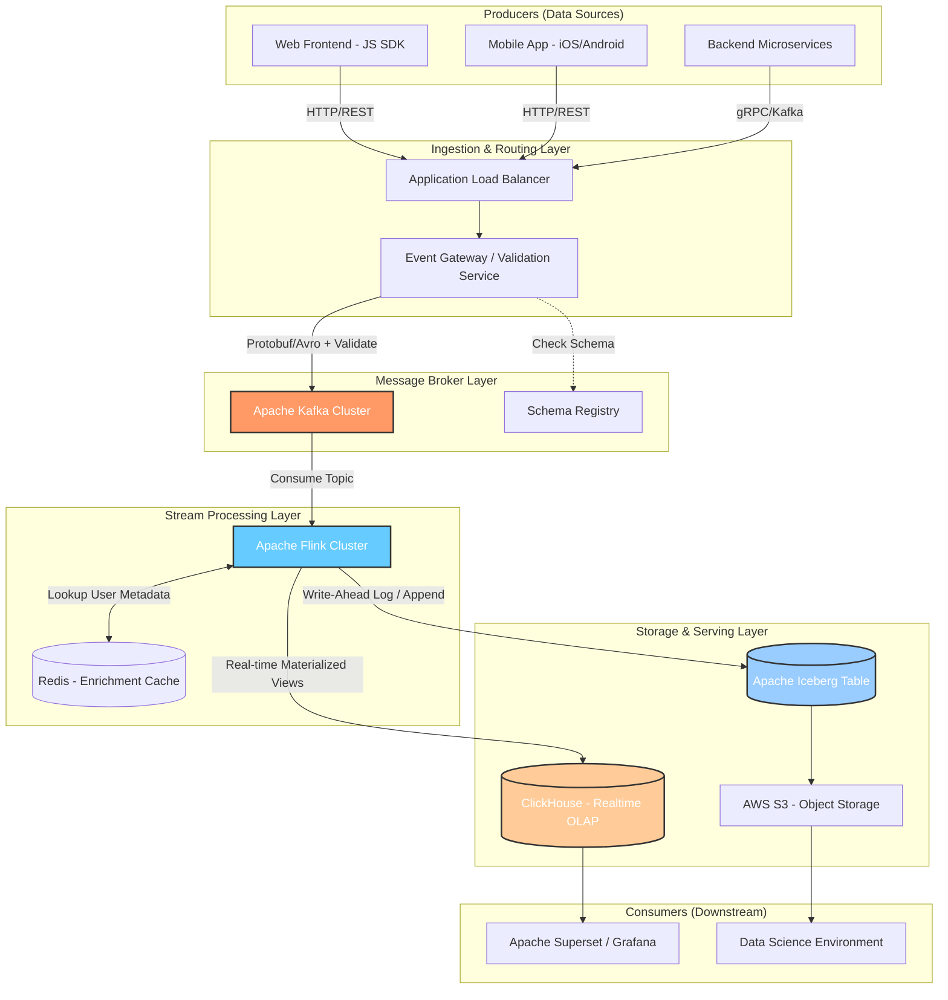

Khả năng viết tài liệu thiết kế (Design Docs) hoặc Yêu cầu bình luận (RFC - Request for Comments) là lằn ranh rõ ràng nhất phân định một Middle Engineer với một Senior, Staff hoặc Principal Engineer. Trong ngành kỹ thuật phần mềm và dữ liệu, code có thể bị refactor, thay thế hoặc vứt bỏ chỉ sau vài năm, nhưng những quyết định kiến trúc cốt lõi được ghi lại sẽ trở thành nền móng sống mãi cùng vòng đời của tổ chức. Tại các tập đoàn công nghệ hàng đầu (FAANG), văn hóa này được nâng tầm thành một "nghi thức" bắt buộc — ví dụ như các tài liệu "6-pager" khét tiếng tại Amazon, thay thế hoàn toàn cho các bài thuyết trình PowerPoint màu mè nhưng thiếu chiều sâu.

Bài viết này sẽ đưa bạn vào một hành trình chuyên sâu (deep-dive) về nghệ thuật viết Design Doc, cung cấp các frameworks, case study thực tế, và các kỹ năng phân tích hệ thống (System Design) mà một kỹ sư hàng đầu cần có.

---

## 1. Triết Lý Đằng Sau Design Docs: Tại Sao Code Ngay Lại Là Thảm Họa?

Nhiều kỹ sư có thói quen nhận yêu cầu (requirement) là ngay lập tức mở IDE lên và bắt đầu gõ code. Đây là một *antipattern* chết người trong các hệ thống quy mô lớn. Khi bắt tay vào một dự án lớn — chẳng hạn như xây dựng một Data Lakehouse mới, chuyển đổi hệ thống Orchestration từ Apache Airflow sang Dagster, hay thiết kế một hệ thống Event-driven Microservices — rủi ro lớn nhất **không nằm ở việc bạn viết code có bug, mà nằm ở việc bạn chọn sai kiến trúc ngay từ vạch xuất phát**.

### 1.1. Khắc Phục Rủi Ro Kiến Trúc (Architectural Risk Mitigation)
Sửa một dòng code mất vài phút. Đổi một thư viện mất vài ngày. Nhưng thay đổi một quyết định về cơ sở dữ liệu cốt lõi (ví dụ: chuyển từ Relational Database sang NoSQL Cassandra) hay kiến trúc xử lý (từ Batch processing sang Stream processing) có thể tốn của tổ chức hàng năm trời và hàng triệu đô la. Design Doc ép bạn phải tư duy sâu (Shift-Left in Design) trước khi cam kết nguồn lực. 

### 1.2. Mở Rộng Trí Tuệ Tập Thể (Crowdsourcing Intelligence)
Bạn không thể biết tất cả mọi thứ. Đưa ý tưởng của bạn ra ánh sáng dưới dạng một bản nháp (Draft) để các Senior/Staff Engineers khác "bắn tỉa" (review) giúp phát hiện những lỗ hổng (edge cases) mà một cá nhân khó lòng nhìn thấy. Quá trình này biến một ý tưởng cá nhân thành một thiết kế kiên cố được bảo chứng bởi tập thể. Kiến trúc sư giỏi không phải là người tự nghĩ ra giải pháp hoàn hảo nhất, mà là người biết tổng hợp các phản biện để tinh chỉnh giải pháp.

### 1.3. Căn Chỉnh Mục Tiêu (Alignment) và Quản Lý Phạm Vi (Scope Management)
Một Design Doc tốt không chỉ dành cho kỹ sư. Nó giúp Product Managers, Data Scientists, và Business Stakeholders hiểu rõ hệ thống mới sẽ giải quyết bài toán gì, mang lại giá trị nào, và quan trọng nhất là: **giới hạn của nó đến đâu**. Nó là công cụ tối thượng để chống lại *Scope Creep* (hiện tượng phình to yêu cầu dự án mất kiểm soát).

### 1.4. Di Sản Kiến Thức (ADR - Architecture Decision Records)
Hệ thống là kết quả của vô số sự thỏa hiệp (trade-offs). Ghi lại *tại sao* 2 năm trước team lại quyết định dùng Apache Spark thay vì Apache Flink, hoặc chọn AWS Redshift thay vì Snowflake. Khi những kỹ sư cũ rời đi, Design Doc chính là cuốn biên niên sử giúp người mới (onboarding) hiểu được bối cảnh lịch sử, tránh việc đập đi xây lại hệ thống chỉ vì "thấy kiến trúc cũ hơi lạ" (Hội chứng Not Invented Here).

---

## 2. Giải Phẫu Một Design Doc Chuẩn Kỹ Sư Trưởng (Staff Engineer Standard)

Một Design Doc đẳng cấp không phải là một bài luận văn hàn lâm dài dòng, mà là một tài liệu kỹ thuật có tính thực thi cao. Dưới đây là cấu trúc toàn diện, chi tiết đến từng ngóc ngách của một Design Doc chuẩn mực.

### 2.1. Metadata & Status
Bắt đầu bằng những thông tin cơ bản nhất để người đọc có bối cảnh:
- **Tên dự án:** (Ví dụ: Dự án "Phoenix" - Real-time User Event Ingestion).
- **Tác giả:** Người chịu trách nhiệm chính.
- **Reviewers:** Những người có thẩm quyền phê duyệt (Tech Leads, Staff Engineers, SecOps, DBA).
- **Trạng thái:** Draft / Under Review / Approved / Rejected / Implemented.
- **Ngày tạo & Lần cập nhật cuối.**

### 2.2. Context & Motivation (Bối Cảnh và Động Lực)
Trả lời câu hỏi: *Tại sao chúng ta phải đọc tài liệu này? Vấn đề hiện tại là gì?*
Hãy cung cấp các số liệu định lượng (data-driven) để tạo sức nặng cho lập luận.
> **Ví dụ tồi:** Hệ thống ETL hiện tại quá chậm, chúng ta cần dùng Kafka và Flink để làm nó nhanh hơn.
> 
> **Ví dụ xuất sắc:** Hệ thống Batch ETL hàng ngày (Daily ETL) viết bằng Spark hiện đang xử lý 10TB log sự kiện mỗi ngày. Do khối lượng dữ liệu tăng 20% mỗi tháng, job ETL thường xuyên bị tình trạng Out-Of-Memory (OOM) và hiện tại mất trung bình 8.5 tiếng để hoàn thành. Điều này vi phạm trực tiếp SLA với team Marketing (yêu cầu dữ liệu sẵn sàng trước 8:00 AM) và gây thất thoát khoảng 50,000 USD/tháng do các chiến dịch quảng cáo không được tối ưu kịp thời. Dự án này nhằm tái kiến trúc luồng dữ liệu sang mô hình Real-time Streaming để giải quyết triệt để vấn đề độ trễ.

### 2.3. Goals & Non-Goals (Mục Tiêu và Phi Mục Tiêu)
Đừng bao giờ bỏ qua **Non-Goals**. Chúng là chiếc khiên bảo vệ bạn khỏi những yêu cầu "tiện tay làm luôn" (Gold plating).
- **Goals (Functional & Non-Functional Requirements):**
  - *Functional:* Thu thập, xử lý và làm giàu (enrich) luồng dữ liệu sự kiện clickstream của người dùng theo thời gian thực để phục vụ dashboard Marketing.
  - *Non-Functional:* 
    - **SLA (Độ trễ - Latency):** Thời gian từ lúc sự kiện được sinh ra từ thiết bị đến lúc hiển thị trên Dashboard (End-to-end latency) < 2 phút ở p99.
    - **Throughput:** Hỗ trợ tới 50,000 sự kiện/giây (EPS) trong giờ cao điểm bình thường, và khả năng chịu tải (burst) lên tới 150,000 EPS trong các dịp Flash Sale.
    - **Availability:** 99.99% uptime cho API ingestion.
- **Non-Goals:**
  - Không thay đổi kiến trúc lưu trữ của các dữ liệu giao dịch tài chính (Billing/Payment Data) - vốn yêu cầu tính chính xác tuyệt đối (Exactly-once) và đã có luồng xử lý riêng biệt (Change Data Capture - CDC từ cơ sở dữ liệu OLTP).
  - Không phục vụ mục đích xây dựng hệ thống Recommendation Engine trong Phase 1.

### 2.4. System Architecture & Proposed Solution (Kiến Trúc Hệ Thống Đề Xuất)
Đây là "trái tim" của tài liệu. Trình bày chi tiết giải pháp của bạn, bắt đầu từ một sơ đồ mức cao (High-Level Design - HLD) rồi đi sâu vào thiết kế chi tiết (Low-Level Design - LLD).

**Sử dụng Sơ Đồ Mermaid để minh họa:**
Một sơ đồ rõ ràng giúp người đọc nhanh chóng nắm bắt bức tranh tổng thể. Dưới đây là kiến trúc đề xuất cho hệ thống Streaming Ingestion:



**Mô tả chi tiết các thành phần cốt lõi:**
- **Event Gateway:** Nhận sự kiện từ client, xác thực cấu trúc (Schema Validation), gắn thẻ định danh (Tagging), phân loại và đẩy vào Kafka. Việc chặn dữ liệu "rác" (Bad data) ngay từ cửa ngõ giúp bảo vệ các hệ thống hạ nguồn.
- **Message Broker (Kafka):** Đóng vai trò làm bộ đệm (Buffer & Message backbone). Sử dụng khả năng chia partition của Kafka để mở rộng theo chiều ngang (Horizontal scaling). Cấu hình Retention 7 ngày để đảm bảo khả năng Replay lại dữ liệu khi hệ thống xử lý phía sau có lỗi.
- **Stream Processing (Flink):** Đọc dữ liệu từ Kafka, join với dữ liệu profile người dùng từ Redis (Enrichment), gộp nhóm theo cửa sổ thời gian (Windowing/Aggregation). Flink hỗ trợ Exactly-once state semantics thông qua cơ chế Checkpointing.
- **Serving & Storage Layer:** 
  - **ClickHouse:** Được chọn làm Real-time OLAP Database để phục vụ các Dashboard phân tích cần tốc độ phản hồi cực nhanh (Sub-second query response).
  - **Iceberg trên S3:** Đóng vai trò lưu trữ dài hạn (Cold/Warm Data) làm Single Source of Truth. Định dạng bảng mở Iceberg hỗ trợ ACID transactions trên Data Lake, giải quyết hiệu quả bài toán vỡ file nhỏ (Small files problem) đặc trưng của streaming.

### 2.5. Capacity Planning & Sizing (Quy Hoạch Dung Lượng)
Một Staff Engineer thực thụ không thiết kế dựa trên linh cảm; họ thiết kế dựa trên toán học (Back-of-the-envelope calculations).
- **Traffic ước tính (Throughput):** 50,000 sự kiện / giây (Bình thường), Peak 150,000 sự kiện / giây.
- **Kích thước payload (Payload size):** ~2 KB / sự kiện.
- **Băng thông đầu vào (Ingress Bandwidth):** 50,000 * 2 KB = 100 MB/s. Tại điểm Peak: 300 MB/s.
- **Dung lượng lưu trữ tạm thời (Kafka Storage):** Với lượng dữ liệu khoảng 100 MB/s = 8.6 TB / ngày. Yêu cầu Retention 7 ngày + Replication Factor là 3 $\rightarrow$ Tổng dung lượng ổ cứng yêu cầu cho Kafka Cluster = 8.6 * 7 * 3 $\approx$ 180 TB.
- **Quyết định hạ tầng:** Dựa vào con số 180 TB và 300 MB/s, ta quyết định phân bổ 6 Kafka Brokers (ví dụ dùng máy ảo AWS i3en.2xlarge với NVMe SSD) và chia Topic thành tối thiểu 60 Partitions (để tối ưu tính song song cho Flink Consumers).

### 2.6. Alternatives Considered (Các Phương Án Thay Thế Bị Loại - Phân Tích Trade-offs)
Đây là phần để chứng minh tư duy phản biện. Nếu bạn chỉ đề xuất một giải pháp duy nhất, bạn chưa thực sự phân tích vấn đề. Hãy áp dụng các nguyên lý hệ thống (như CAP Theorem, PACELC Theorem) để biện luận.

| Tiêu Chí Đánh Giá (Trade-offs) | Option 1: Kafka + Flink + ClickHouse/Iceberg (Đề xuất) | Option 2: Kafka + Spark Structured Streaming + Delta Lake | Option 3: AWS Kinesis + AWS Glue + Redshift (Managed Cloud) |
| :--- | :--- | :--- | :--- |
| **Độ trễ (Latency)** | Cực thấp (Sub-second) nhờ kiến trúc True-streaming của Flink. | Thấp đến Trung bình (Micro-batching, từ vài giây đến vài phút). | Trung bình - Phụ thuộc vào chu kỳ của Kinesis Firehose / Glue. |
| **Độ linh hoạt & SQL** | Flink SQL rất mạnh, hỗ trợ Complex Event Processing (CEP). | Spark SQL trưởng thành, cộng đồng lớn, dễ tìm nhân sự. | Redshift SQL chuẩn, tối ưu cho Batch và Ad-hoc query. |
| **Vận hành (Operations)** | Rất phức tạp. Đòi hỏi cấu hình Flink State Management & Checkpointing. | Khá. Đội ngũ hiện tại đã có sẵn kinh nghiệm vận hành Spark. | Rất đơn giản. Hệ sinh thái Serverless/Managed hoàn toàn bởi AWS. |
| **Chi phí (TCO - Total Cost of Ownership)** | Trung bình-Cao. Trả tiền cho Compute cluster chạy 24/7. | Trung bình-Cao. Tương tự như Flink. | Cực cao ở scale lớn (Redshift Compute và Kinesis data transfer rate đắt đỏ). |
| **Lock-in rủi ro** | Thấp. Kiến trúc Open-source, dễ dàng chuyển sang GCP/Azure. | Thấp. | Rất cao. Phụ thuộc hoàn toàn vào hệ sinh thái AWS. |

**Lập luận chuyên sâu (Deep Rationale):** 
"Mặc dù giải pháp Managed của AWS (Option 3) giúp giảm đáng kể công sức vận hành ban đầu (Time-to-market nhanh), nhưng với dự báo quy mô băng thông lên tới 300 MB/s trong dịp Peak, chi phí duy trì Kinesis và Redshift sẽ vượt qua ngân sách hạ tầng (OPEX) cho phép tới 45%. Giữa Option 1 và Option 2, mặc dù Spark quen thuộc với team hơn, nhưng Spark Streaming dùng cơ chế Micro-batching sẽ không thể đáp ứng được các use-case phát sinh trong tương lai đòi hỏi xử lý thời gian thực khắt khe như Fraud Detection (phát hiện gian lận). Do đó, lựa chọn Option 1 (Flink) mang tính chiến lược dài hạn, đánh đổi chi phí vận hành ban đầu (High Operational Overhead) để lấy khả năng mở rộng không giới hạn và độ trễ siêu thấp."

### 2.7. Data Modeling & Giao Diện Giao Tiếp (API Contracts)
Xác định rõ ràng định dạng dữ liệu giao tiếp (Contracts). Trong môi trường hệ thống phân tán (Distributed Systems), sự thay đổi cấu trúc dữ liệu (Schema evolution) mà không kiểm soát tốt là công thức sinh ra thảm họa dữ liệu (Data Downtime).

**Ví dụ về Event Schema sử dụng Apache Avro:**
Sử dụng Avro kết hợp với Confluent Schema Registry đảm bảo tính tương thích ngược (Backward Compatibility) chặt chẽ bằng cách thực thi các quy tắc validation tại runtime.

```json
{
  "namespace": "com.company.events",
  "type": "record",
  "name": "UserClickstreamEvent",
  "fields": [
    { "name": "event_id", "type": "string", "doc": "UUIDv4 unique identifier" },
    { "name": "user_id", "type": "string", "doc": "Hashed user identifier" },
    { "name": "action_type", "type": { "type": "enum", "name": "ActionType", "symbols": ["CLICK", "VIEW", "ADD_TO_CART", "PURCHASE"] } },
    { "name": "event_timestamp", "type": "long", "logicalType": "timestamp-millis" },
    { "name": "device_info", "type": ["null", "string"], "default": null },
    { "name": "properties", "type": { "type": "map", "values": "string" }, "doc": "Key-value attributes" }
  ]
}
```

### 2.8. Security, Privacy & Compliance (Bảo Mật, Quyền Riêng Tư và Tuân Thủ)
Dữ liệu là tài sản, nhưng cũng là quả bom nổ chậm về mặt pháp lý (GDPR, CCPA, PDPA). Trong Design Doc, bạn phải làm rõ:
- **Xác thực và Phân quyền (AuthN/AuthZ):** Không phải dịch vụ nào cũng được đọc/ghi vào Kafka topic. Áp dụng ACLs (Access Control Lists) thông qua SASL/SCRAM kết hợp với mTLS để xác thực định danh của Microservices.
- **Mã hóa (Encryption):** 
  - *Data at Rest (Trạng thái nghỉ):* Mọi dữ liệu trên S3, Kafka volume phải được mã hóa bằng AES-256 qua AWS KMS (Key Management Service).
  - *Data in Transit (Đường truyền):* Bắt buộc dùng TLS 1.2+ cho mọi giao tiếp nội bộ giữa các node.
- **Xử lý Dữ liệu Nhạy cảm (PII - Personally Identifiable Information):** Email và số điện thoại của người dùng bắt buộc phải được băm một chiều (Cryptographic Hashing với Salt) hoặc mã hóa ẩn danh (Data Masking) ngay tại lớp Event Gateway trước khi đẩy vào Message Broker. Xây dựng cơ chế *Tombstone* hoặc tính năng xóa mềm/cứng (Hard-delete) trong Iceberg để đáp ứng quy định "Right to be Forgotten" của người dùng.

### 2.9. Observability, Monitoring, Alerting & DR (Khả Năng Quan Sát và Phục Hồi)
Hệ thống không được coi là hoàn thiện nếu bạn không thể theo dõi nhịp tim của nó.
- **Metrics (Chỉ số đo lường chính):**
  - *Kafka:* `consumer_lag` (Quan trọng bậc nhất - phát hiện nghẽn cổ chai), `bytes_in/bytes_out`, `under_replicated_partitions`.
  - *Flink:* `checkpoint_duration`, `checkpoint_size`, `num_restarts`, `watermark_delay` (Đo lường độ trễ của luồng event time).
- **Logs & Distributed Tracing:** Tập trung logs về hệ thống trung tâm (ELK, Datadog hoặc Grafana Loki). Sử dụng chuẩn OpenTelemetry, truyền TraceID qua HTTP Header và Kafka Headers để vẽ được chính xác hành trình của 1 event đi xuyên qua chục dịch vụ.
- **Disaster Recovery (Kế Hoạch Thảm Họa):**
  - **RPO (Recovery Point Objective):** Bằng 0 (Kafka acks=all, min.insync.replicas=2 đảm bảo không mất message khi mất node).
  - **RTO (Recovery Time Objective):** < 15 phút bằng cách cấu hình Kafka Cluster dàn trải trên 3 Availability Zones (Multi-AZ architecture).

### 2.10. Phân Bổ Triển Khai (Rollout & Rollback Plan)
Tuyệt đối không áp dụng chiến lược "Big Bang Deployment" (triển khai toàn bộ thay thế cái cũ trong một đêm). Mọi rủi ro phải được cô lập (Blast radius reduction).
- **Phase 1 (Shadow Mode / Dark Launch):** Dựng hệ thống Streaming chạy ngầm song song với hệ thống Batch. Cả hai hệ thống độc lập tính toán và ghi ra hai bảng khác nhau. Chạy một luồng Data Validation đối chiếu kết quả giữa Streaming và Batch. Người dùng (Dashboard) vẫn tiếp tục đọc từ bảng Batch cũ.
- **Phase 2 (Canary Release / Blue-Green Deployment):** Thông qua Router (như Envoy proxy hoặc Trino/Presto views), điều phối 10% lượng người dùng truy vấn vào bảng của hệ thống Streaming mới. Đội ngũ Data Quality túc trực theo dõi.
- **Phase 3 (General Availability - GA):** Mở dần lưu lượng (Ramp-up) 25% -> 50% -> 100%. Chính thức deprecate hệ thống Batch cũ.
- **Phương án Rollback:** Nếu phát hiện lỗi tính toán logic nghiêm trọng (như sai lệch số liệu doanh thu), hệ thống có khả năng chuyển đổi view (Update routing) trỏ ngược lại bảng Data Warehouse cũ chỉ bằng một cú click chuột (hoặc 1 lệnh Terraform apply) với downtime gần như bằng không.

*Mã giả (Infrastructure as Code - Terraform) cấu hình Kafka Topic một cách tự động, tuân thủ nguyên lý GitOps:*

```hcl
resource "confluent_kafka_topic" "user_clickstream" {
  kafka_cluster {
    id = confluent_kafka_cluster.main.id
  }
  topic_name       = "raw.user.clickstream.v1"
  partitions_count = 60 # Dựa trên tính toán dung lượng ở trên
  rest_endpoint    = confluent_kafka_cluster.main.rest_endpoint
  credentials {
    key    = confluent_api_key.app-manager-kafka-api-key.id
    secret = confluent_api_key.app-manager-kafka-api-key.secret
  }
  config = {
    "cleanup.policy"                      = "delete"
    "retention.ms"                        = "604800000" # 7 ngày (7 * 24 * 60 * 60 * 1000)
    "min.insync.replicas"                 = "2" # High Availability
    "message.timestamp.type"              = "LogAppendTime"
    "compression.type"                    = "lz4" # Tối ưu dung lượng và băng thông
  }
}
```

---

## 3. Vòng Đời Của Một RFC (The RFC Lifecycle) & Nghệ Thuật Đàm Phán (Negotiation)

Viết ra một Design Doc xuất sắc mới chỉ là 50% khối lượng công việc. 50% còn lại là nghệ thuật thuyết phục tổ chức chấp nhận nó. Tại các Big Tech, giai đoạn này được gọi là RFC (Request for Comments).

### Bước 1: Draft & Xin Phản Hồi Sớm (Early Feedback)
Đừng "chui vào hang" ủ mưu một mình suốt vài tuần. Hãy nhanh chóng viết ra một bản nháp khung sườn (Outline / 1-pager) tập trung vào phần Context, Goals, và High-Level Architecture. Chia sẻ nó cho một số "đồng minh" (Tech Leads, Staff Engineers có tầm ảnh hưởng) để "thử lửa" định hướng. Nếu hướng đi hoàn toàn sai so với chiến lược công ty, bạn nhận ra sớm và tiết kiệm được vô khối thời gian.

### Bước 2: Formal Peer Review (Vòng Đánh Giá Đồng Cấp)
Công khai tài liệu lên hệ thống nội bộ (Confluence, Google Docs, Notion, GitHub Pull Requests) và tag các Stakeholders liên quan. Ở giai đoạn này:
- **Tách biệt cái tôi (Ego) khỏi thiết kế:** Khi nhận được hàng loạt bình luận "Tại sao lại thiết kế cồng kềnh thế này?", "Lựa chọn công nghệ này thật ngớ ngẩn", đừng tự ái cá nhân. Họ đang kiểm thử độ bền của hệ thống, không phải tấn công năng lực của bạn. Hãy phản hồi một cách chuyên nghiệp bằng Dữ Liệu (Data) và Logic, thay vì cảm xúc.
- **Khai thác sức mạnh phản biện:** Chủ động tag các chuyên gia bảo mật (Security Engineers), chuyên gia cơ sở dữ liệu (DBA), Kỹ sư vận hành (DevOps/SRE) để họ chọc ngoáy (poke holes) nhằm tìm ra các điểm mù về bảo mật, hiệu năng, giới hạn cổ chai (bottlenecks).

### Bước 3: Design Review / Architecture Committee Meeting
Với các kiến trúc cốt lõi tác động sâu rộng đến nhiều bộ phận (Cross-team impact), tài liệu có thể phải thông qua một hội đồng kiến trúc sư (Architecture Board). Đây thường là một cuộc họp kéo dài 1 tiếng. 
Nguyên tắc tối thượng: **Trong buổi họp này, Tác giả KHÔNG thuyết trình lại tài liệu.** Mọi người tham dự bắt buộc phải có văn hóa đọc tài liệu trước (Pre-read culture). Cuộc họp chỉ tập trung vào việc thảo luận, đàm phán, và giải quyết các mâu thuẫn khốc liệt (Resolving Conflicts) ở các "Câu hỏi mở" (Open Questions) chưa thể chốt hạ trên văn bản.

### Bước 4: Approved & Execution (Phê Duyệt & Thực Thi)
Sau khi mọi lo ngại (Concerns) đều được giải quyết hoặc đạt được sự đồng thuận chấp nhận rủi ro (Accepted Risks), tài liệu được chuyển trạng thái thành `Approved` (Đã phê duyệt). Các thiết kế trên giấy giờ đây được "băm nhỏ" thành các Epic, Story, Ticket trên Jira và giai đoạn Coding chính thức bắt đầu.

### Bước 5: Post-Mortem & Living Document (Cập Nhật Liên Tục)
Design Doc là một tài liệu sống (Living Document). Trong quá trình code thực tế, nếu bạn va phải một giới hạn công nghệ bất khả kháng và bắt buộc phải chuyển từ ClickHouse sang Apache Druid, **bạn phải quay lại Design Doc và cập nhật tài liệu**. Khi dự án hoàn thành (hoặc thất bại), hãy thêm mục "Lessons Learned" (Bài học kinh nghiệm) để các thế hệ kỹ sư đi sau học hỏi.

---

## 4. Những Cạm Bẫy Phổ Biến (Antipatterns) Kỹ Sư Cần Tránh

1. **Analysis Paralysis (Tê liệt vì phân tích quá mức):** Căn bệnh phổ biến của các kỹ sư cầu toàn. Bạn đọc quá nhiều tài liệu, sa đà vào việc so sánh hàng tá công cụ nhỏ nhặt, dẫn đến bản Design Doc dài lê thê 50 trang nhưng qua 3 tháng vẫn không đưa ra quyết định cuối cùng. Nhớ rằng: Kiến trúc sư giỏi biết khi nào một hệ thống đạt mức "Đủ tốt" (Good Enough) để bắt tay vào làm và liên tục lặp (Iterative Improvement).
2. **Thiết kế theo ủy ban (Design by Committee / Frankenstein Architecture):** Cố gắng làm hài lòng mọi lời nhận xét của mọi Reviewers bằng cách ghép nhặt mỗi ý tưởng một chút. Kết quả là tạo ra một kiến trúc khổng lồ dị dạng, phức tạp một cách vô lý (dùng Kafka làm message queue, dùng thêm Redis Pub/Sub, chèn thêm RabbitMQ ở giữa). Người thiết kế chính (Lead Architect) phải có quan điểm vững vàng (Opinionated), khả năng đàm phán, và nguyên tắc "Disagree and Commit" nổi tiếng của Amazon.
3. **Bỏ quên Non-Functional Requirements (Yêu Cầu Phi Chức Năng):** Quá tập trung vào việc dữ liệu luân chuyển ra sao (Functional) nhưng không đo đếm bài toán mở rộng (Scalability), tính khả dụng (Availability), và chi phí hạ tầng (Cost). Một hệ thống vượt qua bài test hoàn hảo trên môi trường Dev với 100 dòng dữ liệu nhưng lập tức bốc cháy (Crash / OOM) khi chịu tải 10 triệu bản ghi trên Production là minh chứng điển hình của một Design Doc tồi.
4. **Resume-Driven Development (Thiết kế để làm đẹp CV / "Hype-Driven"):** Cố ép việc sử dụng các công nghệ thời thượng đang trend (Kubernetes, Rust, Kafka, LLM, Flink) vào dự án trong khi bài toán thực tế cực kỳ đơn giản và chỉ cần một cronjob Python chạy mỗi đêm kết nối với một database Postgres. "Sự phức tạp (Complexity) là kẻ thù tối thượng của mọi hệ thống." Kỹ sư vĩ đại là người tìm ra cách giải quyết vấn đề phức tạp bằng một thiết kế tinh gọn và đơn giản nhất.

---

## Kết Luận

Nghệ thuật viết tài liệu thiết kế (Design Docs) là một kỹ năng đa chiều. Nó đòi hỏi sự pha trộn tinh tế giữa năng lực kỹ thuật sâu thẳm (Hard skills - System Design, Coding, Cloud Infrastructure), tư duy trình bày logic, cấu trúc (Writing skills), và nghệ thuật đàm phán, quản trị con người (Soft skills). Nó buộc kỹ sư phải bước ra khỏi thế giới an toàn của các dòng lệnh (code syntax) và trình biên dịch (compiler), để đứng vào vị trí của một nhà thiết kế, một kiến trúc sư nhìn nhận hệ thống qua lăng kính của tính hiệu quả, rủi ro kinh doanh, và di sản tổ chức.

Đừng đợi đến khi trở thành Senior/Staff mới bắt đầu viết. Hãy bắt đầu ngay trong dự án tiếp theo của bạn, cho dù nó chỉ là một bản thiết kế 1 trang (1-pager) cho một module nhỏ. Sự chuyển biến trong tư duy hệ thống của bạn sẽ diễn ra ngay từ khi những con chữ đầu tiên được viết xuống.

---
## Tài Liệu Tham Khảo Nâng Cao Cho Việc Học Kiến Trúc

1. **[Staff Engineer: Leadership beyond the management track - Will Larson](https://staffeng.com/)**: Cuốn sách gối đầu giường về tư duy lãnh đạo kỹ thuật và quản lý các dự án tầm cỡ.
2. **[Designing Data-Intensive Applications - Martin Kleppmann](https://dataintensive.net/)**: Được mệnh danh là "Kinh thánh" bắt buộc phải đọc đối với bất kỳ ai làm Data Engineering / Backend. Giải thích cặn kẽ mọi Trade-offs trong thiết kế hệ thống dữ liệu quy mô lớn (CAP Theorem, Transactions, Partitioning).
3. **[The Pragmatic Engineer - Gergely Orosz](https://blog.pragmaticengineer.com/)**: Blog số 1 hiện nay về kỹ nghệ phần mềm. Phân tích rất sâu về văn hóa viết Design Docs từ kinh nghiệm làm việc tại Uber, Skype.
4. ****Fundamentals of Data Engineering - Joe Reis & Matt Housley****: Cuốn sách tạo ra nền tảng, định hình lại nghề Data Engineer hiện đại. Rất phù hợp để tham khảo khi kiến trúc hệ thống dữ liệu.
5. ****A Framework for Architecture Decisions (ADRs) - AWS Prescriptive Guidance****: Phương pháp tiếp cận tiêu chuẩn ngành của AWS về cách thức ghi chép và lưu trữ các quyết định kiến trúc.
6. **[Software Engineering at Google (The SWE Book)](https://abseil.io/resources/swe-book)**: Chương viết về "Design Docs at Google" chia sẻ chi tiết văn hóa thảo luận thiết kế của gã khổng lồ tìm kiếm.
