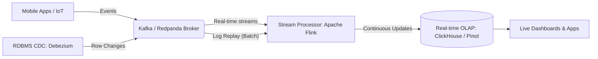
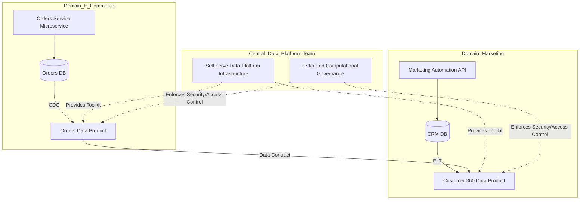

Trong kỷ nguyên số hóa hiện đại, khối lượng, vận tốc và sự đa dạng của dữ liệu đang tăng theo cấp số nhân (Volume, Velocity, Variety - 3Vs của Big Data). Vai trò của một Kỹ sư Dữ liệu (Data Engineer) đã tiến hóa vượt xa việc chỉ viết các đoạn script ETL (Extract, Transform, Load) đơn giản để đẩy dữ liệu từ nguồn A sang đích B. Ngày nay, Kỹ sư Dữ liệu là những kỹ sư phần mềm chuyên biệt hóa, với trọng tâm là thiết kế, xây dựng, tối ưu hóa và vận hành các **hệ thống phân tán (distributed systems)** có khả năng chịu lỗi (fault-tolerant), khả năng mở rộng đàn hồi (highly scalable) và tối ưu hóa chi phí (cost-effective).

Dưới đây là bức tranh toàn cảnh, đi sâu vào chi tiết kỹ thuật về lộ trình học tập và thăng tiến trong lĩnh vực Data Engineering, được thiết kế chuyên sâu từ người mới bắt đầu đến các chuyên gia thiết kế kiến trúc phân tán (Distributed Architecture) và lãnh đạo cấp cao (Engineering Leadership).

---

## 1. Sự Tiến Hóa Vĩ Mô Của Kiến Trúc Dữ Liệu (The Evolution of Data Architectures)

Để hiểu tại sao các lộ trình lại được thiết kế theo cấu trúc cụ thể, chúng ta cần nắm rõ các "kỷ nguyên" của kiến trúc dữ liệu:

1. **Thế hệ thứ 1 (Traditional Data Warehousing - EDW):** Dữ liệu được trích xuất từ các hệ thống vận hành và đưa vào các Hệ quản trị Cơ sở dữ liệu Quan hệ (RDBMS) khổng lồ, nguyên khối (Monolithic) như Oracle, Teradata. Việc xử lý chủ yếu dùng các công cụ ETL kéo-thả (GUI-based ETL) như Informatica hay IBM DataStage. *Khuyết điểm:* Rất khó mở rộng, chi phí cấp phép (licensing) đắt đỏ, và chu kỳ phát triển cực kỳ chậm chạp.
2. **Thế hệ thứ 2 (Hadoop & Big Data Ecosystem):** Trả lời bài toán "Volume" và "Variety", sự bùng nổ của Hadoop, MapReduce và HDFS đánh dấu kỷ nguyên Big Data. Dữ liệu phi cấu trúc (unstructured data) được đẩy trực tiếp vào một **Data Lake**. *Khuyết điểm:* Yêu cầu kỹ năng lập trình MapReduce bằng Java/Scala vô cùng phức tạp, duy trì các cụm máy chủ on-premise là một ác mộng về vận hành (Ops nightmare), và Data Lake thường biến thành "Data Swamp" (đầm lầy dữ liệu) do thiếu kiểm soát chất lượng.
3. **Thế hệ thứ 3 (Cloud-Native & The Modern Data Stack - MDS):** Sự lên ngôi của Cloud Data Warehouses (Snowflake, Google BigQuery, Amazon Redshift) mở ra một mô hình mới: **Phân tách Điện toán và Lưu trữ (Decoupled Compute and Storage)**. Dữ liệu được đẩy thô vào Kho dữ liệu (EL) thông qua Fivetran hoặc Airbyte, và việc biến đổi (Transform) được thực hiện ngay tại Warehouse bằng SQL (thông qua dbt).
4. **Thế hệ thứ 4 (Post-Modern Data Stack / Convergence):** Sự phân định giữa Data Warehouse (xử lý dữ liệu cấu trúc tốt, ACID transactions) và Data Lake (lưu trữ giá rẻ, mọi định dạng) đang dần bị xóa nhòa bởi kiến trúc **Data Lakehouse** (Databricks, Apache Iceberg, Delta Lake). Đi kèm với đó là sự nổi lên của kiến trúc **Data Mesh** phân tán tính sở hữu, và xử lý luồng thời gian thực (Streaming with Apache Flink, Kafka) đang trở nên phổ biến như batch processing.

---

## 2. Các Cấp Độ Chuyên Môn Cốt Lõi (Core Expertise Path)

Hành trình tiến hóa của một kỹ sư là quá trình chuyển dịch trọng tâm từ việc viết mã giải quyết logic kinh doanh sang việc tối ưu hóa cách thức dữ liệu di chuyển giữa bộ nhớ (RAM), CPU, mạng (Network) và đĩa (Disk).

### 2.1. [Beginner Data Engineer](./core-paths/beginner-de.md)
Tại vạch xuất phát, mục tiêu là xây dựng tư duy lập trình phần mềm vững chắc và hiểu cách thức hoạt động cơ bản của cơ sở dữ liệu.
- **Nền tảng Lập trình (Programming Foundation):** Python là ngôn ngữ *de facto*. Không chỉ học cú pháp, mà cần hiểu sâu về Data Structures (Lists, Dictionaries, Sets), OOP, Functional Programming, Generators (để xử lý file lớn mà không bị Out of Memory - OOM).
- **Ngôn ngữ Truy vấn (SQL Mastery):** Vượt ra ngoài `SELECT *`. Cần thấu hiểu Window Functions (hàm cửa sổ), Common Table Expressions (CTEs), Subqueries, Indexing cơ bản, và Execution Plans (cách Database engine chạy query của bạn).
- **Hệ sinh thái OS & CLI:** Bash/Linux, Shell scripting, SSH, và Git (Version Control).
- **Nền tảng Cơ sở dữ liệu:** Phân biệt rõ ràng OLTP (Online Transaction Processing - thiết kế cho ghi chép nhanh, transaction như PostgreSQL/MySQL) và OLAP (Online Analytical Processing - thiết kế cho truy vấn phân tích quét khối lượng dữ liệu lớn).

### 2.2. [Junior to Middle Data Engineer](./core-paths/junior-to-middle-de.md)
Đưa mã nguồn từ máy tính cá nhân lên môi trường Production với độ tin cậy và khả năng tự động hóa cao.
- **Mô hình hóa Dữ liệu (Data Modeling):** Nắm vững phương pháp thiết kế Dimensional Modeling (Kimball), khái niệm về Fact Tables, Dimension Tables (SCD Type 1, 2, 3), và cách chuẩn hóa (Normalization) vs Giải chuẩn hóa (Denormalization).
- **Orchestration (Điều phối quy trình):** Sử dụng Apache Airflow, Dagster, hoặc Prefect. Hiểu sâu về khái niệm **DAG** (Directed Acyclic Graph), tính lũy đẳng (**Idempotency** - chạy pipeline 1 lần hay 100 lần kết quả vẫn không đổi), và Backfilling (chạy lại dữ liệu quá khứ).
- **Xử lý Dữ liệu Phân tán (Distributed Computing):** Bắt đầu làm việc với Apache Spark (PySpark). Hiểu mô hình Master-Worker, Lazy Evaluation, Transformations vs Actions, và cách Spark sử dụng RDD/DataFrames dưới mui xe.
- **Kho dữ liệu đám mây (Cloud Data Warehousing):** Kiến trúc MPP (Massively Parallel Processing). Cách thiết kế Partitions (phân vùng dữ liệu theo ngày) và Clustering (sắp xếp dữ liệu theo các cột thường xuyên được filter) để giảm thiểu lượng dữ liệu quét (Bytes Scanned).
- **Software Engineering Practices:** Thiết lập CI/CD pipelines (GitHub Actions, GitLab CI) cho dữ liệu. Triển khai viết Unit Tests (sử dụng pytest) và Data Tests (kiểm tra tính hợp lệ của dữ liệu).

### 2.3. [Middle to Senior Data Engineer](./core-paths/middle-to-senior-de.md)
Cấp độ Senior yêu cầu khả năng gỡ lỗi hệ thống phức tạp, tối ưu hóa hiệu năng chuyên sâu, thiết kế kiến trúc, và đảm bảo chất lượng dữ liệu ở quy mô lớn (Petabytes).
- **Tối ưu hóa Hệ thống Phân tán (Distributed Systems Optimization):** Giải quyết các bài toán hóc búa của Spark như: Memory Management (Tuning Shuffle), OOM (Out of Memory) issues, Data Skewness (dữ liệu nghiêng đổ dồn về 1 node), áp dụng Broadcast Joins để tối ưu hóa thay vì Shuffle Hash Joins.
- **Data Lakehouse & Open Table Formats:** Sự dịch chuyển từ file Parquet thuần túy sang **Apache Iceberg**, **Delta Lake**, hoặc Apache Hudi. Hiểu cách các định dạng bảng mở (Open Table Formats) này cung cấp các tính năng ACID transactions, Time Travel, và Schema Evolution ngay trên hệ thống lưu trữ Object (S3/GCS/Azure Blob).
- **Khả năng quan sát & Chất lượng Dữ liệu (Data Observability & Quality):** Triển khai Data Contracts (hợp đồng dữ liệu), sử dụng Great Expectations, Monte Carlo, hoặc dbt tests để phát hiện dị thường (Anomaly Detection), theo dõi độ tươi (Data Freshness), và ngăn chặn dữ liệu "rác" chảy vào hạ tầng downstream.
- **Thiết kế Hệ thống (System Design):** Khả năng thiết kế toàn diện một Data Platform. Đánh giá sự đánh đổi giữa Lambda Architecture (song song luồng Batch và Stream) và Kappa Architecture (mọi thứ đều là Stream).

---

## 3. Các Hướng Đi Chuyên Sâu Mở Rộng (Specialized Paths)

Càng tiến sâu vào ngành, tính đa năng (generalist) thường được thay thế bằng sự chuyên môn hóa (specialization). Tùy thuộc vào thiên hướng và nhu cầu của tổ chức, Kỹ sư dữ liệu có thể rẽ theo các nhánh:

### 3.1. [Data Platform Engineer (Data SRE)](./specializations/data-platform-engineer.md)
Data Platform Engineer là sự giao thoa giữa Kỹ sư Dữ liệu và DevOps/SRE (Site Reliability Engineer). Mục tiêu của họ không phải là viết các đường ống ETL để phục vụ nghiệp vụ, mà là xây dựng các nền tảng và công cụ cốt lõi dưới dạng "Self-serve" để các đội nhóm khác (Data Analysts, Data Scientists) tự chủ xây dựng sản phẩm dữ liệu một cách an toàn.

- **Trọng tâm kỹ thuật:** Infrastructure as Code (IaC), Containerization, Cloud Networking (VPC, Subnets, Transit Gateways), IAM Roles & Policies.
- **Công cụ:** Terraform, Kubernetes (K8s), Helm, Docker, ArgoCD, Ansible.

> [!TIP]
> **Ví dụ thực tế: Cấu hình hạ tầng bằng Terraform**
> Một Data Platform Engineer thường viết mã Infrastructure as Code để provisioning tài nguyên một cách chuẩn xác, có thể tái lập lại trên các môi trường (Dev/Staging/Prod).

```hcl
# Ví dụ về Terraform cấu hình S3 Bucket cho Data Lake với vòng đời tự động hóa
resource "aws_s3_bucket" "data_lake" {
  bucket = "company-data-lake-prod-tier1"
}

# Áp dụng Server-Side Encryption
resource "aws_s3_bucket_server_side_encryption_configuration" "lake_encryption" {
  bucket = aws_s3_bucket.data_lake.id
  rule {
    apply_server_side_encryption_by_default {
      sse_algorithm = "AES256"
    }
  }
}

# Cấu hình vòng đời (Lifecycle rules) để tối ưu chi phí tự động (FinOps)
resource "aws_s3_bucket_lifecycle_configuration" "lake_lifecycle" {
  bucket = aws_s3_bucket.data_lake.id
  rule {
    id     = "archive-cold-data"
    status = "Enabled"

    transition {
      days          = 90
      storage_class = "GLACIER"
    }
  }
}
```

### 3.2. [Analytics Engineer](./specializations/analytics-engineer.md)
Vai trò này bùng nổ cùng với mô hình Modern Data Stack (MDS). Analytics Engineer lấp đầy khoảng trống giữa Data Engineer (giỏi hạ tầng, code Python) và Data Analyst (giỏi nghiệp vụ, code SQL).

- **Trọng tâm kỹ thuật:** Tối ưu hóa SQL siêu cấp (Advanced SQL), Dimensional Modeling nâng cao, Data Vault 2.0.
- **Công cụ:** **dbt (data build tool)**, SQLMesh, Snowflake, BigQuery.
- **Triết lý:** Áp dụng nguyên tắc của Software Engineering (DRY, Version Control, CI/CD, Documentation-as-code) vào quy trình biến đổi dữ liệu (Transformation layer) trực tiếp trong Data Warehouse.

> [!NOTE]
> **Mô hình hóa với dbt (data build tool)**
> Analytics Engineers định nghĩa bảng bằng SQL và dbt sẽ biên dịch thành các Dependency Graphs (DAGs) để thực thi.

```sql
-- models/marts/core/dim_customers.sql
{{ config(
    materialized='incremental',
    unique_key='customer_id',
    cluster_by=['signup_date']
) }}

WITH customers AS (
    SELECT * FROM {{ ref('stg_stripe__customers') }}
),
orders AS (
    SELECT * FROM {{ ref('stg_shopify__orders') }}
    
    -- Tối ưu hóa: Chỉ xử lý các orders mới (Incremental Model)
    WHERE order_date >= (SELECT max(last_order_date) FROM {{ this }})
    
)

SELECT
    c.customer_id,
    c.first_name,
    c.last_name,
    min(o.order_date) as first_order_date,
    max(o.order_date) as last_order_date,
    count(o.order_id) as total_orders,
    sum(o.amount) as lifetime_value
FROM customers c
LEFT JOIN orders o USING (customer_id)
GROUP BY 1, 2, 3
```

### 3.3. [Streaming Data Engineer](./specializations/streaming-data-engineer.md)
Khi việc báo cáo số liệu "của ngày hôm qua" (T+1 Batch Processing) không còn đáp ứng được các bài toán hiện đại như Phát hiện gian lận thẻ tín dụng (Fraud Detection), Động cơ gợi ý theo thời gian thực (Real-time Recommendations), Streaming Data Engineer sẽ xuất hiện.

- **Trọng tâm kỹ thuật:** Event-Driven Architecture, Pub/Sub mechanisms, Stateful Stream Processing, Windowing semantics (Tumbling, Sliding, Session windows), Exactly-once processing guarantees.
- **Công cụ:** Apache Kafka, Apache Flink, Spark Streaming, Redpanda, ksqlDB.

**Kiến trúc Kappa (Kappa Architecture):**
Khác với Lambda, Kappa loại bỏ hoàn toàn Batch Layer, xử lý cả dữ liệu luồng và lô bằng một Stream Processor duy nhất (nhờ khả năng lưu trữ không giới hạn của log-based brokers).



> [!IMPORTANT]
> **Ví dụ thực tế: Xử lý sự kiện phức tạp với Apache Flink (PyFlink)**
> Xử lý tính toán tổng số click của một user trong một khoảng thời gian cố định.

```python
from pyflink.datastream import StreamExecutionEnvironment
from pyflink.datastream.window import TumblingProcessingTimeWindows
from pyflink.common.time import Time

env = StreamExecutionEnvironment.get_execution_environment()

# Xử lý luồng sự kiện (user_id, click_count) với cửa sổ Tumbling (Tumbling Window)
# Group các sự kiện theo user_id, mở cửa sổ gom nhóm mỗi 60 giây và tính tổng.
windowed_stream = stream \
    .key_by(lambda x: x[0]) \
    .window(TumblingProcessingTimeWindows.of(Time.seconds(60))) \
    .reduce(lambda a, b: (a[0], a[1] + b[1]))

windowed_stream.print()
env.execute("Real-time Click Aggregation")
```

### 3.4. [Cloud Data Engineer / Architect](./specializations/cloud-data-engineer.md)
Kỹ sư hoặc Kiến trúc sư dữ liệu đám mây chịu trách nhiệm cho bức tranh toàn cảnh. Họ thấu hiểu lý thuyết hệ thống phân tán theo định lý CAP (Consistency vs Availability), Định lý PACELC.

- **Trọng tâm kỹ thuật:** Cloud Architecture, Security & Compliance (GDPR, HIPAA, SOC2), FinOps, Networking, Disaster Recovery.
- **Trách nhiệm:** Quyết định chiến lược công nghệ (Build vs Buy), quản lý các nhà cung cấp (Vendor lock-in considerations), xây dựng giải pháp Data Lakehouse hỗn hợp.

---

## 4. Hướng Đi Lãnh Đạo và Kiến Trúc (Leadership & Architecture)

Thăng tiến từ cấp độ Senior đòi hỏi sự thay đổi về chất. "Đầu ra" của bạn không còn chỉ là Code (Pull Requests), mà là các Quyết định hệ thống, Tài liệu thiết kế và Tầm ảnh hưởng đến Văn hóa Kỹ thuật.

### 4.1. Lãnh Đạo Kỹ Thuật (Staff / Principal Data Engineer)
Các kỹ sư ở cấp độ này (Individual Contributors track) đóng vai trò là "Cấp số nhân" (Multipliers) cho toàn bộ tổ chức kỹ thuật.

- **Giải quyết Nợ Kỹ thuật (Technical Debt) tầm vĩ mô:** Ví dụ, dẫn dắt việc dịch chuyển hàng chục Petabytes dữ liệu từ kiến trúc Hadoop On-Premise cũ kỹ lên AWS S3 và Databricks với chiến lược **Zero-Downtime**.
- **Thiết lập Tiêu chuẩn Kỹ thuật:** Soạn thảo các tài liệu kinh điển của tổ chức như **ADR** (Architecture Decision Records) và **RFC** (Request for Comments).

**Cấu trúc mẫu của một ADR Tiêu chuẩn:**
| Thuộc tính | Mô tả |
| :--- | :--- |
| **Title** | Tiêu đề ngắn gọn (VD: ADR-015: Áp dụng Apache Iceberg làm Storage Format chính cho Data Lake). |
| **Context** | Bối cảnh hiện tại. (VD: Cấu trúc file Parquet tĩnh hiện tại gặp vấn đề về Concurrent Writes, dẫn đến mất mát dữ liệu và thiếu cơ chế Time Travel). |
| **Decision** | Quyết định cụ thể (Sử dụng Iceberg thông qua AWS Glue Data Catalog). |
| **Consequences** | Tác động. (Positive: ACID transactions, Time travel. Negative: Cần đào tạo lại đội ngũ, công cụ xử lý cũ chưa tương thích). |

### 4.2. Lãnh Đạo Quản Lý (Engineering Manager / Director of Data)
Trên lộ trình Quản lý (Management track), trọng tâm dịch chuyển từ thiết kế kỹ thuật sang **Thiết kế Tổ chức (Organizational Design)**, quy hoạch ngân sách, tuyển dụng và giải quyết các bài toán về con người.

**Mô hình Data Mesh (Lưới Dữ liệu):**
Một xu hướng kiến trúc - tổ chức mũi nhọn là áp dụng Data Mesh. Mô hình này giải quyết "Nút thắt cổ chai" (Bottleneck) của một Data Team tập trung bằng cách trao quyền sở hữu dữ liệu về lại cho các nhóm phát triển phần mềm theo miền (Domain Teams).


*Sơ đồ: Mô hình Data Mesh phân tán quyền sở hữu dữ liệu thành các Data Products độc lập nhưng được chuẩn hóa hạ tầng.*

Bốn nguyên lý cốt lõi lãnh đạo cần thực thi:
1. Sở hữu theo miền hướng nghiệp vụ (Domain-oriented decentralized data ownership).
2. Dữ liệu là một sản phẩm (Data as a product).
3. Hạ tầng nền tảng tự phục vụ (Self-serve data infrastructure).
4. Quản trị tính toán liên kết (Federated computational governance).

---

## 5. Bảng Ma Trận Kỹ Năng Cốt Lõi (Essential Skills Matrix)

Một Kỹ sư Dữ liệu toàn diện cần kết hợp hài hòa giữa Khái niệm lý thuyết và Công cụ thực hành.

| Lớp Kiến Trúc (Layer) | Khái niệm Lý thuyết | Công cụ Tiêu biểu (Stack) |
| :--- | :--- | :--- |
| **1. Nền tảng (Foundations)** | OOP, Data Structures, Git, Containerization | Python, Java/Scala, Git, Docker, Bash |
| **2. Cơ sở hạ tầng (Infra/Cloud)** | IaaS, PaaS, Networking, IAM, IaC, CI/CD | AWS (S3, EC2, IAM), Terraform, Kubernetes, GitHub Actions |
| **3. Lưu trữ & Bảng mở (Storage/Formats)** | Distributed File Systems, Object Storage, ACID on Data Lakes, Columnar | S3, GCS, HDFS, Apache Iceberg, Delta Lake, Apache Parquet |
| **4. Cơ sở dữ liệu (Databases)** | RDBMS, NoSQL, Key-Value, Graph, Sharding, Replication | PostgreSQL, MongoDB, Redis, Cassandra, Neo4j |
| **5. Xử lý Lô (Batch Processing)** | MapReduce, Distributed Computation, Resilient Distributed Datasets | Apache Spark, AWS EMR, Databricks, Pandas/Polars |
| **6. Xử lý Luồng (Stream Processing)** | Pub/Sub, Event-driven, Stateful processing, Windowing | Apache Kafka, Apache Flink, Spark Streaming, Redpanda |
| **7. Kho dữ liệu (Data Warehousing)** | OLAP, MPP (Massively Parallel Processing), Star/Snowflake Schema | Snowflake, Google BigQuery, Amazon Redshift, ClickHouse |
| **8. Chuyển đổi (Transformation/Modeling)**| ELT, Data Vault, Dimensional Modeling, DRY, Data Testing | dbt (data build tool), SQLMesh, Coalesce |
| **9. Điều phối (Orchestration)** | Scheduler, DAG Execution, Dependency Management, Backfilling | Apache Airflow, Dagster, Prefect, Mage.ai |

---

## 6. Chuẩn Bị Phỏng Vấn Kỹ Sư Dữ Liệu (Interview Preparation)
Vượt qua các vòng phỏng vấn (thường từ 4-6 vòng tại các công ty công nghệ lớn) đòi hỏi sự chuẩn bị kỹ lưỡng và chiến lược ôn tập bài bản.

- **[Khám phá chi tiết: Lộ trình Chuẩn bị Phỏng Vấn (Interview Prep)](./interview-prep.md)**
- **Vòng SQL & Data Modeling:** Không chỉ viết query chạy đúng, mà cần phân tích được độ phức tạp truy vấn. Thiết kế mô hình dữ liệu (Ví dụ: Thiết kế Data Warehouse cho một ứng dụng gọi xe như Uber, hoặc một trang E-commerce như Shopee).
- **Vòng Coding & Data Structures (DSA):** Tập trung vào thao tác cấu trúc dữ liệu cơ bản (Hash Maps, Arrays, Strings) và các thuật toán đặc thù cho Big Data (Ví dụ: Xử lý luồng dữ liệu vô hạn, bài toán Top-K sử dụng Heap).
- **Vòng System Design:** Áp dụng framework để bóc tách yêu cầu, ước tính quy mô (Back-of-the-envelope estimation), vẽ kiến trúc cấp cao (High-level architecture) và đi sâu vào một thành phần lưu trữ/xử lý cốt lõi. (Ví dụ: Thiết kế hệ thống Clickstream Analytics thời gian thực).

---

### 7. Tài Liệu Tham Khảo Chuyên Sâu (Must-Read References)

Để vươn tới đẳng cấp chuyên gia, đây là những cuốn "Kinh thánh" được giới chuyên môn tôn trọng:

1. **Về Nền tảng Tổng quan:** Reis, J., & Housley, M. (2022). *Fundamentals of Data Engineering: Plan and Build Robust Data Systems*. O'Reilly Media. [Sách gối đầu giường để hiểu toàn bộ Vòng đời hệ thống dữ liệu].
2. **Về Hệ thống Phân tán (Thiết kế hệ thống):** Kleppmann, M. (2017). *Designing Data-Intensive Applications (DDIA)*. O'Reilly Media. [Cuốn sách bắt buộc phải đọc đối với bất kỳ Senior Engineer/Architect nào].
3. **Về Kỹ nghệ Phân tích (Analytics Engineering):** dbt Labs. (2021). *The Analytics Engineering Guide*.
4. **Về Phát triển Lãnh đạo Kỹ thuật:** Larson, W. (2021). *Staff Engineer: Leadership beyond the management track*. StaffEng. [Dành cho những ai hướng tới Staff/Principal].
5. **Về Thiết kế Tổ chức & Data Mesh:** Dehghani, Z. (2022). *Data Mesh: Delivering Data-Driven Value at Scale*. O'Reilly Media.
6. **Về Mô hình hóa Dữ liệu:** Kimball, R., & Ross, M. (2013). *The Data Warehouse Toolkit: The Definitive Guide to Dimensional Modeling*. Wiley.

> [!TIP]
> **Lời khuyên cho hành trình:**
> Hãy bắt đầu với con đường [Beginner Data Engineer](./core-paths/beginner-de.md) nếu bạn là người mới, và kiên nhẫn xây dựng từng khối kiến thức (building blocks). Data Engineering là một cuộc chạy marathon, không phải một cuộc chạy nước rút. Đừng cố gắng học mọi công cụ cùng một lúc (Shiny Object Syndrome), hãy tập trung thấu hiểu **nguyên lý cốt lõi** đằng sau chúng!