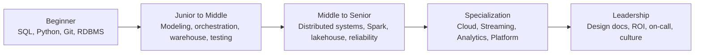

Data Engineering không phải là danh sách công cụ cần học thuộc. Công việc thật xoay quanh một câu hỏi đơn giản hơn: làm sao đưa dữ liệu từ nơi phát sinh đến nơi ra quyết định một cách đúng, đủ, kịp thời, có thể kiểm tra và vận hành lâu dài. Nếu mới vào site, hãy đọc trước [Data Engineering](/concepts/1-distributed-systems-architecture/data-engineering/), [Data Engineer Role](/concepts/1-distributed-systems-architecture/data-engineer-role/) và [Data Pipeline](/concepts/1-distributed-systems-architecture/data-pipeline/) để có ngôn ngữ chung.

Vì vậy lộ trình này được viết theo năng lực, không theo trend. Công cụ sẽ thay đổi, nhưng SQL, mô hình dữ liệu, batch/stream processing, orchestration, reliability, bảo mật và chi phí vẫn là những trục chính của nghề.

## Cách đọc lộ trình này

Đừng cố học tất cả cùng lúc. Một Data Engineer tốt thường đi qua ba vòng lặp:

1. Làm được pipeline nhỏ, dễ kiểm tra.
2. Đưa pipeline đó vào production, có lịch chạy, test, cảnh báo và khả năng chạy lại.
3. Mở rộng pipeline thành hệ thống: nhiều nguồn, nhiều đội dùng chung, chi phí và sự cố đều phải quản trị được.

Mỗi bài trong thư mục này trả lời bốn câu hỏi:

| Câu hỏi | Ý nghĩa |
|---|---|
| Học để làm gì? | Kết quả công việc cụ thể, không chỉ tên công nghệ. |
| Cần biết gì trước? | Điều kiện đầu vào để không học nhảy cóc. |
| Làm dự án nào? | Cách biến kiến thức thành bằng chứng năng lực. |
| Khi nào đi tiếp? | Tín hiệu cho thấy bạn đã đủ nền để sang chặng sau. |

## Lộ trình lõi

### 1. [Beginner Data Engineer](/learning-paths/core-paths/beginner-de/)

Chặng này dành cho người mới bước vào nghề. Trọng tâm là SQL, Python, Git, cơ sở dữ liệu quan hệ và tư duy pipeline. Nếu chưa tự viết được một script đọc dữ liệu, làm sạch, lưu vào PostgreSQL và chạy lại an toàn, bạn chưa cần vội học Spark hay Kubernetes.

Kết quả mong đợi: hiểu dữ liệu dạng bảng, viết truy vấn đúng, viết script xử lý file/API có log và error handling, biết dùng Git và biết vì sao pipeline cần [idempotency](/concepts/2-data-ingestion-integration/idempotency/).

### 2. [Junior to Middle Data Engineer](/learning-paths/core-paths/junior-to-middle-de/)

Chặng này đưa bạn từ “chạy được trên máy mình” sang “chạy được trong production”. Bạn học mô hình hóa dữ liệu, orchestration, partitioning, cloud warehouse, CDC, test và backfill.

Kết quả mong đợi: tự thiết kế một pipeline ELT có lịch chạy, có kiểm tra dữ liệu, có log, có tài liệu và có phương án chạy lại khi dữ liệu đến muộn.

### 3. [Middle to Senior Data Engineer](/learning-paths/core-paths/middle-to-senior-de/)

Senior không chỉ viết pipeline nhanh hơn. Senior hiểu hệ thống thất bại như thế nào: data skew, shuffle lớn, schema drift, small files, retry gây duplicate, alert nhiễu, chi phí cloud tăng mà không ai biết vì sao.

Kết quả mong đợi: đọc được execution plan, tối ưu Spark/warehouse, chọn được lakehouse/table format phù hợp, thiết kế observability và giải thích trade-off bằng ngôn ngữ kỹ thuật lẫn kinh doanh.

### 4. [Nấc thang sự nghiệp Data Engineer](/learning-paths/core-paths/de-career-paths/)

Không phải ai cũng đi cùng một nhánh. Sau nền tảng Senior, bạn có thể nghiêng về kiến trúc, platform, analytics engineering, streaming, cloud, MLOps hoặc quản lý. Bài này giúp nhìn rõ phạm vi ảnh hưởng của từng vai trò.

## Các hướng chuyên sâu

| Hướng đi | Phù hợp nếu bạn thích | Bài nên đọc |
|---|---|---|
| Cloud Data Engineer | Thiết kế data lake/warehouse trên AWS, GCP, Azure; bảo mật và chi phí | [Cloud Data Engineer](/learning-paths/specializations/cloud-data-engineer/) |
| Streaming Data Engineer | Kafka, Flink, event-time, trạng thái, độ trễ thấp | [Streaming Data Engineer](/learning-paths/specializations/streaming-data-engineer/) |
| Analytics Engineer | dbt, semantic layer, metric, mô hình dữ liệu phục vụ BI | [Analytics Engineer](/learning-paths/specializations/analytics-engineer/) |
| Data Platform Engineer | Kubernetes, Terraform, self-service platform, reliability | [Data Platform Engineer](/learning-paths/specializations/data-platform-engineer/) |

## Concept map theo chặng học

| Chặng | Concept nên đọc trong site |
|---|---|
| Beginner | [Relational Database](/concepts/1-distributed-systems-architecture/relational-database/), [Data Pipeline](/concepts/1-distributed-systems-architecture/data-pipeline/), [ETL](/concepts/2-data-ingestion-integration/etl/), [Idempotency](/concepts/2-data-ingestion-integration/idempotency/) |
| Junior to Middle | [Grain](/concepts/6-data-modeling-transformation/grain/), [Fact Table](/concepts/6-data-modeling-transformation/fact-table/), [DAG](/concepts/7-dataops-orchestration-quality/dag/), [Incremental Load](/concepts/2-data-ingestion-integration/incremental-load/), [Data Testing](/concepts/7-dataops-orchestration-quality/data-testing/) |
| Middle to Senior | [Distributed Processing](/concepts/4-compute-engines-batch/distributed-processing/), [Shuffle](/concepts/4-compute-engines-batch/shuffle/), [Apache Spark](/concepts/4-compute-engines-batch/apache-spark/), [Lakehouse](/concepts/3-storage-engines-formats/lakehouse/), [Data Observability](/concepts/7-dataops-orchestration-quality/data-observability/) |
| Streaming | [Apache Kafka](/concepts/5-stream-processing-realtime/apache-kafka/), [Event-time vs Processing-time](/concepts/5-stream-processing-realtime/event-time-processing-time/), [Watermark](/concepts/5-stream-processing-realtime/watermark/), [Exactly-once Semantics](/concepts/5-stream-processing-realtime/exactly-once-semantics/) |
| Platform/Governance | [Data Platform Architecture](/concepts/1-distributed-systems-architecture/data-platform-architecture/), [Data Governance](/concepts/8-security-governance-finops/data-governance/), [Data Lineage](/concepts/8-security-governance-finops/data-lineage/), [FinOps Data Engineering](/concepts/8-security-governance-finops/finops-data-engineering/) |

## Kỹ năng nền phải quay lại nhiều lần

| Năng lực | Người mới | Middle | Senior/Staff |
|---|---|---|---|
| SQL | JOIN, GROUP BY, CTE, window function | tối ưu query, partition, clustering | thiết kế model, đọc plan, chuẩn hóa metric |
| Python | xử lý file/API, logging, error handling | package, test, CLI, typing cơ bản | framework nội bộ, concurrency, review code |
| Orchestration | hiểu DAG và schedule | Airflow/Dagster, backfill, retry | dependency design, SLA, multi-team workflow |
| Distributed systems | khái niệm partition/replication | Spark, Kafka cơ bản | fault tolerance, state, consistency, cost |
| Data quality | null/unique/range check | contract, reconciliation, freshness | observability, incident review, ownership |
| Communication | ghi README rõ | viết runbook, giải thích trade-off | design doc, RFC, roadmap, ROI |

## Thời lượng và bằng chứng năng lực từng chặng

Mốc thời gian dưới đây giả định 8-10 giờ học/tuần bên cạnh công việc; quan trọng hơn thời gian là **sản phẩm chứng minh được**:

| Chặng | Thời lượng tham khảo | Bằng chứng bạn đã xong chặng |
|---|---|---|
| Beginner | 3-5 tháng | Repo pipeline nhỏ chạy lại được, README người khác làm theo được |
| Junior → Middle | 6-12 tháng làm thật | Pipeline production có test + backfill, từng xử lý ≥1 sự cố thật |
| Middle → Senior | 1-2 năm làm thật | Design doc được duyệt, một lần tối ưu giảm ≥50% runtime/chi phí có số liệu |
| Chuyên sâu | 6-12 tháng/hướng | Dự án domain-specific (streaming pipeline, platform template, metrics layer...) |

Lưu ý: "làm thật" không thay được bằng khóa học. Chứng chỉ giúp qua vòng CV; sự cố production lúc 2 giờ sáng và bài học rút ra từ nó mới là thứ giúp qua vòng phỏng vấn Senior.

## Nguyên tắc học thực tế

- Học theo dự án nhỏ nhưng hoàn chỉnh. Một pipeline có test và README đáng giá hơn mười notebook rời rạc.
- Ưu tiên hiểu nguyên lý trước tool. Biết partition, retry, idempotency và schema evolution giúp bạn dùng được nhiều hệ sinh thái khác nhau.
- Ghi lại quyết định kỹ thuật. Khi pipeline lỗi sau sáu tháng, tài liệu “vì sao chọn cách này” quan trọng hơn comment trong code.
- Đo vận hành sớm. Latency, freshness, error rate, data volume và chi phí nên xuất hiện từ dự án học đầu tiên.
- Đọc tài liệu gốc. Blog tóm tắt hữu ích, nhưng tài liệu chính thức mới cho bạn ngôn ngữ chính xác để làm việc với team.

## References

- [The Python Tutorial](https://docs.python.org/3/tutorial/) - Python Software Foundation.
- [PostgreSQL SQL Tutorial](https://www.postgresql.org/docs/current/tutorial-sql.html) - PostgreSQL Global Development Group.
- [DAGs](https://airflow.apache.org/docs/apache-airflow/stable/core-concepts/dags.html) - Apache Airflow.
- [Apache Spark Documentation](https://spark.apache.org/docs/latest/) - Apache Software Foundation.
- [Apache Kafka Documentation](https://kafka.apache.org/documentation/) - Apache Software Foundation.
- [Apache Flink Documentation](https://nightlies.apache.org/flink/flink-docs-stable/) - Apache Software Foundation.
- [What is dbt?](https://docs.getdbt.com/docs/introduction) - dbt Labs.
- [Site Reliability Engineering](https://sre.google/sre-book/table-of-contents/) - Google.
- [DORA metrics](https://dora.dev/guides/dora-metrics/) - DORA.
- [Cloud Architecture Framework](https://cloud.google.com/architecture/framework) - Google Cloud.
