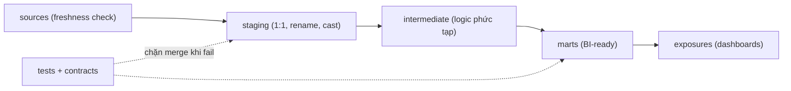

Analytics Engineer là người biến dữ liệu thô trong warehouse thành lớp dữ liệu đáng tin để analyst, BI, product và leadership cùng dùng. Vai trò này không chỉ viết SQL. Công việc chính là chuẩn hóa business logic, metric, tài liệu, test và quy trình thay đổi.

Nếu Data Engineer thường lo ingestion, orchestration và hạ tầng, Analytics Engineer lo phần “dữ liệu này có nghĩa là gì và ai được phép tin vào nó”.

## Lộ trình này dành cho ai?

- Data Analyst muốn đưa SQL của mình lên chuẩn production.
- Data Engineer muốn làm gần business hơn.
- BI Developer muốn quản lý metric, lineage và documentation bằng code.
- Team đang dùng warehouse nhưng mỗi dashboard định nghĩa doanh thu, active user hoặc churn theo một cách khác nhau.

## Checkpoint cần đạt

| Năng lực | Kết quả thực tế |
|---|---|
| SQL nâng cao | Model rõ grain, ít lặp logic, query có thể review. |
| dbt hoặc SQL workflow tương đương | Transformation có lineage, test, docs, CI. |
| Dimensional modeling | Fact/dimension phục vụ phân tích ổn định. |
| Semantic layer | Metric được định nghĩa một lần, dùng lại nhiều nơi. |
| Data contracts | Thay đổi schema có kiểm soát, không phá downstream bất ngờ. |
| Stakeholder communication | Biến định nghĩa mơ hồ thành logic đo lường rõ. |

## 1. Viết SQL có grain, owner và kiểm tra

SQL cho Analytics Engineering khác SQL ad hoc. Bạn cần viết model có thể chạy hằng ngày, review được và ít gây bất ngờ.

Tập trung vào:

- CTE theo tầng: source, staging, intermediate, mart.
- Window function cho cohort, retention, dedup, ranking.
- Incremental model và xử lý late-arriving data.
- Reconciliation giữa raw, staging và mart.
- Naming convention cho metric và dimension.

Một câu hỏi hay trước khi tạo bảng mới: “Bảng này sẽ là nguồn sự thật cho quyết định nào?”

Ví dụ một incremental model xử lý late-arriving data — mẫu code xuất hiện trong hầu hết codebase Analytics Engineering nghiêm túc:

```sql
-- models/marts/fct_orders.sql
{{ config(
    materialized='incremental',
    unique_key='order_id',
    incremental_strategy='merge'
) }}
SELECT order_id, customer_id, order_date, gross_amount
FROM {{ ref('stg_orders') }}

  -- lùi 3 ngày để bắt đơn hàng về trễ (late-arriving)
  WHERE order_date >= (SELECT MAX(order_date) - INTERVAL '3 days' FROM {{ this }})

```

Ba quyết định trong 12 dòng này đều là trade-off thật: `merge` thay vì `append` (chậm hơn nhưng idempotent khi rerun), lookback 3 ngày (quét thừa một ít đổi lấy không mất đơn về trễ), `unique_key` đặt đúng grain (order chứ không phải order item).

Đọc trong site: [SQL Transformation](/concepts/6-data-modeling-transformation/sql-transformation/), [Materialization](/concepts/6-data-modeling-transformation/materialization/), [One Big Table](/concepts/6-data-modeling-transformation/one-big-table-obt/), [Star Schema](/concepts/6-data-modeling-transformation/star-schema/).

## 2. dbt như một quy trình kỹ thuật

dbt phổ biến vì đưa software engineering vào transformation: version control, test, docs, modularity và CI/CD. Tài liệu dbt mô tả nó như workflow để build, test và document transformation trong warehouse: [What is dbt?](https://docs.getdbt.com/docs/introduction). Nhưng dbt không tự làm model tốt. Nếu grain sai hoặc metric mơ hồ, dbt chỉ giúp cái sai được build đều hơn.

Một project dbt đáng tin nên có:

- `sources` khai báo nguồn và freshness.
- `staging` chuẩn hóa tên cột, kiểu dữ liệu, timestamp.
- `intermediate` gom logic phức tạp nhưng chưa phục vụ trực tiếp BI.
- `marts` là lớp business-friendly cho dashboard.
- `tests` cho khóa, null, accepted values, relationship.
- `exposures` hoặc documentation cho dashboard quan trọng.



Ở mức chuyên nghiệp, project dbt chạy trong CI: mỗi pull request chỉ build và test những model bị ảnh hưởng (`dbt build --select state:modified+`), so sánh với manifest của production (Slim CI). Điều này biến "sửa một câu SQL" thành quy trình có review, có test gate — đúng nghĩa đưa software engineering vào analytics.

Đọc trong site: [dbt](/concepts/6-data-modeling-transformation/dbt/), [dbt Models](/concepts/6-data-modeling-transformation/dbt-models/), [dbt Testing](/concepts/7-dataops-orchestration-quality/dbt-testing/), [Data Testing](/concepts/7-dataops-orchestration-quality/data-testing/).

## 3. Semantic layer và metric

Metric tốt có ba phần:

1. Định nghĩa nghiệp vụ: “active user” nghĩa là gì?
2. Logic kỹ thuật: tính từ bảng nào, filter nào, grain nào?
3. Quyền sở hữu: ai được duyệt thay đổi?

Nếu metric chỉ nằm trong dashboard, mỗi dashboard sẽ dần có một phiên bản sự thật riêng. Semantic layer hoặc metric layer giúp đưa định nghĩa về một nơi có review.

Đọc trong site: [Metrics Layer](/concepts/6-data-modeling-transformation/metrics-layer/), [Data Quality Dimensions](/concepts/7-dataops-orchestration-quality/data-quality-dimensions/), [Data Ownership](/concepts/8-security-governance-finops/data-ownership/).

## 4. Data contracts

Data contract là thỏa thuận rõ giữa producer và consumer: schema, kiểu dữ liệu, ý nghĩa field, freshness, expectation về thay đổi. dbt cũng có cơ chế data contracts để kiểm soát schema của model trước khi downstream dùng: [dbt data contracts](https://docs.getdbt.com/docs/build/data-contracts).

Không cần bắt đầu quá nặng. Với team nhỏ, chỉ cần:

- Field nào bắt buộc.
- Field nào có enum hợp lệ.
- Freshness tối đa.
- Người sở hữu nguồn.
- Quy trình thông báo breaking change.

Đọc trong site: [Data Contract](/concepts/6-data-modeling-transformation/data-contract/), [Schema Drift](/concepts/7-dataops-orchestration-quality/schema-drift/), [Data Governance](/concepts/8-security-governance-finops/data-governance/).

## Checklist đọc concept

| Mốc học | Concept nội bộ cần đọc |
|---|---|
| Modeling cho BI | [Grain](/concepts/6-data-modeling-transformation/grain/), [Star Schema](/concepts/6-data-modeling-transformation/star-schema/), [Fact Table](/concepts/6-data-modeling-transformation/fact-table/) |
| dbt workflow | [dbt](/concepts/6-data-modeling-transformation/dbt/), [dbt Models](/concepts/6-data-modeling-transformation/dbt-models/), [dbt Testing](/concepts/7-dataops-orchestration-quality/dbt-testing/) |
| Metric đáng tin | [Metrics Layer](/concepts/6-data-modeling-transformation/metrics-layer/), [Data Quality](/concepts/7-dataops-orchestration-quality/data-quality/), [Data Ownership](/concepts/8-security-governance-finops/data-ownership/) |

## Dự án thực hành

**Dự án: Revenue metrics mart**

1. Tạo raw tables: orders, order_items, payments, refunds, customers.
2. Dựng staging models chuẩn hóa kiểu dữ liệu và tên cột.
3. Tạo `fct_orders`, `fct_payments`, `dim_customers`.
4. Định nghĩa metric: gross revenue, net revenue, refund rate, repeat purchase rate.
5. Viết tests cho uniqueness, relationship và reconciliation.
6. Viết docs: grain, owner, caveats, ví dụ query.

Đầu ra tốt là một mart mà analyst mới vào team có thể dùng mà không cần hỏi lại toàn bộ lịch sử nghiệp vụ.

## Góc phỏng vấn

- Analytics Engineer khác Data Analyst và Data Engineer ở đâu?
- Grain của `fct_orders` nên là order hay order item?
- Làm sao tránh mỗi dashboard có một định nghĩa doanh thu?
- Data contract nên đặt ở source, staging hay mart?
- Khi source đổi kiểu dữ liệu, quy trình rollout thế nào?

## References

- [What is dbt?](https://docs.getdbt.com/docs/introduction) - dbt Labs.
- [Data contracts](https://docs.getdbt.com/docs/build/data-contracts) - dbt Labs.
- [Fact Tables and Dimension Tables](https://www.kimballgroup.com/2003/01/fact-tables-and-dimension-tables/) - Kimball Group.
- [DORA metrics](https://dora.dev/guides/dora-metrics/) - DORA.
- [Incremental models](https://docs.getdbt.com/docs/build/incremental-models) - dbt Labs.
- [Continuous integration (Slim CI)](https://docs.getdbt.com/docs/deploy/continuous-integration) - dbt Labs.
