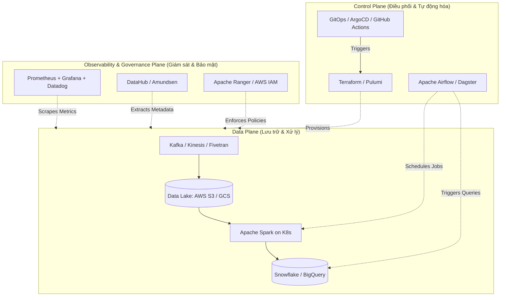

Sự bùng nổ của Cloud Computing và Modern Data Stack (MDS) trong thập kỷ qua đã định hình lại hoàn toàn cách các tổ chức xây dựng và vận hành hệ thống dữ liệu. Sự phức tạp gia tăng không ngừng từ việc quản lý hàng tá công cụ SaaS, PaaS, IaaS đã dẫn đến một sự phân hóa tất yếu trong ngành Dữ liệu. "Data Engineer" không còn là một chức danh "ôm show" tất cả mọi thứ từ cấu hình server đến viết câu lệnh SQL. Thay vào đó, ngành công nghiệp chứng kiến sự trỗi dậy mạnh mẽ của một nhánh chuyên biệt hóa: **Data Platform Engineer** (Kỹ sư Nền tảng Dữ liệu).

Nếu Data Engineer là "người lái xe buýt" vận chuyển hành khách (dữ liệu) đến đúng nơi quy định đúng giờ, thì Data Platform Engineer chính là "kỹ sư cầu đường", người quy hoạch đô thị, xây dựng đường cao tốc, thiết lập trạm thu phí và hệ thống đèn tín hiệu giao thông để hàng ngàn chiếc xe buýt có thể vận hành trơn tru mà không bị tắc nghẽn.

Bài viết này sẽ đi sâu vào khía cạnh kỹ thuật, kiến trúc hệ thống, và những thách thức thực tế mà một Data Platform Engineer phải giải quyết ở quy mô tổ chức (Enterprise-scale).

---

## 1. Sự Khác Biệt Cốt Lõi: Data Engineer vs. Data Platform Engineer


Theo triết lý quản lý nhóm từ cuốn sách nổi tiếng *Team Topologies*, một trong những nguyên nhân chính khiến các Data Engineer bị quá tải là do **Cognitive Load** (Tải trọng nhận thức) quá lớn. Họ vừa phải am hiểu sâu sắc về Business Logic, Data Modeling, Data Quality, lại vừa phải biết cách viết Terraform, cấu hình Kubernetes Ingress, và tối ưu hóa AWS IAM Policies. 

Data Platform Engineer xuất hiện để "hấp thụ" phần tải trọng hạ tầng này, cho phép Data Engineer tập trung 100% vào việc tạo ra giá trị nghiệp vụ từ dữ liệu.

| Tiêu Chí | Data Engineer (Software Engineer - Data) | Data Platform Engineer (SRE / Platform for Data) |
| :--- | :--- | :--- |
| **Trọng tâm (Focus)** | Logic nghiệp vụ (Business Logic), Pipeline ETL/ELT, Data Modeling, Chất lượng dữ liệu (Data Quality). | Hạ tầng (Infrastructure), Công cụ (Tooling), Tự động hóa, Developer Experience (DevEx). |
| **Sản phẩm đầu ra (Output)** | Các bảng dữ liệu sạch (Clean tables), Data Marts, Features cho Machine Learning, Dashboards. | Các module Terraform, Helm charts, CI/CD pipelines, APIs, Internal Developer Platform (IDP). |
| **Chỉ số đánh giá (Key Metrics)** | Data freshness (độ trễ dữ liệu), SLA/SLO của từng dataset, độ chính xác của dữ liệu. | Uptime của hệ thống (Airflow, Kafka), Time-to-provision (Thời gian cấp phát tài nguyên), Tối ưu chi phí Cloud (FinOps). |
| **Công cụ chủ đạo (Tech Stack)** | SQL, Python, Apache Spark, dbt, Flink, Pandas. | Terraform, Kubernetes, Docker, ArgoCD, Bash, Golang/Python. |
| **Người dùng (Stakeholders)** | Data Analysts, Data Scientists, C-level, Business Users. | Data Engineers, Analytics Engineers, Security Team, FinOps Team. |

> [!IMPORTANT]
> **Platform as a Product:** Một triết lý quan trọng của Data Platform Engineer là coi nền tảng hạ tầng như một "sản phẩm" (Product), và "khách hàng" của họ chính là các Data Engineers trong công ty. Mục tiêu tối thượng là tạo ra trải nghiệm tự phục vụ (Self-service), giảm thiểu tối đa các JIRA tickets yêu cầu cấp quyền hay tạo database.

---

## 2. Kiến Trúc Hạ Tầng Tiêu Biểu Của Modern Data Platform

Một Data Platform hiện đại ở quy mô lớn thường được thiết kế theo nguyên lý **Compute & Storage Separation** (Tách biệt Lưu trữ và Tính toán) và được chia thành 3 mặt phẳng (Planes) chính. Một Data Platform Engineer phải là chuyên gia trong việc kết nối các mặt phẳng này lại với nhau một cách an toàn và tự động.



### 2.1. Data Plane (Mặt phẳng Dữ liệu)
Nơi dữ liệu thực sự di chuyển và được xử lý. Dù không trực tiếp viết job xử lý, Data Platform Engineer là người thiết lập "sân chơi" này:
- Cấu hình các **Kafka Brokers** với phân vùng (partitions) tối ưu cho streaming thông lượng cao.
- Thiết lập Data Lake (AWS S3, GCS) với cấu hình phân tầng lưu trữ (Storage Tiering) để tối ưu chi phí.
- Khởi tạo và quản lý các cụm tính toán (Compute Clusters) như Databricks hoặc tự build hệ thống Spark trên Kubernetes.

### 2.2. Control Plane (Mặt phẳng Điều khiển)
Nơi quản lý trạng thái, lịch trình và vòng đời của cơ sở hạ tầng.
- **Orchestration:** Triển khai và duy trì Apache Airflow ở chế độ High Availability (HA). 
- **Infrastructure Provisioning:** Mọi thay đổi hạ tầng đều phải thông qua Code (IaC) chứ không được "click chuột" trên giao diện Cloud.

### 2.3. Observability & Governance Plane (Mặt phẳng Giám sát và Quản trị)
- **Giám sát (Monitoring):** Đảm bảo hệ thống có đủ logs, metrics, traces. Thiết lập các cảnh báo (Alerts) khi CPU của cụm Airflow Worker quá tải hoặc Kafka Consumer Lag tăng đột biến.
- **Bảo mật (Security & Access Control):** Triển khai Zero Trust, phân quyền truy cập chi tiết đến từng cột/dòng (Column/Row-level security) bằng Apache Ranger hoặc AWS Lake Formation.

---

## 3. Tech Stack & Năng Lực Cốt Lõi (Deep Dive)

Một Data Platform Engineer đòi hỏi tư duy của một DevOps/SRE, nhưng áp dụng chuyên biệt cho các công cụ dữ liệu.

### 3.1. Infrastructure as Code (IaC) & Tự động hóa

Terraform là ngôn ngữ "mẹ đẻ" của Platform Engineer. Thay vì cấu hình thủ công từng bucket hay IAM Role, mọi thứ được module hóa.

**Ví dụ:** Một Data Engineer cần một S3 Bucket mới cho dự án Data Lake. Platform Engineer đã viết sẵn một module Terraform chuẩn hóa, tự động áp dụng các chính sách bảo mật khắt khe nhất (Mã hóa KMS, chặn truy cập công khai, lưu trữ version).

```hcl
# Terraform module: aws_secure_data_lake_bucket
resource "aws_s3_bucket" "data_lake_raw" {
  bucket = "company-data-lake-raw-${var.environment}"
  tags   = var.tags
}

# Chặn hoàn toàn truy cập từ Public Internet (Bắt buộc cho Data Lake)
resource "aws_s3_bucket_public_access_block" "block_public" {
  bucket                  = aws_s3_bucket.data_lake_raw.id
  block_public_acls       = true
  block_public_policy     = true
  ignore_public_acls      = true
  restrict_public_buckets = true
}

# Bắt buộc mã hóa dữ liệu tại chỗ (Encryption at Rest) bằng AWS KMS
resource "aws_s3_bucket_server_side_encryption_configuration" "encrypt" {
  bucket = aws_s3_bucket.data_lake_raw.id
  rule {
    apply_server_side_encryption_by_default {
      kms_master_key_id = var.kms_key_arn
      sse_algorithm     = "aws:kms"
    }
  }
}

# Lifecycle Policy: Tự động chuyển dữ liệu cũ sang kho lạnh để tiết kiệm chi phí
resource "aws_s3_bucket_lifecycle_configuration" "tiering" {
  bucket = aws_s3_bucket.data_lake_raw.id
  rule {
    id     = "archive_old_data"
    status = "Enabled"
    transition {
      days          = 90
      storage_class = "GLACIER"
    }
  }
}
```

### 3.2. Containerization & Kubernetes (Trái Tim Của Data Platform)

Kubernetes (K8s) đã trở thành "hệ điều hành" chuẩn mực cho Cloud. Các Data Platform hiện đại hiếm khi dùng Hadoop YARN nữa, mà chuyển sang chạy trực tiếp trên K8s (EKS, GKE).

Data Platform Engineer đóng gói các ứng dụng dữ liệu bằng Docker và quản lý chúng bằng **Helm Charts** hoặc Kubernetes Manifests. Một ví dụ điển hình là việc chạy **Apache Spark trên Kubernetes** bằng `spark-operator`. Điều này cho phép tận dụng Node Auto-scaling của K8s, tự động cấp phát hàng trăm Pods làm Spark Executors khi chạy Job nặng, và thu hồi lại khi Job kết thúc để tiết kiệm tiền.

```yaml
# Ví dụ cấu hình SparkApplication CRD chạy trên Kubernetes
apiVersion: "sparkoperator.k8s.io/v1beta2"
kind: SparkApplication
metadata:
  name: daily-sales-aggregation
  namespace: data-processing
spec:
  type: Scala
  mode: cluster
  image: "gcr.io/company-registry/spark:v3.3.0"
  mainClass: com.company.data.DailySalesJob
  mainApplicationFile: "s3a://company-artifacts/jars/daily-sales.jar"
  sparkVersion: "3.3.0"
  restartPolicy:
    type: OnFailure
    onFailureRetries: 3
    onFailureRetryInterval: 10
  driver:
    cores: 1
    memory: "1024m"
    serviceAccount: spark-operator-sa
  executor:
    instances: 50 # Sẽ tự động scale up 50 Pods
    cores: 2
    memory: "8192m"
    nodeSelector:
      # Tối ưu chi phí bằng cách buộc các Executors chạy trên Spot Instances
      karpenter.sh/capacity-type: spot 
```

> [!TIP]
> Việc sử dụng Spot Instances cho Spark Executors (như cấu hình nodeSelector ở trên) có thể tiết kiệm tới 70-80% chi phí Compute cho doanh nghiệp so với việc chạy các cụm EMR/Databricks truyền thống hoạt động 24/7.

### 3.3. Quản Trị Hệ Thống Điều Phối (Orchestration Management)

Nhiều người nghĩ Airflow chỉ là việc viết file Python (DAGs). Thực tế, ở quy mô enterprise (hàng ngàn DAGs, hàng chục ngàn Tasks mỗi ngày), Airflow là một hệ thống phân tán phức tạp. 

Data Platform Engineer không viết DAG ETL, họ duy trì kiến trúc của Airflow:
- Thay thế SQLite/SequentialExecutor mặc định bằng **PostgreSQL** và **CeleryExecutor** cùng với Redis/RabbitMQ để phân phối tasks.
- Hoặc hiện đại hơn, sử dụng **KubernetesExecutor**, nơi mỗi Task của Airflow khi chạy sẽ sinh ra một Pod riêng biệt, đảm bảo cách ly tuyệt đối về tài nguyên và thư viện (dependency isolation) giữa các team khác nhau.
- Tích hợp **HashiCorp Vault** hoặc AWS Secrets Manager để Data Engineer không bao giờ được phép lưu plain-text password của database trực tiếp trong mã nguồn hay giao diện Airflow.

### 3.4. FinOps: Nghệ Thuật Tối Ưu Chi Phí Đám Mây

Hạ tầng dữ liệu là "con quái vật ngốn tiền" lớn nhất trong hạ tầng IT. Data Platform Engineer đóng vai trò trung tâm trong **FinOps** (Financial Operations):
- Cấu hình Auto-suspend cho các Warehouse của Snowflake.
- Giám sát các câu query "quét full bảng" (Full Table Scan) bất thường trong BigQuery để cảnh báo người dùng.
- Thiết lập giới hạn bộ nhớ và CPU (Resource Quotas) trên Kubernetes namespaces để không một team nào có thể độc chiếm tài nguyên chung.

---

## 4. Xây Dựng Internal Developer Platform (IDP): Đỉnh Cao Của Tự Phục Vụ (Self-Service)

Lý do lớn nhất để thuê một Data Platform Engineer là giải quyết **"Operational Toil"** - những công việc vận hành tay chân, lặp đi lặp lại.

Khi quy mô tăng lên 50-100 Data Engineers & Analysts, nếu mỗi lần cần tạo một schema mới trên Redshift, tạo một S3 bucket, hay xin quyền đọc dữ liệu, họ phải tạo JIRA ticket và chờ đợi Platform team xử lý (mất vài ngày), thì tốc độ sáng tạo sẽ bị bóp nghẹt.

**Giải pháp:** Xây dựng một **Internal Developer Platform (IDP)**.

Các Data Platform team tiên tiến hiện nay sử dụng các công cụ như **Backstage.io** (được tạo ra bởi Spotify) để làm Cổng thông tin nội bộ (Developer Portal).
Platform Engineer sẽ định nghĩa các **"Golden Paths"** (Con đường vàng). 

**Kịch bản thực tế với IDP:**
1. Một Data Engineer tên là Alice muốn khởi tạo một dự án dbt mới để transform dữ liệu Marketing.
2. Thay vì xin xỏ cấu hình từ DevOps, Alice truy cập vào web portal nội bộ (IDP).
3. Alice chọn template: *"New dbt + Snowflake Project"*. Điền tên project là `marketing_dbt`.
4. Portal tự động gọi một API ngầm để kích hoạt CI/CD Pipeline:
   - Tạo một Repository Github mới với cấu trúc thư mục chuẩn.
   - Terraform chạy ngầm để tạo một Database riêng biệt trên Snowflake cho môi trường Dev/Prod của Alice, kèm theo các Role/User (RBAC) tương ứng.
   - Tạo cấu hình bí mật (Secrets) trong Vault.
5. Chỉ sau 3 phút, Alice nhận được link Github và có thể bắt đầu viết SQL ngay lập tức, với một môi trường hạ tầng hoàn hảo, bảo mật và chuẩn chỉnh.

> [!NOTE]
> IDP thay đổi mô hình từ "Ticket-based" (xin-cho) sang "API-driven" (tự phục vụ qua API/Portal). Platform Engineer là người viết code đằng sau các nút bấm trên portal đó.

---

## 5. Sự Tiến Hóa Lên Data Mesh

Khái niệm **Data Mesh** (Lưới Dữ Liệu) đang là xu hướng kiến trúc mạnh mẽ nhất hiện nay. Trong Data Mesh, dữ liệu không được quản lý tập trung bởi một Data Team duy nhất nữa, mà được phân quyền sở hữu về các team nghiệp vụ (Domain Teams như Marketing, HR, Finance). Các team này tự xây dựng và quản lý các "Data Products" của riêng họ.

Tuy nhiên, các team Marketing/HR không thể tự build hệ thống Kafka hay Spark. Đây chính là lúc vai trò của Data Platform Engineer tỏa sáng.

Trong mô hình Data Mesh, Data Platform Team hoạt động như một nhà cung cấp dịch vụ nội bộ (giống như "AWS thu nhỏ" trong công ty). Họ cung cấp **"Self-serve data infrastructure as a platform"** (Nền tảng hạ tầng tự phục vụ). Nhờ có hạ tầng vững chắc, trừu tượng hóa mọi sự phức tạp của Kubernetes/Cloud mà Platform team cung cấp, các team nghiệp vụ có thể dễ dàng quản trị dữ liệu của mình.

---

## 6. Tổng Kết

Data Platform Engineer là những "kiến trúc sư thầm lặng" đứng sau sự thành công của các công ty định hướng dữ liệu (Data-driven). Bằng cách kết hợp các kỹ năng của Software Engineering, DevOps, Cloud Architecture và sự am hiểu về bản chất của dữ liệu, họ biến một mớ hỗn độn các công cụ Big Data thành một dây chuyền sản xuất tự động, an toàn và tối ưu chi phí. 

Việc chuyển dịch từ Data Engineer truyền thống sang Data Platform Engineer là một lộ trình phát triển nghề nghiệp đầy hứa hẹn cho những kỹ sư yêu thích hệ thống phân tán chuyên sâu, cơ sở hạ tầng mạng, và nghệ thuật tối ưu hóa tự động hóa (Automation).

---

## Tài Liệu Tham Khảo Nâng Cao

Để tiến sâu vào con đường Data Platform Engineering, đây là các nguồn tài nguyên vô giá:

*   **Sách thiết kế hệ thống:**
    *   [Designing Data-Intensive Applications](https://dataintensive.net/) của Martin Kleppmann - "Kinh thánh" bắt buộc phải đọc về hệ thống phân tán và dữ liệu.
    *   [Team Topologies](https://teamtopologies.com/) - Kiến trúc tổ chức team công nghệ, lý thuyết nền tảng cho Platform Engineering.
*   **Blog Công Nghệ (Engineering Blogs):**
    *   **Uber Engineering: From ETL to Data Platform** - Hành trình tiến hóa kiến trúc dữ liệu của Uber.
    *   **Building a Self-Service Data Platform - Airbnb Tech Blog**
    *   [The Rise of the Data Platform Engineer - The Pragmatic Engineer](https://blog.pragmaticengineer.com/)
*   **Thực hành & Công cụ:**
    *   [Infrastructure as Code in Data Engineering with Terraform - HashiCorp](https://www.hashicorp.com/resources)
    *   **Data Engineer vs Data Platform Engineer - SeattleDataGuy**
    *   [Backstage.io Documentation](https://backstage.io/docs/overview/what-is-backstage) - Hệ sinh thái IDP chuẩn công nghiệp.