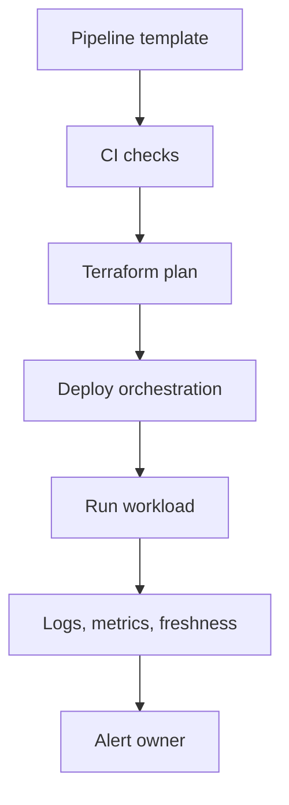

Data Platform Engineer không chỉ viết pipeline cho một use case. Họ xây nền tảng để nhiều team tự tạo, chạy và vận hành pipeline an toàn hơn. Nếu Data Engineer là người xây đường ống, Data Platform Engineer là người làm hệ thống đường, biển báo, trạm kiểm soát và quy chuẩn thi công.

Vai trò này giao giữa Data Engineering, DevOps, SRE và Platform Engineering.

## Khi nào tổ chức cần Data Platform?

- Nhiều team cùng viết pipeline nhưng mỗi team có chuẩn riêng.
- Onboarding pipeline mới mất nhiều tuần vì phải xin quyền, tạo infra, cấu hình CI/CD thủ công.
- Sự cố lặp lại vì không có template, observability hoặc runbook chung.
- Chi phí cloud khó quy về team/dataset/workload.
- Dữ liệu nhạy cảm được xử lý thiếu kiểm soát.

Nếu công ty chỉ có vài pipeline đơn giản, một platform lớn có thể là over-engineering. Nền tảng chỉ đáng xây khi nó giảm ma sát thật cho nhiều người.

## Checkpoint cần đạt

| Mảng | Cần biết |
|---|---|
| Infrastructure as Code | Terraform module, environment, state, review plan. |
| Kubernetes/container | Workload, secret, config, resource limit, operator. |
| Orchestration platform | Airflow/Dagster/Prefect deployment, executor, scaling. |
| Observability | Logs, metrics, traces, data freshness, alert routing. |
| Security | IAM, network boundary, secret management, audit. |
| Developer experience | Template, CLI, documentation, golden path. |

## 1. Golden path cho pipeline

Một platform tốt không ép mọi người học hết hạ tầng. Nó đưa ra “golden path”:

1. Tạo repo từ template.
2. Khai báo source, schedule, owner, SLA.
3. CI chạy lint, unit test, data contract check.
4. Terraform tạo quyền và tài nguyên cần thiết.
5. Deploy DAG/job lên môi trường phù hợp.
6. Observability và alert tự gắn theo owner.

Mục tiêu là giảm quyết định lặp lại, không phải xóa hết quyền tự chủ của team dữ liệu.

Đọc trong site: [Data Platform Architecture](/concepts/1-distributed-systems-architecture/data-platform-architecture/), [DataOps](/concepts/7-dataops-orchestration-quality/dataops/), [Software-defined Assets](/concepts/7-dataops-orchestration-quality/software-defined-assets/), [Data Ownership](/concepts/8-security-governance-finops/data-ownership/).



## 2. Terraform và hạ tầng có review

Terraform hữu ích vì biến hạ tầng thành code có version, review và plan trước khi apply. HashiCorp mô tả Terraform như công cụ định nghĩa và quản lý infrastructure bằng configuration files, phù hợp với nhu cầu review hạ tầng trước khi thay đổi: [Terraform intro](https://developer.hashicorp.com/terraform/intro). Với data platform, Terraform thường quản lý:

- Bucket/container và lifecycle policy.
- IAM role/service account.
- Warehouse dataset/schema.
- Kubernetes namespace, secret reference, resource quota.
- Monitoring dashboard và alert rule.

Quy tắc thực tế: module nên che bớt độ phức tạp nhưng không giấu những quyết định quan trọng như retention, quyền truy cập và chi phí. Interface của một module tốt trông như thế này — người dùng chỉ khai báo quyết định, không khai báo chi tiết hạ tầng:

```hcl
module "orders_dataset" {
  source        = "git::internal/modules/data-dataset?ref=v2.3"
  name          = "orders"
  owner_team    = "commerce-data"        # bắt buộc → alert & cost đi theo team
  pii_level     = "high"                 # quyết định masking + audit tự động
  retention_days = 730                   # quyết định lộ ra, không chôn trong module
  readers       = ["analyst-role"]
  writers       = ["etl-orders-sa"]
}
```

Ba field `owner_team`, `pii_level`, `retention_days` là ví dụ của "quyết định phải lộ ra": chúng buộc người tạo dataset trả lời câu hỏi governance ngay lúc khai sinh tài nguyên, thay vì để đến audit cuối năm. Đó là cách platform mã hóa chính sách thành interface — hiệu quả hơn mọi tài liệu quy định.

Đọc trong site: [Access Control](/concepts/8-security-governance-finops/access-control/), [Cloud Storage](/concepts/3-storage-engines-formats/cloud-storage/), [Cost Optimization](/concepts/8-security-governance-finops/cost-optimization/).

## 3. Kubernetes có cần thiết không?

Kubernetes mạnh nhưng không miễn phí về vận hành. Kubernetes cung cấp abstraction cho workload, service discovery, rollout và resource scheduling, nhưng abstraction đó kéo theo chi phí vận hành riêng: [Kubernetes overview](https://kubernetes.io/docs/concepts/overview/). Dùng khi bạn cần chuẩn hóa workload container, autoscaling, isolation, operator hoặc chạy nhiều engine trên cùng nền.

Không nên dùng Kubernetes chỉ vì “hiện đại”. Nếu managed workflow/serverless giải quyết đủ tốt, hãy dùng managed service. Platform Engineer giỏi là người giảm gánh nặng vận hành, không thêm một cụm mới để chăm.

Đọc trong site: [Airflow Celery vs K8s Executor](/concepts/7-dataops-orchestration-quality/airflow-celery-vs-k8s-executor/), [Airflow Scheduler](/concepts/7-dataops-orchestration-quality/airflow-scheduler/), [Serverless Data](/concepts/3-storage-engines-formats/serverless-data/).

## 4. Observability cho cả platform lẫn dữ liệu

Bạn cần hai lớp:

- Platform observability: pod/job fail, CPU/memory, queue backlog, scheduler health, API latency.
- Data observability: freshness, volume, schema, distribution, reconciliation, lineage.

Nếu chỉ có lớp platform, job có thể xanh nhưng dữ liệu sai. Nếu chỉ có lớp data, bạn biết dữ liệu trễ nhưng không biết scheduler nghẽn hay cluster thiếu tài nguyên.

Đọc trong site: [Data Observability](/concepts/7-dataops-orchestration-quality/data-observability/), [Freshness Monitoring](/concepts/7-dataops-orchestration-quality/freshness-monitoring/), [Alerting Incident Response](/concepts/7-dataops-orchestration-quality/alerting-incident-response/), [Root Cause Analysis](/concepts/7-dataops-orchestration-quality/root-cause-analysis/).

## 5. Platform như một sản phẩm

Data platform có người dùng: Data Engineer, Analyst, Scientist, BI, Security, Finance. Vì vậy cần product thinking:

- Ai là user chính?
- Việc gì đang mất thời gian nhất?
- Golden path có giảm ticket không?
- Documentation có giúp người mới tự làm không?
- Metric thành công là adoption, lead time, incident reduction hay cost visibility?

## Checklist đọc concept

| Mốc học | Concept nội bộ cần đọc |
|---|---|
| Platform foundation | [Data Platform Architecture](/concepts/1-distributed-systems-architecture/data-platform-architecture/), [DataOps](/concepts/7-dataops-orchestration-quality/dataops/) |
| Orchestration platform | [Apache Airflow](/concepts/7-dataops-orchestration-quality/apache-airflow/), [Airflow Scheduler](/concepts/7-dataops-orchestration-quality/airflow-scheduler/), [Airflow Celery vs K8s Executor](/concepts/7-dataops-orchestration-quality/airflow-celery-vs-k8s-executor/) |
| Observability | [Data Observability](/concepts/7-dataops-orchestration-quality/data-observability/), [Freshness Monitoring](/concepts/7-dataops-orchestration-quality/freshness-monitoring/), [Schema Drift](/concepts/7-dataops-orchestration-quality/schema-drift/) |
| Governance | [Access Control](/concepts/8-security-governance-finops/access-control/), [Data Lineage](/concepts/8-security-governance-finops/data-lineage/), [Data Catalog](/concepts/8-security-governance-finops/data-catalog/) |

## Dự án thực hành

**Dự án: Internal data pipeline starter kit**

1. Tạo template repo cho pipeline Python/SQL.
2. Thêm CI: lint, test, secret scan, markdown check.
3. Viết Terraform module tạo bucket, IAM và dataset.
4. Deploy DAG lên Airflow local/Kubernetes.
5. Tự động tạo alert theo owner trong config.
6. Viết docs: “từ repo trống đến pipeline chạy production”.

## Góc phỏng vấn

- Data Platform khác Data Engineering thông thường ở đâu?
- Khi nào nên dùng Kubernetes, khi nào không?
- Terraform state hỏng hoặc drift thì xử lý thế nào?
- Golden path nên linh hoạt đến mức nào?
- Làm sao đo platform có tạo giá trị thật?

## References

- [Terraform intro](https://developer.hashicorp.com/terraform/intro) - HashiCorp.
- [Kubernetes overview](https://kubernetes.io/docs/concepts/overview/) - Kubernetes.
- [DAGs](https://airflow.apache.org/docs/apache-airflow/stable/core-concepts/dags.html) - Apache Airflow.
- [Monitoring Distributed Systems](https://sre.google/sre-book/monitoring-distributed-systems/) - Google SRE.
- [DORA metrics](https://dora.dev/guides/dora-metrics/) - DORA.
