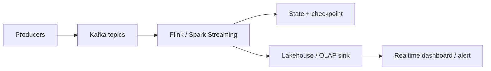

Streaming Data Engineering xử lý dữ liệu khi sự kiện đang xảy ra, không đợi đến batch cuối ngày. Công việc này phù hợp với fraud detection, realtime dashboard, IoT, personalization, operational monitoring và các luồng cần phản ứng nhanh.

Điểm khó của streaming không chỉ là Kafka hay Flink. Điểm khó là thời gian, trạng thái, thứ tự sự kiện, retry, duplicate và late data.

## Ai nên học hướng này?

- Data Engineer đã vững batch processing và muốn làm realtime.
- Backend Engineer đang xây hệ thống event-driven.
- Data Architect cần chọn giữa batch, micro-batch và streaming.
- Team có use case cần latency tính bằng giây hoặc phút, không phải giờ.

## Checkpoint cần đạt

| Năng lực | Cần hiểu |
|---|---|
| Kafka fundamentals | Topic, partition, consumer group, offset, retention. |
| Event-time | Phân biệt event-time, ingestion-time, processing-time. |
| Watermark | Chấp nhận dữ liệu trễ có kiểm soát. |
| State | Window, aggregation, join, TTL, checkpoint. |
| Delivery semantics | At-most-once, at-least-once, exactly-once theo ngữ cảnh. |
| Operations | Lag, backpressure, rebalancing, schema evolution, replay. |

## 1. Kafka là log phân tán, không chỉ là queue

Kafka lưu sự kiện theo topic và partition. Consumer đọc bằng offset, vì vậy nhiều consumer group có thể đọc cùng một topic cho các mục đích khác nhau. Các khái niệm topic, partition, consumer group, configuration và operations đều nằm trong tài liệu Kafka chính thức: [Apache Kafka Documentation](https://kafka.apache.org/documentation/).

Điều cần học:

- Chọn key để giữ thứ tự theo entity như `user_id` hoặc `account_id`.
- Partition nhiều quá hay ít quá đều có chi phí.
- Consumer lag là tín hiệu quan trọng nhưng không nói hết nguyên nhân.
- Retention quyết định bạn replay được bao lâu.
- Schema Registry hoặc quy ước schema giúp tránh phá consumer khi event đổi.

Đọc trong site: [Apache Kafka](/concepts/5-stream-processing-realtime/apache-kafka/), [Kafka Topics Partitions](/concepts/5-stream-processing-realtime/kafka-topics-partitions/), [Consumer Groups](/concepts/5-stream-processing-realtime/consumer-groups/), [Kafka Consumer Lag Rebalance](/concepts/5-stream-processing-realtime/kafka-consumer-lag-rebalance/).

## 2. Tư duy thời gian

Trong batch, dữ liệu thường đã “nằm yên”. Trong streaming, dữ liệu đến muộn là chuyện bình thường.

| Loại thời gian | Ý nghĩa |
|---|---|
| Event-time | Thời điểm sự kiện thật sự xảy ra. |
| Ingestion-time | Thời điểm event vào hệ thống như Kafka. |
| Processing-time | Thời điểm job xử lý event. |

Nếu dùng processing-time cho mọi thứ, báo cáo realtime có thể sai khi mobile app offline gửi event muộn. Watermark giúp hệ thống nói rõ: “tôi chờ dữ liệu trễ tối đa bao lâu trước khi đóng window”.

Toàn bộ tư duy đó gói trong vài dòng Flink SQL — đáng thuộc lòng vì nó xuất hiện trong hầu hết bài toán realtime aggregation:

```sql
CREATE TABLE transactions (
    account_id STRING,
    amount     DECIMAL(18,2),
    event_time TIMESTAMP(3),
    -- Watermark: chấp nhận trễ tối đa 30 giây theo event-time
    WATERMARK FOR event_time AS event_time - INTERVAL '30' SECOND
) WITH ('connector' = 'kafka', ...);

SELECT account_id,
       TUMBLE_START(event_time, INTERVAL '5' MINUTE) AS window_start,
       SUM(amount) AS total_5m
FROM transactions
GROUP BY account_id, TUMBLE(event_time, INTERVAL '5' MINUTE);
```

Trade-off nằm trọn ở con số 30 giây: tăng lên thì kết quả đúng hơn (bắt được nhiều event trễ hơn) nhưng cửa sổ đóng muộn hơn → alert fraud chậm hơn; giảm xuống thì nhanh nhưng event trễ bị rơi (hoặc phải xử lý qua side-output). Không có giá trị đúng tuyệt đối — chỉ có giá trị phù hợp với SLA nghiệp vụ.

Đọc trong site: [Event-time vs Processing-time](/concepts/5-stream-processing-realtime/event-time-processing-time/), [Watermark](/concepts/5-stream-processing-realtime/watermark/), [Flink Watermarks Late Data](/concepts/5-stream-processing-realtime/flink-watermarks-late-data/), [Windowing](/concepts/5-stream-processing-realtime/windowing/).

## 3. Stateful processing

Streaming mạnh khi xử lý trạng thái: đếm sự kiện theo cửa sổ, join stream, phát hiện pattern, tính session.

Nhưng state cần vận hành cẩn thận:

- State lớn làm checkpoint chậm.
- TTL quá ngắn làm mất ngữ cảnh.
- TTL quá dài làm tăng chi phí.
- Key skew làm một task nóng hơn phần còn lại.
- Schema đổi có thể làm state không đọc lại được.

Đọc trong site: [Streaming Processing](/concepts/5-stream-processing-realtime/streaming-processing/), [Windowing](/concepts/5-stream-processing-realtime/windowing/), [Flink RocksDB State Backend](/concepts/5-stream-processing-realtime/flink-rocksdb-state-backend/), [Flink Backpressure](/concepts/5-stream-processing-realtime/flink-backpressure/).

## 4. Exactly-once: hiểu đúng trước khi hứa

“Exactly-once” không phải phép màu. Nó phụ thuộc vào source, processing engine, sink và cách transaction/idempotency được thiết kế. Nhiều hệ thống thực tế dùng at-least-once processing kết hợp idempotent sink để đạt kết quả cuối không trùng.

Khi phỏng vấn hoặc thiết kế, hãy nói rõ phạm vi: exactly-once trong engine, khi ghi vào warehouse, hay ở mức business outcome.

Đọc trong site: [Exactly-once Semantics](/concepts/5-stream-processing-realtime/exactly-once-semantics/), [Kafka Exactly-once Semantics](/concepts/5-stream-processing-realtime/kafka-exactly-once-semantics/), [Idempotency](/concepts/2-data-ingestion-integration/idempotency/).



## 5. Spark Structured Streaming hay Flink?

Không có câu trả lời cố định:

- Spark Structured Streaming phù hợp nếu team đã dùng Spark, workload micro-batch ổn, tích hợp lakehouse mạnh: [Spark Structured Streaming](https://spark.apache.org/docs/latest/structured-streaming-programming-guide.html).
- Flink phù hợp hơn cho event-time phức tạp, stateful streaming dài hạn, latency thấp và continuous processing: [Apache Flink Documentation](https://nightlies.apache.org/flink/flink-docs-stable/).
- Kafka Streams phù hợp khi logic gần service, team JVM mạnh và use case gọn trong Kafka ecosystem.

Chọn engine theo độ trễ, state, kỹ năng team, vận hành và hệ sinh thái sink/source.

## Checklist đọc concept

| Mốc học | Concept nội bộ cần đọc |
|---|---|
| Kafka foundation | [Apache Kafka](/concepts/5-stream-processing-realtime/apache-kafka/), [Kafka Topics Partitions](/concepts/5-stream-processing-realtime/kafka-topics-partitions/), [Consumer Groups](/concepts/5-stream-processing-realtime/consumer-groups/) |
| Time semantics | [Event-time vs Processing-time](/concepts/5-stream-processing-realtime/event-time-processing-time/), [Watermark](/concepts/5-stream-processing-realtime/watermark/), [Windowing](/concepts/5-stream-processing-realtime/windowing/) |
| Reliability | [Exactly-once Semantics](/concepts/5-stream-processing-realtime/exactly-once-semantics/), [Backpressure Handling](/concepts/2-data-ingestion-integration/backpressure-handling/), [Kafka Consumer Lag Rebalance](/concepts/5-stream-processing-realtime/kafka-consumer-lag-rebalance/) |

## Dự án thực hành

**Dự án: Realtime fraud signal**

1. Sinh event giao dịch vào Kafka.
2. Key theo `account_id`.
3. Tính tổng giao dịch 5 phút theo event-time.
4. Dùng watermark để xử lý event trễ.
5. Ghi cảnh báo vào topic hoặc OLAP table.
6. Theo dõi consumer lag, throughput và checkpoint duration.
7. Replay dữ liệu một khoảng thời gian để kiểm tra idempotency.

## Góc phỏng vấn

- Kafka partition quyết định thứ tự như thế nào?
- Consumer lag tăng thì có thể do những nguyên nhân nào?
- Watermark là gì và trade-off của nó?
- Exactly-once khác idempotent sink ra sao?
- Khi nào không nên dùng streaming?

## References

- [Apache Kafka Documentation](https://kafka.apache.org/documentation/) - Apache Software Foundation.
- [Apache Flink Documentation](https://nightlies.apache.org/flink/flink-docs-stable/) - Apache Software Foundation.
- [Structured Streaming Programming Guide](https://spark.apache.org/docs/latest/structured-streaming-programming-guide.html) - Apache Spark.
- [Spark Structured Streaming](https://iceberg.apache.org/docs/latest/spark-structured-streaming/) - Apache Iceberg.
- [Monitoring Distributed Systems](https://sre.google/sre-book/monitoring-distributed-systems/) - Google SRE.
