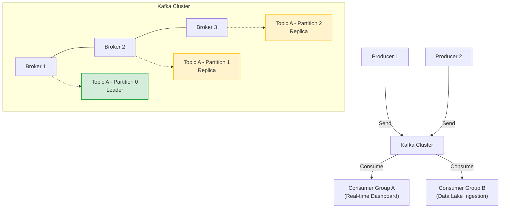
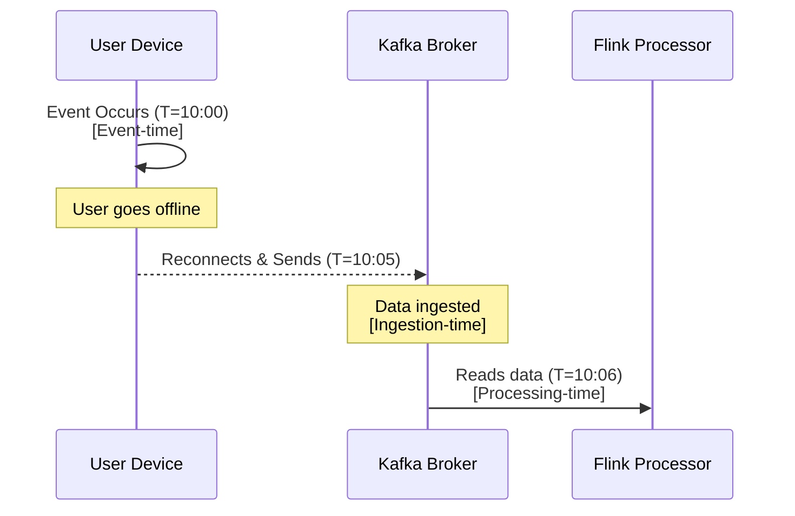

Lộ trình **Streaming Data Engineer** cung cấp hướng dẫn thiết kế, xây dựng và vận hành các hệ thống xử lý dòng dữ liệu thời gian thực (Real-time Streaming) với độ trễ thấp (low-latency) ở quy mô lớn. Nội dung tập trung vào kiến trúc cốt lõi của [Apache Kafka](/concepts/5-stream-processing-realtime/apache-kafka), tư duy xử lý thời gian sự kiện (Event-time), kỹ thuật quản lý trạng thái (Stateful Processing), và các mô hình tính toán phân tán mạnh mẽ nhất hiện nay như Apache Flink hay Spark Streaming.

Trong thời đại dữ liệu lên ngôi, các doanh nghiệp không còn thỏa mãn với việc nhận báo cáo sau 24 giờ. Từ gợi ý sản phẩm thời gian thực (real-time recommendation), cảnh báo gian lận tài chính chỉ trong vài mili-giây, đến giám sát hệ thống IoT hàng triệu thiết bị, **Streaming Data Engineering** đã trở thành kỹ năng "phải có" đối với một Senior Data Engineer.

## Lộ trình này hướng đến ai?

Chúng tôi thiết kế lộ trình chuyên sâu này đặc biệt dành cho:

* **Các kỹ sư dữ liệu (Data Engineer)** đã vững vàng với hệ thống xử lý theo lô (Batch Processing) và muốn bước vào thế giới sự kiện (Event Streaming) thời gian thực đầy thử thách.
* **Kỹ sư Backend / Software Engineer** chịu trách nhiệm thiết kế các hệ thống có độ trễ cực thấp (low-latency), thông lượng cao (high-throughput), và khả năng phục hồi nhanh khi có sự cố.
* **Data Architect / Solution Architect** cần nắm rõ các pattern thiết kế như Lambda Architecture, Kappa Architecture để tư vấn và xây dựng hệ thống nền tảng dữ liệu cho doanh nghiệp.

> [!NOTE]
> Sự khác biệt lớn nhất giữa Batch và Streaming không chỉ nằm ở công cụ (tooling), mà nằm ở **tư duy thời gian** và **tính không giới hạn của dữ liệu** (unbounded data).

## Hành trang cần thiết (Prerequisites)

Để sẵn sàng chinh phục thế giới Streaming, bạn cần có một nền tảng vững chắc:

| Nhóm kỹ năng | Yêu cầu chi tiết |
|---|---|
| **Lập trình (Programming)** | Thành thạo ít nhất một ngôn ngữ xử lý dữ liệu mạnh như Java, Scala hoặc Python. Java/Scala đặc biệt quan trọng khi làm việc sâu với JVM-based frameworks (Kafka, Flink, Spark). |
| **Hệ thống phân tán (Distributed Systems)** | Hiểu rõ các khái niệm: Replication, Partitioning, Consensus (Zookeeper/Raft), Fault-tolerance, Network I/O. |
| **Batch Processing** | Đã hoàn thành các khái niệm cơ bản trong lộ trình Middle/Senior Data Engineer, nắm vững MapReduce, Spark Batch. |
| **Hệ điều hành / Mạng** | Hiểu cơ chế quản lý bộ nhớ (Heap/Off-heap), Garbage Collection (GC) tuning, TCP/IP và socket. |

## Từng Bước Làm Chủ Dòng Dữ Liệu Thời Gian Thực

Hành trình trở thành chuyên gia Streaming Data Engineer đòi hỏi bạn đi qua 5 cột mốc cốt lõi:

### Bước 1: Làm chủ hạ tầng thông điệp với Apache Kafka

Apache Kafka không chỉ là một hàng đợi (message queue) đơn thuần, mà là một **Distributed Commit Log** (Nhật ký giao dịch phân tán). Đây là "trái tim" của hầu hết các kiến trúc dữ liệu hiện đại.

#### Kiến trúc lõi của Kafka
Bạn cần hiểu sâu các thành phần cấu thành:
* **Brokers & Cluster**: Cách các node (broker) phối hợp với nhau.
* **Topics & Partitions**: Cơ chế lưu trữ phân tán. Partition chính là đơn vị mở rộng (unit of scale) của Kafka.
* **Replication & ISR (In-Sync Replicas)**: Cơ chế sao lưu dữ liệu để đảm bảo High Availability (HA).



#### Consumer Groups & Rebalancing
Một tính năng đột phá của Kafka là **[Consumer Groups](/concepts/5-stream-processing-realtime/consumer-groups)**. Khác với RabbitMQ, Kafka cho phép nhiều nhóm Consumer cùng đọc một Topic mà không tiêu hủy dữ liệu. Khi số lượng Consumer thay đổi, Kafka kích hoạt quá trình **Rebalancing** để phân bổ lại các Partitions, đây thường là nguyên nhân gây nghẽn cục bộ (Stop-The-World) mà một kỹ sư cần tối ưu.

**Ví dụ Code (Python bằng `confluent-kafka`): Tạo một Producer cơ bản**
```python
from confluent_kafka import Producer
import json

conf = {
    'bootstrap.servers': 'localhost:9092',
    'client.id': 'python-producer'
}
producer = Producer(conf)

def delivery_report(err, msg):
    if err is not None:
        print(f'Message delivery failed: {err}')
    else:
        print(f'Message delivered to {msg.topic()} [{msg.partition()}] at offset {msg.offset()}')

# Gửi dữ liệu sự kiện
event_data = {"user_id": 123, "action": "click", "timestamp": "2024-01-01T10:00:00Z"}
producer.produce(
    topic='user-clicks',
    key=str(event_data['user_id']),
    value=json.dumps(event_data),
    callback=delivery_report
)
producer.flush()
```
> [!TIP]
> Việc sử dụng **Key** khi gửi message rất quan trọng. Các sự kiện có chung Key (ví dụ `user_id`) sẽ luôn được đưa vào cùng một Partition, đảm bảo thứ tự xử lý (Order Guarantee) cho user đó.

---

### Bước 2: Thấu hiểu Event-time, Processing-time và Watermark

Trong Batch Processing, bạn phân tích dữ liệu tĩnh (đã nằm sẵn trong DB). Trong Streaming, dữ liệu đến liên tục và thường xuyên bị trễ do độ trễ mạng hoặc thiết bị mất kết nối.

#### Các khái niệm thời gian:
1. **Event-time (Thời gian sự kiện)**: Thời điểm sự kiện thực sự sinh ra (ví dụ: giờ thiết bị điện thoại ghi nhận cú click).
2. **Processing-time (Thời gian xử lý)**: Thời điểm server/hệ thống của bạn nhận được dữ liệu.
3. **Ingestion-time**: Thời điểm dữ liệu đi vào Kafka.



#### Watermark là gì?
Nếu bạn đếm số lượt click từ `10:00` đến `10:05` dựa trên Event-time, làm sao bạn biết khi nào có thể "đóng" kết quả lại để tính tổng? Có thể một thiết bị gửi dữ liệu của lúc `10:01` nhưng đến tận `10:06` mới tới.
**[Watermark](/concepts/5-stream-processing-realtime/watermark)** là một ngưỡng thời gian "heuristic" báo hiệu cho hệ thống: *"Tôi tự tin rằng sẽ không còn sự kiện nào có Event-time < X đến hệ thống nữa"*. Nhờ Watermark, hệ thống có thể đóng các cửa sổ thời gian (Window) và tiến hành tính toán mà không bị chờ đợi vô hạn.

---

### Bước 3: Khung thời gian (Windowing) và Stateful Processing

Phân tích dữ liệu vô hạn yêu cầu cắt chúng thành các đoạn nhỏ (Windows) dựa trên thời gian.

#### 1. Tumbling Windows (Cửa sổ trượt cố định)
Cửa sổ thời gian cố định, không chồng chéo.
*Ví dụ*: Tính tổng doanh thu mỗi 5 phút một lần (0:00-0:05, 0:05-0:10).
*Sử dụng*: Báo cáo định kỳ (Hourly reports, Minutely rollups).

#### 2. Sliding Windows (Cửa sổ trượt gối đầu)
Cửa sổ có độ dài cố định nhưng trượt đi (slide) một khoảng thời gian nhỏ hơn độ dài của nó.
*Ví dụ*: Độ dài 10 phút, trượt mỗi 1 phút. Ở phút 0:01 tính (23:51-0:01), phút 0:02 tính (23:52-0:02).
*Sử dụng*: Phát hiện xu hướng tức thời (Trending topics in the last 10 mins).

#### 3. Session Windows (Cửa sổ theo phiên)
Cửa sổ không có độ dài cố định, mà được nhóm theo hoạt động của người dùng. Một session kết thúc khi có một khoảng "Gap" (thời gian không hoạt động) đủ lớn.
*Sử dụng*: Phân tích hành vi người dùng (User Session Analysis).

#### Quản lý trạng thái (Stateful Processing)
Để tính tổng (sum), đếm (count), hoặc join dữ liệu, hệ thống streaming (như Flink) phải lưu trữ trạng thái trung gian (State). State này phải được backup liên tục (Checkpointing) xuống bộ lưu trữ bền vững (HDFS/S3) để có thể phục hồi nếu máy chủ bị sập, đảm bảo không mất dữ liệu.

---

### Bước 4: Đảm bảo xử lý chính xác một lần duy nhất (Exactly-Once Semantics - EOS)

Trong Streaming, khi một server sập và restart lại, nó có thể đọc lại dữ liệu cũ. Việc này dẫn đến 3 mức độ bảo đảm gửi/xử lý tin nhắn (Delivery Semantics):

1. **At-most-once (Nhiều nhất một lần)**: Dữ liệu có thể bị mất, nhưng không bao giờ trùng lặp. (Dễ nhất, hiệu năng cao nhất).
2. **At-least-once (Ít nhất một lần)**: Không bao giờ mất dữ liệu, nhưng có thể bị trùng lặp (Duplicate) khi restart. (Phổ biến, yêu cầu các hệ thống đích (sink) phải có tính Idempotent - ghi đè an toàn).
3. **Exactly-Once (Chính xác một lần)**: Lý tưởng nhất. Mỗi sự kiện chỉ được xử lý cập nhật trạng thái đúng một lần duy nhất, dù hệ thống có sập. 

> [!IMPORTANT]
> Để đạt được Exactly-Once End-to-End, hệ thống yêu cầu sự kết hợp giữa: Source (Kafka hỗ trợ replay), Processing Engine (Flink Checkpointing/Barrier mechanism), và Sink (Hỗ trợ Two-Phase Commit hoặc Idempotent updates).

---

### Bước 5: Thực chiến với các Engine xử lý - Spark vs Flink vs Kafka Streams

Thế giới Streaming hiện bị thống trị bởi 3 gã khổng lồ. Việc lựa chọn công cụ phụ thuộc rất nhiều vào bài toán.

| Tiêu chí | Apache Spark (Structured Streaming) | Apache Flink | Kafka Streams |
|---|---|---|---|
| **Mô hình kiến trúc** | Micro-batching (Lô nhỏ liên tục) / Continuous Processing (Mới) | True-Streaming (Xử lý từng sự kiện một) | Native Kafka Library |
| **Độ trễ (Latency)** | Trung bình (Vài trăm ms đến giây) | Cực thấp (Mili-giây) | Thấp (Mili-giây) |
| **Quản lý State** | Tương đối cơ bản, gắn liền với HDFS checkpoint. | Rất mạnh mẽ (RocksDB State Backend), tối ưu cho state lớn. | Mạnh mẽ, dựa trên RocksDB nội bộ. |
| **Sức mạnh kết hợp Batch** | Cực kỳ xuất sắc. Chung API với Spark Batch. Tốt cho Data Lake. | Mạnh, Flink coi Batch là một trường hợp đặc biệt của Streaming. | Không có Batch Processing. |
| **Use case lý tưởng** | ETL streaming vào Data Lake/Lakehouse, khi team đã quá rành Spark. | Hệ thống Fraud Detection, Rule-engine phức tạp, độ trễ cực thấp. | Các microservices nhỏ cần đọc/ghi lại Kafka không muốn setup Cluster nặng nề. |

---

## Kiến trúc hệ thống Streaming Thực tiễn

Một hệ thống Streaming hiện đại thường được thiết kế theo kiến trúc **Kappa Architecture** (thay thế Lambda Architecture bằng cách dùng Streaming để xử lý cả realtime và reprocessing dữ liệu cũ).

```mermaid
graph LR
    subgraph "Data Sources"
        DB["("OLTP Database<br/>PostgreSQL")"]
        Apps["Web/Mobile Apps"]
        IoT["IoT Devices"]
    end

    subgraph "Data Ingestion"
        CDC["Debezium CDC"]
        API["REST API / Gateway"]
    end

    subgraph "Streaming Backbone"
        Kafka["Apache Kafka<br/>Event Bus"]
        Schema["Schema Registry<br/>Avro/Protobuf"]
    end

    subgraph "Stream Processing"
        Flink["Apache Flink<br/>Stateful Processing"]
    end

    subgraph "Serving & Storage"
        Redis["("Redis/Cassandra<br/>Fast Query")"]
        Iceberg["("Apache Iceberg<br/>Data Lakehouse")"]
    end

    DB -->|Binlog| CDC
    Apps --> API
    IoT --> API
    
    CDC -->|Produce| Kafka
    API -->|Produce| Kafka
    
    Kafka <-->|Validate| Schema
    
    Kafka -->|Consume| Flink
    
    Flink -->|Real-time Sink| Redis
    Flink -->|Periodic Sink| Iceberg
```

### Best Practices & Vận hành (Operations & Tuning)
1. **Schema Management**: Đừng bao giờ gửi JSON thô (raw JSON) không kiểm soát qua Kafka. Hãy sử dụng **Schema Registry** (ví dụ Confluent Schema Registry) kết hợp với định dạng `Avro` hoặc `Protobuf`. Điều này giúp tiết kiệm băng thông và đảm bảo tính tương thích ngược/xuôi (Backward/Forward compatibility) khi cấu trúc dữ liệu thay đổi.
2. **Theo dõi Consumer Lag**: Số liệu quan trọng nhất trong Streaming là `Consumer Lag` (Sự chênh lệch giữa lượng data đẩy vào và lượng data đã xử lý). Sử dụng Prometheus/Grafana để alert nếu Lag tăng cao liên tục.
3. **Xử lý Data Skew**: Khi một key bị dồn quá nhiều dữ liệu (ví dụ: event của một siêu sao trên mạng xã hội), partition chứa key đó sẽ phình to. Cần sử dụng kỹ thuật "Salting" (thêm muối) vào key để phân tán đều ra các partitions.

---

## Dự án thực hành: Phát hiện gian lận tài chính thời gian thực

Đưa lý thuyết vào thực tế bằng cách xây dựng hệ thống **Fraud Detection** end-to-end:

* **Mô tả chi tiết:**
  1. Viết một script Python/Faker tạo lập dòng sự kiện giao dịch thẻ tín dụng và đẩy vào Kafka Topic `transactions`. Mỗi sự kiện có `transaction_id`, `card_id`, `amount`, `location`, `timestamp`.
  2. Triển khai **Apache Flink** cluster. Viết ứng dụng đọc topic `transactions`.
  3. Áp dụng kỹ thuật **Sliding Window** độ dài 5 phút, trượt mỗi 1 phút theo `card_id`.
  4. Nếu trong một window, một `card_id` thực hiện > 5 giao dịch, hoặc có 2 giao dịch cách nhau vài phút nhưng vị trí địa lý cách xa nhau hàng ngàn km (Impossible Travel Rule).
  5. Đánh dấu giao dịch đó là gian lận, đẩy kết quả ra topic `fraud_alerts` trên Kafka.
  6. Một Consumer khác đọc `fraud_alerts` và lưu vào Elasticsearch để hiển thị trên Kibana Dashboard theo thời gian thực.

* **Công nghệ khuyên dùng:** Docker Compose (Kafka, Zookeeper, JobManager/TaskManager Flink, Elasticsearch, Kibana).

---

## Trọng tâm ôn luyện phỏng vấn

Các vị trí Streaming Data Engineer yêu cầu tư duy giải quyết vấn đề dưới áp lực hệ thống phân tán. Hãy chuẩn bị các câu hỏi sau:

1. **Vận hành Consumer Group**: Giải thích chi tiết cơ chế lưu vết vị trí đọc dữ liệu (*offset commit*) trong Kafka. Quá trình tái phân bổ phân vùng (**Rebalancing**) xảy ra khi nào? Làm sao để giảm thiểu ảnh hưởng của Rebalancing?
2. **Xử lý độ trễ và Watermark**: Trình bày rõ cách Flink sử dụng Watermark để quyết định khi nào đóng một cửa sổ (window). Nếu data đến trễ hơn cả mức Watermark (Late Data) thì làm thế nào? (Gợi ý: Bàn về Side Output / Allowed Lateness).
3. **Cơ chế chịu lỗi (Fault-Tolerance)**: Phân biệt Checkpoint và Savepoint trong Flink. Giải thích thuật toán Chandy-Lamport dùng trong Flink Distributed Snapshot.
4. **Data Skew & Tối ưu Partition**: Đưa ra kịch bản và giải pháp khắc phục khi dữ liệu bị phân bổ lệch giữa các partition (Partition Imbalance).
5. **Exactly-once End-to-end**: Trình bày cơ chế Two-Phase Commit (2PC) giữa Flink và Kafka để đạt được Exactly-once.

---

## Tài Liệu Tham Khảo Chuyên Sâu

Để đi sâu hơn vào lĩnh vực này, đây là những tài liệu gối đầu giường bạn không thể bỏ qua:

* **[Sách] Designing Data-Intensive Applications** - *Martin Kleppmann*. Cuốn sách kinh điển nhất mọi thời đại về thiết kế hệ thống phân tán và dữ liệu.
* **[Sách] Kafka: The Definitive Guide** - *Gwen Shapira, Todd Palino*. Sách gối đầu giường để vận hành và tối ưu Apache Kafka.
* **[Sách] Stream Processing with Apache Flink** - *Fabian Hueske, Vasiliki Kalavri*. Bóc tách toàn bộ kiến trúc lõi và kỹ năng viết ứng dụng Flink.
* **[Blog] The Pragmatic Engineer** - *Gergely Orosz* ([Link](https://blog.pragmaticengineer.com/))
* **[Blog] Building Data Infrastructure at Airbnb** - Bài viết từ team Engineering Airbnb về kinh nghiệm xây dựng data platform ([Link])
* **[Tài liệu] Confluent Blog / Flink Forward** - Nơi cập nhật các best practices mới nhất từ những người đóng góp cốt lõi của Kafka và Flink.
