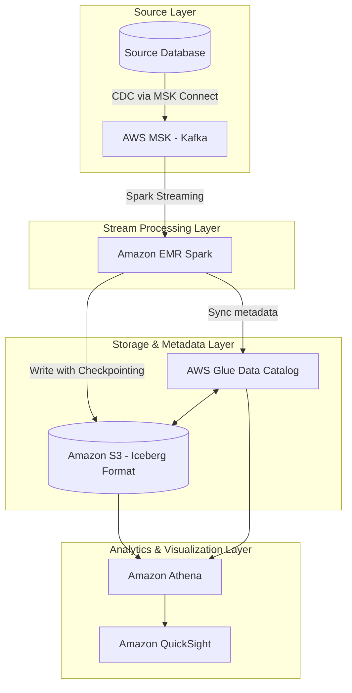

## Giới thiệu kiến trúc

Trong kỷ nguyên Modern Data Stack, nhu cầu thu thập và phân tích dữ liệu tức thời (Real-time Ingestion & Analytics) đã trở thành một yêu cầu cốt lõi. Tuy nhiên, các kiến trúc Data Lake truyền thống (sử dụng định dạng tệp tin phẳng như Parquet hoặc ORC trên Hive metastore) thường gặp khó khăn trong việc xử lý các thao tác cập nhật (Updates), xóa (Deletes) và đảm bảo tính nhất quán dữ liệu (ACID compliance) ở tần suất cao. 

Kiến trúc **Lakehouse** hiện đại sử dụng **Apache Iceberg** giải quyết triệt để các vấn đề này bằng cách mang đến khả năng giao dịch ACID, tối ưu hóa các câu truy vấn thời gian thực và quản lý metadata hiệu quả. Bài viết này hướng dẫn chi tiết cách thiết lập một luồng xử lý dữ liệu thời gian thực khép kín từ cơ sở dữ liệu nguồn lên AWS Cloud.

Để nắm vững các khái niệm nền tảng trước khi đi vào dự án này, bạn có thể tham khảo thêm về [/concepts/4-realtime/streaming-processing/apache-kafka](/concepts/4-realtime/streaming-processing/apache-kafka), [/concepts/4-realtime/streaming-processing/spark-structured-streaming](/concepts/4-realtime/streaming-processing/spark-structured-streaming), và cơ chế [/concepts/4-realtime/streaming-processing/watermark](/concepts/4-realtime/streaming-processing/watermark) để hiểu sâu hơn về quản lý dữ liệu đến muộn cũng như [/concepts/4-realtime/streaming-processing/exactly-once-semantics](/concepts/4-realtime/streaming-processing/exactly-once-semantics) để đảm bảo tính toàn vẹn dữ liệu.

---

## Sơ đồ luồng dữ liệu (Data Flow)

Dưới đây là mô hình kiến trúc luồng dữ liệu từ hệ thống nguồn (Transactional Database) cho đến lớp hiển thị báo cáo (BI Dashboard) trên AWS:



---

## Chi tiết thiết kế kiến trúc (Architectural Design)

### 1. Source Database -> AWS MSK (CDC Layer)
Quy trình bắt đầu từ cơ sở dữ liệu tác nghiệp (Transactional Databases như PostgreSQL, MySQL). Sử dụng giải pháp **Change Data Capture (CDC)** (ví dụ: Debezium chạy trên **AWS MSK Connect**), mọi thay đổi dữ liệu (INSERT, UPDATE, DELETE) đều được ghi nhận dưới dạng các sự kiện (events) và đẩy trực tiếp vào các Topic của Kafka. Điều này giúp tránh việc truy vấn trực tiếp vào cơ sở dữ liệu production, hạn chế ảnh hưởng đến hiệu năng hệ thống chính.

### 2. AWS MSK (Kafka)
**AWS MSK (Amazon Managed Streaming for Apache Kafka)** đóng vai trò là xương sống cho việc truyền tin bảo mật và hiệu năng cao. MSK được cấu hình trên nhiều Availability Zones (Multi-AZ) để đảm bảo tính sẵn sàng cao. Hệ thống sử dụng **AWS IAM Authentication** thay thế cho các phương thức xác thực truyền thống, đồng thời dữ liệu được mã hóa cả khi truyền (in-transit) bằng TLS và khi lưu trữ (at-rest) bằng AWS KMS.

### 3. EMR Spark Streaming
**Amazon EMR (Elastic MapReduce)** chạy ứng dụng Spark Structured Streaming liên tục đọc dữ liệu từ MSK. Spark tận dụng khả năng tính toán phân tán để parse, transform dữ liệu thô từ định dạng JSON/Avro sang cấu trúc quan hệ. Các cơ chế xử lý nâng cao như **Watermark** được áp dụng để đối phó với dữ liệu đến muộn (late-arriving data) trong các phép tính toán tổng hợp theo thời gian (windowed aggregations).

### 4. Apache Iceberg format trên S3
Dữ liệu sau khi xử lý được ghi trực tiếp xuống Amazon S3 dưới định dạng bảng **Apache Iceberg**. Iceberg hoạt động dựa trên cấu trúc cây metadata phân cấp (Hierarchical Metadata Tree), tách biệt hoàn toàn phần metadata lưu trữ trạng thái bảng và dữ liệu thực tế (data files). 
Để tối ưu hóa luồng ghi liên tục, chế độ **Merge-on-Read (MoR)** được áp dụng. Thay vì ghi đè toàn bộ file dữ liệu cũ khi có cập nhật (Copy-on-Write), MoR chỉ ghi các file dữ liệu mới và các file log chứa vị trí dữ liệu bị xóa (Delete Files), giúp cải thiện đáng kể tốc độ ghi luồng (write latency).

### 5. AWS Glue Catalog Metadata Sync
Catalog của Apache Iceberg được đồng bộ trực tiếp với **AWS Glue Data Catalog**. Khi Spark ghi dữ liệu mới hoặc cập nhật metadata của Iceberg, thông tin schema và các snapshot mới nhất của bảng sẽ tự động cập nhật lên Glue Data Catalog. Không cần chạy các công cụ quét dữ liệu (Glue Crawlers) định kỳ để nhận diện phân vùng mới, giúp giảm chi phí và độ trễ đồng bộ.

### 6. Amazon Athena & Amazon QuickSight
**Amazon Athena** (phiên bản v3 hỗ trợ đầy đủ Apache Iceberg) đóng vai trò là công cụ truy vấn không máy chủ (Serverless Query Engine). Người dùng hoặc các nhà phân tích dữ liệu có thể thực thi các câu lệnh SQL trực tiếp trên Athena để phân tích dữ liệu trên S3 thông qua Glue Catalog. Cuối cùng, dữ liệu được trực quan hóa thông qua **Amazon QuickSight** bằng cách kết nối trực tiếp (Direct Query) hoặc thông qua bộ nhớ đệm SPICE để tăng tốc độ kết xuất dashboard.

---

## Mã nguồn PySpark Streaming Logic

Dưới đây là toàn bộ mã nguồn PySpark chạy trên Amazon EMR, thực hiện việc đọc dữ liệu từ AWS MSK, áp dụng cơ chế watermark và ghi trực tiếp vào bảng Iceberg với cấu hình tối ưu Merge-on-Read.

```python
import os
import sys
from pyspark.sql import SparkSession
from pyspark.sql.functions import col, from_json, to_timestamp
from pyspark.sql.types import StructType, StructField, StringType, DoubleType, TimestampType

def init_spark_session():
    """
    Khởi tạo SparkSession tích hợp sẵn thư viện Iceberg và AWS Glue Catalog.
    """
    return SparkSession.builder \
        .appName("AWS-Realtime-Iceberg-Ingestion") \
        .config("spark.sql.extensions", "org.apache.iceberg.spark.extensions.IcebergSparkSessionExtensions") \
        .config("spark.sql.catalog.glue_catalog", "org.apache.iceberg.spark.SparkCatalog") \
        .config("spark.sql.catalog.glue_catalog.catalog-impl", "org.apache.iceberg.aws.glue.GlueCatalog") \
        .config("spark.sql.catalog.glue_catalog.warehouse", "s3://my-lakehouse-warehouse-bucket/iceberg/") \
        .config("spark.sql.catalog.glue_catalog.io-impl", "org.apache.iceberg.aws.s3.S3FileIO") \
        .getOrCreate()

def main():
    spark = init_spark_session()
    
    # Định nghĩa cấu trúc schema của payload tin nhắn từ Kafka
    payload_schema = StructType([
        StructField("transaction_id", StringType(), False),
        StructField("user_id", StringType(), False),
        StructField("amount", DoubleType(), False),
        StructField("status", StringType(), False),
        StructField("event_time", StringType(), False)
    ])
    
    # Cấu hình kết nối tới AWS MSK sử dụng IAM authentication
    # Chú ý: TODO(security) - Đảm bảo phân quyền IAM Role cho EMR EC2 Instance có quyền truy cập MSK và S3
    kafka_bootstrap_servers = "b-1.my-msk-cluster.us-east-1.amazonaws.com:9098,b-2.my-msk-cluster.us-east-1.amazonaws.com:9098"
    kafka_topic = "cdc_transactions"
    
    # Đọc luồng dữ liệu từ Kafka
    kafka_stream_df = spark.readStream \
        .format("kafka") \
        .option("kafka.bootstrap.servers", kafka_bootstrap_servers) \
        .option("subscribe", kafka_topic) \
        .option("startingOffsets", "latest") \
        .option("kafka.security.protocol", "SASL_SSL") \
        .option("kafka.sasl.mechanism", "AWS_MSK_IAM") \
        .option("kafka.sasl.jaas.config", "software.amazon.msk.auth.iam.IAMLoginModule required;") \
        .option("kafka.sasl.client.callback.handler.class", "software.amazon.msk.auth.iam.IAMClientCallbackHandler") \
        .load()
        
    # Xử lý parse payload JSON và áp dụng Watermark 10 phút để loại bỏ dữ liệu muộn quá hạn
    processed_df = kafka_stream_df \
        .selectExpr("CAST(value AS STRING) as json_str") \
        .select(from_json(col("json_str"), payload_schema).alias("data")) \
        .select("data.*") \
        .withColumn("timestamp", to_timestamp(col("event_time"), "yyyy-MM-dd HH:mm:ss")) \
        .withWatermark("timestamp", "10 minutes")
        
    # Tạo bảng Iceberg nếu chưa tồn tại với các tham số tối ưu Merge-on-Read (MoR)
    # Các tham số này đảm bảo quá trình ghi diễn ra nhanh chóng, tránh ghi đè toàn bộ tệp Parquet gốc
    spark.sql("""
        CREATE TABLE IF NOT EXISTS glue_catalog.default.transactions_iceberg (
            transaction_id STRING,
            user_id STRING,
            amount DOUBLE,
            status STRING,
            timestamp TIMESTAMP
        ) 
        USING iceberg
        PARTITIONED BY (days(timestamp))
        TBLPROPERTIES (
            'write.update.mode' = 'merge-on-read',
            'write.delete.mode' = 'merge-on-read',
            'write.merge.mode' = 'merge-on-read',
            'write.format.default' = 'parquet',
            'write.object-storage.enabled' = 'true',
            'history.expire.max-snapshot-age-ms' = '86400000',
            'write.spark.accept-any-schema' = 'true'
        )
    """)
    
    # Thiết lập checkpoint trên S3 để khôi phục trạng thái khi hệ thống gặp lỗi (Fault Tolerance)
    checkpoint_path = "s3://my-lakehouse-warehouse-bucket/checkpoints/transactions_iceberg_stream/"
    
    # Ghi luồng dữ liệu trực tiếp vào Iceberg table
    query = processed_df.writeStream \
        .format("iceberg") \
        .outputMode("append") \
        .trigger(processingTime="1 minute") \
        .option("path", "glue_catalog.default.transactions_iceberg") \
        .option("checkpointLocation", checkpoint_path) \
        .start()
        
    query.awaitTermination()

if __name__ == "__main__":
    main()
```

### Giải thích các tham số cấu hình chính:
*   **`write.update.mode` = 'merge-on-read'**: Khi xảy ra cập nhật dữ liệu, Spark sẽ ghi một tập tin delete file (dạng positional hoặc equality delete) thay vì ghi đè toàn bộ tập tin Parquet. Điều này giúp giảm thiểu hiện tượng khuếch đại ghi (write amplification).
*   **`write.object-storage.enabled` = 'true'**: Sử dụng thuật toán băm thư mục của Iceberg trên S3 để tránh tình trạng giới hạn số lượng request (Request Throttling) của S3 khi lưu trữ quá nhiều tập tin trong cùng một prefix.
*   **`withWatermark("timestamp", "10 minutes")`**: Cho phép Spark duy trì trạng thái lưu trữ của các sự kiện trong vòng 10 phút. Bất kỳ sự kiện nào có thời gian trễ hơn 10 phút so với thời gian lớn nhất ghi nhận được sẽ bị loại bỏ khỏi luồng xử lý thời gian thực để bảo vệ tài nguyên bộ nhớ hệ thống.

---

## Cấu hình EMR & AWS Glue Catalog Setup

### 1. EMR Cluster Configuration
Khi khởi tạo EMR cluster (ví dụ EMR 6.x trở lên), bạn cần tích hợp các gói thư viện runtime của Apache Iceberg và AWS Bundle. Thêm các tham số sau vào cấu hình Spark:

```bash
# Lệnh Submit Spark job trên EMR chỉ định các Package cần thiết
spark-submit \
  --deploy-mode cluster \
  --packages org.apache.iceberg:iceberg-spark-runtime-3.3_2.12:1.3.1,org.apache.iceberg:iceberg-aws-bundle:1.3.1 \
  --jars /usr/share/aws/aws-msk-iam-auth/aws-msk-iam-auth-1.1.1-all.jar \
  s3://my-lakehouse-warehouse-bucket/scripts/aws-e2e-project.py
```

Nếu cấu hình thông qua EMR Configurations JSON tại thời điểm tạo cluster:

```json
[
  {
    "Classification": "spark-defaults",
    "Properties": {
      "spark.sql.extensions": "org.apache.iceberg.spark.extensions.IcebergSparkSessionExtensions",
      "spark.sql.catalog.glue_catalog": "org.apache.iceberg.spark.SparkCatalog",
      "spark.sql.catalog.glue_catalog.catalog-impl": "org.apache.iceberg.aws.glue.GlueCatalog",
      "spark.sql.catalog.glue_catalog.io-impl": "org.apache.iceberg.aws.s3.S3FileIO",
      "spark.sql.catalog.glue_catalog.warehouse": "s3://my-lakehouse-warehouse-bucket/iceberg/"
    }
  }
]
```

### 2. Thiết lập AWS Glue Data Catalog
Một ưu điểm lớn của Apache Iceberg là tương tác trực tiếp với **AWS Glue Data Catalog** thông qua API. 
*   **Không cần Glue Crawler**: Trong các kiến trúc Hive truyền thống, bạn phải chạy Glue Crawler định kỳ để cập nhật phân vùng. Với Iceberg, Spark thực hiện thao tác cập nhật metadata trực tiếp lên Glue Catalog tại mỗi transaction commit. Athena và các dịch vụ khác sẽ thấy dữ liệu mới ngay lập tức.
*   **Phân quyền IAM Least Privilege**: Đảm bảo EMR EC2 Instance Profile có đủ quyền ghi lên bucket S3 chứa dữ liệu, đồng thời có các quyền cụ thể của Glue Data Catalog như `glue:CreateTable`, `glue:UpdateTable`, `glue:GetTable`, và `glue:GetPartitions`.

---

## Điểm mạnh (Pros) và điểm yếu (Cons)

### Điểm mạnh (Pros)
*   **Đảm bảo tính nhất quán (ACID Properties)**: Hỗ trợ các giao dịch ACID mạnh mẽ, tránh hiện tượng đọc dữ liệu bị lỗi/rách (dirty reads) trong khi luồng ghi đang hoạt động.
*   **Hỗ trợ Schema Evolution**: Cho phép thêm, sửa, đổi tên cột dễ dàng mà không làm hỏng dữ liệu lịch sử hoặc cần viết lại các tệp tin cũ.
*   **Tối ưu hóa chi phí và hiệu năng truy vấn**: Kết hợp phân vùng ẩn (Hidden Partitioning) giúp Athena bỏ qua việc quét các tệp tin không liên quan, tăng tốc độ truy vấn đáng kể.
*   **Time Travel**: Cho phép người dùng truy vấn dữ liệu tại một thời điểm hoặc một snapshot ID cụ thể trong quá khứ, hỗ trợ tốt cho việc debug và kiểm toán (auditing).

### Điểm yếu (Cons)
*   **Vấn đề tệp tin nhỏ (Small File Problem)**: Quá trình ghi streaming liên tục (ví dụ trigger mỗi 1 phút) sẽ sinh ra hàng ngàn tệp tin Parquet siêu nhỏ trên S3. Điều này làm giảm hiệu năng truy vấn của Athena do phải đọc quá nhiều file nhỏ.
*   **Chi phí duy trì Metadata**: Việc lưu giữ quá nhiều snapshot sẽ làm tăng dung lượng lưu trữ trên S3. Cần thiết lập vòng đời dọn dẹp snapshot cũ định kỳ.
*   **Độ phức tạp trong vận hành**: Đòi hỏi quy trình compaction (nén file) và bảo trì bảng phải được thực hiện thường xuyên thông qua các tác vụ Spark chạy nền.

---

## Khi nào nên dùng và không nên dùng

### Khi nào nên dùng
*   Hệ thống yêu cầu xử lý dữ liệu thay đổi liên tục từ các nguồn CDC (Transactional Databases) với độ trễ tính bằng phút (Near real-time).
*   Yêu cầu tính tuân thủ bảo mật dữ liệu cao như xóa thông tin người dùng theo luật GDPR/CCPA trên Data Lake.
*   Hệ thống có nhiều người dùng đồng thời: Vừa thực hiện ghi streaming liên tục vừa có các nhà phân tích chạy các câu hỏi truy vấn báo cáo ad-hoc quy mô lớn qua Athena.

### Không nên dùng
*   Các ứng dụng yêu cầu độ trễ cực thấp dưới một giây (Sub-second latency) như phát hiện gian lận thẻ tín dụng tức thời (Real-time fraud detection). Trong trường hợp này, các cơ sở dữ liệu thời gian thực như Apache Flink phối hợp với ClickHouse hoặc Apache Pinot là lựa chọn phù hợp hơn.
*   Các luồng dữ liệu chỉ ghi thêm (Append-only) đơn giản không bao giờ có thay đổi (chẳng hạn như log sự kiện click của người dùng - clickstream). Việc sử dụng bảng Parquet thông thường phân vùng theo ngày sẽ tiết kiệm chi phí và vận hành đơn giản hơn nhiều.

---

## Trọng tâm ôn luyện phỏng vấn

### Q1: Phân biệt cơ chế Copy-on-Write (CoW) và Merge-on-Read (MoR) trong Apache Iceberg. Khi nào nên dùng loại nào cho luồng streaming?
*   **Trả lời**:
    *   **Copy-on-Write (CoW)**: Khi có bản ghi bị cập nhật hoặc xóa, Iceberg sẽ đọc tệp Parquet chứa bản ghi đó, áp dụng thay đổi, và ghi ra một tệp Parquet hoàn toàn mới. CoW tối ưu cho hiệu năng đọc (Read-optimized) vì không cần ghép dữ liệu khi truy vấn, nhưng gây tốn tài nguyên và tăng độ trễ khi ghi (Write amplification).
    *   **Merge-on-Read (MoR)**: Khi ghi dữ liệu mới hoặc cập nhật, Iceberg ghi trực tiếp các tệp dữ liệu mới kèm theo các tệp tin delete (Delete Files) chứa danh sách các dòng bị xóa/cập nhật. Tốc độ ghi rất nhanh (Write-optimized). Tuy nhiên, khi truy vấn, công cụ như Athena phải thực hiện ghép (merge) dữ liệu thực tế và delete files tại thời điểm đọc, làm tăng độ trễ truy vấn.
    *   **Lựa chọn cho streaming**: Cho các luồng streaming ghi liên tục với tần suất cao, ta **nên dùng Merge-on-Read** để giữ độ trễ ghi ở mức thấp nhất và tránh quá tải hệ thống ghi. Sau đó, chạy tác vụ Compaction bất đồng bộ để gộp các file nhỏ lại sau.

### Q2: Làm thế nào để giải quyết vấn đề tệp tin nhỏ (Small File Problem) do Spark Streaming tạo ra trên bảng Iceberg?
*   **Trả lời**: Để giải quyết vấn đề tệp tin nhỏ, ta cần thực hiện quy trình **Compaction** (nén tệp). Apache Iceberg cung cấp API thông qua Spark để thực hiện việc này một cách an toàn mà không làm gián đoạn luồng ghi đang chạy:
    1.  **Bin-packing hoặc Sort**: Gộp các tệp nhỏ thành các tệp lớn (dung lượng tiêu chuẩn khoảng 128MB - 512MB).
    2.  **Expire Snapshots**: Giải phóng các snapshot cũ đã hết hạn để xóa bỏ các tệp Parquet không còn sử dụng trên S3.
    3.  **Delete Orphan Files**: Xóa các tệp mồ côi không được tham chiếu bởi bất kỳ metadata snapshot nào.
    *   *Mẫu câu lệnh thực hiện trên Spark*:
        ```sql
        CALL glue_catalog.system.rewrite_data_files(
          table => 'default.transactions_iceberg',
          options => map('max-file-size-bytes', '536870912')
        );
        ```

### Q3: Làm thế nào Spark Structured Streaming kết hợp với Apache Iceberg đảm bảo tính năng ghi Exactly-Once?
*   **Trả lời**: Tính năng Exactly-Once đạt được nhờ sự phối hợp của ba cơ chế:
    1.  **Replayable Source (Kafka)**: Spark có thể đọc lại dữ liệu từ bất kỳ offset nào trong Kafka khi xảy ra sự cố.
    2.  **Structured Streaming Checkpoint**: Spark lưu trữ các thông tin meta về offset đã xử lý thành công lên một thư mục an toàn trên S3.
    3.  **Iceberg Atomic Commits**: Apache Iceberg hỗ trợ cơ chế commit nguyên tử (Atomic Commit). Mỗi batch ghi thành công của Spark sẽ tạo ra một snapshot mới trong file metadata của Iceberg. Nếu quá trình ghi của Spark bị lỗi giữa chừng, snapshot đó sẽ không được commit vào metadata chính của Iceberg, dữ liệu lỗi trên S3 sẽ bị bỏ qua và Spark sẽ thử lại (retry) batch đó dựa trên thông tin offset trong checkpoint.

---

## English Summary

Implementing a real-time ingestion and analytics pipeline on AWS using MSK, EMR Spark, and Apache Iceberg provides a modern, scalable, and transactional Lakehouse architecture. 

### Key takeaways:
*   **CDC Integration**: Seamlessly captures transactional changes using MSK Connect and broadcasts them to Kafka topics.
*   **Spark-Iceberg Catalyst**: EMR PySpark leverages Structured Streaming with proper checkpointing and watermark configurations to ingest data securely and reliably.
*   **Merge-on-Read (MoR)**: Essential for high-frequency streaming updates, minimizing write amplification by writing position/equality delete files instead of full Parquet rewrites.
*   **Direct Cataloging**: Bypasses traditional file scanners (Glue Crawlers) by updating the AWS Glue Data Catalog atomically at the end of each Spark micro-batch transaction, enabling instant SQL querying with Amazon Athena.
*   **Compaction Utility**: Essential in production to counter the small file problem through scheduled `rewrite_data_files` Spark jobs.

---

## Tài liệu tham khảo

*   [AWS MSK Developer Guide - Managed Streaming for Apache Kafka](https://docs.aws.amazon.com/msk/latest/developerguide/what-is-msk.html)
*   [Apache Iceberg Spark Integration - Configuration & Queries](https://iceberg.apache.org/docs/latest/spark-queries/)
*   [Amazon EMR Serverless Spark - Running Streaming Applications](https://docs.aws.amazon.com/emr/latest/EMR-Serverless-UserGuide/emr-serverless.html)
*   [AWS Glue Data Catalog Developer Guide - Populate Schema](https://docs.aws.amazon.com/glue/latest/dg/populate-data-catalog.html)
*   [Amazon Athena Iceberg Queries - SQL Syntax & Performance](https://docs.aws.amazon.com/athena/latest/ug/querying-iceberg.html)
*   [Apache Spark Structured Streaming Guide - Production Best Practices](https://spark.apache.org/docs/latest/structured-streaming-programming-guide.html)
