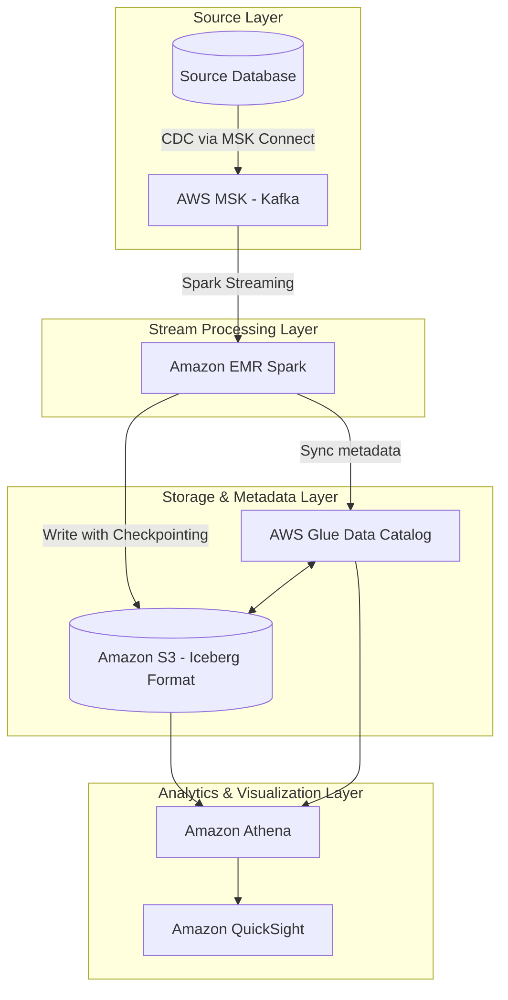
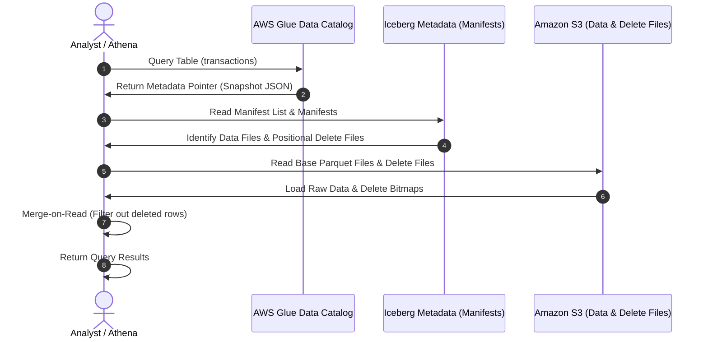

## Giới thiệu kiến trúc

Trong kỷ nguyên Modern Data Stack, nhu cầu thu thập và phân tích dữ liệu tức thời (Real-time Ingestion & Analytics) đã trở thành một yêu cầu cốt lõi. Tuy nhiên, các kiến trúc Data Lake truyền thống sử dụng định dạng tệp tin phẳng như Parquet hoặc ORC trên Hive Metastore thường gặp khó khăn trong việc xử lý các thao tác cập nhật (Updates), xóa (Deletes) và đảm bảo tính nhất quán dữ liệu (ACID compliance) ở tần suất cao. 

Kiến trúc này được thiết kế và tối ưu hóa dựa trên thực tế vận hành hệ thống dữ liệu quy mô exabyte của **Netflix** (đơn vị thiết kế và phát triển ban đầu của Apache Iceberg) và các khuyến nghị kỹ thuật từ **AWS Architecture Blog**. Netflix phát triển Iceberg nhằm khắc phục các giới hạn nghiêm trọng của Hive trên Amazon S3, đặc biệt là hiện tượng nghẽn cổ chai khi thực hiện quét danh mục thư mục (S3 directory listing) và sự thiếu nhất quán (consistency) của dữ liệu khi có nhiều tiến trình ghi đồng thời.

Bằng cách kết hợp **AWS MSK (Apache Kafka)**, **Amazon EMR (Apache Spark Structured Streaming)** và định dạng bảng **Apache Iceberg** lưu trữ trên **Amazon S3**, kiến trúc này thiết lập một nền tảng **Lakehouse** hiện đại. Hệ thống cho phép thực hiện các truy vấn SQL trực tiếp qua **Amazon Athena** với độ trễ thấp, hỗ trợ đầy đủ các giao dịch ACID và bảo vệ tính toàn vẹn dữ liệu.

Để nắm vững các khái niệm nền tảng trước khi đi vào dự án này, bạn có thể tham khảo thêm về [/concepts/4-realtime/streaming-processing/apache-kafka](/concepts/4-realtime/streaming-processing/apache-kafka), [/concepts/4-realtime/streaming-processing/spark-structured-streaming](/concepts/4-realtime/streaming-processing/spark-structured-streaming), và cơ chế [/concepts/4-realtime/streaming-processing/watermark](/concepts/4-realtime/streaming-processing/watermark) để hiểu sâu hơn về quản lý dữ liệu đến muộn cũng như [/concepts/4-realtime/streaming-processing/exactly-once-semantics](/concepts/4-realtime/streaming-processing/exactly-once-semantics) để đảm bảo tính toàn vẹn dữ liệu.

---

## Sơ đồ luồng dữ liệu (Data Flow)

Kiến trúc phân tầng từ khâu thu thập dữ liệu (Ingestion) cho đến khâu tiêu thụ (Consumption) được thể hiện qua sơ đồ dưới đây:



Khi người dùng thực hiện truy vấn các bảng Iceberg cấu hình theo chế độ **Merge-on-Read (MoR)**, quá trình đối chiếu dữ liệu giữa các file nền (base files) và file đánh dấu xóa (delete files) diễn ra trực tiếp tại thời điểm truy vấn:



---

## Chi tiết thiết kế kiến trúc (Architectural Design)

### 1. Source Database -> AWS MSK (CDC Layer)
Quy trình bắt đầu tại cơ sở dữ liệu tác nghiệp (Transactional Databases như PostgreSQL). Sử dụng giải pháp **Change Data Capture (CDC)** chạy trên **AWS MSK Connect** (vận hành Debezium connector), mọi thay đổi dữ liệu (INSERT, UPDATE, DELETE) đều được ghi nhận trực tiếp từ transaction logs (Write-Ahead Log - WAL) và đẩy dưới dạng các sự kiện (events) vào các Topic của Kafka. Điều này giúp loại bỏ hoàn toàn các truy vấn quét bảng (`SELECT *`) định kỳ, hạn chế tối đa ảnh hưởng đến hiệu năng của hệ thống production chính.

### 2. AWS MSK (Kafka) Configuration
**AWS MSK (Amazon Managed Streaming for Apache Kafka)** đóng vai trò là hàng đợi tin nhắn phân tán, chịu lỗi cao. Cấu hình sản xuất thực tế yêu cầu:
*   **Partition Strategy**: Mỗi topic được chia nhỏ thành tối thiểu **32 partitions** để phân bổ đều tải ghi và cho phép nhóm consumer (EMR Spark) đọc dữ liệu song song hiệu quả.
*   **Multi-AZ Deployment**: MSK chạy trên 3 Availability Zones với Replication Factor bằng 3. Cấu hình topic yêu cầu `min.insync.replicas=2` và `unclean.leader.election.enable=false` để ngăn chặn mất dữ liệu khi mất broker.
*   **Producer Settings**: Debezium được cấu hình với `acks=all` (đảm bảo ghi thành công lên cả leader và replicas), `retries=2147483647` (thử lại vô hạn khi lỗi tạm thời) và `max.in.flight.requests.per.connection=5` để giữ đúng thứ tự sự kiện.
*   **Mã hóa và Xác thực**: Dữ liệu truyền đi được mã hóa bằng TLS (in-transit) và mã hóa lưu trữ bằng AWS KMS (at-rest). Xác thực sử dụng **AWS IAM Access Control for MSK** giúp loại bỏ việc lưu trữ credentials dạng tĩnh.

### 3. EMR Spark Streaming Engine
**Amazon EMR (Elastic MapReduce)** chạy ứng dụng Spark Structured Streaming liên tục đọc dữ liệu từ MSK.
*   **Sizing cụ thể**: Cụm EMR gồm 1 Master Node và 4 Core Nodes (sử dụng instance type `m6g.2xlarge` chạy kiến trúc Graviton với 8 vCPUs và 32GB RAM).
*   **Spark Resource Tuning**:
    *   `spark.executor.instances=8`
    *   `spark.executor.cores=4`
    *   `spark.executor.memory=12g`
    *   `spark.yarn.executor.memoryOverhead=2048`
    *   `spark.memory.fraction=0.6` (tối ưu hóa vùng nhớ cho việc lưu trữ state của streaming).
*   **Stream Processing & Watermark**: Spark Structured Streaming đọc dữ liệu từ Kafka, phân tích chuỗi JSON thô sang cấu trúc quan hệ. Cơ chế `withWatermark("timestamp", "10 minutes")` được thiết lập nhằm duy trì trạng thái lưu trữ của các sự kiện trong vòng 10 phút. Bất kỳ sự kiện nào trễ hơn 10 phút so với thời gian lớn nhất ghi nhận được sẽ bị loại bỏ để tránh tràn bộ nhớ executor.

### 4. Apache Iceberg format trên S3
Dữ liệu sau khi xử lý được ghi trực tiếp xuống Amazon S3 dưới định dạng **Apache Iceberg**.
*   **Merge-on-Read (MoR)**: Để giảm thiểu độ trễ ghi của luồng streaming (write latency), bảng được thiết lập thuộc tính MoR. Khi có sự kiện cập nhật hoặc xóa dữ liệu, Iceberg không ghi đè lại toàn bộ tệp tin Parquet chứa bản ghi cũ (Copy-on-Write) mà chỉ ghi dữ liệu mới và tệp tin Delete File dạng vị trí (Positional Delete). Việc ghép dữ liệu thực tế và các file delete này sẽ được trì hoãn đến khi Athena hoặc Spark thực thi câu lệnh đọc.
*   **Hidden Partitioning**: Iceberg tự động quản lý phân vùng thông qua cấu hình `days(timestamp)`. Người dùng không cần tạo cột phân vùng vật lý và viết bộ lọc thủ công trong SQL; Iceberg tự động bỏ qua các phân vùng không chứa dữ liệu cần truy vấn (partition pruning), tăng tốc truy vấn rõ rệt.
*   **Object Storage Layout**: Kích hoạt `write.object-storage.enabled = 'true'` để Iceberg băm tên đường dẫn (deterministic hash) của các file dữ liệu trên S3. Cấu hình này giúp phân tán đều các yêu cầu I/O trên S3, tránh giới hạn băng thông mặc định của S3 (3,500 PUT/5,500 GET request mỗi giây trên mỗi prefix).

### 5. AWS Glue Catalog Metadata Sync & DynamoDB Lock Manager
Catalog của Apache Iceberg được tích hợp và đồng bộ trực tiếp với **AWS Glue Data Catalog**.
*   **Atomic Commits**: Khi Spark hoàn tất ghi một batch, nó sẽ tạo ra một snapshot mới và thực hiện commit nguyên tử. Glue Catalog lưu trữ con trỏ tới file metadata JSON mới nhất.
*   **DynamoDB Lock Manager**: Để giải quyết xung đột khi có nhiều tiến trình ghi đồng thời vào cùng một bảng Iceberg (ví dụ luồng ghi streaming song song với tiến trình Compaction bất đồng bộ), hệ thống cấu hình sử dụng DynamoDB làm trình quản lý khóa (Lock Manager):
    *   `spark.sql.catalog.glue_catalog.lock-impl=org.apache.iceberg.aws.glue.DynamoDbLockManager`
    *   `spark.sql.catalog.glue_catalog.lock.table=my_iceberg_lock_table`
    Điều này ngăn chặn hiện tượng mất mát metadata hoặc ghi đè snapshot lẫn nhau.

### 6. Amazon Athena & Amazon QuickSight
**Amazon Athena (Engine v3)** đóng vai trò là công cụ truy vấn không máy chủ (Serverless Query Engine). Athena đọc trực tiếp con trỏ metadata của bảng Iceberg từ Glue Catalog, sau đó chỉ quét các tệp tin Parquet liên quan trên S3 để trả kết quả. **Amazon QuickSight** kết nối tới Athena ở chế độ Direct Query để đảm bảo hiển thị số liệu cập nhật liên tục hoặc qua SPICE engine để tăng tốc độ kết xuất dữ liệu cho hàng ngàn người dùng nội bộ.

---

## Mã nguồn PySpark Streaming Logic

Dưới đây là mã nguồn PySpark chạy trên Amazon EMR, thực hiện việc đọc dữ liệu từ AWS MSK, áp dụng cơ chế watermark, cấu hình khóa DynamoDB và ghi trực tiếp vào bảng Iceberg với cấu hình tối ưu Merge-on-Read.

```python
import os
import sys
from pyspark.sql import SparkSession
from pyspark.sql.functions import col, from_json, to_timestamp
from pyspark.sql.types import StructType, StructField, StringType, DoubleType, TimestampType

def init_spark_session():
    """
    Khởi tạo SparkSession tích hợp thư viện Iceberg, AWS Glue Catalog và DynamoDB Lock Manager.
    """
    return SparkSession.builder \
        .appName("AWS-Realtime-Iceberg-Ingestion") \
        .config("spark.sql.extensions", "org.apache.iceberg.spark.extensions.IcebergSparkSessionExtensions") \
        .config("spark.sql.catalog.glue_catalog", "org.apache.iceberg.spark.SparkCatalog") \
        .config("spark.sql.catalog.glue_catalog.catalog-impl", "org.apache.iceberg.aws.glue.GlueCatalog") \
        .config("spark.sql.catalog.glue_catalog.warehouse", "s3://my-lakehouse-warehouse-bucket/iceberg/") \
        .config("spark.sql.catalog.glue_catalog.io-impl", "org.apache.iceberg.aws.s3.S3FileIO") \
        .config("spark.sql.catalog.glue_catalog.lock-impl", "org.apache.iceberg.aws.glue.DynamoDbLockManager") \
        .config("spark.sql.catalog.glue_catalog.lock.table", "iceberg_catalog_lock") \
        .getOrCreate()

def main():
    spark = init_spark_session()
    
    # Định nghĩa cấu trúc schema của payload tin nhắn từ Kafka
    payload_schema = StructType([
        StructField("transaction_id", StringType(), False),
        StructField("user_id", StringType(), False),
        StructField("amount", DoubleType(), False),
        StructField("status", StringType(), False),
        StructField("event_time", StringType(), False)
    ])
    
    # Cấu hình kết nối tới AWS MSK sử dụng IAM authentication
    # LƯU Ý BẢO MẬT: Đảm bảo phân quyền IAM Role cho EMR EC2 Instance có quyền truy cập MSK, S3 và DynamoDB
    kafka_bootstrap_servers = "b-1.my-msk-cluster.us-east-1.amazonaws.com:9098,b-2.my-msk-cluster.us-east-1.amazonaws.com:9098"
    kafka_topic = "cdc_transactions"
    
    # Đọc luồng dữ liệu từ Kafka
    kafka_stream_df = spark.readStream         .format("kafka")         .option("kafka.bootstrap.servers", kafka_bootstrap_servers)         .option("subscribe", kafka_topic)         .option("startingOffsets", "latest")         .option("kafka.security.protocol", "SASL_SSL")         .option("kafka.sasl.mechanism", "AWS_MSK_IAM")         .option("kafka.sasl.jaas.config", "software.amazon.msk.auth.iam.IAMLoginModule required;")         .option("kafka.sasl.client.callback.handler.class", "software.amazon.msk.auth.iam.IAMClientCallbackHandler")         .load()
        
    # Xử lý parse payload JSON và áp dụng Watermark 10 phút để loại bỏ dữ liệu muộn quá hạn
    processed_df = kafka_stream_df         .selectExpr("CAST(value AS STRING) as json_str")         .select(from_json(col("json_str"), payload_schema).alias("data"))         .select("data.*")         .withColumn("timestamp", to_timestamp(col("event_time"), "yyyy-MM-dd HH:mm:ss"))         .withWatermark("timestamp", "10 minutes")
        
    # Tạo bảng Iceberg nếu chưa tồn tại với các tham số tối ưu Merge-on-Read (MoR)
    spark.sql("""
        CREATE TABLE IF NOT EXISTS glue_catalog.default.transactions_iceberg (
            transaction_id STRING,
            user_id STRING,
            amount DOUBLE,
            status STRING,
            timestamp TIMESTAMP
        ) 
        USING iceberg
        PARTITIONED BY (days(timestamp))
        TBLPROPERTIES (
            'write.update.mode' = 'merge-on-read',
            'write.delete.mode' = 'merge-on-read',
            'write.merge.mode' = 'merge-on-read',
            'write.format.default' = 'parquet',
            'write.object-storage.enabled' = 'true',
            'history.expire.max-snapshot-age-ms' = '86400000',
            'write.spark.accept-any-schema' = 'true'
        )
    """)
    
    # Thiết lập checkpoint trên S3 để khôi phục trạng thái khi hệ thống gặp lỗi (Fault Tolerance)
    checkpoint_path = "s3://my-lakehouse-warehouse-bucket/checkpoints/transactions_iceberg_stream/"
    
    # Ghi luồng dữ liệu trực tiếp vào Iceberg table
    query = processed_df.writeStream         .format("iceberg")         .outputMode("append")         .trigger(processingTime="1 minute")         .option("path", "glue_catalog.default.transactions_iceberg")         .option("checkpointLocation", checkpoint_path)         .start()
        
    query.awaitTermination()

if __name__ == "__main__":
    main()
```

---

## Cấu hình EMR & AWS Glue Catalog Setup

### 1. EMR Cluster Submit Command
Khi submit Spark job lên cụm EMR, bạn cần nạp đầy đủ các gói package runtime hỗ trợ Iceberg, AWS integrations, và tệp JAR xác thực IAM của MSK:

```bash
spark-submit   --deploy-mode cluster   --packages org.apache.iceberg:iceberg-spark-runtime-3.3_2.12:1.3.1,org.apache.iceberg:iceberg-aws-bundle:1.3.1   --jars /usr/share/aws/aws-msk-iam-auth/aws-msk-iam-auth-1.1.1-all.jar   s3://my-lakehouse-warehouse-bucket/scripts/aws-e2e-project.py
```

### 2. AWS Glue Catalog Integration & DynamoDB Lock Setup
*   **Không cần Glue Crawler**: Các kiến trúc Hive truyền thống đòi hỏi vận hành Glue Crawler hàng giờ để nhận biết phân vùng mới ghi trên S3. Với Iceberg, Spark trực tiếp cập nhật metadata lên Glue Catalog tại mỗi transaction commit. Nhờ đó, dữ liệu mới sẽ xuất hiện tức thì trong Athena mà không mất chi phí quét file.
*   **Cấu hình DynamoDB Lock Manager**: Để tránh xung đột ghi đồng thời (Concurrent Write Conflict), bạn phải tạo một bảng DynamoDB có tên `iceberg_catalog_lock` với khóa chính (Hash Key) là `path` kiểu String. EMR EC2 Instance Profile cần được cấp quyền đọc/ghi trên bảng DynamoDB này (`dynamodb:PutItem`, `dynamodb:GetItem`, `dynamodb:DeleteItem`).

---

## Điểm mạnh và điểm yếu (Pros & Cons)

### Điểm mạnh (Pros)
*   **Đảm bảo tính nhất quán (ACID Properties)**: Hỗ trợ các giao dịch ACID mạnh mẽ, tránh hiện tượng đọc dữ liệu bị lỗi/rách (dirty reads) trong khi luồng ghi streaming đang hoạt động.
*   **Hỗ trợ Schema Evolution**: Cho phép thêm, sửa, đổi tên cột dễ dàng mà không làm hỏng dữ liệu lịch sử hoặc cần viết lại các tệp tin cũ.
*   **Tối ưu hóa chi phí và hiệu năng truy vấn**: Kết hợp phân vùng ẩn (Hidden Partitioning) giúp Athena bỏ qua việc quét các tệp tin không liên quan, tăng tốc độ truy vấn đáng kể.
*   **Time Travel**: Cho phép người dùng truy vấn dữ liệu tại một thời điểm hoặc một snapshot ID cụ thể trong quá khứ, hỗ trợ tốt cho việc debug và kiểm toán (auditing).

### Điểm yếu (Cons)
*   **Vấn đề tệp tin nhỏ (Small File Problem)**: Quá trình ghi streaming liên tục (ví dụ trigger mỗi 1 phút) sinh ra hàng ngàn tệp tin Parquet siêu nhỏ trên S3. Điều này làm giảm hiệu năng truy vấn của Athena do phải đọc quá nhiều file nhỏ.
*   **Chi phí duy trì Metadata**: Việc lưu giữ quá nhiều snapshot sẽ làm tăng dung lượng lưu trữ trên S3. Cần thiết lập vòng đời dọn dẹp snapshot cũ định kỳ.
*   **Độ phức tạp trong vận hành**: Đòi hỏi quy trình compaction (nén file) và bảo trì bảng phải được thực hiện thường xuyên thông qua các tác vụ Spark chạy nền.

---

## Khi nào nên dùng và không nên dùng

### Khi nào nên dùng
*   Hệ thống yêu cầu xử lý dữ liệu thay đổi liên tục từ các nguồn CDC (Transactional Databases) với độ trễ tính bằng phút (Near real-time).
*   Yêu cầu tính tuân thủ bảo mật dữ liệu cao như xóa thông tin người dùng theo luật GDPR/CCPA trên Data Lake.
*   Hệ thống có nhiều người dùng đồng thời: Vừa thực hiện ghi streaming liên tục vừa có các nhà phân tích chạy các câu hỏi truy vấn báo cáo ad-hoc quy mô lớn qua Athena.

### Không nên dùng
*   Các ứng dụng yêu cầu độ trễ cực thấp dưới một giây (Sub-second latency) như phát hiện gian lận thẻ tín dụng tức thời (Real-time fraud detection). Trong trường hợp này, các cơ sở dữ liệu thời gian thực như Apache Flink phối hợp với ClickHouse hoặc Apache Pinot là lựa chọn phù hợp hơn.
*   Các luồng dữ liệu chỉ ghi thêm (Append-only) đơn giản không bao giờ có thay đổi (chẳng hạn như log sự kiện click của người dùng - clickstream). Việc sử dụng bảng Parquet thông thường phân vùng theo ngày sẽ tiết kiệm chi phí và vận hành đơn giản hơn nhiều.

---

## Trọng tâm ôn luyện phỏng vấn

### Q1: Phân biệt cơ chế Copy-on-Write (CoW) và Merge-on-Read (MoR) trong Apache Iceberg. Khi nào nên dùng loại nào cho luồng streaming?
*   **Trả lời**:
    *   **Copy-on-Write (CoW)**: Khi có bản ghi bị cập nhật hoặc xóa, Iceberg sẽ đọc tệp Parquet chứa bản ghi đó, áp dụng thay đổi, và ghi ra một tệp Parquet hoàn toàn mới. CoW tối ưu cho hiệu năng đọc (Read-optimized) vì không cần ghép dữ liệu khi truy vấn, nhưng gây tốn tài nguyên và tăng độ trễ khi ghi (Write amplification).
    *   **Merge-on-Read (MoR)**: Khi ghi dữ liệu mới hoặc cập nhật, Iceberg ghi trực tiếp các tệp dữ liệu mới kèm theo các tệp tin delete (Delete Files) chứa danh sách các dòng bị xóa/cập nhật. Tốc độ ghi rất nhanh (Write-optimized). Tuy nhiên, khi truy vấn, công cụ như Athena phải thực hiện ghép (merge) dữ liệu thực tế và delete files tại thời điểm đọc, làm tăng độ trễ truy vấn.
    *   **Lựa chọn cho streaming**: Cho các luồng streaming ghi liên tục với tần suất cao, ta **nên dùng Merge-on-Read** để giữ độ trễ ghi ở mức thấp nhất và tránh quá tải hệ thống ghi. Sau đó, chạy tác vụ Compaction bất đồng bộ để gộp các file nhỏ lại sau.

### Q2: Làm thế nào để giải quyết vấn đề tệp tin nhỏ (Small File Problem) do Spark Streaming tạo ra trên bảng Iceberg?
*   **Trả lời**: Để giải quyết vấn đề tệp tin nhỏ, ta cần thực hiện quy trình **Compaction** (nén tệp). Apache Iceberg cung cấp API thông qua Spark để thực hiện việc này một cách an toàn mà không làm gián đoạn luồng ghi đang chạy:
    1.  **Bin-packing hoặc Sort**: Gộp các tệp nhỏ thành các tệp lớn (dung lượng tiêu chuẩn khoảng 128MB - 512MB).
    2.  **Expire Snapshots**: Giải phóng các snapshot cũ đã hết hạn để xóa bỏ các tệp Parquet không còn sử dụng trên S3.
    3.  **Delete Orphan Files**: Xóa các tệp mồ côi không được tham chiếu bởi bất kỳ metadata snapshot nào.
    *   *Mẫu câu lệnh thực hiện trên Spark*:
        ```sql
        CALL glue_catalog.system.rewrite_data_files(
          table => 'default.transactions_iceberg',
          options => map('max-file-size-bytes', '536870912')
        );
        ```

### Q3: Làm thế nào Spark Structured Streaming kết hợp với Apache Iceberg đảm bảo tính năng ghi Exactly-Once?
*   **Trả lời**: Tính năng Exactly-Once đạt được nhờ sự phối hợp của ba cơ chế:
    1.  **Replayable Source (Kafka)**: Spark có thể đọc lại dữ liệu từ bất kỳ offset nào trong Kafka khi xảy ra sự cố.
    2.  **Structured Streaming Checkpoint**: Spark lưu trữ các thông tin meta về offset đã xử lý thành công lên một thư mục an toàn trên S3.
    3.  **Iceberg Atomic Commits**: Apache Iceberg hỗ trợ cơ chế commit nguyên tử (Atomic Commit). Mỗi batch ghi thành công của Spark sẽ tạo ra một snapshot mới trong file metadata của Iceberg. Nếu quá trình ghi của Spark bị lỗi giữa chừng, snapshot đó sẽ không được commit vào metadata chính của Iceberg, dữ liệu lỗi trên S3 sẽ bị bỏ qua và Spark sẽ thử lại (retry) batch đó dựa trên thông tin offset trong checkpoint.

---

## English Summary

Implementing a real-time ingestion and analytics pipeline on AWS using MSK, EMR Spark, and Apache Iceberg provides a modern, scalable, and transactional Lakehouse architecture. This framework is modeled after **Netflix's** real-world production architecture for exabyte-scale data processing on AWS S3, utilizing Iceberg to eliminate directory-listing latency.

### Key takeaways:
*   **CDC Integration**: Captures transactional changes from PostgreSQL using MSK Connect and broadcasts them to partitioned Kafka topics.
*   **Spark-Iceberg Catalyst**: EMR PySpark leverages Structured Streaming with proper checkpointing and watermark configurations (10 minutes) to ingest data securely and reliably, avoiding memory issues.
*   **Merge-on-Read (MoR)**: Essential for high-frequency streaming updates, minimizing write amplification by writing position/equality delete files instead of full Parquet rewrites.
*   **Direct Cataloging**: Bypasses traditional file scanners (Glue Crawlers) by updating the AWS Glue Data Catalog atomically at the end of each Spark micro-batch transaction, enabling instant SQL querying with Amazon Athena.
*   **Concurrency Control**: Configures the DynamoDB Lock Manager to manage concurrent catalog write commits between streaming jobs and background compaction tasks.
*   **Compaction Utility**: Essential in production to counter the small file problem through scheduled `rewrite_data_files` Spark jobs.

---

## Tài liệu tham khảo

*   [AWS MSK Developer Guide - Managed Streaming for Apache Kafka](https://docs.aws.amazon.com/msk/latest/developerguide/what-is-msk.html)
*   [Apache Iceberg Spark Integration - Configuration & Queries](https://iceberg.apache.org/docs/latest/spark-queries/)
*   [Amazon EMR Serverless Spark - Running Streaming Applications](https://docs.aws.amazon.com/emr/latest/EMR-Serverless-UserGuide/emr-serverless.html)
*   [AWS Glue Data Catalog Developer Guide - Populate Schema](https://docs.aws.amazon.com/glue/latest/dg/populate-data-catalog.html)
*   [Amazon Athena Iceberg Queries - SQL Syntax & Performance](https://docs.aws.amazon.com/athena/latest/ug/querying-iceberg.html)
*   [Apache Spark Structured Streaming Guide - Production Best Practices](https://spark.apache.org/docs/latest/structured-streaming-programming-guide.html)
*   [Netflix Technology Blog - Introducing Apache Iceberg on AWS S3](https://netflixtechblog.com/introducing-apache-iceberg-da2729215178)
