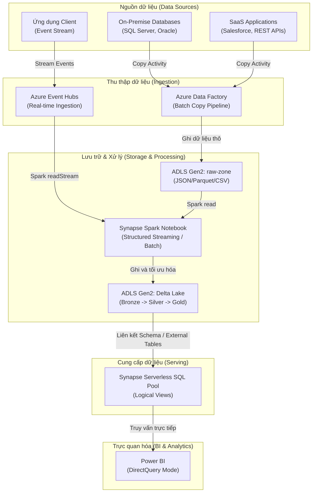
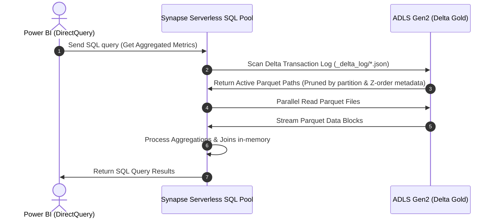

Trong kỷ nguyên số, việc xây dựng một hệ thống dữ liệu doanh nghiệp (**Enterprise Data Platform**) đòi hỏi khả năng xử lý đồng thời cả hai luồng dữ liệu: luồng dữ liệu lớn theo lô (**batch processing**) và luồng dữ liệu thời gian thực (**real-time streaming**). Sự kết hợp này tạo nên kiến trúc **Lakehouse** hiện đại, nơi lưu trữ giá rẻ kết hợp với hiệu năng truy vấn mạnh mẽ của kho dữ liệu truyền thống.

Kiến trúc này được thiết kế và tối ưu hóa dựa trên thực tế vận hành hệ thống dữ liệu lớn của **ASOS** (nhà bán lẻ thời trang trực tuyến toàn cầu xử lý dữ liệu của hàng chục triệu khách hàng) và các khuyến nghị kỹ thuật từ **Azure Architecture Center**. ASOS đã triển khai kiến trúc tương tự nhằm xử lý các luồng sự kiện clickstream khổng lồ và dữ liệu giao dịch từ hệ thống thương mại điện tử, đồng bộ hóa thông tin khách hàng thời gian thực để phục vụ các mô hình gợi ý sản phẩm (Recommendation Systems) và báo cáo quản trị BI.

Bài viết này sẽ hướng dẫn chi tiết cách thiết kế và vận hành một hệ thống dữ liệu hoàn chỉnh trên nền tảng đám mây Microsoft Azure. Chúng ta sẽ đi sâu vào việc tích hợp các dịch vụ cốt lõi từ khâu thu thập dữ liệu (Ingestion), xử lý dữ liệu (Processing) bằng Spark trên Databricks, tổ chức lưu trữ dưới dạng Delta Lake trên Azure Data Lake Storage Gen2 (ADLS Gen2) được quản trị bởi Unity Catalog, cho đến khâu cung cấp dữ liệu qua Synapse Serverless SQL pool và trực quan hóa thời gian thực bằng Power BI.

---

## Kiến trúc tổng quan của Enterprise Data Platform

Để tối ưu hóa chi phí và hiệu năng, hệ thống áp dụng mô hình kiến trúc lai (Hybrid Architecture) kết hợp cả xử lý Batch truyền thống và Streaming thời gian thực. Sơ đồ luồng dữ liệu chi tiết được mô tả dưới đây:



Khi người dùng mở báo cáo Power BI, câu truy vấn SQL sẽ được gửi trực tiếp và xử lý on-the-fly thông qua cơ chế Serverless SQL Pool như sơ đồ dưới đây:



### Luồng đi của dữ liệu (Data Flow)

1. **Thu thập dữ liệu theo lô (Batch Ingestion)**:
   Các nguồn dữ liệu quan hệ nội bộ (On-Premise Databases) và các nguồn dữ liệu từ ứng dụng SaaS được trích xuất định kỳ thông qua [Orchestration](/concepts/3-integration/orchestration/orchestration/) của **Azure Data Factory (ADF)**. ADF sử dụng các **Copy Activities** được tham số hóa để chuyển dữ liệu thô về phân vùng lưu trữ tạm thời (`raw-zone`) trên **Azure Data Lake Storage Gen2 (ADLS Gen2)** dưới dạng các file nén Parquet hoặc CSV.

2. **Thu thập dữ liệu thời gian thực (Streaming Ingestion)**:
   Các sự kiện từ ứng dụng client (log click, giao dịch mua hàng, dữ liệu cảm biến) được gửi trực tiếp tới **Azure Event Hubs**. Dịch vụ này đóng vai trò như một Message Queue phân tán có khả năng co giãn cao, tương thích hoàn toàn với giao thức Apache Kafka.

3. **Xử lý dữ liệu và Lưu trữ Lakehouse**:
   **Azure Synapse Spark Notebooks** (hoặc Azure Databricks Spark) thực hiện hai nhiệm vụ song song:
   * Chạy các job Spark Batch để đọc dữ liệu thô từ `raw-zone` của ADLS Gen2, thực hiện làm sạch dữ liệu, chuẩn hóa cấu trúc và ghi vào tầng **Bronze** của Delta Lake.
   * Chạy các ứng dụng **Spark Structured Streaming** để tiêu thụ luồng sự kiện trực tiếp từ Event Hubs gần như ngay lập tức (sub-second latency) và cập nhật thẳng vào tầng **Silver** của Delta Lake.
   * Toàn bộ dữ liệu được tổ chức theo kiến trúc [Medallion Architecture](/concepts/2-storage/data-lake-lakehouse/medallion-architecture/) (Bronze -> Silver -> Gold) nhằm đảm bảo tính toàn vẹn và chất lượng dữ liệu.

4. **Cung cấp dữ liệu (Data Serving)**:
   Thay vì phải duy trì một cơ sở dữ liệu quan hệ SQL đắt đỏ chạy 24/7, chúng ta tận dụng tính năng **Synapse Serverless SQL pool**. Công cụ này cho phép tạo các **Logical Views** hoặc **External Tables** trỏ trực tiếp đến các tệp dữ liệu Delta Lake (Gold layer) trên ADLS Gen2. Hệ thống chỉ tính phí dựa trên dung lượng dữ liệu được quét qua các câu lệnh truy vấn SQL.

5. **Trực quan hóa dữ liệu (Visualization)**:
   **Power BI** kết nối tới Synapse Serverless SQL pool thông qua chế độ **DirectQuery**. Khi người dùng tương tác với báo cáo, Power BI sẽ gửi trực tiếp câu lệnh SQL xuống Serverless SQL pool để truy vấn tức thì dữ liệu mới nhất từ Delta Lake mà không cần nhập dữ liệu vật lý vào bộ nhớ Power BI (Import Mode), đảm bảo tính cập nhật và tối ưu bộ nhớ.

---

## Cấu hình Azure Data Factory Copy Pipeline hiệu quả

Việc xây dựng các pipeline thu thập dữ liệu bằng Azure Data Factory đòi hỏi tính linh hoạt cao để tránh việc phải tạo hàng trăm pipeline thủ công cho từng bảng dữ liệu.

### 1. Cấu hình Triggers và Dependency
Trong thực tế sản xuất, chúng ta sử dụng **Tumbling Window Trigger** thay vì **Schedule Trigger** truyền thống để đảm bảo khả năng xử lý lại dữ liệu lịch sử (backfill) an toàn và hiệu quả:
*   **Tumbling Window Trigger**: Có các khoảng thời gian cố định không chồng chéo (non-overlapping), hỗ trợ thuộc tính phụ thuộc (Self-Dependency) - tức là window sau chỉ chạy khi window trước đã hoàn tất thành công. Cấu hình cụ thể:
    *   `frequency`: "Hour"
    *   `interval`: 1
    *   `maxConcurrency`: 5 (cho phép chạy song song tối đa 5 cửa sổ thời gian khi thực hiện backfill).
    *   `retryPolicy`: `count: 3`, `intervalInSeconds: 30` (tự động chạy lại tối đa 3 lần, mỗi lần cách nhau 30 giây khi xảy ra sự cố mạng với cơ sở dữ liệu nguồn).

### 2. Sử dụng Tham số hóa Pipeline (Pipeline Parameterization)
Chúng ta cần thiết kế một Pipeline dùng chung (**Generic Pipeline**) nhận các tham số đầu vào động. Ví dụ:
*   `SourceSchema` (schema của cơ sở dữ liệu nguồn)
*   `SourceTable` (tên bảng nguồn)
*   `SinkDirectory` (đường dẫn thư mục đích trên ADLS Gen2)

Trong **Copy Activity**, phần Source Query sẽ sử dụng biểu thức động để thực hiện trích xuất dữ liệu tăng trưởng (Incremental Loading):
```sql
@concat('SELECT * FROM ', pipeline().parameters.SourceSchema, '.', pipeline().parameters.SourceTable, ' WHERE LastModifiedDate >= '', pipeline().parameters.LastRunDate, ''')
```

### 3. Phân vùng thư mục động (Dynamic Directory Partitioning) trên ADLS Gen2
Để tối ưu hóa hiệu năng đọc của Spark sau này, dữ liệu thô ghi xuống ADLS Gen2 cần được tổ chức theo cấu trúc phân vùng thời gian rõ ràng:
`raw/<TableName>/year=YYYY/month=MM/day=DD/`

Trong cấu hình **Sink Dataset** của ADF, thuộc tính đường dẫn thư mục (`Directory`) được cấu hình động thông qua biểu thức:
```json
@concat(pipeline().parameters.SinkDirectory, '/year=', formatDateTime(utcNow(), 'yyyy'), '/month=', formatDateTime(utcNow(), 'MM'), '/day=', formatDateTime(utcNow(), 'dd'))
```

---

## Xử lý luồng sự kiện thời gian thực bằng Synapse Spark / Databricks

### 1. Cấu hình Azure Event Hubs
Event Hubs đóng vai trò là cổng thu nhận dòng sự kiện tốc độ cao:
*   **Capacity Tuning**: Cấu hình tối thiểu **5 Throughput Units (TUs)**, cho phép băng thông ghi (ingress) lên đến 5MB/giây và băng thông đọc (egress) 10MB/giây. Kích hoạt tính năng **Auto-Inflate** để tự động nâng giới hạn lên tối đa 20 TUs trong các giờ cao điểm thương mại điện tử nhằm tránh nghẽn luồng sự kiện (`QuotaExceededException`).
*   **Partitions**: Sử dụng **16 partitions** cho event hub chính để phân tán tải ghi từ các ứng dụng client.

### 2. Thiết lập Cluster và Unity Catalog Governance
Trong Azure Databricks, cụm tính năng Spark được cấu hình với instance type `Standard_D8s_v5` (8 vCPUs, 32GB RAM) cho các Worker Nodes, kích hoạt tự động co giãn (Autoscaling) từ 2 đến 16 nodes dựa trên lượng CPU utilization thực tế.

**Unity Catalog** được áp dụng để thiết lập cơ chế quản trị dữ liệu chặt chẽ và tập trung:
*   **Groups Configuration**: Định nghĩa các nhóm người dùng trên Microsoft Entra ID (Azure AD):
    *   `data-engineers-group`: Cấp quyền `ALL PRIVILEGES` trên catalog phát triển (`dev_catalog`) và catalog sản xuất (`prod_catalog`).
    *   `data-analysts-group`: Chỉ cấp quyền `SELECT` và `USAGE` trên catalog sản xuất ở tầng Gold (`prod_catalog.gold_layer`).
*   **Data Masking & Row-Level Security**: Thực thi chính sách bảo mật động trực tiếp trong Unity Catalog để ẩn thông tin định danh cá nhân (PII) của khách hàng trước khi các nhà phân tích truy vấn.

### 3. Mã nguồn Spark Structured Streaming
Dưới đây là đoạn code PySpark thực hiện đọc dữ liệu từ Event Hubs và ghi vào Delta Lake với cấu hình tối ưu hiệu năng ghi:

```python
import sys
from pyspark.sql.functions import col, expr, from_json
from pyspark.sql.types import StructType, StructField, StringType, DoubleType, LongType

# 1. Định nghĩa Schema cho sự kiện đầu vào
event_schema = StructType([
    StructField("deviceId", StringType(), True),
    StructField("temperature", DoubleType(), True),
    StructField("humidity", DoubleType(), True),
    StructField("timestamp", LongType(), True)
])

# 2. Lấy Connection String bảo mật từ Azure Key Vault qua linked service
connection_string = spark.conf.get("spark.synapse.keyvault.secret.EventHubsConnectionString")

# Mã hóa cấu hình kết nối Event Hubs
eh_conf = {}
eh_conf['eventhubs.connectionString'] = sc._jvm.org.apache.spark.eventhubs.EventHubsUtils.encrypt(connection_string)

# 3. Đọc dữ liệu Stream từ Event Hubs
df_stream = (spark.readStream
             .format("eventhubs")
             .options(**eh_conf)
             .load())

# Dữ liệu từ Event Hubs nằm trong cột 'body' dưới dạng Binary. Cần ép kiểu sang String và parse JSON
parsed_stream = (df_stream
                 .withColumn("body_str", col("body").cast("string"))
                 .withColumn("data", from_json(col("body_str"), event_schema))
                 .select("data.*", "enqueuedTime"))

# 4. Cấu hình tối ưu ghi Delta Lake chống phân mảnh file
spark.conf.set("spark.databricks.delta.optimizeWrite.enabled", "true")
spark.conf.set("spark.databricks.delta.autoCompact.enabled", "true")

# 5. Ghi luồng dữ liệu liên tục vào bảng Delta Lake ở tầng Silver
checkpoint_path = "abfss://silver-zone@youradls.dfs.core.windows.net/checkpoints/iot_events/"
delta_table_path = "abfss://silver-zone@youradls.dfs.core.windows.net/tables/iot_events/"

query = (parsed_stream.writeStream
         .format("delta")
         .outputMode("append")
         .option("checkpointLocation", checkpoint_path)
         .start(delta_table_path))
```

---

## Tối ưu hóa Delta Lake trên ADLS Gen2

Một trong những vấn đề phổ biến nhất của các hệ thống Data Lake lưu trữ tệp tin Parquet là **Small File Problem** (Vấn đề nhiều tệp tin kích thước quá nhỏ). Điều này xảy ra do luồng ghi stream liên tục tạo ra các tệp Parquet nhỏ (chỉ vài KB), khiến cho việc đọc dữ liệu trở nên cực kỳ chậm chạp do overhead của hệ thống file.

Để khắc phục điều này và áp dụng các kỹ thuật [Lakehouse Optimization](/concepts/2-storage/data-lake-lakehouse/lakehouse-optimization/), chúng ta thực hiện các hoạt động bảo trì bảng Delta định kỳ:

### 1. Gom nhóm tệp tin bằng lệnh OPTIMIZE (Compaction)
Lệnh `OPTIMIZE` sẽ tiến hành gom các tệp tin nhỏ nằm rải rác trong các phân vùng thành các tệp tin lớn có kích thước tối ưu (tiêu chuẩn 1GB), giúp giảm thiểu số lượng truy xuất I/O đến ADLS Gen2.

```sql
-- Chạy lệnh tối ưu hóa cấu trúc tệp tin trên bảng Delta
OPTIMIZE delta.`abfss://silver-zone@youradls.dfs.core.windows.net/tables/iot_events/`
```

### 2. Sắp xếp đa chiều với Z-ORDER
Để tăng tốc cho các câu lệnh truy vấn có bộ lọc (`WHERE`), chúng ta kết hợp lệnh `OPTIMIZE` với thuộc tính `Z-ORDER BY`. Kỹ thuật này giúp sắp xếp dữ liệu đồng thời trên nhiều chiều thuộc tính, tăng tối đa khả năng loại bỏ phân vùng dữ liệu thừa khi quét file (**data skipping**).

Trong môi trường phân tích thương mại điện tử, chúng ta thực hiện Z-Order theo `customerId` và `timestamp` để tăng tốc độ truy vấn lịch sử hành vi khách hàng:

```sql
-- Tối ưu hóa hiệu năng truy vấn lọc theo mã khách hàng và mốc thời gian
OPTIMIZE delta.`abfss://silver-zone@youradls.dfs.core.windows.net/tables/iot_events/`
ZORDER BY (deviceId, timestamp)
```

### 3. Dọn dẹp dữ liệu lịch sử bằng VACUUM
Vì Delta Lake hỗ trợ tính năng quay ngược thời gian (Time Travel) nhờ giữ lại lịch sử các tệp tin cũ trong Transaction Log, dữ liệu rác sẽ tích tụ theo thời gian và làm tăng chi phí lưu trữ. Lệnh `VACUUM` được dùng để xóa vĩnh viễn các tệp dữ liệu cũ không còn thuộc phiên bản hoạt động hiện tại nữa (mặc định sẽ giữ lại dữ liệu trong vòng 7 ngày gần nhất để đảm bảo an toàn cho các giao dịch đang chạy).

```sql
-- Xóa các file rác đã bị hủy bỏ (tombstoned files) cũ hơn 7 ngày (168 giờ)
VACUUM delta.`abfss://silver-zone@youradls.dfs.core.windows.net/tables/iot_events/` RETAIN 168 HOURS
```

---

## Cung cấp dữ liệu hiệu năng cao với Synapse Serverless SQL Pool

Sau khi dữ liệu đã được làm sạch và lưu tại tầng Gold trên Delta Lake dưới dạng các file có cấu trúc tối ưu, chúng ta cung cấp dữ liệu này cho các ứng dụng phân tích bên ngoài thông qua Synapse Serverless SQL pool.

### 1. Thiết lập Cost Control trong Serverless SQL Pool
Vì SQL Serverless tính phí dựa trên dung lượng dữ liệu quét (5 USD/TB data scanned), việc một truy vấn không tối ưu quét qua toàn bộ dữ liệu có thể làm tăng vọt chi phí. Chúng ta cấu hình hạn mức giới hạn dữ liệu quét (**Data Scanned Limits**) ở mức độ Workspace:
*   **Daily limit**: 5 TB
*   **Weekly limit**: 20 TB
*   **Monthly limit**: 50 TB
Nếu vượt quá hạn mức này, hệ thống sẽ tự động chặn các câu truy vấn tiếp theo cho đến chu kỳ mới để kiểm soát ngân sách.

### 2. Tạo Database và Logical View trên Serverless SQL Pool
Thực thi các lệnh SQL sau trên Serverless SQL Pool để thiết lập cổng kết nối dữ liệu:

```sql
-- 1. Khởi tạo cơ sở dữ liệu logic
CREATE DATABASE EnterpriseGoldDB;
GO

USE EnterpriseGoldDB;
GO

-- 2. Tạo View ánh xạ trực tiếp đến bảng Delta Lake ở tầng Gold trên ADLS Gen2
CREATE OR ALTER VIEW v_IoTDeviceMetrics AS
SELECT
    deviceId,
    temperature,
    humidity,
    DATEADD(second, [timestamp]/1000, '1970-01-01') AS EventDateTime,
    enqueuedTime AS IngestionDateTime
FROM
    OPENROWSET(
        BULK 'https://youradls.dfs.core.windows.net/silver-zone/tables/iot_events/',
        FORMAT = 'DELTA'
    ) AS [result];
GO
```

### 3. Kết nối Power BI DirectQuery
Để đảm bảo các báo cáo của người dùng luôn cập nhật theo thời gian thực:
1. Mở **Power BI Desktop**, chọn **Get Data** -> **Azure** -> **Azure Synapse Analytics SQL Serverless**.
2. Nhập endpoint kết nối của Workspace Serverless SQL Pool (ví dụ: `yourworkspace-ondemand.sql.azuresynapse.net`).
3. Tại phần **Data Connectivity mode**, chọn **DirectQuery** để kích hoạt truy vấn trực tiếp xuống hồ dữ liệu.
4. Chọn View `v_IoTDeviceMetrics` vừa tạo trong cơ sở dữ liệu `EnterpriseGoldDB`.

---

## Điểm mạnh và điểm yếu

* **Điểm mạnh**:
  * **Tối ưu hóa chi phí lưu trữ và tính toán**: Kiến trúc tách rời hoàn toàn giữa lưu trữ (ADLS Gen2 giá rẻ) và tính toán (Spark, Serverless SQL pool dùng bao nhiêu trả bấy nhiêu). Doanh nghiệp không cần đầu tư các cụm Data Warehouse chạy 24/7.
  * **Giao dịch đáng tin cậy**: Delta Lake mang đến khả năng kiểm soát dữ liệu chặt chẽ thông qua giao dịch ACID, ngăn chặn hoàn toàn hiện tượng lỗi file khi xảy ra sự cố đột ngột.
  * **Trực quan hóa thời gian thực**: Kết hợp Event Hubs, Spark Structured Streaming và Power BI DirectQuery giúp rút ngắn khoảng trễ của dữ liệu từ nhiều ngày xuống còn vài giây.
* **Điểm yếu**:
  * **Độ trễ nhất định của SQL Serverless**: Vì Synapse Serverless SQL pool phải đọc các file từ ADLS Gen2 lên khi có truy vấn (on-the-fly execution), tốc độ phản hồi sẽ không thể đạt mức mili-giây như các hệ thống Dedicated SQL pool hoặc cơ sở dữ liệu quan hệ được indexing tối ưu.
  * **Đòi hỏi kỹ năng bảo trì liên tục**: Nếu thiếu các job bảo trì chạy lệnh `OPTIMIZE` và `VACUUM` thường xuyên, hiệu năng hệ thống sẽ suy giảm nhanh chóng do tích tụ quá nhiều file nhỏ.
  * **Độ phức tạp trong vận hành**: Việc phân quyền (RBAC) đồng nhất từ ADLS Gen2, Synapse Spark, SQL Serverless cho đến Power BI đòi hỏi sự hiểu biết sâu sắc về hệ thống Identity trên Microsoft Entra ID.

---

## Khi nào nên dùng

* **Hệ thống dữ liệu cấp doanh nghiệp (Enterprise scale)**: Phù hợp cho các doanh nghiệp có lượng dữ liệu lớn từ vài trăm Gigabyte đến nhiều Terabyte cần khai thác phân tích tập trung.
* **Yêu cầu phân tích thời gian thực nhẹ**: Khi các bộ phận kinh doanh có nhu cầu theo dõi báo cáo cập nhật liên tục (Near Real-time Dashboard) thay vì chỉ xem dữ liệu của ngày hôm trước.
* **Đội ngũ kỹ sư dữ liệu thành thạo SQL và Python**: Do hệ thống sử dụng chủ yếu viết code Spark (Python/Scala) và truy vấn SQL Serverless.

---

## Khi nào không nên dùng

* **Hệ thống dữ liệu quá nhỏ**: Nếu tổng lượng dữ liệu của doanh nghiệp dưới 50GB và không tăng trưởng nhanh, việc dựng lên toàn bộ hệ sinh thái Azure ADF, Synapse, Event Hubs sẽ gây lãng phí tài nguyên và chi phí quản trị không đáng có.
* **Hệ thống yêu cầu độ trễ phản hồi cực thấp (Sub-millisecond latency)**: Phục vụ các ứng dụng giao dịch tài chính tốc độ cao. Đối với các bài toán này, các cơ sở dữ liệu NoSQL như Azure Cosmos DB hay Redis Cache là những lựa chọn phù hợp hơn nhiều.

---

## Trọng tâm ôn luyện phỏng vấn

### Q1: Làm thế nào để giải quyết vấn đề "Small File Problem" trong Delta Lake khi ghi Streaming liên tục?
**Trả lời**:
Khi ghi streaming liên tục từ Spark vào Delta Lake, Spark thường tạo ra rất nhiều tệp tin Parquet nhỏ. Để giải quyết:
1. Định kỳ chạy lệnh `OPTIMIZE` trên bảng Delta để nén và gộp các tệp nhỏ thành các tệp lớn hơn (~1GB).
2. Kích hoạt tính năng **Auto Compaction** và **Optimize Write** trong cấu hình của Delta Lake bằng cách cấu hình thuộc tính của Spark Session:
   ```python
   spark.conf.set("spark.databricks.delta.optimizeWrite.enabled", "true")
   spark.conf.set("spark.databricks.delta.autoCompact.enabled", "true")
   ```
   Điều này giúp Spark tự động kiểm soát kích thước file ngay trong quá trình ghi dữ liệu thô.

### Q2: Tại sau chúng ta sử dụng Serverless SQL Pool thay vì Dedicated SQL Pool (như Azure Synapse Dedicated/SQL DW) trong kiến trúc này?
**Trả lời**:
* **Chi phí**: Dedicated SQL Pool yêu cầu tài nguyên phần cứng cố định chạy liên tục 24/7 và chi phí tối thiểu rất cao. Serverless SQL Pool tính phí theo dung lượng dữ liệu quét qua câu lệnh truy vấn ($5 cho mỗi TB dữ liệu quét), cực kỳ tiết kiệm cho các báo cáo không chạy liên tục.
* **Bảo trì**: Serverless SQL Pool là dịch vụ SaaS không cần quản trị hạ tầng, tự động co giãn theo nhu cầu. Dedicated SQL Pool yêu cầu quản trị cấu trúc bảng, khóa index, phân vùng phân tán dữ liệu rất phức tạp.
* **Tính tức thời**: Serverless SQL Pool hỗ trợ hàm `OPENROWSET` đọc trực tiếp thư mục Delta Lake thời gian thực mà không cần chạy job ETL nạp dữ liệu vật lý vào Data Warehouse.

### Q3: Cơ chế "Time Travel" của Delta Lake hoạt động như thế nào và làm sao để kiểm soát dung lượng lưu trữ tăng lên do nó?
**Trả lời**:
* **Cơ chế**: Delta Lake duy trì một Transaction Log chi tiết (`_delta_log`). Khi dữ liệu bị thay đổi (`UPDATE` hoặc `DELETE`), Delta Lake không xóa file cũ ngay lập tức mà chỉ đánh dấu file cũ đó là không còn hoạt động ở phiên bản hiện tại (Tombstone). Nhờ vậy, Spark vẫn có thể đọc lại trạng thái lịch sử của bảng bằng cách truy vấn các file cũ thông qua lịch sử log.
* **Kiểm soát dung lượng**: Chạy lệnh `VACUUM <table_path> RETAIN X HOURS` định kỳ để xóa sạch các tệp dữ liệu cũ đã bị hủy bỏ quá thời gian lưu giữ `X` giờ. Lưu ý, sau khi chạy `VACUUM`, chúng ta sẽ không thể du hành thời gian về các phiên bản trước mốc thời gian đó nữa.

---

## English Summary

Implementing an **Enterprise Data Platform on Azure** utilizing a Lakehouse architecture bridges the gap between massive storage efficiency and rapid analytical capabilities. This architecture is modeled after **ASOS's** global e-commerce analytics framework and Azure Architecture Center guidelines.

### Core Components and Integration Flow:
* **Ingestion Orchestration**: Azure Data Factory handles high-throughput batch extraction, utilizing **Tumbling Window Triggers** with self-dependencies, strict retries, and concurrency limits to protect source databases.
* **Real-time Ingestion**: Azure Event Hubs scales automatically using **Auto-Inflate** settings to handle peak telemetry loads across 16 partitions.
* **Processing & Lakehouse Storage**: Azure Databricks/Synapse Spark runs Structured Streaming, writing streams to the Bronze/Silver layers of Delta Lake.
* **Governance**: **Unity Catalog** governs access controls dynamically, mapping Microsoft Entra ID groups (`data-engineers-group` vs `data-analysts-group`) to schemas with row-level data masking.
* **Data Lakehouse Optimization**: Compaction is achieved using Databricks auto-compaction and the `OPTIMIZE` command. Column-skipping is optimized via `ZORDER BY` on high-cardinality keys.
* **Virtual Data Serving**: Synapse Serverless SQL pool exposes Delta tables as logical views, protected by Workspace-level **Data Scanned Limits** to manage cloud costs. Power BI queries this layer dynamically using **DirectQuery** mode.

---

## Tài liệu tham khảo

* [Azure Data Factory Copy Activity Overview](https://learn.microsoft.com/en-us/azure/data-factory/copy-activity-overview#azure.microsoft)
* [Azure Event Hubs Documentation and Features](https://learn.microsoft.com/en-us/azure/event-hubs/event-hubs-about#azure.microsoft)
* [Apache Spark Pools in Azure Synapse Analytics](https://learn.microsoft.com/en-us/azure/synapse-analytics/spark/apache-spark-overview#azure.microsoft)
* [Delta Lake Guide on Databricks Documentation](https://docs.databricks.com/en/delta/index.html)
* [Apache Spark Structured Streaming Programming Guide](https://spark.apache.org/docs/latest/structured-streaming-programming-guide.html)
* [Power BI connectivity via Synapse Serverless SQL](https://learn.microsoft.com/en-us/azure/synapse-analytics/sql/on-demand-workspace-connect-power-bi#azure.microsoft)
* [Databricks Unity Catalog - Admin Guide & Governance](https://docs.databricks.com/en/data-governance/unity-catalog/index.html)
