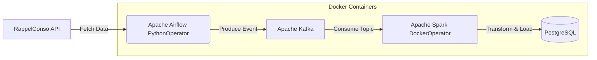

Bài viết này hướng dẫn chi tiết về cách xây dựng một Data Pipeline hoàn chỉnh (End-to-End) sử dụng Kafka, Spark, Airflow, Postgres, và Docker. Mặc dù hệ thống được triển khai trên môi trường Local (On-premise) thông qua Docker, các nguyên lý thiết kế, cách tổ chức luồng dữ liệu và giải quyết các bài toán về tính nhất quán (Consistency), khả năng chịu lỗi (Fault-Tolerance) đều được tham chiếu từ các hệ thống dữ liệu khổng lồ tại các công ty công nghệ hàng đầu như Uber và Netflix.

Netflix xử lý hàng nghìn tỷ message Kafka mỗi ngày, trong khi Uber chạy hơn 400.000 Spark batch jobs để phân tích Exabyte dữ liệu. Việc hiểu rõ kiến trúc cơ bản ở quy mô nhỏ sẽ giúp bạn dễ dàng mở rộng (scale) lên mức độ xử lý Big Data.

---

## 1. Sơ Đồ Kiến Trúc Tổng Thể (Architecture Diagram)

Kiến trúc của hệ thống bao gồm các thành phần chính được liên kết theo một luồng dữ liệu nhất quán. Trong bài toán cụ thể này, chúng ta sử dụng API **RappelConso** của chính phủ Pháp để lấy dữ liệu về thu hồi sản phẩm. Ở quy mô microservices, một mô hình Publish/Subscribe (Pub/Sub) được ưa chuộng hơn là các lệnh gọi đồng bộ (Synchronous RPC/REST) vì nó giảm thiểu rủi ro thắt cổ chai (bottleneck) và cascading failures.



Tại Netflix, Kafka đóng vai trò là "hệ thần kinh trung ương" (central nervous system), kết nối hàng ngàn microservices khác nhau. Việc di chuyển sang mô hình Pub/Sub cho phép mọi service công bố (publish) các thay đổi trạng thái của nó dưới dạng event vào một message bus. Để xây dựng hệ thống trên local, ta có thể tái lập luồng Pub/Sub này với Docker bằng kiến trúc thư mục cơ bản sau:
```text
├── airflow/            # Chứa Dockerfile và DAGs cho Airflow
├── data/               # Chứa file cấu hình trạng thái (VD: last_processed.json)
├── docker-compose-airflow.yaml
├── docker-compose.yml
├── kafka/
├── spark/              # Chứa Dockerfile cho Spark
└── src/                # Chứa mã nguồn Python (kafka_client, spark_pgsql)
```

---

## 2. Ingestion & Message Broker: Apache Kafka

**Apache Kafka** là một nền tảng phân phối luồng sự kiện (event streaming platform), đóng vai trò là message broker tiếp nhận dữ liệu thời gian thực. Thay vì để các service gọi trực tiếp lẫn nhau, Kafka cho phép hệ thống "decouple" (tách rời) giữa Producer và Consumer.

### 2.1. Thiết Kế Message Payload (Cấu Trúc Sự Kiện)
Một sự kiện (event) trong Kafka cần tuân thủ một định dạng chuẩn hóa (normalized format) để dễ dàng truy xuất và hiểu được. Với dữ liệu từ RappelConso, payload bao gồm `reference_fiche` (khóa chính), `categorie_de_produit`, `motif_de_rappel`, v.v.

Để tránh việc gửi lại toàn bộ dữ liệu từ API mỗi lần chạy, ta sử dụng một file local `last_processed.json` lưu lại ngày xuất bản cuối cùng để làm mốc cho lần quét tiếp theo:
```json
{"last_processed":"2023-11-22"}
```

Payload thường bao gồm ID của entity, loại sự kiện (TYPE như CREATE, UPDATE, DELETE) và dữ liệu thay đổi. Ở Netflix hay Uber, việc sử dụng Change Data Capture (CDC) như Debezium để bắt các thay đổi từ Database (như MySQL/PostgreSQL) và đẩy thẳng vào Kafka là một pattern cực kỳ phổ biến.

Để triển khai Kafka broker trên Docker (cùng Kafka UI để dễ theo dõi), cấu hình `docker-compose.yml` như sau:
```yaml
version: '3'
services:
  kafka:
    image: 'bitnami/kafka:latest'
    ports:
      - '9094:9094'
    networks:
      - airflow-kafka
    environment:
      - KAFKA_CFG_NODE_ID=0
      - KAFKA_CFG_PROCESS_ROLES=controller,broker
      - KAFKA_CFG_LISTENERS=PLAINTEXT://:9092,CONTROLLER://:9093,EXTERNAL://:9094
      - KAFKA_CFG_ADVERTISED_LISTENERS=PLAINTEXT://kafka:9092,EXTERNAL://localhost:9094
      - KAFKA_CFG_LISTENER_SECURITY_PROTOCOL_MAP=CONTROLLER:PLAINTEXT,EXTERNAL:PLAINTEXT,PLAINTEXT:PLAINTEXT
      - KAFKA_CFG_CONTROLLER_QUORUM_VOTERS=0@kafka:9093
      - KAFKA_CFG_CONTROLLER_LISTENER_NAMES=CONTROLLER
    volumes:
      - ./kafka:/bitnami/kafka

  kafka-ui:
    image: provectuslabs/kafka-ui:latest
    ports:
      - 8800:8080
    depends_on:
      - kafka
    environment:
      KAFKA_CLUSTERS_0_NAME: local
      KAFKA_CLUSTERS_0_BOOTSTRAPSERVERS: PLAINTEXT://kafka:9092
      DYNAMIC_CONFIG_ENABLED: 'true'
    networks:
      - airflow-kafka

networks:
  airflow-kafka:
    external: true
```
Lưu ý: Cần tạo network trước bằng lệnh `docker network create airflow-kafka`.

### 2.2. Vấn Đề Về Thứ Tự Sự Kiện (Event Ordering)
Một trong những yêu cầu then chốt khi thiết kế Data Pipeline là **Strict Ordering** (thứ tự nghiêm ngặt). Kafka hỗ trợ điều này thông qua việc gửi các "keyed messages" – các message có cùng key (ví dụ: `user_id`) sẽ luôn được lưu vào cùng một Partition, do đó đảm bảo thứ tự.

Tuy nhiên, ở cấp độ Producer, độ trễ mạng hoặc lỗi concurrency có thể khiến các event bị đẩy vào Kafka sai thứ tự thực tế. Để khắc phục, Netflix áp dụng kỹ thuật **Delayed Materialization**: Producer chỉ gửi Entity ID (thay vì toàn bộ payload). Consumer khi nhận được ID sẽ query ngược lại source service để lấy trạng thái mới nhất, tránh việc ghi nhận sai trạng thái do out-of-order messages.


---

## 3. Điều Phối Luồng Dữ Liệu: Apache Airflow

**Apache Airflow** là nền tảng Orchestration tiêu chuẩn công nghiệp để lập lịch (scheduling) và giám sát các quy trình phức tạp. Trong dự án này, Airflow đóng vai trò:
1. **Trigger Ingestion**: Lập lịch định kỳ (cron-based) để gọi External APIs (ví dụ REST APIs lấy dữ liệu thời tiết, tài chính).
2. **Quản lý Dependencies**: Đảm bảo rằng bước Transform bằng Spark chỉ được chạy khi dữ liệu thực tế đã nằm sẵn trong Kafka (sử dụng Kafka Sensor).
3. **Retry Mechanism & Backoff**: Xử lý các lỗi mạng tạm thời khi gọi API bằng các cơ chế tự động thử lại (retry) với Exponential Backoff để tránh Rate Limit.

Ở các công ty quy mô lớn như Pinterest hay Uber, Airflow được thiết kế ở dạng Distributed (ví dụ dùng CeleryExecutor hoặc KubernetesExecutor) với hàng nghìn DAGs chạy đồng thời. Tuy nhiên, khi deploy local qua Docker, chúng ta thường dùng `LocalExecutor` để tiết kiệm tài nguyên.

Dưới đây là một phần mã nguồn DAG định nghĩa lịch trình chạy Kafka Streaming và Spark Streaming:
```python
from datetime import datetime, timedelta
from airflow import DAG
from airflow.operators.python import PythonOperator
from airflow.providers.docker.operators.docker import DockerOperator
from src.kafka_client.kafka_stream_data import stream

default_args = {
    "owner": "airflow",
    "start_date": datetime.today() - timedelta(days=1),
    "retries": 1,
    "retry_delay": timedelta(seconds=5),
}

with DAG(
    dag_id="kafka_spark_dag",
    default_args=default_args,
    schedule_interval=timedelta(days=1),
    catchup=False,
) as dag:

    # Task 1: Kafka Streaming bằng PythonOperator
    kafka_stream_task = PythonOperator(
        task_id="kafka_data_stream",
        python_callable=stream,
        dag=dag,
    )

    # Task 2: Spark Processing bằng DockerOperator
    spark_stream_task = DockerOperator(
        task_id="pyspark_consumer",
        image="rappel-conso/spark:latest",
        api_version="auto",
        auto_remove=True,
        command="./bin/spark-submit --master local[*] --packages org.postgresql:postgresql:42.5.4,org.apache.spark:spark-sql-kafka-0-10_2.12:3.5.0 ./spark_streaming.py",
        docker_url='tcp://docker-proxy:2375',
        environment={'SPARK_LOCAL_HOSTNAME': 'localhost'},
        network_mode="airflow-kafka",
        dag=dag,
    )

    kafka_stream_task >> spark_stream_task
```
*Ghi chú*: Việc sử dụng `DockerOperator` thay vì chạy script local giúp quản lý thư viện độc lập hơn. Để kết nối an toàn từ Airflow tới Docker daemon, chúng ta cần dùng một docker-proxy (như `bobrik/socat`) listen qua giao thức TCP (port 2375) thay vì trực tiếp mount Unix socket (`/var/run/docker.sock`) vốn tiềm ẩn rủi ro phân quyền.

---

## 4. Xử Lý Dữ Liệu Phân Tán: Apache Spark

Spark chịu trách nhiệm đọc dữ liệu từ Kafka (Consume), thực hiện các thao tác biến đổi dữ liệu nặng (Data Processing) và nạp vào kho lưu trữ.

Để chạy ứng dụng Spark trong Docker, ta có thể tạo một Dockerfile tuỳ chỉnh dựa trên base image `bitnami/spark`, trong đó cài đặt `py4j` và copy mã nguồn vào:
```dockerfile
FROM bitnami/spark:latest
WORKDIR /opt/bitnami/spark
RUN pip install py4j
COPY ./src/spark_pgsql/spark_streaming.py ./spark_streaming.py
COPY ./src/constants.py ./src/constants.py
ENV POSTGRES_DOCKER_USER=host.docker.internal
ARG POSTGRES_PASSWORD
ENV POSTGRES_PASSWORD=$POSTGRES_PASSWORD
```

Mã nguồn Spark streaming sẽ cấu hình để đọc dữ liệu từ Kafka, áp dụng cấu trúc Schema (chuyển JSON thô thành Dataframe) và sử dụng `foreachBatch` kết hợp `leftanti` join để ghi (Append) vào PostgreSQL mà không gây trùng lặp (duplication):
```python
def create_initial_dataframe(spark_session):
    return (
        spark_session.readStream.format("kafka")
        .option("kafka.bootstrap.servers", "kafka:9092")
        .option("subscribe", "rappel_conso")
        .option("startingOffsets", "earliest")
        .load()
    )

def start_streaming(df_parsed, spark):
    # Đọc dữ liệu hiện có từ PostgreSQL
    existing_data_df = spark.read.jdbc(POSTGRES_URL, "rappel_conso", properties=POSTGRES_PROPERTIES)
    unique_column = "reference_fiche"

    # Ghi dữ liệu luồng vào PostgreSQL
    query = df_parsed.writeStream.foreachBatch(
        lambda batch_df, _: (
            batch_df.join(
                existing_data_df, batch_df[unique_column] == existing_data_df[unique_column], "leftanti"
            )
            .write.jdbc(POSTGRES_URL, "rappel_conso", "append", properties=POSTGRES_PROPERTIES)
        )
    ).trigger(once=True).start()

    return query.awaitTermination()
```

### 4.1. Data Enrichment (Làm Giàu Dữ Liệu)
Dữ liệu thô từ Kafka thường không đầy đủ ngữ cảnh (context). Spark có thể thực hiện Join các stream này với dữ liệu tĩnh (Static Data) lấy từ Database khác hoặc API để "làm giàu" sự kiện. Tại Netflix, các luồng Enrichment này lấy dữ liệu từ Kafka và gọi qua gRPC/GraphQL để lấy thêm metadata trước khi đẩy sang topic khác hoặc ghi vào DB.


### 4.2. Exactly-Once Processing & Idempotency
Spark Structured Streaming cung cấp tính năng **Checkpointing** bằng cách lưu metadata (Write-Ahead Logs) xuống file system (hoặc HDFS/S3 ở scale lớn). Điều này đảm bảo rằng nếu Spark container bị sập, nó có thể phục hồi (recover) và đọc tiếp từ Offset cuối cùng chưa commit, đảm bảo semantics *Exactly-Once* (hoặc ít nhất là *At-Least-Once* kết hợp với Idempotent Sink).

---

## 5. Lưu Trữ: PostgreSQL & Docker Deployment

Sau khi làm sạch và biến đổi, dữ liệu được Spark ghi (Load) vào cơ sở dữ liệu quan hệ **PostgreSQL**.
*   **Schema Evolution**: Spark xử lý việc ép kiểu (casting) và chuẩn hóa schema từ JSON thô thành các Dataframe columns (Integer, Timestamp, Varchar).
*   **Batch Insert**: Dữ liệu được push vào Postgres theo từng batch để tối ưu hiệu năng I/O thông qua JDBC. Mặc dù Postgres không phải là Data Warehouse chuyên dụng cho OLAP như ClickHouse hay Snowflake, nó hoàn toàn đủ khả năng cho các dự án cỡ vừa và nhỏ, hoặc đóng vai trò như một Operational Data Store (ODS).

**Docker & Docker-Compose:**
Toàn bộ Stack gồm Zookeeper, Kafka Brokers, Spark Master/Worker, Airflow Webserver/Scheduler và Postgres Database đều được cô lập hóa thông qua Docker. Việc setup hạ tầng trở thành Infrastructure as Code (IaC) thông qua file `docker-compose.yml`, cấu hình networks nội bộ để các container dễ dàng phân giải tên miền nội bộ (ví dụ: `jdbc:postgresql://postgres_db:5432/...`).

---

## 6. Bài Học Rút Ra & Bài Toán Scale Mức FAANG (Trade-offs & Scaling)

Việc chạy Local chỉ là bước khởi đầu. Khi scale hệ thống này lên quy mô hàng triệu events/giây như tại Uber hay Netflix, bạn sẽ phải đối mặt với các bài toán kỹ thuật rất lớn:

### 6.1. OOM (Out-Of-Memory) Trong Spark
Khi lượng dữ liệu tăng vọt (Data Spike), các Executor của Spark có thể tràn RAM. Kỹ thuật chống OOM bao gồm:
*   Cấu hình `spark.sql.shuffle.partitions` phù hợp với số lượng core và dung lượng dữ liệu.
*   Sử dụng Broadcast Join cho các bảng dimension nhỏ khi làm Data Enrichment thay vì Shuffle Hash Join đắt đỏ.
*   Theo dõi GC (Garbage Collection) tuning.

### 6.2. Data Skew (Lệch Dữ Liệu)
Nếu sử dụng một trường `key` để Partition trong Kafka mà phân phối không đều (ví dụ 80% events thuộc về 1 `user_id` hoạt động siêu tích cực), một partition sẽ bị phình to. Khi Spark đọc dữ liệu này, một Task sẽ phải gánh 80% khối lượng công việc trong khi các Tasks khác nhàn rỗi (straggler task).
*   **Giải pháp**: Sử dụng Kỹ thuật *Salting* (thêm random suffix vào key) để chia đều tải khi phân tán qua Kafka và Spark, sau đó mới Aggregate lại.

### 6.3. Kafka Tiered Storage
Việc lưu trữ dữ liệu hàng tuần hoặc hàng tháng trực tiếp trên Kafka Brokers (SSD/HDD nội bộ) là cực kỳ tốn kém. Uber đã giải quyết vấn đề này bằng cách thiết kế **Kafka Tiered Storage**, cho phép đẩy các dữ liệu "lạnh" (cold data) từ Kafka sang bộ lưu trữ Object Storage rẻ tiền (như HDFS hoặc S3) mà không làm gián đoạn API của Consumer.

### 6.4. Real-time vs Micro-batching
Kiến trúc này dùng Spark để đọc dữ liệu dạng Micro-batching. Dù Kafka hỗ trợ Real-time (độ trễ miligiây), việc batching trên Spark (ví dụ 1 phút 1 lần) giúp tối ưu hóa chi phí I/O khi ghi vào Postgres. Có một sự đánh đổi (trade-off) rõ rệt giữa Latency (độ trễ) và Throughput (thông lượng). Tại Netflix, nếu cần xử lý độ trễ cực thấp (sub-second), họ thay thế Spark bằng **Apache Flink** kết hợp với **RocksDB** để quản lý state in-memory.

---

## 7. Tài Liệu Tham Khảo

Bài viết được tổng hợp, phân tích dựa trên kiến trúc gốc của dự án cá nhân kết hợp với các bài toán thực tế từ các Data Engineering Blog uy tín:

1.  **Netflix Tech Blog (qua Confluent):** [How Kafka is Used by Netflix](https://www.confluent.io/blog/how-kafka-is-used-by-netflix/) - Phân tích chi tiết về kiến trúc Pub/Sub, CDC Sinks, Data Enrichment, và Delayed Materialization.
2.  **Uber Engineering:** **Scaling Kafka at Uber** và **Apache Spark standardization at Uber** - Quản lý hàng trăm ngàn Data Pipelines và kỹ thuật Tiered Storage.
3.  **Hamza Gharbi (Medium):** **End-To-End Data Engineering System on Real Data with Kafka, Spark, Airflow, Postgres, and Docker** - Ý tưởng ban đầu cho việc triển khai Local với Docker.

