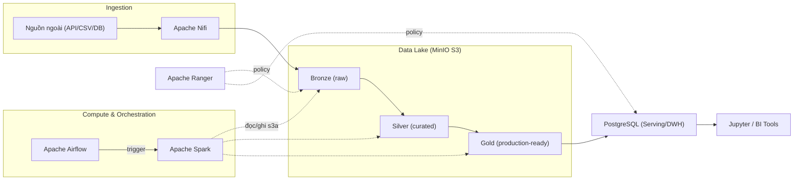

*Bài viết phóng tác và mở rộng từ kiến trúc gốc của Mahmud Oyinloye trong "Modern Data Engineering: Building a Data Lakehouse with Apache Spark — Vol 1".*

Dự án này xây dựng một **Data Lakehouse on-premise hoàn chỉnh** — mô phỏng chính xác những gì một nền tảng dữ liệu doanh nghiệp cần: ingestion, storage phân lớp, compute phân tán, orchestration, serving và governance. Điểm khác biệt so với các tutorial "hello world": mọi thành phần đều là công nghệ production-grade đang chạy thật tại các doanh nghiệp, và bạn sẽ chạm vào các vấn đề vận hành thật (cấu hình `s3a`, quyền truy cập, phân lớp medallion).

Trước khi bắt đầu, nên đọc: [Lakehouse](/concepts/3-storage-engines-formats/lakehouse/), [Medallion Architecture](/concepts/3-storage-engines-formats/medallion-architecture/), [Apache Spark](/concepts/4-compute-engines-batch/apache-spark/) và [Orchestration](/concepts/7-dataops-orchestration-quality/orchestration/).

---

## 1. Kiến trúc tổng thể



Vai trò từng lớp và lý do chọn công nghệ:

| Lớp | Công nghệ | Lý do chọn | Thay thế phổ biến |
|---|---|---|---|
| Ingestion | Apache Nifi | UI kéo-thả, backpressure tích hợp, provenance tracking | Airbyte, Kafka Connect |
| Data Lake | MinIO | S3-compatible, chạy local miễn phí, throughput cao | AWS S3, GCS |
| Compute | Apache Spark | Engine phân tán chuẩn công nghiệp, unified batch/ML | Trino, Flink |
| Orchestration | Airflow | DAG-as-code Python, hệ sinh thái operator lớn | Dagster, Prefect |
| Serving | PostgreSQL | Ổn định, quen thuộc với analyst, chi phí thấp | ClickHouse, Redshift |
| Governance | Apache Ranger | Policy tập trung, audit log, row-level filtering | OpenMetadata, Unity Catalog |

**Trade-off cốt lõi của stack này:** toàn bộ chạy on-premise/Docker nên chi phí bằng 0 và kiểm soát tuyệt đối, nhưng bạn tự gánh mọi thứ managed service làm hộ: HA cho MinIO, tuning Spark executor, vá bảo mật Ranger. Đó chính là lý do bài toán [storage-compute decoupling](/concepts/1-distributed-systems-architecture/storage-compute-decoupling/) và cloud lakehouse ra đời.

---

## 2. Phân lớp Medallion trong MinIO

Data lake được chia ba lớp theo chuẩn [Medallion Architecture](/concepts/3-storage-engines-formats/medallion-architecture/):

- **Bronze (Raw):** dữ liệu nguyên bản từ Nifi đổ về (`.csv`, `.json`, `.parquet`), thư mục phản ánh nguồn gốc (provenance). Nguyên tắc bất di bất dịch: **không bao giờ sửa Bronze** — đây là nguồn để replay/backfill khi logic transform sai.
- **Silver (Curated):** dữ liệu đã làm sạch, chuẩn hóa schema, dedupe, enrich. Lưu bằng Parquet có partition.
- **Gold (Processed):** dữ liệu sẵn sàng phục vụ nghiệp vụ, đã qua kiểm tra chất lượng, aggregate theo mô hình dimensional.

**Chi tiết thực chiến hay bị bỏ qua — cấu hình Spark đọc/ghi MinIO qua `s3a`:**

```python
spark = (SparkSession.builder
    .appName("lakehouse-etl")
    .config("spark.hadoop.fs.s3a.endpoint", "http://minio:9000")
    .config("spark.hadoop.fs.s3a.access.key", os.environ["MINIO_ACCESS_KEY"])
    .config("spark.hadoop.fs.s3a.secret.key", os.environ["MINIO_SECRET_KEY"])
    .config("spark.hadoop.fs.s3a.path.style.access", "true")   # bắt buộc với MinIO
    .config("spark.hadoop.fs.s3a.connection.ssl.enabled", "false")
    # Committer an toàn cho object storage - tránh rename tốn kém & file rác khi job fail
    .config("spark.hadoop.fs.s3a.committer.name", "magic")
    .config("spark.sql.sources.commitProtocolClass",
            "org.apache.spark.internal.io.cloud.PathOutputCommitProtocol")
    .getOrCreate())

df = spark.read.parquet("s3a://bronze/sales/ingest_date=2026-07-10/")
```

Hai lỗi kinh điển khi mới setup: quên `path.style.access=true` (MinIO không hỗ trợ virtual-host style như AWS) và dùng file committer mặc định — trên object storage, thao tác "rename" thực chất là copy + delete, khiến bước commit của job lớn chậm gấp nhiều lần và để lại file rác `_temporary` khi job chết giữa chừng.

---

## 3. Orchestration với Airflow

Mỗi pipeline là một [DAG](/concepts/7-dataops-orchestration-quality/dag/) Python. Ví dụ luồng Bronze → Silver hằng ngày:

```python
with DAG(
    "bronze_to_silver_sales",
    schedule="0 2 * * *",
    catchup=True,          # cho phép backfill partition cũ
    max_active_runs=1,     # tránh 2 run ghi đè cùng partition
    default_args={"retries": 2, "retry_delay": timedelta(minutes=5)},
) as dag:
    wait_raw = S3KeySensor(
        task_id="wait_bronze_file",
        bucket_key="s3://bronze/sales/ingest_date={{ ds }}/_SUCCESS",
        aws_conn_id="minio_conn", timeout=3600, poke_interval=120,
    )
    clean = SparkSubmitOperator(
        task_id="clean_sales",
        application="/jobs/clean_sales.py",
        application_args=["--ds", "{{ ds }}"],
        conf={"spark.executor.memory": "2g", "spark.executor.instances": "2"},
    )
    wait_raw >> clean
```

Ba quyết định thiết kế đáng chú ý: dùng **Sensor + file `_SUCCESS`** thay vì tin giờ chạy cố định (chống race condition khi Nifi đổ trễ), **`max_active_runs=1`** để job [idempotent](/concepts/2-data-ingestion-integration/idempotency/) theo partition, và **ghi đè theo partition** (`INSERT OVERWRITE ... PARTITION (ds)`) để rerun không tạo bản ghi trùng — xem thêm [Backfill](/concepts/2-data-ingestion-integration/backfill/).

---

## 4. Serving & Governance

**PostgreSQL làm Warehouse serving:** dữ liệu Gold được Spark ghi vào Postgres qua JDBC (`mode("overwrite")` theo bảng staging rồi swap, hoặc `MERGE` theo khóa). Với dữ liệu vài chục GB trở xuống, Postgres đủ nhanh cho BI; vượt ngưỡng đó là tín hiệu chuyển sang [OLAP](/concepts/3-storage-engines-formats/olap/) engine thực thụ.

**Apache Ranger làm Governance:** policy tập trung kiểu "Analyst chỉ SELECT được schema `gold`, Data Scientist đọc được `silver` nhưng cột PII bị mask". Ranger ghi audit log mọi truy cập — nền tảng cho yêu cầu [Data Governance](/concepts/8-security-governance-finops/data-governance/) và [Access Control](/concepts/8-security-governance-finops/access-control/).

---

## 5. Môi trường phát triển: Gitpod

Chạy toàn bộ stack bằng Docker local ngốn trên 20 GB RAM, build image lâu và lệch OS (đặc biệt Mac M1). Giải pháp của dự án là **Gitpod** — IDE cloud khởi chạy từ repo GitHub, cho container Linux cấu hình sẵn chạy VS Code.

Thiết lập tóm tắt: (1) đăng nhập bằng GitHub và cấp quyền push/pull tại `Settings → Integrations → Git Providers`; (2) tạo SSH key `ssh-keygen -t ed25519` rồi dán public key vào `Gitpod → SSH Keys` nếu muốn dùng VS Code desktop; (3) tạo repo `modern-datalake` và mở qua `Gitpod → New Workspace`. Mọi cấu hình môi trường được version hóa trong `.gitpod.yml` — cả team dùng chung một môi trường, hết cảnh "máy tôi chạy được mà".

---

## 6. Rủi ro vận hành & bài học

1. **MinIO single-node = single point of failure.** Bản production cần chế độ distributed (tối thiểu 4 node, erasure coding). Với PoC thì chấp nhận được, nhưng đừng copy nguyên sang production.
2. **Small files problem:** Nifi đổ file JSON nhỏ liên tục vào Bronze khiến Spark listing chậm và task quá nhiều. Giải pháp: gom file theo giờ ở tầng Nifi (MergeContent processor) hoặc compaction định kỳ — xem [Compaction](/concepts/3-storage-engines-formats/compaction/).
3. **Thiếu table format:** stack này dùng Parquet thô, nghĩa là không có ACID, không time-travel, không schema evolution an toàn. Bước tiến hóa tự nhiên tiếp theo là thêm [Delta Lake](/concepts/3-storage-engines-formats/delta-lake/) hoặc [Apache Iceberg](/concepts/3-storage-engines-formats/apache-iceberg/) lên trên MinIO.
4. **Postgres serving là điểm nghẽn ghi:** Spark ghi JDBC mặc định mở 1 connection/partition — cần `numPartitions` + `batchsize` hợp lý nếu không muốn đánh sập database.

## Kết luận

Dự án cho bạn một lakehouse end-to-end đúng nghĩa với chi phí bằng 0: Nifi ingest, MinIO lưu trữ phân lớp Bronze/Silver/Gold, Spark transform, Airflow điều phối có backfill, Postgres serving và Ranger governance. Quan trọng hơn cả kết quả là các trade-off bạn buộc phải đối mặt — committer trên object storage, small files, idempotent rerun — vì đó chính là những câu hỏi phỏng vấn và sự cố production thật sự của một Data Engineer.

## Nguồn Tham Khảo

- [Modern Data Engineering: Building a Data Lakehouse with Apache Spark - Mahmud Oyinloye](https://medium.com/@mahmudoyinloye) - Bài viết gốc của kiến trúc này.
- [Hadoop-AWS module: Integration with Amazon Web Services (s3a)](https://hadoop.apache.org/docs/stable/hadoop-aws/tools/hadoop-aws/index.html) - Apache Hadoop.
- [Committing work to S3 with the S3A Committers](https://hadoop.apache.org/docs/stable/hadoop-aws/tools/hadoop-aws/committers.html) - Apache Hadoop.
- [MinIO Object Storage for Linux](https://min.io/docs/minio/linux/index.html) - MinIO.
- [Apache Nifi Documentation](https://nifi.apache.org/docs.html) - Apache Software Foundation.
- [Apache Airflow Best Practices](https://airflow.apache.org/docs/apache-airflow/stable/best-practices.html) - Apache Software Foundation.
- [Apache Ranger Documentation](https://ranger.apache.org/documentation.html) - Apache Software Foundation.
