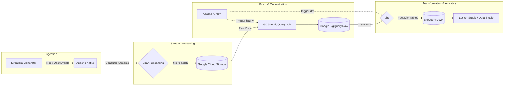

Streamify là một dự án Data Engineering End-to-End (E2E) mô phỏng quá trình xử lý dữ liệu từ một nền tảng nghe nhạc trực tuyến (giống như Spotify hay Apple Music). Dự án này tập trung vào việc thiết lập một hệ thống streaming thời gian thực (real-time data pipeline) để thu thập, xử lý, và phân tích các sự kiện của người dùng, từ đó đưa ra các báo cáo kinh doanh tức thời và hệ thống gợi ý bài hát.

Trong kỷ nguyên dữ liệu hiện đại, việc phân tích log sau một ngày không còn đáp ứng đủ nhu cầu kinh doanh. Hệ thống cần khả năng phản ứng ngay khi người dùng nhấn nút "Play" hoặc bỏ qua (skip) một bài hát. Streamify được sinh ra để giải quyết bài toán đó.

---

## Kiến Trúc Hệ Thống (Architecture Deep Dive)

Dưới đây là sơ đồ kiến trúc tổng quan của dự án Streamify:


Thay vì chỉ là một đường ống đơn giản, kiến trúc áp dụng mô hình **Lambda Architecture** kết hợp với **Modern Data Stack**, nơi dòng dữ liệu (data stream) được phân tách thành tốc độ nhanh (speed layer) và lưu trữ lâu dài để batch processing (batch layer).



:::note
**Vai trò của từng thành phần:**
Dữ liệu được sinh ra liên tục -> Đẩy vào hệ thống Message Queue (Kafka) -> Xử lý Streaming (Spark) -> Lưu trữ thô vào Data Lake (GCS) -> Chuyển hóa và đưa lên Data Warehouse (BigQuery thông qua Airflow & dbt) -> Trực quan hóa dữ liệu (Looker).
:::

---

## Phân Tích Tech Stack & Các Giải Pháp Thay Thế

Dự án sử dụng các công nghệ hiện đại và phổ biến nhất trong lĩnh vực Data Engineering. Việc lựa chọn công cụ không chỉ dựa trên độ phổ biến mà còn là tính phù hợp với bài toán.

| Lớp (Layer) | Công nghệ sử dụng | Tại sao chọn? | Lựa chọn thay thế |
|---|---|---|---|
| **Infrastructure** | Terraform | Quản lý hạ tầng bằng code (IaC), dễ dàng tái tạo môi trường và version control hạ tầng. | Pulumi, AWS CloudFormation |
| **Stream Ingestion** | Apache Kafka | Throughput cực lớn, khả năng lưu giữ (retention) tin nhắn, pub/sub mạnh mẽ. | GCP Pub/Sub, AWS Kinesis, RabbitMQ |
| **Stream Processing**| Spark Streaming | Tích hợp chặt chẽ với hệ sinh thái Hadoop, xử lý micro-batch ổn định, API mạnh mẽ với PySpark. | Apache Flink, Kafka Streams |
| **Data Lake** | GCS | Rẻ, khả năng mở rộng vô hạn, dễ dàng tích hợp với BigQuery. | AWS S3, Azure Data Lake |
| **Data Warehouse** | Google BigQuery | Serverless, không cần quản lý index, truy vấn SQL cực nhanh cho dữ liệu Petabyte. | Snowflake, Amazon Redshift |
| **Transformation** | dbt (Data Build Tool)| Áp dụng software engineering best practices (version control, testing, documentation) vào SQL. | Dataform, viết SQL chay trong Airflow |
| **Orchestration** | Apache Airflow | Chuẩn công nghiệp cho việc lên lịch, dependencies management qua DAGs. | Prefect, Dagster |

:::tip
**Tại sao lại dùng Spark Streaming thay vì Flink?**
Spark Streaming sử dụng cơ chế *micro-batch* (tập hợp dữ liệu theo chu kỳ rất ngắn) trong khi Flink cung cấp *true streaming* (xử lý từng event một). Đối với bài toán Streamify (đẩy log vào GCS mỗi vài phút), micro-batch của Spark hoàn toàn đáp ứng được và dễ dàng viết code bằng PySpark hơn cho đội ngũ đã quen với Pandas/SQL.
:::

---

## Data Flow Từng Bước & Code Minh Họa

Dự án sử dụng [Eventsim](https://github.com/Interana/eventsim) để sinh ra các sự kiện giả lập (như: người dùng nghe bài hát nào, thao tác điều hướng trên web, đăng nhập,...).

### 1. Data Ingestion (Thu thập dữ liệu) với Kafka
Chương trình Eventsim liên tục tạo ra dữ liệu JSON và gửi trực tiếp các messages này vào **Apache Kafka** (đóng vai trò là Message Broker). Dữ liệu được phân bổ vào các Kafka Topic khác nhau dựa trên loại sự kiện (ví dụ: `listen_events`, `auth_events`).

*Ví dụ một đoạn code Python Producer cơ bản đẩy log vào Kafka:*
```python
from kafka import KafkaProducer
import json
import time

# Khởi tạo Kafka Producer
producer = KafkaProducer(
    bootstrap_servers=['localhost:9092'],
    value_serializer=lambda v: json.dumps(v).encode('utf-8')
)

def stream_events():
    while True:
        event = {
            "userId": 101,
            "songId": "song_abc_123",
            "artist": "The Weeknd",
            "ts": int(time.time()),
            "level": "paid"
        }
        # Đẩy dữ liệu vào topic 'listen_events'
        producer.send('listen_events', value=event)
        print(f"Sent: {event}")
        time.sleep(1) # Giả lập dòng dữ liệu

if __name__ == "__main__":
    stream_events()
```

### 2. Stream Processing (Xử lý chuỗi sự kiện) với Spark
**Apache Spark Streaming** đọc dữ liệu từ Kafka Topic. Tại đây, dữ liệu được chuyển đổi schema cơ bản, thêm cột timestamp hệ thống và được ghi xuống Data Lake là **Google Cloud Storage (GCS)** theo định dạng **Parquet** (định dạng lưu trữ cột giúp giảm dung lượng và tối ưu đọc).

*Ví dụ PySpark Structured Streaming Code:*
```python
from pyspark.sql import SparkSession
from pyspark.sql.functions import from_json, col
from pyspark.sql.types import StructType, StructField, StringType, IntegerType

spark = SparkSession.builder.appName("Streamify_Spark_Kafka").getOrCreate()

# Định nghĩa Schema cho Kafka message
schema = StructType([
    StructField("userId", IntegerType()),
    StructField("songId", StringType()),
    StructField("artist", StringType()),
    StructField("ts", IntegerType()),
    StructField("level", StringType())
])

# Đọc streaming từ Kafka
df = spark.readStream \
    .format("kafka") \
    .option("kafka.bootstrap.servers", "localhost:9092") \
    .option("subscribe", "listen_events") \
    .load()

# Parse cột value (JSON string) thành Struct
parsed_df = df.selectExpr("CAST(value AS STRING)") \
    .select(from_json(col("value"), schema).alias("data")) \
    .select("data.*")

# Ghi dữ liệu dạng micro-batch xuống GCS mỗi 2 phút
query = parsed_df.writeStream \
    .format("parquet") \
    .option("path", "gs://streamify-datalake/listen_events/") \
    .option("checkpointLocation", "gs://streamify-datalake/checkpoints/listen_events/") \
    .trigger(processingTime='2 minutes') \
    .start()

query.awaitTermination()
```

:::note
Việc cấu hình `checkpointLocation` là bắt buộc trong Spark Structured Streaming để đảm bảo khả năng chịu lỗi (Fault Tolerance) và ngữ nghĩa phân phối **Exactly-once**. Nếu ứng dụng Spark sập, nó sẽ đọc từ checkpoint để tiếp tục xử lý chính xác vị trí bị gián đoạn.
:::

### 3. Data Orchestration & Batch Processing với Airflow
Mặc dù dữ liệu đã được stream liên tục vào GCS, chúng ta cần một quy trình tự động đưa nó vào Data Warehouse để phân tích sâu hơn. **Apache Airflow** được thiết lập để chạy DAG (Directed Acyclic Graph) theo định kỳ hàng giờ (Hourly).

Airflow sử dụng `GCSToBigQueryOperator` để load định dạng Parquet từ GCS vào bảng thô (`raw_listen_events`) của BigQuery.

```python
from airflow import DAG
from airflow.providers.google.cloud.transfers.gcs_to_bigquery import GCSToBigQueryOperator
from datetime import datetime, timedelta

default_args = {
    'owner': 'data_engineer',
    'depends_on_past': False,
    'start_date': datetime(2023, 1, 1),
    'retries': 1,
    'retry_delay': timedelta(minutes=5),
}

with DAG('gcs_to_bq_dag', default_args=default_args, schedule_interval='@hourly') as dag:
    
    load_to_bq = GCSToBigQueryOperator(
        task_id='load_listen_events_to_bq',
        bucket='streamify-datalake',
        source_objects=['listen_events/*.parquet'],
        destination_project_dataset_table='streamify_project.raw_data.listen_events',
        source_format='PARQUET',
        write_disposition='WRITE_APPEND', # Nối tiếp dữ liệu mới
    )
```

### 4. Data Transformation (Chuyển đổi dữ liệu) với dbt
Sau khi dữ liệu thô đã nằm trong BigQuery, Airflow sẽ gọi **dbt** thông qua `BashOperator` hoặc `DbtCloudOperator`. 
dbt áp dụng mô hình thiết kế **Star Schema** để tạo ra các bảng Fact và Dimension (ví dụ: `dim_users`, `dim_songs`, `fact_streams`).

*Mô hình hóa dữ liệu với dbt (SQL model `fact_streams.sql`):*
```sql
{{ config(
    materialized='incremental',
    unique_key='stream_id'
) }}

WITH raw_data AS (
    SELECT
        GENERATE_UUID() as stream_id,
        userId as user_id,
        songId as song_id,
        artist,
        level as subscription_tier,
        TIMESTAMP_MILLIS(ts) as played_at
    FROM {{ source('raw_data', 'listen_events') }}
    
    
    -- Lọc chỉ xử lý dữ liệu mới hơn lần chạy trước
    WHERE TIMESTAMP_MILLIS(ts) > (SELECT max(played_at) FROM {{ this }})
    
)

SELECT * FROM raw_data
```

### 5. Analytics & Dashboard
Cuối cùng, **Google Data Studio (Looker Studio)** kết nối trực tiếp với BigQuery. Người phân tích dữ liệu có thể dễ dàng tạo các metric như:
- Số lượng bài hát được nghe mỗi giờ (Top Songs of the Hour).
- Tỷ lệ người dùng Free vs Paid theo thời gian thực.
- Xu hướng nghe nhạc theo quốc gia/khu vực.

---

## Best Practices & Kịch Bản Thực Tế

Khi triển khai Streamify lên môi trường Production, có một số kịch bản cần xử lý:

### 1. Xử lý Backpressure trong Streaming
Nếu lượng user truy cập tăng vọt (ví dụ vào dịp ra mắt album mới của một ca sĩ nổi tiếng), Event generator sẽ sản sinh lượng lớn log. 
**Giải pháp:** Apache Kafka đóng vai trò như một bộ đệm (buffer) hoàn hảo. Dù Spark Streaming xử lý không kịp, dữ liệu vẫn được lưu an toàn trong Kafka nhờ tính năng ghi ra đĩa. Ta có thể tăng số lượng Kafka Partitions và scale-out cụm Spark Cluster để tăng tốc xử lý (horizontal scaling).

### 2. Xử Lý Dữ Liệu Rác & Late Arriving Data
Dữ liệu streaming luôn có độ trễ do mạng lưới (người dùng ở trong vùng sóng yếu, sự kiện đến muộn vài phút).
**Giải pháp:** Dùng khái niệm **Watermarking** trong Spark Streaming. Ta cho phép Spark chấp nhận những sự kiện đến trễ trong vòng X phút, sau thời gian đó dữ liệu quá cũ sẽ bị loại bỏ (drop) để giải phóng RAM.

---

## Key Takeaways & Trade-offs (Điểm Nhấn và Sự Đánh Đổi)

Việc xây dựng một kiến trúc như Streamify mang lại nhiều kinh nghiệm nhưng cũng đi kèm với một số điểm cần cân nhắc:

- **Tính Real-time vs Micro-batch:**  
  Kiến trúc kết hợp giữa Streaming (Kafka + Spark) để lưu raw data với độ trễ thấp, và Batch processing (Airflow + dbt) để chuyển đổi dữ liệu phân tích. Điều này tối ưu chi phí hơn so với việc tính toán phân tích thời gian thực hoàn toàn (ví dụ: dùng Flink đẩy thẳng lên hệ thống Real-time OLAP như Apache Pinot hoặc ClickHouse). Trade-off là dữ liệu trên dashboard Looker Studio sẽ bị trễ khoảng 1 giờ thay vì hiển thị ngay lập tức từng giây.
  
- **Tự quản lý (Self-managed) vs Dịch vụ quản lý (Managed Services):**  
  Dự án triển khai Kafka, Spark và Airflow trên các máy ảo (Compute Instances/Docker) để tối ưu chi phí học tập và hiểu sâu cơ chế lõi. Trong môi trường production thực tế, việc duy trì Zookeeper/Kafka Cluster là "ác mộng" về DevOps. Giải pháp tối ưu nhân lực là dùng Managed Services: chuyển sang Confluent Cloud (cho Kafka), Cloud Dataproc (cho Spark), và Cloud Composer (cho Airflow).

- **Tái tạo lại toàn bộ dữ liệu (Full Refresh) vs Tăng dần (Incremental Build):**  
  Với dữ liệu lớn, việc chạy Full Refresh bằng dbt mỗi giờ sẽ tiêu tốn khổng lồ tài nguyên tính toán (compute slots) trên BigQuery. Trade-off ở đây là tính đơn giản trong khâu phát triển ban đầu của Full Refresh. Khi scale, bắt buộc phải áp dụng chiến lược **Incremental Models** cho Fact tables (chỉ scan và update những dòng dữ liệu mới trong 1 giờ qua như ví dụ dbt ở trên).

---

## Tài Liệu Tham Khảo
- [Streamify GitHub Repository](https://github.com/ankurchavda/streamify)
- [Apache Kafka Documentation](https://kafka.apache.org/documentation/)
- [Spark Structured Streaming Programming Guide](https://spark.apache.org/docs/latest/structured-streaming-programming-guide.html)
- [dbt Incremental Models](https://docs.getdbt.com/docs/build/incremental-models)
