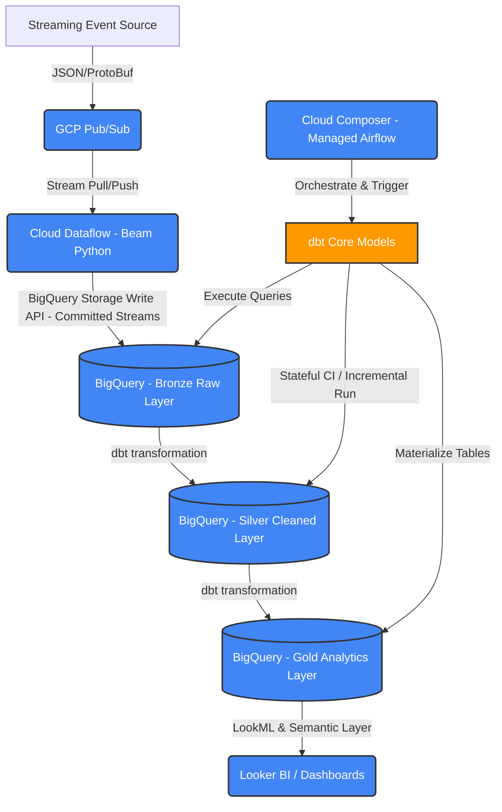
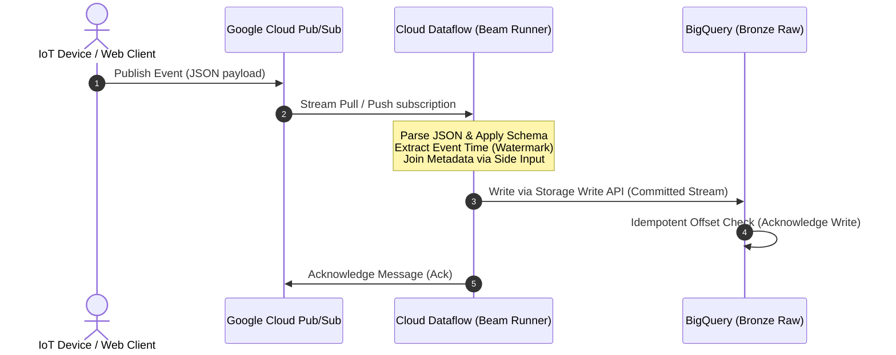

Trong kỷ nguyên dữ liệu lớn (Big Data) và phân tích thời gian thực (Real-time Analytics), việc xây dựng một hệ thống nền tảng dữ liệu (Data Platform) vừa đảm bảo khả năng mở rộng vô hạn (Scalability), vừa tối ưu chi phí vận hành là một thách thức lớn. 

Kiến trúc này được thiết kế và tối ưu hóa dựa trên mô hình hệ thống phân phối sự kiện (Event Delivery Platform) quy mô toàn cầu của **Spotify** (xử lý hơn 1.4 nghìn tỷ sự kiện mỗi ngày từ hàng trăm triệu thiết bị hoạt động) kết hợp với các khuyến nghị thực tế từ **GCP Architecture Blog**. Spotify đã di chuyển từ cụm Apache Kafka và Hadoop tự vận hành sang mô hình hoàn toàn quản lý sử dụng **Google Cloud Pub/Sub** làm xương sống truyền tin và **Cloud Dataflow** làm công cụ xử lý dòng, giúp tăng tính ổn định của luồng dữ liệu và tối giản chi phí vận hành (ZeroOps).

Bài viết này hướng dẫn chi tiết cách thiết kế và triển khai một hệ thống **Serverless Lakehouse** toàn diện trên nền tảng **Google Cloud Platform (GCP)** kết hợp với các công cụ thuộc **Modern Data Stack**. Hệ thống được thiết kế theo hướng sự kiện (Event-driven) từ lúc tiếp nhận dữ liệu thời gian thực cho đến khi hiển thị trên các dashboard báo cáo, được kiểm soát chặt chẽ về mặt chất lượng dữ liệu và điều phối tự động.

Để chuẩn bị kiến thức nền tảng trước khi nghiên cứu dự án này, bạn có thể tham khảo [/concepts/4-realtime/streaming-processing/apache-kafka](/concepts/4-realtime/streaming-processing/apache-kafka) để hiểu cách hệ thống hàng đợi tin nhắn hoạt động, [/concepts/4-realtime/streaming-processing/spark-structured-streaming](/concepts/4-realtime/streaming-processing/spark-structured-streaming) về xử lý luồng, cơ chế [/concepts/4-realtime/streaming-processing/watermark](/concepts/4-realtime/streaming-processing/watermark) để kiểm soát dữ liệu đến muộn, và [/concepts/4-realtime/streaming-processing/exactly-once-semantics](/concepts/4-realtime/streaming-processing/exactly-once-semantics) để nắm rõ cách bảo toàn tính nhất quán dữ liệu.

---

## Thiết kế Kiến trúc (Architectural Design)

Mô hình kiến trúc của dự án Serverless Lakehouse trên GCP được xây dựng dựa trên sự kết hợp giữa các dịch vụ Serverless mạnh mẽ của GCP và các công cụ biến đổi dữ liệu hàng đầu:



Dưới đây là sơ đồ chi tiết về chuỗi kết nối streaming và cơ chế chống trùng lặp dữ liệu từ client đầu vào đến BigQuery:



Luồng đi của dữ liệu (Data Pipeline Flow) được chia làm 3 phân đoạn chính:

### Streaming Ingestion & Processing (Thu nạp & Xử lý thời gian thực)
1. **Streaming Event Source**: Nguồn dữ liệu phát sinh liên tục dưới dạng sự kiện (clickstream, transaction logs, IoT telemetry) gửi các payload JSON hoặc Protocol Buffers.
2. **GCP Pub/Sub**: Đóng vai trò là hệ thống hàng đợi tin nhắn (Message Queue) phân tán, chịu tải cao. Pub/Sub giúp tách biệt (decouple) hoàn toàn giữa nguồn sinh dữ liệu và hệ thống xử lý phía sau.
3. **Cloud Dataflow (Apache Beam SDK Python)**: Xử lý dòng dữ liệu (Stream Processing). Pipeline thực hiện các nhiệm vụ: parse JSON, kiểm tra tính hợp lệ của schema, trích xuất thông tin thời gian thực hiện (Event Time), xử lý dữ liệu muộn bằng kỹ thuật [Watermark](/concepts/4-realtime/streaming-processing/watermark) và đưa dữ liệu về định dạng chuẩn.

### Storage & Lakehouse Architecture (Lưu trữ & Kiến trúc Lakehouse)
Dữ liệu từ Dataflow được ghi trực tiếp vào **BigQuery** thông qua **BigQuery Storage Write API (Committed Streams)**. Việc lưu trữ tuân thủ theo mô hình [Medallion Architecture](/concepts/2-storage/data-lake-lakehouse/medallion-architecture) (Bronze -> Silver -> Gold):
- **Bronze (Raw/Ods)**: Lưu trữ dữ liệu thô (raw events) mới nhất từ luồng streaming.
- **Silver (Cleaned/Enriched)**: Dữ liệu được làm sạch, xử lý trùng lặp (deduplicated) và chuẩn hóa schema. Đây là nơi áp dụng các mô hình [dbt Core](https://docs.getdbt.com/docs/core/about-dbt-core).
- **Gold (Curated/Analytics)**: Dữ liệu đã được tổng hợp (aggregated) thành các bảng Dimension và Fact sẵn sàng cho BI và phân tích chuyên sâu.

### Transformation, Orchestration & BI (Biến đổi, Điều phối & Báo cáo)
- **Cloud Composer (Managed Apache Airflow)**: Công cụ điều phối trung tâm. Airflow lập lịch và kích hoạt các dbt run thông qua Docker containers hoặc Astronomer Cosmos. Nó cũng kiểm soát việc chạy các mô hình tính toán tăng trưởng (Incremental Models).
- **dbt Core**: Thực hiện biến đổi dữ liệu ngay trong lòng BigQuery (ELT). Trong môi trường CI/CD, dbt sử dụng cơ chế **Stateful CI** để chỉ chạy lại các model bị thay đổi nhằm tiết kiệm tài nguyên BigQuery.
- **Looker BI**: Tầng Semantic Layer sử dụng ngôn ngữ LookML giúp định nghĩa thống nhất các chỉ số (metrics), chiều dữ liệu (dimensions) và phân quyền truy cập trước khi trực quan hóa trên dashboard.

---

## Chi tiết cấu hình các cấu phần trong Production

### 1. Google Cloud Pub/Sub
*   **DLQ (Dead Letter Queue) & Retry Configuration**: Để đảm bảo không mất mát bất cứ thông điệp lỗi nào (ví dụ sự kiện sai định dạng cấu trúc hoặc payload hỏng), Topic chính được liên kết với một Dead Letter Topic. Cấu hình cụ thể:
    *   `max_delivery_attempts`: 5 (thử lại gửi tin tối đa 5 lần đến Subscription chính).
    *   Nếu sau 5 lần thử lại vẫn thất bại, tin nhắn tự động chuyển tiếp sang DLQ topic `dead-letter-events` và kích hoạt cảnh báo hệ thống qua Stackdriver Alerting.
    *   `message_retention_duration`: `"604800s"` (giữ dữ liệu tối đa 7 ngày trên Pub/Sub trong trường hợp hệ thống Dataflow gặp sự cố nghiêm trọng không thể tiêu thụ dữ liệu).

### 2. Cloud Dataflow (Apache Beam SDK Python)
Để xử lý các biến động về lưu lượng và ghép nối dữ liệu một cách hiệu quả, Dataflow Pipeline được cấu hình với các tham số nâng cao:
*   **Windowing and Allowed Lateness**: Dữ liệu sự kiện được gom nhóm theo khung thời gian cố định (**Fixed Windows**) 5 phút dựa trên Event Time. Cấu hình xử lý dữ liệu trễ:
    *   `allowed_lateness`: 30 phút (chấp nhận và xử lý các tin nhắn đến muộn tối đa 30 phút so với watermark hiện tại).
    *   `Triggers`: Sử dụng trigger kết hợp `AfterWatermark(early=AfterProcessingTime(60), late=AfterEvery(1))` để ngay lập tức cập nhật dữ liệu tổng hợp tạm thời và cập nhật lại bảng tính toán khi có dữ liệu muộn.
*   **Side Inputs**: Để thực hiện làm giàu thông tin cho sự kiện thời gian thực (ví dụ: gán tên thiết bị từ danh mục ID chậm thay đổi), chúng ta sử dụng cơ chế **Side Inputs** của Apache Beam. Danh mục thiết bị được đọc từ BigQuery dưới dạng một `PCollection` và phát (broadcast) tới toàn bộ các worker thread của Dataflow qua `pvalue.AsDict(side_input_pcoll)`. Việc này giúp Dataflow thực hiện tra cứu (lookup) trực tiếp trên bộ nhớ (in-memory) của worker, tránh việc truy vấn database liên tục trên từng bản ghi trong dòng streaming.

---

## Cấu hình BigQuery Storage Write API

Để đạt được hiệu năng tối ưu và đảm bảo tính chính xác [Exactly-Once Semantics](/concepts/4-realtime/streaming-processing/exactly-once-semantics) khi nạp dữ liệu ở quy mô lớn, chúng ta sử dụng **BigQuery Storage Write API** thay thế cho cơ chế legacy streaming insert (`insertAll`).

### Streaming vs Committed vs Pending Streams

Storage Write API cung cấp 3 chế độ ghi (write modes) phù hợp với từng bài toán cụ thể:

| Chế độ ghi | Đặc điểm hoạt động | Khả năng Rollback / Transaction | Phù hợp với bài toán |
| :--- | :--- | :--- | :--- |
| **Committed Stream** (Default) | Dữ liệu được ghi trực tiếp và có hiệu lực ngay lập tức. Các tiến trình khác có thể truy vấn dữ liệu này ngay khi write thành công. | Không hỗ trợ rollback một khi đã ghi. | Streaming dữ liệu thời gian thực (Real-time analytics, Logs monitoring). |
| **Pending Stream** | Dữ liệu được ghi tạm thời vào một buffer chờ. Chỉ khi client gửi lệnh `Commit` thì toàn bộ dữ liệu mới hiển thị trong bảng dưới dạng một transaction duy nhất. | Hỗ trợ rollback toàn bộ dữ liệu của stream nếu xảy ra lỗi trước khi commit. | Batch ingestion, Transactional loads yêu cầu ghi nguyên khối (All-or-Nothing). |
| **Buffered Stream** | Dữ liệu được ghi vào stream và tự động commit khi đạt ngưỡng kích thước buffer hoặc thời gian trễ nhất định. | Hỗ trợ commit tự động từ phía BigQuery. | Dành cho các tác vụ streaming không yêu cầu độ trễ cực thấp nhưng cần ghi tuần tự. |

### Cơ chế chống trùng lặp dữ liệu (Deduplication via Connection IDs & Offsets)

Để đảm bảo tính nhất quán của dữ liệu (Idempotency) khi xảy ra sự cố mạng (network partition) hoặc worker của Dataflow bị khởi động lại, Storage Write API sử dụng cơ chế định danh luồng ghi và dịch chuyển (offsets):

1. **Connection ID (Stream Name)**: Khi mở một kết nối ghi, BigQuery trả về một định danh duy nhất cho stream đó.
2. **Offset Tracking**: Mỗi record được gửi đi kèm theo một giá trị số nguyên tăng dần biểu thị vị trí (`offset`) của record trong luồng ghi của kết nối đó.
3. **Idempotent Writes**: Nếu client gửi lại một record với cùng một offset đã được xác nhận (acknowledged) thành công trước đó, BigQuery sẽ bỏ qua (ignore) record mới và không ghi đè hay nhân bản dữ liệu.

Ví dụ triển khai ghi dữ liệu bằng Python client:

```python
from google.cloud import bigquery_storage_v1
from google.cloud.bigquery_storage_v1 import types
from google.cloud.bigquery_storage_v1 import writer

def append_rows_committed(project_id, dataset_id, table_id, serialized_rows):
    client = bigquery_storage_v1.BigQueryWriteClient()
    parent = f"projects/{project_id}/datasets/{dataset_id}/tables/{table_id}"
    
    # Tạo Committed Stream
    write_stream = types.WriteStream()
    write_stream.type_ = types.WriteStream.Type.COMMITTED
    stream = client.create_write_stream(parent=parent, write_stream=write_stream)
    
    # Khởi tạo stream writer
    stream_name = stream.name
    append_rows_stream = writer.AppendRowsStream(client, stream_name)
    
    # Tạo request gửi dữ liệu kèm offset để tránh trùng lặp
    proto_data = types.AppendRowsRequest.ProtoData()
    proto_data.rows.serialized_rows.extend(serialized_rows)
    
    request = types.AppendRowsRequest()
    request.write_stream = stream_name
    request.offset = 0 # Xác định vị trí bắt đầu
    request.proto_rows = proto_data
    
    # Gửi request và nhận kết quả xác thực
    response_future = append_rows_stream.send(request)
    result = response_future.result()
    return result
```

### Giới hạn băng thông ghi (Write Rate Limits)

Khi thiết kế pipeline dữ liệu lớn, cần lưu ý các giới hạn (Quotas & Limits) của BigQuery Storage Write API để tránh hiện tượng nghẽn cổ chai:
- **Default Connection Limit**: Tối đa 1,000 kết nối đồng thời cho mỗi project. Quá giới hạn này sẽ nhận lỗi `RESOURCE_EXHAUSTED`. Do đó, Dataflow pipeline cần chia sẻ và tái sử dụng kết nối (connection pooling) thay vì tạo mới kết nối trên từng worker thread.
- **Throughput Limit**: Mặc định là 100 MB/s cho mỗi dự án. Giới hạn này có thể yêu cầu tăng (quota increase request) từ Google Cloud Support nếu hệ thống của bạn có lưu lượng đột biến.
- **Request Size**: Mỗi request ghi (payload) không được vượt quá 10 MB.

---

## Điều phối dbt trong Airflow (Cloud Composer)

Sau khi dữ liệu thô được đổ vào tầng Bronze thông qua Dataflow, chúng ta cần chạy các mô hình dbt để làm sạch và tổng hợp dữ liệu chuyển qua tầng Silver và Gold. Việc điều phối các bước này được đảm nhận bởi **Cloud Composer (Apache Airflow)**.

### Sử dụng Astronomer Cosmos vs BashOperator

Trước đây, kỹ sư dữ liệu thường sử dụng `BashOperator` để chạy dbt Core thông qua dòng lệnh. Tuy nhiên, cách tiếp cận này biến dự án dbt thành một "hộp đen" trong Airflow, không thể theo dõi sự phụ thuộc giữa các model một cách trực quan. 

**Astronomer Cosmos** giải quyết triệt để vấn đề này bằng cách phân tích cú pháp (parse) code dbt (file `manifest.json`) và tự động sinh ra các Task Group tương ứng trong Airflow DAG, cho phép giám sát, chạy lại (retry) từng model riêng lẻ.

Dưới đây là một ví dụ về DAG điều phối dbt Core sử dụng Astronomer Cosmos:

```python
from datetime import datetime, timedelta
from airflow import DAG
from cosmos import DbtDag, ProjectConfig, ProfileConfig, ExecutionConfig
from cosmos.profiles import GoogleCloudServiceAccountDictProfileMapping

# Định nghĩa cấu hình kết nối BigQuery cho dbt
profile_config = ProfileConfig(
    profile_name="gcp_lakehouse",
    target_name="dev",
    profile_mapping=GoogleCloudServiceAccountDictProfileMapping(
        conn_id="google_cloud_default",
        profile_args={
            "project": "gcp-e2e-project-prod",
            "dataset": "analytics_gold",
            "threads": 4
        }
    )
)

# Khởi tạo DbtDag từ Cosmos
dbt_lakehouse_dag = DbtDag(
    project_config=ProjectConfig(
        dbt_project_path="/opt/airflow/dags/dbt/gcp_lakehouse",
    ),
    profile_config=profile_config,
    execution_config=ExecutionConfig(
        dbt_executable_path="/opt/airflow/denv/bin/dbt",
    ),
    schedule_interval=timedelta(hours=1),
    start_date=datetime(2026, 6, 12),
    catchup=False,
    dag_id="dbt_lakehouse_orchestration",
    default_args={
        "retries": 2,
        "retry_delay": timedelta(minutes=5),
    }
)
```

### Phân bổ tài nguyên và Quản lý BigQuery Slot Allocation

Khi chạy dbt trên môi trường Production với hàng trăm model cùng lúc, các câu lệnh SQL biến đổi dữ liệu có thể chiếm dụng toàn bộ tài nguyên tính toán (**Slots**) của BigQuery, gây nghẽn cho các truy vấn thời gian thực từ phía Looker BI hoặc người dùng doanh nghiệp.

Để ngăn chặn tình trạng này, chúng ta cần cấu hình quản lý tài nguyên tính toán thông qua **BigQuery Reservations**:

1. **Tạo Reservations**: Thiết lập các vùng tài nguyên chuyên biệt trong BigQuery (ví dụ: tạo Reservation `etl_reservation` với 500 slots và `bi_reservation` với 300 slots).
2. **Thiết lập Assignments**:
   - Gán (Assign) Service Account chạy Airflow/dbt vào `etl_reservation`.
   - Gán Service Account hoặc người dùng nhóm Looker vào `bi_reservation`.
3. **Ưu tiên chạy dbt Incremental Models**:
   Trong dbt, thay vì rebuild toàn bộ bảng (`table` materialization), cần tối ưu hóa các mô hình biến đổi dữ liệu theo dạng **Incremental Models** dựa trên thời gian sự kiện:

```sql
{{
    config(
        materialized='incremental',
        unique_key='event_id',
        incremental_strategy='merge',
        cluster_by=['event_date', 'event_type']
    )
}}

SELECT 
    event_id,
    event_time,
    DATE(event_time) as event_date,
    event_type,
    user_id,
    payload
FROM {{ source('bronze', 'raw_events') }}


  -- Chỉ xử lý dữ liệu mới được đẩy vào trong vòng 3 ngày gần nhất để tránh quét toàn bộ bảng (partition pruning)
  WHERE event_time >= (SELECT MAX(event_time) - INTERVAL 3 DAY FROM {{ this }})

```

---

## Điểm mạnh và điểm yếu

Hệ thống này cung cấp sự cân bằng tuyệt vời giữa hiệu năng và công sức vận hành, tuy nhiên cũng tồn tại một số điểm yếu:
- **Hoàn toàn Serverless**: Không cần quản lý, duy trì, hoặc cấu hình phần cứng cho cụm máy chủ. Hệ thống tự động co giãn từ zero đến hàng triệu thông điệp mỗi giây.
- **Exactly-Once Semantics**: Đạt được sự toàn vẹn dữ liệu từ đầu vào Pub/Sub, đi qua bộ xử lý dòng Dataflow và ghi trực tiếp vào BigQuery Storage Write API nhờ offset control.
- **Tách biệt Máy tính & Lưu trữ (Separation of Compute & Storage)**: Giảm thiểu tối đa chi phí khi dữ liệu nằm yên trong BigQuery và chỉ tốn chi phí tính toán khi chạy các pipeline dbt hoặc thực hiện truy vấn BI.
- **Khả năng quan sát (Observability)**: Sử dụng các dịch vụ Cloud Monitoring và Cloud Logging của GCP để giám sát từng bước thực thi trong pipeline một cách trực quan.
- **Hiện tượng khóa nhà cung cấp (Vendor Lock-in)**: Hệ thống phụ thuộc sâu vào các sản phẩm độc quyền của Google Cloud như BigQuery Storage Write API, Dataflow và Cloud Composer.
- **Chi phí Streaming Dataflow liên tục**: Mặc dù là Serverless nhưng các Dataflow streaming workers phải chạy 24/7 để chờ đón dữ liệu. Chi phí này có thể khá cao đối với các doanh nghiệp có lưu lượng dữ liệu không đồng đều.
- **Độ trễ khởi chạy (Cold Start)**: Khi Dataflow cần scale hoặc khi khởi chạy một Cloud Composer worker mới, có thể mất vài phút để hệ thống cấp phát container tài nguyên.

---

## Khi nào nên dùng

### Khi nào nên dùng
- Doanh nghiệp đã chọn GCP làm đám mây chiến lược và muốn giảm thiểu gánh nặng vận hành hạ tầng kỹ thuật (ZeroOps).
- Yêu cầu xử lý và phân tích kết hợp cả dữ liệu streaming thời gian thực (real-time clickstream) và dữ liệu lịch sử (historical logs) trên cùng một nền tảng lưu trữ tập trung.
- Đội ngũ phân tích dữ liệu (Data Analysts / Analytics Engineers) đã quen thuộc với ngôn ngữ SQL và công cụ dbt Core.

### Khi nào không nên dùng
- Doanh nghiệp yêu cầu giải pháp đa đám mây (Multi-cloud) có thể di chuyển hạ tầng sang AWS hay Azure bất cứ lúc nào mà không cần viết lại mã nguồn xử lý. Trong trường hợp này, Apache Kafka tự vận hành và Databricks Delta Lake sẽ là lựa chọn phù hợp hơn.
- Ngân sách cực kỳ hạn chế và lưu lượng dữ liệu rất thấp. Chạy Dataflow Streaming liên tục sẽ tốn kém hơn so với việc lập lịch các batch job định kỳ bằng Cloud Functions và BigQuery Batch Load.

---

## Trọng tâm ôn luyện phỏng vấn

### Q1: Tại sao nên sử dụng BigQuery Storage Write API thay vì API Streaming Insert (insertAll) truyền thống?
**Trả lời:**
BigQuery Storage Write API mang lại ba ưu thế vượt trội:
1. **Tiết kiệm chi phí**: Giá cước cho Storage Write API rẻ hơn đáng kể (lên đến 50%) so với legacy streaming insert.
2. **Exactly-Once Semantics**: API mới hỗ trợ kiểm soát offset trong luồng ghi và liên kết kết nối (Connection ID) giúp ngăn ngừa trùng lặp dữ liệu khi gửi lại request. API truyền thống chỉ hỗ trợ At-Least-Once hoặc yêu cầu tự cấu hình dedup ID thủ công rất phức tạp.
3. **Hiệu năng cao**: Hỗ trợ nạp dữ liệu dưới dạng luồng nhị phân Protocol Buffers trực tiếp vào hệ thống lưu trữ dạng cột của BigQuery, bỏ qua bước trung gian parse JSON, giúp tăng băng thông và giảm CPU overhead.

### Q2: Làm thế nào để đảm bảo tính nhất quán Exactly-Once trong toàn bộ pipeline từ Pub/Sub qua Dataflow vào BigQuery?
**Trả lời:**
Để đạt được Exactly-Once End-to-End, chúng ta cần thiết lập cơ chế đồng bộ tại mỗi chặng:
1. **Pub/Sub**: Cung cấp cơ chế phân phối At-Least-Once. Tin nhắn được đảm bảo không bị mất đi nhưng có thể bị gửi trùng.
2. **Dataflow (Apache Beam)**: Sử dụng các thuộc tính cửa sổ (windowing), trạng thái (stateful processing) và cơ chế chốt chặn (Watermarks) để xử lý trùng lặp dựa trên `PubsubIO` message ID hoặc event-time identifier duy nhất của bản ghi.
3. **BigQuery Storage Write API**: Sử dụng chế độ **Committed Stream** kết hợp với việc kiểm soát chặt chẽ giá trị `offset` gửi lên. Nếu Dataflow chạy lại một worker và gửi lại một bó dữ liệu (batch) có offset cũ đã được BigQuery commit thành công, BigQuery sẽ tự động từ chối ghi đè dữ liệu này, hoàn tất vòng lặp bảo vệ dữ liệu khỏi trùng lặp.

### Q3: Stateful CI trong dbt Core là gì và nó hoạt động như thế nào trong môi trường CI/CD phối hợp với Airflow?
**Trả lời:**
Stateful CI là kỹ thuật tối ưu hóa quá trình tích hợp liên tục (CI) của dbt bằng cách chỉ kiểm tra và chạy những model dữ liệu thực sự bị thay đổi hoặc chịu ảnh hưởng bởi những thay đổi đó trong commit mới.
- **Hoạt động**: dbt Core so sánh trạng thái hiện tại của mã nguồn với file trạng thái lịch sử (`manifest.json` được lưu trữ từ lượt chạy production thành công trước đó trên Cloud Storage).
- **Lệnh thực thi**: `dbt run --select state:modified+ --state ./target/` (ký tự `+` ở cuối chỉ định chạy các model bị thay đổi và tất cả các model hạ nguồn phụ thuộc vào nó).
- **Trong Airflow**: Khi Airflow DAG kích hoạt qua trigger của Git Webhook, nó sẽ tải file `manifest.json` từ Cloud Storage làm mốc đối chiếu, tính toán đồ thị DAG rút gọn và thực hiện chạy kiểm thử giúp tiết kiệm hàng giờ compute time của BigQuery.

---

## English Summary

Building a modern **Serverless Lakehouse** on **Google Cloud Platform (GCP)** involves integrating decoupling ingestion, scalable stream processing, high-performance analytical storage, and automated orchestration. This architecture is modeled after **Spotify's** global event delivery platform, which processes trillions of daily events via a zero-ops Pub/Sub and Dataflow design.

### Core takeaways:
*   **Decoupled & Scalable Ingestion**: Uses Google Cloud Pub/Sub for high-throughput messaging, backed by DLQs with strict retry limit configurations (5 attempts) and 7-day retention.
*   **Robust Stream Processing**: Cloud Dataflow (Apache Beam SDK Python) handles ingestion windows (5-minute fixed windows) with up to 30 minutes of allowed lateness, utilizing **Side Inputs** to perform high-speed, in-memory reference lookups.
*   **Exactly-Once Storage Ingestion**: Leverages the BigQuery Storage Write API (Committed Streams) using dynamic connection pools and offset tracking to enforce exactly-once data delivery.
*   **Compute Isolation**: Employs **BigQuery Reservations** (separate slots for ETL vs BI workloads) to prevent resource contention.
*   **Orchestration & Transformation**: Cloud Composer (Airflow) manages **dbt Core** models via **Astronomer Cosmos**, which parses the compilation manifest to construct a granular, model-level dependency DAG with incremental state support.

---

## References

1. [Google Cloud Pub/Sub Documentation - Overview](https://cloud.google.com/pubsub/docs/overview)
2. [Google Cloud Dataflow Documentation - Streaming Pipelines](https://cloud.google.com/dataflow/docs/concepts/streaming-pipelines)
3. [Google Cloud BigQuery Storage Write API Reference](https://cloud.google.com/bigquery/docs/write-api)
4. [Apache Beam Python SDK Guide](https://beam.apache.org/documentation/sdks/python/)
5. [dbt Core Documentation - About dbt Core](https://docs.getdbt.com/docs/core/about-dbt-core)
6. [Cloud Composer Orchestration Overview](https://cloud.google.com/composer/docs/composer-2/composer-overview)
7. [Looker Semantic Modeling Quick Reference](https://cloud.google.com/looker/docs/lookml-quick-reference)
8. [Spotify Engineering Blog - Spotify's Event Delivery Road to the Cloud](https://engineering.atspotify.com/2016/03/spotifys-event-delivery-the-road-to-the-cloud-part-i/)
9. [Google Cloud Blog - Scaling BigQuery Ingestion with Storage Write API](https://cloud.google.com/blog/products/databases/streaming-data-into-bigquery-using-storage-write-api)
