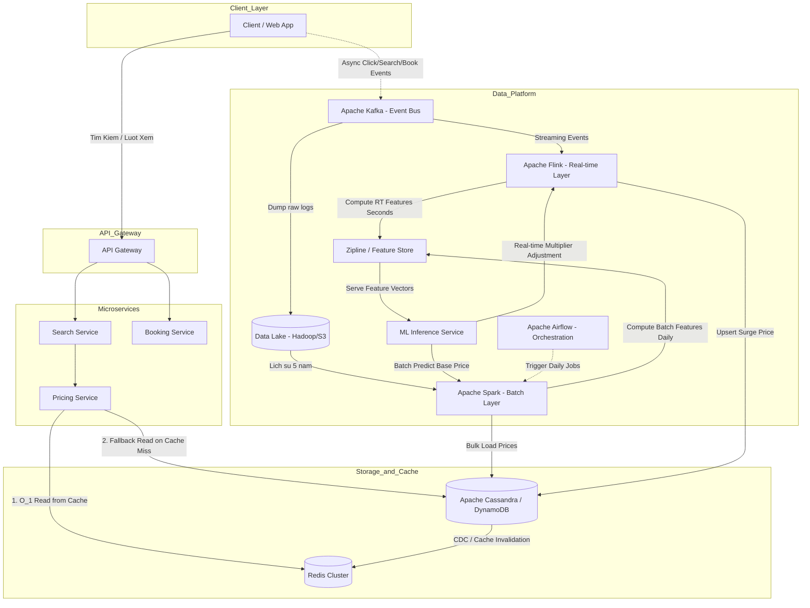

Hệ thống Định giá Động (Dynamic Pricing - hay Smart Pricing) của Airbnb là một trong những kiệt tác System Design trong thế giới công nghệ, thể hiện sự kết hợp hoàn hảo giữa Software Engineering, Data Engineering và Machine Learning. Mục tiêu cốt lõi của hệ thống này là tự động gợi ý mức giá thuê phòng tối ưu nhất cho Host (chủ nhà) cho từng đêm riêng biệt trong tương lai, nhằm đạt được sự cân bằng tinh tế giữa tỷ lệ lấp đầy (Booking Probability) và cực đại hóa doanh thu (Revenue Maximization), đồng thời mang lại mức giá cạnh tranh cho khách thuê (Guest).

Trong bài viết chuyên sâu này, chúng ta sẽ tiến hành "mổ xẻ" kiến trúc hệ thống đằng sau Smart Pricing, đi từ cách định nghĩa bài toán nghiệp vụ, phác thảo luồng dữ liệu (Data Pipeline) theo mô hình Lambda/Kappa, đến thiết kế cơ sở dữ liệu phân tán (Distributed Storage) và các cơ chế Machine Learning phục vụ theo thời gian thực ở quy mô toàn cầu.

---

## 1. Bài Toán Thách Thức (The Core Engineering Challenges)

Việc xây dựng mô hình định giá tại Airbnb chứa đựng sự phức tạp vượt xa so với hệ thống surge pricing (tăng giá giờ cao điểm) của Uber hay Grab, hoặc hệ thống định giá sản phẩm trên Amazon. Để thiết kế một kiến trúc phù hợp, các kỹ sư phải đối mặt với 4 rào cản kỹ thuật chính:

1. **Tính độc bản của sản phẩm (Extreme Uniqueness / Non-Fungibility)**: Khác với ứng dụng gọi xe (một chiếc Toyota Vios ở quận 1 mang lại trải nghiệm tương đương một chiếc Toyota Vios khác), phòng của Airbnb là sản phẩm độc nhất vô nhị. Một căn hộ ở trung tâm Paris, có view tháp Eiffel, trang trí theo phong cách vintage sẽ hoàn toàn khác biệt so với một căn hộ kế bên nhưng có thiết kế hiện đại và không có ban công. Không có hai căn phòng nào thay thế hoàn hảo cho nhau 100%. Điều này khiến bài toán Machine Learning mất đi lợi thế từ luật số lớn đối với một mã sản phẩm cụ thể.
2. **Dữ liệu cực kỳ thưa thớt (Data Sparsity)**: Một căn phòng cho một đêm cụ thể chỉ có thể được đặt **1 lần duy nhất** (trạng thái nhị phân: 1 - booked, hoặc 0 - unbooked). Bạn không thể bán 100 lần cùng một đêm. Do đó, thuật toán không thể học theo cách quan sát lượng sales liên tục như trong E-commerce.
3. **Độ trễ thời gian và tính ngẫu nhiên (Lead Time & Seasonality)**: Nhu cầu đặt phòng thay đổi phi tuyến tính theo số ngày trước thời điểm Check-in (Lead Time). Khách hàng công tác (Business travelers) có xu hướng sẵn sàng chấp nhận giá cao nếu đặt sát ngày (last-minute booking), trong khi Host có thể muốn kích hoạt chế độ "xả hàng" giảm giá mạnh để tránh để phòng trống đêm nay. Bên cạnh đó, các yếu tố mùa vụ (Seasonality), cuối tuần, ngày lễ là các biến số khổng lồ.
4. **Quy mô hệ thống khổng lồ (Massive Scale & Throughput)**: Giả sử nền tảng Airbnb duy trì khoảng 7 triệu listings (nhà/phòng) đang hoạt động. Hệ thống phải tính toán trước giá cho tối đa 365 đêm tương lai cho mỗi listing.
   $$ 7,000,000 \text{ listings} \times 365 \text{ ngày} \approx 2.55 \text{ tỷ mức giá} $$
   Hơn 2.5 tỷ mức giá (price points) này không được đứng im; chúng phải được cập nhật hàng ngày bằng hệ thống Batch, và có khả năng thay đổi chỉ trong vài giây theo thời gian thực (Real-time Streaming) khi có một sự kiện bất thường nổ ra (ví dụ: bão làm đổi hướng chuyến bay, hoặc một ban nhạc nổi tiếng đột ngột thông báo tổ chức concert).

---

## 2. Kiến Trúc Hệ Thống Tổng Quan (High-Level Architecture)

Để đáp ứng khối lượng công việc khổng lồ, Airbnb đã thiết kế hệ thống theo mô hình Event-Driven Microservices, phân tách một cách rạch ròi giữa luồng Đọc (Read Path - phục vụ người dùng) có độ trễ siêu thấp và luồng Ghi (Write Path - tính toán giá từ Data Pipeline) có throughput cực cao.



*(Sơ đồ mô tả kiến trúc Microservices kết hợp Data Platform của hệ thống định giá)*

### A. Luồng Đọc (Read Path) - Khách hàng tìm kiếm phòng
1. Khi khách hàng nhập địa điểm và chọn khoảng thời gian check-in/check-out, yêu cầu đi qua **API Gateway** tới **Search Service** (thường được back bởi Elasticsearch để lấy danh sách listings).
2. Từng listing sau đó gọi vào **Pricing Service** để hiển thị mức giá cuối cùng (đã bao gồm phí nền tảng, phí dọn dẹp, thuế).
3. Vì Search API phải trả về hàng chục listing trong nháy mắt, `Pricing Service` bắt buộc phải có độ trễ cực thấp (< 50ms). Nó sử dụng **Redis Cluster** làm lớp Caching.
4. Nếu xảy ra Cache Miss, hệ thống mới tiến hành truy vấn vào Database gốc (**Apache Cassandra** hoặc **Amazon DynamoDB**) và lưu ngược lại vào Redis (Cache-Aside pattern).

### B. Luồng Ghi (Write Path) - Khởi tạo và cập nhật hàng tỷ mức giá
Để tránh làm sập database phục vụ người dùng, 2.5 tỷ mức giá được tính toán song song phía sau hậu trường bằng các cụm Distributed Computing (Spark), lưu thành các bản ghi cứng (Pre-computed) và nạp (Bulk Load) vào hệ thống Storage trong các khoảng thời gian off-peak (ít người truy cập).

---

## 3. Deep Dive: Kiến Trúc Data Pipeline (Luồng Dữ Liệu)

Kiến trúc luồng dữ liệu xử lý định giá của Airbnb là một ví dụ kinh điển về việc ứng dụng kiến trúc **Lambda Architecture** kết hợp cùng Data Lakehouse hiện đại. Nó giải quyết triệt để sự cân bằng giữa tính chính xác của dữ liệu lịch sử và tính thời sự của dữ liệu thời gian thực.

### 3.1. Lớp Lịch Sử (Batch Layer - Spark & S3)
Mỗi ngày, một luồng (DAG) hàng trăm jobs được điều phối bởi **Apache Airflow** sẽ khởi chạy. Hàng chục Terabyte dữ liệu (logs hệ thống, lịch sử đặt phòng năm ngoái, lịch calendar, review của khách hàng) được kéo từ Data Warehouse (Apache Hive / Presto trên nền Amazon S3) vào các cụm máy chủ **Apache Spark**.

Spark đảm nhận vai trò Feature Engineering (trích xuất đặc trưng) rất nặng nề. Hàng trăm Feature được tạo ra, chia thành các nhóm:
- **Listing Features**: Phòng có bao nhiêu giường, review rate bao nhiêu, cách ga tàu điện bao xa.
- **Temporal Features**: Tính chất mùa vụ, có phải cuối tuần, lead_time (còn bao nhiêu ngày tới lúc checkin).
- **Market / Geo Features**: Mật độ cạnh tranh xung quanh, `occupancy_rate_30d` (tỷ lệ lấp đầy trong khu vực 30 ngày qua).

**Ví dụ Code Snippet (PySpark) tính toán Feature Base (Tỷ lệ lấp đầy khu vực):**

```python
from pyspark.sql import SparkSession
from pyspark.sql.functions import col, sum, count, when
from pyspark.sql.window import Window

# Khởi tạo Spark Session với cấu hình phân tán
spark = SparkSession.builder \
    .appName("Airbnb_Smart_Pricing_Feature_Pipeline") \
    .config("spark.sql.shuffle.partitions", 1000) \
    .getOrCreate()

# Đọc dữ liệu sự kiện booking từ S3 Data Lake
df_bookings = spark.read.parquet("s3a://airbnb-datalake/core/bookings/")

# Window function: Phân tích cửa sổ trượt (Sliding Window) trong 30 ngày qua cho từng khu vực địa lý
windowSpec = Window.partitionBy("geo_hash_level_6") \
                   .orderBy(col("calendar_date").cast("timestamp").cast("long")) \
                   .rangeBetween(-30 * 86400, 0) # Lùi 30 ngày tính bằng giây

df_features = df_bookings.withColumn(
    "neighborhood_booked_rooms", sum(when(col("status") == "CONFIRMED", 1).otherwise(0)).over(windowSpec)
).withColumn(
    "neighborhood_total_rooms", count("listing_id").over(windowSpec)
).withColumn(
    "occupancy_rate_30d", 
    col("neighborhood_booked_rooms") / col("neighborhood_total_rooms")
)

# Ghi dữ liệu Feature đã tính xong vào Feature Store để phục vụ ML Inference
df_features.write.mode("overwrite").parquet("s3a://airbnb-feature-store/geo/occupancy_30d/")
```

### 3.2. Lớp Thời Gian Thực (Real-time / Stream Processing Layer)

Điều gì xảy ra nếu hôm nay siêu sao Taylor Swift bất ngờ thông báo tổ chức sự kiện "The Eras Tour" tại thành phố của bạn? Lượng Search sẽ tăng vọt 500-1000% chỉ trong vài giờ. Lớp Batch chạy vào lúc 2 giờ sáng mỗi ngày sẽ hoàn toàn "mù tịt" và phản ứng quá chậm, khiến Host lỡ mất cơ hội tối đa hóa lợi nhuận.

- Ở đây, **Apache Kafka** đóng vai trò là "hệ thần kinh trung ương" (Message Broker). Mọi lượt click, search, và pageview của khách hàng trên toàn cầu đều được đẩy ngay lập tức vào Kafka topics.
- **Apache Flink** (hoặc Spark Streaming) tiêu thụ luồng sự kiện này với độ trễ tính bằng mili-giây.
- Thuật toán Flink sẽ áp dụng logic **Tumbling/Sliding Window** (Ví dụ: Cửa sổ thời gian 10 phút trượt mỗi 2 phút) để giám sát tỷ lệ Search/Book.
- Nếu thuật toán phát hiện tỷ lệ Search Query về một toạ độ cụ thể (bounding box) vượt ngưỡng trung bình lịch sử (Z-score anomaly detection), hệ thống định giá nhận diện đây là **"Nhu cầu tăng vọt" (Demand Surge / Anomaly)**.
- ML service lập tức kích hoạt, nhân Mức giá cơ sở (Base Price) với một **Hệ số Phụ thu (Surge Multiplier)** (ví dụ: $1.4x$) và đẩy trực tiếp vào DB, đè lên giá trị đã chạy trong luồng Batch.

**Ví dụ Flink SQL phát hiện Anomaly trong thời gian thực:**

```sql
-- Đếm số lượt search mỗi 10 phút theo bounding box của thành phố
SELECT 
    geo_hash_id,
    TUMBLE_START(event_time, INTERVAL '10' MINUTE) as window_start,
    COUNT(search_id) as search_volume
FROM user_search_events
GROUP BY 
    TUMBLE(event_time, INTERVAL '10' MINUTE), 
    geo_hash_id
HAVING COUNT(search_id) > 10000; -- Ngưỡng trigger báo động tăng giá tự động
```

---

## 4. Feature Store (Zipline) & Vấn Đề Training-Serving Skew

Một trong những đóng góp mang tính di sản của đội ngũ Data tại Airbnb cho cộng đồng là triết lý về **Feature Store** (họ tự xây dựng hệ thống mang tên **Zipline**, thành phần nòng cốt của nền tảng ML Bighead).

Trong quá trình triển khai mô hình vào thực tế, các ML Engineer gặp phải cơn ác mộng mang tên **Training-Serving Skew** (Sự sai lệch giữa môi trường Huấn luyện và môi trường Chạy thật).
- Khi **Train model**: Data Scientist viết code SQL lấy dữ liệu lịch sử từ Hadoop.
- Khi **Serve (Production)**: Backend Engineer viết lại logic đó bằng Java/Go đọc từ Redis để phản hồi realtime.
Chỉ cần logic đếm số ngày bị lệch múi giờ (Timezone issue) hoặc filter khác nhau một dòng code, model sẽ đưa ra dự đoán hoàn toàn sai lầm.

**Kiến trúc Zipline giải quyết triệt để bằng cơ chế:**
1. **Single Source of Truth**: Khai báo Feature một lần duy nhất bằng ngôn ngữ DSL (Domain Specific Language).
2. **Tự động sinh Code**: Từ DSL, Zipline tự động biên dịch (compile) ra Spark jobs để sinh dữ liệu Train (Batch) và sinh code Flink để bắt dữ liệu Realtime.
3. **Point-in-Time Correctness (Time-travel)**: Khi huấn luyện model trên dữ liệu booking ngày `15/06/2023`, Zipline đảm bảo hệ thống chỉ được cung cấp Feature `occupancy_rate` tính đến chính xác `23:59:59 ngày 14/06/2023`. Việc rò rỉ dữ liệu tương lai (Data Leakage - ví dụ model nhìn thấy phòng bị huỷ vào ngày 16 để đưa ra quyết định ngày 15) sẽ bị chặn đứng hoàn toàn.

---

## 5. Thiết Kế Cơ Sở Dữ Liệu & Chiến Lược Caching

Việc thiết kế Storage Layer lưu trữ hơn 2.5 tỷ bản ghi có đặc thù Write-Heavy (ghi lượng lớn dữ liệu mỗi đêm từ luồng Batch) yêu cầu một kiến trúc phân tán phi tập trung. **Apache Cassandra** là ứng cử viên sáng giá nhất (Apple và Netflix cũng dùng Cassandra cho các use case tương tự).

### 5.1. Thiết Kế Schema (Cassandra CQL)

Để đảm bảo tốc độ đọc O(1) và hỗ trợ Range Queries (khi người dùng mở giao diện Lịch để xem giá cả tháng), Data Modeling trong NoSQL là yếu tố sống còn:

```sql
CREATE TABLE airbnb_pricing.listing_prices_by_date (
    listing_id UUID,
    calendar_date DATE,
    base_price DECIMAL,
    surge_multiplier DECIMAL,
    final_calculated_price DECIMAL,
    currency VARCHAR,
    min_stay_requirement INT,
    last_updated TIMESTAMP,
    PRIMARY KEY ((listing_id), calendar_date)
) WITH CLUSTERING ORDER BY (calendar_date ASC)
  AND compaction = {'class': 'TimeWindowCompactionStrategy', 'compaction_window_size': '7', 'compaction_window_unit': 'DAYS'};
```

**Phân tích kỹ thuật chuyên sâu:**
- **Partition Key (`listing_id`)**: Đảm bảo toàn bộ giá của 365 ngày tương lai của một căn phòng được băm (hash) và lưu trữ vật lý trên **cùng một Node (replica)** trong cụm Cluster. Điều này ngăn chặn hiện tượng Network Hop qua nhiều server khi truy vấn lịch của 1 phòng.
- **Clustering Key (`calendar_date ASC`)**: Dữ liệu bên trong một phân vùng được sắp xếp liên tục trên ổ đĩa từ ngày hiện tại tới tương lai. Khi API gọi: `WHERE listing_id='X' AND calendar_date >= '2024-07-01' AND calendar_date <= '2024-07-31'`, Cassandra chỉ tốn một thao tác nhảy đĩa cứng (Disk Seek) và quét tuần tự (Sequential Read), mang lại tốc độ cực độ.
- **Compaction Strategy**: Dùng `TimeWindowCompactionStrategy` (TWCS) thay vì SizeTiered chuẩn, vì dữ liệu giá trị của ngày quá khứ sẽ trở nên vô giá trị và bị xoá (TTL expiration) hàng loạt rất dễ dàng, tối ưu hoá I/O.

### 5.2. Chống Hiện Tượng "Đàn Bò Giẫm Đạp" (Thundering Herd)
Spark có thể tính ra hàng tỷ mức giá trong 30 phút. Nếu Spark trực tiếp gọi lệnh `UPDATE` vào Redis, Redis sẽ sập ngay tức khắc bởi hàng triệu kết nối song song (Thundering herd).
- Giải pháp: Spark nạp dữ liệu xuống Cassandra (Bulk Load/SSTable injection rất thân thiện với Cassandra). Sau đó, Cassandra sử dụng cơ chế **Change Data Capture (CDC)** bắn log thay đổi qua Kafka. Các cụm Consumer nhỏ bé sẽ chậm rãi đọc Kafka và Invalidate (xoá bỏ) các key bị cũ trong Redis theo một tốc độ được kiểm soát (Rate Limited).

---

## 6. Mô Hình Học Máy & Bài Toán Tối Ưu Hóa (Machine Learning Optimization)

Mô hình định giá của Airbnb không đơn thuần là mô hình Hồi quy (Regression) dự đoán ra một con số cố định, mà là một bài toán **Tối ưu hoá Kỳ vọng (Expected Value Optimization)** kết hợp với lý thuyết Trò chơi kinh tế.

Mục tiêu là tìm ra $Price$ (Mức giá) sao cho $E[\text{Revenue}]$ (Doanh thu kỳ vọng) lớn nhất:
$$ E[\text{Revenue}] = Price \times P(\text{booking} | Price, Features) $$

1. **Dự đoán đường cong Cầu (Demand Curve Model)**: Sử dụng các mô hình Tree-based (XGBoost, LightGBM) hoặc Deep Neural Networks để dự đoán xác suất lấp đầy. Nếu thuật toán đặt giá $100, xác suất được thuê là 80%. Nếu tăng lên $150, xác suất thuê rớt thê thảm xuống 30%. Hàm mục tiêu sẽ tự động giải phương trình để tìm đỉnh Parabol của kỳ vọng doanh thu.
2. **Cold Start Problem (Vấn đề Khởi động Lạnh)**: Một căn hộ mới tinh vừa đăng ký trên hệ thống, chưa có lượt review hay lịch sử giá nào thì định giá sao? Thuật toán sẽ dùng **Embedding** (nhúng vector hình ảnh từ Computer Vision lên ảnh chụp căn nhà) và KNN (K-Nearest Neighbors) để map căn nhà mới này với một cụm (cluster) các căn nhà tương đồng nhất trong khu vực để "mượn" dữ liệu Base Price.
3. **Thuật Toán Multi-Armed Bandit (MAB)**: Việc giữ nguyên thuật toán sẽ khiến hệ thống mắc kẹt trong "Local Optima" (tối ưu cục bộ). Bằng thuật toán Bandit (ví dụ: epsilon-greedy hoặc Thompson Sampling), hệ thống luôn dành ra một tỷ lệ nhỏ (Explore) để chủ động đưa ra các mức giá hơi lệch chuẩn nhằm theo dõi phản ứng của thị trường, và từ đó thu thập dữ liệu nhãn (Label) mới để tái huấn luyện bản thân (Exploit).

---

## 7. Khả Năng Phục Hồi & Đánh Giá Đáng Tin Cậy (Resilience & A/B Testing)

### 7.1. Graceful Degradation & Idempotency
Trong hệ thống quy mô hành tinh, thiết kế dựa trên nguyên lý "Everything fails all the time" (Mọi thứ đều có thể và sẽ hỏng hóc).
- Nếu Cụm Spark chạy Feature bị lỗi (Out Of Memory) lúc 3h sáng, hệ thống lập tức thực thi cơ chế **Fallback**. API Pricing sẽ tiếp tục dùng Mức giá cũ của ngày hôm qua lưu trong Cassandra, hoặc sử dụng Mức giá cố định (Static Base) do chính Host điền tay từ trước. Việc hiển thị giá hơi cũ vẫn tốt hơn hàng nghìn lần việc hệ thống quăng lỗi HTTP 500 trắng màn hình làm mất khách.
- **Idempotency (Tính luỹ đẳng)**: Pipeline tính giá có thể bị restart giữa chừng. Thiết kế của Spark ghi đè (Overwrite) lên partition của Date, và Cassandra sử dụng toán tử Upsert, đảm bảo chạy job 1 lần hay 100 lần thì dữ liệu DB cuối cùng vẫn y hệt nhau, không bao giờ bị tính trùng (duplicate data).

### 7.2. Network Effects trong A/B Testing
Làm thế nào Airbnb biết mô hình ML mới (Mô hình B) sinh lời nhiều hơn mô hình cũ (Mô hình A)?
A/B testing thông thường (chia user 50-50) sẽ thất bại thảm hại ở đây vì hiệu ứng mạng (Network Effect / Cannibalization). Nếu mô hình B giảm giá căn phòng X, nó sẽ lấy mất khách hàng của căn phòng Y (thuộc mô hình A).
Để khắc phục, đội ngũ Data Science dùng phương pháp **Market-level switchbacks** hoặc **Cluster-based Randomization** (Chuyển đổi toàn bộ một thành phố sang mô hình B trong tuần 1, sau đó đảo lại trong tuần 2, kết hợp với các thuật toán Causal Inference - Suy luận nhân quả để khử nhiễu từ xu hướng thị trường).

---

## Tổng Kết Bài Học System Design

Thông qua việc bóc tách Case Study Smart Pricing của Airbnb, chúng ta nhận ra rằng System Design hiện đại không còn đóng khung trong ranh giới Backend truyền thống (xoay quanh API/Database/Load Balancer). Ở kỷ nguyên của AI/Data:
- **Data Engineering** đóng vai trò kiến tạo hệ thống huyết mạch, di chuyển khối lượng dữ liệu khổng lồ giữa hai thái cực Batch và Real-time.
- **Machine Learning** là trung tâm "não bộ", nơi các thuật toán toán học giải quyết bài toán tối ưu trên môi trường cực độ phi tuyến tính.
- **Software Architecture & Distributed Systems** là cơ bắp đảm bảo hệ thống có thể scale ra hàng vạn node, duy trì độ trễ mili-giây, chống chọi Thundering Herd và duy trì sự luỹ đẳng khi gặp sự cố.

Tất cả đã hợp nhất thành một kiệt tác biến nền tảng trung gian kết nối lưu trú trở thành cỗ máy định giá bất động sản tự động lớn nhất thế giới.

---

## Tài Liệu Tham Khảo Chuyên Sâu
* [Designing Data-Intensive Applications - Martin Kleppmann (O'Reilly)](https://dataintensive.net/) - Must-read về Distributed Data Systems.
* [System Design Interview - Alex Xu (Tập 1 & 2)](https://bytebytego.com/)
* **Airbnb Engineering & Data Science Blog**: Các bài phân tích về Zipline, Bighead và Data Quality.
* Báo cáo nghiên cứu (KDD 2018): *Customized Regression Model for Airbnb Dynamic Pricing*.
* Kiến trúc Kappa & Lambda trong **Hadoop: The Definitive Guide**.
